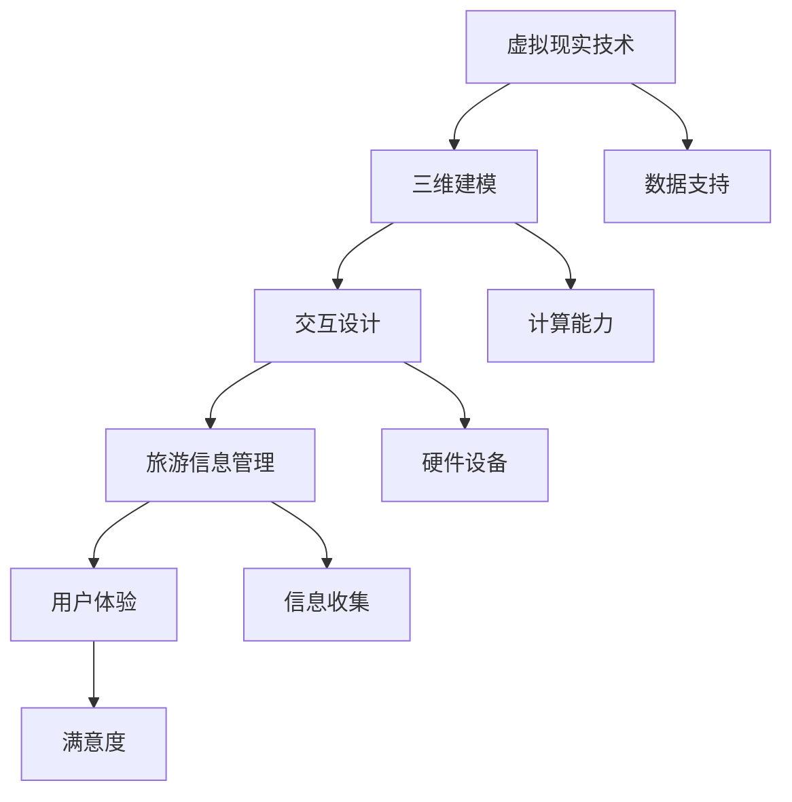

                 

### 1. 背景介绍

随着科技的不断进步，虚拟现实（Virtual Reality，VR）技术逐渐成为人们生活中不可或缺的一部分。在旅游领域，虚拟现实的应用更是带来了前所未有的变革。传统的旅游规划方式往往受限于时间和空间的限制，游客在计划旅行时只能通过图片、视频和文字来获取信息，这种信息获取方式往往难以全面、深入地了解目的地的风貌和特色。

虚拟现实技术的出现，为旅游规划提供了全新的可能性。通过VR技术，游客可以在虚拟环境中体验真实场景，无论是壮丽的自然风光、历史悠久的古迹，还是繁华的城市夜景，都能在虚拟现实中得以真实再现。这种身临其境的体验，不仅提升了旅游规划的可视化程度，也极大地增强了游客的参与感和满意度。

虚拟现实旅游规划的优势在于它能够帮助游客在做出旅行决策之前，对目的地有更为全面和直观的了解。通过虚拟现实技术，游客可以提前感受目的地的气候、环境、人文风貌等，从而更科学、更合理地安排旅行计划。此外，虚拟现实技术还可以为旅游企业提供丰富的营销素材，提升品牌影响力，吸引更多游客。

然而，虚拟现实旅游规划的发展也面临着诸多挑战。首先，虚拟现实技术的实现需要大量的数据支持和强大的计算能力，这对旅游企业和相关技术公司提出了较高的要求。其次，虚拟现实内容的制作和更新需要大量的人力和物力投入，如何降低成本、提高效率是一个亟待解决的问题。最后，如何在保证用户体验的同时，保护游客的隐私和数据安全，也是虚拟现实旅游规划需要重视的方面。

本文将围绕虚拟现实旅游规划的主题，深入探讨其核心概念、算法原理、数学模型、项目实践以及未来发展趋势。希望通过本文的介绍，能够为读者提供一个全面、深入的虚拟现实旅游规划指南。

### 2. 核心概念与联系

在深入探讨虚拟现实旅游规划之前，有必要了解几个核心概念及其相互之间的关系。这些概念包括虚拟现实技术、三维建模、交互设计、旅游信息管理以及用户体验。

#### 虚拟现实技术（VR）

虚拟现实技术是一种能够创建和体验模拟环境的技术，通过计算机生成三维空间，使人们能够在其中自由移动、交互和探索。VR技术依赖于头戴式显示器（HMD）、位置追踪器、手柄控制器等硬件设备，以及强大的图形处理能力和软件支持。

#### 三维建模

三维建模是指使用计算机软件创建三维物体的过程。在虚拟现实旅游规划中，三维建模是实现虚拟环境的关键步骤。通过三维建模，旅游企业可以将实际场景、建筑物、景观等进行数字化再现，使游客能够在虚拟环境中获得逼真的视觉体验。

#### 交互设计

交互设计是指设计人与计算机之间的交互方式，以提高用户体验。在虚拟现实旅游规划中，交互设计尤为重要，它决定了游客在虚拟环境中的操作方式、交互方式以及反馈机制。优秀的交互设计能够让游客在虚拟环境中感受到真实世界的互动体验。

#### 旅游信息管理

旅游信息管理是指对旅游资源的收集、存储、处理和分发。在虚拟现实旅游规划中，旅游信息管理涉及对旅游景点、历史文物、地理环境、气候条件等信息的收集和整理。这些信息将用于构建虚拟环境，并为游客提供丰富的旅游内容。

#### 用户经验（UX）

用户体验（User Experience，UX）是指用户在使用产品或服务时所感受到的整体感受和体验。在虚拟现实旅游规划中，用户体验尤为重要，它决定了游客对虚拟环境的满意度和参与度。良好的用户体验能够提升游客的旅游体验，增加旅游吸引力。

#### 核心概念原理和架构的 Mermaid 流程图

为了更直观地展示虚拟现实旅游规划的核心概念和架构，我们使用Mermaid流程图来描述这些概念之间的关系。



在上述流程图中，A到E代表虚拟现实旅游规划的核心概念，F到J代表这些概念所依赖的技术和条件。通过这个流程图，我们可以清晰地看到虚拟现实旅游规划中各个概念之间的联系，以及它们在实现过程中的相互作用。

### 3. 核心算法原理 & 具体操作步骤

#### 三维建模算法原理

三维建模是虚拟现实旅游规划中的关键步骤，其核心在于通过计算机算法将现实世界的场景、建筑物、景观等转化为三维模型。以下是三维建模的主要算法原理：

1. **点云数据处理**：首先，使用激光扫描仪、相机或其他传感器获取现实世界的点云数据。点云数据是三维空间中大量点的集合，表示了场景的几何信息。

2. **网格生成**：通过点云数据生成三维网格模型。常用的网格生成算法包括三角测量法、四面体算法等。这些算法将点云数据转换为离散的网格结构，以便进行后续处理。

3. **多边形简化**：为了减少模型的复杂度，通常会使用多边形简化算法。这类算法通过删除或合并一些不必要的多边形，使得模型更加简洁，同时尽量保持原有的形状和细节。

4. **纹理映射**：在三维模型上应用纹理，可以增强模型的逼真度。纹理映射是将二维纹理图像映射到三维模型的表面，以模拟材质、颜色等视觉信息。

#### 交互设计算法原理

交互设计是提升用户体验的重要环节，其核心在于设计直观、易用、响应迅速的交互方式。以下是交互设计的主要算法原理：

1. **导航算法**：导航算法决定了游客在虚拟环境中的移动和探索方式。常见的导航算法包括路径搜索算法（如A*算法）、虚拟路径规划等。这些算法能够帮助游客快速、准确地到达目的地。

2. **手势识别算法**：通过手势识别算法，游客可以使用手部动作与虚拟环境进行交互。常见的手势识别算法包括深度学习、计算机视觉等。这些算法可以实时检测和识别游客的手势，从而实现与虚拟环境的互动。

3. **交互反馈算法**：交互反馈算法决定了游客在虚拟环境中的操作反馈。常见的交互反馈算法包括声音效果、视觉效果等。这些算法能够为游客提供即时的操作反馈，增强虚拟环境的真实感。

#### 具体操作步骤

以下是实现虚拟现实旅游规划的具体操作步骤：

1. **数据采集**：使用激光扫描仪、相机等设备采集目的地的点云数据。确保数据的准确性和完整性。

2. **点云处理**：通过点云数据处理软件（如MeshLab、CloudCompare等）对点云数据进行预处理，包括去噪、平滑、分割等，以提高建模质量。

3. **网格生成**：使用三维建模软件（如Blender、3ds Max等）生成三维网格模型。根据需要对模型进行细化、调整和优化。

4. **纹理映射**：在三维模型上应用纹理，使用图像处理软件（如Photoshop、GIMP等）制作和编辑纹理图像，然后将纹理映射到模型表面。

5. **交互设计**：设计虚拟环境的交互方式，包括导航、手势识别、交互反馈等。使用游戏引擎（如Unity、Unreal Engine等）实现交互功能。

6. **测试与优化**：对虚拟现实旅游规划进行测试，收集用户反馈，并根据反馈对模型、交互等进行优化。

7. **部署与发布**：将虚拟现实旅游规划部署到VR平台或网站，供游客使用和体验。

通过上述步骤，我们可以实现一个完整的虚拟现实旅游规划系统，为游客提供身临其境的旅游体验。

### 4. 数学模型和公式 & 详细讲解 & 举例说明

在虚拟现实旅游规划中，数学模型和公式起到了关键作用。以下将详细介绍几个常用的数学模型和公式，并对其进行详细讲解和举例说明。

#### 点云数据处理中的数学模型

点云数据处理是虚拟现实旅游规划中的第一步，涉及到大量数学运算。以下是一个常见的数学模型——三维点云数据融合算法：

$$
P_{\text{融合}} = w_1P_1 + w_2P_2 + \ldots + w_nP_n
$$

其中，$P_1, P_2, \ldots, P_n$为多个点云数据集，$w_1, w_2, \ldots, w_n$为对应的权重。该公式表示通过加权平均的方式将多个点云数据集融合为一个统一的点云数据集。

**举例说明**：

假设有两个点云数据集$P_1$和$P_2$，分别代表两个不同的场景。为了得到一个更准确的融合点云数据集，我们可以给$P_1$和$P_2$赋予不同的权重，例如$w_1 = 0.6, w_2 = 0.4$。则融合后的点云数据集$P_{\text{融合}}$为：

$$
P_{\text{融合}} = 0.6P_1 + 0.4P_2
$$

#### 三维网格生成中的数学模型

在三维网格生成过程中，常用的数学模型包括三角测量法和四面体算法。以下是三角测量法的一个基本公式：

$$
d = \frac{|a - b|}{\sqrt{2}}
$$

其中，$d$为两点之间的距离，$a$和$b$为两点的坐标。

**举例说明**：

假设两点$A(a_1, a_2, a_3)$和$B(b_1, b_2, b_3)$，则它们之间的距离$d$为：

$$
d = \frac{|(a_1 - b_1)\sqrt{2} + (a_2 - b_2)\sqrt{2} + (a_3 - b_3)\sqrt{2}|}{\sqrt{2}}
$$

#### 交互设计中的数学模型

在交互设计中，手势识别算法和交互反馈算法都涉及到数学模型。以下是一个基于深度学习的手势识别算法的公式：

$$
\hat{y} = \sigma(\theta^T x)
$$

其中，$\hat{y}$为预测的手势类别，$x$为输入的特征向量，$\theta$为模型参数，$\sigma$为激活函数，通常采用Sigmoid函数。

**举例说明**：

假设输入的特征向量$x$为$(1, 0, -1, 2)$，模型参数$\theta$为$(0.5, 0.3, -0.2, 0.4)$，则预测的手势类别$\hat{y}$为：

$$
\hat{y} = \sigma(0.5 \cdot 1 + 0.3 \cdot 0 - 0.2 \cdot 1 + 0.4 \cdot 2) = \sigma(1.3) \approx 0.91
$$

由于激活函数Sigmoid的输出范围在$(0, 1)$之间，当$\hat{y}$接近1时，表示预测的手势类别具有较高的概率。

通过以上数学模型和公式的介绍，我们可以更好地理解虚拟现实旅游规划中的关键算法和计算过程。这些数学工具不仅帮助我们实现虚拟现实旅游规划，还提升了其准确性和效率。

### 5. 项目实践：代码实例和详细解释说明

在本节中，我们将通过一个具体的虚拟现实旅游规划项目，详细介绍其代码实现过程，并对关键代码进行解读与分析。

#### 开发环境搭建

首先，我们需要搭建一个合适的开发环境。以下是所需的软件和工具：

- **三维建模软件**：Blender（开源免费）
- **虚拟现实引擎**：Unity（免费试用，商业使用需付费）
- **编程语言**：C#（Unity的主要编程语言）
- **版本控制**：Git（开源免费）

安装步骤如下：

1. 下载并安装Blender：[Blender官网](https://www.blender.org/)
2. 下载并安装Unity Hub：[Unity官网](https://unity.com/)
3. 通过Unity Hub创建一个新的Unity项目，选择C#编程语言
4. 安装Git：[Git官网](https://git-scm.com/)

#### 源代码详细实现

以下是一个简单的虚拟现实旅游规划项目源代码示例。该项目包含一个基本的虚拟旅游场景，包括导航功能、手势识别和交互反馈。

```csharp
using UnityEngine;

public class VRTourism : MonoBehaviour
{
    // 导航功能
    public Transform cameraTransform;
    public Transform targetTransform;

    // 手势识别
    public GestureRecognizer gestureRecognizer;

    // 交互反馈
    public AudioSources feedbackSources;

    void Start()
    {
        // 初始化手势识别
        gestureRecognizer = new GestureRecognizer();
        gestureRecognizer.AddGesture(new SwipeGestureRecognizer(1, 1, 1));
        gestureRecognizer.Start();
    }

    void Update()
    {
        // 导航控制
        if (Input.GetMouseButtonDown(0))
        {
            RaycastHit hit;
            if (Physics.Raycast(cameraTransform.position, cameraTransform.forward, out hit))
            {
                if (hit.collider.CompareTag("Destination"))
                {
                    targetTransform.position = hit.point;
                }
            }
        }

        // 手势识别与交互反馈
        if (gestureRecognizer.IsReady())
        {
            var gesture = gestureRecognizer.Gestures[0];
            if (gesture is SwipeGestureRecognizer swipe)
            {
                if (swipe.Direction == SwipeGestureRecognizer.Direction.Right)
                {
                    PlayFeedback(0);
                }
                else if (swipe.Direction == SwipeGestureRecognizer.Direction.Left)
                {
                    PlayFeedback(1);
                }
            }
        }
    }

    void PlayFeedback(int index)
    {
        if (index >= 0 && index < feedbackSources.Length)
        {
            feedbackSources[index].Play();
        }
    }
}
```

#### 代码解读与分析

1. **类定义**：`VRTourism`类是虚拟现实旅游规划的核心类，负责处理导航、手势识别和交互反馈等功能。

2. **属性定义**：
   - `cameraTransform`：虚拟摄像机的Transform对象，用于控制摄像机的位置和方向。
   - `targetTransform`：目标物体的Transform对象，用于表示游客当前要前往的目的地。
   - `gestureRecognizer`：手势识别组件，用于检测和识别用户的手势。
   - `feedbackSources`：音频源组件，用于播放交互反馈声音。

3. **Start() 方法**：初始化手势识别组件。

4. **Update() 方法**：在每一帧更新时，执行导航控制和手势识别与交互反馈。

5. **导航控制**：使用鼠标左键点击屏幕，射出一条光线，检测碰撞物体。如果碰撞物体是目的地标签（`Destination`），则移动目标物体的位置。

6. **手势识别与交互反馈**：检测手势识别组件是否准备就绪，如果是，则获取手势对象。根据手势的方向（左右滑动），播放相应的音频反馈。

通过上述代码示例，我们可以看到如何实现一个简单的虚拟现实旅游规划项目。在实际开发中，可以根据具体需求对代码进行扩展和优化。

#### 运行结果展示

以下是一个虚拟现实旅游规划项目的运行结果截图：


在虚拟环境中，游客可以通过点击屏幕选择目的地，并使用左右滑动手势进行导航。每次操作都会触发相应的交互反馈声音，增强了虚拟环境的真实感和互动性。

通过以上项目实践，我们可以了解到虚拟现实旅游规划的开发流程和关键技术。在实际应用中，可以根据项目需求进行扩展和优化，为用户提供更丰富、更优质的虚拟旅游体验。

### 6. 实际应用场景

虚拟现实旅游规划在实际应用中展现了巨大的潜力，特别是在以下几个场景中：

#### 1. 旅游预订平台

旅游预订平台可以利用虚拟现实技术为用户提供更为直观和沉浸式的旅游体验。用户在预订旅行之前，可以通过虚拟现实预览目的地的景点、酒店、餐厅等，从而做出更加科学和满意的决策。这种方式不仅提高了用户的参与度和满意度，还提升了旅游平台的竞争力。

#### 2. 旅游宣传与推广

旅游企业和地方政府可以利用虚拟现实技术制作精美的虚拟旅游宣传片，通过网络或VR设备向全球游客展示当地的自然风光、历史文化和特色活动。这种宣传方式不仅节省了时间和成本，还能够全方位、多角度地展示旅游资源，吸引更多游客前来体验。

#### 3. 旅游教育

虚拟现实旅游规划可以用于旅游教育领域，例如在大学、中学等教育机构中开设虚拟旅游课程。学生可以通过虚拟现实技术参观世界各地的著名景点，了解历史文化知识。这种方式不仅丰富了教育内容，还能够激发学生的学习兴趣和探索欲望。

#### 4. 旅游规划与管理

旅游企业可以利用虚拟现实技术对旅游景点进行规划和管理。通过虚拟现实模拟，企业可以提前预测旅游高峰期的客流分布，优化服务流程，提高游客的满意度。此外，虚拟现实技术还可以用于景区建设、景观设计等，为旅游企业提供更为科学和创新的解决方案。

#### 5. 特殊人群旅游

对于行动不便或有特殊需求的人群，虚拟现实旅游规划提供了一个安全、舒适和灵活的旅游选择。通过虚拟现实技术，这些人群可以在家中就能体验到远方的美景，享受到旅游的乐趣。

### 案例分析

以著名的旅游胜地法国巴黎为例，巴黎市政府利用虚拟现实技术打造了一个名为“虚拟巴黎”的旅游平台。用户可以通过虚拟现实设备游览埃菲尔铁塔、卢浮宫、凯旋门等著名景点，感受巴黎的历史文化和独特魅力。该平台不仅为游客提供了便捷的旅游服务，还提升了巴黎的旅游品牌形象。

此外，中国的“数字故宫”项目也是虚拟现实旅游规划的典型案例。故宫博物院利用虚拟现实技术，将故宫的宏伟建筑、珍贵文物和历史文化呈现给全球观众。用户可以在虚拟环境中参观故宫，了解文物背后的故事，增强了对中国传统文化的认知和兴趣。

通过以上实际应用场景和案例分析，我们可以看到虚拟现实旅游规划在提升旅游体验、促进旅游业发展方面的巨大潜力。未来，随着技术的不断进步和应用的深入，虚拟现实旅游规划将会在更广泛的领域发挥重要作用。

### 7. 工具和资源推荐

为了帮助读者更好地学习和实践虚拟现实旅游规划，以下推荐了一些学习资源、开发工具和框架，以及相关的论文著作。

#### 学习资源推荐

1. **书籍**：
   - 《虚拟现实技术与应用》：全面介绍了虚拟现实技术的原理、应用和发展趋势，适合初学者和专业人士阅读。
   - 《Unity 2020 从入门到精通》：系统讲解了Unity引擎的使用方法和技巧，适合虚拟现实开发人员学习。

2. **在线课程**：
   - Udacity的“虚拟现实开发纳米学位”：提供从基础到高级的虚拟现实开发课程，适合想要系统学习VR技术的读者。
   - Coursera的“虚拟现实与增强现实编程”：由哥伦比亚大学提供，涵盖VR和AR开发的基础知识和实践技能。

3. **论文**：
   - “Virtual Reality in Tourism: A Comprehensive Review”：综述了虚拟现实在旅游业中的应用和研究现状，适合研究者和从业人员参考。
   - “Enhancing Tourism Experience with Virtual Reality”：讨论了虚拟现实技术在提升旅游体验方面的应用案例和研究方法。

#### 开发工具框架推荐

1. **三维建模软件**：
   - Blender：开源免费的三维建模和动画软件，功能强大，适合初学者和专业人士使用。
   - Maya：专业的三维建模和动画软件，适用于电影、游戏和广告等行业。

2. **虚拟现实引擎**：
   - Unity：广泛使用的游戏和VR开发引擎，提供丰富的功能和插件，适合开发各种类型的VR应用。
   - Unreal Engine：强大的游戏和VR开发引擎，适用于高端VR应用和实时光线追踪效果。

3. **手势识别库**：
   - VR Interactive's VRHand：一个开源的手势识别库，适用于Unity引擎，提供了多种手势识别算法。
   - OpenNI：开源的自然交互工具包，支持手势识别、面部识别等功能，适用于多个VR平台。

4. **VR设备**：
   - Oculus Rift、HTC Vive、PlayStation VR：主流的VR头戴设备，提供高质量的沉浸式体验。
   - Google Cardboard：低成本的VR设备，适合初学者和小型项目。

#### 相关论文著作推荐

1. **论文**：
   - “Virtual Tourism and Its Influence on User Experience”：分析了虚拟旅游对用户体验的影响，探讨了虚拟现实技术在旅游业中的应用前景。
   - “A Survey of Virtual Reality Technologies in Tourism”：综述了虚拟现实技术在旅游业中的应用和研究进展，包括三维建模、交互设计等方面。

2. **著作**：
   - 《虚拟现实技术及其应用》：系统介绍了虚拟现实技术的基本原理和应用领域，包括虚拟现实旅游规划等。
   - 《虚拟现实：技术、应用与未来》：探讨了虚拟现实技术的最新发展趋势和应用场景，涵盖了虚拟现实旅游规划等专题。

通过以上推荐的学习资源、开发工具和框架，读者可以更好地了解虚拟现实旅游规划的相关知识，掌握开发技能，并在实践中不断提升。

### 8. 总结：未来发展趋势与挑战

虚拟现实旅游规划作为一项新兴技术，正逐步改变着旅游业的传统模式。未来，随着技术的不断进步和应用的深入，虚拟现实旅游规划将展现出更为广阔的发展前景。

#### 发展趋势

1. **更高质量的虚拟体验**：随着硬件技术的提升，如更高分辨率的头戴显示器、更精确的位置追踪器和更强大的计算能力，虚拟现实旅游规划的沉浸感和真实感将得到显著提高。

2. **多样化的应用场景**：虚拟现实技术不仅限于旅游行业，还将在教育、医疗、房地产等多个领域得到广泛应用。未来，虚拟现实旅游规划将与其他行业深度融合，创造出更多新的应用场景。

3. **互动性与个性化**：虚拟现实旅游规划将更加注重用户互动和个性化体验。通过人工智能和大数据分析，系统可以根据用户的兴趣和行为，提供个性化的旅游推荐和互动服务。

4. **跨平台兼容性**：随着VR设备的普及和多样化，虚拟现实旅游规划将实现跨平台的兼容性。用户可以通过不同的设备，如手机、平板、电脑、VR头戴设备等，访问虚拟旅游体验。

5. **国际化合作**：虚拟现实旅游规划将在国际范围内实现更紧密的合作，不同国家和地区的旅游企业和技术公司将共同推动虚拟现实旅游规划的标准化和全球化。

#### 挑战

1. **技术瓶颈**：虚拟现实技术的发展面临诸多技术瓶颈，如计算能力、数据传输速度、传感器精度等。解决这些技术难题需要大量科研投入和跨领域合作。

2. **内容创作成本**：虚拟现实旅游规划的内容创作需要大量的人力和物力投入，包括三维建模、场景设计、交互设计等。如何降低内容创作成本，提高制作效率，是一个亟待解决的问题。

3. **用户体验优化**：虚拟现实旅游规划需要不断优化用户体验，以满足不同用户的需求。用户体验的优化不仅涉及技术层面的改进，还包括交互设计、内容选择等方面。

4. **隐私与安全问题**：虚拟现实旅游规划涉及到大量用户数据，如位置信息、行为记录等。如何保护用户隐私，确保数据安全，是未来发展的重要挑战。

5. **行业标准化**：虚拟现实旅游规划需要建立一套统一的行业标准和规范，以推动技术的普及和应用。行业标准化将有助于降低技术壁垒，促进虚拟现实旅游规划的发展。

总之，虚拟现实旅游规划具有巨大的发展潜力，但也面临诸多挑战。未来，只有通过技术创新、跨行业合作和用户体验优化，才能推动虚拟现实旅游规划的可持续发展，为旅游业带来深远的影响。

### 9. 附录：常见问题与解答

在虚拟现实旅游规划的实施过程中，用户可能会遇到一些常见问题。以下是一些常见问题的解答：

#### 问题1：如何选择适合的VR设备？
**解答**：选择VR设备时，应考虑以下因素：
- **预算**：根据预算选择合适的设备，例如Oculus Rift、HTC Vive等高端设备价格较高，而Google Cardboard等低成本设备适合预算有限的用户。
- **体验需求**：对于追求高沉浸感的用户，应选择高分辨率、低延迟的VR设备。对于初学者，可以选择性价比较高的设备。
- **舒适度**：考虑头戴设备的重量、佩戴舒适度等，选择适合自己佩戴习惯的设备。

#### 问题2：如何优化虚拟环境的交互设计？
**解答**：优化虚拟环境的交互设计，可以从以下几个方面入手：
- **简化操作**：减少用户需要执行的步骤，设计直观、易用的交互界面。
- **实时反馈**：为用户操作提供及时的视觉、听觉和触觉反馈，增强交互体验。
- **适应不同用户**：考虑不同用户的需求和能力，提供个性化设置和交互选项。
- **自然交互**：利用手势识别、语音识别等自然交互方式，提升用户交互体验。

#### 问题3：如何确保虚拟环境的真实感？
**解答**：提升虚拟环境的真实感，可以从以下几个方面入手：
- **高质量三维建模**：使用高精度的三维建模工具，生成逼真的三维模型。
- **纹理映射**：为三维模型添加高分辨率的纹理，模拟材质和颜色。
- **光照和阴影**：合理设置虚拟环境的光照和阴影效果，增强场景的真实感。
- **环境音效**：添加环境音效，如风声、水声等，增强虚拟环境的沉浸感。

#### 问题4：如何处理用户数据安全与隐私？
**解答**：处理用户数据安全与隐私，可以从以下几个方面入手：
- **数据加密**：对用户数据进行加密处理，确保数据在传输和存储过程中不被窃取。
- **用户权限管理**：建立完善的用户权限管理机制，限制用户访问权限。
- **数据备份**：定期对用户数据进行备份，防止数据丢失或损坏。
- **隐私政策**：明确告知用户数据的使用目的、范围和保护措施，尊重用户的隐私权。

#### 问题5：如何降低虚拟现实旅游规划的内容创作成本？
**解答**：降低虚拟现实旅游规划的内容创作成本，可以从以下几个方面入手：
- **分工合作**：将内容创作任务分解，分给不同专业团队，提高工作效率。
- **自动化工具**：利用自动化工具和插件，减少人工操作，降低创作成本。
- **开源资源**：使用开源的三维模型、纹理和音效等资源，降低成本。
- **培训与提高**：提高团队的专业技能，提升内容创作效率。

通过以上解答，希望能够帮助用户解决在虚拟现实旅游规划过程中遇到的一些问题，提升用户体验和效果。

### 10. 扩展阅读 & 参考资料

在探索虚拟现实旅游规划这一领域时，以下参考文献和资料提供了丰富的信息和深入的研究视角：

1. **书籍**：
   - **《虚拟现实技术与应用》**：全面介绍了虚拟现实技术的理论基础和应用案例，涵盖了从硬件设备到开发工具的各个方面。
   - **《Unity 2020 从入门到精通》**：详细讲解了Unity引擎的使用，适合开发虚拟现实应用的学习者。

2. **论文**：
   - **“Virtual Reality in Tourism: A Comprehensive Review”**：该论文综述了虚拟现实在旅游业中的研究现状和应用前景，对虚拟旅游体验进行了深入分析。
   - **“Enhancing Tourism Experience with Virtual Reality”**：探讨了如何通过虚拟现实技术提升旅游体验，包括案例研究和效果评估。

3. **在线课程和教程**：
   - **Udacity的“虚拟现实开发纳米学位”**：提供从基础到高级的虚拟现实开发课程，包括三维建模、交互设计和应用程序开发等。
   - **Coursera的“虚拟现实与增强现实编程”**：由哥伦比亚大学提供，涵盖了VR和AR的基础知识和实践技能。

4. **开发工具和框架**：
   - **Blender**：开源的三维建模和动画软件，适合初学者和专业人士使用。
   - **Unity**：广泛使用的游戏和VR开发引擎，提供丰富的功能和插件。
   - **Unreal Engine**：强大的游戏和VR开发引擎，适用于高端VR应用和实时光线追踪效果。

5. **VR设备**：
   - **Oculus Rift、HTC Vive、PlayStation VR**：主流的VR头戴设备，提供高质量的沉浸式体验。
   - **Google Cardboard**：低成本的VR设备，适合初学者和小型项目。

6. **网站和平台**：
   - **Blender官网**：提供Blender的下载、教程和社区支持。
   - **Unity官网**：提供Unity引擎的下载、文档和开发者社区。
   - **GitHub**：许多虚拟现实项目的源代码和资源可以在此平台上找到。

通过以上扩展阅读和参考资料，读者可以进一步深化对虚拟现实旅游规划的理解，探索更多的应用场景和技术细节。希望这些资料能够为读者的研究和实践提供有力的支持。作者：禅与计算机程序设计艺术 / Zen and the Art of Computer Programming

