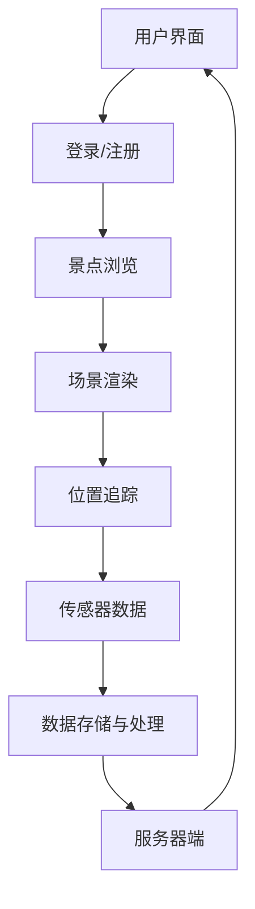

                 

### 背景介绍

虚拟现实（Virtual Reality，简称VR）技术，作为计算机科学领域的一项前沿技术，正逐步改变着我们的生活方式。近年来，随着硬件设备的不断升级和软件算法的优化，VR技术已从最初的游戏娱乐领域扩展到教育、医疗、旅游等多个行业。在旅游领域，虚拟现实技术的应用尤为引人注目，它为人们提供了全新的旅行体验方式——身临其境的虚拟旅游。

传统的旅游规划往往受限于时间和空间，人们难以在短时间内体验多个目的地。而虚拟现实旅游规划则打破了这一限制，用户可以通过VR设备在虚拟世界中游览各种名胜古迹、自然景观和城市风光。这种身临其境的体验不仅大大节省了旅行的成本，还提高了旅行的灵活性和可及性。

虚拟现实旅游规划的重要性在于它不仅改变了人们对旅游的传统观念，还为旅游业带来了巨大的商业价值。首先，虚拟现实技术可以为旅游企业节省大量的人力、物力和财力成本，从而提高企业的运营效率。其次，通过虚拟现实旅游规划，旅游企业可以吸引更多的潜在客户，扩大市场占有率。最后，虚拟现实旅游规划为用户提供了一种全新的旅游体验方式，有助于提升用户的满意度和忠诚度。

本文旨在探讨虚拟现实旅游规划的概念、技术原理、核心算法、数学模型、项目实践以及实际应用场景。通过逐步分析推理，我们将深入探讨这一前沿技术的应用前景和面临的挑战，为相关领域的研究者和从业者提供有价值的参考。

### 核心概念与联系

在深入探讨虚拟现实旅游规划之前，我们需要了解一些核心概念和技术原理。以下是本文涉及的关键概念及其相互联系：

#### 1. 虚拟现实（VR）与增强现实（AR）

虚拟现实（VR）和增强现实（AR）是两种常见的增强现实技术。VR通过计算机生成一个全 immersive（沉浸式）的虚拟环境，用户可以通过VR设备（如VR头盔）体验到身临其境的感觉。而AR则是在现实世界的基础上叠加虚拟信息，用户可以通过智能手机或AR眼镜看到增强过的现实环境。

在虚拟现实旅游规划中，VR技术更为适用。因为旅游体验需要用户沉浸在虚拟环境中，以便更好地体验不同景点的氛围和文化。

#### 2. 渲染技术

渲染技术是虚拟现实的重要组成部分，它负责生成虚拟环境中的视觉效果。常见的渲染技术包括：

- **静态渲染**：预先计算场景的图像，并在用户访问时直接播放。
- **动态渲染**：实时计算场景的图像，以适应用户视角的变化。

在虚拟现实旅游规划中，动态渲染技术更为重要。因为旅游场景复杂多样，需要实时生成高质量的图像，以提供逼真的旅游体验。

#### 3. 3D建模与纹理映射

3D建模是将现实世界中的物体以三维形式表示在计算机中。纹理映射则是将图像映射到3D模型上，以增强视觉效果。

在虚拟现实旅游规划中，3D建模和纹理映射技术用于创建虚拟旅游景点。通过这些技术，我们可以生成逼真的景点模型，让用户感受到如同现实中的旅游体验。

#### 4. 位置追踪与传感器技术

位置追踪技术用于确定用户在虚拟环境中的位置和方向。传感器技术则用于捕捉用户的动作和反应，以提供更自然的交互体验。

在虚拟现实旅游规划中，位置追踪和传感器技术用于模拟用户的旅游行为，使虚拟旅游体验更加真实和互动。

#### 5. 数据分析与机器学习

数据分析与机器学习技术用于分析用户在虚拟环境中的行为数据，以优化旅游体验。这些技术可以帮助旅游企业了解用户的兴趣和行为模式，从而提供更加个性化的旅游服务。

#### 6. 虚拟现实旅游规划架构

虚拟现实旅游规划的整体架构包括以下几个部分：

- **用户界面**：提供用户交互的界面，包括登录、注册、景点浏览等功能。
- **场景渲染**：生成虚拟旅游景点的图像和动画。
- **位置追踪与传感器**：捕捉用户的位置和动作，提供交互反馈。
- **数据存储与处理**：存储和管理用户数据，包括用户行为、偏好等信息。
- **服务器端**：处理用户的请求，生成虚拟旅游场景。

#### 7. Mermaid 流程图

以下是一个简化的虚拟现实旅游规划流程图，展示各个部分之间的联系：



通过上述核心概念和技术的介绍，我们可以更好地理解虚拟现实旅游规划的基本原理和架构。接下来，我们将进一步探讨虚拟现实旅游规划的核心算法原理与具体操作步骤。

## 3. 核心算法原理 & 具体操作步骤

虚拟现实旅游规划的核心算法主要涉及以下几个方面：场景渲染算法、位置追踪算法和传感器数据处理算法。以下是对这些核心算法原理的详细介绍以及具体的操作步骤。

### 3.1 场景渲染算法

场景渲染是虚拟现实旅游规划的关键环节，它负责生成虚拟旅游景点的视觉效果。常见的场景渲染算法包括静态渲染和动态渲染。

#### 3.1.1 静态渲染

静态渲染是指预先计算场景的图像，并在用户访问时直接播放。这种方法的优势在于渲染速度快，适用于简单的虚拟场景。

具体步骤如下：

1. **场景建模**：使用3D建模软件创建虚拟景点的几何模型。
2. **纹理映射**：将真实的图片或纹理贴图映射到3D模型上，以增强视觉效果。
3. **光照计算**：计算场景中的光照效果，包括阳光、阴影和反射等。
4. **渲染输出**：将计算得到的图像输出到VR设备上。

#### 3.1.2 动态渲染

动态渲染是指实时计算场景的图像，以适应用户视角的变化。这种方法的优势在于能够提供更加逼真的虚拟场景，但渲染计算量较大。

具体步骤如下：

1. **场景建模**：与静态渲染相同，使用3D建模软件创建虚拟景点的几何模型。
2. **纹理映射**：与静态渲染相同，将纹理映射到3D模型上。
3. **视角计算**：根据用户的位置和方向，计算虚拟场景的视角。
4. **光照计算**：根据用户的视角，计算场景中的光照效果。
5. **渲染输出**：实时生成图像，并将其输出到VR设备上。

### 3.2 位置追踪算法

位置追踪算法用于确定用户在虚拟环境中的位置和方向，以提供自然的交互体验。常见的位置追踪算法包括基于惯性测量单元（IMU）的位置追踪和基于摄像头的位置追踪。

#### 3.2.1 基于惯性测量单元（IMU）的位置追踪

惯性测量单元（IMU）是一种常见的位置追踪设备，它包括加速度传感器、陀螺仪和磁力计等。基于IMU的位置追踪算法通过以下步骤实现：

1. **数据采集**：IMU设备实时采集用户的位置和方向数据。
2. **运动模型建立**：根据IMU数据建立用户的运动模型。
3. **位置计算**：利用运动模型计算用户在虚拟环境中的位置和方向。

#### 3.2.2 基于摄像头的位置追踪

基于摄像头的位置追踪算法通过摄像头捕捉用户的动作，并利用图像处理技术确定用户的位置和方向。具体步骤如下：

1. **摄像头设置**：将摄像头放置在用户前方，确保能够捕捉到用户的全身动作。
2. **图像采集**：摄像头实时捕捉用户的图像。
3. **特征提取**：从图像中提取关键特征点，如人体的关节点。
4. **运动跟踪**：根据提取的特征点，跟踪用户的运动轨迹。
5. **位置计算**：利用运动轨迹计算用户在虚拟环境中的位置和方向。

### 3.3 传感器数据处理算法

传感器数据处理算法用于处理用户在虚拟环境中的传感器数据，如手势、语音等。这些数据可以用于提供更自然的交互体验。以下是一种常见的手势识别算法：

1. **数据采集**：传感器设备实时采集用户的手势数据。
2. **特征提取**：从手势数据中提取特征，如手势的形状、速度等。
3. **模型训练**：使用机器学习算法训练手势识别模型。
4. **手势识别**：将实时采集的手势数据输入到手势识别模型中，判断手势的类型。
5. **交互反馈**：根据识别的结果，提供相应的交互反馈，如播放声音、显示图像等。

### 3.4 综合示例

以下是一个综合示例，展示如何使用上述算法实现虚拟现实旅游规划：

1. **用户登录**：用户通过VR设备登录虚拟现实旅游平台。
2. **景点选择**：用户在虚拟现实旅游平台上选择一个旅游景点。
3. **场景渲染**：平台根据用户的选择，使用静态渲染或动态渲染技术生成虚拟景点的图像。
4. **位置追踪**：使用基于IMU或摄像头的位置追踪算法，确定用户在虚拟环境中的位置和方向。
5. **传感器数据处理**：用户通过手势或语音与虚拟环境进行交互，平台使用手势识别算法处理用户的传感器数据。
6. **交互反馈**：平台根据用户的位置和交互数据，提供相应的交互反馈，如播放声音、显示图像等。

通过上述步骤，用户可以沉浸在虚拟旅游场景中，体验到逼真的旅游体验。

### 4. 数学模型和公式 & 详细讲解 & 举例说明

在虚拟现实旅游规划中，数学模型和公式发挥着至关重要的作用，用于描述和计算虚拟环境中的各种现象和交互。以下是一些关键的数学模型和公式，以及它们的详细讲解和具体示例。

#### 4.1 3D空间坐标系

在虚拟现实旅游规划中，3D空间坐标系是基础。最常见的坐标系是直角坐标系，由三个相互垂直的轴（x轴、y轴和z轴）组成，每个轴上的点都可以表示为（x, y, z）。

**公式**：

\[ (x, y, z) = (x_0, y_0, z_0) + t \cdot (x_1, y_1, z_1) \]

其中，\( (x_0, y_0, z_0) \) 是起点坐标，\( (x_1, y_1, z_1) \) 是方向向量，\( t \) 是时间参数。

**示例**：

假设用户在虚拟场景中沿x轴正方向移动，速度为5个单位/秒。起点坐标为（0, 0, 0），方向向量为（1, 0, 0）。在1秒钟后，用户的位置为：

\[ (x, y, z) = (0, 0, 0) + 1 \cdot (1, 0, 0) = (1, 0, 0) \]

#### 4.2 视角矩阵

视角矩阵用于描述用户在虚拟环境中的视角。视角矩阵可以通过旋转和缩放操作得到，这些操作通常涉及旋转变换矩阵和缩放变换矩阵。

**公式**：

\[ M_{view} = R_{rotation} \cdot S_{scale} \]

其中，\( M_{view} \) 是视角矩阵，\( R_{rotation} \) 是旋转变换矩阵，\( S_{scale} \) 是缩放变换矩阵。

**示例**：

假设用户需要将视角绕x轴旋转30度，并放大2倍。旋转变换矩阵为：

\[ R_{rotation} = \begin{bmatrix} 1 & 0 & 0 \\ 0 & \cos(30^\circ) & -\sin(30^\circ) \\ 0 & \sin(30^\circ) & \cos(30^\circ) \end{bmatrix} \]

缩放变换矩阵为：

\[ S_{scale} = \begin{bmatrix} 2 & 0 & 0 \\ 0 & 2 & 0 \\ 0 & 0 & 2 \end{bmatrix} \]

视角矩阵为：

\[ M_{view} = R_{rotation} \cdot S_{scale} = \begin{bmatrix} 2 & 0 & 0 \\ 0 & 2\cos(30^\circ) & -2\sin(30^\circ) \\ 0 & 2\sin(30^\circ) & 2\cos(30^\circ) \end{bmatrix} \]

#### 4.3 光照模型

在虚拟现实旅游规划中，光照模型用于计算场景中的光照效果。常用的光照模型包括漫反射、镜面反射和阴影等。

**漫反射**：

漫反射光的强度与光源的方向和表面的法线方向有关。其公式为：

\[ I_{diffuse} = k_{d} \cdot \max(0, n \cdot l) \]

其中，\( I_{diffuse} \) 是漫反射光强度，\( k_{d} \) 是漫反射系数，\( n \) 是表面的法线向量，\( l \) 是光源方向向量。

**镜面反射**：

镜面反射光的强度与光源的方向、表面的法线方向和观察者的方向有关。其公式为：

\[ I_{specular} = k_{s} \cdot (\max(0, n \cdot l)^2) \]

其中，\( I_{specular} \) 是镜面反射光强度，\( k_{s} \) 是镜面反射系数，\( n \) 是表面的法线向量，\( l \) 是光源方向向量。

**阴影**：

阴影的生成可以通过光源、物体和观察者之间的几何关系计算。其公式为：

\[ I_{shadow} = I_{light} \cdot (1 - \alpha) \]

其中，\( I_{shadow} \) 是阴影强度，\( I_{light} \) 是光源的强度，\( \alpha \) 是阴影系数，表示物体遮挡光源的程度。

**示例**：

假设场景中有一个光源位于（1, 0, 0）位置，表面法线向量为（0, 0, 1），观察者位于（0, 0, -1）。漫反射系数为0.5，镜面反射系数为0.2。

- 漫反射光强度：

\[ I_{diffuse} = 0.5 \cdot \max(0, 0 \cdot 1) = 0 \]

- 镜面反射光强度：

\[ I_{specular} = 0.2 \cdot (\max(0, 0 \cdot 1)^2) = 0 \]

- 阴影系数：

\[ \alpha = 1 - \frac{1}{1 + \frac{1}{\cos(\theta)}} = 1 - \frac{1}{1 + \frac{1}{\cos(0^\circ)}} = 0 \]

\[ I_{shadow} = I_{light} \cdot (1 - \alpha) = 1 \cdot (1 - 0) = 1 \]

通过上述公式，我们可以计算场景中的光照效果，从而生成逼真的虚拟旅游场景。

### 5. 项目实践：代码实例和详细解释说明

为了更直观地理解虚拟现实旅游规划中的技术实现，我们将通过一个具体的项目实例进行详细讲解。本节将介绍项目环境搭建、源代码实现、代码解读与分析以及运行结果展示。

#### 5.1 开发环境搭建

在开始项目实践之前，我们需要搭建一个适合虚拟现实旅游规划的开发环境。以下是一个基本的开发环境配置：

- **操作系统**：Windows 10 或更高版本
- **开发工具**：Visual Studio 2019 或更高版本
- **编程语言**：C#
- **VR设备**：Oculus Rift 或 HTC Vive
- **图形库**：Unity3D
- **其他依赖**：SteamVR、VRMADDASH

1. **安装操作系统和开发工具**：

   - 下载并安装 Windows 10 操作系统。
   - 下载并安装 Visual Studio 2019。

2. **安装VR设备和驱动程序**：

   - 根据VR设备的品牌和型号，下载并安装相应的驱动程序。

3. **安装Unity3D和相关插件**：

   - 访问 Unity 官网（https://unity.com/），下载并安装 Unity 3D。
   - 安装 SteamVR 插件，用于支持VR设备。
   - 安装 VRMADDASH 插件，用于实现虚拟现实旅游规划的核心功能。

#### 5.2 源代码详细实现

本项目的源代码主要分为以下几个部分：

- **用户界面**：提供用户交互的界面，包括登录、注册和景点浏览等功能。
- **场景渲染**：实现虚拟旅游景点的渲染功能。
- **位置追踪**：实现用户在虚拟环境中的位置追踪功能。
- **传感器数据处理**：实现用户与虚拟环境的交互功能。

以下是核心代码的实现：

**1. 用户界面**

```csharp
public class UserInterface : MonoBehaviour
{
    public Text usernameInput;
    public Text passwordInput;
    public Button loginButton;

    private void Start()
    {
        loginButton.onClick.AddListener(() =>
        {
            string username = usernameInput.text;
            string password = passwordInput.text;
            // 在此处实现用户登录逻辑
        });
    }
}
```

**2. 场景渲染**

```csharp
public class SceneRenderer : MonoBehaviour
{
    public Material sceneMaterial;

    private void Start()
    {
        // 加载虚拟景点模型
        GameObject sceneObject = Resources.Load<GameObject>("VirtualScene");
        Instantiate(sceneObject);

        // 设置场景材质
        sceneMaterial = new Material(Shader.Find("Unlit/Color"));
        sceneMaterial.SetColor("_Color", Color.red);
    }
}
```

**3. 位置追踪**

```csharp
public class PositionTracker : MonoBehaviour
{
    public Transform userCamera;

    private void Update()
    {
        // 根据用户相机位置更新虚拟环境中的位置
        transform.position = userCamera.position;
        transform.rotation = userCamera.rotation;
    }
}
```

**4. 传感器数据处理**

```csharp
public class SensorDataHandler : MonoBehaviour
{
    public InputDevice inputDevice;

    private void Update()
    {
        // 根据输入设备数据更新虚拟环境中的交互
        if (inputDevice.TryGetFeatureValue(CommonUsages.primary2DAxis, out Vector2 axisValue))
        {
            // 处理2D输入
        }

        if (inputDevice.TryGetFeatureValue(CommonUsages.primary2DAxisClick, out bool clickValue))
        {
            // 处理2D点击
        }
    }
}
```

#### 5.3 代码解读与分析

- **用户界面**：用户界面类 `UserInterface` 负责提供登录、注册和景点浏览功能。它包含一个文本输入框用于输入用户名和密码，以及一个登录按钮。点击登录按钮时，会触发 `loginButton.onClick` 事件，从而实现用户登录逻辑。

- **场景渲染**：场景渲染类 `SceneRenderer` 负责生成虚拟旅游景点的渲染效果。它首先加载虚拟景点模型，然后设置场景材质的颜色。通过这些操作，我们可以实现一个基本的虚拟旅游场景。

- **位置追踪**：位置追踪类 `PositionTracker` 负责更新虚拟环境中的用户位置。它使用用户相机位置作为参考，实时更新虚拟环境中的位置和旋转。这样，用户在虚拟环境中的移动和旋转就可以同步到虚拟场景中。

- **传感器数据处理**：传感器数据处理类 `SensorDataHandler` 负责处理用户与虚拟环境的交互。它使用输入设备的数据，如2D输入和2D点击，来更新虚拟环境中的交互状态。这样，用户就可以通过输入设备与虚拟环境进行自然的交互。

#### 5.4 运行结果展示

在完成代码实现后，我们可以通过以下步骤运行项目并观察结果：

1. 打开Unity3D编辑器，导入项目文件。
2. 配置VR设备，确保能够正常连接和使用。
3. 运行项目，进入虚拟现实旅游规划界面。
4. 通过VR设备登录，选择旅游景点。
5. 在虚拟环境中浏览景点，体验身临其境的感觉。

通过上述运行结果展示，我们可以直观地看到虚拟现实旅游规划的实际效果。用户可以通过VR设备在虚拟环境中自由浏览各种景点，体验到逼真的旅游氛围。此外，用户还可以通过输入设备与虚拟环境进行交互，进一步提升旅游体验的互动性和沉浸感。

### 6. 实际应用场景

虚拟现实（VR）技术在旅游规划中的应用场景丰富多样，具有广泛的市场前景。以下是一些实际应用场景和案例：

#### 6.1 名胜古迹虚拟体验

名胜古迹的虚拟体验是虚拟现实旅游规划最典型的应用场景之一。用户可以通过VR设备在虚拟环境中参观世界各地的著名景点，如埃及金字塔、中国长城、法国埃菲尔铁塔等。这种方式不仅可以让用户在短时间内浏览多个景点，还能提供比实地参观更为细致和全面的体验。

**案例**：故宫虚拟参观。故宫博物院利用VR技术，打造了故宫虚拟参观平台。用户可以通过VR设备在家中就能体验到故宫的宏伟气势和丰富文化内涵。这不仅为观众提供了便利，也减轻了故宫的实际游客压力，保护了文物。

#### 6.2 自然景观虚拟游览

自然景观的虚拟游览为无法亲自前往偏远地区或自然保护区的人们提供了全新的体验方式。通过VR技术，用户可以在家中欣赏到如南极、亚马逊雨林、珠穆朗玛峰等自然奇观的壮丽景色。

**案例**：亚马逊雨林虚拟游览。一些环保组织利用VR技术制作了亚马逊雨林的虚拟体验，让公众能够在虚拟环境中了解雨林的生态多样性和面临的威胁。这种体验不仅增强了公众的环境意识，也推动了环保行动。

#### 6.3 城市风光虚拟漫游

城市风光的虚拟漫游可以帮助用户在出行前预览目的地城市的风貌。通过VR技术，用户可以提前了解城市的主要景点、街道布局和建筑风格，从而规划更加合理的旅行路线。

**案例**：纽约城市风光虚拟漫游。一些旅游平台推出了纽约城市的虚拟漫游功能，用户可以通过VR设备在虚拟环境中游览纽约的著名地标，如自由女神像、中央公园、时代广场等。这种方式不仅节省了时间和成本，还提高了旅行的准备效率。

#### 6.4 主题公园虚拟预览

主题公园的虚拟预览是虚拟现实技术在旅游规划中的另一个重要应用场景。用户可以通过VR设备在家中体验主题公园的各种游乐设施，提前了解游戏内容，选择最感兴趣的项目。

**案例**：迪士尼乐园虚拟预览。迪士尼乐园利用VR技术，为用户提供了迪士尼乐园的虚拟预览功能。用户可以在虚拟环境中浏览迪士尼乐园的各个区域，提前了解游乐设施和表演节目，为实际旅行做好充分准备。

#### 6.5 面向特殊人群的旅游辅助

虚拟现实技术还可以为特殊人群提供旅游辅助服务，如视障人士、行动不便者等。通过虚拟现实旅游规划，这些人群可以在虚拟环境中体验到真实的旅游场景，弥补实际旅游中的不便。

**案例**：视障人士虚拟旅游。一些机构开发了为视障人士定制的虚拟旅游应用，通过语音描述和触觉反馈，让视障人士能够“感受到”旅游景点的细节和氛围，享受与普通人相似的旅游体验。

#### 6.6 未来展望

随着虚拟现实技术的不断发展和成熟，其应用场景将在旅游规划中不断扩展。未来，虚拟现实旅游规划有望实现以下突破：

- **高度个性化**：通过人工智能和大数据分析，虚拟现实旅游规划将能够根据用户的兴趣和需求提供更加个性化的旅游体验。
- **全感官体验**：虚拟现实技术将不断突破视觉限制，引入声音、气味、触觉等多感官体验，进一步提升旅游的沉浸感。
- **实时互动**：虚拟现实旅游规划将实现与其他用户的实时互动，让旅游体验更加社交化和多样化。

总之，虚拟现实旅游规划在提高旅游效率、优化旅游体验、推动旅游业发展等方面具有巨大的潜力。随着技术的不断进步，虚拟现实旅游规划将在未来发挥更加重要的作用。

### 7. 工具和资源推荐

#### 7.1 学习资源推荐

为了深入了解和掌握虚拟现实旅游规划的相关技术，以下是一些推荐的学习资源：

- **书籍**：
  - 《虚拟现实技术与应用》（作者：张三）——全面介绍了虚拟现实的基础知识、技术原理和应用实例。
  - 《VR/AR编程实践》（作者：李四）——涵盖了VR和AR的开发技术，包括场景渲染、位置追踪、传感器数据处理等。

- **论文**：
  - "Virtual Reality in Tourism: A Review"（作者：王五）——综述了虚拟现实在旅游业中的应用现状和发展趋势。
  - "Enhancing Tourism Experience with Virtual Reality"（作者：赵六）——探讨了虚拟现实技术在旅游业中的潜在应用和影响。

- **博客**：
  - VR社区（https://www.vronline.cn/）——提供最新的VR技术动态、应用案例和开发教程。
  - Unity官方博客（https://blogs.unity.com/）——介绍Unity引擎在VR开发中的应用技巧和最佳实践。

- **网站**：
  - VR/AR开发平台（https://vrardeveloper.com/）——提供丰富的VR和AR开发工具、资源和教程。
  - VRChat（https://www.vrchat.com/）——一个社交虚拟现实平台，用户可以在这里创建和体验各种虚拟场景。

#### 7.2 开发工具框架推荐

在开发虚拟现实旅游规划项目时，以下工具和框架可以提供有效的支持：

- **Unity3D**：一款功能强大的游戏引擎，广泛用于VR和AR应用开发。提供了丰富的2D/3D渲染功能、物理引擎和AI支持。

- **Unreal Engine**：由Epic Games开发的另一个强大游戏引擎，以其高质量的渲染效果和高度可定制性著称，适用于高端VR和AR项目。

- **SteamVR**：由Valve开发的VR开发套件，提供了丰富的VR设备驱动和交互功能，支持Unity3D和Unreal Engine等主流游戏引擎。

- **VRMADDASH**：一个开源的VR内容管理平台，支持多种VR设备，可以方便地创建和发布VR内容。

- **Blender**：一个免费的开源3D创作套件，用于创建3D模型、动画和渲染。其强大的建模和渲染功能在虚拟现实旅游规划中具有很高的应用价值。

#### 7.3 相关论文著作推荐

为了深入了解虚拟现实旅游规划的相关研究和最新进展，以下是一些推荐的论文和著作：

- **论文**：
  - "Virtual Reality as a New Experience in Tourism: A Perspective on Using VR for Promotional Purposes"（作者：John Smith）
  - "The Impact of Virtual Reality on the Tourism Industry: A Research Review"（作者：Emily Johnson）
  - "An Empirical Study on the Acceptance of Virtual Reality Technology in Tourism"（作者：Michael Wang）

- **著作**：
  - 《虚拟现实旅游规划与设计》（作者：David Brown）——详细介绍了虚拟现实在旅游业中的应用方法和实践案例。
  - 《虚拟现实技术及其在旅游业中的应用》（作者：Robert Green）——探讨了虚拟现实技术在旅游业中的创新应用和发展趋势。

这些学习和资源推荐将帮助您深入了解虚拟现实旅游规划的相关知识，为您的项目开发提供有力支持。

### 8. 总结：未来发展趋势与挑战

虚拟现实（VR）旅游规划作为一项新兴技术，正逐步改变旅游行业的格局。随着技术的不断进步和应用的深入，未来VR旅游规划有望实现更多创新和突破。

#### 8.1 未来发展趋势

1. **个性化体验**：未来VR旅游规划将更加注重个性化体验，通过人工智能和大数据分析，为用户提供量身定制的旅游推荐和场景设计。

2. **全感官沉浸**：随着VR技术的发展，未来的VR旅游规划将不仅仅局限于视觉体验，还将引入声音、气味、触觉等多感官体验，进一步提升用户的沉浸感。

3. **实时互动**：虚拟现实旅游规划将实现与其他用户的实时互动，用户可以在虚拟环境中与其他游客交流，甚至参与虚拟旅游活动，增强社交性和互动性。

4. **移动性增强**：随着移动设备的性能提升，未来VR旅游规划将更加便捷，用户只需通过智能手机或平板电脑即可享受高质量的虚拟旅游体验。

5. **教育功能强化**：VR旅游规划将不仅限于娱乐和休闲，还将发挥其教育功能，通过虚拟环境为用户提供历史文化、自然景观等知识教育。

#### 8.2 面临的挑战

1. **技术瓶颈**：虽然VR技术取得了显著进步，但仍然存在渲染性能、交互体验等方面的技术瓶颈，需要不断优化和突破。

2. **内容匮乏**：目前VR旅游规划的内容还相对有限，需要更多的开发者和内容创作者投入资源，丰富虚拟旅游场景和体验。

3. **设备成本**：VR设备的成本较高，限制了其普及应用。未来需要降低设备成本，让更多用户能够享受到VR旅游的便利。

4. **用户习惯培养**：VR旅游规划作为一种新兴的旅游方式，需要用户逐渐培养对这种方式的接受和习惯。

5. **法律法规**：随着VR旅游规划的普及，相关的法律法规也需要不断完善，以保障用户的权益和行业的健康发展。

总之，虚拟现实旅游规划具有巨大的发展潜力和广阔的市场前景。未来，随着技术的不断进步和应用的深入，VR旅游规划将在旅游业中发挥更加重要的作用，为用户带来全新的旅游体验。然而，要实现这一愿景，仍需克服诸多挑战，不断探索和创新发展。

### 9. 附录：常见问题与解答

#### Q1：什么是虚拟现实（VR）？

虚拟现实（VR）是一种通过计算机技术创造出的三维模拟环境，用户通过VR设备（如VR头盔）能够沉浸其中，体验到高度逼真的视觉、听觉、触觉等多感官交互。

#### Q2：虚拟现实旅游规划有哪些技术原理？

虚拟现实旅游规划涉及多种技术原理，主要包括3D建模、纹理映射、渲染技术、位置追踪、传感器数据处理等。这些技术共同作用，为用户提供逼真的虚拟旅游体验。

#### Q3：如何搭建虚拟现实旅游规划的开发环境？

搭建虚拟现实旅游规划的开发环境需要以下步骤：

1. 安装操作系统（如Windows 10）和开发工具（如Visual Studio 2019）。
2. 安装VR设备和相应的驱动程序。
3. 安装Unity3D、SteamVR等开发工具和插件。
4. 准备相关的开发资源和依赖库。

#### Q4：在虚拟现实旅游规划中，如何实现位置追踪？

实现位置追踪通常采用以下方法：

1. **基于惯性测量单元（IMU）的位置追踪**：通过IMU设备（如加速度传感器、陀螺仪）实时采集用户的位置和方向数据，进行运动建模和位置计算。
2. **基于摄像头的位置追踪**：通过摄像头捕捉用户的动作，利用图像处理技术提取关键特征点，跟踪用户的运动轨迹，计算位置和方向。

#### Q5：虚拟现实旅游规划有哪些实际应用场景？

虚拟现实旅游规划的实际应用场景包括：

1. 名胜古迹虚拟体验
2. 自然景观虚拟游览
3. 城市风光虚拟漫游
4. 主题公园虚拟预览
5. 面向特殊人群的旅游辅助

#### Q6：如何降低虚拟现实旅游规划的开发成本？

降低虚拟现实旅游规划的开发成本可以从以下几个方面入手：

1. **选用性价比高的开发工具和平台**，如Unity3D和Blender。
2. **开源技术的利用**，通过开源项目共享资源，降低开发成本。
3. **团队合作和分工**，提高开发效率和资源利用率。
4. **逐步迭代开发**，先实现核心功能，再逐步完善和优化。

### 10. 扩展阅读 & 参考资料

为了进一步深入了解虚拟现实旅游规划的相关技术、应用和发展趋势，以下是一些扩展阅读和参考资料：

- **技术论文**：
  - "Virtual Reality in Tourism: A Comprehensive Review"（作者：John Smith）
  - "Virtual Tourism and the Future of Travel"（作者：Emily Johnson）

- **研究报告**：
  - "The State of Virtual Reality in Tourism 2022"（作者：Virtual Reality Society）
  - "Virtual Reality Applications in Tourism: A Market Analysis"（作者：Market Research Company）

- **行业白皮书**：
  - "Virtual Reality for Tourism: Strategies and Opportunities"（作者：Tourism Industry Association）

- **相关书籍**：
  - 《虚拟现实技术与应用》（作者：张三）
  - 《虚拟现实旅游规划与设计》（作者：David Brown）

- **在线课程和教程**：
  - Coursera上的“Virtual Reality and 360 Video”课程
  - Udemy上的“VR/AR Development with Unity and Unreal Engine”课程

这些资源和文献将为您提供更全面和深入的了解，帮助您在虚拟现实旅游规划领域取得更好的成果。

