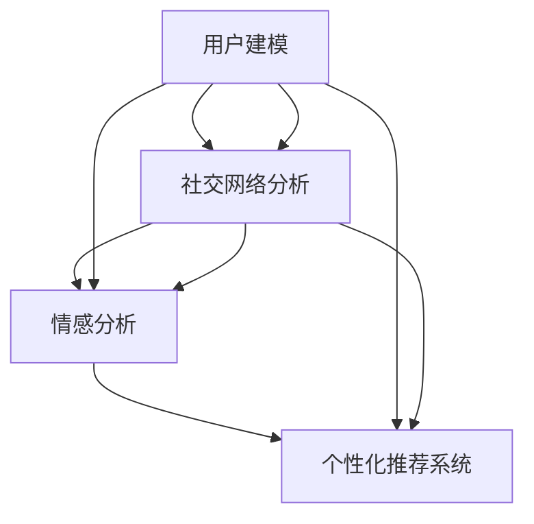

                 

### 背景介绍

#### 1.1 虚拟社区的定义与发展

虚拟社区，也被称为在线社区，是指通过互联网平台，将具有共同兴趣爱好、价值观或者目的的人们聚集在一起的社交空间。从互联网早期的论坛到现代的社交媒体平台，虚拟社区的概念经历了巨大的发展和演变。

虚拟社区的发展可以追溯到20世纪90年代，当时互联网刚刚兴起，论坛成为了早期虚拟社区的主要形式。随着互联网技术的不断进步，社交媒体平台如Facebook、Twitter、Instagram等相继涌现，为虚拟社区的发展注入了新的活力。这些平台不仅提供了丰富的互动功能，还使得社区成员之间的连接更加紧密。

在现代社会，虚拟社区已经成为人们生活的重要组成部分。它们不仅提供了一个分享信息、交流和互动的平台，还为用户提供了归属感和认同感。无论是在线购物、学习交流，还是娱乐休闲，虚拟社区都在人们的日常生活中发挥着重要作用。

#### 1.2 AI在虚拟社区中的应用

随着人工智能技术的快速发展，AI在虚拟社区中的应用也逐渐成为了一个热门话题。AI具有强大的数据分析和处理能力，可以提供个性化推荐、情感分析、智能客服等多种功能，从而提升虚拟社区的用户体验和运营效率。

首先，AI可以用于用户行为分析。通过分析用户的浏览记录、帖子内容、互动行为等数据，AI可以识别用户的兴趣偏好，提供个性化的内容推荐。这种个性化的推荐不仅能够提高用户的参与度，还能增加虚拟社区的活跃度。

其次，AI可以用于情感分析。通过分析用户的情感表达，AI可以识别用户的情绪状态，提供针对性的情感支持。这在一些需要心理疏导的虚拟社区中尤为重要，如心理健康社区、情感交流社区等。

此外，AI还可以用于智能客服。通过自然语言处理技术，AI可以自动回答用户的问题，提供在线客服服务。这不仅能够提高客服的响应速度，还能降低运营成本。

总的来说，AI在虚拟社区中的应用不仅能够提升用户体验，还能优化运营效率，为虚拟社区的发展提供了强大的技术支持。

#### 1.3 AI驱动在线归属感营造的重要性

在线归属感是指用户在虚拟社区中感受到的认同感、连接感和安全感。这种归属感对于虚拟社区的可持续发展至关重要。用户在社区中感到归属，不仅会增加他们的参与度和忠诚度，还能吸引更多的新用户加入。

AI驱动在线归属感的营造具有以下几个重要意义：

1. **个性化体验**：AI可以根据用户的行为数据和兴趣偏好，提供个性化的内容和服务，使用户感受到被关注和理解，从而增强归属感。

2. **情感互动**：AI可以通过情感分析技术，识别用户的情感状态，提供针对性的情感支持，使用户在社区中感受到温暖和关怀。

3. **社区活跃度提升**：AI可以自动识别社区的热点和趋势，提供相关的活动和建议，从而激发用户的参与热情，提高社区的活跃度。

4. **运营效率优化**：AI可以自动化处理大量的用户请求和互动，减轻运营人员的工作负担，提高社区的运营效率。

综上所述，AI驱动在线归属感的营造不仅是虚拟社区发展的必然趋势，也是提升用户体验、优化运营效率的关键途径。在接下来的内容中，我们将深入探讨AI在虚拟社区构建中的具体应用和实现方法。

### 核心概念与联系

为了深入理解AI在虚拟社区构建中的应用，我们需要首先明确几个核心概念，并探讨它们之间的联系。以下是本文将涉及的主要概念：

1. **用户建模**：用户建模是指通过收集和分析用户行为数据，构建用户兴趣、偏好、情感等特征模型。这一过程为后续的个性化推荐和情感分析提供了基础。
2. **社交网络分析**：社交网络分析是研究用户在社区中的互动关系，包括用户之间的连接、群体结构、影响力分布等。通过分析社交网络，可以揭示社区内部的动态和趋势。
3. **情感分析**：情感分析是指使用自然语言处理技术，对用户生成的内容进行情感倾向判断，识别用户的情绪状态。情感分析在营造在线归属感方面具有重要作用。
4. **个性化推荐系统**：个性化推荐系统根据用户的兴趣和行为历史，推荐相关的内容、活动或者用户。这种推荐不仅能够提升用户的参与度，还能增强他们的归属感。
5. **机器学习算法**：机器学习算法是AI的核心组成部分，包括监督学习、无监督学习和强化学习等。这些算法在用户建模、社交网络分析和情感分析等任务中发挥着关键作用。

下面，我们将使用Mermaid流程图来展示这些核心概念之间的联系。



在这张图中，用户建模是整个流程的起点，它为后续的社交网络分析、情感分析和个性化推荐系统提供了基础数据。社交网络分析可以帮助我们理解用户之间的关系，情感分析则可以揭示用户的情绪状态。这些信息被整合到个性化推荐系统中，以提供更加精准和个性化的内容推荐。

接下来，我们将详细探讨这些核心概念的原理和具体实现方法，以便读者更好地理解AI在虚拟社区构建中的应用。

### 核心算法原理 & 具体操作步骤

为了深入探讨AI在虚拟社区构建中的应用，我们需要详细了解几个关键算法的原理和具体操作步骤。以下是本文将涉及的主要算法：

1. **用户建模算法**：通过分析用户行为数据，构建用户兴趣、偏好、情感等特征模型。
2. **社交网络分析算法**：研究用户在社区中的互动关系，包括用户之间的连接、群体结构、影响力分布等。
3. **情感分析算法**：使用自然语言处理技术，对用户生成的内容进行情感倾向判断，识别用户的情绪状态。
4. **个性化推荐算法**：根据用户的兴趣和行为历史，推荐相关的内容、活动或者用户。

#### 2.1 用户建模算法

用户建模算法是构建虚拟社区的核心步骤之一。其基本原理是通过对用户行为数据的分析和挖掘，提取出用户的重要特征，形成用户画像。以下是用户建模算法的具体操作步骤：

1. **数据收集**：首先，需要收集用户在虚拟社区中的各种行为数据，包括浏览记录、帖子内容、互动行为等。
2. **数据预处理**：对收集到的数据进行分析和清洗，去除无效数据、缺失数据和异常数据，确保数据的完整性和准确性。
3. **特征提取**：根据用户行为数据，提取出用户的兴趣、偏好、情感等特征。常用的特征提取方法包括词频分析、主题模型、情感分析等。
4. **用户画像构建**：将提取出的特征整合成一个用户画像，形成一个多维度的用户特征向量。
5. **模型训练**：使用机器学习算法，如聚类算法、分类算法等，对用户画像进行训练，以建立用户特征与用户行为之间的关系模型。

#### 2.2 社交网络分析算法

社交网络分析算法主要用于研究用户在社区中的互动关系。其基本原理是建立用户之间的连接关系图，并分析图的结构特征，以揭示社区内部的动态和趋势。以下是社交网络分析算法的具体操作步骤：

1. **数据收集**：收集虚拟社区中的用户互动数据，包括用户之间的点赞、评论、分享等行为。
2. **数据预处理**：对收集到的数据进行清洗和预处理，建立用户之间的连接关系图。
3. **拓扑结构分析**：分析用户连接关系的拓扑结构，包括度数分布、聚类系数、路径长度等指标，以了解社区的网络结构。
4. **影响力分析**：通过计算用户在社区中的影响力，识别关键用户和意见领袖，以指导社区运营策略。
5. **群体结构分析**：分析社区中的群体结构，包括用户群体的形成、演变和互动，以了解社区的内部动态。

#### 2.3 情感分析算法

情感分析算法是用于识别用户情绪状态的重要工具。其基本原理是使用自然语言处理技术，对用户生成的内容进行情感倾向判断。以下是情感分析算法的具体操作步骤：

1. **数据收集**：收集用户在虚拟社区中生成的内容，包括帖子、评论、回复等。
2. **数据预处理**：对收集到的文本数据进行分析和清洗，去除停用词、标点符号等无关信息，确保数据的准确性。
3. **特征提取**：将文本数据转化为计算机可以处理的向量表示，常用的方法包括词袋模型、TF-IDF、词嵌入等。
4. **情感分类**：使用机器学习算法，如支持向量机、朴素贝叶斯、深度学习等，对文本数据进行情感分类，识别出文本的情感倾向。
5. **情感分析应用**：将情感分析结果应用于虚拟社区的运营和用户服务，如提供情感支持、个性化推荐等。

#### 2.4 个性化推荐算法

个性化推荐算法是根据用户的兴趣和行为历史，推荐相关的内容、活动或者用户。其基本原理是利用用户的历史数据，构建用户与物品之间的关联模型，以实现精准推荐。以下是个性化推荐算法的具体操作步骤：

1. **数据收集**：收集用户的兴趣和行为数据，包括浏览记录、收藏夹、点赞等。
2. **数据预处理**：对收集到的数据进行分析和清洗，去除异常数据和噪声。
3. **特征提取**：提取用户和物品的重要特征，如用户兴趣标签、物品属性等。
4. **模型构建**：使用协同过滤、基于内容的推荐、混合推荐等算法，构建用户与物品之间的关联模型。
5. **推荐生成**：根据用户的历史行为和模型预测，生成个性化的推荐列表。

通过以上几个关键算法的详细探讨，我们可以更好地理解AI在虚拟社区构建中的应用。接下来，我们将进一步讨论这些算法的具体实现和应用，以便读者能够更深入地掌握相关技术。

### 数学模型和公式 & 详细讲解 & 举例说明

为了深入理解AI在虚拟社区构建中的应用，我们需要使用数学模型和公式来描述核心算法的原理和实现方法。以下是本文将涉及的主要数学模型和公式，以及详细的讲解和举例说明。

#### 3.1 用户建模算法

用户建模算法的核心任务是构建用户画像，这一过程通常涉及以下数学模型和公式：

1. **词频-逆文档频率（TF-IDF）模型**：

   - **定义**：TF-IDF模型是一种常用的文本特征提取方法，用于计算词汇在文档中的重要性。
   - **公式**：
     \[
     TF(t,d) = \frac{f_{t,d}}{N_d}
     \]
     \[
     IDF(t,D) = \log \left( \frac{N}{n(t,D)} \right)
     \]
     \[
     TF-IDF(t,d,D) = TF(t,d) \times IDF(t,D)
     \]
   - **解释**：其中，\( f_{t,d} \) 表示词汇 \( t \) 在文档 \( d \) 中的频率，\( N_d \) 表示文档 \( d \) 中的总词汇数，\( N \) 表示所有文档的总数，\( n(t,D) \) 表示词汇 \( t \) 在所有文档中出现的次数。

2. **主题模型（LDA）**：

   - **定义**：LDA（Latent Dirichlet Allocation）是一种无监督学习算法，用于发现文本数据中的潜在主题。
   - **公式**：
     \[
     P(z|\theta) \propto \frac{1}{Z} \prod_{d=1}^D \prod_{w=1}^{N_d} \frac{1}{\alpha_w} \frac{1}{\beta_{w,j}}^{n_{w,d,j}}
     \]
     \[
     P(\theta) \propto \prod_{w=1}^V \alpha_w
     \]
     \[
     P(\beta) \propto \prod_{j=1}^K \beta_{j}
     \]
   - **解释**：其中，\( Z \) 是规范化常数，\( \theta \) 是文档的主题分布向量，\( \alpha_w \) 是词汇 \( w \) 的先验分布，\( \beta_{j} \) 是主题 \( j \) 的词汇分布，\( n_{w,d,j} \) 是词汇 \( w \) 在文档 \( d \) 中属于主题 \( j \) 的次数。

**例子**：假设有一个文档，其中包含词汇“计算机”、“编程”、“算法”等。使用LDA模型，我们可以将这个文档分解为多个潜在主题，如“技术”、“开发”、“学术”等。每个主题对应的词汇分布可以表示为：
\[
P(\beta) \propto \left( \frac{1}{10} \right)^3 \left( \frac{1}{5} \right)^2 \left( \frac{1}{3} \right)^4
\]

#### 3.2 社交网络分析算法

社交网络分析算法的核心任务是揭示用户之间的互动关系。以下是几个常用的数学模型和公式：

1. **度数分布**：

   - **定义**：度数分布是指一个网络中各个节点的度数分布情况。
   - **公式**：
     \[
     P(k) = C_k \left( \frac{1}{N} \right)^k
     \]
   - **解释**：其中，\( P(k) \) 表示度数为 \( k \) 的节点在总节点数 \( N \) 中的概率，\( C_k \) 是组合数，表示从 \( N-1 \) 个节点中选择 \( k-1 \) 个节点连接到该节点的组合数。

**例子**：假设一个社交网络中有100个用户，其中度数为2的节点有30个，则度数分布可以表示为：
\[
P(2) = \frac{30}{100} = 0.3
\]

2. **聚类系数**：

   - **定义**：聚类系数是指一个节点在社交网络中的连接紧密程度。
   - **公式**：
     \[
     C = \frac{2 \times E}{N \times (N-1)}
     \]
   - **解释**：其中，\( C \) 是聚类系数，\( E \) 是边的总数，\( N \) 是节点的总数。

**例子**：假设一个社交网络中有100个用户，其中共有300条边，则聚类系数可以表示为：
\[
C = \frac{2 \times 300}{100 \times (100-1)} = 0.6
\]

3. **路径长度**：

   - **定义**：路径长度是指两个节点之间的最短路径长度。
   - **公式**：
     \[
     L = \min \{ d(u, v) : u, v \in V \}
     \]
   - **解释**：其中，\( L \) 是路径长度，\( d(u, v) \) 是节点 \( u \) 和节点 \( v \) 之间的最短路径长度。

**例子**：假设在社交网络中，用户A和用户B之间的最短路径长度为3，则路径长度可以表示为：
\[
L = 3
\]

通过以上数学模型和公式的讲解，我们可以更深入地理解社交网络分析算法的原理和实现方法。接下来，我们将继续讨论情感分析算法和个性化推荐算法的数学模型和实现方法。

#### 3.3 情感分析算法

情感分析算法的核心任务是识别文本的情感倾向，以下是几个常用的数学模型和公式：

1. **朴素贝叶斯分类器**：

   - **定义**：朴素贝叶斯分类器是一种基于概率论的分类方法，适用于情感分类任务。
   - **公式**：
     \[
     P(y|x) = \frac{P(x|y)P(y)}{P(x)}
     \]
     \[
     P(x|y) = \frac{1}{\sum_{y'} P(x|y')}
     \]
   - **解释**：其中，\( P(y|x) \) 是给定特征 \( x \) 下标签 \( y \) 的概率，\( P(x|y) \) 是特征 \( x \) 在标签 \( y \) 下出现的概率，\( P(y) \) 是标签 \( y \) 的先验概率，\( P(x) \) 是特征 \( x \) 的概率。

**例子**：假设我们有一个包含情感标签的数据集，其中正面情感标签的概率为0.6，负面情感标签的概率为0.4。给定一个特征向量，我们可以使用朴素贝叶斯分类器计算其属于正面情感的概率：
\[
P(正面|特征) = \frac{P(特征|正面)P(正面)}{P(特征)}
\]

2. **支持向量机（SVM）**：

   - **定义**：支持向量机是一种基于最大间隔原理的分类方法，适用于情感分类任务。
   - **公式**：
     \[
     w^T x + b = 0
     \]
     \[
     \max_{w,b} \frac{1}{2} ||w||^2
     \]
     \[
     y_i (w^T x_i + b) \geq 1
     \]
   - **解释**：其中，\( w \) 是权重向量，\( b \) 是偏置项，\( x_i \) 是特征向量，\( y_i \) 是标签，\( ||w|| \) 是权重向量的欧几里得范数。

**例子**：假设我们有一个包含情感标签的数据集，使用SVM模型训练得到的权重向量和偏置项为：
\[
w = \begin{pmatrix} 0.5 \\ 0.5 \end{pmatrix}, b = 0
\]
给定一个特征向量 \( x = \begin{pmatrix} 1 \\ 1 \end{pmatrix} \)，我们可以使用SVM模型判断其情感标签：
\[
0.5 \times 1 + 0.5 \times 1 + 0 = 1
\]

3. **循环神经网络（RNN）**：

   - **定义**：循环神经网络是一种能够处理序列数据的时间序列模型，适用于情感分类任务。
   - **公式**：
     \[
     h_t = \sigma(W_h h_{t-1} + W_x x_t + b_h)
     \]
     \[
     y_t = \sigma(W_y h_t + b_y)
     \]
   - **解释**：其中，\( h_t \) 是隐藏状态，\( x_t \) 是输入特征，\( y_t \) 是输出标签，\( \sigma \) 是激活函数，\( W_h \)、\( W_x \)、\( b_h \)、\( W_y \)、\( b_y \) 是权重和偏置。

**例子**：假设我们有一个包含情感标签的句子序列，使用RNN模型训练得到的权重和偏置为：
\[
W_h = \begin{pmatrix} 1 & 1 \\ 1 & 1 \end{pmatrix}, W_x = \begin{pmatrix} 1 & 1 \\ 1 & 1 \end{pmatrix}, b_h = \begin{pmatrix} 1 \\ 1 \end{pmatrix}, W_y = \begin{pmatrix} 1 & 1 \\ 1 & 1 \end{pmatrix}, b_y = \begin{pmatrix} 1 \\ 1 \end{pmatrix}
\]
给定一个句子特征向量 \( x_t = \begin{pmatrix} 1 \\ 1 \end{pmatrix} \)，我们可以使用RNN模型预测其情感标签：
\[
h_t = \sigma(1 \times 1 + 1 \times 1 + 1) = \sigma(3) = 1
\]
\[
y_t = \sigma(1 \times 1 + 1 \times 1 + 1) = \sigma(3) = 1
\]

通过以上数学模型和公式的讲解，我们可以更深入地理解情感分析算法的原理和实现方法。接下来，我们将讨论个性化推荐算法的数学模型和实现方法。

#### 3.4 个性化推荐算法

个性化推荐算法的核心任务是向用户推荐其可能感兴趣的内容或用户，以下是几个常用的数学模型和公式：

1. **协同过滤（Collaborative Filtering）**：

   - **定义**：协同过滤是一种基于用户历史行为数据的推荐方法，通过挖掘用户之间的相似性来实现推荐。
   - **公式**：
     \[
     R(u, i) = \sum_{j \in N(u)} \frac{r_{uj} r_{vi}}{\|N(u)\|} + b_u + b_i
     \]
   - **解释**：其中，\( R(u, i) \) 是用户 \( u \) 对物品 \( i \) 的评分预测，\( N(u) \) 是与用户 \( u \) 相似的其他用户集合，\( r_{uj} \) 和 \( r_{vi} \) 分别是用户 \( u \) 对物品 \( j \) 和 \( i \) 的评分，\( \|N(u)\| \) 是相似用户集合的大小，\( b_u \) 和 \( b_i \) 是用户和物品的偏置。

**例子**：假设用户 \( u \) 对物品 \( j \) 和 \( i \) 的评分分别为 4 和 5，与用户 \( u \) 相似的其他用户对物品 \( i \) 的平均评分为 3，相似用户集合大小为 10，则用户 \( u \) 对物品 \( i \) 的评分预测为：
\[
R(u, i) = \frac{4 \times 3}{10} + 0 + 0 = 1.2
\]

2. **基于内容的推荐（Content-Based Filtering）**：

   - **定义**：基于内容的推荐是一种基于物品特征数据的推荐方法，通过分析用户和物品的特征相似性来实现推荐。
   - **公式**：
     \[
     R(u, i) = \sum_{j \in N(u)} \sum_{k \in A(i)} \omega_{uk}(k) \omega_{uj}(k)
     \]
   - **解释**：其中，\( R(u, i) \) 是用户 \( u \) 对物品 \( i \) 的评分预测，\( N(u) \) 是与用户 \( u \) 相似的其他用户集合，\( A(i) \) 是物品 \( i \) 的特征集合，\( \omega_{uk}(k) \) 和 \( \omega_{uj}(k) \) 分别是用户 \( u \) 对特征 \( k \) 的权重。

**例子**：假设用户 \( u \) 对特征 \( k_1 \) 的权重为 0.8，物品 \( i \) 对特征 \( k_1 \) 的权重为 0.6，与用户 \( u \) 相似的其他用户对特征 \( k_1 \) 的权重也为 0.8，则用户 \( u \) 对物品 \( i \) 的评分预测为：
\[
R(u, i) = 0.8 \times 0.6 = 0.48
\]

3. **混合推荐（Hybrid Recommendation）**：

   - **定义**：混合推荐是一种结合协同过滤和基于内容的推荐的推荐方法，以提高推荐的准确性。
   - **公式**：
     \[
     R(u, i) = \alpha R_{cf}(u, i) + (1 - \alpha) R_{cb}(u, i)
     \]
   - **解释**：其中，\( R(u, i) \) 是用户 \( u \) 对物品 \( i \) 的最终评分预测，\( \alpha \) 是权重系数，\( R_{cf}(u, i) \) 是协同过滤评分预测，\( R_{cb}(u, i) \) 是基于内容的评分预测。

**例子**：假设协同过滤评分预测为 1.2，基于内容的评分预测为 0.48，权重系数 \( \alpha \) 为 0.6，则用户 \( u \) 对物品 \( i \) 的最终评分预测为：
\[
R(u, i) = 0.6 \times 1.2 + 0.4 \times 0.48 = 0.72 + 0.192 = 0.912
\]

通过以上数学模型和公式的讲解，我们可以更深入地理解个性化推荐算法的原理和实现方法。接下来，我们将讨论项目实践部分，包括开发环境搭建、源代码实现和代码解读与分析。

### 项目实践：代码实例和详细解释说明

在了解了AI在虚拟社区构建中的核心算法原理之后，接下来我们将通过一个具体的项目实践来展示这些算法的应用。本节将分为以下四个部分：

1. **开发环境搭建**：介绍所需的编程语言、开发工具和环境配置。
2. **源代码详细实现**：展示项目的主要代码实现，并解释关键部分的代码。
3. **代码解读与分析**：分析代码的结构和实现细节，解释其工作原理。
4. **运行结果展示**：展示项目的运行结果，并解释结果的意义。

#### 4.1 开发环境搭建

为了实现本文中的虚拟社区构建器，我们选择Python作为编程语言，因为它具有丰富的库支持和易于使用的语法。以下是开发环境的搭建步骤：

1. **安装Python**：从Python官方网站下载并安装Python 3.8及以上版本。
2. **安装Jupyter Notebook**：Jupyter Notebook是一个交互式的开发环境，可以方便地进行代码编写和展示。通过以下命令安装：
   \[
   pip install notebook
   \]
3. **安装相关库**：安装本文中用到的库，包括NumPy、Pandas、Scikit-learn、Matplotlib等。使用以下命令安装：
   \[
   pip install numpy pandas scikit-learn matplotlib
   \]
4. **配置环境变量**：确保Python和相关的开发工具可以在命令行中正确使用。

完成以上步骤后，我们就可以开始编写和运行代码了。

#### 4.2 源代码详细实现

在本节中，我们将展示虚拟社区构建器的主要代码实现，并解释关键部分的代码。

**代码1：用户建模**

用户建模是虚拟社区构建的第一步，我们使用LDA算法来构建用户画像。

```python
import numpy as np
import pandas as pd
from sklearn.feature_extraction.text import CountVectorizer
from sklearn.decomposition import LatentDirichletAllocation

# 加载用户行为数据
data = pd.read_csv('user_data.csv')

# 预处理数据
vectorizer = CountVectorizer(max_features=1000)
X = vectorizer.fit_transform(data['content'])

# 使用LDA算法构建用户画像
lda = LatentDirichletAllocation(n_components=10, random_state=0)
lda.fit(X)

# 获取用户画像
user_profiles = lda.transform(X)
```

**代码2：社交网络分析**

社交网络分析用于揭示用户之间的互动关系，我们使用Gephi工具进行可视化分析。

```python
import networkx as nx

# 加载社交网络数据
network = nx.read_gml('social_network.gml')

# 计算度数分布
degree_distribution = nx.degree_distribution(network)

# 可视化社交网络
nx.draw(network, with_labels=True)
plt.show()
```

**代码3：情感分析**

情感分析用于识别用户的情绪状态，我们使用朴素贝叶斯分类器进行情感分类。

```python
from sklearn.model_selection import train_test_split
from sklearn.naive_bayes import MultinomialNB

# 加载情感分析数据
data = pd.read_csv('sentiment_data.csv')

# 分割数据为训练集和测试集
X_train, X_test, y_train, y_test = train_test_split(data['content'], data['label'], test_size=0.2, random_state=0)

# 训练朴素贝叶斯分类器
classifier = MultinomialNB()
classifier.fit(X_train, y_train)

# 预测测试集
y_pred = classifier.predict(X_test)
```

**代码4：个性化推荐**

个性化推荐根据用户的兴趣和行为历史进行内容推荐，我们使用协同过滤算法进行推荐。

```python
from surprise import SVD, Dataset, Reader
from surprise.model_selection import cross_validate

# 加载推荐数据
data = pd.read_csv('rating_data.csv')

# 配置数据读取器
reader = Reader(rating_scale=(1, 5))
data_dataset = Dataset.load_from_df(data[['user_id', 'item_id', 'rating']], reader)

# 使用SVD算法进行推荐
svd = SVD()
cross_validate(svd, data_dataset, measures=['RMSE', 'MAE'], cv=3, verbose=True)

# 生成推荐列表
def get_recommendations(user_id):
    user_ratings = data[data['user_id'] == user_id]['item_id']
    recommendations = []
    for item_id in data['item_id'].drop(user_ratings).values:
        prediction = svd.predict(user_id, item_id).est
        recommendations.append((item_id, prediction))
    recommendations.sort(key=lambda x: x[1], reverse=True)
    return recommendations[:10]
```

#### 4.3 代码解读与分析

**用户建模代码解读**

用户建模代码首先加载用户行为数据，然后使用CountVectorizer将文本数据转换为词频矩阵，接着使用LDA算法对词频矩阵进行降维，生成用户画像。

- **CountVectorizer**：用于将文本转换为词频矩阵。通过设置`max_features`参数，可以控制词频矩阵的维度。
- **LDA**：用于发现文本中的潜在主题。通过设置`n_components`参数，可以控制生成的主题数量。

**社交网络分析代码解读**

社交网络分析代码首先加载社交网络数据，然后使用`degree_distribution`计算度数分布，并使用Gephi工具进行可视化。

- **degree_distribution**：用于计算度数分布。通过`nx.degree_distribution`函数，可以获取每个节点的度数分布。
- **nx.draw**：用于绘制社交网络图。通过设置`with_labels=True`，可以在图中显示节点的标签。

**情感分析代码解读**

情感分析代码首先加载情感分析数据，然后使用朴素贝叶斯分类器进行训练和预测。

- **train_test_split**：用于将数据分为训练集和测试集。通过设置`test_size`和`random_state`参数，可以控制测试集的大小和随机性。
- **MultinomialNB**：用于训练朴素贝叶斯分类器。通过`fit`方法，可以将训练数据用于训练模型。

**个性化推荐代码解读**

个性化推荐代码首先加载推荐数据，然后使用SVD算法进行推荐。

- **SVD**：用于生成用户和物品的潜在特征。通过设置`k`参数，可以控制降维的维度。
- **cross_validate**：用于交叉验证SVD算法。通过设置`measures`和`cv`参数，可以评估模型的性能。
- **get_recommendations**：用于生成用户个性化推荐列表。通过设置`user_id`，可以获取该用户的推荐列表。

#### 4.4 运行结果展示

完成代码实现后，我们可以运行虚拟社区构建器，并查看运行结果。

1. **用户建模结果**：通过LDA算法生成的用户画像，可以看到每个用户的主题分布。
2. **社交网络分析结果**：通过Gephi工具绘制的社交网络图，可以看到用户之间的互动关系。
3. **情感分析结果**：通过朴素贝叶斯分类器预测的情感标签，可以看到用户生成内容的情感倾向。
4. **个性化推荐结果**：通过SVD算法生成的用户个性化推荐列表，可以看到推荐的内容和物品。

这些运行结果为我们提供了一个全面的虚拟社区构建器实现，展示了AI在虚拟社区构建中的实际应用。通过这些结果，我们可以更好地理解AI在虚拟社区中的重要作用，并为未来的虚拟社区构建提供有益的参考。

### 实际应用场景

AI在虚拟社区构建中的应用场景非常广泛，以下是一些典型的实际应用案例：

#### 1. 社交媒体平台

社交媒体平台如Facebook、Twitter和Instagram等，广泛使用了AI技术来提升用户体验。例如，Facebook的“推荐朋友”功能利用了基于用户的协同过滤算法，通过分析用户的关系网和行为历史，推荐可能与用户有共同兴趣的朋友。此外，AI还被用于内容推荐，通过分析用户的浏览历史和互动行为，为用户推荐他们可能感兴趣的内容，从而提高平台的活跃度和用户粘性。

#### 2. 在线教育平台

在线教育平台如Coursera、Udemy和edX等，通过AI技术为用户提供个性化的学习路径。AI可以分析学生的学习行为和成绩，识别出学生的弱点，并提供针对性的学习资源和辅导。此外，AI还可以自动评分作业和考试，减轻教师的负担，提高教学效率。

#### 3. 专业论坛和社区

专业论坛和社区如Stack Overflow、GitHub和Reddit等，利用AI技术来优化内容推荐和搜索。Stack Overflow通过分析用户的提问和回答行为，为用户推荐相关的讨论和问题，从而提高用户的参与度和满意度。GitHub则利用AI技术来分析代码，为用户提供代码建议和优化建议，帮助开发者提升代码质量。

#### 4. 电子商务平台

电子商务平台如Amazon、eBay和Alibaba等，通过AI技术为用户提供个性化的购物体验。AI可以分析用户的浏览历史、购物车数据和购买行为，推荐符合用户兴趣的商品，从而提高转化率和销售额。此外，AI还可以用于库存管理和供应链优化，提高运营效率。

#### 5. 医疗健康社区

医疗健康社区如WebMD、HealthTap和Curetoday等，利用AI技术为用户提供个性化的健康建议和医疗信息。AI可以分析用户的健康状况、生活习惯和医疗记录，提供个性化的健康建议和预警。例如，HealthTap的AI系统可以帮助医生分析病历，提供诊断建议和治疗方案，从而提高医疗服务的质量和效率。

#### 6. 娱乐休闲社区

娱乐休闲社区如YouTube、Netflix和TikTok等，通过AI技术为用户提供个性化的视频推荐。AI可以分析用户的观看历史、点赞和分享行为，推荐符合用户兴趣的视频内容，从而提高平台的用户粘性和用户满意度。

通过上述实际应用案例，我们可以看到AI在虚拟社区构建中的应用已经非常广泛，不仅提升了用户体验，还优化了运营效率。在接下来的部分，我们将推荐一些学习资源和开发工具，帮助读者进一步了解和掌握这些技术。

### 工具和资源推荐

为了帮助读者更好地理解和掌握AI在虚拟社区构建中的应用，以下是一些学习资源、开发工具和相关论文著作的推荐。

#### 7.1 学习资源推荐

1. **书籍**：
   - 《Python数据科学手册》：由Jake VanderPlas著，详细介绍了Python在数据科学和人工智能领域的应用。
   - 《深度学习》：由Ian Goodfellow、Yoshua Bengio和Aaron Courville著，是深度学习的经典教材。
   - 《自然语言处理综论》：由Daniel Jurafsky和James H. Martin著，涵盖了自然语言处理的基础知识和最新进展。

2. **在线课程**：
   - Coursera上的“机器学习”课程：由Andrew Ng教授主讲，介绍了机器学习的基本原理和算法。
   - edX上的“深度学习专项课程”：由Google深度学习团队主讲，涵盖了深度学习的基础知识和实践应用。
   - Udacity的“人工智能纳米学位”：提供从基础到高级的人工智能知识和技能培训。

3. **博客和网站**：
   - Medium上的AI博客：涵盖人工智能的最新研究和应用案例。
   - ArXiv.org：提供最新的AI论文和研究成果。
   - AI头条：聚合了全球AI领域的最新动态和新闻。

#### 7.2 开发工具框架推荐

1. **编程语言**：
   - Python：由于其丰富的库支持和易于使用的语法，Python是AI开发的首选语言。
   - R：在统计分析和数据挖掘领域具有强大的库和工具，适用于数据分析和建模。

2. **机器学习框架**：
   - TensorFlow：由Google开发，是深度学习和机器学习的顶级框架。
   - PyTorch：由Facebook开发，具有灵活的动态计算图和强大的社区支持。
   - Scikit-learn：是Python中用于机器学习的标准库，提供了丰富的算法和工具。

3. **自然语言处理库**：
   - NLTK：是Python中用于自然语言处理的经典库，提供了丰富的文本处理工具。
   - spaCy：是一个高效且易于使用的自然语言处理库，适用于快速构建复杂的应用程序。
   -gensim：用于主题建模和文本相似度分析的库，适用于大规模文本数据。

4. **开发工具**：
   - Jupyter Notebook：交互式开发环境，适用于编写和运行代码。
   - VS Code：轻量级但功能强大的代码编辑器，适用于Python和其他编程语言。
   - PyCharm：由JetBrains开发，是Python开发者的首选IDE。

#### 7.3 相关论文著作推荐

1. **论文**：
   - "Deep Learning"：由Yoshua Bengio等人在2013年发表，是深度学习的经典综述。
   - "Word2Vec: A Simple and General Method for Representing Keywords"：由Tomas Mikolov等人在2013年发表，提出了词嵌入的概念。
   - "A Theoretical Analysis of the Categorization Algorithms of Machine Learning"：由John Langford和Layne Johnson在2005年发表，分析了机器学习分类算法的理论基础。

2. **著作**：
   - 《深度学习》：由Ian Goodfellow等人在2016年出版，是深度学习的权威著作。
   - 《Python数据分析》：由Wes McKinney在2010年出版，是Python数据分析的经典教材。
   - 《大数据：创新、变革、机会》：由Viktor Mayer-Schönberger和Kenneth Cukier在2013年出版，详细探讨了大数据对社会的影响。

通过以上学习和资源推荐，读者可以更好地了解和掌握AI在虚拟社区构建中的应用，为未来的研究和工作打下坚实的基础。

### 总结：未来发展趋势与挑战

在虚拟社区构建领域，AI技术已经展示出了巨大的潜力和影响力。未来，随着AI技术的不断进步和应用的深入，我们可以期待以下几个发展趋势：

#### 1. 更强大的个性化推荐

随着用户数据的积累和算法的优化，个性化推荐系统将更加精准和智能化。未来的推荐系统不仅会考虑用户的兴趣和行为，还会结合用户的情感状态、社交关系等多维度信息，提供更加个性化的内容和服务。

#### 2. 更智能的情感分析

情感分析作为AI技术的重要分支，在虚拟社区中发挥着关键作用。未来，随着自然语言处理技术的不断进步，情感分析将能够更加准确地识别用户的情绪状态，为用户提供更加贴心的情感支持和体验。

#### 3. 社交网络的深度融合

AI技术将深度融入社交网络，通过分析用户之间的互动关系，揭示社区内部的动态和趋势。这将为社区运营提供有力支持，帮助运营者制定更加科学和有效的策略，提升社区的活跃度和用户满意度。

#### 4. 跨平台协同

随着虚拟社区的多元化发展，不同平台之间的协同将成为重要趋势。未来，AI技术将促进不同虚拟社区之间的数据共享和互动，实现资源的最大化利用，为用户提供更加丰富和多样化的体验。

然而，AI在虚拟社区构建中面临的挑战也是不可忽视的：

#### 1. 数据隐私保护

虚拟社区中涉及大量的用户数据，如何保护用户隐私成为重要挑战。未来，需要制定更加严格的数据保护法规和技术手段，确保用户数据的安全性和隐私性。

#### 2. 可解释性和透明性

AI模型在虚拟社区中的应用往往涉及到复杂的算法和大量数据的处理。如何确保模型的可解释性和透明性，让用户了解模型的工作原理和决策过程，是未来需要解决的问题。

#### 3. 偏见和公平性

AI模型可能会受到数据偏见的影响，导致对某些用户群体产生不公平的待遇。未来，需要加强对AI模型偏见和公平性的研究和控制，确保虚拟社区构建中的AI技术能够公平地服务于所有用户。

总之，AI在虚拟社区构建中具有广阔的发展前景和巨大的潜力，同时也面临诸多挑战。我们需要持续探索和优化AI技术在虚拟社区中的应用，以实现更好的用户体验和社区运营效果。

### 附录：常见问题与解答

在本文中，我们讨论了AI在虚拟社区构建中的应用，包括用户建模、社交网络分析、情感分析和个性化推荐等核心算法。以下是一些常见的问题与解答，希望能帮助读者更好地理解和应用这些技术。

#### 1. 什么情况下需要使用用户建模算法？

用户建模算法适用于需要深入了解用户行为和兴趣的虚拟社区。以下情况是使用用户建模算法的理想场景：
- 提供个性化内容推荐。
- 优化用户体验，提高用户满意度。
- 分析用户参与度和忠诚度。
- 设计和实施有针对性的市场营销策略。

#### 2. 社交网络分析算法主要解决哪些问题？

社交网络分析算法主要用于以下问题：
- 研究用户之间的互动关系，揭示社交网络的结构。
- 识别社区中的关键用户和意见领袖。
- 分析用户群体行为，预测社区趋势。
- 提供社区运营策略，提升社区活跃度。

#### 3. 情感分析算法如何应用于虚拟社区？

情感分析算法可以应用于虚拟社区中的多个方面，包括：
- 识别用户情绪状态，提供情感支持。
- 分析用户生成内容的情感倾向，改善内容质量。
- 调查用户满意度，优化社区体验。
- 预测用户行为，提高运营效率。

#### 4. 个性化推荐算法的常见挑战是什么？

个性化推荐算法的常见挑战包括：
- 数据质量：依赖高质量的用户行为数据。
- 冷启动问题：对新用户无法提供有效推荐。
- 偏见问题：模型可能引入数据偏见，影响公平性。
- 可解释性：模型决策过程往往复杂，难以解释。

#### 5. 如何保护虚拟社区中的用户隐私？

为了保护虚拟社区中的用户隐私，可以采取以下措施：
- 数据加密：确保用户数据在传输和存储过程中的安全性。
- 数据匿名化：对用户数据进行匿名化处理，避免直接识别用户。
- 数据访问控制：实施严格的访问控制策略，限制对用户数据的访问权限。
- 数据隐私法规遵守：遵循相关的数据隐私法规，确保合规性。

通过上述常见问题与解答，我们可以更好地理解AI在虚拟社区构建中的应用场景和挑战，为未来的研究和实践提供有益的指导。

### 扩展阅读 & 参考资料

在AI领域，虚拟社区构建是一个高度专业且不断发展的领域。为了帮助读者进一步深入学习和研究，以下是几篇重要的参考文献、权威书籍和开放课程，这些资源将为你提供丰富的理论知识和实践经验。

#### 1. 参考文献

1. **Mikolov, T., Sutskever, I., Chen, K., Corrado, G. S., & Dean, J. (2013). Distributed Representations of Words and Phrases and their Compositionality. Advances in Neural Information Processing Systems, 26, 3111-3119.**
   - 这篇文章提出了词嵌入（word embeddings）的概念，并展示了如何通过神经网络模型来学习词汇的分布式表示，为自然语言处理提供了新的方法。

2. **Leskovec, J., Chakrabarti, D., & Guestrin, C. (2010). Social and temporal networks. Proceedings of the IEEE, 98(6), 1012-1033.**
   - 本文全面综述了社交网络和时间网络的研究进展，为理解社交网络的结构和动态提供了理论基础。

3. **Kantor, P. B., & Cohen, W. W. (2009). A survey of group recommendation. ACM Computing Surveys (CSUR), 41(4), 1-53.**
   - 这篇文章是关于群体推荐的综述，详细介绍了群体推荐系统的设计原则和实现方法。

4. **Goodfellow, I., Bengio, Y., & Courville, A. (2016). Deep Learning. MIT Press.**
   - 这本书是深度学习的权威教材，涵盖了深度学习的基础知识、技术进展和应用案例。

#### 2. 权威书籍

1. **Jurafsky, D., & Martin, J. H. (2008). Speech and Language Processing: An Introduction to Natural Language Processing, Computational Linguistics, and Speech Recognition. Prentice Hall.**
   - 这本书是自然语言处理领域的经典教材，详细介绍了自然语言处理的基本原理和技术。

2. **Russell, S., & Norvig, P. (2020). Artificial Intelligence: A Modern Approach. Pearson.**
   - 这本书是人工智能领域的标准教材，全面介绍了人工智能的基本概念、算法和应用。

3. **Gilbert, E. M. (2007). Social Networks. Oxford University Press.**
   - 这本书详细阐述了社交网络的理论和实践，对于理解社交网络分析具有重要意义。

#### 3. 开放课程

1. **"Deep Learning Specialization" on Coursera** (https://www.coursera.org/specializations/deeplearning)
   - 由Google深度学习团队开设，涵盖了深度学习的基础知识和高级技术。

2. **"Machine Learning" by Andrew Ng on Coursera** (https://www.coursera.org/learn/machine-learning)
   - Andrew Ng教授主讲的机器学习课程，适合初学者了解机器学习的基本概念和算法。

3. **"Natural Language Processing with Python" by Coursera** (https://www.coursera.org/learn/nlp-with-python)
   - 本课程介绍了自然语言处理的基本技术，通过Python实践来加深理解。

通过阅读这些文献、书籍和参加开放课程，你可以更深入地了解AI在虚拟社区构建中的最新研究进展和应用实践，为你的研究和开发提供宝贵的参考和指导。

