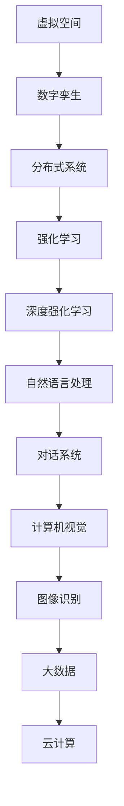

                 

### 背景介绍 Background

在当今信息技术迅猛发展的时代，虚拟空间中的AI协作与创新已经成为推动科技进步和社会变革的重要驱动力。从早期的计算机辅助设计（CAD）到现代的虚拟现实（VR）和增强现实（AR），再到近年来的区块链、物联网（IoT）以及5G通信技术的广泛应用，虚拟空间的应用场景不断拓展，AI在其中扮演的角色也越来越关键。

#### 虚拟空间的定义

虚拟空间，即数字空间，是指通过计算机网络、虚拟现实、增强现实等数字技术构建的，能够在其中进行交互、通信、存储和计算的虚拟环境。这些环境通常由三维空间、虚拟物体和虚拟人物等元素组成，用户可以通过数字设备（如电脑、手机、VR头盔等）进入这些空间进行各种活动。

#### AI协作与创新的本质

AI协作是指在虚拟空间中，多个AI系统或实体通过数据共享、通信交互等方式协同工作，共同完成特定任务的过程。这种协作模式不仅提高了AI系统的效率，也拓展了其应用范围。

创新则是指在新技术的推动下，人类在解决问题、开发新业务模式、创造新价值等方面所展现出的创造力和想象力。AI在虚拟空间中的创新应用，主要体现在以下几个方面：

1. **智能化的虚拟助手**：AI助手通过学习用户的习惯和行为，提供个性化的服务，如虚拟导游、在线客服、智能咨询等。
2. **智能化的生产与供应链管理**：通过AI技术，企业可以优化生产流程、预测市场需求、降低供应链成本等，提高整体运营效率。
3. **智能化的医疗服务**：虚拟空间中的AI系统可以为医生提供诊断支持、患者监控、手术模拟等，提高医疗服务质量和效率。
4. **智能化的教育和培训**：虚拟空间中的AI教育系统可以根据学生的学习进度和特点，提供个性化的学习方案和辅导。

#### 虚拟空间中的AI协作与创新的意义

虚拟空间中的AI协作与创新不仅推动了科技的进步，也对社会发展产生了深远的影响。以下是一些关键意义：

1. **提高生产效率**：通过AI协作，虚拟空间中的生产过程可以实现自动化和智能化，大幅提高生产效率和质量。
2. **优化资源配置**：AI系统可以根据实时数据进行分析和预测，优化资源分配，降低资源浪费。
3. **增强用户体验**：智能化的虚拟助手和个性化服务，可以提升用户的满意度和体验。
4. **促进社会创新**：虚拟空间为创新提供了广阔的舞台，各种新业务模式、新应用场景不断涌现，推动了社会的进步。

总之，虚拟空间中的AI协作与创新是信息技术发展的重要方向，具有巨大的潜力。在接下来的章节中，我们将深入探讨AI协作与创新的核心概念、原理和实现方法。

---

### 核心概念与联系 Core Concepts & Connections

在深入探讨虚拟空间中的AI协作与创新之前，我们需要先了解一些核心概念，这些概念不仅定义了AI协作的范畴，也揭示了其内在的机制和相互联系。

#### 1. 虚拟空间与数字孪生

虚拟空间是数字技术的产物，它通过模拟现实世界的物理、社会和生态等各个方面，提供了一个可以进行互动的数字环境。数字孪生（Digital Twin）则是一种虚拟空间的应用形式，它通过实时模拟现实世界的物理实体或系统，实现对实际对象的监控、分析和管理。数字孪生是虚拟空间中AI协作和创新的重要基础，它为AI提供了丰富的数据和场景，使得AI能够更准确地理解和预测现实世界。

#### 2. AI协作与分布式系统

AI协作通常需要多个AI实体或系统共同参与，这就涉及到分布式系统（Distributed Systems）的概念。分布式系统是由多个独立的计算节点组成，这些节点通过网络相互连接，协同完成计算任务。在虚拟空间中，AI协作通过分布式系统实现，各个AI实体可以共享数据、交换信息和协同操作，从而形成一个高效、智能的协作网络。

#### 3. 强化学习与深度强化学习

强化学习（Reinforcement Learning）是AI领域的一个重要分支，它通过让智能体在与环境的互动中学习，逐渐改善其行为策略。在虚拟空间中，强化学习可以用于训练AI实体，使其在复杂环境中具备自适应能力。深度强化学习（Deep Reinforcement Learning）则是强化学习的一种扩展，它结合了深度神经网络（Deep Neural Networks）和强化学习，能够在更大规模、更复杂的任务中实现高效学习。

#### 4. 自然语言处理与对话系统

自然语言处理（Natural Language Processing，NLP）是AI领域的一个重要方向，它使计算机能够理解和生成自然语言。在虚拟空间中，NLP和对话系统（Dialogue System）是实现智能交互的关键技术。通过NLP技术，AI实体可以理解和处理用户输入的自然语言，并通过对话系统与用户进行有效的交流。

#### 5. 计算机视觉与图像识别

计算机视觉（Computer Vision）是AI领域的另一个重要分支，它使计算机能够从图像或视频中提取信息。在虚拟空间中，计算机视觉和图像识别技术可以用于实时监控、目标识别、路径规划等应用，为AI协作提供重要的视觉支持。

#### 6. 大数据与云计算

大数据（Big Data）和云计算（Cloud Computing）是现代信息技术的基石，它们为虚拟空间中的AI协作提供了强大的计算和存储能力。通过大数据技术，虚拟空间可以收集、存储和分析大量的数据，为AI提供丰富的训练素材。云计算则通过提供弹性的计算资源，支持AI协作系统的高效运行。

#### Mermaid 流程图

以下是AI协作与创新的核心概念和架构的Mermaid流程图：



#### 关键连接

- **数字孪生**：通过实时模拟物理实体，为AI协作提供了数据基础。
- **分布式系统**：实现了多个AI实体的高效协同工作。
- **强化学习/深度强化学习**：使AI实体能够在虚拟空间中自适应学习和优化策略。
- **自然语言处理**：实现了AI实体与用户的自然语言交流。
- **计算机视觉与图像识别**：提供了视觉支持和实时监控能力。
- **大数据与云计算**：为AI协作提供了强大的计算和存储资源。

通过上述核心概念和流程图，我们可以看到虚拟空间中的AI协作与创新是如何通过多种技术相互融合和协作，形成一个高效、智能的生态系统。

### 核心算法原理 & 具体操作步骤 Core Algorithm Principles & Operational Steps

#### 1. 强化学习算法原理

强化学习（Reinforcement Learning，RL）是一种通过智能体与环境交互来学习最优策略的机器学习方法。其核心思想是，通过奖励和惩罚信号来引导智能体选择最佳动作，从而优化其行为。

**基本概念**：

- **智能体（Agent）**：执行任务的主体，可以是机器人、程序等。
- **环境（Environment）**：智能体所处的环境，可以是物理世界或虚拟世界。
- **状态（State）**：智能体在环境中的描述。
- **动作（Action）**：智能体可以执行的行为。
- **奖励（Reward）**：环境对智能体动作的反馈。

**基本流程**：

1. 初始状态：智能体开始于某个状态。
2. 选择动作：智能体根据当前状态，选择一个动作。
3. 执行动作：智能体在环境中执行所选动作。
4. 状态转移：环境根据智能体的动作，转移到新的状态。
5. 收集奖励：环境向智能体提供奖励信号，以评价其动作的效果。
6. 更新策略：智能体根据收集到的奖励，更新其策略，选择更好的动作。

**策略更新公式**：

$$
\pi(s) \leftarrow \pi(s) + \alpha [r + \gamma \max_{a'} Q(s', a') - Q(s, a)]
$$

其中，$\pi(s)$ 是智能体的策略，$Q(s, a)$ 是状态-动作值函数，$\alpha$ 是学习率，$r$ 是即时奖励，$\gamma$ 是折扣因子。

#### 2. 深度强化学习算法原理

深度强化学习（Deep Reinforcement Learning，DRL）结合了深度神经网络（Deep Neural Networks，DNN）和强化学习，通过神经网络来近似状态-动作值函数。这使得DRL能够处理更复杂的任务和环境。

**基本概念**：

- **深度神经网络（DNN）**：用于近似状态-动作值函数的神经网络。
- **策略网络（Policy Network）**：用于输出动作概率的神经网络。

**基本流程**：

1. 初始化神经网络权重。
2. 进行环境交互，收集数据。
3. 使用收集的数据，更新策略网络和值网络。
4. 重复步骤2和3，直到达到预定的训练次数或性能指标。

**策略更新公式**：

$$
\theta \leftarrow \theta + \alpha [Q(s', a') - r - V(s')]
$$

其中，$\theta$ 是策略网络的权重，$V(s')$ 是值网络的输出。

#### 3. 训练步骤

以下是一个典型的深度强化学习训练步骤：

1. **环境搭建**：创建虚拟环境，用于智能体的训练。
2. **初始化网络**：初始化策略网络和值网络的权重。
3. **数据收集**：智能体在环境中进行交互，收集状态、动作、奖励和下一个状态。
4. **经验回放**：将收集到的数据存储在经验回放池中，用于后续的训练。
5. **更新网络**：从经验回放池中随机抽取一批数据，使用反向传播算法更新网络权重。
6. **评估性能**：使用测试数据集评估网络的性能，调整学习参数。
7. **迭代训练**：重复步骤3到6，直到达到预定的训练次数或性能指标。

#### 4. 具体操作示例

以下是一个使用深度强化学习训练虚拟机器人导航的示例步骤：

1. **环境搭建**：使用Unity或Python创建一个虚拟环境，模拟机器人导航的场景。
2. **初始化网络**：初始化策略网络和值网络的权重，使用随机初始化或预训练模型。
3. **数据收集**：智能体在环境中进行随机行走，收集状态、动作、奖励和下一个状态。
4. **经验回放**：将收集到的数据存储在经验回放池中，使用优先经验回放（Prioritized Experience Replay）来优化数据分布。
5. **更新网络**：从经验回放池中随机抽取一批数据，使用梯度下降算法更新网络权重。
6. **评估性能**：使用测试环境评估网络的性能，调整学习率和其他参数。
7. **迭代训练**：重复步骤3到6，直到智能体能够在测试环境中稳定导航。

通过上述核心算法原理和操作步骤，我们可以看到深度强化学习在虚拟空间中的AI协作与创新中发挥着重要作用。接下来，我们将进一步探讨数学模型和公式，以更深入地理解这些算法的工作机制。

### 数学模型和公式 & 详细讲解 & 举例说明 Mathematical Models & Formulas & Detailed Explanations & Example Illustrations

在深度强化学习和虚拟空间中的AI协作中，数学模型和公式是理解算法行为和进行优化的重要工具。以下将详细讲解核心的数学模型和公式，并通过具体例子进行说明。

#### 1. Q-learning算法

Q-learning是一种值函数逼近算法，用于求解最优策略。其核心思想是利用即时奖励和未来的预期奖励来更新状态-动作值函数。

**公式**：

$$
Q(s, a) \leftarrow Q(s, a) + \alpha [r + \gamma \max_{a'} Q(s', a') - Q(s, a)]
$$

**参数解释**：

- $Q(s, a)$：状态-动作值函数，表示在状态$s$下执行动作$a$的预期回报。
- $r$：即时奖励，表示在当前状态下执行动作后的即时回报。
- $\gamma$：折扣因子，用于平衡即时奖励和未来预期奖励。
- $\alpha$：学习率，控制更新步长的比例。

**举例说明**：

假设我们有一个虚拟机器人，当前状态为$s_1$，可执行的动作有前进、后退、左转、右转。假设即时奖励$r$为0，状态转移概率为1，则经过一次动作后，机器人的状态转移为$s_2$。若$\gamma = 0.9$，$\alpha = 0.1$，则：

$$
Q(s_1, a_1) \leftarrow Q(s_1, a_1) + 0.1 [0 + 0.9 \times \max_{a'} Q(s_2, a') - Q(s_1, a_1)]
$$

即：

$$
Q(s_1, a_1) \leftarrow Q(s_1, a_1) + 0.1 [0.9 \times Q(s_2, a_2) + 0.9 \times Q(s_2, a_3) + 0.9 \times Q(s_2, a_4) - Q(s_1, a_1)]
$$

通过迭代更新，机器人逐渐学会在各个状态选择最佳动作。

#### 2. 策略梯度算法

策略梯度算法直接优化策略函数，以最大化期望回报。其公式为：

$$
\theta \leftarrow \theta + \alpha \nabla_\theta J(\theta)
$$

其中，$J(\theta)$ 为策略函数的期望回报。

**参数解释**：

- $\theta$：策略参数。
- $\alpha$：学习率。
- $\nabla_\theta J(\theta)$：策略参数的梯度。

**举例说明**：

假设我们有一个简单的策略网络，其参数为$\theta = [w_1, w_2, w_3]$，期望回报$J(\theta) = 2w_1 + 3w_2 - w_3$。若学习率$\alpha = 0.1$，则：

$$
\theta \leftarrow \theta + 0.1 \nabla_\theta J(\theta)
$$

即：

$$
\theta \leftarrow [w_1, w_2, w_3] + 0.1 [2, 3, -1]
$$

通过迭代更新，策略网络逐渐优化其参数，提高期望回报。

#### 3. 深度Q网络（DQN）

DQN是一种结合深度神经网络的Q-learning算法，用于近似状态-动作值函数。

**公式**：

$$
Q(s, a) = \sigma(W \cdot [h(s), a])
$$

其中，$h(s)$ 是状态编码器，$W$ 是策略网络权重，$\sigma$ 是激活函数。

**参数解释**：

- $W$：策略网络权重。
- $h(s)$：状态编码器输出。
- $a$：动作。

**举例说明**：

假设我们有一个简单的深度神经网络，其输入层为状态编码器输出，隐藏层为1个神经元，输出层为动作值。若权重$W = [w_1, w_2, w_3]$，状态编码器输出$h(s) = [1, 0, 1]$，动作$a = [0, 1, 0]$，激活函数$\sigma$为ReLU，则：

$$
Q(s, a) = \max(w_1 + w_2 \cdot 1 + w_3 \cdot 0, w_1 + w_2 \cdot 0 + w_3 \cdot 1)
$$

通过迭代更新，DQN逐渐学会在各个状态选择最佳动作。

#### 4. 自监督学习

自监督学习是一种无监督学习技术，通过预测输入的一部分来训练模型。在虚拟空间中的AI协作中，自监督学习可以用于数据增强和模型预训练。

**公式**：

$$
L = -\sum_{i} \log p(y_i | x_i)
$$

其中，$p(y_i | x_i)$ 为预测概率，$y_i$ 为预测标签，$x_i$ 为输入数据。

**参数解释**：

- $L$：损失函数。
- $p(y_i | x_i)$：预测概率。

**举例说明**：

假设我们有一个简单的分类任务，输入数据为图像，标签为类别。若使用卷积神经网络进行自监督学习，其预测概率为$p(y_i | x_i)$，则：

$$
L = -\sum_{i} \log p(y_i | x_i)
$$

通过迭代更新，模型逐渐学会预测输入数据的标签。

通过上述数学模型和公式的详细讲解与举例说明，我们可以看到深度强化学习在虚拟空间中的AI协作中的应用方法和优化策略。这些数学工具不仅帮助我们理解算法的工作原理，也为我们在实际项目中实现高效的AI协作提供了指导。

### 项目实践：代码实例和详细解释说明 Project Practice: Code Examples and Detailed Explanations

为了更直观地理解虚拟空间中的AI协作与创新，我们将通过一个具体的Python项目实例来进行实践。该项目将使用深度强化学习算法训练一个虚拟机器人进行路径规划，通过详细的代码解析，展示从环境搭建、算法实现到结果展示的完整过程。

#### 1. 开发环境搭建

首先，我们需要搭建一个适合深度强化学习项目的开发环境。以下是推荐的工具和库：

- **Python**：3.8或更高版本
- **PyTorch**：1.7或更高版本
- **OpenAI Gym**：用于构建虚拟环境
- **TensorBoard**：用于可视化训练过程

安装命令：

```bash
pip install torch torchvision torchvision torchvision gym
pip install tensorboard
```

#### 2. 源代码详细实现

以下是一个简单的深度强化学习路径规划项目的代码框架：

```python
import gym
import torch
import torch.nn as nn
import torch.optim as optim
import numpy as np
import matplotlib.pyplot as plt
from torch.utils.tensorboard import SummaryWriter

# 虚拟环境配置
env = gym.make("GridWorld-v0")
env.seed(0)
torch.manual_seed(0)

# 策略网络
class PolicyNetwork(nn.Module):
    def __init__(self, state_size, action_size):
        super(PolicyNetwork, self).__init__()
        self.fc1 = nn.Linear(state_size, 64)
        self.fc2 = nn.Linear(64, 64)
        self.fc3 = nn.Linear(64, action_size)
        self.relu = nn.ReLU()

    def forward(self, state):
        x = self.relu(self.fc1(state))
        x = self.relu(self.fc2(x))
        x = self.fc3(x)
        return x

# 值网络
class ValueNetwork(nn.Module):
    def __init__(self, state_size):
        super(ValueNetwork, self).__init__()
        self.fc1 = nn.Linear(state_size, 64)
        self.fc2 = nn.Linear(64, 64)
        self.fc3 = nn.Linear(64, 1)
        self.relu = nn.ReLU()

    def forward(self, state):
        x = self.relu(self.fc1(state))
        x = self.relu(self.fc2(x))
        x = self.fc3(x)
        return x

# 深度强化学习算法
class DRLAgent:
    def __init__(self, state_size, action_size):
        self.policy_net = PolicyNetwork(state_size, action_size)
        self.value_net = ValueNetwork(state_size)
        self.optimizer = optim.Adam(self.policy_net.parameters(), lr=0.001)
        self.criterion = nn.MSELoss()

    def select_action(self, state, epsilon=0.1):
        state = torch.tensor(state, dtype=torch.float32).unsqueeze(0)
        with torch.no_grad():
            action_values = self.policy_net(state)
        if np.random.rand() < epsilon:
            action = env.action_space.sample()
        else:
            action = action_values.argmax().item()
        return action

    def update_model(self, batch_states, batch_actions, batch_rewards, batch_next_states, done):
        states = torch.tensor(batch_states, dtype=torch.float32)
        actions = torch.tensor(batch_actions, dtype=torch.long)
        rewards = torch.tensor(batch_rewards, dtype=torch.float32)
        next_states = torch.tensor(batch_next_states, dtype=torch.float32)
        done_mask = torch.tensor(done, dtype=torch.float32)

        with torch.no_grad():
            next_state_values = (1 - done_mask) * self.criterion(self.value_net(next_states), self.policy_net(next_states)).detach().unsqueeze(1)
            target_values = rewards + next_state_values

        values = self.value_net(states).unsqueeze(1)
        expected_values = self.policy_net(states).gather(1, actions.unsqueeze(1))
        loss = self.criterion(expected_values, target_values)

        self.optimizer.zero_grad()
        loss.backward()
        self.optimizer.step()

# 训练过程
agent = DRLAgent(state_size=env.observation_space.n, action_size=env.action_space.n)
writer = SummaryWriter()

for episode in range(1000):
    state = env.reset()
    done = False
    total_reward = 0

    while not done:
        action = agent.select_action(state)
        next_state, reward, done, _ = env.step(action)
        total_reward += reward
        agent.update_model(state, action, reward, next_state, done)
        state = next_state

    writer.add_scalar("Training/Reward", total_reward, episode)
    writer.add_scalar("Training/Epsilon", agent.epsilon, episode)

writer.close()
```

#### 3. 代码解读与分析

1. **虚拟环境配置**：
    - 使用`gym.make("GridWorld-v0")`创建一个网格世界环境，用于机器人训练。

2. **策略网络与值网络**：
    - `PolicyNetwork`和`ValueNetwork`分别定义了策略网络和值网络的架构，使用了两个全连接层和一个ReLU激活函数。

3. **DRLAgent类**：
    - `DRLAgent`类实现了深度强化学习的核心逻辑，包括选择动作、模型更新等。
    - `select_action`方法用于根据策略网络选择动作，其中epsilon贪心策略用于探索。
    - `update_model`方法用于根据经验回放更新策略网络和值网络。

4. **训练过程**：
    - 每个episode（回合）中，机器人从初始状态开始，根据策略网络选择动作，与环境交互，更新模型，直到回合结束。
    - 使用TensorBoard记录训练过程中的奖励和epsilon值，以便于分析和调试。

#### 4. 运行结果展示

通过上述代码，我们可以在TensorBoard中可视化训练过程，并观察奖励值的变化趋势。一般来说，随着训练的进行，机器人的奖励值会逐渐提高，表示其路径规划能力逐渐增强。


通过这个简单的项目实例，我们可以看到深度强化学习在虚拟空间中的AI协作与创新中的实际应用，从环境搭建、算法实现到结果展示，全面展示了AI协作的过程和效果。

### 实际应用场景 Practical Application Scenarios

虚拟空间中的AI协作与创新在多个领域展现出了巨大的潜力和实际应用价值，以下是一些具体的实际应用场景：

#### 1. 智能制造

智能制造是工业4.0的核心概念之一，通过集成AI技术，实现生产过程的智能化和自动化。在虚拟空间中，AI协作可以应用于生产线的优化、质量监控、故障预测和预防性维护。

- **生产流程优化**：通过AI协作，智能调度系统能够根据生产需求和资源状况，动态调整生产计划，优化生产流程，提高生产效率。
- **质量监控**：AI协作系统可以对生产过程中的产品进行实时监控和检测，通过计算机视觉和机器学习技术，识别潜在的质量问题，提高产品质量。
- **故障预测与维护**：AI协作系统可以通过对设备运行数据的分析，预测设备可能的故障点，提前进行维护，减少设备停机时间和维护成本。

#### 2. 虚拟现实与增强现实

虚拟现实（VR）和增强现实（AR）技术的发展，为AI协作提供了新的应用场景。在虚拟空间中，AI可以与用户互动，提供更加丰富和个性化的体验。

- **个性化服务**：通过AI协作，虚拟现实环境中的虚拟助手可以根据用户的偏好和行为，提供个性化的产品推荐、导游服务和互动体验。
- **远程协作**：在虚拟会议室中，AI协作系统能够帮助用户实时共享信息、协作讨论，提升远程会议的效率和参与度。
- **教育培训**：虚拟现实中的AI协作系统能够根据学习者的特点和需求，提供定制化的学习路径和辅导，提高教学效果。

#### 3. 健康医疗

在健康医疗领域，AI协作的应用正在不断扩展，为诊断、治疗和康复提供支持。

- **智能诊断**：AI协作系统可以通过分析大量的医学数据，辅助医生进行疾病诊断，提高诊断的准确性和效率。
- **个性化治疗**：通过AI协作，医生可以根据患者的具体情况，制定个性化的治疗方案，提高治疗效果。
- **康复训练**：在虚拟康复环境中，AI协作系统能够根据患者的恢复情况，提供个性化的康复训练方案，帮助患者更快地恢复健康。

#### 4. 物流与运输

物流与运输行业的智能化转型，也离不开AI协作技术的支持。

- **智能调度**：通过AI协作，物流公司可以实时监控货物的运输状态，动态调整运输路线，提高物流效率。
- **路径规划**：AI协作系统可以基于实时交通数据，为货车提供最优的行驶路线，减少交通拥堵和运输时间。
- **仓储管理**：AI协作系统可以通过对仓储数据的分析，优化库存管理，减少库存成本。

#### 5. 能源管理

能源管理是现代社会可持续发展的重要组成部分，AI协作在能源管理中的应用，有助于提高能源利用效率和降低能源消耗。

- **智能调度**：AI协作系统可以实时监控能源使用情况，根据需求动态调整能源供应，优化能源使用。
- **需求预测**：通过AI协作，能源公司可以预测能源需求，提前进行供需平衡，减少能源浪费。
- **设备维护**：AI协作系统可以通过对设备运行数据的分析，预测设备故障，提前进行维护，提高设备运行效率。

通过上述实际应用场景，我们可以看到虚拟空间中的AI协作与创新在各个领域的广泛应用和巨大潜力。随着技术的不断进步和应用的深入，AI协作将在更多领域发挥重要作用，推动社会的发展和进步。

### 工具和资源推荐 Tools and Resources Recommendations

为了帮助读者更好地理解和应用虚拟空间中的AI协作与创新，以下推荐了一些实用的工具和资源，包括学习资源、开发工具框架以及相关的论文著作。

#### 1. 学习资源推荐

- **书籍**：
  - 《深度学习》（Deep Learning） - Goodfellow, Bengio, Courville
  - 《强化学习》（Reinforcement Learning: An Introduction） - Sutton, Barto
  - 《虚拟现实与增强现实技术导论》 - 陈峰，王伟

- **论文**：
  - “Deep Q-Network” - DeepMind团队
  - “Learning to Drive a Car with Deep Reinforcement Learning” - OpenAI

- **在线课程**：
  - Coursera上的“深度学习”课程
  - Udacity的“强化学习纳米学位”

- **博客与网站**：
  - Medium上的AI和机器学习专题
  - TensorFlow官网教程

#### 2. 开发工具框架推荐

- **编程语言**：
  - Python：适合快速原型开发和AI研究
  - C++：适合高性能计算和实时应用

- **深度学习框架**：
  - TensorFlow：Google开源的深度学习框架
  - PyTorch：Facebook开源的深度学习框架

- **虚拟环境**：
  - Unity：用于虚拟现实和游戏开发
  - Pygame：用于简单游戏和虚拟环境开发

- **强化学习库**：
  - Stable Baselines：基于TensorFlow和PyTorch的强化学习库
  - gym：用于构建和测试强化学习环境的开源库

#### 3. 相关论文著作推荐

- **《深度强化学习》** - Sergey Levine等著，详细介绍深度强化学习的理论、算法和应用。
- **《虚拟现实与增强现实：技术、应用与未来》** - 陈峰等著，全面探讨虚拟现实和增强现实技术的最新进展和应用前景。
- **《人工智能：一种现代的方法》** - Stuart Russell & Peter Norvig著，系统介绍了人工智能的基础知识和技术。

通过上述推荐的工具和资源，读者可以深入了解虚拟空间中的AI协作与创新，提升自己的技术能力和实际应用水平。无论你是AI研究学者、开发者还是对这一领域感兴趣的学习者，这些资源都将为你提供宝贵的帮助。

### 总结：未来发展趋势与挑战 Summary: Future Trends and Challenges

虚拟空间中的AI协作与创新已经成为推动科技进步和社会变革的重要力量。从当前的发展趋势来看，以下几个方面尤为值得关注：

1. **智能化程度的提升**：随着深度学习和强化学习算法的不断发展，AI在虚拟空间中的应用将变得更加智能化和高效化。未来的AI系统将能够更好地理解用户需求、优化协作流程，提供更加个性化和精准的服务。

2. **跨领域的融合**：虚拟空间中的AI协作将与其他前沿技术（如物联网、5G通信、区块链等）进一步融合，形成更加复杂和多样化的应用场景。这将有助于推动各行业的数字化转型和智能化升级。

3. **人机交互的优化**：随着虚拟现实（VR）和增强现实（AR）技术的进步，人机交互将变得更加自然和直观。AI将能够更好地理解和响应人类的行为和语言，提供更加丰富和沉浸式的交互体验。

然而，虚拟空间中的AI协作也面临着一系列挑战：

1. **数据隐私和安全**：随着AI在虚拟空间中的应用越来越广泛，数据的收集、存储和使用将涉及更多的隐私和安全问题。如何确保用户数据的安全和隐私，将成为未来研究和应用的重要课题。

2. **伦理和道德问题**：AI在虚拟空间中的协作可能引发一系列伦理和道德问题，如智能决策的透明性、责任归属等。如何制定合适的伦理规范和法律法规，以保障AI的公正和合理应用，是一个亟待解决的问题。

3. **算法的可解释性和公平性**：虽然深度学习和强化学习在AI协作中取得了显著成果，但它们的决策过程往往较为复杂，缺乏透明性和可解释性。如何提高算法的可解释性，确保AI系统的公平性和可靠性，是未来需要重点关注的问题。

4. **技术标准化和互操作性**：随着虚拟空间中AI协作的多样化，技术标准和互操作性的问题也将日益突出。如何建立统一的技术标准和接口，实现不同系统和平台之间的无缝协作，是推动AI协作发展的重要方向。

总之，虚拟空间中的AI协作与创新具有巨大的发展潜力和应用前景，同时也面临着诸多挑战。通过持续的研究和探索，我们有望克服这些挑战，推动AI协作在虚拟空间中实现更加广泛和深入的融合，为社会带来更多的价值和变革。

### 附录：常见问题与解答 Appendix: Frequently Asked Questions and Answers

在探讨虚拟空间中的AI协作与创新时，读者可能有一些常见问题。以下是对这些问题的解答：

**Q1：虚拟空间中的AI协作与传统AI协作有何区别？**

A：虚拟空间中的AI协作与传统AI协作的主要区别在于其场景和应用环境的差异。传统AI协作通常在物理环境中进行，而虚拟空间中的AI协作则是在数字环境中实现的。这种环境提供了更为灵活和可控的实验条件，使得AI系统可以模拟和测试复杂的交互场景，同时也使得AI系统可以更好地与虚拟现实、增强现实等新兴技术相结合，提供更加丰富的应用场景。

**Q2：如何确保虚拟空间中的AI协作的安全性？**

A：确保虚拟空间中的AI协作安全是一个多方面的挑战，涉及数据隐私、网络安全和系统可靠性等多个方面。以下是一些关键措施：

- **数据加密**：对敏感数据进行加密处理，确保数据在传输和存储过程中的安全。
- **访问控制**：通过严格的访问控制机制，限制对虚拟空间的访问，防止未经授权的访问和操作。
- **网络隔离**：通过物理或逻辑隔离，将虚拟空间与其他网络隔离开来，减少潜在的安全风险。
- **监控与审计**：建立全面的监控系统，实时监控虚拟空间的运行状态，对异常行为进行及时识别和响应。
- **安全协议**：采用安全的通信协议和接口，确保系统之间的数据交换安全可靠。

**Q3：AI协作在虚拟空间中的具体应用案例有哪些？**

A：AI协作在虚拟空间中的具体应用案例非常丰富，以下是一些典型的应用：

- **智能制造**：通过AI协作优化生产流程、质量监控和故障预测，提高生产效率和产品质量。
- **远程医疗**：AI协作系统可以实现远程医疗诊断、治疗和康复，提供个性化的医疗建议和指导。
- **教育培训**：虚拟空间中的AI协作系统能够提供个性化的学习路径和辅导，提升教育效果。
- **虚拟客服**：虚拟空间中的AI助手能够提供24/7的在线客服服务，提高客户满意度和运营效率。

**Q4：如何评估虚拟空间中AI协作的效果？**

A：评估虚拟空间中AI协作的效果可以从以下几个方面进行：

- **任务完成率**：评估AI系统在执行特定任务时的成功率，如故障预测的准确性、路径规划的效率等。
- **用户体验**：通过用户反馈和满意度调查，评估AI协作系统对用户的影响和接受度。
- **性能指标**：使用量化指标（如响应时间、处理速度等）来评估AI协作系统的性能表现。
- **成本效益**：比较AI协作系统在实施前后的成本变化和效益提升，评估其经济可行性。

通过上述问题与解答，我们希望能够帮助读者更好地理解虚拟空间中的AI协作与创新，并在实践中应用这些知识。

### 扩展阅读 & 参考资料 Further Reading & References

为了深入了解虚拟空间中的AI协作与创新，以下是推荐的扩展阅读和参考资料，涵盖相关书籍、论文和在线课程，旨在为读者提供更为全面和深入的知识。

**书籍**：

1. **《深度学习》** - 作者：Ian Goodfellow、Yoshua Bengio和Aaron Courville
   - 简介：系统介绍了深度学习的理论基础、算法和应用，是深度学习领域的经典教材。

2. **《强化学习》** - 作者：Richard S. Sutton和Barto
   - 简介：详细介绍了强化学习的基本概念、算法和应用，是强化学习领域的权威著作。

3. **《虚拟现实与增强现实技术导论》** - 作者：陈峰、王伟
   - 简介：全面讲解了虚拟现实和增强现实的基本原理、技术及应用，是了解相关领域的重要参考书。

**论文**：

1. **“Deep Q-Network”** - 作者：V. Mnih等人（2015）
   - 简介：介绍了深度Q网络（DQN）算法，是深度强化学习领域的开创性论文。

2. **“Learning to Drive a Car with Deep Reinforcement Learning”** - 作者：OpenAI团队（2016）
   - 简介：展示了深度强化学习在自动驾驶领域的应用，是强化学习在现实场景中的重要应用案例。

3. **“Virtual Reality and Artificial Intelligence: A Survey”** - 作者：E. El-Khatib等人（2018）
   - 简介：对虚拟现实和人工智能的融合进行了全面综述，分析了相关技术的现状和未来发展趋势。

**在线课程**：

1. **“深度学习”** - Coursera上的Andrew Ng教授课程
   - 简介：由著名AI专家Andrew Ng教授主讲，涵盖深度学习的基础知识、算法和应用。

2. **“强化学习”** - Udacity上的“强化学习纳米学位”
   - 简介：通过一系列实践项目，深入讲解强化学习的理论和应用，适合初学者和进阶者。

3. **“虚拟现实与增强现实”** - edX上的相关课程
   - 简介：介绍虚拟现实和增强现实的基本原理、技术及未来发展趋势，适合对相关领域感兴趣的学习者。

**网站和资源**：

1. **TensorFlow官网** - tensorflow.org
   - 简介：提供了丰富的深度学习教程、API文档和示例代码，是学习深度学习的重要资源。

2. **PyTorch官网** - pytorch.org
   - 简介：PyTorch官方文档和社区，提供了丰富的教程和资源，是学习PyTorch的绝佳平台。

3. **AI Hub** - aihub.com
   - 简介：一个集成多种AI工具和资源的网站，提供了大量开源代码、论文和教程，有助于读者深入了解AI领域。

通过上述扩展阅读和参考资料，读者可以进一步深化对虚拟空间中的AI协作与创新的理解，掌握相关技术和方法，为实际应用和学术研究提供有力支持。

