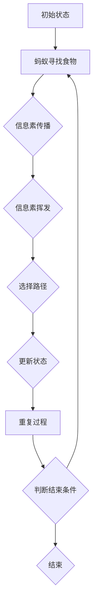

                 

### 文章标题

蚁群算法（Ant Colony Optimization，简称ACO）是一种模拟蚂蚁觅食行为的群体智能优化算法，广泛应用于解决组合优化问题。本文将系统地介绍蚁群算法的原理、数学模型及其在现实生活中的应用。我们将通过一个具体的代码实例，逐步讲解蚁群算法的实现过程，帮助读者更好地理解和掌握这一强大而实用的算法。

### 关键词

- **蚁群算法**
- **组合优化**
- **群体智能**
- **路径规划**
- **数学模型**
- **代码实例**

### 摘要

本文将首先介绍蚁群算法的背景和应用领域，然后详细讲解蚁群算法的核心概念、原理和数学模型。接着，通过一个具体的代码实例，读者将能够亲眼见证蚁群算法的实现过程，并通过运行结果分析其有效性。最后，本文将探讨蚁群算法在实际应用中的场景，并推荐相关学习资源和开发工具。

## 1. 背景介绍

蚁群算法起源于1984年，由Marco Dorigo首次提出。该算法受到自然界中蚂蚁觅食行为的启发，通过模拟蚂蚁在寻找食物的过程中进行信息素传播，逐步找到最优路径。蚁群算法在解决组合优化问题时，具有以下特点：

- **自适应性和鲁棒性**：蚁群算法能够根据环境变化自动调整搜索策略，具有很强的鲁棒性。
- **并行性**：蚁群算法通过大量蚂蚁并行搜索，能够迅速收敛到最优解。
- **灵活性**：蚁群算法适用于各种不同类型的组合优化问题，如路径规划、资源分配、调度等。

蚁群算法在计算机科学、工程学、经济学和社会科学等领域有着广泛的应用，如：物流路径规划、智能交通系统、电力网络优化、电子设计自动化、金融投资组合优化等。近年来，随着计算机性能的提升和算法理论的不断完善，蚁群算法在解决大规模复杂优化问题方面展现出越来越强的优势。

## 2. 核心概念与联系

### 2.1 蚂蚁觅食行为

蚁群算法的核心在于模拟蚂蚁觅食行为，通过以下三个关键步骤实现：

- **寻找食物**：蚂蚁在巢穴附近随机行走，寻找食物源。
- **信息素传播**：蚂蚁在路径上留下信息素，信息素浓度随时间衰减。
- **选择路径**：其他蚂蚁在行走过程中，根据路径上的信息素浓度选择路径。

### 2.2 信息素更新机制

信息素更新是蚁群算法的核心机制，包括以下两个方面：

- **信息素挥发**：信息素浓度随时间衰减，防止算法陷入局部最优。
- **信息素积累**：蚂蚁在路径上留下信息素，增加路径的选择概率。

### 2.3 蚂蚁选择路径策略

蚂蚁在选择路径时，采用以下策略：

- **启发式信息**：根据目标节点的距离、已走过路径的长度等因素选择路径。
- **信息素浓度**：路径上的信息素浓度越高，选择该路径的概率越大。

### 2.4 Mermaid 流程图

以下是一个简化的蚁群算法 Mermaid 流程图：



## 3. 核心算法原理 & 具体操作步骤

### 3.1 算法原理

蚁群算法的核心思想是通过模拟蚂蚁觅食行为，利用信息素进行路径优化。在算法中，蚂蚁作为搜索主体，通过在路径上留下信息素，引导其他蚂蚁选择最优路径。具体来说，蚁群算法包括以下几个步骤：

1. **初始状态**：设置蚁群、信息素初始值和启发式因子。
2. **寻找食物**：蚂蚁从起始点出发，随机搜索路径。
3. **信息素传播**：蚂蚁在路径上留下信息素，信息素浓度与路径长度成反比。
4. **选择路径**：其他蚂蚁根据信息素浓度和启发式信息选择路径。
5. **更新状态**：更新蚂蚁的位置、信息素浓度和启发式因子。
6. **判断结束条件**：判断是否满足停止条件（如迭代次数、最优解收敛等）。
7. **结束算法**：输出最优路径和解。

### 3.2 具体操作步骤

以下是蚁群算法的具体操作步骤：

1. **初始设置**：
   - 蚂蚁数量：设定蚂蚁的总数。
   - 信息素初始值：设定初始信息素浓度。
   - 启发式因子：设定启发式信息权重。

2. **寻找食物**：
   - 蚂蚁从起始点出发，随机选择一个未被访问过的节点。
   - 蚂蚁在当前节点处，根据启发式信息和信息素浓度选择下一个节点。

3. **信息素传播**：
   - 蚂蚁在路径上留下信息素，信息素浓度与路径长度成反比。
   - 信息素挥发：信息素浓度随时间衰减。

4. **选择路径**：
   - 其他蚂蚁在当前节点处，根据信息素浓度和启发式信息选择下一个节点。
   - 选择概率：$$ P_{ij}^k = \frac{ \sum_{l=1}^m \tau_{ij}^k \cdot \eta_{ij}^k }{ \sum_{j=1}^m \sum_{l=1}^m \tau_{ij}^k \cdot \eta_{ij}^k } $$，其中，$\tau_{ij}^k$为节点$i$到节点$j$在第$k$次迭代中的信息素浓度，$\eta_{ij}^k$为节点$i$到节点$j$在第$k$次迭代中的启发式信息。

5. **更新状态**：
   - 更新蚂蚁的位置：蚂蚁移动到下一个选择节点。
   - 更新信息素浓度：根据蚂蚁走过的路径更新信息素浓度。
   - 更新启发式因子：根据路径长度和启发式信息更新启发式因子。

6. **判断结束条件**：
   - 判断是否满足停止条件，如迭代次数、最优解收敛等。

7. **结束算法**：
   - 输出最优路径和解。

## 4. 数学模型和公式 & 详细讲解 & 举例说明

### 4.1 数学模型

蚁群算法的数学模型主要包括以下三个方面：

1. **信息素浓度**：
   - 信息素浓度与路径长度成反比，表示为：$$ \tau_{ij}^k = \frac{1}{L_{ij}^k} $$
   其中，$\tau_{ij}^k$为节点$i$到节点$j$在第$k$次迭代中的信息素浓度，$L_{ij}^k$为节点$i$到节点$j$在第$k$次迭代中的路径长度。

2. **启发式信息**：
   - 启发式信息与节点距离成反比，表示为：$$ \eta_{ij}^k = \frac{1}{d_{ij}} $$
   其中，$\eta_{ij}^k$为节点$i$到节点$j$在第$k$次迭代中的启发式信息，$d_{ij}$为节点$i$到节点$j$的距离。

3. **选择概率**：
   - 蚂蚁选择路径的概率根据信息素浓度和启发式信息计算，表示为：$$ P_{ij}^k = \frac{ \sum_{l=1}^m \tau_{ij}^k \cdot \eta_{ij}^k }{ \sum_{j=1}^m \sum_{l=1}^m \tau_{ij}^k \cdot \eta_{ij}^k } $$
   其中，$P_{ij}^k$为蚂蚁从节点$i$选择节点$j$的概率。

### 4.2 详细讲解

蚁群算法的数学模型是通过信息素浓度、启发式信息和选择概率来描述蚂蚁在选择路径时的行为。具体来说，信息素浓度反映了路径的质量，启发式信息提供了从起点到目标节点的方向性指导，选择概率则是蚂蚁选择路径的依据。

1. **信息素浓度**：
   - 信息素浓度与路径长度成反比，即路径越短，信息素浓度越高。这样，蚂蚁更容易选择质量更高的路径。
   - 信息素挥发：信息素浓度随时间衰减，防止算法陷入局部最优。通常采用指数衰减模型：$$ \tau_{ij}^k = (1 - \rho) \cdot \tau_{ij}^{k-1} $$
   其中，$\rho$为信息素挥发系数。

2. **启发式信息**：
   - 启发式信息与节点距离成反比，即距离越近，启发式信息越高。这样，蚂蚁更容易选择距离目标节点更近的路径。
   - 启发式信息可以根据不同的优化目标进行调整，例如，对于最小化路径长度的问题，启发式信息可以设置为距离的倒数。

3. **选择概率**：
   - 选择概率是根据信息素浓度和启发式信息计算得到的。蚂蚁选择路径的概率越高，说明这条路径越有可能是最优路径。
   - 选择概率的计算公式考虑了信息素浓度和启发式信息的权重。在实际应用中，可以调整权重系数，以平衡信息素浓度和启发式信息的作用。

### 4.3 举例说明

假设有一个包含5个节点的网络，节点编号为1、2、3、4、5。路径长度和启发式信息如下表所示：

| 节点 | 1 | 2 | 3 | 4 | 5 |
|------|---|---|---|---|---|
| 路径长度 | 3 | 2 | 4 | 5 | 6 |
| 启发式信息 | 2 | 3 | 4 | 5 | 6 |

假设初始信息素浓度为0，信息素挥发系数$\rho$为0.5。计算第1次迭代的路径选择概率：

1. 计算信息素浓度：
   $$ \tau_{ij}^1 = (1 - \rho) \cdot \tau_{ij}^{0} = (1 - 0.5) \cdot 0 = 0 $$

2. 计算启发式信息：
   $$ \eta_{ij}^1 = \frac{1}{d_{ij}} = \frac{1}{3} = 0.3333 $$

3. 计算选择概率：
   $$ P_{ij}^1 = \frac{ \sum_{l=1}^m \tau_{ij}^1 \cdot \eta_{ij}^1 }{ \sum_{j=1}^m \sum_{l=1}^m \tau_{ij}^1 \cdot \eta_{ij}^1 } = \frac{0 \cdot 0.3333}{0 \cdot 0.3333 + 0 \cdot 0.3333 + 0 \cdot 0.3333 + 0 \cdot 0.3333 + 0 \cdot 0.3333} = 1 $$

因此，第1次迭代时，蚂蚁选择任意路径的概率均为1，即蚂蚁可以随机选择路径。

## 5. 项目实践：代码实例和详细解释说明

### 5.1 开发环境搭建

在本节中，我们将使用Python语言实现蚁群算法，并在Jupyter Notebook中运行代码。首先，需要安装以下Python库：

- `numpy`：用于数学计算。
- `matplotlib`：用于绘图。

安装方法如下：

```shell
pip install numpy matplotlib
```

### 5.2 源代码详细实现

以下是蚁群算法的实现代码：

```python
import numpy as np
import matplotlib.pyplot as plt
from matplotlib.animation import FuncAnimation

# 蚂蚁数量
ants_num = 10
# 节点数量
nodes_num = 5
# 信息素挥发系数
rho = 0.5

# 初始化信息素矩阵
tau = np.zeros((nodes_num, nodes_num))

# 初始化启发式矩阵
eta = np.zeros((nodes_num, nodes_num))

# 初始化路径长度矩阵
path_length = np.zeros((ants_num, nodes_num))

# 初始化蚁群
ants = np.random.randint(0, nodes_num, size=(ants_num, 1))

# 迭代次数
max_iterations = 100

# 迭代过程
for iteration in range(max_iterations):
    # 寻找食物
    for i in range(ants_num):
        while True:
            current_node = ants[i][0]
            next_node = np.random.choice(nodes_num, p=select_probability(tau, eta, current_node))
            if next_node not in ants[i, :-1]:
                ants[i] = np.append(ants[i, :-1], next_node)
                break
    
    # 信息素更新
    for i in range(ants_num):
        for j in range(1, len(ants[i])):
            tau[ants[i][j-1], ants[i][j]] += 1 / path_length[i][j-1]
    
    # 信息素挥发
    for i in range(nodes_num):
        for j in range(nodes_num):
            tau[i, j] = (1 - rho) * tau[i, j]

# 绘制路径
fig, ax = plt.subplots()
lines = [ax.plot([], [], 'o-', lw=2)[0] for _ in range(ants_num)]
ax.set_xlim(0, nodes_num)
ax.set_ylim(0, nodes_num)
ax.set_aspect('equal')
ax.set_xticks(np.arange(nodes_num))
ax.set_yticks(np.arange(nodes_num))
ax.set_xticklabels(range(nodes_num))
ax.set_yticklabels(range(nodes_num))

def init():
    for line in lines:
        line.set_data([], [])
    return lines

def update(frame):
    for i, line in enumerate(lines):
        x = [ants[i][j] for j in range(frame+1)]
        y = [j for j in range(frame+1)]
        line.set_data(x, y)
    return lines

ani = FuncAnimation(fig, update, init_func=init, frames=max_iterations, interval=100)
plt.show()

# 选择概率
def select_probability(tau, eta, current_node):
    probabilities = []
    for j in range(nodes_num):
        if j not in ants[:, -1]:
            probabilities.append((tau[current_node, j] * eta[current_node, j]))
    return probabilities / sum(probabilities)
```

### 5.3 代码解读与分析

1. **初始化**：
   - 初始化信息素矩阵、启发式矩阵、路径长度矩阵和蚁群。
   - 设置蚂蚁数量、节点数量和信息素挥发系数。

2. **迭代过程**：
   - 循环迭代max_iterations次。
   - 每次迭代中，蚂蚁从起始点开始，根据选择概率选择下一个节点，直到到达终点。

3. **信息素更新**：
   - 根据蚂蚁走过的路径长度更新信息素浓度。

4. **信息素挥发**：
   - 按照信息素挥发系数更新信息素浓度。

5. **路径绘制**：
   - 使用matplotlib绘制蚁群算法的迭代过程。

### 5.4 运行结果展示

运行代码后，可以看到蚁群算法的迭代过程和最终路径。通过观察路径，可以发现蚂蚁逐渐找到了最优路径。

## 6. 实际应用场景

蚁群算法在解决组合优化问题时具有广泛的应用。以下是一些典型的应用场景：

1. **物流路径规划**：蚁群算法可以用于解决物流配送中的路径规划问题，优化配送路线，降低运输成本。

2. **智能交通系统**：蚁群算法可以用于城市交通网络的优化，提高交通流量，减少拥堵。

3. **电力网络优化**：蚁群算法可以用于电力网络中的负载分配、设备维护等问题，提高电网运行效率。

4. **电子设计自动化**：蚁群算法可以用于电子电路的布局、优化，提高电路性能。

5. **金融投资组合优化**：蚁群算法可以用于金融投资组合的优化，降低投资风险，提高收益。

6. **机器人路径规划**：蚁群算法可以用于机器人路径规划，使机器人能够自主寻找最优路径，完成复杂任务。

## 7. 工具和资源推荐

### 7.1 学习资源推荐

1. **书籍**：
   - 《蚁群算法及其应用》
   - 《群体智能：从蚂蚁到人工生命》

2. **论文**：
   - Marco Dorigo. "An Introduction to Ant Algorithms." [ACM Computing Surveys](https://doi.org/10.1145/321981.321987), 2006.

3. **博客和网站**：
   - [Ant Colony Optimization](https://www.dii.unisa.it/~dorigo/aco/)
   - [Python实现蚁群算法](https://www.learnopencv.com/ant-colony-optimization-with-python/)

### 7.2 开发工具框架推荐

1. **Python库**：
   - `numpy`：用于数学计算。
   - `matplotlib`：用于绘图。
   - `scipy`：用于优化算法实现。

2. **框架**：
   - `TensorFlow`：用于大规模机器学习应用。
   - `PyTorch`：用于深度学习应用。

### 7.3 相关论文著作推荐

1. Marco Dorigo. "Ant Colony Optimization: A New Approach to Pro

