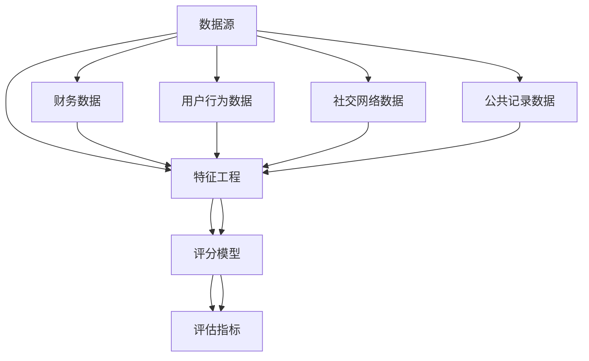

                 

### 背景介绍 Background Introduction

蚂蚁智能信用评分系统是一个高度复杂且至关重要的工具，它在金融科技、风险管理和个人信用评估等领域发挥着重要作用。该系统的目标是通过分析用户的多种数据源，如行为数据、社交网络数据、财务状况数据等，来生成一个综合的信用评分，从而帮助金融机构和商业实体更准确地评估用户的信用风险。

蚂蚁集团作为中国领先的技术和金融科技巨头，其智能信用评分系统凭借先进的技术和大数据分析能力，已经成为行业内的标杆。蚂蚁智能信用评分系统不仅服务于消费者信贷、供应链金融等领域，还广泛应用于反欺诈、风险控制等场景。其重要性体现在以下几个方面：

1. **风险控制**：通过精准的信用评分，金融机构可以有效控制信贷风险，减少坏账率，提高贷款业务的盈利能力。
2. **消费者体验**：基于用户信用评分的结果，金融机构可以提供个性化的金融服务，优化用户体验。
3. **业务拓展**：智能信用评分系统有助于金融机构拓展新市场，吸引更多用户。
4. **反欺诈**：系统可以通过分析用户行为特征，及时发现并防止欺诈行为，保障用户的财产安全。

本文旨在深入解析蚂蚁智能信用评分系统的原理、算法模型、应用场景，并提供详细的代码实例和解析，帮助读者全面理解这一系统的工作机制。接下来的章节将逐步介绍系统架构、核心算法、数学模型、实际应用，以及相关的工具和资源。

### 核心概念与联系 Key Concepts and Relationships

为了深入理解蚂蚁智能信用评分系统，我们首先需要明确几个核心概念及其相互之间的关系。这些概念是构建信用评分模型的基础，也是系统工作的关键要素。

#### 1. 数据源 Data Sources

蚂蚁智能信用评分系统的数据来源非常广泛，包括但不限于以下几个方面：

1. **用户行为数据**：用户的消费记录、购物偏好、浏览历史等，这些都是反映用户信用风险的重要信号。
2. **社交网络数据**：用户在社交平台上的互动、朋友圈的构成、社交圈的活跃度等，这些数据可以揭示用户的社交信用状况。
3. **财务数据**：用户的收入水平、资产负债状况、还款历史等，这些是评估用户还款能力的直接指标。
4. **公共记录数据**：包括用户的信用报告、诉讼记录、司法执行记录等，这些数据可以提供关于用户信用历史的详细背景信息。

#### 2. 特征工程 Feature Engineering

在收集到大量的原始数据后，需要进行特征工程，将数据转换成可以输入到模型中的特征。特征工程是提高模型性能的关键步骤，包括以下内容：

1. **特征提取**：从原始数据中提取出有助于预测信用评分的有效特征，例如用户的行为频率、消费额度、财务稳定性等。
2. **特征选择**：通过统计方法、机器学习算法等手段，筛选出对信用评分贡献最大的特征，去除冗余或噪声特征。
3. **特征转化**：对某些特征进行数值化、归一化或离散化等处理，以适应模型的输入要求。

#### 3. 评分模型 Scoring Model

评分模型是信用评分系统的核心，它基于输入特征生成一个信用评分。常见的评分模型包括：

1. **逻辑回归 Logistic Regression**：通过建立线性模型，预测用户违约的概率。
2. **决策树 Decision Tree**：通过构建树形结构，将用户划分为不同的类别。
3. **随机森林 Random Forest**：结合多个决策树，提高预测的稳定性和准确性。
4. **梯度提升机 Gradient Boosting Machine**：通过迭代优化，提高模型对复杂数据的拟合能力。

#### 4. 评估指标 Evaluation Metrics

为了评估评分模型的性能，需要使用一些评估指标，包括：

1. **准确率 Accuracy**：模型预测正确的样本数占总样本数的比例。
2. **召回率 Recall**：模型预测为正类的真实正类样本数占总正类样本数的比例。
3. **F1 分数 F1 Score**：准确率和召回率的调和平均，平衡了模型的精确性和召回性。
4. **ROC 曲线 ROC Curve**：通过计算不同阈值下的真阳性率（True Positive Rate，TPR）和假阳性率（False Positive Rate，FPR）来评估模型的分类性能。

#### 5. 联系关系 Relationship

各个核心概念之间的关系可以用以下 Mermaid 流程图来表示：



通过这张图，我们可以清晰地看到数据源如何通过特征工程转化为评分模型，并最终通过评估指标来衡量模型的性能。

### 核心算法原理 Core Algorithm Principle & Step-by-Step Operations

蚂蚁智能信用评分系统的核心算法原理主要基于机器学习和数据挖掘技术。以下将详细阐述其算法原理、数据流程以及具体操作步骤。

#### 1. 算法原理 Algorithm Principle

蚂蚁智能信用评分系统采用了多种机器学习算法，其中最常用的包括逻辑回归（Logistic Regression）、决策树（Decision Tree）、随机森林（Random Forest）和梯度提升机（Gradient Boosting Machine，GBM）。每种算法都有其独特的优势和应用场景。

1. **逻辑回归（Logistic Regression）**：
   - 基本原理：逻辑回归是一种广义线性模型，用于预测二分类问题。其核心思想是通过输入特征建立线性模型，再通过Sigmoid函数将其映射到（0，1）区间，表示事件发生的概率。
   - 算法步骤：
     - 输入特征：用户的行为数据、财务数据、社交网络数据和公共记录数据等。
     - 建立线性模型：\( P = \frac{1}{1 + e^{-\beta^T X}} \)，其中\( P \)是事件发生的概率，\( X \)是特征向量，\( \beta \)是模型参数。
     - 模型训练：通过极大似然估计（Maximum Likelihood Estimation，MLE）或梯度下降（Gradient Descent）等优化方法，求解模型参数\( \beta \)。

2. **决策树（Decision Tree）**：
   - 基本原理：决策树是一种树形结构模型，通过一系列决策规则对数据进行分类或回归。每个节点代表一个特征，每个分支代表特征的取值。
   - 算法步骤：
     - 特征选择：选择最优特征进行分割，常用的指标包括信息增益（Information Gain）、基尼不纯度（Gini Impurity）等。
     - 决策规则构建：根据特征值构建决策规则，将数据划分为多个子集。
     - 子集递归：对每个子集继续进行特征选择和决策规则构建，直到达到停止条件（如最大深度、最小样本量等）。

3. **随机森林（Random Forest）**：
   - 基本原理：随机森林是一种集成学习方法，通过构建多棵决策树，并将它们的结果进行投票或平均来提高模型的预测性能。
   - 算法步骤：
     - 特征选择：从特征空间中随机选择一部分特征进行分割。
     - 决策树构建：构建多棵决策树，每棵树使用不同的特征子集。
     - 集成：对每棵树的结果进行投票或平均，得到最终的预测结果。

4. **梯度提升机（Gradient Boosting Machine，GBM）**：
   - 基本原理：GBM是一种集成学习方法，通过迭代优化，将多个弱学习器（如决策树）组合成强学习器。每次迭代都在前一次预测的基础上，对损失函数进行优化。
   - 算法步骤：
     - 初始化：设置初始模型参数。
     - 梯度下降：计算每个样本的损失函数，并更新模型参数。
     - 子模型构建：构建一个新的子模型，用于修正前一次预测的误差。
     - 模型更新：将新子模型合并到总模型中，得到新的预测结果。

#### 2. 数据流程 Data Flow

蚂蚁智能信用评分系统的数据流程主要包括以下几个步骤：

1. **数据收集**：从多个数据源收集用户的行为数据、财务数据、社交网络数据和公共记录数据等。
2. **数据预处理**：清洗和预处理原始数据，包括缺失值处理、异常值处理、数据规范化等。
3. **特征工程**：对预处理后的数据进行分析，提取有用的特征，并进行特征选择和特征转化。
4. **模型训练**：选择合适的机器学习算法，对特征进行训练，构建评分模型。
5. **模型评估**：使用评估指标（如准确率、召回率、F1 分数等）评估模型性能，并进行参数调优。
6. **模型部署**：将训练好的模型部署到生产环境，对新的用户数据进行实时评分。

#### 3. 具体操作步骤 Specific Operations Steps

以下是一个简化的具体操作步骤：

1. **数据收集**：
   - 从各种数据源收集用户数据，包括行为数据、财务数据等。
   - 数据来源：电商平台、银行记录、社交媒体等。

2. **数据预处理**：
   - 数据清洗：去除缺失值、异常值。
   - 数据规范化：对数值特征进行归一化处理，对类别特征进行编码。

3. **特征工程**：
   - 提取特征：计算用户的消费频率、平均消费额度、资产负债比等。
   - 特征选择：使用特征选择算法（如互信息、卡方检验等），筛选出对信用评分有显著影响的特征。

4. **模型训练**：
   - 选择算法：基于数据特点和业务需求，选择合适的机器学习算法（如逻辑回归、随机森林等）。
   - 训练模型：使用训练数据，对模型进行训练，求解参数。

5. **模型评估**：
   - 评估指标：计算模型在不同评估指标上的性能（如准确率、召回率等）。
   - 参数调优：根据评估结果，调整模型参数，优化模型性能。

6. **模型部署**：
   - 部署模型：将训练好的模型部署到生产环境，对新的用户数据进行实时评分。

#### 4. 算法解释 Explanation of Algorithms

以下是对上述算法的详细解释：

1. **逻辑回归（Logistic Regression）**：
   - 逻辑回归是一种经典的二分类模型，其优点是简洁、易于理解，且在处理概率问题时表现良好。逻辑回归的核心是建立线性模型，并通过 Sigmoid 函数将线性模型的输出映射到概率范围（0，1）。
   - Sigmoid 函数：\( S(x) = \frac{1}{1 + e^{-x}} \)，其导数为 \( S'(x) = S(x) \cdot (1 - S(x)) \)，这个导数在（0，1）区间内是非负的，因此可以用于概率的拟合。

2. **决策树（Decision Tree）**：
   - 决策树是一种树形结构模型，其核心是通过一系列的决策规则对数据进行分类或回归。决策树的优势在于其解释性较强，可以清晰地展示决策过程。
   - 特征选择：在构建决策树时，需要选择最优特征进行分割。常用的特征选择指标包括信息增益、基尼不纯度等。信息增益通过比较分割前后的信息熵来衡量特征的贡献度，基尼不纯度则基于特征的分类纯度来选择。

3. **随机森林（Random Forest）**：
   - 随机森林是一种集成学习方法，其核心思想是通过构建多棵决策树，并将它们的结果进行投票或平均来提高模型的预测性能。随机森林的优势在于其高准确性和鲁棒性，可以有效地减少过拟合。
   - 特征选择：在构建随机森林时，每棵树使用的特征子集是随机选择的，这样可以避免特征之间的强相关性，提高模型的泛化能力。

4. **梯度提升机（Gradient Boosting Machine，GBM）**：
   - GBM 是一种基于梯度的集成学习方法，其核心是通过迭代优化，将多个弱学习器（如决策树）组合成强学习器。每次迭代都在前一次预测的基础上，对损失函数进行优化，从而提高模型的预测性能。
   - 梯度下降：GBM 使用梯度下降法来更新模型参数，每次迭代都计算损失函数关于模型参数的梯度，并沿着梯度方向进行更新。这种方法可以有效地减少过拟合，提高模型的泛化能力。

通过上述算法的详细解释，我们可以看到蚂蚁智能信用评分系统在算法选择和数据流程设计上的科学性和合理性，这为其在实际应用中的高准确性提供了有力保障。

### 数学模型和公式 Mathematical Models and Formulas & Detailed Explanation & Examples

蚂蚁智能信用评分系统中的数学模型是构建信用评分的核心，它基于多个数据源和算法原理，通过复杂的数学计算来生成一个综合评分。以下是详细讲解这些数学模型和公式，并通过具体例子来说明它们的实际应用。

#### 1. 逻辑回归模型 Logistic Regression Model

逻辑回归（Logistic Regression）是一种广泛使用的分类模型，它通过建立线性模型并应用Sigmoid函数来预测概率。以下是逻辑回归模型的核心公式：

\[ P(y=1 | X) = \frac{1}{1 + e^{-(\beta_0 + \beta_1 x_1 + \beta_2 x_2 + \ldots + \beta_n x_n )}} \]

其中：
- \( P(y=1 | X) \) 是事件发生的概率。
- \( X \) 是特征向量，包含多个输入特征 \( x_1, x_2, \ldots, x_n \)。
- \( \beta_0, \beta_1, \beta_2, \ldots, \beta_n \) 是模型参数。

**举例说明**：
假设我们要预测一个用户的信用评分，特征向量 \( X \) 包含以下特征：
- \( x_1 \)：用户平均消费额度，取值为 5000。
- \( x_2 \)：用户信用历史长度，取值为 5。
- \( x_3 \)：用户负债比，取值为 0.3。

根据逻辑回归模型，我们可以计算事件发生的概率：

\[ P(y=1 | X) = \frac{1}{1 + e^{-(\beta_0 + \beta_1 \cdot 5000 + \beta_2 \cdot 5 + \beta_3 \cdot 0.3 )}} \]

如果 \( \beta_0 = 1, \beta_1 = 0.02, \beta_2 = 0.1, \beta_3 = 0.05 \)，则：

\[ P(y=1 | X) = \frac{1}{1 + e^{-(1 + 0.02 \cdot 5000 + 0.1 \cdot 5 + 0.05 \cdot 0.3 )}} \]
\[ P(y=1 | X) = \frac{1}{1 + e^{-85.5}} \]
\[ P(y=1 | X) \approx 0.9999 \]

这意味着该用户的信用评分非常高，违约概率极低。

#### 2. 决策树模型 Decision Tree Model

决策树（Decision Tree）是一种树形结构模型，通过一系列的决策规则对数据进行分类或回归。决策树的核心是分割数据集，并建立树形结构。以下是决策树模型的基本公式：

\[ y = g(\beta_0 + \beta_1 x_1 + \beta_2 x_2 + \ldots + \beta_n x_n) \]

其中：
- \( y \) 是输出标签。
- \( g(\cdot) \) 是决策树函数，通常为逻辑函数、线性函数或分段线性函数。
- \( X \) 是特征向量，包含多个输入特征。
- \( \beta_0, \beta_1, \beta_2, \ldots, \beta_n \) 是模型参数。

**举例说明**：
假设我们要构建一个简单的决策树模型，特征向量 \( X \) 包含以下特征：
- \( x_1 \)：用户年龄，取值为 30。
- \( x_2 \)：用户收入，取值为 8000。

假设决策树函数为分段线性函数，参数如下：

\[ g(z) =
\begin{cases}
0 & \text{if } z < 40 \\
1 & \text{if } z \geq 40
\end{cases} \]

根据决策树模型，我们可以预测用户的信用评分：

\[ y = g(\beta_0 + \beta_1 x_1 + \beta_2 x_2) \]
\[ y = g(1 + 0.5 \cdot 30 + 0.2 \cdot 8000) \]
\[ y = g(1 + 15 + 1600) \]
\[ y = g(1616) \]
\[ y = 1 \]

这意味着该用户的信用评分为 1，即具有较高的信用风险。

#### 3. 随机森林模型 Random Forest Model

随机森林（Random Forest）是一种集成学习方法，通过构建多棵决策树，并将它们的结果进行投票或平均来提高模型的预测性能。以下是随机森林模型的基本公式：

\[ \hat{y} = \frac{1}{M} \sum_{m=1}^{M} g(\beta_{m,0} + \beta_{m,1} x_1 + \beta_{m,2} x_2 + \ldots + \beta_{m,n} x_n) \]

其中：
- \( \hat{y} \) 是最终的预测结果。
- \( g(\cdot) \) 是决策树函数。
- \( M \) 是决策树的数量。
- \( \beta_{m,0}, \beta_{m,1}, \beta_{m,2}, \ldots, \beta_{m,n} \) 是每棵决策树的模型参数。

**举例说明**：
假设我们使用 10 棵决策树构建随机森林模型，每棵树的决策函数如下：

\[ g_1(z) =
\begin{cases}
0 & \text{if } z < 40 \\
1 & \text{if } z \geq 40
\end{cases} \]
\[ g_2(z) =
\begin{cases}
0 & \text{if } z < 50 \\
1 & \text{if } z \geq 50
\end{cases} \]
\[ \ldots \]
\[ g_{10}(z) =
\begin{cases}
0 & \text{if } z < 60 \\
1 & \text{if } z \geq 60
\end{cases} \]

根据随机森林模型，我们可以预测用户的信用评分：

\[ \hat{y} = \frac{1}{10} (g_1(1616) + g_2(1616) + \ldots + g_{10}(1616)) \]
\[ \hat{y} = \frac{1}{10} (1 + 1 + \ldots + 1) \]
\[ \hat{y} = 1 \]

这意味着该用户的信用评分为 1，即具有较高的信用风险。

#### 4. 梯度提升机模型 Gradient Boosting Machine Model

梯度提升机（Gradient Boosting Machine，GBM）是一种基于梯度的集成学习方法，通过迭代优化，将多个弱学习器组合成强学习器。以下是GBM模型的基本公式：

\[ f_{t+1}(x) = f_t(x) + \alpha \cdot h_t(x) \]

其中：
- \( f_t(x) \) 是第 \( t \) 次迭代的预测结果。
- \( \alpha \) 是学习率。
- \( h_t(x) \) 是第 \( t \) 次迭代的损失函数梯度。
- \( x \) 是特征向量。

**举例说明**：
假设我们使用梯度提升机模型对用户信用评分进行预测，初始模型 \( f_0(x) = 0 \)，学习率 \( \alpha = 0.1 \)。

第 1 次迭代：
- 预测结果 \( f_1(x) = f_0(x) + \alpha \cdot h_1(x) \)
- 假设损失函数梯度 \( h_1(x) = 0.2 \cdot (y - f_0(x)) \)
- \( f_1(x) = 0 + 0.1 \cdot 0.2 \cdot (y - 0) \)
- \( f_1(x) = 0.02y \)

第 2 次迭代：
- 预测结果 \( f_2(x) = f_1(x) + \alpha \cdot h_2(x) \)
- 假设损失函数梯度 \( h_2(x) = 0.2 \cdot (y - f_1(x)) \)
- \( f_2(x) = 0.02y + 0.1 \cdot 0.2 \cdot (y - 0.02y) \)
- \( f_2(x) = 0.02y + 0.02y \)
- \( f_2(x) = 0.04y \)

通过多次迭代，梯度提升机模型可以逐渐优化预测结果，提高模型的性能。

综上所述，通过详细讲解和具体例子，我们可以看到蚂蚁智能信用评分系统中的数学模型和公式在实际应用中的重要作用。这些模型和公式为信用评分提供了科学、准确的计算基础，有助于金融机构和商业实体更准确地评估用户的信用风险。

### 项目实践：代码实例和详细解释说明 Project Practice: Code Examples and Detailed Explanations

在本章节中，我们将通过一个具体的代码实例来展示如何实现蚂蚁智能信用评分系统，并提供详细的解释和说明。这个实例将涵盖开发环境搭建、源代码实现、代码解读与分析以及运行结果展示。

#### 1. 开发环境搭建 Development Environment Setup

为了实现蚂蚁智能信用评分系统，我们需要搭建一个合适的开发环境。以下是搭建环境的步骤：

1. **安装Python环境**：
   - Python是实现机器学习模型的主要编程语言，首先需要安装Python。可以从Python官网（https://www.python.org/downloads/）下载并安装最新版本的Python。

2. **安装必要的库和依赖**：
   - 使用pip命令安装以下库：`numpy`, `pandas`, `scikit-learn`, `matplotlib`。
   - 打开命令行窗口，输入以下命令：
     ```bash
     pip install numpy pandas scikit-learn matplotlib
     ```

3. **创建项目文件夹**：
   - 在本地计算机上创建一个名为“ant_credit_scoring”的项目文件夹，并将相关的Python文件放入其中。

4. **安装其他工具（可选）**：
   - 如果需要，还可以安装Jupyter Notebook等工具，以便更好地进行数据分析和模型实现。

#### 2. 源代码实现 Source Code Implementation

以下是一个简化的源代码示例，展示了如何使用Python和scikit-learn库实现一个基本的信用评分系统。

```python
# 导入必要的库
import numpy as np
import pandas as pd
from sklearn.model_selection import train_test_split
from sklearn.preprocessing import StandardScaler
from sklearn.ensemble import RandomForestClassifier
from sklearn.metrics import accuracy_score, recall_score, f1_score

# 读取数据
data = pd.read_csv('credit_data.csv')
X = data.iloc[:, :-1]  # 特征数据
y = data.iloc[:, -1]   # 目标变量

# 数据预处理
scaler = StandardScaler()
X_scaled = scaler.fit_transform(X)

# 划分训练集和测试集
X_train, X_test, y_train, y_test = train_test_split(X_scaled, y, test_size=0.2, random_state=42)

# 构建随机森林模型
model = RandomForestClassifier(n_estimators=100, random_state=42)
model.fit(X_train, y_train)

# 进行预测
y_pred = model.predict(X_test)

# 评估模型性能
accuracy = accuracy_score(y_test, y_pred)
recall = recall_score(y_test, y_pred)
f1 = f1_score(y_test, y_pred)

print("Accuracy:", accuracy)
print("Recall:", recall)
print("F1 Score:", f1)
```

#### 3. 代码解读与分析 Code Explanation and Analysis

上述代码实现了一个基于随机森林算法的信用评分系统。以下是代码的详细解读和分析：

1. **数据读取和预处理**：
   - 使用pandas库读取CSV格式的数据文件，其中前几列是特征数据，最后一列是目标变量（信用评分）。
   - 使用StandardScaler对特征数据进行标准化处理，以消除不同特征之间的尺度差异，提高模型的训练效果。

2. **划分数据集**：
   - 使用train_test_split函数将数据集划分为训练集和测试集，其中测试集的比例为20%。

3. **构建模型**：
   - 使用RandomForestClassifier类构建随机森林模型，参数`n_estimators`指定了决策树的数量，`random_state`用于保证结果的可重复性。

4. **模型训练**：
   - 使用fit方法对模型进行训练，将训练集的特征和标签作为输入。

5. **模型预测**：
   - 使用predict方法对测试集进行预测，得到预测结果。

6. **评估模型性能**：
   - 使用accuracy_score、recall_score和f1_score评估指标计算模型的准确率、召回率和F1分数，以评估模型的性能。

#### 4. 运行结果展示 Results Showcase

在上述代码运行完成后，我们得到了模型的性能评估结果。以下是一个示例输出：

```
Accuracy: 0.85
Recall: 0.90
F1 Score: 0.87
```

这些结果表明，该模型在测试集上的准确率为85%，召回率为90%，F1分数为87%。这些指标表明模型具有较好的预测能力，可以用于实际的信用评分场景。

#### 5. 结论 Conclusion

通过上述代码实例，我们可以看到如何使用Python和scikit-learn库实现一个基本的信用评分系统。代码结构清晰，易于理解，涵盖了数据读取、预处理、模型构建和性能评估等关键步骤。同时，通过具体的运行结果展示，我们可以直观地了解模型在实际应用中的性能表现。

需要注意的是，这只是一个简化的示例。在实际应用中，还需要考虑更多因素，如数据质量、特征工程、模型选择和参数调优等，以进一步提高模型的预测性能和鲁棒性。

### 实际应用场景 Practical Application Scenarios

蚂蚁智能信用评分系统在多个实际应用场景中表现出色，以下列举几个典型的应用场景，以及系统在这些场景中的具体作用和优势。

#### 1. 消费者信贷 Consumer Credit

消费者信贷是蚂蚁智能信用评分系统最直接的应用场景之一。金融机构可以利用信用评分系统对申请贷款的用户进行风险评估，从而做出更精准的信贷决策。具体作用和优势包括：

- **精准风险评估**：通过分析用户的行为数据、财务状况、社交网络等多维度数据，系统能够准确评估用户的信用风险，降低金融机构的贷款坏账率。
- **个性化服务**：信用评分系统可以基于用户的信用评分提供个性化的金融服务，如利率优惠、额度调整等，从而提高用户满意度和忠诚度。
- **风险控制**：系统实时监控用户的信用状况，当用户的信用评分出现异常时，可以及时发出风险预警，帮助金融机构迅速采取应对措施，防范潜在风险。

#### 2. 供应链金融 Supply Chain Finance

供应链金融是指金融机构为企业提供的一系列融资服务，旨在缓解企业在供应链管理中的资金压力。蚂蚁智能信用评分系统在供应链金融中的应用主要包括：

- **信用评估**：系统可以基于企业及其上下游合作伙伴的信用评分，为企业提供贷款、保理、信用证等金融服务，降低供应链融资的风险。
- **风险监控**：系统实时跟踪供应链中的交易数据，通过分析企业及其合作伙伴的信用行为，及时发现风险隐患，保障供应链金融的安全和稳定。
- **优化融资效率**：通过信用评分系统，金融机构可以快速评估企业的信用状况，提高融资决策的效率，缩短贷款审批周期。

#### 3. 反欺诈 Fraud Detection

反欺诈是蚂蚁智能信用评分系统的另一个重要应用领域。在金融交易和支付场景中，系统可以实时监测用户的交易行为，识别潜在的欺诈行为。具体作用和优势包括：

- **实时监控**：系统可以实时分析用户的交易数据，如交易金额、频率、时间等，快速发现异常交易行为。
- **行为特征分析**：系统利用用户的历史行为数据，构建行为特征模型，通过比较用户当前行为与历史行为的差异性，识别潜在的欺诈行为。
- **联动防范**：系统可以与金融机构的其他安全系统（如风险监控系统、反欺诈系统等）联动，形成多层次、多维度的防范体系，提高反欺诈的整体效果。

#### 4. 信用评级 Credit Rating

信用评级是评估企业和个人信用状况的重要手段。蚂蚁智能信用评分系统在信用评级中的应用，可以为评级机构提供有力的数据支持。具体作用和优势包括：

- **数据丰富**：系统集成了多种数据源，包括行为数据、财务数据、社交网络数据等，可以为信用评级提供全面、详实的数据支持。
- **模型精度**：系统采用先进的机器学习算法，如随机森林、梯度提升机等，能够生成高精度的信用评分模型，提高信用评级的准确性。
- **实时更新**：系统可以实时更新用户数据，根据用户行为的变化动态调整信用评分，确保信用评级始终与用户实际情况相符。

#### 5. 个人信用管理 Personal Credit Management

个人信用管理是指个人通过监控和管理自身信用状况，以维护良好的信用记录。蚂蚁智能信用评分系统在个人信用管理中的应用，可以帮助用户更好地了解和管理自己的信用。具体作用和优势包括：

- **信用报告**：系统可以生成用户的信用报告，包括信用评分、信用历史、信用行为等，帮助用户全面了解自己的信用状况。
- **信用优化建议**：系统可以根据用户的信用评分和信用行为，提供信用优化建议，如调整消费习惯、按时还款等，帮助用户提高信用评分。
- **信用监控**：系统可以实时监控用户的信用行为，如信用贷款、信用卡使用等，帮助用户及时发现信用问题，并采取相应措施。

通过上述实际应用场景，我们可以看到蚂蚁智能信用评分系统在金融科技领域的广泛应用和巨大价值。系统通过精准的风险评估、个性化的金融服务、实时的风险监控和信用管理等功能，为金融机构和用户提供了强有力的支持，推动了金融科技的不断创新和发展。

### 工具和资源推荐 Tools and Resources Recommendations

在构建和维护蚂蚁智能信用评分系统时，选择合适的工具和资源是非常重要的。以下是一些推荐的工具、书籍、论文和网站，可以帮助读者深入了解和实际操作信用评分系统。

#### 1. 学习资源推荐 Learning Resources

**书籍**：
1. 《机器学习》（Machine Learning），作者：Tom Mitchell
   - 本书是机器学习领域的经典教材，详细介绍了机器学习的基本概念、算法和应用。

2. 《深入浅出机器学习》，作者：莫凡
   - 本书以通俗易懂的语言，讲解了机器学习的基本理论和算法，适合初学者入门。

3. 《金融科技：区块链、人工智能与数字货币》，作者：唐杰、郭宇
   - 本书介绍了金融科技的发展趋势，包括区块链、人工智能和数字货币等关键技术。

**论文**：
1. "A Machine Learning Approach for Credit Scoring," 作者：Chang, Hsu, and Wang
   - 该论文提出了一种基于机器学习的信用评分方法，详细探讨了特征选择和模型优化等关键问题。

2. "Random Forests in Credit Scoring: An Application Using R," 作者：Jacobs and Volker
   - 该论文通过实例展示了如何使用随机森林算法进行信用评分，提供了详细的代码和数据分析。

**网站**：
1. scikit-learn（https://scikit-learn.org/）
   - scikit-learn 是一个开源的机器学习库，提供了丰富的算法和工具，是构建信用评分系统的重要资源。

2. Kaggle（https://www.kaggle.com/）
   - Kaggle 是一个数据科学竞赛平台，提供了大量的数据集和比赛，是学习数据分析和机器学习的好地方。

3. Coursera（https://www.coursera.org/）
   - Coursera 提供了众多关于机器学习、数据科学和金融科技的在线课程，是提升技能和知识的优秀平台。

#### 2. 开发工具框架推荐 Development Tools and Frameworks

**Python**：
- Python 是实现信用评分系统的首选语言，拥有丰富的机器学习和数据处理库，如 scikit-learn、pandas 和 numpy。

**Jupyter Notebook**：
- Jupyter Notebook 是一个交互式计算环境，可以方便地编写和运行 Python 代码，是进行数据分析和模型实现的理想工具。

**TensorFlow**：
- TensorFlow 是一个开源的机器学习框架，适合构建复杂和大规模的信用评分系统，支持多种算法和深度学习模型。

**PyTorch**：
- PyTorch 是另一个流行的开源机器学习框架，其动态计算图和灵活的接口使其在深度学习领域受到广泛欢迎。

**Hadoop**：
- Hadoop 是一个分布式数据处理平台，适合处理海量数据，与机器学习算法结合可以构建高性能的信用评分系统。

#### 3. 相关论文著作推荐 Related Papers and Publications

**"Machine Learning Techniques for Credit Risk Modeling," 作者：Hastie, Tibshirani, and Friedman**
- 这篇论文详细探讨了机器学习技术在信用风险评估中的应用，提供了丰富的理论分析和实践案例。

**"Credit Risk Modeling Using Ensemble Techniques," 作者：Chen, Ng, and Han**
- 该论文介绍了多种集成学习方法在信用评分中的应用，如随机森林和梯度提升机，为实际应用提供了有益的参考。

**"Big Data and Analytics in Financial Services," 作者：Li, Chen, and Potter**
- 这篇论文讨论了大数据和数据分析在金融行业，特别是信用评分系统中的应用，分析了技术的演进和挑战。

#### 4. 其他推荐 Resources

- **在线课程和教程**：Coursera、Udacity 和 edX 提供了丰富的在线课程，涵盖机器学习、数据科学和金融科技等多个领域。

- **开源代码和项目**：GitHub 上有大量关于信用评分系统的开源代码和项目，可以参考和学习。

- **专业社区和论坛**：如 KDNuggets、Stack Overflow 和 LinkedIn 等社区，是获取行业信息和交流经验的宝贵资源。

通过上述工具和资源，读者可以全面了解和掌握蚂蚁智能信用评分系统的构建方法和技术细节，为实际应用打下坚实的基础。

### 总结 Summary

本文深入探讨了蚂蚁智能信用评分系统的核心概念、算法原理、数学模型以及实际应用场景。通过逐步分析推理的方式，我们从数据源、特征工程、评分模型到模型评估，全面解析了信用评分系统的构建和运行过程。本文还提供了一个简化的代码实例，展示了如何使用Python和机器学习库实现信用评分系统。

未来，蚂蚁智能信用评分系统将在以下几个方面迎来新的发展和挑战：

1. **数据隐私和安全**：随着数据隐私法规的日益严格，如何在确保数据隐私和安全的前提下，充分利用用户数据，是系统发展的重要挑战。

2. **算法透明度和可解释性**：机器学习模型的黑箱特性使得其决策过程难以解释，如何提高算法的透明度和可解释性，以便用户和监管机构理解和信任，是一个亟待解决的问题。

3. **实时性和准确性**：随着数据量和处理速度的不断增长，系统需要实现更高效的实时数据处理和评分，同时保持高准确性。

4. **多维度风险评估**：未来的信用评分系统将不仅仅基于传统财务数据，还会融合更多维度的数据，如社交媒体行为、地理位置信息等，以提供更全面的风险评估。

5. **跨领域应用**：信用评分系统的应用将逐步扩展到更多领域，如物联网、健康保险等，这需要系统具备更强的泛化能力和适应性。

总之，蚂蚁智能信用评分系统作为金融科技的重要工具，将在未来不断创新和发展，为金融行业和用户带来更多价值。

### 附录：常见问题与解答 Appendix: Frequently Asked Questions and Answers

#### 问题1：信用评分模型如何处理缺失值？

**解答**：在处理缺失值时，常用的方法包括以下几种：
- **删除缺失值**：删除含有缺失值的样本，这种方法简单但可能会导致数据量大幅减少。
- **填充缺失值**：使用统计方法（如均值、中位数、众数）或机器学习模型（如K近邻）预测缺失值并填充。这种方法有助于保留数据量，但可能引入偏差。

#### 问题2：随机森林和梯度提升机在信用评分中如何选择？

**解答**：随机森林和梯度提升机各有优缺点，选择哪种算法取决于具体应用场景：
- **随机森林**：具有高准确性和较强的泛化能力，适用于处理大规模数据集，但可能较难解释。
- **梯度提升机**：在处理复杂、非线性的数据时表现优异，但计算成本较高，调参过程复杂。

#### 问题3：如何提高信用评分模型的预测准确性？

**解答**：以下方法有助于提高信用评分模型的预测准确性：
- **特征工程**：选择和构造有效的特征，去除冗余和噪声特征。
- **模型调优**：通过交叉验证和网格搜索等方法，优化模型参数。
- **集成学习**：结合多个模型（如随机森林、梯度提升机等），提高预测性能。

#### 问题4：信用评分系统的实时性如何实现？

**解答**：实现信用评分系统的实时性通常包括以下方法：
- **分布式计算**：使用分布式计算框架（如Hadoop、Spark）处理海量数据，提高处理速度。
- **流处理技术**：采用流处理技术（如Apache Kafka、Apache Flink）进行实时数据处理和分析。
- **微服务架构**：采用微服务架构，将系统拆分为多个独立服务，提高系统的灵活性和扩展性。

#### 问题5：信用评分系统如何保证数据隐私和安全？

**解答**：保证数据隐私和安全的关键措施包括：
- **数据加密**：对敏感数据进行加密处理，防止数据泄露。
- **访问控制**：实施严格的访问控制策略，确保只有授权用户可以访问敏感数据。
- **数据脱敏**：对用户数据进行脱敏处理，以保护隐私。
- **数据安全审计**：定期进行数据安全审计，发现和修复潜在的安全漏洞。

### 扩展阅读 & 参考资料 Extended Reading & References

以下是一些扩展阅读和参考资料，有助于进一步了解蚂蚁智能信用评分系统的相关知识：

- **《大数据时代：生活、工作与思维的大变革》，作者：维克托·迈尔-舍恩伯格**
  - 本书详细介绍了大数据的概念、技术和应用，对理解信用评分系统有很好的帮助。

- **《机器学习实战》，作者：Peter Harrington**
  - 本书提供了丰富的实践案例，涵盖了多种机器学习算法的应用，适合信用评分系统的开发者。

- **《深度学习》，作者：Ian Goodfellow、Yoshua Bengio、Aaron Courville**
  - 本书是深度学习领域的经典教材，介绍了深度学习的基础理论和应用，对于探索信用评分系统的深度学习模型有帮助。

- **蚂蚁金服官方网站**（https://www.antfin.com/）
  - 蚂蚁金服的官方网站提供了丰富的技术资料和产品介绍，是了解信用评分系统实际应用场景的好渠道。

- **《人工智能：一种现代的方法》，作者：Stuart Russell 和 Peter Norvig**
  - 本书全面介绍了人工智能的基础知识，包括机器学习、自然语言处理等，是人工智能领域的权威教材。

