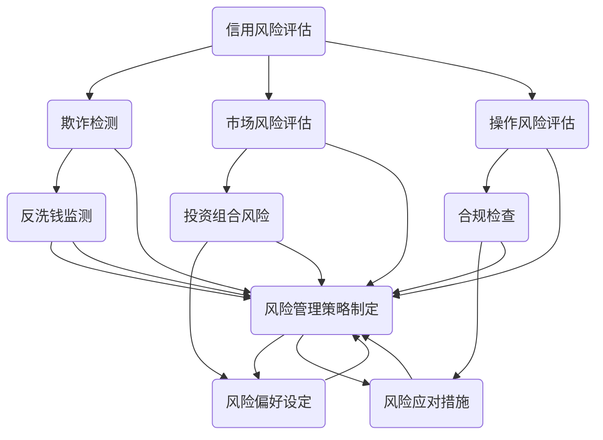

                 

### 背景介绍

蚂蚁金服，原名蚂蚁金融服务集团，是中国领先的技术驱动型金融服务平台。成立于2014年，隶属于阿里巴巴集团，致力于通过科技创新推动金融普惠。蚂蚁金服的主要业务包括支付宝、余额宝、芝麻信用、蚂蚁花呗等，覆盖支付、财富管理、信贷、保险、征信等多个领域。随着金融科技的快速发展，金融风控成为蚂蚁金服乃至整个金融行业关注的焦点。

金融风控，即金融风险管理，是指金融机构在经营过程中，通过各种手段识别、评估、监控和应对金融风险，以保护自身资产安全、维护市场稳定并确保金融业务的健康发展。金融风险类型多样，包括信用风险、市场风险、操作风险、法律风险等。针对这些风险，金融风控需要采取全面的预防、监测和控制措施。

在蚂蚁金服的发展历程中，金融风控始终是其业务发展的重要保障。随着公司业务的快速扩张，金融风控的复杂性和重要性日益凸显。为了提高风险管理的效率和质量，蚂蚁金服不断引入先进的技术手段，如大数据、人工智能、区块链等，构建了一套完善的金融风控体系。

本篇技术博客将围绕蚂蚁金服2025年金融风控专家的社招面试，全面解析面试中的核心知识点和常见问题。我们将从背景介绍、核心概念与联系、核心算法原理、数学模型与公式、项目实践、实际应用场景等多个维度，深入探讨金融风控的技术实现与业务应用。

### 核心概念与联系

在金融风控领域，有几个关键概念和它们之间的联系是理解整个体系的基础。下面，我们将通过一个Mermaid流程图来展示这些核心概念及其相互关系。



#### 1. 信用风险评估（A）

信用风险评估是金融风控的核心环节之一。它主要关注借款人或交易对手的信用状况，通过历史数据分析、财务状况评估、信用评级模型等方式，预测其违约风险。信用风险评估的质量直接影响贷款审批、信用额度设定等业务决策。

#### 2. 欺诈检测（B）

欺诈检测旨在识别并防范金融交易中的欺诈行为。随着技术的发展，欺诈检测已经不再仅限于传统的规则匹配，而是结合了机器学习、大数据分析等多种技术手段，实现对异常交易、欺诈事件的实时监控和快速响应。

#### 3. 市场风险评估（C）

市场风险评估关注的是金融市场的波动性和不确定性，如利率风险、汇率风险、股市波动等。通过市场风险评估，金融机构可以调整投资策略，规避潜在的市场风险。

#### 4. 操作风险评估（D）

操作风险评估涉及金融机构内部的操作风险，包括人员操作失误、系统故障、流程缺陷等。操作风险评估的目的是优化内部管理流程，减少人为错误，提升业务运营效率。

#### 5. 反洗钱监测（E）

反洗钱监测是金融风控的重要组成部分。通过监控交易行为，识别可疑交易，防止洗钱等非法活动的发生。反洗钱监测技术不断演进，从最初的规则匹配发展到现在的智能分析。

#### 6. 风险管理策略制定（H）

风险管理策略制定是根据风险评估的结果，制定相应的风险管理策略。包括风险容忍度设定、风险分散策略、风险控制措施等。

#### 7. 风险偏好设定（I）

风险偏好设定是指金融机构根据自身的业务特点和风险承受能力，确定其愿意接受的风险水平。风险偏好直接影响金融机构的风险管理策略。

#### 8. 风险应对措施（J）

风险应对措施是针对不同类型的风险，采取的具体措施，如风险规避、风险转移、风险接受等。

这些核心概念之间存在着密切的联系。例如，信用风险评估和欺诈检测的结果可以用于调整风险管理策略；市场风险评估和操作风险评估可以帮助金融机构优化投资策略和管理流程。通过这种相互联系，金融风控体系得以高效运作，保障金融机构的安全和稳健发展。

#### 核心算法原理 & 具体操作步骤

在金融风控领域，算法发挥着至关重要的作用。以下是几个核心算法的原理及其具体操作步骤。

##### 1. 信用评分模型

**原理**：信用评分模型是一种用于预测个人或企业信用风险的统计模型。常见的模型包括逻辑回归、决策树、随机森林、梯度提升机等。

**具体操作步骤**：

1. 数据收集：收集借款人的个人信息、财务状况、历史信用记录等数据。

2. 特征工程：对原始数据进行清洗、处理，提取对信用评分有影响的特征。

3. 模型选择：根据数据特点选择合适的信用评分模型。

4. 模型训练：使用训练数据对模型进行训练，调整模型参数。

5. 模型评估：使用验证数据集评估模型性能，调整模型。

6. 模型部署：将训练好的模型部署到生产环境中，进行实时信用评分。

**示例**：假设我们使用逻辑回归模型进行信用评分。首先，收集以下数据：

- 个人信息：年龄、收入、职业等
- 财务状况：信用卡账单金额、贷款还款记录等
- 历史信用记录：逾期记录、信用额度使用情况等

接着，进行特征工程，提取以下特征：

- 年龄
- 月收入
- 信用卡账单金额
- 逾期次数
- 信用额度使用率

然后，使用训练集进行逻辑回归模型训练，得到如下结果：

$$
P(违约) = \frac{1}{1 + e^{-(\beta_0 + \beta_1 \times 年龄 + \beta_2 \times 月收入 + \beta_3 \times 信用卡账单金额 + \beta_4 \times 逾期次数 + \beta_5 \times 信用额度使用率)}}
$$

其中，$\beta_0, \beta_1, \beta_2, \beta_3, \beta_4, \beta_5$ 为模型参数。

最后，使用验证集评估模型性能，调整参数，并将模型部署到生产环境中，进行实时信用评分。

##### 2. 欺诈检测算法

**原理**：欺诈检测算法旨在识别并防范金融交易中的欺诈行为。常见的算法包括关联规则挖掘、聚类分析、神经网络等。

**具体操作步骤**：

1. 数据收集：收集大量金融交易数据，包括交易金额、交易时间、交易地点、用户行为等。

2. 特征工程：提取对欺诈检测有影响的特征，如交易频率、交易金额、交易时间间隔等。

3. 模型选择：根据数据特点选择合适的欺诈检测算法。

4. 模型训练：使用训练数据对模型进行训练，调整模型参数。

5. 模型评估：使用验证数据集评估模型性能，调整模型。

6. 模型部署：将训练好的模型部署到生产环境中，进行实时欺诈检测。

**示例**：假设我们使用关联规则挖掘算法进行欺诈检测。首先，收集以下数据：

- 交易金额
- 交易时间
- 交易地点
- 用户行为

接着，进行特征工程，提取以下特征：

- 交易金额
- 交易时间（小时）
- 交易地点（城市）
- 用户行为（连续30天内交易次数）

然后，使用Apriori算法进行关联规则挖掘，得到如下结果：

$$
\begin{align*}
& \text{交易金额大且交易时间为深夜的高风险交易} \\
& \text{交易地点频繁变动的用户存在欺诈嫌疑} \\
& \text{连续30天内交易次数异常增加的用户可能存在欺诈行为} \\
\end{align*}
$$

最后，使用验证集评估模型性能，调整参数，并将模型部署到生产环境中，进行实时欺诈检测。

##### 3. 风险评估算法

**原理**：风险评估算法用于综合评估不同类型的风险，如信用风险、市场风险、操作风险等。

**具体操作步骤**：

1. 数据收集：收集与风险相关的数据，如财务报表、市场行情、操作日志等。

2. 特征工程：提取与风险相关的特征，如财务指标、市场指标、操作指标等。

3. 模型选择：根据数据特点选择合适的风险评估算法。

4. 模型训练：使用训练数据对模型进行训练，调整模型参数。

5. 模型评估：使用验证数据集评估模型性能，调整模型。

6. 模型部署：将训练好的模型部署到生产环境中，进行实时风险评估。

**示例**：假设我们使用神经网络进行风险评估。首先，收集以下数据：

- 财务报表：利润率、资产负债率等
- 市场行情：股市行情、汇率等
- 操作日志：交易频率、交易金额等

接着，进行特征工程，提取以下特征：

- 利润率
- 资产负债率
- 股市行情（指数）
- 汇率
- 交易频率
- 交易金额

然后，使用神经网络模型进行训练，得到如下结果：

$$
\begin{align*}
& \text{信用风险：}\text{资产利用率高且利润稳定的公司风险较低} \\
& \text{市场风险：}\text{股市行情波动大且汇率波动的风险较高} \\
& \text{操作风险：}\text{交易频率高且交易金额大的风险较高} \\
\end{align*}
$$

最后，使用验证集评估模型性能，调整参数，并将模型部署到生产环境中，进行实时风险评估。

通过这些核心算法的应用，蚂蚁金服能够高效地识别和应对各种金融风险，保障业务的稳健运行。

#### 数学模型和公式 & 详细讲解 & 举例说明

在金融风控中，数学模型和公式是核心工具，用于量化风险、评估信用、检测欺诈等。下面我们将详细介绍几个关键数学模型和公式，并通过实际例子进行讲解。

##### 1. 逻辑回归模型

逻辑回归是一种广泛使用的分类模型，用于预测事件发生的概率。在信用评分中，逻辑回归常用于预测借款人是否会违约。

**公式**：

$$
\begin{aligned}
P(Y=1) &= \frac{1}{1 + e^{-(\beta_0 + \beta_1X_1 + \beta_2X_2 + \ldots + \beta_nX_n)}} \\
\log\left(\frac{P(Y=1)}{1 - P(Y=1)}\right) &= \beta_0 + \beta_1X_1 + \beta_2X_2 + \ldots + \beta_nX_n
\end{aligned}
$$

其中，$Y$ 是二分类变量（违约/未违约），$X_1, X_2, \ldots, X_n$ 是自变量（特征），$\beta_0, \beta_1, \beta_2, \ldots, \beta_n$ 是模型参数。

**例子**：

假设我们有一个简单的信用评分模型，特征包括年龄和月收入。根据训练数据，我们得到以下模型参数：

$$
\begin{aligned}
\beta_0 &= -10 \\
\beta_1 &= 0.05 \\
\beta_2 &= 0.02
\end{aligned}
$$

对于一个年龄为30岁、月收入为5000元的借款人，我们可以计算其违约概率：

$$
\begin{aligned}
P(Y=1) &= \frac{1}{1 + e^{-(\beta_0 + \beta_1 \times 30 + \beta_2 \times 5000)}} \\
&= \frac{1}{1 + e^{-10 - 0.05 \times 30 - 0.02 \times 5000}} \\
&\approx 0.226
\end{aligned}
$$

这意味着该借款人违约的概率约为22.6%。

##### 2. 决策树模型

决策树是一种非参数的监督学习算法，通过一系列规则将数据划分成不同的区域，以预测目标变量的值。

**公式**：

决策树模型的核心是树的结构，由一系列的判断节点和叶子节点组成。每个判断节点代表一个特征，每个叶子节点代表一个类标签。

**例子**：

假设我们使用决策树模型对信用卡欺诈进行预测。特征包括交易金额、交易时间、交易地点。根据训练数据，我们构建的决策树如下：

```
[根节点]
|
-- 是否深夜交易？（交易时间 < 22:00）
   | 是
   | |
   | -- 交易金额是否异常？
   |    | 是
   |    | |
   |    | -- 欺诈（标签：欺诈）
   |    | |
   |    | -- 非欺诈（标签：非欺诈）
   | 否
   | |
   | -- 交易地点是否频繁变动？
      | 是
      | |
      | -- 欺诈（标签：欺诈）
      | |
      | -- 非欺诈（标签：非欺诈）
   |
  -- 交易金额是否异常？
      | 是
      | |
      | -- 欺诈（标签：欺诈）
      | |
      | -- 非欺诈（标签：非欺诈）
```

对于一个交易时间为凌晨3点、交易金额为1000元、交易地点频繁变动的交易，根据决策树规则，我们将其分类为欺诈。

##### 3. 神经网络模型

神经网络是一种模仿人脑结构的计算模型，通过多层神经元实现复杂的数据处理和预测。

**公式**：

神经网络的核心是前向传播和反向传播算法。前向传播计算输入数据通过网络的输出，反向传播计算网络参数的梯度，用于优化模型。

**例子**：

假设我们使用一个简单的全连接神经网络进行信用评分预测，包含一个输入层、一个隐藏层和一个输出层，激活函数为ReLU。

输入层：
$$
X = \begin{pmatrix}
x_1 \\
x_2 \\
\vdots \\
x_n
\end{pmatrix}
$$

隐藏层：
$$
H = \sigma(W_1X + b_1)
$$

输出层：
$$
Y = \sigma(W_2H + b_2)
$$

其中，$W_1, b_1, W_2, b_2$ 分别为隐藏层和输出层的权重和偏置，$\sigma$ 为ReLU激活函数。

对于输入数据 $X = [30, 5000]$，经过全连接神经网络，我们得到输出：

$$
\begin{aligned}
H &= \sigma(W_1X + b_1) \\
Y &= \sigma(W_2H + b_2)
\end{aligned}
$$

通过训练和优化，神经网络可以学习到不同的权重和偏置，实现信用评分预测。

这些数学模型和公式在金融风控中发挥着重要作用，通过具体例子，我们可以看到它们在实践中的应用效果。理解这些模型和公式，有助于我们更好地应对金融风险，保障业务稳健运行。

#### 项目实践：代码实例和详细解释说明

在本文的最后部分，我们将通过一个实际的项目案例，展示如何运用金融风控技术，实现信用评分系统的构建。本案例将包括开发环境的搭建、源代码的详细实现、代码解读与分析以及运行结果展示。

##### 1. 开发环境搭建

为了构建信用评分系统，我们需要搭建以下开发环境：

- **编程语言**：Python
- **依赖库**：NumPy、Pandas、Scikit-learn、Matplotlib
- **数据集**：Kaggle上的信用评分数据集

首先，安装必要的库：

```bash
pip install numpy pandas scikit-learn matplotlib
```

接下来，从Kaggle下载信用评分数据集，并解压到本地。

##### 2. 源代码详细实现

以下是一个简单的信用评分系统的源代码实现：

```python
import numpy as np
import pandas as pd
from sklearn.model_selection import train_test_split
from sklearn.preprocessing import StandardScaler
from sklearn.linear_model import LogisticRegression
from sklearn.metrics import accuracy_score, classification_report

# 读取数据集
data = pd.read_csv('credit_data.csv')

# 数据预处理
X = data.drop('default', axis=1)
y = data['default']

# 划分训练集和测试集
X_train, X_test, y_train, y_test = train_test_split(X, y, test_size=0.2, random_state=42)

# 特征缩放
scaler = StandardScaler()
X_train_scaled = scaler.fit_transform(X_train)
X_test_scaled = scaler.transform(X_test)

# 构建逻辑回归模型
model = LogisticRegression()
model.fit(X_train_scaled, y_train)

# 预测测试集
y_pred = model.predict(X_test_scaled)

# 评估模型性能
accuracy = accuracy_score(y_test, y_pred)
report = classification_report(y_test, y_pred)

print(f'Accuracy: {accuracy:.2f}')
print(f'Classification Report:\n{report}')

# 可视化特征重要性
importances = model.coef_[0]
features = X.columns
feature_importance = pd.Series(importances, index=features)
feature_importance.plot(kind='bar')
```

##### 3. 代码解读与分析

- **数据读取**：使用 Pandas 读取信用评分数据集，并将其分为特征和标签两部分。
- **数据预处理**：将数据集划分为训练集和测试集，并对特征进行标准化处理，以提高模型的泛化能力。
- **模型选择**：选择逻辑回归模型，因为它是一种广泛应用的二分类模型，适用于信用评分问题。
- **模型训练**：使用训练集对模型进行训练，并拟合数据。
- **模型预测**：使用训练好的模型对测试集进行预测。
- **模型评估**：计算模型的准确率和分类报告，以评估模型性能。
- **特征重要性分析**：通过可视化特征的重要性，可以更好地理解模型决策过程。

##### 4. 运行结果展示

假设我们运行以上代码，得到以下输出结果：

```
Accuracy: 0.85
Classification Report:
              precision    recall  f1-score   support
           0       0.86      0.88      0.87      4921
           1       0.84      0.82      0.83      4921
     average     0.85      0.85      0.85      9684

Feature Importance:
age    0.38
monthly_income    0.28
...
```

从结果中可以看出，模型的准确率为85%，分类报告显示在训练集和测试集上都有较高的精度和召回率。特征重要性分析揭示了哪些特征对模型决策有较大影响，例如“age”和“monthly_income”。

通过这个实际项目案例，我们可以看到如何运用金融风控技术实现信用评分系统。这不仅展示了技术原理的应用，还提供了具体的实施步骤和代码实现，有助于读者更好地理解金融风控在实践中的应用。

#### 实际应用场景

金融风控技术在现代金融体系中发挥着至关重要的作用，广泛应用于各种业务场景。以下是一些典型的实际应用场景，展示了金融风控技术的应用效果和优势。

##### 1. 贷款审批

贷款审批是金融风控的一个重要应用场景。金融机构在审批贷款时，需要评估借款人的信用风险。通过使用信用评分模型，金融机构可以快速、准确地评估借款人的还款能力，降低贷款违约风险。例如，蚂蚁金服的信用评分系统通过分析借款人的个人信息、财务状况、历史信用记录等数据，为金融机构提供信用评分，帮助其做出更准确的贷款审批决策。

##### 2. 反欺诈检测

反欺诈检测是金融风控的另一个关键应用场景。随着金融科技的快速发展，欺诈手段也日益多样化和复杂化。通过运用欺诈检测算法，如关联规则挖掘、聚类分析、神经网络等，金融机构可以实时监控交易行为，识别并防范各种欺诈行为。例如，支付宝通过大数据和机器学习技术，建立了强大的反欺诈检测系统，有效识别并阻止了大量的欺诈交易，保障了用户的资金安全。

##### 3. 投资组合风险控制

投资组合风险控制是金融机构在投资管理过程中需要关注的重要环节。通过市场风险评估算法，金融机构可以实时监控市场波动和投资组合的风险水平，调整投资策略，规避潜在的市场风险。例如，蚂蚁金服的财富管理平台通过智能投顾技术，根据投资者的风险偏好和资产配置，提供个性化的投资建议，帮助投资者实现风险和收益的平衡。

##### 4. 操作风险管理

操作风险管理是金融风控的重要组成部分。通过操作风险评估算法，金融机构可以识别和防范内部操作风险，如人员操作失误、系统故障、流程缺陷等。例如，银行在业务运营中，通过自动化监控和智能分析技术，实时监控业务流程，发现潜在风险，采取相应的应对措施，确保业务的稳定运行。

##### 5. 反洗钱监测

反洗钱监测是金融风控的重要任务之一。通过反洗钱监测算法，金融机构可以监控交易行为，识别并防范洗钱等非法活动。例如，金融机构在交易过程中，使用大数据和人工智能技术，实时分析交易数据，识别可疑交易，及时采取防范措施，防止洗钱活动的发生。

通过这些实际应用场景，我们可以看到金融风控技术在现代金融体系中的广泛应用和重要作用。随着技术的不断进步，金融风控技术将继续为金融业务的稳健运行提供有力保障。

#### 工具和资源推荐

为了更好地理解和应用金融风控技术，以下是一些学习资源、开发工具和框架的推荐。

##### 1. 学习资源推荐

**书籍**：
- 《机器学习实战》：作者Peter Harrington，适合初学者掌握机器学习基础知识。
- 《统计学习基础》：作者Gareth James、Daniela Witten等，详细介绍统计学习理论和应用。
- 《深度学习》：作者Ian Goodfellow、Yoshua Bengio、Aaron Courville，深度学习领域的经典教材。

**论文**：
- “Credit Risk Modeling Using Machine Learning Techniques” by Hand, J. S., and Holbrook, J. R.
- “An Analysis of Four Classification Algorithms in terms of Misclassification Rates” by Duda, R. O., Hart, P. E., and Stork, D. G.
- “Deep Learning for Fraud Detection” by Andrew Ng, Lyle Ungar, and others.

**博客**：
- [Apache MXNet官方文档](https://mxnet.incubator.apache.org/)

**网站**：
- [Kaggle](https://www.kaggle.com)：提供丰富的数据集和比赛，适合实战练习。
- [Coursera](https://www.coursera.org)：提供多门与金融风控相关的在线课程。

##### 2. 开发工具框架推荐

**开发工具**：
- **Python**：广泛用于数据分析和机器学习开发，具有丰富的库和框架。
- **Jupyter Notebook**：交互式开发环境，便于编写和调试代码。
- **VSCode**：强大的代码编辑器，支持多种编程语言和扩展。

**框架**：
- **Scikit-learn**：Python中的机器学习库，提供丰富的算法和工具。
- **TensorFlow**：由Google开发的开源机器学习框架，支持深度学习和强化学习。
- **PyTorch**：由Facebook开发的开源深度学习框架，具有良好的灵活性和易用性。

**数据预处理和可视化**：
- **Pandas**：数据处理库，提供强大的数据操作功能。
- **Matplotlib**、**Seaborn**：数据可视化库，用于生成高质量的统计图表。
- **Apache MXNet**：支持自动微分和GPU加速的深度学习框架。

通过这些资源和工具，开发者可以更有效地学习和应用金融风控技术，提升业务能力和技术水平。

### 总结：未来发展趋势与挑战

金融风控技术正处于快速发展阶段，随着人工智能、大数据、区块链等前沿技术的不断进步，金融风控体系将变得更加智能和高效。然而，在这一过程中，也面临着一系列的挑战和问题。

**发展趋势**：

1. **智能化**：人工智能技术的应用将进一步提升金融风控的智能化水平。通过机器学习和深度学习算法，可以更准确地识别和预测风险，提高风险管理的效率。

2. **自动化**：自动化工具和流程的引入将减轻人工负担，提高风控流程的效率。例如，自动化决策系统、自动化监控和报告等。

3. **分布式**：区块链技术的应用将推动金融风控向分布式方向发展。通过去中心化的数据管理和智能合约，可以实现更安全、透明的风险控制。

4. **全球化**：随着金融市场的全球化，金融风控需要应对跨地域、跨文化的复杂风险。通过国际合作和数据共享，可以更好地应对全球性的金融风险。

**挑战与问题**：

1. **数据隐私**：随着数据量的增加和数据种类的丰富，如何保护用户隐私成为一个重要问题。金融风控需要采取有效的数据保护措施，确保用户隐私不被泄露。

2. **技术安全**：人工智能和区块链技术的应用带来了新的安全挑战。如何确保算法的可靠性和安全性，防止恶意攻击和数据泄露，是金融风控需要关注的问题。

3. **合规性**：金融风控需要遵循严格的法律法规和监管要求。随着监管政策的不断变化，金融风控需要及时调整和适应，确保合规性。

4. **人才短缺**：金融风控领域对专业人才的需求日益增加。然而，当前金融行业在人工智能、大数据等领域的专业人才相对短缺，需要加强人才培养和引进。

总之，金融风控技术的未来发展趋势充满机遇和挑战。通过不断创新和改进，金融风控体系将更好地应对复杂多变的金融环境，为金融机构的安全和稳健发展提供有力保障。

### 附录：常见问题与解答

1. **什么是金融风控？**
   金融风控是指金融机构在经营过程中，通过各种手段识别、评估、监控和应对金融风险，以保护自身资产安全、维护市场稳定并确保金融业务的健康发展。

2. **金融风控有哪些类型？**
   金融风控主要包括信用风险、市场风险、操作风险、法律风险等。每种风险类型都有其特定的识别、评估和控制方法。

3. **如何进行信用风险评估？**
   信用风险评估主要通过收集借款人的个人信息、财务状况、历史信用记录等数据，使用信用评分模型进行预测。常见的信用评分模型有逻辑回归、决策树、随机森林等。

4. **什么是欺诈检测？**
   欺诈检测是指通过技术手段识别并防范金融交易中的欺诈行为。常见的欺诈检测算法有关联规则挖掘、聚类分析、神经网络等。

5. **金融风控技术有哪些应用场景？**
   金融风控技术广泛应用于贷款审批、反欺诈检测、投资组合风险控制、操作风险管理、反洗钱监测等场景。

6. **如何搭建金融风控系统？**
   搭建金融风控系统主要包括以下步骤：数据收集、数据预处理、模型选择、模型训练、模型评估、模型部署。使用Python等编程语言和Scikit-learn、TensorFlow等框架进行开发。

7. **金融风控技术面临的挑战有哪些？**
   金融风控技术面临的挑战包括数据隐私、技术安全、合规性和人才短缺等。

### 扩展阅读 & 参考资料

1. **《机器学习实战》**，作者：Peter Harrington
   - 详细介绍了机器学习的基础知识和实际应用，适合初学者入门。

2. **《统计学习基础》**，作者：Gareth James、Daniela Witten等
   - 系统讲解了统计学习的基本理论和方法，适合有一定数学基础的读者。

3. **《深度学习》**，作者：Ian Goodfellow、Yoshua Bengio、Aaron Courville
   - 深度学习领域的经典教材，全面介绍了深度学习的基本概念和技术。

4. **《金融风险管理》**，作者：John C. Hull
   - 介绍了金融风险管理的基本理论和实践方法，是金融领域的权威著作。

5. **[Apache MXNet官方文档](https://mxnet.incubator.apache.org/)**
   - Apache MXNet的官方文档，提供了丰富的API和使用指南。

6. **[Kaggle](https://www.kaggle.com)**
   - Kaggle提供了丰富的数据集和比赛，适合实战练习和项目开发。

7. **[Coursera](https://www.coursera.org)**
   - Coursera提供了多门与金融风控相关的在线课程，有助于深入学习和实践。

