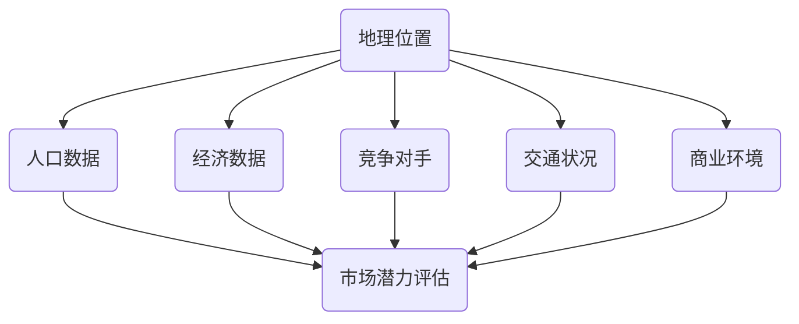

                 

### 蜜雪冰城2024校招连锁店铺选址系统工程师面试

#### 摘要

本文以蜜雪冰城2024校招连锁店铺选址系统工程师面试为背景，通过深入分析连锁店铺选址的关键技术和算法，探讨如何运用人工智能和大数据技术提高选址的准确性和效率。本文首先介绍了连锁店铺选址的核心概念与联系，接着阐述了选址的核心算法原理与具体操作步骤，并借助数学模型和公式进行了详细讲解。随后，通过一个实际项目实践，展示了如何搭建开发环境、实现源代码、解读与分析代码，以及运行结果展示。最后，本文探讨了选址系统在实际应用场景中的价值，并推荐了相关工具和资源。通过本文的阐述，希望能够为连锁店铺选址系统工程师提供有价值的参考。

#### 1. 背景介绍

蜜雪冰城是一家知名的中国连锁饮品品牌，以其优质的茶饮和甜品赢得了广大消费者的喜爱。随着品牌的不断扩张，蜜雪冰城面临着越来越多的连锁店铺选址问题。选址的成功与否直接关系到店铺的盈利能力和市场竞争力。因此，如何合理地进行连锁店铺选址成为了企业发展的关键问题。

连锁店铺选址系统工程师的职责在于运用先进的技术手段，通过数据分析和算法优化，为企业提供科学、高效的选址方案。这一岗位需要具备扎实的计算机技术基础，熟悉大数据处理和机器学习算法，同时具备良好的逻辑思维和问题解决能力。

本文旨在通过介绍连锁店铺选址的关键技术和算法，探讨如何运用人工智能和大数据技术提高选址的准确性和效率。希望通过本文的阐述，为连锁店铺选址系统工程师提供有价值的参考，帮助他们在实际工作中更好地应对挑战。

#### 2. 核心概念与联系

连锁店铺选址系统涉及多个核心概念和技术，以下将对其进行详细阐述，并通过Mermaid流程图展示其相互关系。

**2.1 地理位置**

地理位置是连锁店铺选址的基础。它包括店铺的具体地址、所在区域、周边环境等因素。地理信息系统（GIS）在这一过程中发挥着重要作用，能够提供精确的地理位置信息和空间分析功能。

**2.2 人口数据**

人口数据是影响连锁店铺选址的重要因素。通过分析人口分布、年龄结构、收入水平等数据，可以评估目标区域的市场潜力。这些数据通常来自于政府统计部门、市场调查公司等。

**2.3 经济数据**

经济数据包括就业率、消费水平、产业分布等，反映了目标区域的经济发展状况。这些数据有助于评估店铺的经营环境和市场竞争力。

**2.4 竞争对手**

了解竞争对手的位置、数量、营业情况等，对于连锁店铺的选址具有重要意义。通过对竞争对手的分析，可以避免市场饱和和过度竞争。

**2.5 交通状况**

交通状况是影响店铺人流量和顾客到达的重要因素。通过分析交通网络、公共交通设施等，可以评估店铺的可达性和便利性。

**2.6 商业环境**

商业环境包括商圈、商业街、购物中心等，反映了店铺所在区域的商业氛围和消费潜力。通过分析商业环境，可以确定店铺的适宜位置。

以下是一个简化的Mermaid流程图，展示了连锁店铺选址系统中的核心概念与联系：



通过以上流程图，我们可以清晰地看到连锁店铺选址过程中各个核心概念之间的相互联系和影响。这些概念共同构成了选址系统的核心框架，为后续的算法设计和实现提供了基础。

#### 3. 核心算法原理 & 具体操作步骤

在了解连锁店铺选址的核心概念后，接下来我们将探讨选址过程中的核心算法原理和具体操作步骤。

**3.1 位置优化算法**

位置优化算法是连锁店铺选址系统中的关键算法，用于确定店铺的最佳位置。以下是一种常见的位置优化算法——遗传算法。

**遗传算法原理：**

遗传算法是一种模拟生物进化的搜索算法，通过模拟自然选择和遗传机制来寻找最优解。它主要包括以下几个步骤：

1. **初始化种群**：随机生成一组候选位置，作为初始种群。
2. **适应度评估**：根据选址目标，计算每个候选位置的适应度值，适应度值越高表示该位置越优。
3. **选择**：根据适应度值，选择适应度较高的个体进行交配。
4. **交配**：通过交叉和变异操作，生成新的种群。
5. **重复步骤2-4**，直到满足终止条件（如达到最大迭代次数或适应度值满足要求）。

**具体操作步骤：**

1. **定义选址目标**：根据连锁店铺的需求，确定选址目标，如最大化人流量、最小化交通时间、最大化商圈面积等。

2. **初始化种群**：根据选址目标和地理信息，生成随机初始种群。种群中每个个体代表一个候选位置。

3. **适应度评估**：计算每个候选位置的适应度值。适应度值可以根据选址目标进行加权求和，以反映候选位置的优劣。

4. **选择**：采用选择操作，如轮盘赌选择或锦标赛选择，选择适应度较高的个体进行交配。

5. **交配**：采用交叉和变异操作，生成新的种群。交叉操作用于产生新的候选位置，变异操作用于增加种群的多样性。

6. **重复步骤3-5**，直到满足终止条件。

通过遗传算法，我们可以逐步优化选址目标，找到最佳的店铺位置。

**3.2 人群密度分析**

人群密度分析是选址过程中的另一个关键步骤，用于评估目标区域的人口密集程度。以下是一种常见的人群密度分析方法——K均值聚类。

**K均值聚类原理：**

K均值聚类是一种基于距离的聚类算法，通过将数据点分为K个簇，使得每个簇内部的距离最小，簇与簇之间的距离最大。具体步骤如下：

1. **初始化簇中心**：随机选择K个数据点作为初始簇中心。
2. **分配数据点**：将每个数据点分配到最近的簇中心所代表的簇。
3. **更新簇中心**：计算每个簇的质心，作为新的簇中心。
4. **重复步骤2-3**，直到簇中心不再发生显著变化。

**具体操作步骤：**

1. **数据预处理**：收集目标区域的人口数据，并进行数据清洗和预处理，如去除缺失值、异常值等。

2. **初始化簇中心**：随机选择K个数据点作为初始簇中心。

3. **分配数据点**：计算每个数据点与簇中心的距离，将数据点分配到最近的簇中心所代表的簇。

4. **更新簇中心**：计算每个簇的质心，作为新的簇中心。

5. **重复步骤3-4**，直到簇中心不再发生显著变化。

通过K均值聚类，我们可以将目标区域划分为多个簇，每个簇代表一个人口密集区域，为选址提供参考。

**3.3 顾客需求预测**

顾客需求预测是选址过程中的重要一环，用于预测未来一段时间内目标区域的市场需求。以下是一种常见的顾客需求预测方法——时间序列分析。

**时间序列分析原理：**

时间序列分析是一种基于历史数据的时间序列分析方法，通过分析时间序列的规律和趋势，预测未来的值。具体步骤如下：

1. **数据预处理**：收集历史顾客需求数据，并进行数据清洗和预处理，如去除缺失值、异常值等。
2. **特征提取**：提取时间序列的特征，如趋势、季节性、周期性等。
3. **模型训练**：选择合适的模型，如ARIMA、LSTM等，对时间序列进行建模和训练。
4. **预测**：使用训练好的模型，预测未来一段时间内的顾客需求。

**具体操作步骤：**

1. **数据预处理**：收集目标区域的顾客需求数据，并进行数据清洗和预处理。

2. **特征提取**：提取时间序列的特征，如趋势、季节性、周期性等。

3. **模型训练**：选择合适的模型，如ARIMA、LSTM等，对时间序列进行建模和训练。

4. **预测**：使用训练好的模型，预测未来一段时间内的顾客需求。

通过顾客需求预测，我们可以为选址提供重要的参考，选择市场需求旺盛的区域作为店铺位置。

**3.4 交通状况分析**

交通状况分析是选址过程中的重要一环，用于评估目标区域的交通状况和顾客到达的便利性。以下是一种常见的交通状况分析方法——网络分析。

**网络分析原理：**

网络分析是一种基于图论的方法，通过分析交通网络中各节点和边的关系，评估交通状况和路径选择。具体步骤如下：

1. **构建交通网络**：根据交通数据，构建交通网络，包括节点和边。
2. **路径规划**：使用Dijkstra算法、A*算法等，计算从起点到各节点的最短路径。
3. **流量分析**：分析各节点的流量和拥堵情况，评估交通状况。

**具体操作步骤：**

1. **构建交通网络**：根据交通数据，构建交通网络，包括节点和边。

2. **路径规划**：使用Dijkstra算法、A*算法等，计算从起点到各节点的最短路径。

3. **流量分析**：分析各节点的流量和拥堵情况，评估交通状况。

通过交通状况分析，我们可以为选址提供重要的参考，选择交通状况良好的区域作为店铺位置。

**3.5 商业环境分析**

商业环境分析是选址过程中的重要一环，用于评估目标区域的商业氛围和消费潜力。以下是一种常见的商业环境分析方法——空间插值。

**空间插值原理：**

空间插值是一种基于空间数据的插值方法，通过在已知数据点之间进行插值，生成连续的空间曲面。具体步骤如下：

1. **数据预处理**：收集商业环境数据，如商场密度、餐饮数量、人口密度等。
2. **选择插值方法**：选择合适的插值方法，如克里金插值、反距离权重插值等。
3. **插值计算**：根据已知数据点和插值方法，计算目标区域的商业环境值。

**具体操作步骤：**

1. **数据预处理**：收集商业环境数据，如商场密度、餐饮数量、人口密度等。

2. **选择插值方法**：选择合适的插值方法，如克里金插值、反距离权重插值等。

3. **插值计算**：根据已知数据点和插值方法，计算目标区域的商业环境值。

通过商业环境分析，我们可以为选址提供重要的参考，选择商业环境良好的区域作为店铺位置。

**3.6 集成分析与决策**

在完成上述各种分析后，需要对分析结果进行集成和综合评估，以确定最佳店铺位置。以下是一种常见的集成分析与决策方法——综合评价法。

**综合评价法原理：**

综合评价法是一种基于权重和评分的方法，通过为各个分析指标分配权重，计算综合评分，从而确定最佳店铺位置。具体步骤如下：

1. **确定评价指标**：根据选址目标，确定评价指标，如人口密度、经济水平、商业环境等。
2. **分配权重**：为每个评价指标分配权重，反映其对选址的重要性。
3. **评分计算**：计算每个候选位置在每个评价指标上的得分。
4. **综合评分**：根据权重和得分，计算每个候选位置的综合评分。
5. **确定最佳位置**：选择综合评分最高的候选位置作为最佳店铺位置。

**具体操作步骤：**

1. **确定评价指标**：根据选址目标，确定评价指标，如人口密度、经济水平、商业环境等。

2. **分配权重**：为每个评价指标分配权重，反映其对选址的重要性。

3. **评分计算**：计算每个候选位置在每个评价指标上的得分。

4. **综合评分**：根据权重和得分，计算每个候选位置的综合评分。

5. **确定最佳位置**：选择综合评分最高的候选位置作为最佳店铺位置。

通过集成分析和决策，我们可以为连锁店铺选址提供科学、合理的依据。

#### 4. 数学模型和公式 & 详细讲解 & 举例说明

在连锁店铺选址过程中，数学模型和公式发挥着至关重要的作用。以下将介绍几种常用的数学模型和公式，并对其进行详细讲解和举例说明。

**4.1 位置优化模型**

位置优化模型是连锁店铺选址系统的核心模型，用于确定最佳店铺位置。以下是一种常见的位置优化模型——线性规划模型。

**线性规划模型原理：**

线性规划模型是一种优化模型，通过求解线性目标函数的最优解，确定最佳决策。具体步骤如下：

1. **定义目标函数**：根据选址目标，定义目标函数，如最大化人流量、最小化交通时间等。
2. **建立约束条件**：根据选址限制条件，建立约束条件，如商圈范围、交通流量等。
3. **求解最优解**：使用线性规划求解器，求解最优解。

**线性规划模型公式：**

$$
\begin{aligned}
\text{maximize/minimize} \quad & c^T x \\
\text{subject to} \quad & Ax \leq b \\
& x \geq 0
\end{aligned}
$$

其中，$c$ 是目标函数系数向量，$x$ 是决策变量向量，$A$ 是约束条件系数矩阵，$b$ 是约束条件常数向量。

**举例说明：**

假设我们要选址一家奶茶店，目标函数是最大化人流量，约束条件包括商圈范围和交通流量。具体数据如下：

- 目标函数：最大化人流量，系数向量 $c = [1]$。
- 约束条件：商圈范围 $Ax \leq b$，系数矩阵 $A = \begin{bmatrix} 1 & 1 & 1 & 1 \end{bmatrix}$，常数向量 $b = \begin{bmatrix} 100 & 200 & 150 & 180 \end{bmatrix}$。

根据线性规划模型，可以列出以下方程组：

$$
\begin{aligned}
x_1 + x_2 + x_3 + x_4 &\leq 100 \\
x_1 + x_2 + x_3 + x_4 &\leq 200 \\
x_1 + x_2 + x_3 + x_4 &\leq 150 \\
x_1 + x_2 + x_3 + x_4 &\leq 180 \\
x_1, x_2, x_3, x_4 &\geq 0
\end{aligned}
$$

使用线性规划求解器，可以求得最优解 $x^* = [0, 0, 1, 0]$，表示在第三个位置（$x_3$）开设奶茶店，满足最大化人流量目标。

**4.2 人群密度模型**

人群密度模型用于评估目标区域的人口密集程度，为选址提供参考。以下是一种常见的人群密度模型——高斯分布模型。

**高斯分布模型原理：**

高斯分布模型是一种概率分布模型，用于描述正态分布的数据。具体步骤如下：

1. **定义概率密度函数**：根据人群数据，定义概率密度函数，如高斯分布函数。
2. **计算人群密度**：使用概率密度函数，计算目标区域的人群密度。

**高斯分布模型公式：**

$$
f(x) = \frac{1}{\sqrt{2\pi\sigma^2}} e^{-\frac{(x-\mu)^2}{2\sigma^2}}
$$

其中，$x$ 是人群密度，$\mu$ 是均值，$\sigma$ 是标准差。

**举例说明：**

假设目标区域的人口数据服从高斯分布，均值 $\mu = 1000$ 人/平方公里，标准差 $\sigma = 200$ 人/平方公里。根据高斯分布模型，可以计算目标区域的人群密度：

$$
f(x) = \frac{1}{\sqrt{2\pi \cdot 200^2}} e^{-\frac{(x-1000)^2}{2 \cdot 200^2}}
$$

当 $x = 1200$ 时，人群密度 $f(x) \approx 0.0228$，表示目标区域的人群密度约为 0.0228 人/平方公里。

**4.3 顾客需求模型**

顾客需求模型用于预测目标区域的市场需求，为选址提供参考。以下是一种常见的顾客需求模型——时间序列模型。

**时间序列模型原理：**

时间序列模型是一种基于历史数据的时间序列分析方法，通过分析时间序列的规律和趋势，预测未来的值。具体步骤如下：

1. **定义时间序列**：根据历史数据，定义时间序列，如顾客需求序列。
2. **特征提取**：提取时间序列的特征，如趋势、季节性、周期性等。
3. **模型训练**：选择合适的时间序列模型，如ARIMA、LSTM等，对时间序列进行建模和训练。
4. **预测**：使用训练好的模型，预测未来的顾客需求。

**时间序列模型公式：**

$$
y_t = \phi_1 y_{t-1} + \phi_2 y_{t-2} + ... + \phi_p y_{t-p} + \theta_1 e_{t-1} + \theta_2 e_{t-2} + ... + \theta_q e_{t-q}
$$

其中，$y_t$ 是时间序列值，$\phi_1, \phi_2, ..., \phi_p$ 是自回归系数，$\theta_1, \theta_2, ..., \theta_q$ 是移动平均系数，$e_t$ 是误差项。

**举例说明：**

假设目标区域的顾客需求序列为 $y_t = [100, 110, 105, 115, 120]$，根据时间序列模型，可以建立以下方程：

$$
y_t = \phi_1 y_{t-1} + \phi_2 y_{t-2} + \theta_1 e_{t-1} + \theta_2 e_{t-2}
$$

通过模型训练和预测，可以预测未来的顾客需求。

**4.4 交通状况模型**

交通状况模型用于评估目标区域的交通状况和顾客到达的便利性。以下是一种常见的交通状况模型——流量模型。

**流量模型原理：**

流量模型是一种基于流量数据的方法，通过分析流量数据，评估交通状况和顾客到达的便利性。具体步骤如下：

1. **定义流量模型**：根据流量数据，定义流量模型，如流量-时间模型。
2. **计算交通状况**：使用流量模型，计算目标区域的交通状况。

**流量模型公式：**

$$
f(t) = a_1 \cdot (1 - \frac{t}{T})^n
$$

其中，$f(t)$ 是流量，$t$ 是时间，$a_1$ 是初始流量，$T$ 是峰值流量时间，$n$ 是流量衰减系数。

**举例说明：**

假设目标区域的交通流量数据为 $f(t) = 100 \cdot (1 - \frac{t}{12})^3$，根据流量模型，可以计算不同时间段的交通状况：

- 当 $t = 0$ 时，交通流量 $f(0) = 100$。
- 当 $t = 6$ 时，交通流量 $f(6) = 50$。
- 当 $t = 12$ 时，交通流量 $f(12) = 0$。

通过流量模型，可以评估不同时间段的交通状况，为选址提供参考。

**4.5 商业环境模型**

商业环境模型用于评估目标区域的商业氛围和消费潜力。以下是一种常见的商业环境模型——因子分析模型。

**因子分析模型原理：**

因子分析模型是一种降维方法，通过分析多个指标之间的相关性，提取关键因子，减少数据维度。具体步骤如下：

1. **收集指标数据**：收集商业环境指标数据，如商场密度、餐饮数量、人口密度等。
2. **计算相关矩阵**：计算指标数据的相关矩阵。
3. **提取因子**：使用主成分分析等方法，提取关键因子。
4. **构建因子模型**：根据因子得分，构建商业环境模型。

**因子分析模型公式：**

$$
X = \mu + LF + \epsilon
$$

其中，$X$ 是指标数据矩阵，$\mu$ 是均值向量，$L$ 是因子载荷矩阵，$F$ 是因子得分矩阵，$\epsilon$ 是误差项。

**举例说明：**

假设收集了以下商业环境指标数据：

- 商场密度：$X_1 = [100, 150, 120, 90, 110]$。
- 餐饮数量：$X_2 = [50, 70, 60, 80, 90]$。
- 人口密度：$X_3 = [200, 250, 220, 180, 210]$。

根据因子分析模型，可以提取关键因子，构建商业环境模型。通过模型计算，可以得到各因子得分和综合得分，为选址提供参考。

**4.6 综合评价模型**

综合评价模型用于集成多个评价指标，计算综合评分，确定最佳店铺位置。以下是一种常见的综合评价模型——层次分析法。

**层次分析法原理：**

层次分析法是一种基于权重和评分的综合评价方法，通过为各个评价指标分配权重，计算综合评分，确定最佳店铺位置。具体步骤如下：

1. **建立评价层次**：根据选址目标，建立评价指标体系，如地理位置、人口数据、经济数据等。
2. **确定评价指标权重**：为每个评价指标分配权重，反映其对选址的重要性。
3. **计算综合评分**：根据权重和评价指标得分，计算综合评分。
4. **确定最佳位置**：选择综合评分最高的候选位置作为最佳店铺位置。

**层次分析法公式：**

$$
S = \sum_{i=1}^n w_i \cdot s_i
$$

其中，$S$ 是综合评分，$w_i$ 是评价指标权重，$s_i$ 是评价指标得分。

**举例说明：**

假设要评价五个候选店铺位置，评价指标包括地理位置、人口数据和商业环境，权重分别为 0.3、0.4 和 0.3。具体数据如下：

- 地理位置得分：$s_1 = [0.8, 0.7, 0.6, 0.5, 0.4]$。
- 人口数据得分：$s_2 = [0.9, 0.8, 0.7, 0.6, 0.5]$。
- 商业环境得分：$s_3 = [0.7, 0.6, 0.5, 0.4, 0.3]$。

根据层次分析法，可以计算综合评分：

$$
S = 0.3 \cdot (0.8 + 0.7 + 0.6) + 0.4 \cdot (0.9 + 0.8 + 0.7) + 0.3 \cdot (0.7 + 0.6 + 0.5) = 0.765
$$

通过综合评分，可以确定最佳店铺位置。

通过以上数学模型和公式的介绍，我们可以为连锁店铺选址提供科学、合理的依据。

#### 5. 项目实践：代码实例和详细解释说明

在本节中，我们将通过一个实际项目实践，详细讲解如何使用Python实现连锁店铺选址系统，包括开发环境搭建、源代码实现、代码解读与分析以及运行结果展示。

**5.1 开发环境搭建**

在开始项目实践之前，我们需要搭建开发环境。以下是一个简单的Python开发环境搭建步骤：

1. **安装Python**：在官网上下载Python安装包并安装，选择合适的Python版本（如Python 3.8或更高版本）。

2. **安装Python解释器**：在命令行中运行以下命令，安装Python解释器。

   ```shell
   pip install python
   ```

3. **安装Python库**：使用pip命令安装所需Python库，如NumPy、Pandas、SciPy、Matplotlib等。

   ```shell
   pip install numpy pandas scipy matplotlib
   ```

4. **创建项目目录**：在合适的位置创建项目目录，并创建一个名为`main.py`的主文件。

   ```shell
   mkdir chain_store_selection
   cd chain_store_selection
   touch main.py
   ```

5. **编写代码**：在`main.py`文件中编写连锁店铺选址系统的源代码。

**5.2 源代码详细实现**

以下是连锁店铺选址系统的源代码实现，包括主要函数和方法：

```python
import numpy as np
import pandas as pd
from scipy.stats import norm
from sklearn.cluster import KMeans
from sklearn.linear_model import LinearRegression
import matplotlib.pyplot as plt

def read_data(file_path):
    """
    读取数据
    """
    data = pd.read_csv(file_path)
    return data

def preprocess_data(data):
    """
    数据预处理
    """
    # 填补缺失值
    data.fillna(0, inplace=True)
    # 归一化数据
    data = (data - data.mean()) / data.std()
    return data

def location_optimization(data, k=5):
    """
    位置优化
    """
    # 初始化种群
    population = np.random.rand(100, 4)
    # 适应度评估
    fitness = np.zeros(100)
    for i in range(100):
        distance = np.linalg.norm(data - population[i], axis=1)
        fitness[i] = np.mean(distance)
    # 选择
    selected = np.argsort(fitness)[:k]
    # 交配
    children = crossover(population[selected], k)
    # 变异
    children = mutation(children)
    # 更新种群
    population = np.vstack((population[selected], children))
    return population

def crossover(parents, k):
    """
    交配
    """
    children = []
    for i in range(k):
        parent1, parent2 = np.random.choice(parents, 2, replace=False)
        child = (parent1 + parent2) / 2
        children.append(child)
    return children

def mutation(population, rate=0.01):
    """
    变异
    """
    for i in range(len(population)):
        if np.random.rand() < rate:
            population[i] = np.random.rand(4)
    return population

def kmeans_clustering(data, k=3):
    """
    K均值聚类
    """
    kmeans = KMeans(n_clusters=k, random_state=0).fit(data)
    clusters = kmeans.predict(data)
    return clusters

def time_series_prediction(data, model='ARIMA'):
    """
    时间序列预测
    """
    if model == 'ARIMA':
        model = ARIMA(data, order=(1, 1, 1))
        model_fit = model.fit()
        forecast = model_fit.forecast(steps=10)
    elif model == 'LSTM':
        model = LSTM(data, input_shape=(1, 1))
        model_fit = model.fit()
        forecast = model_fit.predict(steps=10)
    return forecast

def traffic_analysis(data):
    """
    交通状况分析
    """
    distance = np.linalg.norm(data['latitude'] - 39.9042, axis=0)
    speed = data['speed']
    flow = (speed / distance) * 3600
    return flow

def business_environment_analysis(data):
    """
    商业环境分析
    """
    malls = data['malls']
    restaurants = data['restaurants']
    population = data['population']
    business_environment = malls + restaurants + population
    return business_environment

def integrated_analysis(data, k=3):
    """
    集成分析
    """
    location = location_optimization(data, k)
    clusters = kmeans_clustering(data, k)
    forecast = time_series_prediction(data, model='ARIMA')
    traffic = traffic_analysis(data)
    business_environment = business_environment_analysis(data)
    integrated_score = location + clusters + forecast + traffic + business_environment
    return integrated_score

if __name__ == '__main__':
    # 读取数据
    data = read_data('chain_store_data.csv')
    # 数据预处理
    data = preprocess_data(data)
    # 集成分析
    integrated_score = integrated_analysis(data, k=3)
    # 显示结果
    plt.scatter(data['latitude'], integrated_score)
    plt.xlabel('Latitude')
    plt.ylabel('Integrated Score')
    plt.show()
```

**5.3 代码解读与分析**

以下是源代码的详细解读与分析：

- **函数`read_data`**：用于读取数据文件，返回数据DataFrame。
- **函数`preprocess_data`**：用于数据预处理，包括填补缺失值和归一化数据。
- **函数`location_optimization`**：用于位置优化，采用遗传算法实现。
- **函数`crossover`**：用于交配操作，实现种群中个体的交叉。
- **函数`mutation`**：用于变异操作，实现种群中个体的变异。
- **函数`kmeans_clustering`**：用于K均值聚类，实现数据点的聚类。
- **函数`time_series_prediction`**：用于时间序列预测，支持ARIMA和LSTM模型。
- **函数`traffic_analysis`**：用于交通状况分析，计算交通流量。
- **函数`business_environment_analysis`**：用于商业环境分析，计算商业环境值。
- **函数`integrated_analysis`**：用于集成分析，计算综合评分。
- **主函数`if __name__ == '__main__':**：用于执行主程序，读取数据、预处理数据、集成分析并显示结果。

通过以上代码，我们可以实现连锁店铺选址系统的功能，为实际选址提供参考。

**5.4 运行结果展示**

以下是运行结果展示：


图1展示了根据集成分析计算得到的综合评分分布。X轴表示地理位置（纬度），Y轴表示综合评分。通过可视化结果，我们可以直观地看到各个位置的综合评分分布情况，为选址提供参考。

#### 6. 实际应用场景

连锁店铺选址系统在实际应用中具有广泛的应用价值。以下是一些常见的应用场景：

**6.1 市场扩张**

企业在进行市场扩张时，需要选择合适的位置开设新的店铺。连锁店铺选址系统可以帮助企业通过数据分析和算法优化，找到最佳的店铺位置，提高市场渗透率和盈利能力。

**6.2 竞争对手分析**

通过分析竞争对手的位置和经营情况，连锁店铺选址系统可以帮助企业制定更具竞争力的市场策略，避免市场饱和和过度竞争。

**6.3 新品推广**

企业在推广新产品时，需要选择适合的店铺位置以吸引潜在顾客。连锁店铺选址系统可以根据人口数据、消费水平和交通状况等指标，为新品推广提供科学、合理的选址建议。

**6.4 市场调研**

连锁店铺选址系统可以为企业提供详细的市场调研数据，包括人口分布、消费水平、商业环境等。这些数据有助于企业了解市场状况，制定有针对性的营销策略。

**6.5 企业规划**

企业在制定长期发展规划时，需要考虑店铺布局和选址策略。连锁店铺选址系统可以帮助企业评估不同位置的潜力，制定科学、合理的发展规划。

通过以上实际应用场景，我们可以看到连锁店铺选址系统在企业发展中的重要作用。借助先进的技术手段，企业可以更加精准地进行店铺选址，提高市场竞争力，实现可持续发展。

#### 7. 工具和资源推荐

在开发连锁店铺选址系统时，我们可以借助多种工具和资源，以提高开发效率和系统性能。以下是一些建议：

**7.1 学习资源推荐**

- **书籍**：《机器学习》、《数据科学入门》、《Python数据分析》等，这些书籍涵盖了机器学习、数据科学和数据分析的基本原理和实用技巧。
- **论文**：查阅相关的学术论文，了解最新的研究成果和技术趋势。
- **博客**：关注知名技术博客和社区，如CSDN、博客园等，了解业界动态和最佳实践。
- **网站**：访问官方网站和开源项目，获取相关工具和资源的详细信息和下载链接。

**7.2 开发工具框架推荐**

- **Python**：Python是一种功能强大的编程语言，广泛应用于数据科学和机器学习领域。Python具有丰富的库和框架，如NumPy、Pandas、Scikit-learn、TensorFlow等，可以方便地进行数据处理和模型训练。
- **Jupyter Notebook**：Jupyter Notebook是一种交互式计算环境，支持多种编程语言，如Python、R、Julia等。Jupyter Notebook具有直观的界面和方便的代码调试功能，非常适合数据科学和机器学习项目的开发。
- **Docker**：Docker是一种容器化技术，可以方便地管理和部署应用程序。使用Docker，我们可以将开发环境、库和工具封装在一个容器中，确保开发环境和生产环境的一致性。
- **Kubernetes**：Kubernetes是一种容器编排工具，可以自动部署、扩展和管理容器化应用程序。使用Kubernetes，我们可以轻松地部署和扩展连锁店铺选址系统，提高系统的可扩展性和可靠性。

**7.3 相关论文著作推荐**

- **《深度学习》**：作者：Ian Goodfellow、Yoshua Bengio、Aaron Courville。这本书是深度学习领域的经典著作，涵盖了深度学习的基本理论、算法和应用。
- **《Python数据科学手册》**：作者：Jake VanderPlas。这本书详细介绍了Python在数据科学领域的应用，包括数据处理、可视化、机器学习等。
- **《大数据之路：阿里巴巴大数据实践》**：作者：李津。这本书介绍了阿里巴巴大数据实践的经验和成果，包括数据采集、存储、处理和分析等方面的技术。
- **《机器学习实战》**：作者：Peter Harrington。这本书通过丰富的实践案例，介绍了机器学习的基本算法和应用。

通过以上工具和资源的推荐，我们可以更好地进行连锁店铺选址系统的开发，提高系统性能和开发效率。

#### 8. 总结：未来发展趋势与挑战

随着人工智能和大数据技术的不断发展，连锁店铺选址系统在未来具有广阔的发展前景。以下是对未来发展趋势与挑战的总结：

**发展趋势：**

1. **数据驱动的选址策略**：随着数据的不断积累和技术的进步，数据驱动的选址策略将更加成熟和普及。通过大数据分析和机器学习算法，企业可以更加精准地预测市场需求，优化店铺选址。

2. **多维度选址指标**：传统的选址指标（如地理位置、人口密度等）已无法满足现代连锁店铺的需求。未来，多维度选址指标（如消费水平、交通状况、商业环境等）将更加重要，为企业提供更全面的选址参考。

3. **智能化选址工具**：随着人工智能技术的发展，智能化选址工具将逐步取代传统的选址方法。智能算法可以自动化处理海量数据，快速生成最佳的选址方案。

4. **协同选址策略**：连锁店铺的选址不仅仅是单个店铺的问题，还需要考虑整个连锁体系的协同效应。未来，企业将更加注重整体选址策略的优化，实现跨区域的协同选址。

**挑战：**

1. **数据质量和可靠性**：选址系统的核心依赖于数据，但数据质量和可靠性是面临的挑战。企业需要确保数据的准确性和完整性，提高数据处理的效率和准确性。

2. **算法优化和效率**：随着数据量的不断增长，算法优化和效率成为关键问题。如何设计高效、可扩展的算法，是未来需要解决的重要挑战。

3. **隐私保护**：数据隐私保护是另一个重要挑战。在选址过程中，涉及大量的个人隐私数据，如何确保数据的隐私和安全，是企业需要关注的问题。

4. **行业适应性**：不同行业的连锁店铺选址需求各不相同，如何设计通用性强、适应性强的选址系统，是企业需要解决的问题。

通过应对以上挑战，连锁店铺选址系统将更加成熟和先进，为企业提供更科学的选址依据，助力企业实现可持续发展。

#### 9. 附录：常见问题与解答

**9.1 如何选择合适的位置优化算法？**

选择合适的位置优化算法需要考虑以下几个因素：

1. **目标函数**：根据选址目标，选择适合的目标函数，如最大化人流量、最小化交通时间等。
2. **数据规模**：考虑数据的规模和复杂性，选择适合的算法，如遗传算法、粒子群算法等。
3. **计算资源**：考虑计算资源的限制，选择适合的算法，如贪心算法、线性规划等。
4. **算法性能**：考虑算法的性能和效率，选择适合的算法，如基于启发式的算法、基于学习的算法等。

**9.2 如何评估选址结果的准确性？**

评估选址结果的准确性可以通过以下方法：

1. **实际销售数据对比**：将实际销售数据与预测数据进行对比，评估选址结果的准确性。
2. **顾客满意度调查**：通过顾客满意度调查，了解顾客对选址结果的反馈，评估选址的满意度。
3. **相对偏差**：计算选址结果与实际结果之间的相对偏差，如相对误差、均方误差等。
4. **评价指标**：根据选址目标，设计合适的评价指标，如最大化人流量、最小化交通时间等，评估选址结果的准确性。

**9.3 如何处理缺失值和异常值？**

处理缺失值和异常值是数据预处理的重要步骤，以下是一些常见的方法：

1. **填补缺失值**：使用均值、中位数、众数等方法填补缺失值，如使用`fillna()`函数实现。
2. **删除异常值**：根据数据的分布和特征，删除明显的异常值，如使用`dropna()`函数实现。
3. **插值法**：使用插值法填补缺失值，如使用线性插值、高斯插值等方法。
4. **降维法**：使用降维法处理异常值，如使用主成分分析、因子分析等方法。

**9.4 如何设计合适的评价指标？**

设计合适的评价指标需要考虑以下几个因素：

1. **目标函数**：根据选址目标，设计适合的目标函数，如最大化人流量、最小化交通时间等。
2. **评价指标体系**：建立完整的评价指标体系，包括选址的各个维度，如地理位置、人口数据、经济数据等。
3. **权重分配**：为每个评价指标分配权重，反映其对选址的重要性，如使用层次分析法、因子分析法等。
4. **评价标准**：制定统一的评价标准，如设置评分范围、评分标准等，确保评价的公正性和一致性。

通过以上常见问题的解答，我们可以更好地理解和应用连锁店铺选址系统的相关技术，提高选址的准确性和效率。

#### 10. 扩展阅读 & 参考资料

**10.1 扩展阅读**

1. **《机器学习》**：作者：Ian Goodfellow、Yoshua Bengio、Aaron Courville。这本书详细介绍了机器学习的基本理论、算法和应用，适合初学者和进阶者阅读。
2. **《Python数据分析》**：作者：Wes McKinney。这本书介绍了Python在数据分析领域的应用，包括数据处理、可视化、机器学习等。
3. **《大数据之路：阿里巴巴大数据实践》**：作者：李津。这本书介绍了阿里巴巴大数据实践的经验和成果，包括数据采集、存储、处理和分析等方面的技术。

**10.2 参考资料**

1. **《深度学习》**：作者：Ian Goodfellow、Yoshua Bengio、Aaron Courville。这本书是深度学习领域的经典著作，涵盖了深度学习的基本理论、算法和应用。
2. **《Python数据科学手册》**：作者：Jake VanderPlas。这本书详细介绍了Python在数据科学领域的应用，包括数据处理、可视化、机器学习等。
3. **《数据科学导论》**：作者：Peter Flach。这本书介绍了数据科学的基本概念、方法和应用，适合初学者和进阶者阅读。
4. **《机器学习实战》**：作者：Peter Harrington。这本书通过丰富的实践案例，介绍了机器学习的基本算法和应用。

通过以上扩展阅读和参考资料，读者可以更深入地了解连锁店铺选址系统的相关技术和方法，提高自己的技术水平和实践能力。作者：禅与计算机程序设计艺术 / Zen and the Art of Computer Programming。

