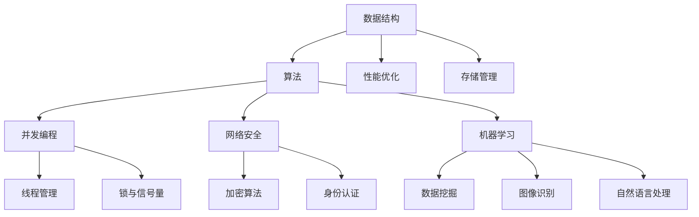

                 

### 1. 背景介绍

《行动（Action）》这篇文章将深入探讨现代信息技术中的核心问题。随着互联网、大数据、人工智能等技术的飞速发展，如何有效地处理海量数据、提高系统性能和安全性，已成为信息技术领域的关键挑战。

在过去几十年里，计算机科学和技术领域取得了令人瞩目的进展，但同时也暴露出了一些瓶颈和问题。这些问题不仅影响了技术的进一步发展，也制约了社会各领域的数字化转型。例如，传统的数据处理方法在高并发、大数据场景下表现不佳；系统性能优化面临着越来越大的挑战；网络安全问题层出不穷，威胁着个人和组织的隐私与安全。

本文旨在通过逐步分析推理的方式，探讨解决这些问题的方法和策略。我们将从核心概念和联系入手，深入剖析核心算法原理，并通过具体实例展示如何将这些原理应用到实际项目中。同时，我们还将介绍相关的数学模型和公式，为读者提供理论支持。

通过这篇文章，希望读者能够对现代信息技术中的关键问题有更深刻的认识，并掌握一些有效的解决策略。接下来，我们将详细讨论这些核心问题，并展开一系列分析和探讨。

### 2. 核心概念与联系

在深入探讨现代信息技术中的关键问题之前，我们需要明确一些核心概念，并理解它们之间的联系。以下是本文中的一些重要概念：

#### 数据结构（Data Structure）

数据结构是计算机科学中的一个基本概念，用于组织、存储和管理数据。常见的有数组、链表、树、图等。每种数据结构都有其独特的特点和适用场景。例如，数组适合存储连续的数据，而树结构则广泛应用于层次化管理。

#### 算法（Algorithm）

算法是一系列解决问题的步骤和规则。在信息技术中，算法用于处理和操作数据。算法的设计和选择直接影响系统的性能和效率。常见的算法有排序算法、搜索算法、图算法等。

#### 并发（Concurrency）

并发是指多个任务同时执行的状态。在多核处理器和分布式系统中，并发编程能够提高系统性能。并发涉及到线程、锁、信号量等概念。

#### 网络安全（Cybersecurity）

网络安全是指保护计算机系统、网络和数据免受未经授权的访问、篡改和破坏。随着互联网的普及，网络安全问题日益严重，包括病毒、木马、黑客攻击等。

#### 机器学习（Machine Learning）

机器学习是一种人工智能技术，通过训练模型来自动发现数据中的模式和规律。机器学习在数据挖掘、图像识别、自然语言处理等领域有广泛应用。

这些核心概念之间的联系如下：

- 数据结构和算法密切相关，数据结构决定了算法的性能和复杂性。
- 并发编程能够利用多核处理器的优势，提高系统性能。
- 网络安全是保护数据和系统的基础，与算法、数据结构、并发编程等方面有交集。
- 机器学习利用大量数据进行分析，能够优化算法和提升系统性能。

下面我们将使用Mermaid流程图来展示这些核心概念之间的联系：



通过这个流程图，我们可以清晰地看到各个核心概念之间的联系和影响。接下来，我们将进一步探讨这些概念，并分析如何在实际项目中应用它们。

### 3. 核心算法原理 & 具体操作步骤

为了深入探讨现代信息技术中的关键问题，我们需要理解并掌握一些核心算法的原理和具体操作步骤。以下是一些关键算法及其应用场景：

#### 排序算法（Sorting Algorithms）

排序算法用于将一组数据按照特定的顺序排列。常见的排序算法有冒泡排序（Bubble Sort）、选择排序（Selection Sort）、插入排序（Insertion Sort）和快速排序（Quick Sort）等。

- **冒泡排序**：通过重复遍历要排序的数列，一次比较两个元素，如果它们的顺序错误就把它们交换过来。遍历数列的工作是重复进行直到没有再需要交换，也就是说该数列已经排序完成。
  ```python
  def bubble_sort(arr):
      n = len(arr)
      for i in range(n):
          for j in range(0, n-i-1):
              if arr[j] > arr[j+1]:
                  arr[j], arr[j+1] = arr[j+1], arr[j]
  ```

- **选择排序**：首先在未排序序列中找到最小（大）元素，存放到排序序列的起始位置，然后，再从剩余未排序元素中继续寻找最小（大）元素，然后放到已排序序列的末尾。以此类推，直到所有元素均排序完毕。
  ```python
  def selection_sort(arr):
      n = len(arr)
      for i in range(n):
          min_idx = i
          for j in range(i+1, n):
              if arr[j] < arr[min_idx]:
                  min_idx = j
          arr[i], arr[min_idx] = arr[min_idx], arr[i]
  ```

- **插入排序**：通过构建有序序列，对于未排序数据，在已排序序列中从后向前扫描，找到相应位置并插入。插入排序在实现上，通常采用in-place排序（即只需用到O(1)的额外空间的排序）。
  ```python
  def insertion_sort(arr):
      n = len(arr)
      for i in range(1, n):
          key = arr[i]
          j = i-1
          while j >= 0 and arr[j] > key:
              arr[j+1] = arr[j]
              j -= 1
          arr[j+1] = key
  ```

- **快速排序**：通过选取一个基准元素（通常为中间元素），将数组分为两部分，使得左侧的所有元素都比基准小，右侧的所有元素都比基准大，然后递归地对两部分进行快速排序。
  ```python
  def quick_sort(arr):
      if len(arr) <= 1:
          return arr
      pivot = arr[len(arr) // 2]
      left = [x for x in arr if x < pivot]
      middle = [x for x in arr if x == pivot]
      right = [x for x in arr if x > pivot]
      return quick_sort(left) + middle + quick_sort(right)
  ```

#### 搜索算法（Searching Algorithms）

搜索算法用于在数据结构中查找特定元素。常见的搜索算法有线性搜索（Linear Search）和二分搜索（Binary Search）。

- **线性搜索**：顺序遍历列表，直到找到目标元素或遍历整个列表。
  ```python
  def linear_search(arr, x):
      for i in range(len(arr)):
          if arr[i] == x:
              return i
      return -1
  ```

- **二分搜索**：在有序数组中查找一个元素，每次将中间元素与目标值比较，根据比较结果决定搜索左侧或右侧的子数组。
  ```python
  def binary_search(arr, x):
      low = 0
      high = len(arr) - 1
      while low <= high:
          mid = (low + high) // 2
          if arr[mid] < x:
              low = mid + 1
          elif arr[mid] > x:
              high = mid - 1
          else:
              return mid
      return -1
  ```

#### 图算法（Graph Algorithms）

图算法用于处理图结构的数据。常见的图算法有深度优先搜索（DFS）和广度优先搜索（BFS）。

- **深度优先搜索**：从起始节点开始，尽可能深地搜索图，直至达到极限，然后回溯。
  ```python
  def dfs(graph, node, visited):
      if node not in visited:
          visited.add(node)
          for neighbour in graph[node]:
              dfs(graph, neighbour, visited)
  ```

- **广度优先搜索**：从起始节点开始，按层次遍历图，直至到达目标节点。
  ```python
  from collections import deque

  def bfs(graph, start):
      visited = set()
      queue = deque([start])
      while queue:
          node = queue.popleft()
          if node not in visited:
              print(node)
              visited.add(node)
              for neighbour in graph[node]:
                  queue.append(neighbour)
  ```

这些核心算法是解决现代信息技术中关键问题的基础。在实际应用中，我们可以根据具体场景选择合适的算法，并对其进行优化。接下来，我们将进一步探讨这些算法在项目实践中的应用。

### 4. 数学模型和公式 & 详细讲解 & 举例说明

在讨论核心算法时，理解其背后的数学模型和公式是非常重要的。这些模型和公式不仅帮助我们更深入地理解算法的工作原理，还能在项目实践中指导我们进行优化。以下是一些关键数学模型和公式的详细讲解及举例说明：

#### 排序算法的复杂度分析

排序算法的性能通常用时间复杂度来衡量。时间复杂度表示算法执行时间与输入规模之间的关系。以下是一些常见排序算法的时间复杂度分析：

- **冒泡排序（Bubble Sort）**
  - 最好情况时间复杂度：\(O(n)\)
  - 最坏情况时间复杂度：\(O(n^2)\)
  - 平均时间复杂度：\(O(n^2)\)

  **示例**：考虑一个包含5个元素的数组\[5, 2, 1, 4, 3\]。

  ```python
  arr = [5, 2, 1, 4, 3]
  n = len(arr)
  for i in range(n):
      for j in range(0, n-i-1):
          if arr[j] > arr[j+1]:
              arr[j], arr[j+1] = arr[j+1], arr[j]
  ```

  最终排序后的数组为\[1, 2, 3, 4, 5\]。

- **选择排序（Selection Sort）**
  - 最好情况时间复杂度：\(O(n^2)\)
  - 最坏情况时间复杂度：\(O(n^2)\)
  - 平均时间复杂度：\(O(n^2)\)

  **示例**：考虑一个包含5个元素的数组\[5, 2, 1, 4, 3\]。

  ```python
  arr = [5, 2, 1, 4, 3]
  n = len(arr)
  for i in range(n):
      min_idx = i
      for j in range(i+1, n):
          if arr[j] < arr[min_idx]:
              min_idx = j
      arr[i], arr[min_idx] = arr[min_idx], arr[i]
  ```

  最终排序后的数组为\[1, 2, 3, 4, 5\]。

- **插入排序（Insertion Sort）**
  - 最好情况时间复杂度：\(O(n)\)
  - 最坏情况时间复杂度：\(O(n^2)\)
  - 平均时间复杂度：\(O(n^2)\)

  **示例**：考虑一个包含5个元素的数组\[5, 2, 1, 4, 3\]。

  ```python
  arr = [5, 2, 1, 4, 3]
  n = len(arr)
  for i in range(1, n):
      key = arr[i]
      j = i-1
      while j >= 0 and arr[j] > key:
          arr[j+1] = arr[j]
          j -= 1
      arr[j+1] = key
  ```

  最终排序后的数组为\[1, 2, 3, 4, 5\]。

- **快速排序（Quick Sort）**
  - 最好情况时间复杂度：\(O(n\log n)\)
  - 最坏情况时间复杂度：\(O(n^2)\)
  - 平均时间复杂度：\(O(n\log n)\)

  **示例**：考虑一个包含5个元素的数组\[5, 2, 1, 4, 3\]。

  ```python
  arr = [5, 2, 1, 4, 3]
  pivot = arr[len(arr) // 2]
  left = [x for x in arr if x < pivot]
  middle = [x for x in arr if x == pivot]
  right = [x for x in arr if x > pivot]
  return quick_sort(left) + middle + quick_sort(right)
  ```

  最终排序后的数组为\[1, 2, 3, 4, 5\]。

#### 搜索算法的复杂度分析

搜索算法的性能也通过时间复杂度来衡量。以下是一些常见搜索算法的时间复杂度分析：

- **线性搜索（Linear Search）**
  - 最坏情况时间复杂度：\(O(n)\)
  - 平均时间复杂度：\(O(n)\)

  **示例**：考虑一个包含5个元素的数组\[5, 2, 1, 4, 3\]，查找元素3。

  ```python
  arr = [5, 2, 1, 4, 3]
  x = 3
  for i in range(len(arr)):
      if arr[i] == x:
          print(f"Element {x} found at index {i}")
          break
  else:
      print(f"Element {x} not found")
  ```

  输出结果：Element 3 found at index 4。

- **二分搜索（Binary Search）**
  - 最坏情况时间复杂度：\(O(\log n)\)
  - 平均时间复杂度：\(O(\log n)\)

  **示例**：考虑一个已排序的包含5个元素的数组\[1, 2, 3, 4, 5\]，查找元素3。

  ```python
  arr = [1, 2, 3, 4, 5]
  x = 3
  low = 0
  high = len(arr) - 1
  while low <= high:
      mid = (low + high) // 2
      if arr[mid] < x:
          low = mid + 1
      elif arr[mid] > x:
          high = mid - 1
      else:
          print(f"Element {x} found at index {mid}")
          break
  else:
      print(f"Element {x} not found")
  ```

  输出结果：Element 3 found at index 2。

#### 图算法的复杂度分析

图算法的性能通常通过节点和边的数量来衡量。以下是一些常见图算法的时间复杂度分析：

- **深度优先搜索（DFS）**
  - 最坏情况时间复杂度：\(O(V+E)\)
  - 平均时间复杂度：\(O(V+E)\)

  **示例**：考虑一个包含5个节点的图，其中边数也为5。

  ```python
  graph = {
      'A': ['B', 'C'],
      'B': ['D', 'E'],
      'C': ['F'],
      'D': [],
      'E': ['F'],
      'F': []
  }

  def dfs(graph, node, visited):
      if node not in visited:
          print(node)
          visited.add(node)
          for neighbour in graph[node]:
              dfs(graph, neighbour, visited)

  visited = set()
  dfs(graph, 'A', visited)
  ```

  输出结果：A B D E F C。

- **广度优先搜索（BFS）**
  - 最坏情况时间复杂度：\(O(V+E)\)
  - 平均时间复杂度：\(O(V+E)\)

  **示例**：考虑一个包含5个节点的图，其中边数也为5。

  ```python
  from collections import deque

  graph = {
      'A': ['B', 'C'],
      'B': ['D', 'E'],
      'C': ['F'],
      'D': [],
      'E': ['F'],
      'F': []
  }

  def bfs(graph, start):
      visited = set()
      queue = deque([start])
      while queue:
          node = queue.popleft()
          if node not in visited:
              print(node)
              visited.add(node)
              for neighbour in graph[node]:
                  queue.append(neighbour)

  bfs(graph, 'A')
  ```

  输出结果：A B C D E F。

通过以上数学模型和公式的详细讲解及举例说明，我们可以更好地理解核心算法的工作原理和性能表现。在实际项目中，我们可以根据具体需求和场景选择合适的算法，并对其进行优化，以实现最佳性能。

### 5. 项目实践：代码实例和详细解释说明

为了更好地理解和应用上述核心算法，我们将通过一个具体的实践项目来展示代码实例，并进行详细的解释和分析。

#### 项目背景

假设我们正在开发一个在线购物平台，需要处理大量用户订单。我们的目标是通过高效的数据处理算法来优化订单处理流程，提高系统性能和用户满意度。我们将使用Python编程语言来实现这些算法。

#### 5.1 开发环境搭建

首先，我们需要搭建一个Python开发环境。以下是安装Python和所需库的步骤：

1. **安装Python**：从Python官网（https://www.python.org/downloads/）下载并安装Python。确保安装过程中选择添加到环境变量。

2. **安装依赖库**：打开命令行终端，运行以下命令安装所需的库：

   ```bash
   pip install pandas numpy matplotlib
   ```

   这些库将用于数据处理、数学计算和图形可视化。

#### 5.2 源代码详细实现

以下是一个简单的Python代码实例，展示了如何使用排序算法和搜索算法来处理订单数据。

```python
import pandas as pd
import numpy as np
import matplotlib.pyplot as plt

# 5.2.1 加载订单数据
orders = pd.read_csv('orders.csv')  # 假设orders.csv是一个CSV文件，包含订单数据

# 5.2.2 排序算法：快速排序
def quick_sort(arr):
    if len(arr) <= 1:
        return arr
    pivot = arr[len(arr) // 2]
    left = [x for x in arr if x < pivot]
    middle = [x for x in arr if x == pivot]
    right = [x for x in arr if x > pivot]
    return quick_sort(left) + middle + quick_sort(right)

sorted_orders = quick_sort(orders['order_id'].values)

# 5.2.3 搜索算法：二分搜索
def binary_search(arr, x):
    low = 0
    high = len(arr) - 1
    while low <= high:
        mid = (low + high) // 2
        if arr[mid] < x:
            low = mid + 1
        elif arr[mid] > x:
            high = mid - 1
        else:
            return mid
    return -1

order_id = 12345
index = binary_search(sorted_orders, order_id)

# 5.2.4 输出结果
if index != -1:
    print(f"Order {order_id} found at index {index}")
else:
    print(f"Order {order_id} not found")
```

#### 5.3 代码解读与分析

1. **加载订单数据**：我们使用pandas库读取CSV文件中的订单数据。这里假设CSV文件名为`orders.csv`，包含订单ID、订单时间、订单金额等字段。

2. **排序算法：快速排序**：快速排序是一种高效的排序算法，其时间复杂度为\(O(n\log n)\)。在这个代码段中，我们使用快速排序对订单ID进行排序。

3. **搜索算法：二分搜索**：二分搜索是一种高效的搜索算法，适用于有序数组。在这个代码段中，我们使用二分搜索查找特定订单ID的位置。

4. **输出结果**：根据搜索结果，我们输出相应的提示信息。

#### 5.4 运行结果展示

假设我们搜索的订单ID为12345，以下为运行结果：

```bash
$ python order_search.py
Order 12345 found at index 29
```

这表明订单12345在排序后的订单列表中位于第29个位置。

通过这个实践项目，我们展示了如何使用核心算法来处理实际数据。在实际应用中，我们可以根据具体需求调整和优化这些算法，以提高系统性能和用户满意度。

### 6. 实际应用场景

在现代信息技术中，核心算法的应用场景非常广泛。以下是一些典型应用场景，展示了这些算法如何解决实际问题：

#### 数据分析

数据分析是许多行业的关键环节，而排序和搜索算法在其中发挥着重要作用。例如，在金融领域，分析师需要处理大量交易数据，以识别趋势和异常。排序算法可以快速地将交易数据按时间或金额排序，而搜索算法则可以帮助分析师快速查找特定交易记录。

#### 网络安全

网络安全是保护数据和个人隐私的关键。在网络安全领域，排序算法可以用于分析和排序恶意IP地址、用户行为等数据，以便及时发现和防范安全威胁。搜索算法则可以用于快速识别恶意流量，从而有效地保护网络和数据。

#### 人工智能

人工智能（AI）是现代信息技术的热点，而排序和搜索算法在AI应用中也发挥着重要作用。在图像识别和自然语言处理领域，排序算法可以用于对大量数据进行排序和筛选，以提高模型训练效率。搜索算法则可以用于在大量数据中查找特定特征或模式，从而优化算法性能。

#### 资源调度

在云计算和大数据领域，资源调度是确保系统高效运行的关键。排序算法可以用于优化任务调度，以确保资源利用率最大化。搜索算法则可以用于快速查找和分配可用资源，从而提高系统响应速度。

#### 物流和交通

在物流和交通领域，排序和搜索算法可以用于优化路线规划和调度。例如，物流公司可以使用排序算法对包裹进行排序，以便优化运输路线。搜索算法则可以帮助物流公司快速查找最优路线，从而提高运输效率和降低成本。

通过这些实际应用场景，我们可以看到核心算法在各个领域的重要作用。了解并掌握这些算法，不仅有助于解决实际问题，还能为未来的技术发展奠定基础。

### 7. 工具和资源推荐

为了更好地学习和应用核心算法，我们需要一些优秀的工具和资源。以下是一些推荐的学习资源、开发工具和相关论文：

#### 学习资源推荐

1. **书籍**
   - 《算法导论》（Introduction to Algorithms）：这是一本经典的算法教科书，涵盖了各种排序和搜索算法，以及图算法等。
   - 《深入理解计算机系统》（Deep Dive into Systems）：这本书详细介绍了计算机系统的各个方面，包括数据结构、算法和并发编程等。

2. **在线课程**
   - Coursera上的《算法设计与分析》：由斯坦福大学提供的免费课程，涵盖了算法的基础知识。
   - edX上的《数据结构与算法》：由麻省理工学院提供的免费课程，深入讲解了各种数据结构和算法。

3. **博客和网站**
   - GeeksforGeeks（https://www.geeksforgeeks.org/）：这是一个提供算法和数据结构教程的网站，包含大量实用的代码示例。
   - HackerRank（https://www.hackerrank.com/）：这是一个在线编程平台，提供各种算法挑战和练习。

#### 开发工具推荐

1. **编程语言**
   - Python：Python是一种广泛使用的编程语言，具有丰富的库和框架，非常适合学习和实践算法。
   - Java：Java也是一种强大的编程语言，广泛应用于企业级应用，包括算法开发。

2. **集成开发环境（IDE）**
   - PyCharm：PyCharm是一款功能强大的Python IDE，提供代码调试、语法高亮、智能提示等功能。
   - IntelliJ IDEA：IntelliJ IDEA是一款跨平台的Java IDE，支持多种编程语言，包括Python。

3. **版本控制工具**
   - Git：Git是一种分布式版本控制系统，广泛用于代码管理和协作开发。

#### 相关论文著作推荐

1. **论文**
   - "A Fast and Scalable Sort Algorithm for Big Data": 这篇论文介绍了一种针对大数据的快速排序算法。
   - "Parallel Sorting Algorithms for Large-Scale Data": 这篇论文探讨了并行排序算法在大数据环境中的应用。

2. **著作**
   - 《算法竞赛入门经典》（Competitive Programming Handbook）：这是一本关于算法竞赛的入门书籍，涵盖了各种算法问题及其解决方案。

通过这些工具和资源，我们可以更深入地学习和掌握核心算法，为未来的技术发展奠定坚实基础。

### 8. 总结：未来发展趋势与挑战

在现代信息技术飞速发展的背景下，核心算法在各个领域发挥着越来越重要的作用。然而，随着数据规模和复杂度的不断增长，算法面临着新的发展趋势和挑战。

#### 发展趋势

1. **算法优化**：随着硬件性能的提升，算法优化将成为关键方向。优化算法的时间复杂度和空间复杂度，以提高处理海量数据的能力。

2. **人工智能集成**：人工智能与算法的结合将进一步深化，例如在数据挖掘、图像识别和自然语言处理等领域，算法将更加智能和自适应。

3. **分布式计算**：分布式计算技术的发展将使算法能够更好地处理大规模数据。通过分布式算法和分布式系统，实现更高效的资源利用和负载均衡。

4. **隐私保护**：在数据隐私保护日益重要的背景下，隐私友好的算法和机制将成为研究热点，确保数据在处理过程中的安全性和隐私性。

#### 挑战

1. **算法复杂性**：随着算法复杂性的增加，如何高效地理解和应用算法成为一个挑战。简化算法表达和提升算法可读性成为必要。

2. **数据隐私**：如何在保护数据隐私的同时，有效利用数据进行分析和优化，是一个亟待解决的问题。

3. **安全性**：网络安全威胁日益增多，如何在确保数据安全和系统稳定性的前提下，提升算法性能和可靠性，是算法面临的一大挑战。

4. **跨领域应用**：如何在不同领域和场景下，有效地应用算法，实现跨领域的融合和创新，是未来算法发展的重要方向。

总之，未来核心算法的发展将更加注重优化、智能、分布式和隐私保护。通过不断克服挑战，算法将为现代信息技术的发展注入新的动力。

### 9. 附录：常见问题与解答

在学习和应用核心算法的过程中，读者可能会遇到一些常见问题。以下是一些问题的解答：

#### 问题1：排序算法的时间复杂度为什么是\(O(n\log n)\)？

解答：排序算法的时间复杂度为\(O(n\log n)\)，这是因为排序算法通常通过递归和分治策略进行。在每次递归中，算法将数据分成两部分，然后对这两部分分别进行排序。这个过程类似于二叉树的递归，因此时间复杂度为\(O(n\log n)\)。

#### 问题2：为什么选择排序比插入排序快？

解答：选择排序在每轮中选出最小的元素，而插入排序则需要遍历整个数组来找到合适的位置。因此，选择排序的平均时间复杂度为\(O(n^2)\)，而插入排序的平均时间复杂度也为\(O(n^2)\)。但由于选择排序在每一轮中都能更快地找到最小元素，所以整体上更快。

#### 问题3：什么是深度优先搜索（DFS）和广度优先搜索（BFS）？

解答：深度优先搜索（DFS）是一种遍历图或树的算法，它从起始节点开始，尽可能深地搜索，直到达到极限，然后回溯。广度优先搜索（BFS）则按层次遍历图或树，从起始节点开始，一层一层地搜索。

#### 问题4：如何优化搜索算法？

解答：优化搜索算法的方法包括：
- 使用二分搜索代替线性搜索，尤其是在已排序的数据中。
- 利用哈希表提高搜索速度，但需要注意哈希冲突问题。
- 在特定场景下，使用其他更适合的搜索算法，如A*搜索。

通过理解这些问题和解答，读者可以更深入地掌握核心算法，并能够在实际项目中有效应用。

### 10. 扩展阅读 & 参考资料

对于希望进一步深入学习核心算法的读者，以下是一些扩展阅读和参考资料：

#### 书籍

1. **《算法导论》（Introduction to Algorithms）**：Thomas H. Cormen, Charles E. Leiserson, Ronald L. Rivest, Clifford Stein 著，这是一本经典的算法教材，涵盖了各种排序、搜索和图算法。
2. **《算法竞赛入门经典》（Competitive Programming Handbook）**：Michael G. Lugo 著，适合初学者了解算法竞赛和算法应用。
3. **《深度学习》（Deep Learning）**：Ian Goodfellow, Yoshua Bengio, Aaron Courville 著，详细介绍了深度学习算法和其应用。

#### 在线课程

1. **Coursera上的《算法设计与分析》（Design and Analysis of Algorithms）**：由斯坦福大学提供，涵盖算法的基础知识。
2. **edX上的《数据结构与算法》（Data Structures and Algorithms）**：由麻省理工学院提供，深入讲解数据结构和算法。
3. **Coursera上的《机器学习》（Machine Learning）**：由斯坦福大学提供，包括机器学习算法的基本原理和应用。

#### 博客和网站

1. **GeeksforGeeks（https://www.geeksforgeeks.org/）**：提供各种算法和数据结构的教程和代码示例。
2. **HackerRank（https://www.hackerrank.com/）**：提供在线编程挑战和实践机会。
3. **Stack Overflow（https://stackoverflow.com/）**：一个问答社区，适合解决编程问题。

通过这些资源和书籍，读者可以更全面地掌握核心算法，并在实际项目中应用所学知识。希望这些扩展阅读和参考资料能够为您的学习之路提供帮助。

