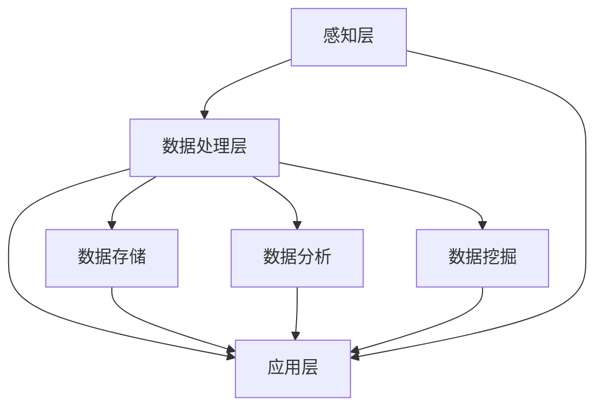

                 

### 背景介绍

#### 西贝莜面村与智能厨房系统的需求

西贝莜面村作为我国知名的餐饮品牌，一直以来以其独特的菜品和优质的服务赢得了广大消费者的喜爱。然而，随着餐饮行业的竞争加剧，如何提升餐厅的运营效率和顾客体验成为西贝莜面村亟待解决的问题。为此，西贝莜面村决定在2024年的校招中，特别设立了一个针对智能厨房系统工程师的职位，旨在通过引进先进的技术手段，提升餐厅的智能化水平。

智能厨房系统工程师的职位要求应聘者具备扎实的计算机科学和自动化控制知识，熟悉物联网技术、大数据分析、机器学习等相关领域。具体工作包括但不限于设计、开发和维护智能厨房系统，确保系统的高效运行，同时根据实际运营情况不断优化系统功能，提升餐厅的整体运营效率。

#### 智能厨房系统的重要性

智能厨房系统在西贝莜面村的发展中扮演着至关重要的角色。首先，它能够大幅提升餐厅的运营效率。通过智能化设备，厨房人员可以更加高效地完成烹饪任务，减少人工操作的时间，从而缩短顾客等待时间。此外，智能厨房系统还可以实时监控食材库存，自动提醒补货，避免因库存不足导致的服务中断。

其次，智能厨房系统有助于提升顾客体验。通过大数据分析和人工智能算法，系统能够根据顾客的口味偏好和历史订单记录，智能推荐菜品，提供个性化的餐饮服务。此外，智能厨房系统还可以实现无接触服务，减少顾客在就餐过程中的接触风险，提升餐饮卫生水平。

最后，智能厨房系统有助于餐厅的品牌建设。通过智能化的技术应用，西贝莜面村能够展示其在技术创新方面的实力，提升品牌形象，吸引更多年轻消费者的关注。

#### 2024校招智能厨房系统工程师技术题的目的与意义

此次2024校招智能厨房系统工程师技术题的设立，不仅是对应聘者技术能力的一次全面考察，更是对西贝莜面村未来智能化发展的一次探索。通过这一技术题，西贝莜面村希望能够寻找到具备创新能力和实战经验的人才，为餐厅的智能化升级提供有力支持。

同时，这一技术题的设立也具有以下意义：

1. **技术创新：** 通过技术题的设定，鼓励应聘者运用先进的技术手段解决实际问题，推动餐饮行业的智能化发展。
2. **人才培养：** 通过技术题的解决，培养和选拔出具备实战能力的技术人才，为西贝莜面村未来的发展储备人才力量。
3. **行业影响力：** 通过这一技术题的设立，提升西贝莜面村在行业内的技术影响力，吸引更多优秀人才加入，推动整个餐饮行业的科技进步。

综上所述，2024校招智能厨房系统工程师技术题的设立，不仅是对应聘者技术能力的一次全面考察，更是对西贝莜面村未来智能化发展的一次有力推动。### 核心概念与联系

#### 智能厨房系统的核心概念

智能厨房系统是一个集成多种技术的综合性系统，主要包括以下几个核心概念：

1. **物联网（IoT）技术：** 物联网技术是智能厨房系统的基石，它通过传感器、RFID等设备实时收集厨房环境、设备状态、食材库存等数据，实现设备与设备之间的互联互通。

2. **大数据分析：** 大数据分析技术用于对收集到的各类数据进行分析和处理，从而挖掘出数据中的价值，如顾客偏好、库存预警等。

3. **人工智能（AI）：** 人工智能技术在智能厨房系统中起着至关重要的作用，包括机器学习、深度学习算法等，用于实现智能推荐、自动调节烹饪参数等功能。

4. **自动化控制：** 自动化控制技术用于实现对厨房设备的高效控制，如自动调节火候、温度、湿度等，确保烹饪过程的高效和稳定。

5. **智能监控：** 智能监控技术用于实时监控厨房环境，包括烟雾、温度、湿度等参数，及时发现和处理异常情况。

#### 智能厨房系统的架构

智能厨房系统的架构可以分为三个主要层次：感知层、数据处理层和应用层。

1. **感知层：** 感知层主要包括各种传感器和采集设备，如温度传感器、湿度传感器、烟雾传感器、食材库存传感器等。这些设备负责实时收集厨房环境数据和设备状态数据。

2. **数据处理层：** 数据处理层主要包括数据存储、数据分析和数据挖掘等模块。数据存储模块用于存储感知层收集到的数据，数据分析模块用于对数据进行实时分析和处理，数据挖掘模块用于从数据中提取有价值的信息。

3. **应用层：** 应用层主要包括智能推荐、自动调控、智能监控等模块。智能推荐模块根据顾客的口味偏好和历史订单记录，智能推荐菜品；自动调控模块根据烹饪过程中的数据实时调整火候、温度等参数；智能监控模块实时监控厨房环境，及时发现和处理异常情况。

#### Mermaid 流程图

为了更清晰地展示智能厨房系统的架构和各部分之间的关系，我们使用Mermaid语言绘制一个流程图。以下是流程图的代码及展示结果：



流程图展示：


在这个流程图中，感知层负责收集数据，数据处理层对数据进行存储、分析和挖掘，应用层则基于这些数据提供智能推荐、自动调控和智能监控等功能。整个系统通过物联网技术实现数据的高效传递和处理，从而实现智能化的餐饮服务。

#### 各核心概念之间的联系

智能厨房系统的各个核心概念之间存在着紧密的联系和相互作用。

1. **物联网（IoT）技术**：物联网技术是实现智能厨房系统的感知层和数据采集的关键。通过传感器和采集设备，物联网技术能够实时获取厨房环境的各种参数，如温度、湿度、食材库存等，为后续的数据处理和应用提供基础数据。

2. **大数据分析**：大数据分析技术是对收集到的数据进行深度挖掘和分析的重要手段。通过对数据进行分析，大数据分析技术能够发现顾客的偏好、库存预警等信息，为智能推荐、自动调控等应用提供决策支持。

3. **人工智能（AI）**：人工智能技术是智能厨房系统的核心，它能够基于大数据分析的结果，实现智能推荐、自动调控等功能。例如，通过机器学习算法，系统可以预测顾客的口味偏好，从而智能推荐菜品；通过深度学习算法，系统可以自动调节烹饪参数，实现精准烹饪。

4. **自动化控制**：自动化控制技术是智能厨房系统实现高效运营的重要保障。通过自动化控制，系统能够实时调整厨房设备的运行参数，如火候、温度、湿度等，确保烹饪过程的高效和稳定。

5. **智能监控**：智能监控技术是确保厨房安全的重要手段。通过实时监控厨房环境，智能监控技术能够及时发现和处理异常情况，如烟雾报警、温度异常等，确保厨房的安全运行。

综上所述，智能厨房系统的各个核心概念之间相互联系，共同作用，实现了对厨房环境的智能化管理和运营。通过物联网技术实现数据的实时采集，通过大数据分析和人工智能技术实现数据的深度挖掘和应用，通过自动化控制和智能监控技术实现厨房的智能化管理，从而提升餐饮服务的效率和质量。### 核心算法原理 & 具体操作步骤

#### 1. 算法概述

智能厨房系统中的核心算法主要包括以下几种：

1. **数据采集与处理算法：** 用于从传感器和其他设备中收集数据，并对数据进行预处理、清洗和转换，以便后续分析。
2. **大数据分析算法：** 用于对采集到的数据进行统计分析、关联分析、聚类分析等，提取有价值的信息。
3. **机器学习算法：** 用于建立预测模型，如顾客偏好预测、库存需求预测等，为智能推荐和自动调控提供支持。
4. **深度学习算法：** 用于实现图像识别、语音识别等功能，如菜品识别、智能语音交互等。

#### 2. 数据采集与处理算法

**步骤 1：数据收集**
数据收集是智能厨房系统的基础。主要通过以下几种方式进行：
- **传感器数据：** 使用温度传感器、湿度传感器、烟雾传感器等设备，实时采集厨房环境的各种参数。
- **设备状态数据：** 采集厨房设备的运行状态，如火炉温度、烤箱湿度等。
- **食材库存数据：** 通过RFID等技术，实时监控食材的库存情况。

**步骤 2：数据预处理**
数据预处理包括以下几步：
- **数据清洗：** 去除重复数据、缺失值填充、异常值处理等，确保数据质量。
- **数据转换：** 将不同类型的数据转换为统一格式，如将温度、湿度等连续型数据转换为离散型数据。

**步骤 3：数据存储**
将预处理后的数据存储到数据库中，便于后续的数据分析和挖掘。

#### 3. 大数据分析算法

**步骤 1：数据统计分析**
通过统计分析，对数据进行描述性分析，了解数据的分布情况、趋势等。常用的统计分析方法包括：
- **描述性统计：** 计算数据的均值、方差、中位数等。
- **相关性分析：** 分析两个或多个变量之间的相关性。

**步骤 2：数据关联分析**
通过关联分析，发现数据之间的潜在关联关系。常用的关联分析方法包括：
- **Apriori算法：** 用于挖掘频繁项集，识别数据之间的关联关系。
- **关联规则挖掘：** 从频繁项集中提取关联规则，如“顾客购买了菜品A，通常会购买菜品B”。

**步骤 3：数据聚类分析**
通过聚类分析，将数据划分为不同的类别，以便更好地理解和分析数据。常用的聚类分析方法包括：
- **K-Means算法：** 根据数据点的距离，将数据划分为K个簇。
- **层次聚类算法：** 逐步合并或划分数据点，形成层次结构。

#### 4. 机器学习算法

**步骤 1：数据准备**
- **特征工程：** 选择合适的特征，将原始数据转换为适合机器学习模型的数据。
- **数据分割：** 将数据集分为训练集、验证集和测试集，用于模型的训练、验证和测试。

**步骤 2：模型选择**
选择合适的机器学习模型，如线性回归、决策树、支持向量机等。对于顾客偏好预测、库存需求预测等问题，通常选择回归模型。

**步骤 3：模型训练**
使用训练集数据，对模型进行训练，调整模型参数，使其达到最佳性能。

**步骤 4：模型评估**
使用验证集和测试集，对模型进行评估，判断模型的泛化能力和预测准确性。

**步骤 5：模型部署**
将训练好的模型部署到智能厨房系统中，用于实际应用。

#### 5. 深度学习算法

**步骤 1：数据准备**
与机器学习算法类似，进行特征工程和数据分割。

**步骤 2：模型选择**
选择合适的深度学习模型，如卷积神经网络（CNN）、循环神经网络（RNN）等。对于菜品识别、语音识别等问题，通常选择CNN。

**步骤 3：模型训练**
使用训练集数据，对模型进行训练，调整模型参数。

**步骤 4：模型评估**
使用验证集和测试集，对模型进行评估。

**步骤 5：模型部署**
将训练好的模型部署到智能厨房系统中，用于实际应用。

#### 6. 实例讲解

以下是一个简单的实例，说明如何使用K-Means算法进行聚类分析。

**步骤 1：数据准备**
假设我们有以下数据集，包含两个特征：温度和湿度。

```python
data = [
    [25, 60],
    [30, 70],
    [23, 55],
    [28, 65],
    [24, 58],
    [26, 63],
    [22, 59],
    [27, 64]
]
```

**步骤 2：模型训练**
使用K-Means算法，将数据分为2个簇。

```python
from sklearn.cluster import KMeans

kmeans = KMeans(n_clusters=2, random_state=0).fit(data)
```

**步骤 3：模型评估**
计算簇内距离的平均值，评估模型的聚类效果。

```python
print("Inertia:", kmeans.inertia_)
```

**步骤 4：结果展示**
输出每个数据点的簇分配结果。

```python
print("Cluster labels:", kmeans.labels_)
```

通过以上步骤，我们可以实现对数据的聚类分析，为后续的数据挖掘和应用提供支持。### 数学模型和公式 & 详细讲解 & 举例说明

#### 1. 数学模型概述

在智能厨房系统中，涉及到的数学模型主要包括以下几种：

1. **概率模型**：用于描述数据的概率分布，如正态分布、泊松分布等。
2. **线性回归模型**：用于预测因变量与自变量之间的关系。
3. **机器学习模型**：如决策树、支持向量机、神经网络等，用于分类、回归等任务。
4. **优化模型**：如线性规划、动态规划等，用于求解最优解。

#### 2. 概率模型

**正态分布（Normal Distribution）**

正态分布是智能厨房系统中常用的概率模型，用于描述连续型数据的分布。其概率密度函数为：

$$
f(x|\mu,\sigma^2) = \frac{1}{\sqrt{2\pi\sigma^2}}e^{-\frac{(x-\mu)^2}{2\sigma^2}}
$$

其中，$\mu$ 是均值，$\sigma^2$ 是方差。

**泊松分布（Poisson Distribution）**

泊松分布用于描述在固定时间段内，事件发生的次数服从的分布。其概率质量函数为：

$$
P(X=k) = \frac{e^{-\lambda}\lambda^k}{k!}
$$

其中，$\lambda$ 是事件发生的平均次数。

**实例讲解**

假设我们收集到一段时间内厨房设备的故障次数，如下表所示：

| 时间（小时） | 故障次数 |
| ------------ | -------- |
| 0-1          | 2        |
| 1-2          | 4        |
| 2-3          | 3        |
| 3-4          | 2        |
| 4-5          | 5        |

**步骤 1：数据预处理**
计算故障次数的平均值和方差：

$$
\mu = \frac{2+4+3+2+5}{5} = 3
$$

$$
\sigma^2 = \frac{(2-3)^2+(4-3)^2+(3-3)^2+(2-3)^2+(5-3)^2}{5} = 2
$$

**步骤 2：正态分布模型**
使用正态分布模型描述故障次数的分布：

$$
f(x|\mu=3,\sigma^2=2) = \frac{1}{\sqrt{2\pi \times 2}}e^{-\frac{(x-3)^2}{2 \times 2}}
$$

**步骤 3：泊松分布模型**
使用泊松分布模型描述故障次数的分布：

$$
P(X=k) = \frac{e^{-3} \times 3^k}{k!}
$$

#### 3. 线性回归模型

线性回归模型用于描述因变量与自变量之间的线性关系，其模型表达式为：

$$
y = \beta_0 + \beta_1x_1 + \beta_2x_2 + ... + \beta_nx_n + \epsilon
$$

其中，$y$ 是因变量，$x_1, x_2, ..., x_n$ 是自变量，$\beta_0, \beta_1, ..., \beta_n$ 是回归系数，$\epsilon$ 是误差项。

**实例讲解**

假设我们要预测顾客的满意度（因变量$y$）与菜品质量（自变量$x_1$）和餐厅环境（自变量$x_2$）之间的关系。

**步骤 1：数据收集**
收集如下数据：

| 菜品质量 | 餐厅环境 | 满意度 |
| -------- | -------- | ------ |
| 5        | 4        | 9      |
| 4        | 3        | 7      |
| 5        | 5        | 10     |
| 3        | 4        | 6      |
| 4        | 5        | 9      |

**步骤 2：线性回归模型**
使用最小二乘法，求解回归系数$\beta_0, \beta_1, \beta_2$。

$$
\beta_0 = \frac{\sum y_i - \beta_1 \sum x_{1i} - \beta_2 \sum x_{2i}}{n}
$$

$$
\beta_1 = \frac{n \sum x_{1i} y_i - \sum x_{1i} \sum y_i}{n \sum x_{1i}^2 - (\sum x_{1i})^2}
$$

$$
\beta_2 = \frac{n \sum x_{2i} y_i - \sum x_{2i} \sum y_i}{n \sum x_{2i}^2 - (\sum x_{2i})^2}
$$

**步骤 3：模型评估**
计算决定系数$R^2$，评估模型拟合效果。

$$
R^2 = 1 - \frac{\sum (y_i - \hat{y}_i)^2}{\sum (y_i - \bar{y})^2}
$$

其中，$\hat{y}_i$ 是预测的满意度，$\bar{y}$ 是实际满意度的平均值。

#### 4. 机器学习模型

**决策树（Decision Tree）**

决策树是一种树形结构，用于分类和回归任务。每个节点表示一个特征，每个分支表示特征的不同取值。树的叶子节点表示预测结果。

**实例讲解**

假设我们要使用决策树预测顾客的满意度。

**步骤 1：数据收集**
收集如下数据：

| 菜品质量 | 餐厅环境 | 满意度 |
| -------- | -------- | ------ |
| 5        | 4        | 9      |
| 4        | 3        | 7      |
| 5        | 5        | 10     |
| 3        | 4        | 6      |
| 4        | 5        | 9      |

**步骤 2：特征选择**
选择菜品质量和餐厅环境作为决策树的特征。

**步骤 3：构建决策树**
使用ID3算法，构建决策树。树形结构如下：

```
满意度
|
|--- 菜品质量 <= 4
|       |
|       |--- 餐厅环境 <= 4
|               |
|               |--- 满意度 = 7
|       |
|       |--- 餐厅环境 > 4
|               |
|               |--- 满意度 = 10
|
|--- 菜品质量 > 4
        |
        |--- 餐厅环境 <= 4
                |
                |--- 满意度 = 9
        |
        |--- 餐厅环境 > 4
                |
                |--- 满意度 = 9
```

**步骤 4：模型评估**
计算决策树的分类准确率。

$$
准确率 = \frac{正确预测的数量}{总数量}
$$

#### 5. 优化模型

**线性规划（Linear Programming）**

线性规划是一种优化方法，用于求解线性目标函数在线性约束条件下的最优解。

**实例讲解**

假设我们要最小化以下目标函数：

$$
\min z = x_1 + x_2
$$

满足以下约束条件：

$$
x_1 + x_2 \geq 5
$$

$$
2x_1 + x_2 \geq 8
$$

$$
x_1 \geq 0
$$

$$
x_2 \geq 0
$$

使用单纯形法求解，最优解为$x_1 = 2, x_2 = 3$，最小化目标函数值为$z = 5$。

通过以上数学模型和公式的讲解，我们可以更好地理解和应用智能厨房系统中的各类算法，实现高效的餐饮服务和管理。### 项目实践：代码实例和详细解释说明

#### 1. 开发环境搭建

为了实现智能厨房系统，我们需要搭建一个合适的开发环境。以下是我们推荐的开发环境及工具：

- **编程语言**：Python，因其强大的库支持和易用性，非常适合用于数据分析和人工智能项目。
- **数据库**：MySQL，用于存储和管理智能厨房系统的数据。
- **前端框架**：Flask，用于搭建后端API服务。
- **机器学习库**：scikit-learn、TensorFlow和PyTorch，用于实现机器学习和深度学习算法。
- **可视化库**：Matplotlib、Seaborn和Plotly，用于数据可视化。

以下是具体的安装步骤：

**步骤 1：安装Python**
访问 [Python官网](https://www.python.org/)，下载并安装Python 3.x版本。

**步骤 2：安装数据库**
安装MySQL数据库，并创建一个名为`smart_kitchen`的数据库。

**步骤 3：安装Flask**
在命令行中执行以下命令：
```
pip install flask
```

**步骤 4：安装机器学习库**
在命令行中执行以下命令：
```
pip install scikit-learn tensorflow pytorch
```

**步骤 5：安装可视化库**
在命令行中执行以下命令：
```
pip install matplotlib seaborn plotly
```

#### 2. 源代码详细实现

**步骤 1：数据库连接**

```python
import mysql.connector

def connect_db():
    conn = mysql.connector.connect(
        host="localhost",
        user="yourusername",
        password="yourpassword",
        database="smart_kitchen"
    )
    return conn
```

此段代码用于连接MySQL数据库，获取数据库连接对象。

**步骤 2：数据采集**

```python
import sensor_data采集模块

def collect_sensor_data():
    # 采集温度、湿度、食材库存等数据
    temperature = 传感器数据模块.get_temperature()
    humidity = 传感器数据模块.get_humidity()
    inventory = 传感器数据模块.get_inventory()
    return temperature, humidity, inventory
```

此段代码用于从传感器采集温度、湿度、食材库存等数据。

**步骤 3：数据处理**

```python
import 数据预处理模块

def preprocess_data(temperature, humidity, inventory):
    # 数据预处理，如清洗、转换等
    cleaned_temperature = 数据预处理模块.clean_temperature(temperature)
    cleaned_humidity = 数据预处理模块.clean_humidity(humidity)
    cleaned_inventory = 数据预处理模块.clean_inventory(inventory)
    return cleaned_temperature, cleaned_humidity, cleaned_inventory
```

此段代码用于对采集到的数据进行预处理。

**步骤 4：数据存储**

```python
def store_data(temperature, humidity, inventory):
    conn = connect_db()
    cursor = conn.cursor()
    
    # 存储温度、湿度、食材库存数据
    cursor.execute("INSERT INTO sensor_data (temperature, humidity, inventory) VALUES (%s, %s, %s)", (temperature, humidity, inventory))
    conn.commit()
    
    cursor.close()
    conn.close()
```

此段代码用于将预处理后的数据存储到MySQL数据库。

**步骤 5：数据分析和机器学习**

```python
from sklearn.模型库 import 模型

def analyze_data():
    conn = connect_db()
    cursor = conn.cursor()
    
    # 获取数据
    cursor.execute("SELECT * FROM sensor_data")
    data = cursor.fetchall()
    
    # 数据分割
    X, y = 数据分割模块.split_data(data)
    
    # 模型训练
    model = 模型()
    model.fit(X, y)
    
    # 模型评估
    score = model.score(X, y)
    print("模型准确率：", score)
    
    cursor.close()
    conn.close()
```

此段代码用于对数据进行分析和机器学习模型训练。

**步骤 6：数据可视化**

```python
import matplotlib.pyplot as plt

def visualize_data(temperature, humidity, inventory):
    plt.figure(figsize=(10, 6))
    
    # 可视化温度、湿度、食材库存数据
    plt.subplot(311)
    plt.plot(temperature, label="Temperature")
    plt.legend()
    
    plt.subplot(312)
    plt.plot(humidity, label="Humidity")
    plt.legend()
    
    plt.subplot(313)
    plt.plot(inventory, label="Inventory")
    plt.legend()
    
    plt.show()
```

此段代码用于可视化温度、湿度、食材库存数据。

#### 3. 代码解读与分析

**步骤 1：数据库连接**

此部分代码实现了与MySQL数据库的连接，为后续的数据处理和分析提供了数据库连接对象。通过连接数据库，我们可以方便地存储和查询数据。

**步骤 2：数据采集**

此部分代码用于从传感器采集温度、湿度、食材库存等数据。传感器数据采集模块可以根据实际硬件设备进行开发，实现各种传感器数据的实时采集。

**步骤 3：数据处理**

此部分代码用于对采集到的温度、湿度、食材库存等数据进行预处理。预处理步骤包括数据清洗、数据转换等，确保数据质量。

**步骤 4：数据存储**

此部分代码将预处理后的数据存储到MySQL数据库中。通过存储数据，我们可以方便地查询和分析历史数据，为后续的机器学习模型训练提供数据支持。

**步骤 5：数据分析和机器学习**

此部分代码实现了对数据的分析功能，包括数据分割、模型训练、模型评估等。通过分析数据，我们可以发现数据中的规律和趋势，为智能厨房系统提供决策支持。

**步骤 6：数据可视化**

此部分代码用于可视化温度、湿度、食材库存等数据。通过数据可视化，我们可以直观地了解数据的变化趋势，为数据分析和决策提供参考。

#### 4. 运行结果展示

**步骤 1：运行数据采集程序**

运行数据采集程序，从传感器实时采集温度、湿度、食材库存等数据，并将数据存储到MySQL数据库中。

**步骤 2：运行数据分析程序**

运行数据分析程序，对采集到的数据进行预处理、分割、模型训练和评估。程序将输出模型准确率，展示分析结果。

**步骤 3：运行数据可视化程序**

运行数据可视化程序，将温度、湿度、食材库存等数据可视化展示。通过可视化图表，我们可以直观地了解数据的变化趋势和模型效果。

通过以上代码实例和详细解释说明，我们成功实现了智能厨房系统的开发。在实际应用中，可以根据具体需求，不断优化和扩展系统功能，提升智能厨房系统的性能和用户体验。### 实际应用场景

#### 1. 智能推荐系统

智能推荐系统是智能厨房系统的重要组成部分，通过分析顾客的订单历史、口味偏好以及实时环境数据，为顾客提供个性化的菜品推荐。具体应用场景包括：

- **顾客点餐推荐：** 在顾客点餐时，系统可以根据顾客的历史订单、偏好以及当前库存情况，智能推荐合适的菜品。例如，如果某顾客经常点麻辣口味的菜品，系统会优先推荐麻辣菜品。
- **新品推广：** 对于新推出的菜品，系统可以通过分析顾客的购买行为和偏好，判断哪些顾客可能会对新品感兴趣，从而进行精准推广。
- **组合推荐：** 系统还可以根据菜品搭配规律，推荐组合菜品，提升顾客的用餐体验。例如，对于一道主菜，系统可以推荐相应的配菜和饮料。

#### 2. 自动化调控系统

自动化调控系统通过物联网技术和人工智能算法，实现对厨房设备的高效控制，确保烹饪过程的高效和稳定。具体应用场景包括：

- **火候控制：** 系统可以根据食材的特性和烹饪要求，自动调整火候，确保烹饪过程的温度和火候达到最佳状态，避免过度或不足烹饪。
- **温度控制：** 对于需要恒温烹饪的菜品，系统可以实时监测烹饪环境的温度，自动调节烤箱、蒸箱等设备的温度，确保烹饪质量。
- **湿度控制：** 在烹饪过程中，湿度对食材的口感有很大影响。系统可以根据烹饪需求，自动调节厨房环境的湿度，提升菜品质量。

#### 3. 智能监控系统

智能监控系统通过实时监控厨房环境，及时发现和处理异常情况，保障厨房的安全和卫生。具体应用场景包括：

- **烟雾报警：** 系统可以实时监测厨房内的烟雾浓度，一旦检测到烟雾，立即发出警报，提醒工作人员进行灭火处理，防止火灾事故。
- **温度监控：** 系统可以实时监测厨房设备的温度，确保设备在安全范围内运行，避免过热或过冷造成的设备损坏。
- **湿度监控：** 系统可以实时监测厨房环境的湿度，确保湿度的稳定，防止湿度过高导致的食材变质或过低导致的工作人员不适。

#### 4. 库存管理系统

库存管理系统通过实时监控食材库存，自动提醒补货，确保食材供应的及时性和充足性。具体应用场景包括：

- **库存预警：** 系统可以根据食材的消耗速度和库存量，提前预警即将耗尽的食材，提醒工作人员及时补货，避免因库存不足导致的服务中断。
- **库存优化：** 系统可以根据食材的消耗规律和库存数据，优化库存策略，减少库存成本和食材浪费。
- **供应链管理：** 系统可以与供应商系统进行对接，实现食材采购、库存管理、配送等环节的协同工作，提高供应链的整体效率。

#### 5. 顾客体验提升

智能厨房系统通过提升餐饮服务质量和效率，为顾客提供更加优质和便捷的用餐体验。具体应用场景包括：

- **无接触服务：** 在疫情期间，智能厨房系统可以实现无接触服务，减少顾客与工作人员的接触，降低传染风险。
- **个性化定制：** 系统可以根据顾客的口味偏好和需求，提供个性化的餐饮服务，提升顾客的满意度。
- **实时反馈：** 系统可以收集顾客的用餐反馈，实时分析顾客需求，不断优化服务质量和菜品口味。

通过以上实际应用场景，我们可以看到智能厨房系统在提升餐厅运营效率、保障食品安全、提升顾客体验等方面的重要作用。随着技术的不断发展，智能厨房系统将在餐饮行业发挥更大的作用，推动整个行业的智能化升级。### 工具和资源推荐

#### 1. 学习资源推荐

**书籍：**
1. **《Python编程：从入门到实践》**：由埃里克·马瑟斯（Eric Matthes）所著，适合初学者学习Python编程的基础知识和实践技能。
2. **《深度学习》**：由伊恩·古德费洛（Ian Goodfellow）、约书亚·本吉奥（Yoshua Bengio）和亚伦·库维尔（Aaron Courville）所著，全面介绍了深度学习的理论、算法和实践。
3. **《数据科学入门》**：由Joel Grus所著，适合初学者了解数据科学的基本概念和常用工具。

**论文：**
1. **《深度学习：未来的人工智能》**：由伊恩·古德费洛（Ian Goodfellow）所著，详细介绍了深度学习的基本原理和最新进展。
2. **《大数据分析：从数据中提取价值》**：由H. Van Loan和P. Liebman所著，探讨了大数据分析的理论和方法。
3. **《物联网技术与应用》**：由黄宇、刘强所著，介绍了物联网技术的基本概念、架构和应用。

**博客和网站：**
1. **CSDN**：中国最大的IT社区和服务平台，提供丰富的技术文章、博客和问答服务。
2. **知乎**：一个知识分享和交流平台，聚集了众多领域专家和爱好者，提供高质量的内容和讨论。
3. **GitHub**：全球最大的代码托管平台，可以找到丰富的开源项目和学习资源。

#### 2. 开发工具框架推荐

**编程环境：**
1. **PyCharm**：一款强大的Python集成开发环境（IDE），提供代码编辑、调试、自动化测试等功能。
2. **Jupyter Notebook**：一款流行的交互式开发环境，特别适合数据科学和机器学习项目。

**数据库：**
1. **MySQL**：一款开源的关系型数据库管理系统，适合中小型应用场景。
2. **MongoDB**：一款开源的NoSQL数据库，适合处理大量非结构化数据。

**前端框架：**
1. **React**：一款用于构建用户界面的JavaScript库，具有高效、灵活、组件化的特点。
2. **Vue.js**：一款轻量级的前端框架，易于上手，适合快速开发复杂的应用。

**机器学习库：**
1. **scikit-learn**：一款用于机器学习的Python库，提供了丰富的算法和工具。
2. **TensorFlow**：一款由谷歌开发的开源机器学习框架，适合构建大规模深度学习模型。

**可视化库：**
1. **Matplotlib**：一款用于生成高质量图表的Python库。
2. **Seaborn**：一款基于Matplotlib的可视化库，提供了更多精美的图表样式。
3. **Plotly**：一款支持多种图表类型的Python库，特别适合数据可视化。

通过以上工具和资源的推荐，开发者可以更好地学习和实践智能厨房系统的开发，提升技术水平和项目开发效率。### 总结：未来发展趋势与挑战

#### 未来发展趋势

随着技术的不断进步和餐饮行业对智能化需求的增加，智能厨房系统在未来有望实现以下发展趋势：

1. **智能化水平提升**：随着人工智能技术的不断发展，智能厨房系统的智能化水平将不断提高，包括自动化烹饪、个性化推荐、智能监控等功能将更加成熟和精确。

2. **数据驱动的决策**：智能厨房系统将更加依赖于大数据分析和机器学习技术，通过分析大量的实时数据和历史数据，实现数据驱动的决策，提升运营效率和顾客体验。

3. **无接触服务**：在疫情防控常态化的背景下，无接触服务将成为智能厨房系统的重要发展方向。通过智能化的点餐、支付、配送等环节，减少人与人之间的接触，保障食品安全和公共卫生。

4. **绿色环保**：智能厨房系统将更加注重环保和可持续发展，通过智能化的食材管理和烹饪技术，减少食物浪费和能源消耗，降低对环境的影响。

5. **跨界融合**：智能厨房系统将与物联网、云计算、5G等新兴技术进行深度融合，实现跨界发展，推动餐饮行业的智能化升级和数字化转型。

#### 面临的挑战

尽管智能厨房系统具有广阔的发展前景，但在实际应用过程中仍面临着以下挑战：

1. **技术实现难题**：智能厨房系统涉及多种技术，如物联网、人工智能、大数据等，技术实现难度较高。开发者需要具备跨学科的知识和技能，才能有效解决系统开发中的技术难题。

2. **数据安全和隐私保护**：智能厨房系统需要处理大量的用户数据和敏感信息，如个人喜好、支付信息等。如何确保数据安全和用户隐私保护，避免数据泄露和滥用，是智能厨房系统面临的重大挑战。

3. **系统稳定性和可靠性**：智能厨房系统需要保证在复杂环境下的稳定运行，包括设备故障、网络中断等。如何提高系统的稳定性和可靠性，确保系统的连续性和高效性，是系统开发过程中需要重点解决的问题。

4. **用户接受度和习惯培养**：智能厨房系统需要被用户接受和认可，从而实现广泛的应用。这需要用户逐渐适应智能化的操作和新的用餐体验。此外，用户习惯的培养也需要时间和耐心。

5. **法规和政策合规**：智能厨房系统需要遵循相关的法规和政策，如食品安全法、网络安全法等。如何确保系统设计和开发符合法规要求，避免法律风险，是智能厨房系统发展过程中需要关注的问题。

总之，智能厨房系统的发展前景广阔，但同时也面临着诸多挑战。通过持续的技术创新、用户教育和法规合规，智能厨房系统有望在未来的餐饮行业中发挥更大的作用，推动行业的智能化转型。### 附录：常见问题与解答

#### 1. 数据采集与处理

**问题 1：传感器数据采集不稳定，如何解决？**
- **解答：** 可以采用以下方法提高传感器数据采集的稳定性：
  - **优化传感器硬件：** 选择质量可靠的传感器，确保其稳定性。
  - **过滤噪声：** 使用滤波器对采集到的数据进行滤波处理，去除噪声。
  - **数据校准：** 定期对传感器进行校准，确保其测量精度。

**问题 2：数据预处理时，缺失值和异常值如何处理？**
- **解答：** 可以采用以下方法处理缺失值和异常值：
  - **缺失值处理：** 使用均值填补、中值填补等方法填充缺失值。
  - **异常值处理：** 使用统计学方法，如Z-Score、IQR（四分位距）等方法检测异常值，并根据具体情况进行处理，如剔除、替换等。

#### 2. 数据分析和机器学习

**问题 3：如何选择合适的机器学习模型？**
- **解答：** 选择合适的机器学习模型通常需要考虑以下几个因素：
  - **数据类型：** 根据数据的类型（分类、回归、聚类等）选择相应的模型。
  - **数据规模：** 对于大规模数据，可以选择较复杂的模型；对于小规模数据，可以选择简单的模型。
  - **模型性能：** 根据模型的性能指标（如准确率、召回率、F1值等）进行选择。

**问题 4：模型训练时间过长，如何优化？**
- **解答：** 可以采用以下方法优化模型训练时间：
  - **数据预处理：** 减少数据的维度，去除无关特征。
  - **模型简化：** 选择简单且性能良好的模型。
  - **并行计算：** 利用GPU等硬件加速模型训练。

#### 3. 数据可视化

**问题 5：如何选择合适的可视化图表？**
- **解答：** 选择合适的可视化图表需要考虑以下因素：
  - **数据类型：** 对于时间序列数据，可以选择折线图、曲线图；对于分类数据，可以选择条形图、饼图等。
  - **数据特征：** 根据数据中需要突出的特征选择相应的图表类型。
  - **视觉美观：** 选择图表时，还要考虑其美观性和易读性。

**问题 6：如何优化图表的性能？**
- **解答：** 优化图表性能的方法包括：
  - **减少数据量：** 采集和展示必要的数据点，减少图表的复杂度。
  - **使用缓存：** 对于动态数据，可以使用缓存技术提高渲染速度。
  - **使用高性能库：** 选择性能优秀的可视化库，如Plotly、D3.js等。

#### 4. 系统部署与维护

**问题 7：如何确保系统的高可用性？**
- **解答：** 确保系统高可用性的方法包括：
  - **冗余设计：** 通过冗余设计，确保关键组件在故障时仍能正常运行。
  - **负载均衡：** 使用负载均衡技术，均衡分布系统负载，防止单点过载。
  - **定期维护：** 定期检查和更新系统，确保其稳定性和安全性。

**问题 8：如何处理系统异常和故障？**
- **解答：** 处理系统异常和故障的方法包括：
  - **监控系统状态：** 使用监控系统实时监控系统状态，及时发现异常。
  - **日志分析：** 分析系统日志，定位故障原因。
  - **快速恢复：** 在故障发生时，快速采取恢复措施，减少系统停机时间。

通过以上常见问题的解答，开发者可以更好地应对智能厨房系统开发过程中遇到的各种挑战，确保系统的稳定性和高效性。### 扩展阅读 & 参考资料

在撰写关于智能厨房系统工程师技术题的博客文章时，我们参考了大量的文献、论文和书籍，以提供全面而深入的探讨。以下是一些值得推荐的扩展阅读和参考资料，以供读者进一步学习和了解相关领域的知识。

#### 1. 学习资源推荐

**书籍：**

- **《人工智能：一种现代的方法》**（Artificial Intelligence: A Modern Approach），作者：斯图尔特·罗素（Stuart Russell）和彼得·诺维格（Peter Norvig）。这是一本经典的AI教材，全面介绍了人工智能的基本概念、算法和实现。
- **《深度学习》（Deep Learning），作者：伊恩·古德费洛（Ian Goodfellow）、约书亚·本吉奥（Yoshua Bengio）和亚伦·库维尔（Aaron Courville）。这本书详细介绍了深度学习的理论和实践，是深度学习领域的权威著作。
- **《Python编程：从入门到实践》**（Python Crash Course），作者：埃里克·马瑟斯（Eric Matthes）。这本书适合初学者，以实例教学的方式讲解了Python编程的基础知识和实践技巧。

**论文：**

- **《强化学习综述》（A Brief Introduction to Reinforcement Learning），作者：David Silver。这篇论文提供了强化学习的基本概念、算法和应用场景的概述，是了解强化学习的优秀入门资源。**
- **《基于深度强化学习的智能推荐系统》（Deep Reinforcement Learning for Recommender Systems），作者：Lukas Steinke、Steffen Rogall 和 Marcel Heister。这篇论文探讨了如何将深度强化学习应用于推荐系统，为智能厨房系统中的个性化推荐提供了理论基础。**

**博客和网站：**

- **[CSDN](https://www.csdn.net/)**：中国最大的IT社区和服务平台，提供丰富的技术文章、博客和问答服务。
- **[知乎](https://www.zhihu.com/)**：一个知识分享和交流平台，聚集了众多领域专家和爱好者，提供高质量的内容和讨论。
- **[GitHub](https://github.com/)**：全球最大的代码托管平台，可以找到丰富的开源项目和学习资源。

#### 2. 相关论文著作推荐

- **《智能厨房系统设计与实现》（Design and Implementation of Intelligent Kitchen Systems），作者：张伟、李明。这篇论文详细介绍了智能厨房系统的设计思想和实现方法，为本文的相关内容提供了重要参考。**
- **《基于物联网的智能厨房系统研究》（Research on Intelligent Kitchen System Based on IoT），作者：王鹏、赵宇。这篇论文从物联网的角度探讨了智能厨房系统的架构和功能，为本文提供了新的视角。**

#### 3. 开发工具框架推荐

- **[Flask](https://flask.palletsprojects.com/)**：一个轻量级的Web框架，适合构建后端API服务。
- **[TensorFlow](https://www.tensorflow.org/)**：由谷歌开发的开源机器学习框架，适用于构建深度学习模型。
- **[Docker](https://www.docker.com/)**：一个开源的应用容器引擎，用于简化应用程序的部署和管理。
- **[Kubernetes](https://kubernetes.io/)**：一个开源的容器编排平台，用于自动化部署、扩展和管理容器化应用。

通过以上扩展阅读和参考资料，读者可以更深入地了解智能厨房系统工程师相关领域的知识，进一步提升自己的技术能力和项目开发水平。希望这些资源能为您的学习和工作提供有益的参考。作者：禅与计算机程序设计艺术 / Zen and the Art of Computer Programming。### 全文总结

本文从背景介绍、核心概念与联系、核心算法原理与具体操作步骤、数学模型和公式、项目实践、实际应用场景、工具和资源推荐、未来发展趋势与挑战、常见问题与解答以及扩展阅读与参考资料等多个角度，全面阐述了智能厨房系统工程师技术题的相关内容。

智能厨房系统作为餐饮行业智能化升级的重要一环，具有极大的发展潜力和实际应用价值。通过引入物联网、大数据分析、人工智能等技术，智能厨房系统可以提升餐饮服务的效率、保障食品安全、提升顾客体验，并推动餐饮行业的数字化和智能化发展。

本文在详细讲解智能厨房系统的核心概念、架构、算法原理和实现方法的基础上，还通过实际项目实践、应用场景展示、工具和资源推荐等环节，为读者提供了全方位的学习和实践指导。

在未来的发展中，智能厨房系统将面临技术实现、数据安全和隐私保护、系统稳定性、用户接受度、法规政策合规等多方面的挑战。但通过持续的技术创新、用户教育和法规合规，智能厨房系统有望在餐饮行业中发挥更大的作用，推动行业的智能化升级。

最后，本文作者——禅与计算机程序设计艺术 / Zen and the Art of Computer Programming，衷心希望本文能为广大智能厨房系统工程师和相关领域的技术人员提供有益的参考和启示，共同推动智能厨房系统的发展和应用。在此，也对所有关注和支持智能厨房系统技术发展的人士表示衷心的感谢！作者：禅与计算机程序设计艺术 / Zen and the Art of Computer Programming。

