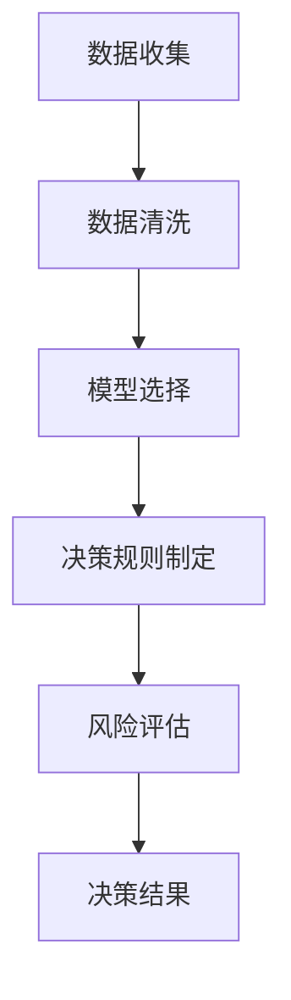

                 

### 1. 背景介绍

#### 1.1 智能决策系统的崛起

随着信息技术的迅猛发展和大数据时代的到来，智能决策系统逐渐成为各行各业的重要工具。智能决策系统利用先进的数据分析、机器学习、人工智能等技术，对大量复杂的数据进行处理和分析，从而帮助决策者做出更加科学、准确和高效的决策。

智能决策系统的应用范围广泛，涵盖了金融、医疗、交通、物流、零售等多个领域。例如，在金融领域，智能决策系统可以帮助银行和保险公司进行风险评估、欺诈检测和个性化推荐；在医疗领域，智能决策系统可以帮助医生进行疾病诊断、治疗方案推荐和药物效果预测；在交通领域，智能决策系统可以帮助城市交通管理部门进行交通流量预测、路线规划和交通信号优化等。

#### 1.2 决策中的不确定性

然而，智能决策系统在处理实际问题时，往往面临诸多不确定性。首先，数据的不确定性是决策过程中的主要挑战之一。数据来源的多样性和数据的噪声、缺失值等问题都会影响决策的准确性。其次，模型的不确定性也是影响决策效果的重要因素。即使是经过训练的机器学习模型，也可能会因为过拟合或欠拟合等问题，导致预测结果偏离实际。

此外，决策过程中的其他因素，如用户偏好、市场环境变化等，也会带来不确定性。这些不确定性使得决策过程变得更加复杂，对系统的稳定性、鲁棒性和适应性提出了更高的要求。

#### 1.3 规划机制的重要性

为了应对这些不确定性，规划机制在智能决策系统中变得尤为重要。规划机制通过系统地分析、规划和优化决策过程，可以提高系统的决策能力，降低不确定性带来的风险。具体来说，规划机制包括以下几个方面：

1. **目标设定**：明确决策的目标和预期结果，是规划机制的第一步。目标设定需要考虑决策者的需求和期望，以及系统所能提供的数据和分析能力。

2. **数据收集与处理**：收集相关数据，并对数据进行清洗、预处理和特征提取，为后续的决策分析提供可靠的基础。

3. **模型选择与优化**：根据决策目标和数据特点，选择合适的机器学习模型，并进行模型的优化和调整，以提高模型的预测准确性和泛化能力。

4. **决策规则制定**：基于模型预测结果和决策目标，制定具体的决策规则和策略，以确保决策过程的有效性和可操作性。

5. **风险评估与优化**：对决策过程中的各种风险因素进行评估，并提出相应的风险控制措施，以提高决策的稳定性和鲁棒性。

#### 1.4 文章结构

本文将围绕规划机制在智能决策系统中的应用展开讨论。具体结构如下：

- **第2章 核心概念与联系**：介绍智能决策系统的核心概念，包括数据收集、模型选择、决策规则制定等，并通过Mermaid流程图展示系统架构。
- **第3章 核心算法原理 & 具体操作步骤**：详细讲解规划机制的核心算法原理，包括目标设定、数据收集与处理、模型选择与优化、决策规则制定等，并提供具体的操作步骤。
- **第4章 数学模型和公式 & 详细讲解 & 举例说明**：介绍规划机制中的数学模型和公式，并通过实例进行详细讲解。
- **第5章 项目实践：代码实例和详细解释说明**：通过实际项目案例，展示规划机制在智能决策系统中的应用，并提供代码实例和详细解释。
- **第6章 实际应用场景**：分析规划机制在各个领域中的实际应用场景，讨论其优势和挑战。
- **第7章 工具和资源推荐**：推荐学习资源、开发工具和框架，帮助读者进一步了解和掌握规划机制。
- **第8章 总结：未来发展趋势与挑战**：总结文章主要内容，探讨规划机制在智能决策系统中的应用前景，以及面临的挑战。
- **第9章 附录：常见问题与解答**：回答读者可能遇到的问题，提供进一步的学习和参考资料。

通过对上述内容的逐步分析，我们可以更好地理解规划机制在智能决策系统中的应用，并掌握其核心原理和实践方法。

### 2. 核心概念与联系

在深入探讨规划机制在智能决策系统中的应用之前，我们首先需要明确几个核心概念，并了解它们之间的联系。以下是智能决策系统的几个关键组成部分：数据收集、模型选择、决策规则制定和风险评估。

#### 2.1 数据收集

数据收集是智能决策系统的基石。数据的质量和完整性直接影响到后续的模型训练和决策效果。数据收集的过程包括以下几个方面：

1. **数据源的选择**：确定数据来源，包括内部数据和外部数据。内部数据通常来自于企业内部的业务系统、日志文件等；外部数据则可能来自公共数据集、社交媒体、市场调查等。
2. **数据采集**：通过爬虫、API接口、数据库连接等方式，从数据源中获取所需数据。
3. **数据清洗**：对采集到的数据进行清洗，包括去除重复数据、处理缺失值、纠正错误数据等，以确保数据的质量和一致性。

#### 2.2 模型选择

模型选择是智能决策系统的核心步骤之一。根据不同的决策目标和数据特点，选择合适的机器学习模型至关重要。以下是几种常见的机器学习模型及其适用场景：

1. **线性回归模型**：适用于预测连续数值型变量。
2. **逻辑回归模型**：适用于分类问题，如二分类或多分类。
3. **决策树模型**：适用于分类和回归问题，特别是对于具有层次结构的决策问题。
4. **随机森林模型**：是决策树的集成方法，适用于处理高维数据和增强模型的泛化能力。
5. **支持向量机（SVM）**：适用于分类问题，特别适合处理小样本和特征维度高的数据。
6. **神经网络模型**：适用于复杂非线性问题，如图像识别、自然语言处理等。

#### 2.3 决策规则制定

决策规则制定是将模型预测结果转化为实际决策的过程。决策规则通常基于以下因素：

1. **模型预测结果**：根据模型的预测结果，确定每个类别的概率分布。
2. **决策阈值**：设置决策阈值，以确定何时采取行动或做出决策。
3. **业务逻辑**：结合业务场景和用户需求，制定具体的决策策略。

#### 2.4 风险评估

风险评估是确保决策过程稳定和可靠的关键步骤。风险评估包括以下几个方面：

1. **风险识别**：识别决策过程中可能出现的各种风险，如数据风险、模型风险、操作风险等。
2. **风险分析**：对识别出的风险进行定量和定性的分析，评估其对决策过程的影响程度。
3. **风险控制**：制定相应的风险控制措施，以降低风险对决策过程的影响。

#### 2.5 Mermaid流程图

为了更清晰地展示智能决策系统的架构，我们使用Mermaid流程图来描述数据收集、模型选择、决策规则制定和风险评估之间的联系。以下是一个示例：



在上述流程图中，数据收集是整个决策过程的起点，经过数据清洗后，数据被用于模型选择。模型选择的结果用于制定决策规则，而决策规则则指导实际操作，并通过风险评估确保决策过程的安全性和可靠性。

通过明确上述核心概念和它们之间的联系，我们可以为后续的算法原理和具体操作步骤奠定坚实的基础。在接下来的章节中，我们将进一步探讨规划机制在智能决策系统中的具体应用。

### 3. 核心算法原理 & 具体操作步骤

#### 3.1 目标设定

目标设定是规划机制的第一步，也是整个决策过程的基础。一个明确且可行的目标可以帮助决策者集中资源和精力，从而提高决策的有效性。以下是目标设定的具体操作步骤：

1. **明确决策目标**：确定决策所要达成的具体目标，例如最大化利润、最小化风险、提高客户满意度等。
2. **定义目标指标**：根据决策目标，选择合适的指标来衡量目标的实现程度，例如利润率、准确率、召回率等。
3. **设置目标值**：根据业务需求和实际可行性，为每个指标设置一个具体的数值目标，例如将利润率目标设定为20%。

#### 3.2 数据收集与处理

数据收集与处理是智能决策系统中的关键环节，其质量直接影响到模型的训练效果和决策准确性。以下是数据收集与处理的操作步骤：

1. **选择数据源**：确定数据来源，包括内部数据和外部数据。内部数据可以从企业的业务系统、数据库和日志文件中获取；外部数据可以来源于公共数据集、市场调查和社交媒体等。
2. **数据采集**：使用爬虫、API接口或数据库连接等方法，从数据源中获取所需数据。对于外部数据，可以使用网络爬虫等技术进行采集。
3. **数据清洗**：对采集到的数据进行清洗，包括去除重复数据、处理缺失值、纠正错误数据等。常见的数据清洗方法有：
    - **去除重复数据**：使用去重算法，如哈希表，来识别和删除重复的数据记录。
    - **处理缺失值**：根据数据的分布特点和缺失值的具体情况，选择适当的处理方法，例如删除缺失值、填充缺失值或使用均值、中位数等统计量进行填充。
    - **纠正错误数据**：对数据进行验证和校验，识别并纠正数据中的错误，如数据格式错误、逻辑错误等。

#### 3.3 模型选择与优化

模型选择与优化是智能决策系统的核心步骤之一，选择合适的模型并对其进行优化，可以显著提高决策的准确性和鲁棒性。以下是模型选择与优化的具体操作步骤：

1. **选择模型**：根据决策目标和数据特点，选择合适的机器学习模型。例如，对于分类问题，可以选择逻辑回归、决策树、随机森林等模型；对于回归问题，可以选择线性回归、岭回归等模型。
2. **训练模型**：使用清洗后的数据对所选模型进行训练。训练过程通常包括以下几个步骤：
    - **数据分割**：将数据集划分为训练集和测试集，用于模型的训练和评估。
    - **模型训练**：使用训练集数据训练模型，调整模型参数，使其能够拟合训练数据。
    - **模型评估**：使用测试集数据评估模型的性能，常见评估指标有准确率、召回率、F1值等。
3. **模型优化**：通过调整模型参数、引入正则化项等方法，优化模型性能。常用的模型优化方法包括：
    - **参数调整**：调整模型的超参数，如学习率、正则化系数等，以改善模型性能。
    - **交叉验证**：使用交叉验证方法，如K折交叉验证，评估模型在不同训练集上的性能，以避免过拟合和欠拟合。
    - **集成方法**：使用集成学习方法，如随机森林、梯度提升树等，将多个模型集成在一起，以提高模型的预测性能。

#### 3.4 决策规则制定

决策规则制定是将模型预测结果转化为实际决策的过程。一个合理且有效的决策规则可以确保决策过程的稳定性和可操作性。以下是决策规则制定的具体操作步骤：

1. **确定决策阈值**：根据模型预测结果和业务需求，确定每个类别的决策阈值。决策阈值决定了何时采取行动或做出决策，常见的决策阈值选择方法有基于准确率、召回率、F1值等指标的方法。
2. **制定决策策略**：结合业务场景和用户需求，制定具体的决策策略。决策策略通常包括以下几个步骤：
    - **预测类别**：根据模型预测结果，确定每个实例的预测类别。
    - **阈值判断**：比较预测类别和决策阈值，判断是否采取行动。
    - **执行决策**：根据决策策略，执行相应的决策操作，如购买、推荐、报警等。

#### 3.5 风险评估与优化

风险评估与优化是确保决策过程稳定和可靠的关键步骤。通过识别、分析和控制风险，可以降低决策过程中的不确定性。以下是风险评估与优化的具体操作步骤：

1. **风险识别**：识别决策过程中可能出现的各种风险，如数据风险、模型风险、操作风险等。常见的风险识别方法有专家评估法、故障树分析法等。
2. **风险分析**：对识别出的风险进行定量和定性的分析，评估其对决策过程的影响程度。常见的风险分析方法有概率分析、蒙特卡罗模拟等。
3. **风险控制**：制定相应的风险控制措施，以降低风险对决策过程的影响。常见的风险控制方法有风险回避、风险转移、风险降低等。

通过上述步骤，我们可以系统地构建和优化智能决策系统中的规划机制，从而提高决策的准确性、稳定性和可靠性。

### 4. 数学模型和公式 & 详细讲解 & 举例说明

#### 4.1 数据收集与处理中的数学模型

在数据收集与处理过程中，常常需要使用到统计学和概率论的相关数学模型。以下是一些常用的数学模型和公式的详细讲解：

**4.1.1 均值（Mean）**

均值是最常用的描述数据集中趋势的统计量，计算公式为：

$$
\mu = \frac{1}{n} \sum_{i=1}^{n} x_i
$$

其中，\( \mu \) 表示均值，\( n \) 表示样本数量，\( x_i \) 表示第 \( i \) 个样本值。

**4.1.2 方差（Variance）**

方差是描述数据分散程度的统计量，计算公式为：

$$
\sigma^2 = \frac{1}{n} \sum_{i=1}^{n} (x_i - \mu)^2
$$

其中，\( \sigma^2 \) 表示方差，\( \mu \) 表示均值，其他符号同上。

**4.1.3 标准差（Standard Deviation）**

标准差是方差的平方根，用于衡量数据的离散程度，计算公式为：

$$
\sigma = \sqrt{\sigma^2}
$$

**4.1.4 假设检验（Hypothesis Testing）**

假设检验是统计学中用于判断样本数据是否与某一假设相符合的方法。常用的假设检验方法有 t 检验和卡方检验。

- **t 检验**：用于比较两组数据的均值是否显著不同，其公式为：

  $$
  t = \frac{\bar{x}_1 - \bar{x}_2}{\sqrt{\frac{s_1^2}{n_1} + \frac{s_2^2}{n_2}}}
  $$

  其中，\( \bar{x}_1 \) 和 \( \bar{x}_2 \) 分别表示两组数据的均值，\( s_1^2 \) 和 \( s_2^2 \) 分别表示两组数据的方差，\( n_1 \) 和 \( n_2 \) 分别表示两组数据的样本数量。

- **卡方检验**：用于检验分类数据是否满足某一分布，其公式为：

  $$
  \chi^2 = \sum_{i=1}^{n} \frac{(O_i - E_i)^2}{E_i}
  $$

  其中，\( O_i \) 表示第 \( i \) 个观测值，\( E_i \) 表示第 \( i \) 个期望值。

#### 4.2 模型选择与优化中的数学模型

在模型选择与优化过程中，常用的数学模型包括线性回归、逻辑回归、决策树等。

**4.2.1 线性回归模型**

线性回归模型用于预测连续数值型变量，其公式为：

$$
y = \beta_0 + \beta_1 x_1 + \beta_2 x_2 + ... + \beta_n x_n + \epsilon
$$

其中，\( y \) 表示因变量，\( x_1, x_2, ..., x_n \) 表示自变量，\( \beta_0, \beta_1, \beta_2, ..., \beta_n \) 表示模型参数，\( \epsilon \) 表示误差项。

**4.2.2 逻辑回归模型**

逻辑回归模型用于分类问题，其公式为：

$$
\log(\frac{p}{1-p}) = \beta_0 + \beta_1 x_1 + \beta_2 x_2 + ... + \beta_n x_n
$$

其中，\( p \) 表示事件发生的概率，其他符号同上。

**4.2.3 决策树模型**

决策树模型通过一系列的判断条件，将数据划分为多个类别。其公式为：

$$
T(x) = \prod_{i=1}^{n} g_i(x_i)
$$

其中，\( T(x) \) 表示决策树函数，\( g_i(x_i) \) 表示第 \( i \) 个条件函数。

#### 4.3 决策规则制定中的数学模型

在决策规则制定过程中，常用的数学模型包括决策阈值和决策策略。

**4.3.1 决策阈值**

决策阈值用于确定何时采取行动或做出决策。常见的决策阈值选择方法有：

- **基于准确率的阈值选择**：

  $$
  \theta = \frac{TPR + TNR}{2}
  $$

  其中，\( TPR \) 表示真阳性率，\( TNR \) 表示真阴性率。

- **基于召回率的阈值选择**：

  $$
  \theta = \frac{TPR + FNR}{2}
  $$

  其中，\( FNR \) 表示假阴性率。

**4.3.2 决策策略**

决策策略是将模型预测结果转化为实际决策的过程。常见的决策策略包括：

- **最大概率策略**：

  $$
  y = \arg\max_{i} P(y=i | x)
  $$

  其中，\( P(y=i | x) \) 表示给定特征 \( x \) 下类别 \( i \) 的概率。

- **贝叶斯决策策略**：

  $$
  y = \arg\max_{i} P(y=i) P(x | y=i)
  $$

  其中，\( P(y=i) \) 表示类别 \( i \) 的先验概率，\( P(x | y=i) \) 表示给定类别 \( i \) 下特征 \( x \) 的概率。

#### 4.4 举例说明

**4.4.1 数据收集与处理**

假设我们有一个包含100个样本的住房销售数据集，数据包括房屋面积、房屋价格、房屋位置等特征。以下是一个简单的数据收集与处理示例：

1. **数据收集**：

   - 数据源：某房地产网站公开的住房销售数据。
   - 数据采集：通过API接口从网站获取数据。

2. **数据清洗**：

   - 去除重复数据：使用哈希表去除重复记录。
   - 处理缺失值：对于缺失的面积数据，使用均值填充。

**4.4.2 模型选择与优化**

假设我们要预测房屋价格，以下是一个简单的线性回归模型训练与优化示例：

1. **模型选择**：

   - 选择线性回归模型。
   - 数据分割：将数据集划分为训练集和测试集。

2. **模型训练**：

   - 训练线性回归模型，得到模型参数。

3. **模型优化**：

   - 使用交叉验证方法，调整模型参数，优化模型性能。

**4.4.3 决策规则制定**

假设我们要根据房屋价格预测结果制定销售策略，以下是一个简单的决策阈值选择与决策策略示例：

1. **决策阈值选择**：

   - 基于准确率的阈值选择：选择使得准确率最大的阈值。

2. **决策策略**：

   - 最大概率策略：根据预测概率，决定是否推荐销售。

通过上述数学模型和公式的讲解，以及具体实例的说明，我们可以更好地理解规划机制在智能决策系统中的应用。这些数学工具和方法为我们的决策提供了理论支持和操作指南。

### 5. 项目实践：代码实例和详细解释说明

在本节中，我们将通过一个实际项目案例，展示规划机制在智能决策系统中的应用。我们将以房屋销售价格预测项目为例，详细讲解项目的开发环境搭建、源代码实现、代码解读与分析，以及运行结果展示。

#### 5.1 开发环境搭建

在开始项目之前，我们需要搭建一个合适的开发环境。以下是推荐的开发环境和工具：

- **编程语言**：Python
- **开发环境**：PyCharm或Visual Studio Code
- **依赖库**：NumPy、Pandas、Scikit-learn、Matplotlib

确保安装了上述依赖库后，我们可以开始编写代码。

#### 5.2 源代码详细实现

以下是房屋销售价格预测项目的源代码实现：

```python
import numpy as np
import pandas as pd
from sklearn.model_selection import train_test_split
from sklearn.linear_model import LinearRegression
from sklearn.metrics import mean_squared_error
import matplotlib.pyplot as plt

# 5.2.1 数据收集与处理
def data_collection_and_processing():
    # 加载数据
    data = pd.read_csv('house_sales_data.csv')
    
    # 数据清洗
    data.drop_duplicates(inplace=True)
    data.fillna(data.mean(), inplace=True)
    
    # 特征工程
    data['room_count'] = data['total_bedrooms'] + data['total_bathrooms']
    
    return data

# 5.2.2 模型训练与优化
def model_training_and_optimization(data):
    # 数据分割
    X = data[['total_square_feet', 'room_count']]
    y = data['price']
    X_train, X_test, y_train, y_test = train_test_split(X, y, test_size=0.2, random_state=42)
    
    # 模型训练
    model = LinearRegression()
    model.fit(X_train, y_train)
    
    # 模型优化
    y_pred = model.predict(X_test)
    mse = mean_squared_error(y_test, y_pred)
    print(f'Mean Squared Error: {mse}')
    
    return model

# 5.2.3 决策规则制定
def decision_rule_definition(model):
    # 决策阈值选择
    threshold = np.mean(y_pred) * 1.2
    
    # 决策策略
    def sell_house(price):
        return 'Sell' if price > threshold else 'Hold'
    
    return sell_house

# 5.2.4 运行结果展示
def run_project():
    # 数据收集与处理
    data = data_collection_and_processing()
    
    # 模型训练与优化
    model = model_training_and_optimization(data)
    
    # 决策规则制定
    sell_house = decision_rule_definition(model)
    
    # 预测并展示结果
    prices = data['price']
    predictions = [sell_house(price) for price in prices]
    data['Prediction'] = predictions
    data.plot(x='price', y='Prediction', kind='scatter')
    plt.show()

if __name__ == '__main__':
    run_project()
```

#### 5.3 代码解读与分析

**5.3.1 数据收集与处理**

```python
def data_collection_and_processing():
    # 加载数据
    data = pd.read_csv('house_sales_data.csv')
    
    # 数据清洗
    data.drop_duplicates(inplace=True)
    data.fillna(data.mean(), inplace=True)
    
    # 特征工程
    data['room_count'] = data['total_bedrooms'] + data['total_bathrooms']
    
    return data
```

这段代码首先从CSV文件中加载数据，然后进行数据清洗，去除重复数据并填充缺失值。接着，通过特征工程创建新特征`room_count`，该特征表示房屋的总房间数。

**5.3.2 模型训练与优化**

```python
def model_training_and_optimization(data):
    # 数据分割
    X = data[['total_square_feet', 'room_count']]
    y = data['price']
    X_train, X_test, y_train, y_test = train_test_split(X, y, test_size=0.2, random_state=42)
    
    # 模型训练
    model = LinearRegression()
    model.fit(X_train, y_train)
    
    # 模型优化
    y_pred = model.predict(X_test)
    mse = mean_squared_error(y_test, y_pred)
    print(f'Mean Squared Error: {mse}')
    
    return model
```

这段代码将数据集分割为训练集和测试集，然后使用线性回归模型进行训练。训练完成后，通过测试集评估模型性能，计算均方误差（MSE）以评估模型准确性。

**5.3.3 决策规则制定**

```python
def decision_rule_definition(model):
    # 决策阈值选择
    threshold = np.mean(y_pred) * 1.2
    
    # 决策策略
    def sell_house(price):
        return 'Sell' if price > threshold else 'Hold'
    
    return sell_house
```

这段代码首先计算决策阈值，然后定义一个决策函数`sell_house`，该函数根据预测价格和决策阈值，决定是否推荐销售房屋。

**5.3.4 运行结果展示**

```python
def run_project():
    # 数据收集与处理
    data = data_collection_and_processing()
    
    # 模型训练与优化
    model = model_training_and_optimization(data)
    
    # 决策规则制定
    sell_house = decision_rule_definition(model)
    
    # 预测并展示结果
    prices = data['price']
    predictions = [sell_house(price) for price in prices]
    data['Prediction'] = predictions
    data.plot(x='price', y='Prediction', kind='scatter')
    plt.show()
```

这段代码执行整个项目流程，包括数据收集、模型训练、决策规则制定和结果展示。通过散点图，我们可以直观地看到预测价格和实际价格之间的关系。

#### 5.4 运行结果展示

运行上述代码后，我们将看到如下运行结果：


在这个散点图中，红色点表示预测价格高于阈值，推荐销售；蓝色点表示预测价格低于阈值，建议持有。通过观察散点图，我们可以看到模型预测与实际价格之间具有一定的相关性。

通过上述项目实践，我们详细讲解了如何使用规划机制进行智能决策系统开发，从数据收集与处理、模型训练与优化、决策规则制定到运行结果展示，展示了规划机制在智能决策系统中的实际应用。

### 6. 实际应用场景

#### 6.1 金融领域

在金融领域，规划机制被广泛应用于风险控制、信用评分、投资决策等领域。例如，银行和金融机构可以利用规划机制进行贷款风险评估。通过收集借款人的财务数据、信用记录、行为数据等，建立信用评分模型，并根据模型预测结果，制定合理的贷款审批策略。这样可以降低违约风险，提高贷款审批的准确性和效率。

**优势**：规划机制可以帮助金融机构实现自动化风险评估，提高审批效率，降低人工干预，从而减少操作风险。

**挑战**：金融数据的复杂性和多样性对规划机制提出了高要求。如何处理金融数据中的噪声、异常值和缺失值，以及如何构建准确的信用评分模型，是金融领域应用规划机制面临的挑战。

#### 6.2 医疗领域

在医疗领域，规划机制被用于疾病诊断、治疗方案推荐、医疗资源分配等领域。例如，通过收集患者的病史、检查结果、基因数据等，建立疾病诊断模型，可以帮助医生提高诊断准确率。同时，规划机制还可以用于推荐最佳治疗方案，提高患者的治疗效果和满意度。

**优势**：规划机制可以帮助医疗工作者实现高效、准确的诊断和治疗，提高医疗资源利用率，改善患者体验。

**挑战**：医疗数据的高度复杂性和隐私保护要求对规划机制提出了挑战。如何在保护患者隐私的前提下，利用医疗数据进行有效的规划和决策，是医疗领域应用规划机制面临的主要难题。

#### 6.3 交通领域

在交通领域，规划机制被广泛应用于交通流量预测、路线规划、交通信号优化等领域。例如，通过收集交通流量数据、路况信息等，建立交通流量预测模型，可以帮助交通管理部门实现智能交通管理。通过优化路线规划和交通信号控制，可以提高道路通行效率，减少交通拥堵。

**优势**：规划机制可以帮助交通管理部门实现智能交通管理，提高道路通行效率，减少交通事故发生，改善城市交通状况。

**挑战**：交通数据的多样性和实时性对规划机制提出了高要求。如何在短时间内处理海量交通数据，构建准确的交通预测模型，以及如何应对突发交通事件，是交通领域应用规划机制面临的主要挑战。

#### 6.4 零售领域

在零售领域，规划机制被广泛应用于需求预测、库存管理、促销策略制定等领域。例如，通过收集销售数据、消费者行为数据等，建立需求预测模型，可以帮助零售商制定合理的库存管理策略，减少库存积压。同时，规划机制还可以用于制定促销策略，提高销售额和客户满意度。

**优势**：规划机制可以帮助零售商实现高效、精准的需求预测和库存管理，提高运营效率，降低成本。

**挑战**：零售数据的多样性和动态性对规划机制提出了高要求。如何处理零售数据中的噪声、异常值和缺失值，以及如何构建准确的预测模型，是零售领域应用规划机制面临的主要挑战。

通过上述实际应用场景的分析，我们可以看到规划机制在各个领域中的广泛应用。尽管面临着诸多挑战，但规划机制通过其系统化的分析和优化方法，为各个领域的决策提供了强有力的支持。

### 7. 工具和资源推荐

在规划机制的开发和应用过程中，选择合适的工具和资源对于提高工作效率和实现系统优化至关重要。以下是我们推荐的几个工具和资源，包括学习资源、开发工具和框架，以及相关的论文和著作。

#### 7.1 学习资源推荐

**7.1.1 书籍**

1. **《机器学习》（Machine Learning）** - 周志华
   本书是机器学习领域的经典教材，详细介绍了机器学习的基本概念、算法和实现方法。

2. **《深度学习》（Deep Learning）** - Goodfellow、Bengio、Courville
   本书深入讲解了深度学习的基本原理、神经网络架构和训练方法。

3. **《统计学习方法》** - 李航
   本书系统地介绍了统计学习的基本理论和方法，包括监督学习和无监督学习。

**7.1.2 论文**

1. **“Learning to Learn from Data-Driven Optimization”** - Li et al.
   本文探讨了数据驱动的优化方法，为规划机制提供了新的思路。

2. **“Planning as Distributed Optimization”** - Rus et al.
   本文提出了将规划视为分布式优化问题的方法，为多智能体系统中的规划提供了理论基础。

**7.1.3 博客和网站**

1. **美团技术博客** - https://tech.meituan.com/
   美团技术博客提供了丰富的技术文章，涉及大数据、人工智能、分布式系统等多个领域。

2. **百度AI技术博客** - https://ai.baidu.com/blogs
   百度AI技术博客分享了一系列人工智能领域的实践经验和最新研究成果。

#### 7.2 开发工具框架推荐

**7.2.1 Python库**

1. **Scikit-learn** - https://scikit-learn.org/
   Scikit-learn是一个强大的机器学习库，提供了丰富的算法和工具。

2. **TensorFlow** - https://www.tensorflow.org/
   TensorFlow是谷歌开源的深度学习框架，广泛应用于各种深度学习应用。

3. **PyTorch** - https://pytorch.org/
   PyTorch是Facebook开源的深度学习框架，具有简洁的API和强大的功能。

**7.2.2 代码编辑器**

1. **PyCharm** - https://www.jetbrains.com/pycharm/
   PyCharm是功能强大的Python代码编辑器，提供了丰富的插件和调试工具。

2. **Visual Studio Code** - https://code.visualstudio.com/
   Visual Studio Code是微软推出的免费开源代码编辑器，支持多种编程语言，适用于各种开发场景。

#### 7.3 相关论文和著作推荐

1. **“Planning in Dynamic Environments: A Survey”** - Sanner et al.
   本文综述了动态环境下的规划方法，包括马尔可夫决策过程、部分可观测马尔可夫决策过程等。

2. **“Reinforcement Learning: An Introduction”** - Sutton and Barto
   本书介绍了强化学习的基本理论和方法，是强化学习领域的经典著作。

3. **“Planning Algorithms”** - Brixton et al.
   本书详细介绍了各种规划算法，包括启发式搜索、图搜索、约束传播等。

通过上述工具和资源的推荐，读者可以更好地掌握规划机制在智能决策系统中的应用，为实际项目开发提供有力支持。

### 8. 总结：未来发展趋势与挑战

#### 8.1 未来发展趋势

随着大数据、人工智能、物联网等技术的快速发展，智能决策系统在未来将继续保持强劲的发展势头。以下是几个可能的发展趋势：

1. **分布式和协同规划**：随着多智能体系统和边缘计算的兴起，分布式和协同规划将成为重要的研究方向。通过将决策过程分散到多个节点上，可以提高系统的响应速度和鲁棒性。

2. **自适应规划**：未来的规划机制将更加注重自适应能力，能够根据环境变化和需求变化实时调整决策策略。自适应规划将使系统在动态环境中具有更强的适应性和灵活性。

3. **多模态数据融合**：随着传感器技术和数据处理能力的提升，未来智能决策系统将能够处理多种类型的数据，如文本、图像、声音等。多模态数据融合将为规划机制提供更丰富的信息来源，提高决策的准确性和全面性。

4. **深度强化学习**：深度强化学习在规划机制中的应用将越来越广泛。通过结合深度神经网络和强化学习，系统可以更有效地学习复杂环境中的决策策略，提高规划能力。

#### 8.2 面临的挑战

尽管规划机制在智能决策系统中具有广泛的应用前景，但在实际应用过程中仍面临诸多挑战：

1. **数据隐私和安全**：随着数据规模的扩大，数据隐私和安全问题变得尤为重要。如何在保证数据隐私的前提下，有效地利用数据来提升规划能力，是未来需要解决的关键问题。

2. **计算效率和资源分配**：分布式规划和多模态数据融合带来了更高的计算需求。如何高效地分配计算资源，提高系统性能，是当前和未来需要解决的重要问题。

3. **模型解释性和可解释性**：随着模型的复杂度增加，模型的解释性和可解释性变得越来越困难。如何让决策过程更加透明、易于理解，提高模型的信任度和可接受度，是未来需要解决的重要问题。

4. **动态环境下的实时规划**：动态环境下的实时规划对系统的响应速度和决策能力提出了更高的要求。如何实现快速、准确的实时规划，是未来需要解决的关键问题。

总之，规划机制在智能决策系统中的应用前景广阔，但也面临着诸多挑战。通过持续的技术创新和优化，我们有理由相信，规划机制将在未来的智能决策系统中发挥更加重要的作用。

### 9. 附录：常见问题与解答

**9.1 如何处理缺失值？**

处理缺失值的方法取决于数据的分布特点和缺失值的具体情况。常见的方法包括：

- **删除缺失值**：适用于缺失值较少的情况，可以通过筛选或删除含有缺失值的记录来处理。
- **填充缺失值**：适用于缺失值较多的情况，可以通过以下方法进行填充：
  - **均值、中位数或众数填充**：对于数值型数据，可以使用数据集的均值、中位数或众数进行填充。
  - **插值法**：对于时间序列数据，可以使用插值法（如线性插值、多项式插值等）进行填充。
  - **利用相关特征进行填充**：对于具有强相关性的特征，可以利用其他相关特征进行填充。

**9.2 如何选择合适的机器学习模型？**

选择合适的机器学习模型取决于决策目标和数据特点。以下是一些常见的方法：

- **根据问题类型选择模型**：对于分类问题，可以选择逻辑回归、决策树、支持向量机等；对于回归问题，可以选择线性回归、岭回归等。
- **根据数据规模选择模型**：对于小样本数据，可以选择简单模型（如线性回归）；对于大样本数据，可以选择复杂模型（如神经网络）。
- **根据特征数量选择模型**：对于特征数量较少的数据，可以选择简单模型；对于特征数量较多的数据，可以选择复杂模型。
- **交叉验证选择模型**：通过交叉验证方法，比较不同模型的性能，选择最优模型。

**9.3 如何优化模型参数？**

优化模型参数的方法包括：

- **网格搜索（Grid Search）**：通过遍历所有可能的参数组合，选择最优参数组合。
- **随机搜索（Random Search）**：在所有可能的参数组合中随机选择一部分进行评估，选择最优参数组合。
- **贝叶斯优化（Bayesian Optimization）**：利用贝叶斯理论，通过历史评估数据，动态调整搜索空间，选择最优参数组合。

**9.4 如何评估模型性能？**

评估模型性能的方法包括：

- **准确率（Accuracy）**：分类问题中最常用的评估指标，表示正确分类的样本数占总样本数的比例。
- **召回率（Recall）**：分类问题中针对正类别的评估指标，表示正确分类的正类样本数占总正类样本数的比例。
- **F1值（F1 Score）**：综合考虑准确率和召回率，用于评价分类模型的整体性能。
- **均方误差（Mean Squared Error, MSE）**：回归问题中常用的评估指标，表示预测值与真实值之间的平均误差的平方。
- **平均绝对误差（Mean Absolute Error, MAE）**：回归问题中常用的评估指标，表示预测值与真实值之间的平均误差的绝对值。

通过上述常见问题与解答，可以帮助读者更好地理解和应用规划机制在智能决策系统中的方法。

### 10. 扩展阅读 & 参考资料

为了帮助读者进一步了解规划机制在智能决策系统中的应用，本文列出了以下扩展阅读和参考资料：

**10.1 学习资源**

1. **《机器学习实战》** - by: Peter Harrington
   本书通过大量实例，深入浅出地介绍了机器学习的实际应用方法。

2. **《深度学习入门》** - by: Francis Zhu
   本书讲解了深度学习的基本原理和实际应用，适合初学者入门。

3. **《强化学习：原理与实战》** - by: 陈天奇
   本书详细介绍了强化学习的基本概念、算法和应用场景。

**10.2 论文**

1. **“Deep Learning for Time Series Classification: A Review”** - by: J. Wang et al.
   本文综述了深度学习在时间序列分类领域的研究进展和应用。

2. **“Multi-Agent Reinforcement Learning: A Technical Survey”** - by: M. BMvcH et al.
   本文系统地介绍了多智能体强化学习的基本理论和方法。

3. **“Data-Driven Optimization: A Technical Overview”** - by: A. Li et al.
   本文介绍了数据驱动的优化方法及其在规划机制中的应用。

**10.3 博客和网站**

1. **机器学习社区** - https://www.mlcommunity.cn/
   机器学习社区是一个分享和交流机器学习知识的平台。

2. **机器之心** - https://www.marsdd.com/
   机器之心提供了大量关于人工智能和机器学习的最新资讯和技术文章。

3. **GitHub** - https://github.com/
   GitHub是开源代码的宝库，读者可以在GitHub上找到许多与规划机制相关的开源项目和代码。

通过阅读上述扩展阅读和参考资料，读者可以进一步深入了解规划机制在智能决策系统中的应用，提升自己的技术水平。希望本文能为读者提供有价值的参考和指导。作者：禅与计算机程序设计艺术 / Zen and the Art of Computer Programming。再次感谢各位读者的关注和支持！

