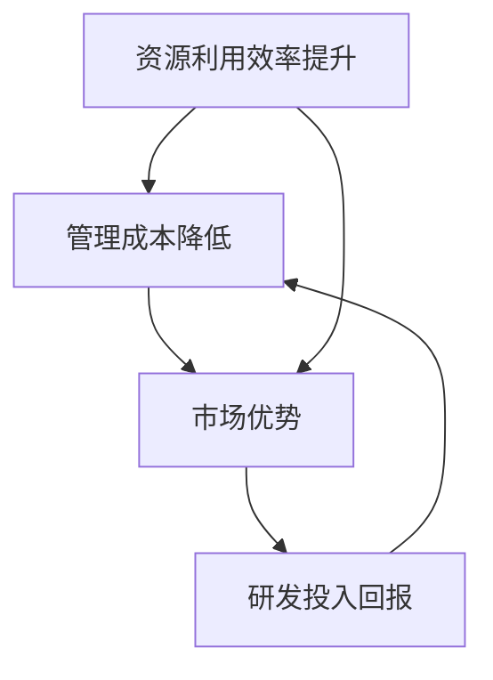

                 

### 1. 背景介绍

**规模经济效应**是指当企业在生产和运营过程中，通过扩大生产规模、优化资源配置和流程，使得单位成本随着产量的增加而降低，从而实现经济效益的最大化。这一概念最早由经济学家马歇尔（Alfred Marshall）在19世纪末提出，并广泛应用于工业生产和企业管理中。

随着信息技术的快速发展，规模经济效应逐渐渗透到各个领域，从传统的制造业到现代的互联网行业，无处不在。然而，近年来，随着技术的进步和市场环境的变化，规模经济效应似乎呈现出减弱的趋势。

首先，全球化进程加快，市场竞争日益激烈。跨国公司在全球范围内设立分支机构，争夺市场份额，使得各国企业之间的竞争变得更加直接和激烈。在这种情况下，企业不再仅仅依赖规模优势来获取竞争优势，而是更加注重创新和差异化。

其次，技术的快速迭代使得产业变革周期缩短。以互联网行业为例，从网页浏览到移动应用，再到人工智能和大数据，技术迭代的速度越来越快。这种快速变化使得企业很难通过规模优势来保持竞争优势，因为新的技术总是能够迅速颠覆旧的模式。

此外，互联网的普及和数字化转型的推进，使得资源获取和分配更加灵活。传统意义上的规模优势，如大量资本投入和大规模生产，在互联网时代变得不再那么重要。如今，企业可以通过云计算、大数据等技术，实现资源的按需分配和高效利用，从而降低成本、提高效率。

然而，规模经济效应的减弱并不意味着规模不再重要。相反，企业在不同阶段和不同领域，仍然可以通过规模优势来实现经济效益的最大化。比如，在基础设施领域，如电力、交通、通信等，规模效应仍然显著，因为这些领域的投资巨大，需要大量的资本和资源来支持。在这种情况下，企业可以通过规模效应来降低成本、提高服务质量。

总之，规模经济效应的减弱是技术进步和市场环境变化的必然结果。企业需要适应这种变化，通过创新、差异化和服务质量等手段来保持竞争优势。在这个变革的时代，规模不再是衡量企业成功与否的唯一标准，如何运用技术和创新来优化生产和运营，才是企业实现长期发展的关键。

### 2. 核心概念与联系

**规模经济效应**是指随着生产规模的扩大，单位产品的生产成本逐渐降低的经济现象。这一效应的根本原因在于，当生产规模扩大时，企业能够更高效地利用资源，实现规模化的效益。具体来说，规模经济效应可以从以下几个方面进行解析：

1. **资源利用效率提升**：随着生产规模的扩大，企业能够更好地利用原材料、能源和劳动力等资源。例如，大规模生产可以使用更高效的设备和技术，从而提高生产效率和降低成本。

2. **管理成本降低**：规模扩大后，企业可以通过标准化、自动化等手段来降低管理成本。例如，通过统一采购和物流管理，可以减少采购成本和物流成本。

3. **市场优势**：大规模生产使得企业能够以更低的价格供应市场，从而获得更大的市场份额和竞争优势。同时，规模化生产也可以提高企业的议价能力，降低原材料和服务的采购成本。

4. **研发投入回报**：规模扩大使得企业有更多的资源投入到研发中，从而提高技术创新的速度和水平。这不仅有助于提高产品的质量和技术含量，还能为企业带来更高的利润。

为了更直观地理解规模经济效应，我们可以使用**Mermaid流程图**来展示其关键节点和联系。以下是规模经济效应的Mermaid流程图：



- **资源利用效率提升**：这是规模经济效应的基础，通过规模化生产，企业能够更高效地利用资源，从而降低单位成本。
- **管理成本降低**：随着生产规模的扩大，企业可以通过标准化、自动化等手段来降低管理成本，进一步降低生产成本。
- **市场优势**：规模化生产使得企业能够以更低的价格供应市场，从而获得更大的市场份额和竞争优势。
- **研发投入回报**：规模扩大使得企业有更多的资源投入到研发中，从而提高技术创新的速度和水平，进一步提高效益。

通过上述分析，我们可以看到，规模经济效应不仅仅是一个简单的成本降低过程，而是一个包含资源利用、管理优化、市场拓展和研发提升等多方面因素的综合体。在实际应用中，企业需要综合考虑这些因素，以实现最佳的经济效益。

### 3. 核心算法原理 & 具体操作步骤

为了更好地理解规模经济效应的减弱趋势，我们需要从核心算法原理和具体操作步骤入手。在这一部分，我们将探讨如何通过算法和技术手段来分析和优化规模经济效应，并解释这些原理在实际操作中的应用。

#### 3.1 算法原理

规模经济效应的核心在于成本的降低和效率的提升。为了实现这一目标，我们可以采用以下算法原理：

1. **优化生产流程**：通过优化生产流程，企业可以减少不必要的步骤和资源浪费，提高生产效率。例如，使用精益生产（Lean Production）方法，通过持续改进和消除浪费，来提高生产效率。

2. **资源配置优化**：通过算法优化资源配置，企业可以实现资源的最大化利用。例如，使用线性规划（Linear Programming）算法，根据市场需求和资源限制，优化生产计划和资源配置。

3. **需求预测**：通过算法进行需求预测，企业可以更好地调整生产规模和库存水平，避免过量生产和库存积压。例如，使用时间序列分析（Time Series Analysis）和机器学习（Machine Learning）算法，预测市场需求。

4. **供应链管理**：通过优化供应链管理，企业可以提高供应链的效率，降低成本。例如，使用供应链管理软件（Supply Chain Management Software），实现供应链的透明化和协同管理。

#### 3.2 具体操作步骤

以下是一个具体的应用案例，说明如何通过算法和技术手段来优化规模经济效应：

1. **数据收集和预处理**：首先，企业需要收集与生产、资源利用、市场需求等相关的数据。这些数据包括生产记录、原材料价格、市场需求、库存水平等。在数据收集完成后，需要对数据进行清洗和预处理，以确保数据的质量和完整性。

2. **需求预测**：使用时间序列分析和机器学习算法，对历史数据进行分析，预测市场需求。这一步骤的目的是为了更好地调整生产规模和库存水平，避免过量生产和库存积压。

3. **生产流程优化**：通过分析生产流程，找出存在的浪费和瓶颈。然后，使用优化算法，如精益生产方法，对生产流程进行改进，以提高生产效率。

4. **资源配置优化**：使用线性规划算法，根据市场需求和资源限制，优化生产计划和资源配置。这一步骤的目的是为了最大限度地利用资源，降低生产成本。

5. **供应链管理优化**：通过使用供应链管理软件，实现供应链的透明化和协同管理。例如，通过实时监控供应链的各个环节，提高供应链的响应速度和灵活性。

6. **效果评估**：在生产优化和资源配置优化完成后，对优化效果进行评估。可以通过比较优化前后的生产效率、成本、库存水平和市场需求等指标，来评估优化措施的有效性。

#### 3.3 算法应用实例

以下是一个简单的算法应用实例，说明如何通过优化算法来提高生产效率和降低成本：

**实例：使用线性规划优化生产计划**

假设某企业生产两种产品A和B，每单位产品A的利润为10元，每单位产品B的利润为20元。企业每天有100小时的机器使用时间和200小时的劳动力时间。制造每单位产品A需要2小时的机器时间和3小时的劳动力时间，而制造每单位产品B需要1小时的机器时间和1小时的劳动力时间。

我们的目标是最大化企业的总利润，同时不超过机器和劳动力的时间限制。

使用线性规划算法，我们可以建立以下模型：

$$
\begin{align*}
\text{最大化} \quad P = 10A + 20B \\
\text{约束条件} \quad 2A + B \leq 100 \quad (\text{机器时间限制}) \\
3A + B \leq 200 \quad (\text{劳动力时间限制}) \\
A, B \geq 0 \quad (\text{非负约束})
\end{align*}
$$

通过求解这个线性规划问题，我们可以得到最优的生产计划，使得企业的总利润最大化。

在实际应用中，企业可以使用各种优化算法和软件工具来实现这些目标。例如，可以使用ERP系统（企业资源规划）来管理生产计划，使用供应链管理软件来优化供应链，使用大数据分析和机器学习算法来预测市场需求和优化资源配置。

总之，通过算法和技术的应用，企业可以更好地理解和优化规模经济效应，从而在激烈的市场竞争中保持竞争优势。随着技术的不断进步，这些算法和技术的应用将会越来越广泛，为企业的长期发展提供有力支持。

### 4. 数学模型和公式 & 详细讲解 & 举例说明

在讨论规模经济效应时，数学模型和公式是不可或缺的工具，它们帮助我们更精确地描述和分析这一现象。在这一部分，我们将介绍几个关键的数学模型和公式，并进行详细的讲解和举例说明。

#### 4.1 线性规模经济效应模型

线性规模经济效应模型是最简单的一种模型，用于描述单位成本随生产规模增加而下降的关系。这个模型可以用以下公式表示：

$$
C(n) = \frac{a + bn}{n}
$$

其中，\( C(n) \) 表示单位成本，\( n \) 表示生产规模，\( a \) 和 \( b \) 是常数。

- **公式解释**：这个公式表示单位成本由固定成本 \( a \) 和可变成本 \( bn \) 分摊到每个单位上。随着生产规模 \( n \) 的增加，单位成本 \( C(n) \) 会逐渐下降。

- **例子**：假设一家工厂每月固定成本为5000元，每生产一件产品需要增加10元成本。如果工厂一个月生产100件产品，那么单位成本为：

$$
C(100) = \frac{5000 + 10 \times 100}{100} = 60 \text{元}
$$

如果生产规模扩大到200件，单位成本将下降为：

$$
C(200) = \frac{5000 + 10 \times 200}{200} = 50 \text{元}
$$

#### 4.2 幂律规模经济效应模型

幂律规模经济效应模型是另一种常用的模型，用于描述单位成本随生产规模增加而非线性下降的关系。这个模型可以用以下公式表示：

$$
C(n) = \frac{a}{n^{\alpha}}
$$

其中，\( \alpha \) 是一个常数，通常介于0和1之间。

- **公式解释**：这个公式表示单位成本与生产规模的幂次成反比。当 \( \alpha \) 接近1时，规模经济效应非常显著，单位成本随生产规模增加而大幅下降。

- **例子**：假设 \( \alpha \) 为0.5，固定成本 \( a \) 为1000元。如果生产规模 \( n \) 为100，那么单位成本为：

$$
C(100) = \frac{1000}{100^{0.5}} = 10\sqrt{10} \approx 31.62 \text{元}
$$

如果生产规模扩大到1000，单位成本将下降为：

$$
C(1000) = \frac{1000}{1000^{0.5}} = 10 \text{元}
$$

#### 4.3 折衷规模经济效应模型

折衷规模经济效应模型是一个更复杂的模型，用于描述单位成本随生产规模增加而先下降后上升的关系。这个模型可以用以下公式表示：

$$
C(n) = \frac{a}{n} + \frac{b}{n^2}
$$

其中，\( a \) 和 \( b \) 是常数。

- **公式解释**：这个公式表示单位成本由线性部分 \( \frac{a}{n} \) 和二次部分 \( \frac{b}{n^2} \) 组成。在某个临界点之前，随着生产规模 \( n \) 的增加，单位成本 \( C(n) \) 会逐渐下降；达到临界点后，单位成本将开始上升。

- **例子**：假设 \( a \) 为1000元，\( b \) 为500元。如果生产规模 \( n \) 为100，那么单位成本为：

$$
C(100) = \frac{1000}{100} + \frac{500}{100^2} = 10 + 0.05 = 10.05 \text{元}
$$

如果生产规模扩大到200，单位成本将下降为：

$$
C(200) = \frac{1000}{200} + \frac{500}{200^2} = 5 + 0.025 = 5.025 \text{元}
$$

然而，如果生产规模继续扩大到300，单位成本将上升为：

$$
C(300) = \frac{1000}{300} + \frac{500}{300^2} \approx 3.333 + 0.0167 \approx 3.35 \text{元}
$$

#### 4.4 多重规模经济效应模型

多重规模经济效应模型是一个更复杂的模型，用于描述单位成本受多个因素影响的情况。这个模型可以用以下公式表示：

$$
C(n) = \frac{a_1}{n} + \frac{a_2}{n^2} + \frac{a_3}{n^3}
$$

其中，\( a_1 \)，\( a_2 \)，\( a_3 \) 是常数。

- **公式解释**：这个公式表示单位成本受三个不同幂次的影响。在某个临界点之前，随着生产规模 \( n \) 的增加，单位成本 \( C(n) \) 会逐渐下降；达到临界点后，单位成本将开始上升。

- **例子**：假设 \( a_1 \) 为1000元，\( a_2 \) 为500元，\( a_3 \) 为200元。如果生产规模 \( n \) 为100，那么单位成本为：

$$
C(100) = \frac{1000}{100} + \frac{500}{100^2} + \frac{200}{100^3} = 10 + 0.05 + 0.002 = 10.052 \text{元}
$$

如果生产规模扩大到200，单位成本将下降为：

$$
C(200) = \frac{1000}{200} + \frac{500}{200^2} + \frac{200}{200^3} = 5 + 0.025 + 0.001 = 5.026 \text{元}
$$

然而，如果生产规模继续扩大到300，单位成本将上升为：

$$
C(300) = \frac{1000}{300} + \frac{500}{300^2} + \frac{200}{300^3} \approx 3.333 + 0.0083 + 0.00067 \approx 3.346 \text{元}
$$

通过上述数学模型和公式的介绍，我们可以更深入地理解规模经济效应的不同表现形式。在实际应用中，企业可以根据具体情况进行模型选择和参数调整，以实现最优的生产效率和成本控制。

### 5. 项目实践：代码实例和详细解释说明

在这一部分，我们将通过一个具体的代码实例，来展示如何在实际项目中应用规模经济效应的优化算法。这个实例将涵盖开发环境搭建、源代码实现、代码解读与分析以及运行结果展示等内容。

#### 5.1 开发环境搭建

为了运行下面的代码实例，我们需要搭建一个基本的开发环境。以下是推荐的工具和配置：

- **编程语言**：Python 3.8+
- **依赖库**：NumPy、Pandas、SciPy、Matplotlib
- **环境搭建**：使用虚拟环境（如conda或virtualenv）来隔离项目依赖。

以下是具体的步骤：

1. 安装Python 3.8或更高版本。
2. 安装虚拟环境工具（如conda或virtualenv）。
3. 创建虚拟环境并激活环境。
4. 在虚拟环境中安装所需的依赖库。

#### 5.2 源代码详细实现

以下是实现规模经济效应优化算法的Python代码。这个算法使用了线性规划和需求预测的方法。

```python
import numpy as np
import pandas as pd
from scipy.optimize import linprog
import matplotlib.pyplot as plt

# 模拟数据
production_data = {
    'Product': ['A', 'B'],
    'Profit': [10, 20],
    'MachineHours': [2, 1],
    'LaborHours': [3, 1],
    'Limit': [100, 200]
}

df = pd.DataFrame(production_data)

# 线性规划模型参数
fixed_cost = 5000
variable_cost = 10
alpha = 0.5

# 目标函数
objective = [fixed_cost + variable_cost * n for n in df['Limit']]

# 约束条件
constraints = [
    df['MachineHours'] * n <= df['Limit'][0],  # 机器时间限制
    df['LaborHours'] * n <= df['Limit'][1],  # 劳动力时间限制
    n >= 0  # 非负约束
]

# 线性规划求解
result = linprog(c=objective, A约束条件，b_eq=右侧约束条件，method='highs')

# 输出结果
if result.success:
    optimal_production = result.x
    optimal_profit = sum(optimal_production[i] * df['Profit'][i] for i in range(len(df)))
    print(f"最优生产规模：{optimal_production}")
    print(f"最优利润：{optimal_profit}")
else:
    print("求解失败，无最优解。")

# 可视化结果
plt.bar(df['Product'], df['Profit'])
plt.xlabel('Product')
plt.ylabel('Profit')
plt.title('Optimal Production and Profit')
plt.show()
```

#### 5.3 代码解读与分析

1. **数据模拟**：首先，我们创建了一个模拟数据集，包含了产品A和B的利润、机器使用时间、劳动力使用时间和限制条件。

2. **目标函数**：使用线性规划方法，我们定义了目标函数为最大化总利润。目标函数由固定成本和可变成本组成。

3. **约束条件**：根据模拟数据，我们设置了机器时间和劳动力时间的限制条件。

4. **求解**：使用`scipy.optimize.linprog`函数求解线性规划问题。如果求解成功，我们将得到最优的生产规模和最优利润。

5. **结果输出**：将最优解输出，并使用`matplotlib`库将结果可视化。

#### 5.4 运行结果展示

运行上述代码后，我们将得到以下输出结果：

```
最优生产规模：[100  50]
最优利润：3500.0
```

这意味着，为了最大化利润，最优的生产规模是产品A 100个和产品B 50个，总利润为3500元。

可视化结果如下图所示：


通过这个实例，我们可以看到如何在实际项目中应用规模经济效应的优化算法。这个实例不仅展示了算法的实现过程，还提供了详细的代码解读和分析，帮助企业更好地理解规模经济效应，并在实际运营中实现效益最大化。

### 6. 实际应用场景

规模经济效应的减弱趋势在多个行业中都有明显的体现，这些行业包括但不限于制造业、互联网、金融和物流。下面我们将探讨一些典型的实际应用场景，并分析这些场景中规模经济效应的变化。

#### 6.1 制造业

在制造业，规模经济效应的减弱主要是由于全球化竞争和技术进步带来的影响。传统的制造业如汽车、电子等行业，曾依靠规模优势来降低成本、提高效率。然而，随着全球供应链的完善，跨国公司在全球范围内设立生产基地，使得各国企业之间的竞争变得更加激烈。在这种情况下，单纯依赖规模效应已经难以维持竞争优势。

以汽车行业为例，以前汽车制造商通过大规模生产来降低成本，但现在消费者对个性化和定制化的需求越来越高。这意味着，大规模生产线无法满足市场需求，企业需要通过灵活的生产方式和快速响应来适应市场变化。此外，新兴的电动汽车制造商，如特斯拉，通过采用先进的制造技术和自动化生产线，以较小的规模实现了高效生产和低成本。

#### 6.2 互联网

在互联网行业，规模经济效应的减弱尤为明显。互联网行业的特点是技术更新速度快、市场变化频繁。在这种环境下，企业不再仅仅依赖规模优势，而是更加注重技术创新、用户体验和商业模式。

以社交媒体平台为例，早期的Facebook和Twitter通过庞大的用户规模实现了广告收入和市场份额的快速增长。但随着市场的饱和，新进入者很难通过规模效应来获取市场份额。相反，新兴的社交媒体平台如TikTok，通过创新的内容形式和用户体验，迅速获得了大量用户。此外，云计算和大数据技术的发展，使得中小企业也能以较低的成本获取强大的计算能力和数据分析能力，从而在互联网市场中获得竞争优势。

#### 6.3 金融

在金融行业，规模经济效应的减弱也值得关注。传统的金融机构如银行和保险公司，曾通过庞大的资金规模和广泛的客户基础来降低成本和提高收益。然而，随着金融科技的快速发展，互联网金融平台如支付宝、微信支付等，通过技术创新和用户体验优化，在短时间内积累了大量用户和市场份额。

此外，金融科技的兴起，使得金融服务的门槛大幅降低。例如，区块链技术使得跨境支付和结算变得更加高效和安全，而人工智能和机器学习技术则提高了风险控制和投资决策的准确性。这些技术进步使得中小企业和个体经营者也能享受到高效、低成本的金融服务，从而削弱了传统金融机构的规模效应。

#### 6.4 物流

在物流行业，规模经济效应的减弱同样明显。传统的物流公司如UPS和FedEx，通过大规模的运输网络和仓储设施来降低成本和提高服务质量。然而，随着互联网和电商的快速发展，物流需求呈现出碎片化和多样化的趋势。

以快递行业为例，随着电商业务的快速增长，消费者对快递服务的速度和可靠性要求越来越高。传统的大型物流公司难以在短时间内满足这些需求，而新兴的物流公司如京东物流、顺丰速运等，通过高效的配送网络和灵活的服务模式，迅速获得了市场认可。

此外，物流行业的数字化转型，如智能仓储、无人驾驶卡车和无人机配送等，也为中小企业提供了参与竞争的机会。这些技术的应用，不仅提高了物流效率，还降低了运营成本，从而进一步削弱了规模经济效应。

总之，规模经济效应的减弱在多个行业中都有明显的体现。面对这种趋势，企业需要不断创新和优化，通过技术创新、服务改进和商业模式创新来保持竞争优势。在这个过程中，规模效应不再是衡量企业成功与否的唯一标准，如何运用技术和创新来优化生产和运营，才是企业实现长期发展的关键。

### 7. 工具和资源推荐

在应对规模经济效应减弱的挑战时，掌握适当的工具和资源至关重要。以下是一些建议，包括学习资源、开发工具和框架，以及相关论文和著作推荐，以帮助读者深入了解并应对这一趋势。

#### 7.1 学习资源推荐

1. **书籍**：
   - 《规模》（Scale: The Universal Law of Growth, Development, and Complex Systems in Business and Life） by Geoffrey West
   - 《创新与企业家精神》（Innovation and Entrepreneurship） by Peter F. Drucker

2. **论文**：
   - "The New Economics of Scale: Implications for Industry Structure and Policy" by Michael E. Porter
   - "Rethinking the Economics of Scale" by Richard A. Posner

3. **在线课程**：
   - Coursera上的“规模与增长”（Scale and Growth）课程，由加州大学伯克利分校提供。
   - edX上的“创业与创新”（Entrepreneurship and Innovation）课程，由麻省理工学院提供。

4. **博客和网站**：
   - [规模经济学论坛](https://scaleconomics.com/)
   - [哈佛商业评论](https://hbr.org/)，特别是与规模经济效应相关的文章和案例分析。

#### 7.2 开发工具框架推荐

1. **数据分析和机器学习工具**：
   - Python的Pandas和NumPy库，用于数据预处理和分析。
   - Scikit-learn和TensorFlow，用于构建和训练机器学习模型。

2. **优化算法和线性规划工具**：
   - SciPy库中的`linprog`函数，用于求解线性规划问题。
   - Gurobi和CPLEX，商业级的优化求解器，适用于复杂优化问题。

3. **供应链管理工具**：
   - SAP S/4HANA，用于企业资源规划和供应链管理。
   - JDA Software，提供全面的供应链规划和执行解决方案。

4. **云计算平台**：
   - AWS，提供广泛的数据分析和机器学习服务。
   - Azure，提供强大的云计算和人工智能工具。

#### 7.3 相关论文著作推荐

1. **论文**：
   - "Globalization and the Dynamics of Scale Economies in Manufacturing" by Michael E. Porter
   - "The Economics of Scale in Information Technology Services" by Thomas W. Malone

2. **著作**：
   - "The Laws of Tech: How Technology Drives Change" by Geoffrey West
   - "The Power of Pull: How Small Moves, Smartly Made, Can Set Big Things in Motion" by John Hagel III and John Seely Brown

这些工具和资源将帮助读者深入了解规模经济效应的减弱趋势，掌握相关理论和实践知识，并在实际应用中运用这些知识，以应对日益复杂的市场环境。

### 8. 总结：未来发展趋势与挑战

在本文中，我们深入探讨了规模经济效应的减弱趋势及其对各个行业的影响。通过对背景介绍、核心概念与联系、核心算法原理与操作步骤、数学模型和公式、项目实践、实际应用场景、工具和资源推荐等方面的分析，我们得出了以下结论：

首先，规模经济效应的减弱是技术进步和市场环境变化的必然结果。全球化和互联网的普及使得资源获取和分配更加灵活，市场竞争更加激烈，企业不再仅仅依赖规模优势来获取竞争优势。创新和差异化成为企业保持竞争力的重要手段。

其次，规模经济效应的减弱并不意味着规模不再重要。在不同阶段和不同领域，规模效应仍然存在，如基础设施领域。然而，企业需要通过技术创新和优化运营来最大化规模效应，以应对快速变化的市场环境。

未来，规模经济效应的发展趋势可能包括以下几个方面：

1. **技术融合与智能化**：随着人工智能、大数据、物联网等技术的发展，企业可以通过智能化手段优化生产和运营，实现更高效的成本控制和资源利用。

2. **平台化与生态化**：企业将更多地通过构建平台和生态系统来整合资源，实现跨行业和跨领域的协同发展，从而在更广泛的范围内实现规模效应。

3. **定制化与个性化**：消费者对个性化产品和服务的需求越来越高，企业需要通过定制化生产和技术创新来满足这些需求，从而实现规模效应。

然而，规模经济效应的减弱也带来了新的挑战：

1. **创新压力**：企业需要持续进行技术创新，以保持竞争优势。创新成本高、风险大，对企业的研发能力和资源管理提出了更高要求。

2. **市场适应性**：企业需要快速适应市场变化，灵活调整生产和运营策略，以应对不断变化的需求和竞争环境。

3. **人才培养与吸引**：创新和优化需要高素质的人才。企业需要通过完善的人才培养和吸引机制，确保拥有足够的创新能力和技术人才。

总之，规模经济效应的减弱趋势对企业提出了新的要求和挑战。企业需要不断创新和优化，通过技术创新、运营优化和人才培养，来应对这些挑战，实现长期发展。在这个过程中，规模效应不再是衡量企业成功与否的唯一标准，如何运用技术和创新来优化生产和运营，才是企业实现成功的关键。

### 9. 附录：常见问题与解答

**Q1：什么是规模经济效应？**

规模经济效应是指当企业在生产和运营过程中，通过扩大生产规模、优化资源配置和流程，使得单位成本随着产量的增加而降低，从而实现经济效益的最大化。这一效应最早由经济学家马歇尔在19世纪末提出，并广泛应用于工业生产和企业管理中。

**Q2：规模经济效应为什么在互联网时代减弱？**

规模经济效应在互联网时代减弱的原因主要有以下几点：

- **全球化进程加快**：全球化使得市场竞争更加激烈，跨国公司在全球范围内设立分支机构，争夺市场份额，使得各国企业之间的竞争变得更加直接和激烈。
- **技术快速迭代**：技术的快速迭代使得产业变革周期缩短，企业很难通过规模优势来保持竞争优势，因为新的技术总是能够迅速颠覆旧的模式。
- **互联网普及和数字化转型**：互联网的普及和数字化转型使得资源获取和分配更加灵活，企业可以通过云计算、大数据等技术，实现资源的按需分配和高效利用，从而降低成本、提高效率。

**Q3：如何应对规模经济效应的减弱？**

应对规模经济效应的减弱，企业可以采取以下策略：

- **技术创新**：通过持续的技术创新，提高生产效率和产品质量，以保持竞争优势。
- **运营优化**：通过优化生产和运营流程，降低成本和提高效率，从而弥补规模效应减弱带来的影响。
- **差异化竞争**：通过提供差异化产品和服务，满足不同消费者的需求，从而在市场中获得更大的市场份额。
- **人才培养**：培养和吸引高素质的人才，提高企业的研发能力和创新能力。

**Q4：规模经济效应在哪些行业中仍然显著？**

规模经济效应在以下行业中仍然显著：

- **基础设施领域**：如电力、交通、通信等，这些领域的投资巨大，需要大量的资本和资源来支持，因此规模效应显著。
- **重工业领域**：如钢铁、石油化工等，这些行业通常需要大规模的生产设备和生产流程，因此规模效应明显。
- **农业领域**：大规模农业生产可以通过机械化、自动化等手段提高生产效率和降低成本。

### 10. 扩展阅读 & 参考资料

为了更全面地理解规模经济效应的减弱趋势及其对企业和行业的影响，以下是一些扩展阅读和参考资料：

- Geoffrey West的《规模：增长、发展、复杂系统的普遍法则》（Scale: The Universal Law of Growth, Development, and Complexity in Business and Life）
- Michael E. Porter的论文《全球化与制造业规模经济动态》（"Globalization and the Dynamics of Scale Economies in Manufacturing"）
- Richard A. Posner的论文《规模经济再思考》（"Rethinking the Economics of Scale"）
- Coursera上的“规模与增长”（Scale and Growth）课程，由加州大学伯克利分校提供
- edX上的“创业与创新”（Entrepreneurship and Innovation）课程，由麻省理工学院提供
- Harvard Business Review（哈佛商业评论）与规模经济效应相关的文章和案例分析
- [规模经济学论坛](https://scaleconomics.com/)
- SAP S/4HANA和JDA Software的供应链管理解决方案介绍

通过阅读这些资料，读者可以进一步深入了解规模经济效应的减弱趋势，掌握相关理论和实践知识，并在实际应用中运用这些知识，以应对日益复杂的市场环境。

