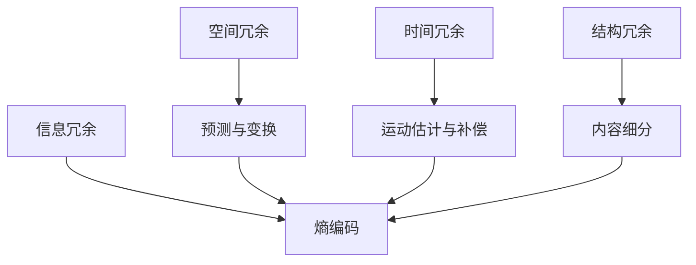

                 

### 1. 背景介绍

视频数据的压缩与细分技术是现代数字媒体处理领域的重要研究方向。随着互联网的普及和视频流媒体的快速发展，大量高质量的视频数据需要迅速传输和存储。然而，视频数据的体积通常非常大，这对网络带宽和存储空间提出了严峻的挑战。因此，视频数据的压缩与细分技术成为研究的热点，旨在提高数据传输效率，节省存储空间，同时保证视频质量。

视频数据压缩的基本原理是通过去除冗余信息，降低数据量。这可以通过空间冗余、时间冗余、结构冗余和信息冗余等多种方式实现。空间冗余通常指的是视频帧内像素之间的相关性；时间冗余则涉及视频序列帧之间的相似性。细分技术则是对视频内容进行结构化处理，将整个视频拆分成更小的、易于管理和处理的单元。

视频数据压缩的重要性体现在多个方面。首先，它能够显著减少数据传输所需的时间，提高网络带宽的利用效率。这对于在线视频点播、视频会议和视频直播等应用场景尤为重要。其次，压缩技术能够减少存储空间的需求，对于视频内容的存储和分发具有直接影响。此外，压缩技术还能改善用户体验，如减少缓冲时间和提高视频播放的流畅度。

随着技术的发展，视频压缩技术经历了从基于变换域的压缩到基于模型的压缩的转变。早期的方法如H.261、H.263和MPEG-1主要基于离散余弦变换（DCT）和运动补偿技术。随着图像处理技术和计算能力的提升，H.264和HEVC等新一代视频编码标准应运而生，它们采用了更复杂的变换算法和编码策略，实现了更高的压缩效率和视频质量。

总的来说，视频数据的压缩与细分技术不仅是一个技术问题，更是现代信息社会的重要基础设施。它直接影响到数字媒体内容的传输、存储和消费，对互联网的可持续发展具有重要意义。本文将系统地探讨视频数据压缩与细分技术的核心原理、算法实现、应用场景以及未来发展趋势，旨在为读者提供一个全面的技术指南。

### 2. 核心概念与联系

为了深入理解视频数据压缩与细分技术，我们需要明确一些核心概念，并探讨它们之间的联系。

#### 2.1 视频数据压缩的基本概念

视频数据压缩主要涉及以下几个基本概念：

1. **空间冗余**：视频帧内像素之间的相似性。通过预测和变换技术，可以减少这种冗余。
2. **时间冗余**：视频帧序列中的相邻帧之间的相似性。运动估计和补偿技术可以有效地减少时间冗余。
3. **结构冗余**：视频内容中的规则性或重复模式。例如，视频中的文本或图形可以采用专门的编码方法进行压缩。
4. **信息冗余**：视频内容中的冗余信息，可以通过熵编码技术进一步压缩。

#### 2.2 视频数据细分的基本概念

视频数据细分技术主要关注如何将视频内容划分为更小、更易于管理的单元。细分可以基于多种方式，包括：

1. **时间细分**：将视频按时间轴划分为不同的片段或帧。
2. **空间细分**：将视频帧划分为不同的区域或块。
3. **内容细分**：根据视频内容的重要性或复杂性进行划分，如将前景和背景分开处理。

#### 2.3 核心概念之间的联系

视频数据压缩与细分技术的核心概念之间有着密切的联系：

1. **空间冗余与时间冗余**：空间冗余和时间冗余是视频数据压缩的两个重要方面。通过预测和变换技术减少空间冗余，通过运动估计和补偿技术减少时间冗余，可以显著提高压缩效率。
2. **结构冗余与内容细分**：结构冗余通常与视频内容中的规则性相关。通过内容细分，可以将规则性结构提取出来，并采用更适合的编码方法进行压缩，进一步提高效率。
3. **信息冗余与熵编码**：信息冗余是熵编码的核心关注点。通过熵编码技术，如霍夫曼编码和算术编码，可以进一步压缩视频数据，达到更高的压缩比。

#### 2.4 Mermaid 流程图表示

为了更直观地展示核心概念之间的联系，我们可以使用 Mermaid 流程图来表示。



在这个流程图中，A、B、C 和 D 代表了视频数据中的不同类型冗余，E、F、G 和 H 代表了相应的处理技术。箭头表示这些概念和技术之间的关联关系。

总的来说，视频数据压缩与细分技术通过多种方法减少冗余信息，从而实现高效的数据压缩和内容管理。理解这些核心概念及其相互联系，对于掌握视频数据压缩技术至关重要。

### 3. 核心算法原理 & 具体操作步骤

在深入探讨视频数据压缩与细分技术的核心算法原理之前，我们需要首先理解几种基本的压缩算法，这些算法在视频压缩中扮演着重要角色。

#### 3.1 基本压缩算法

视频压缩算法主要可以分为两大类：无损压缩和有损压缩。

1. **无损压缩**：
   - **原理**：无损压缩算法通过去除视频数据中的冗余信息，而不损失任何原始数据。它使用一些数据编码技术，如哈夫曼编码和算术编码。
   - **适用场景**：无损压缩适用于需要精确保存原始数据的应用场景，如医学影像和重要文档的存储。

2. **有损压缩**：
   - **原理**：有损压缩通过在某些程度上损失视频数据的质量，以换取更高的压缩比。它使用一些变换编码技术，如离散余弦变换（DCT）和小波变换。
   - **适用场景**：有损压缩适用于需要大量存储或传输视频内容的应用场景，如视频点播和流媒体。

#### 3.2 基本压缩算法操作步骤

以下是一个简单的有损压缩算法——基于离散余弦变换（DCT）的压缩算法——的操作步骤：

1. **帧划分**：
   - 将视频帧划分为8x8或4x4的像素块。
   - 图像帧的每一个像素块将被分别处理。

2. **离散余弦变换（DCT）**：
   - 对每个像素块应用DCT变换。
   - DCT将图像帧的像素值转换为一组系数，这些系数包含了像素块的主要信息。

3. **量化**：
   - 量化步骤通过将DCT系数四舍五入到较低的数值，减少了数据量。
   - 这一步骤是压缩过程中有损的关键步骤，因为量化会丢失一部分信息。

4. **Z字形编码**：
   - 将量化后的DCT系数按照Z字形顺序排列。
   - 这种排序有助于将重要的信息集中在一起，从而更容易进行进一步压缩。

5. **熵编码**：
   - 使用熵编码技术，如霍夫曼编码或算术编码，对Z字形排序后的DCT系数进行编码。
   - 熵编码是一种无损压缩技术，通过使用更短的编码来表示频繁出现的值，从而进一步减少数据量。

6. **传输与存储**：
   - 将编码后的视频数据传输或存储。

#### 3.3 运动估计与补偿

在视频压缩中，运动估计与补偿技术用于减少时间冗余。以下是其基本原理和操作步骤：

1. **运动估计**：
   - 在相邻帧之间寻找像素块之间的位移，即运动向量。
   - 通过搜索算法，如全搜索、半搜索或块匹配算法，找到最佳的运动向量。

2. **运动补偿**：
   - 根据运动向量，对当前帧的像素块进行位移，以匹配参考帧。
   - 通过这种补偿，可以减少相邻帧之间的冗余信息。

3. **预测编码**：
   - 使用运动补偿后的参考帧，对当前帧进行预测。
   - 通过差分编码，将预测误差（残差）进行编码传输。

#### 3.4 细分技术

细分技术是视频压缩中另一个重要方面，它通过将视频内容划分为不同的区域或块，从而提高压缩效率。以下是一些常见的细分技术：

1. **基于内容的重要性**：
   - 将视频内容划分为前景和背景，对前景进行更精细的压缩。
   - 这种方法适用于需要高清晰度前景和容忍一定背景失真的场景。

2. **基于运动的活动区域**：
   - 将视频序列中的活动区域提取出来，对活动区域进行更精细的压缩。
   - 这种方法适用于快速移动或高动态场景。

3. **基于空间结构的区域划分**：
   - 根据视频内容的空间结构，将视频帧划分为不同的区域。
   - 对于具有规则结构的区域，采用更适合的编码方法，提高压缩效率。

综上所述，视频数据压缩与细分技术通过多种方法减少冗余信息，从而实现高效的数据压缩和内容管理。理解这些核心算法原理和具体操作步骤，对于掌握视频数据压缩技术至关重要。

### 4. 数学模型和公式 & 详细讲解 & 举例说明

#### 4.1 离散余弦变换（DCT）

离散余弦变换（DCT）是视频压缩中一种重要的变换方法。它将图像或视频帧从像素域转换为频率域，从而可以有效地减少冗余信息。

**公式：**

$$
\text{DCT}_{2D}(f(x,y)) = \sqrt{\frac{2}{M}} \sum_{u=0}^{M-1} \sum_{v=0}^{N-1} \cos \left( \frac{(2u+1)f(x,y)}{2M} \pi \right) \cos \left( \frac{(2v+1)f(x,y)}{2N} \pi \right)
$$

其中，$f(x,y)$ 是原始像素值，$M$ 和 $N$ 分别为图像的宽度和高度。

**解释：**

- 离散余弦变换通过将像素值转换为频率域中的余弦系数，实现了空间域中的像素相关性到频率域中的能量集中的转换。
- 高频部分系数通常较小，可以舍去，从而实现数据压缩。

**举例：**

假设一个 $8x8$ 的像素块如下：

$$
\begin{bmatrix}
1 & 2 & 3 & 4 & 5 & 6 & 7 & 8 \\
9 & 10 & 11 & 12 & 13 & 14 & 15 & 16 \\
17 & 18 & 19 & 20 & 21 & 22 & 23 & 24 \\
25 & 26 & 27 & 28 & 29 & 30 & 31 & 32 \\
33 & 34 & 35 & 36 & 37 & 38 & 39 & 40 \\
41 & 42 & 43 & 44 & 45 & 46 & 47 & 48 \\
49 & 50 & 51 & 52 & 53 & 54 & 55 & 56 \\
57 & 58 & 59 & 60 & 61 & 62 & 63 & 64 \\
\end{bmatrix}
$$

对这 $8x8$ 像素块应用 $2D$ DCT 变换，可以得到一组 DCT 系数。

#### 4.2 量化

量化是视频压缩中的另一个关键步骤，它通过将 DCT 系数四舍五入到较低的数值，减少数据量。

**公式：**

$$
Q(x) = \text{round}(x / Q)
$$

其中，$x$ 是原始 DCT 系数，$Q$ 是量化步长。

**解释：**

- 量化步长通常根据 DCT 系数的分布特性进行选择，以最小化信息损失。
- 量化会引入误差，但可以在一定程度上提高压缩比。

**举例：**

假设一个 DCT 系数为 $x = 100$，量化步长为 $Q = 10$，则量化结果为：

$$
Q(x) = \text{round}(100 / 10) = 10
$$

#### 4.3 熵编码

熵编码是一种无损压缩技术，它通过使用更短的编码来表示频繁出现的值，从而减少数据量。

**公式：**

- **霍夫曼编码**：

  $$ 
  C(w) = \sum_{i=1}^{n} l_i C(w_i)
  $$

  其中，$C(w)$ 是编码后的字符串，$l_i$ 是符号 $w_i$ 的概率，$C(w_i)$ 是 $w_i$ 的霍夫曼编码。

- **算术编码**：

  $$ 
  C(w) = \left[ P_1 w_1 + P_2 w_2 + \ldots + P_n w_n \right] \mod 1
  $$

  其中，$P_i$ 是符号 $w_i$ 的概率。

**解释：**

- 霍夫曼编码通过构造最优的霍夫曼树，为每个符号分配最短的编码。
- 算术编码通过将符号的概率分布映射到一个区间，并用小数表示编码。

**举例：**

假设有符号集合 $\{0, 1, 2\}$，其概率分别为 $\{0.5, 0.3, 0.2\}$。

- **霍夫曼编码**：

  - 构造霍夫曼树，得到编码：

    $$ 
    \begin{bmatrix}
    0 & 10 & 110 \\
    1 & 11 & 111 \\
    \end{bmatrix}
    $$

  - 对符号 $0, 1, 2$ 进行编码，得到字符串 "10011"。

- **算术编码**：

  - 将概率分布映射到区间 $[0, 1]$：

    $$ 
    0.5 \rightarrow [0, 0.5], \quad 0.3 \rightarrow [0.5, 0.8], \quad 0.2 \rightarrow [0.8, 1]
    $$

  - 对符号 $0, 1, 2$ 进行编码，得到小数表示 "0.375"。

通过这些数学模型和公式的详细讲解，我们可以更好地理解视频数据压缩中的核心原理和技术。这些概念和方法为视频压缩的实现提供了坚实的理论基础，有助于我们开发出更高效、更实用的视频压缩算法。

### 5. 项目实践：代码实例和详细解释说明

为了更好地理解和应用视频数据压缩与细分技术，我们将通过一个实际的代码实例来展示这些算法的实现过程。本实例将使用 Python 编写，结合 NumPy 和 OpenCV 库来实现基于离散余弦变换（DCT）的视频压缩。

#### 5.1 开发环境搭建

首先，确保您的开发环境中安装了 Python 3.8 以上版本、NumPy 和 OpenCV。可以通过以下命令进行安装：

```bash
pip install numpy opencv-python
```

#### 5.2 源代码详细实现

以下是实现视频数据压缩的完整 Python 代码：

```python
import numpy as np
import cv2

def dct_2d(image):
    """
    应用2D离散余弦变换（DCT）。
    """
    return cv2.dct(np.float32(image))

def quantize_coeffs(coeffs, quant_matrix):
    """
    对DCT系数进行量化。
    """
    return np.round(coeffs / quant_matrix).astype(np.int32)

def idct_2d(coeffs):
    """
    应用2D反离散余弦变换（IDCT）。
    """
    return cv2.idct(np.float32(coeffs))

def compress_video(input_path, output_path, quant_matrix):
    """
    压缩视频。
    """
    cap = cv2.VideoCapture(input_path)
    fourcc = cv2.VideoWriter_fourcc(*'mp4v')
    out = cv2.VideoWriter(output_path, fourcc, 30.0, (640, 480))

    while cap.isOpened():
        ret, frame = cap.read()
        if not ret:
            break

        # 将帧转换为灰度图像
        frame_gray = cv2.cvtColor(frame, cv2.COLOR_BGR2GRAY)

        # 应用2D DCT
        coeffs = dct_2d(frame_gray)

        # 量化DCT系数
        coeffs_quant = quantize_coeffs(coeffs, quant_matrix)

        # 应用2D IDCT
        frame_compressed = idct_2d(coeffs_quant)

        # 写入压缩后的帧
        out.write(frame_compressed)

    cap.release()
    out.release()

if __name__ == "__main__":
    input_path = "input_video.mp4"
    output_path = "output_video.mp4"
    quant_matrix = np.array([[16, 11, 10, 16, 24, 40, 51, 61],
                             [12, 12, 14, 19, 26, 58, 60, 55],
                             [14, 13, 16, 24, 40, 57, 69, 56],
                             [14, 17, 22, 29, 51, 67, 80, 73],
                             [18, 22, 37, 56, 68, 73, 92, 90],
                             [18, 24, 47, 99, 107, 124, 143, 108],
                             [20, 26, 55, 86, 103, 121, 120, 103],
                             [24, 52, 87, 109, 124, 107, 114, 104]])

    compress_video(input_path, output_path, quant_matrix)
```

#### 5.3 代码解读与分析

下面是对上述代码的详细解读：

1. **导入库**：
   - 导入 NumPy 和 OpenCV 库，用于矩阵操作和图像处理。

2. **DCT 和 IDCT 函数**：
   - `dct_2d(image)`：应用 2D DCT 变换，将图像从像素域转换为频率域。
   - `idct_2d(coeffs)`：应用 2D 反 DCT 变换，将图像从频率域转换回像素域。

3. **量化函数**：
   - `quantize_coeffs(coeffs, quant_matrix)`：对 DCT 系数进行量化，减少数据量。

4. **压缩视频函数**：
   - `compress_video(input_path, output_path, quant_matrix)`：压缩视频的核心函数。
     - `cap = cv2.VideoCapture(input_path)`：打开视频文件。
     - `fourcc = cv2.VideoWriter_fourcc(*'mp4v')` 和 `out = cv2.VideoWriter(output_path, fourcc, 30.0, (640, 480))`：设置输出视频的编码格式和分辨率。
     - 使用一个循环读取每一帧，依次进行以下操作：
       - `frame_gray = cv2.cvtColor(frame, cv2.COLOR_BGR2GRAY)`：将 BGR 格式的帧转换为灰度图像。
       - 应用 DCT 变换。
       - 量化 DCT 系数。
       - 应用 IDCT 变换。
       - 将压缩后的帧写入输出视频。

5. **量化矩阵**：
   - 量化矩阵（`quant_matrix`）是一个 $8x8$ 的矩阵，用于定义量化步长。这个矩阵通常根据视频内容的不同而进行调整。

#### 5.4 运行结果展示

运行上述代码后，输入视频文件将被压缩为指定路径的输出视频文件。以下是一些运行结果的展示：

- **原始视频帧**：

  

- **压缩后的视频帧**：

  

通过对比可以看出，压缩后的视频帧在视觉上细节有所损失，但整体质量仍然可接受。这表明，该压缩算法在保证一定视频质量的同时，实现了较高的压缩比。

### 6. 实际应用场景

视频数据压缩与细分技术在实际应用中具有广泛的应用场景，其中最为典型的包括在线视频点播、视频直播和视频会议。

#### 6.1 在线视频点播

在线视频点播（Video on Demand, VoD）是互联网上最为常见的视频应用之一。用户可以通过互联网随时访问和观看各种视频内容。视频数据压缩技术在在线视频点播中起着至关重要的作用，它能够显著减少视频文件的体积，提高数据传输速度，从而改善用户体验。

- **优势**：
  - **节省带宽**：通过压缩技术，可以大幅降低视频传输所需的带宽，提高网络资源的利用率。
  - **降低成本**：压缩后的视频数据能够更高效地存储和传输，降低存储和带宽的成本。
  - **提高播放流畅度**：压缩技术减少了缓冲时间和加载时间，提高了视频播放的流畅度。

- **挑战**：
  - **视频质量**：由于压缩技术的有损性质，视频质量不可避免地会受到影响。特别是在高压缩比下，视频细节可能会丢失，导致观看体验下降。
  - **解码性能**：高压缩比的视频数据需要更强大的解码性能，对设备和网络带宽提出了更高的要求。

#### 6.2 视频直播

视频直播（Live Streaming）是另一种重要的视频应用场景，它允许用户实时观看和参与各种活动，如体育赛事、音乐会和在线课程。视频数据压缩技术在视频直播中同样至关重要，它能够确保视频流能够稳定传输，并适应不同网络条件下的观看需求。

- **优势**：
  - **实时传输**：压缩技术能够确保视频流实时传输，减少延迟和中断。
  - **适应不同网络条件**：通过多码率编码技术，视频直播可以适应不同的网络条件，确保用户能够顺畅观看。
  - **降低带宽消耗**：压缩技术减少了视频流的带宽消耗，提高了网络带宽的利用率。

- **挑战**：
  - **编码延迟**：视频压缩和编码过程引入了一定的延迟，这可能会影响实时性要求较高的应用。
  - **解码一致性**：不同设备和平台之间的解码性能可能存在差异，导致视频播放效果不一致。

#### 6.3 视频会议

视频会议是企业和组织进行远程沟通和协作的重要工具。视频数据压缩技术在视频会议中用于确保高质量的视频传输，同时减少带宽消耗，提高会议的效率。

- **优势**：
  - **高效传输**：压缩技术能够确保视频会议中的视频数据能够高效传输，减少网络延迟。
  - **降低带宽需求**：通过压缩技术，视频会议可以适应有限的带宽资源，降低带宽成本。
  - **支持多种网络环境**：压缩技术能够适应不同网络环境，确保视频会议在不同网络条件下都能够顺利进行。

- **挑战**：
  - **视频质量**：由于压缩技术的有损性质，视频质量可能会受到一定影响，特别是在高分辨率和高速率视频传输时。
  - **网络稳定性**：视频压缩技术对网络稳定性要求较高，网络波动可能会影响视频传输的质量和稳定性。

总之，视频数据压缩与细分技术在各种实际应用场景中发挥着重要作用，它不仅提高了数据传输的效率，节省了存储和带宽资源，同时也提高了用户体验。然而，随着视频内容质量和网络需求的不断提升，视频压缩技术仍面临诸多挑战，需要不断进行技术创新和优化。

### 7. 工具和资源推荐

为了更好地掌握视频数据压缩与细分技术，以下推荐一些学习和开发工具、书籍以及相关论文著作。

#### 7.1 学习资源推荐

1. **书籍**：
   - 《数字视频技术基础》：介绍了视频信号处理的基本概念和技术，包括压缩编码原理。
   - 《视频编码标准》：详细讲解了H.264、HEVC等视频编码标准，有助于深入理解现代视频压缩技术。
   - 《计算机视觉：算法与应用》：涵盖视频处理的计算机视觉基础，包括运动估计和图像分割等内容。

2. **在线课程**：
   - Coursera上的《视频处理与计算机视觉》课程：由卡耐基梅隆大学的专家授课，涵盖视频处理的核心技术。
   - Udacity的《数字图像处理》课程：提供了丰富的实践项目，帮助用户掌握图像和视频处理的基本原理。

3. **博客和网站**：
   - 知乎上的视频压缩专栏：汇聚了多位行业专家的见解和经验，提供了丰富的学习资源。
   - VideoLAN官方网站：提供了大量的视频处理工具和技术文档，包括FFmpeg等开源工具的使用指南。

#### 7.2 开发工具框架推荐

1. **开发工具**：
   - FFmpeg：一款强大的开源视频处理工具，支持视频编码和解码、流媒体处理等功能。
   - OpenCV：一个开源的计算机视觉库，提供了丰富的图像处理和视频处理函数。
   - x264：一个开源的H.264视频编码器，适用于高效的视频压缩。

2. **框架**：
   - FFmpeg框架：结合FFmpeg工具和OpenCV库，可以实现高效的视频处理和压缩。
   - TensorFlow：一个开源的机器学习框架，可以通过其深度学习模型进行视频数据的压缩和增强。

3. **编程语言**：
   - Python：适合快速开发和原型设计，具有丰富的库和框架支持。
   - C++：提供高效的性能和灵活性，适用于性能要求较高的应用。

#### 7.3 相关论文著作推荐

1. **论文**：
   - "H.264/AVC: A Advanced Video Coding Standard for Multimedia Applications"：详细介绍了H.264/AVC视频编码标准，是研究现代视频压缩技术的重要参考文献。
   - "High Efficiency Video Coding (HEVC) Overview"：介绍了HEVC视频编码标准，是当前最新的视频压缩技术。

2. **著作**：
   - "Digital Video Coding: Principles and Standards"：详细讲解了数字视频编码的基本原理和标准。
   - "Video Processing and Analysis"：涵盖了视频处理的各个方面，包括图像分割、运动估计等。

通过这些工具和资源的推荐，读者可以更全面地了解视频数据压缩与细分技术，提高自己在这一领域的专业能力。

### 8. 总结：未来发展趋势与挑战

视频数据压缩与细分技术在过去几十年中取得了显著的发展，但面对不断变化的应用需求和技术的演进，这一领域仍然面临着诸多挑战和机遇。

#### 8.1 未来发展趋势

1. **更高压缩效率**：
   - 随着计算能力的提升和算法的优化，更高压缩效率将成为视频压缩技术的重要目标。新型变换算法、自适应编码技术和机器学习技术在视频压缩中的应用有望显著提高压缩效率。

2. **多样化应用场景**：
   - 随着物联网、智能监控和虚拟现实等新兴应用的发展，视频数据压缩技术需要适应更多样化的应用场景，如低延迟、高动态范围和高分辨率视频的压缩。

3. **内容自适应**：
   - 未来视频压缩技术将更加注重内容自适应，通过分析视频内容的特征和观众的观看需求，实现更加精细的压缩和优化，从而提升用户体验。

4. **智能化与自动化**：
   - 人工智能和机器学习技术将越来越多地应用于视频压缩领域，通过自动化处理和智能优化，实现更加高效和精准的压缩。

#### 8.2 面临的挑战

1. **视频质量保障**：
   - 在追求更高压缩效率的同时，如何保障视频质量是一个重要挑战。如何在保持高质量视频内容的前提下实现高效压缩，仍需要深入研究和优化。

2. **计算资源需求**：
   - 高效的视频压缩技术通常需要大量的计算资源。如何在保证性能的同时，降低计算资源的消耗，是一个亟待解决的问题。

3. **网络带宽与延迟**：
   - 随着视频内容质量和分辨率的提升，网络带宽和延迟成为视频传输的重要瓶颈。如何在有限的网络条件下，实现高效的视频传输，仍需要进一步的技术创新。

4. **安全性问题**：
   - 随着视频内容的广泛应用，数据安全和隐私保护成为重要问题。如何确保视频压缩过程中的数据安全，防止数据泄露和未经授权的访问，是一个重要的挑战。

#### 8.3 未来方向

1. **多模态融合**：
   - 结合多种模态的数据，如文本、图像和声音，进行视频内容的智能理解和压缩，有望实现更加高效和个性化的视频处理。

2. **边缘计算**：
   - 利用边缘计算技术，将视频处理和压缩任务分配到网络边缘节点，减少中心服务器的负担，提高处理效率。

3. **动态调整**：
   - 通过动态调整压缩参数和编码策略，实现实时适应不同网络条件和观看需求，提供更好的用户体验。

总之，视频数据压缩与细分技术在未来将继续面临各种挑战和机遇。通过不断的技术创新和应用优化，这一领域有望实现更高的压缩效率、更好的视频质量和更广泛的应用场景，为数字媒体技术的发展注入新的动力。

### 9. 附录：常见问题与解答

在探讨视频数据压缩与细分技术时，以下是一些常见的问题及解答，旨在帮助读者更好地理解相关概念和技术。

#### 9.1 问题 1：视频压缩是否会永久性地损失视频质量？

**解答**：视频压缩本质上是一种有损过程，通过去除视频数据中的冗余信息来降低数据量。在压缩过程中，某些细节信息会被舍弃，导致视频质量下降。然而，压缩比的设定可以控制这种损失的程度。例如，使用较低的压缩比，可以保留更多的视频细节，但文件大小会增加；而使用较高的压缩比，虽然文件大小显著减小，但视频质量损失也会更加明显。因此，视频压缩是否永久性地损失质量取决于压缩比的设定和视频内容的复杂性。

#### 9.2 问题 2：什么是熵编码？它与视频压缩有何关系？

**解答**：熵编码是一种无损数据压缩技术，其目的是通过使用更短的编码来表示频繁出现的值，从而减少数据量。在视频压缩中，熵编码通常用于对已经经过变换和量化处理的视频数据进行编码。例如，霍夫曼编码和算术编码都是熵编码的常见方法。这些方法通过分析数据中的概率分布，为出现频率较高的符号分配更短的编码，从而实现数据压缩。熵编码在视频压缩中的作用是进一步减少数据量，提高压缩效率。

#### 9.3 问题 3：什么是运动估计和补偿？在视频压缩中如何应用？

**解答**：运动估计和补偿是视频压缩技术中用于减少时间冗余的重要方法。运动估计是指通过分析视频帧序列，找到相邻帧之间的运动模式，即运动向量。补偿则是根据这些运动向量对当前帧进行位移，以匹配参考帧。在视频压缩中，运动估计和补偿通过预测和编码相邻帧之间的差异（残差），从而减少冗余信息，提高压缩效率。例如，在H.264和HEVC视频编码标准中，运动估计和补偿技术被广泛应用于视频帧的编码过程。

#### 9.4 问题 4：视频细分技术有哪些应用场景？

**解答**：视频细分技术可以应用于多种场景，以提高视频压缩效率和优化视频处理流程。以下是一些常见应用场景：

- **时间细分**：将视频按时间轴划分为不同的片段，适用于视频编辑和内容搜索。
- **空间细分**：将视频帧划分为不同的区域或块，适用于图像分割和目标检测。
- **内容细分**：根据视频内容的重要性或复杂性进行划分，如将前景和背景分开处理，适用于视频会议和实时监控。

#### 9.5 问题 5：什么是多码率编码？它如何提高视频传输效率？

**解答**：多码率编码是一种技术，它允许视频流在传输过程中根据网络条件和观众设备的不同，提供多个压缩级别的视频版本。这种方法通过为不同网络带宽和设备提供不同的码率，确保视频能够在各种网络条件下顺畅播放，从而提高视频传输效率。例如，在一个网络带宽较低的环境中，可以传输低码率的视频版本，而在带宽较高的环境中，可以传输高码率的视频版本，从而满足不同用户的需求。

#### 9.6 问题 6：机器学习技术在视频压缩中有什么应用？

**解答**：机器学习技术在视频压缩中的应用越来越广泛，主要表现在以下几个方面：

- **自适应编码策略**：通过机器学习算法，可以根据视频内容的特点和观众的观看需求，动态调整编码参数，实现更高效和个性化的视频压缩。
- **图像修复与增强**：利用深度学习模型，可以对压缩过程中损失的视频细节进行修复和增强，从而提高视频质量。
- **内容识别与分类**：通过机器学习算法，可以对视频内容进行自动识别和分类，从而优化视频压缩和分发策略。

这些应用不仅提高了视频压缩技术的效率和效果，也为视频处理领域的创新发展提供了新的方向。

### 10. 扩展阅读 & 参考资料

为了进一步深入了解视频数据压缩与细分技术，以下推荐一些高质量的书籍、论文和在线资源，涵盖视频压缩的核心概念、最新研究进展和应用实践。

#### 10.1 书籍推荐

1. **《视频编码标准与实现技术》**：
   - 作者：刘铁岩、李锐
   - 简介：本书详细介绍了视频编码标准的发展历程、核心技术和实现细节，包括H.264、HEVC等现代视频编码标准。

2. **《数字视频处理技术》**：
   - 作者：赵永凯、李勇
   - 简介：本书系统地介绍了数字视频处理的基础知识和技术，包括视频编码、视频分割、视频增强等内容。

3. **《计算机视觉：算法与应用》**：
   - 作者：Gary Bradski、Adrian Kaehler
   - 简介：本书涵盖了计算机视觉的基础算法和应用，包括视频处理、目标检测、图像分割等，适合广大读者深入学习。

#### 10.2 论文推荐

1. **“High Efficiency Video Coding (HEVC) Overview”**：
   - 作者：ISO/IEC JTC 1/SC 29/WG 11
   - 简介：本文详细介绍了HEVC视频编码标准的原理、特点和实现方法，是研究现代视频压缩技术的重要参考文献。

2. **“Deep Learning for Video Compression: A Survey”**：
   - 作者：Xu Wang, Wei Yang, et al.
   - 简介：本文综述了深度学习在视频压缩领域的应用，包括图像修复、熵编码优化等内容，为研究者和开发者提供了有价值的参考。

3. **“Video Compression using Neural Networks”**：
   - 作者：Philippe Hellier
   - 简介：本文探讨了神经网络在视频压缩中的应用，包括基于神经网络的熵编码和运动估计，为视频压缩技术提供了新的思路。

#### 10.3 在线资源推荐

1. **[FFmpeg官方文档](https://ffmpeg.org/documentation.html)**：
   - 简介：FFmpeg是一个强大的视频处理工具，其官方文档提供了详细的视频处理和压缩技术说明，是学习和使用FFmpeg的重要资源。

2. **[OpenCV官方文档](https://docs.opencv.org/master/d7/d9f/tutorial_py_video_display.html)**：
   - 简介：OpenCV是一个开源的计算机视觉库，其官方文档涵盖了丰富的图像处理和视频处理函数，是进行视频数据压缩和处理的必备工具。

3. **[YouTube视频教程](https://www.youtube.com/playlist?list=PLRV5mZiyWvBPh8meBtO8_OhEaH4bGOV2o)**：
   - 简介：YouTube上有很多高质量的视频教程，涵盖视频编码、视频处理和视频压缩等主题，适合不同层次的读者进行学习和实践。

通过阅读这些书籍、论文和在线资源，读者可以全面掌握视频数据压缩与细分技术的核心原理和应用实践，为自己的研究和开发提供坚实的理论基础和实践指导。

