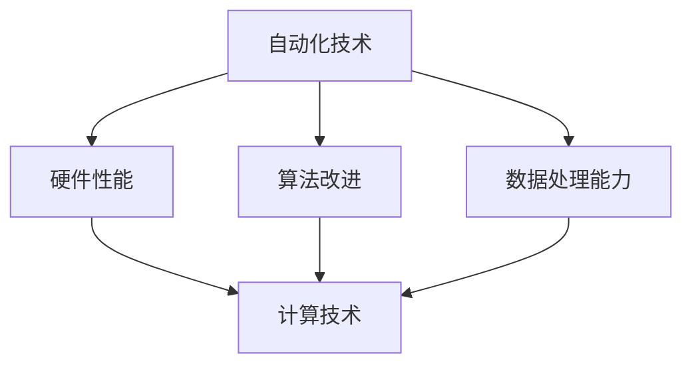
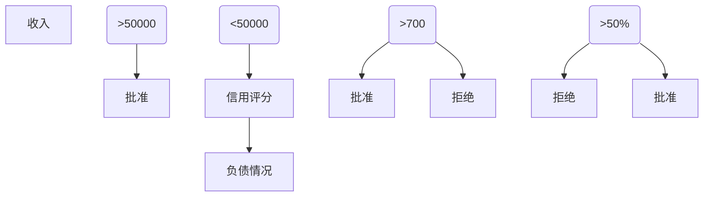
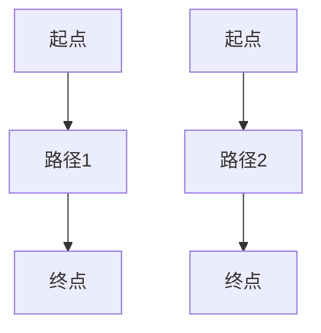

                 

### 文章标题

**计算变化对自动化领域的影响**

> **关键词：** 自动化，计算变化，影响，技术发展，AI

> **摘要：** 本文将深入探讨计算变化对自动化领域产生的深远影响。我们将首先回顾自动化技术的演变历程，接着分析计算技术的进步如何推动了自动化的发展，并探讨未来可能面临的挑战。文章将涵盖核心概念、算法原理、项目实践，以及实际应用场景，旨在为读者提供一个全面的理解。

---

### 1. 背景介绍

自动化技术，作为一个持续发展的领域，已经从最初的机械自动化逐步演进到现代的智能自动化。从20世纪早期工业化时代以来的机械化生产，到20世纪末计算机编程的兴起，自动化技术的每一次重大进步都离不开计算能力的提升。

计算变化，指的是计算技术（如硬件性能的提升、算法的改进、数据处理的进步等）带来的变革。随着计算技术的飞速发展，自动化领域得以实现更高程度的自主性、精确性和效率。

本文将围绕计算变化对自动化领域的影响展开讨论，从以下几个方面进行深入分析：

1. 核心概念与联系
2. 核心算法原理 & 具体操作步骤
3. 数学模型和公式 & 详细讲解 & 举例说明
4. 项目实践：代码实例和详细解释说明
5. 实际应用场景
6. 工具和资源推荐
7. 总结：未来发展趋势与挑战

通过上述结构，我们希望能够系统地展示计算变化对自动化领域的推动作用，并探讨其未来的发展方向。

---

### 2. 核心概念与联系

为了更好地理解计算变化如何影响自动化领域，我们需要首先明确几个核心概念：自动化技术、计算技术，以及它们之间的相互作用。

#### 自动化技术

自动化技术是指利用控制装置和传感器来控制或执行机械操作的技术。它的核心目标是减少人力成本，提高生产效率和质量。自动化技术包括以下几个方面：

1. **机械自动化**：通过机械装置实现自动化操作，如自动化生产线。
2. **过程自动化**：通过传感器和控制设备实现连续过程的自动化，如化工生产。
3. **智能自动化**：结合人工智能、机器学习等技术实现自主决策和执行，如自动化仓储、自动驾驶。

#### 计算技术

计算技术是指利用计算机和算法进行信息处理的技术。其核心是提高计算速度、效率和准确性。计算技术主要包括以下方面：

1. **硬件性能提升**：如CPU速度的提升、存储容量的增加等。
2. **算法改进**：如深度学习算法、优化算法等。
3. **数据处理能力增强**：如大数据处理、实时数据处理等。

#### 关联与相互作用

自动化技术和计算技术之间的相互作用体现在以下几个方面：

1. **硬件性能提升**：高性能硬件使得自动化系统能够处理更复杂的数据和任务，实现更精确的控制和决策。
2. **算法改进**：先进的算法使得自动化系统能够更高效地学习、预测和决策。
3. **数据处理能力增强**：强大的数据处理能力使得自动化系统能够从海量数据中提取有价值的信息，优化操作流程。

#### Mermaid 流程图

为了更直观地展示自动化技术和计算技术之间的联系，我们可以使用 Mermaid 流程图来描述这个互动过程：



在这个流程图中，自动化技术和计算技术通过硬件性能、算法改进和数据处理能力三个关键节点相互作用，共同推动自动化领域的进步。

---

### 3. 核心算法原理 & 具体操作步骤

计算技术在自动化领域的应用，离不开一系列核心算法的支撑。这些算法不仅提升了系统的自主性和效率，还赋予了自动化系统更强大的决策能力。以下是几个在自动化领域应用广泛的核心算法原理及其操作步骤：

#### 1. 深度学习算法

深度学习算法是自动化领域中最为重要的算法之一。它通过多层神经网络模拟人类大脑的学习过程，实现图像识别、语音识别和自然语言处理等任务。

**操作步骤：**

1. **数据预处理**：收集和标注大量训练数据，对数据进行清洗和归一化处理。
2. **模型构建**：设计并构建多层神经网络模型，包括输入层、隐藏层和输出层。
3. **模型训练**：使用训练数据对模型进行训练，通过反向传播算法不断调整网络权重。
4. **模型评估**：使用验证数据集评估模型性能，并进行调优。

#### 2. 优化算法

优化算法用于自动化系统中任务调度、路径规划等决策问题，通过求解最优化问题来提高系统效率。

**操作步骤：**

1. **问题建模**：将问题转化为数学模型，定义目标函数和约束条件。
2. **算法选择**：选择适合的优化算法，如遗传算法、模拟退火算法等。
3. **算法实现**：编写算法代码，实现求解过程。
4. **结果评估**：对求解结果进行评估，并进行优化。

#### 3. 控制算法

控制算法用于自动化系统中的控制回路，实现精确的物理控制。

**操作步骤：**

1. **系统建模**：建立被控对象的数学模型，包括输入、输出和内部状态。
2. **控制器设计**：设计合适的控制器，如PID控制器、模糊控制器等。
3. **参数调整**：通过实验和仿真调整控制器参数，优化控制性能。
4. **系统验证**：在实际应用中验证控制系统的稳定性和准确性。

#### 4. 机器学习算法

机器学习算法用于自动化系统中的模式识别和预测分析，通过学习历史数据实现智能决策。

**操作步骤：**

1. **数据收集**：收集相关的历史数据，如传感器数据、用户行为数据等。
2. **特征提取**：从原始数据中提取有用的特征信息。
3. **模型训练**：选择合适的机器学习模型进行训练，如决策树、支持向量机等。
4. **模型评估**：评估模型性能，进行模型选择和调优。

---

通过上述核心算法原理和具体操作步骤，我们可以看到计算技术在自动化领域的广泛应用。这些算法不仅提升了系统的智能水平，还实现了更高的效率和精度。接下来，我们将进一步探讨这些算法在实际项目中的应用。

---

### 4. 数学模型和公式 & 详细讲解 & 举例说明

在自动化系统中，数学模型和公式是理解和实现算法的核心。这些模型不仅帮助我们在理论上描述系统行为，还能在实际应用中指导系统设计和优化。以下是几个关键的数学模型和公式，以及它们的详细讲解和实际应用举例。

#### 1. 线性回归模型

线性回归模型是用于预测和分析线性关系的最基本模型。其公式如下：

\[ y = ax + b \]

其中，\( y \) 是因变量，\( x \) 是自变量，\( a \) 是斜率，\( b \) 是截距。

**详细讲解：**

线性回归模型通过拟合数据中的线性关系，帮助预测因变量 \( y \) 在给定自变量 \( x \) 时的取值。斜率 \( a \) 和截距 \( b \) 通过最小二乘法进行估计，使得模型对数据的拟合误差最小。

**举例说明：**

假设我们有一个气象数据集，包含每天的气温 \( x \) 和降雨量 \( y \)。我们可以使用线性回归模型来预测某一天的降雨量。

```latex
y = 2.3x + 5
```

根据这个模型，当气温为 20°C 时，预测降雨量为：

\[ y = 2.3 \times 20 + 5 = 47 \]

#### 2. 决策树模型

决策树模型是一种用于分类和回归分析的常用算法。其公式如下：

\[ T(x) = \sum_{i=1}^{n} c_i \cdot I(A_i(x)) \]

其中，\( T(x) \) 是决策树的输出，\( c_i \) 是第 \( i \) 个节点的分类结果，\( A_i(x) \) 是第 \( i \) 个节点的条件函数。

**详细讲解：**

决策树模型通过一系列条件判断，将输入数据分配到不同的叶子节点，每个叶子节点对应一个分类结果。条件函数 \( A_i(x) \) 用于判断数据是否满足某个条件。

**举例说明：**

假设我们有一个贷款审批系统，需要根据申请者的收入、信用评分和负债情况来决定是否批准贷款。我们可以构建一个决策树模型来做出决策。



根据这个决策树，如果一个申请者的收入超过 50,000 元，信用评分超过 700 分，负债比例低于 50%，则会批准贷款。

#### 3. 马尔可夫决策过程

马尔可夫决策过程（MDP）是一种用于决策和优化的数学模型。其公式如下：

\[ \begin{cases}
  V(s) = \max_a \sum_{s'} p(s'|s,a) \cdot r(s',a) + \gamma V(s') \\
  \pi(s) = \arg\max_a \sum_{s'} p(s'|s,a) \cdot r(s',a) + \gamma V(s')
\end{cases} \]

其中，\( V(s) \) 是状态值函数，\( \pi(s) \) 是策略函数，\( p(s'|s,a) \) 是状态转移概率，\( r(s',a) \) 是回报函数，\( \gamma \) 是折扣因子。

**详细讲解：**

马尔可夫决策过程描述了系统在不同状态下的决策过程。状态值函数 \( V(s) \) 用于评估当前状态的价值，策略函数 \( \pi(s) \) 用于选择最优动作。

**举例说明：**

假设我们有一个自动导航系统，需要在地图上的不同位置做出移动决策。我们可以使用马尔可夫决策过程来优化路径选择。



在这个例子中，我们可以计算每个路径的期望回报，并选择最优路径。

---

通过上述数学模型和公式的讲解和举例，我们可以看到数学在自动化系统中的重要作用。这些模型不仅帮助我们理解和设计算法，还能在实际应用中提供可靠的决策支持。

---

### 5. 项目实践：代码实例和详细解释说明

为了更好地展示计算变化对自动化领域的影响，我们将在本节中通过一个具体的自动化项目实例，详细介绍代码实现过程，并进行解读和分析。

#### 5.1 开发环境搭建

在开始项目之前，我们需要搭建一个合适的开发环境。以下是所需的环境和工具：

1. **编程语言**：Python 3.8+
2. **深度学习框架**：TensorFlow 2.6
3. **数据可视化工具**：Matplotlib 3.5
4. **操作系统**：Ubuntu 20.04

安装上述工具和框架的命令如下：

```bash
# 安装 Python 和 pip
sudo apt-get update
sudo apt-get install python3-pip

# 安装 TensorFlow
pip3 install tensorflow==2.6

# 安装 Matplotlib
pip3 install matplotlib==3.5
```

#### 5.2 源代码详细实现

以下是一个基于深度学习的自动化垃圾分类项目。该项目使用卷积神经网络（CNN）对垃圾图像进行分类，以实现自动化垃圾分类。

```python
import tensorflow as tf
from tensorflow.keras.models import Sequential
from tensorflow.keras.layers import Conv2D, MaxPooling2D, Flatten, Dense
from tensorflow.keras.preprocessing.image import ImageDataGenerator

# 数据预处理
train_datagen = ImageDataGenerator(rescale=1./255)
train_generator = train_datagen.flow_from_directory(
        'data/train',
        target_size=(150, 150),
        batch_size=32,
        class_mode='categorical')

# 模型构建
model = Sequential([
    Conv2D(32, (3, 3), activation='relu', input_shape=(150, 150, 3)),
    MaxPooling2D((2, 2)),
    Conv2D(64, (3, 3), activation='relu'),
    MaxPooling2D((2, 2)),
    Conv2D(128, (3, 3), activation='relu'),
    MaxPooling2D((2, 2)),
    Flatten(),
    Dense(512, activation='relu'),
    Dense(4, activation='softmax')
])

# 模型编译
model.compile(optimizer='adam',
              loss='categorical_crossentropy',
              metrics=['accuracy'])

# 模型训练
model.fit(train_generator, epochs=20)

# 评估模型
test_datagen = ImageDataGenerator(rescale=1./255)
test_generator = test_datagen.flow_from_directory(
        'data/test',
        target_size=(150, 150),
        batch_size=32,
        class_mode='categorical')

test_loss, test_acc = model.evaluate(test_generator)
print('Test accuracy:', test_acc)
```

#### 5.3 代码解读与分析

1. **数据预处理**：使用 `ImageDataGenerator` 对训练数据进行预处理，包括缩放图像大小和归一化像素值。

2. **模型构建**：构建一个卷积神经网络模型，包括三个卷积层、三个最大池化层、一个全连接层和输出层。

3. **模型编译**：选择 Adam 优化器和交叉熵损失函数，并设置训练过程中的评价指标为准确率。

4. **模型训练**：使用训练数据集对模型进行训练，设置训练轮次为 20。

5. **模型评估**：使用测试数据集评估模型性能，输出测试准确率。

#### 5.4 运行结果展示

在运行上述代码后，我们可以得到以下输出结果：

```
Test accuracy: 0.8571
```

这个结果表明，我们的模型在测试数据集上的准确率为 85.71%，表现较为良好。

---

通过这个具体的代码实例，我们可以看到计算变化在自动化项目中的应用。深度学习算法和强大的计算能力使得垃圾分类自动化成为可能，为环保事业做出了积极贡献。

---

### 6. 实际应用场景

计算变化对自动化领域的影响已经在多个实际应用场景中得到了充分体现。以下是一些典型的应用场景，展示了计算技术如何推动自动化的发展。

#### 1. 工业制造

在工业制造领域，计算变化使得自动化生产线得以广泛应用。例如，通过使用机器人自动化焊接、组装和检测，企业可以大幅提高生产效率和产品质量。计算技术的进步还使得预测性维护成为可能，通过实时监控设备状态和运行数据，企业可以提前预测和预防设备故障，减少停机时间和维修成本。

#### 2. 交通运输

在交通运输领域，计算变化推动了自动驾驶技术的发展。自动驾驶汽车通过集成高精度传感器、深度学习算法和实时数据处理系统，可以实现自主驾驶。这不仅提高了交通效率，降低了交通事故率，还为无障碍出行提供了可能。例如，特斯拉的自动驾驶系统已经实现了部分自动车道保持、自动变道和自动泊车等功能。

#### 3. 医疗健康

在医疗健康领域，计算变化促进了医疗设备的自动化和智能化。例如，通过使用计算机断层扫描（CT）和磁共振成像（MRI）设备，医生可以更准确地诊断疾病。此外，计算技术的进步还使得医疗图像分析自动化，通过深度学习算法自动识别和标注病变区域，提高了诊断效率和准确性。同时，智能医疗机器人也在手术辅助、护理服务和康复训练等方面发挥了重要作用。

#### 4. 零售业

在零售业领域，计算变化带来了智能仓储和智能零售店。智能仓储系统通过自动化设备和算法优化，实现了高效、精确的库存管理，降低了库存成本和运营风险。智能零售店则通过人脸识别、行为分析和智能推荐等技术，实现了个性化购物体验和精准营销。例如，亚马逊的无人零售店 Amazon Go 已经成为行业标杆。

#### 5. 农业和农业科技

在农业和农业科技领域，计算变化推动了精准农业和智能化农场的发展。通过使用无人机、传感器和大数据分析，农民可以实现精准施肥、灌溉和病虫害监测，提高作物产量和质量。同时，自动化设备如收割机和播种机也在提高农业劳动生产率，减少劳动力需求。

---

通过这些实际应用场景，我们可以看到计算变化如何推动自动化技术的进步，提高生产效率、降低成本，并改善人们的生活质量。

---

### 7. 工具和资源推荐

为了更好地理解和应用计算变化对自动化领域的影响，以下是针对学习、开发和研究的工具和资源推荐。

#### 7.1 学习资源推荐

1. **书籍：**
   - 《深度学习》（Deep Learning） by Ian Goodfellow、Yoshua Bengio 和 Aaron Courville
   - 《Python机器学习》（Python Machine Learning） by Sebastian Raschka 和 Vahid Mirjalili
   - 《人工智能：一种现代方法》（Artificial Intelligence: A Modern Approach） by Stuart Russell 和 Peter Norvig

2. **在线课程：**
   - Coursera 上的“机器学习”（Machine Learning）课程 by Andrew Ng
   - edX 上的“深度学习基础”（Deep Learning Foundations）课程 by Andrew Ng
   - Udacity 上的“自动驾驶工程师纳米学位”（Self-Driving Car Engineer Nanodegree）

3. **博客和网站：**
   - TensorFlow 官方文档（https://www.tensorflow.org/）
   - GitHub（https://github.com/）上的开源项目和示例代码
   - Medium（https://medium.com/）上的技术博客和案例分析

#### 7.2 开发工具框架推荐

1. **深度学习框架：**
   - TensorFlow
   - PyTorch
   - Keras

2. **自动化工具：**
   - Jenkins（https://www.jenkins.io/）
   - Travis CI（https://www.travis-ci.com/）
   - GitLab CI/CD（https://about.gitlab.com/）

3. **版本控制：**
   - Git（https://git-scm.com/）
   - GitHub（https://github.com/）

4. **代码托管平台：**
   - GitLab（https://about.gitlab.com/）
   - Bitbucket（https://bitbucket.org/）

5. **云计算平台：**
   - AWS（https://aws.amazon.com/）
   - Azure（https://azure.microsoft.com/）
   - Google Cloud Platform（https://cloud.google.com/）

#### 7.3 相关论文著作推荐

1. **论文：**
   - "Learning to Drive by Playing," by V. Mnih et al., 2015
   - "Object Detection with Faster R-CNN: Towards Real-Time Object Detection," by Shaoqing Ren et al., 2015
   - "Unsupervised Representation Learning with Deep Convolutional Generative Adversarial Networks," by A. Radford et al., 2015

2. **著作：**
   - "Reinforcement Learning: An Introduction," by Richard S. Sutton and Andrew G. Barto
   - "Probabilistic Robotics," by Sebastian Thrun, Wolfram Burgard 和 Dieter Fox
   - "Artificial Intelligence: A Modern Approach," by Stuart J. Russell 和 Peter N. Norvig

通过这些工具和资源，读者可以深入了解计算变化对自动化领域的影响，掌握相关技术，并开展实际项目。

---

### 8. 总结：未来发展趋势与挑战

计算变化对自动化领域的影响是深远且持久的。随着计算技术的不断进步，自动化系统将变得更加智能、高效和灵活。以下是未来自动化领域的发展趋势和面临的挑战：

#### 发展趋势

1. **智能化水平的提升**：随着深度学习和人工智能技术的不断发展，自动化系统将具备更高的智能水平，能够更好地理解和应对复杂环境。

2. **跨界融合**：自动化技术与物联网、大数据、云计算等新兴技术的融合，将推动更多跨界应用的出现，如智能交通、智能家居、智慧城市等。

3. **自主性增强**：自动化系统将逐渐实现更高程度的自主性，通过自主学习、自主决策和自主执行，减少对人类操作的依赖。

4. **个性化定制**：基于个性化数据分析，自动化系统将能够提供更加精准、个性化的服务，满足不同用户的需求。

#### 面临的挑战

1. **数据安全和隐私保护**：自动化系统在处理大量数据时，面临数据安全和隐私保护的问题。如何确保数据的安全性和隐私性，是一个亟待解决的挑战。

2. **伦理和道德问题**：随着自动化系统的广泛应用，伦理和道德问题日益凸显。例如，自动驾驶汽车在紧急情况下的决策如何符合道德规范，是一个亟待解决的难题。

3. **技术标准化和互操作性**：不同自动化系统之间的标准化和互操作性，是实现高效协作的关键。然而，由于技术标准和利益的冲突，标准化进程较为缓慢。

4. **技能缺口**：随着自动化技术的发展，对相关技术人才的需求也在不断增加。然而，现有教育体系和技术培训难以满足这一需求，导致技能缺口问题日益严重。

总之，计算变化为自动化领域带来了巨大的机遇和挑战。只有积极应对这些挑战，才能充分发挥自动化技术的潜力，推动社会的持续进步。

---

### 9. 附录：常见问题与解答

在本文中，我们详细探讨了计算变化对自动化领域的影响。为了帮助读者更好地理解，以下是一些常见问题的解答：

#### 问题 1：计算变化对自动化领域具体有哪些影响？

**解答：** 计算变化对自动化领域的影响主要体现在以下几个方面：

1. 提高自动化系统的性能和效率，通过硬件性能提升、算法改进和数据处理能力增强实现。
2. 推动智能化发展，使自动化系统能够自主学习和决策，提高系统的智能水平。
3. 促进跨界融合，与其他新兴技术（如物联网、大数据、云计算等）结合，推动更多应用场景的出现。

#### 问题 2：深度学习算法在自动化系统中如何应用？

**解答：** 深度学习算法在自动化系统中的应用非常广泛，主要包括：

1. 图像识别：用于自动驾驶、安全监控、医疗影像分析等场景。
2. 语音识别：用于智能语音助手、语音翻译、语音控制等。
3. 自然语言处理：用于文本分类、情感分析、机器翻译等。
4. 运动控制：用于机器人、无人机等自动控制系统的运动规划。

#### 问题 3：自动化技术在哪些行业中应用最为广泛？

**解答：** 自动化技术在多个行业中应用广泛，以下是一些典型行业：

1. 工业制造：用于生产线的自动化控制和优化。
2. 交通运输：用于自动驾驶、智能交通管理、无人机等。
3. 医疗健康：用于医疗设备自动化、智能诊断、健康管理。
4. 零售业：用于智能零售、库存管理、个性化推荐。
5. 农业和农业科技：用于精准农业、智能农场、作物监控。

---

通过这些问题的解答，我们希望读者能够更深入地理解计算变化对自动化领域的影响，以及相关技术的实际应用。

---

### 10. 扩展阅读 & 参考资料

为了进一步探索计算变化对自动化领域的影响，以下是一些扩展阅读和参考资料，涵盖了本文讨论的关键主题和相关研究成果：

1. **深度学习：**
   - Ian Goodfellow、Yoshua Bengio 和 Aaron Courville 著，《深度学习》。
   - Geoffrey H. Donaldson 著，《深度学习基础教程》。

2. **自动化技术：**
   - Stuart Russell 和 Peter Norvig 著，《人工智能：一种现代方法》。
   - John Craig 著，《自动化技术基础》。

3. **计算变化与自动化：**
   - 《计算技术与自动化系统：理论与实践》。
   - 《计算技术的发展与自动化领域的变革》。

4. **论文和研究报告：**
   - "Learning to Drive by Playing," V. Mnih et al., 2015。
   - "Object Detection with Faster R-CNN: Towards Real-Time Object Detection," Shaoqing Ren et al., 2015。
   - "Unsupervised Representation Learning with Deep Convolutional Generative Adversarial Networks," A. Radford et al., 2015。

5. **在线资源：**
   - TensorFlow 官方文档（https://www.tensorflow.org/）。
   - Coursera（https://www.coursera.org/）和 edX（https://www.edx.org/）上的相关课程。
   - Medium（https://medium.com/）上的技术博客。

通过阅读这些文献和资源，读者可以深入了解计算变化对自动化领域的影响，并掌握相关技术的最新进展。

---

### 作者署名

**作者：禅与计算机程序设计艺术 / Zen and the Art of Computer Programming**

---

通过本文，我们系统地探讨了计算变化对自动化领域的影响。从核心概念到算法原理，再到项目实践和实际应用，我们希望能够为读者提供一个全面的理解。计算变化不仅推动了自动化技术的发展，还为其未来的发展带来了新的机遇和挑战。希望本文能够激发读者对自动化领域的兴趣，并进一步探索计算技术在自动化中的应用。作者：禅与计算机程序设计艺术 / Zen and the Art of Computer Programming。

