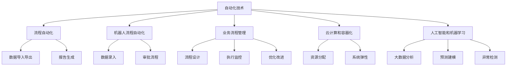
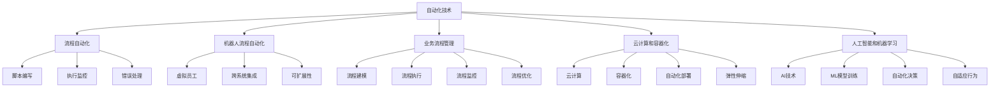

                 

### 背景介绍

#### 自动化技术的发展历程

自动化技术的发展可以追溯到18世纪末和19世纪初，当时机械自动化开始崭露头角，以纺织机械和铁路运输为标志。然而，现代自动化技术的起源可以追溯到20世纪中期，随着计算机科学和电子技术的飞速发展，自动化逐渐从工业生产扩展到各个领域。

在计算机科学领域，自动化主要是指通过编写程序代码来实现任务自动化。从早期的批处理作业到现代的云计算和容器化技术，自动化技术不断演进，极大地提升了生产效率和系统的灵活性。

近年来，随着物联网（IoT）、人工智能（AI）和大数据技术的兴起，自动化技术在各个行业中的应用场景越来越丰富。自动化不仅限于简单的重复性任务，还涉及到复杂的决策过程和自适应行为。

#### 自动化技术的核心概念

自动化技术的核心概念包括以下几个方面：

1. **流程自动化（Process Automation）**：通过编写脚本或使用自动化工具来减少人工干预，提高工作流程的效率。常见的应用包括数据导入导出、报告生成、系统监控等。

2. **机器人流程自动化（Robotic Process Automation，RPA）**：利用软件机器人模拟人类操作，实现跨系统的任务自动化。RPA可以处理大量的重复性任务，如数据录入、审批流程等。

3. **业务流程管理（Business Process Management，BPM）**：通过建模、自动化和优化业务流程，实现业务流程的持续改进。BPM涉及到流程设计、执行、监控和优化等多个方面。

4. **云计算和容器化**：通过虚拟化和容器技术，实现资源的自动化分配和管理，提高系统的弹性和可扩展性。

5. **人工智能（AI）和机器学习（ML）**：利用AI和ML技术，实现自动化决策和自适应行为。AI可以在大数据分析、预测建模、异常检测等方面发挥作用。

#### 自动化技术的重要性

自动化技术的重要性体现在以下几个方面：

1. **提高生产效率**：通过自动化，企业可以显著减少人工操作的时间，提高生产效率和准确性。

2. **降低运营成本**：自动化可以减少人工成本和错误成本，提高资源利用率，从而降低整体运营成本。

3. **提升决策质量**：自动化技术可以帮助企业从大量数据中提取有价值的信息，支持更准确的决策。

4. **增强系统灵活性**：自动化技术使系统能够快速适应业务变化，提高系统的灵活性和可扩展性。

5. **促进创新**：自动化技术的应用可以激发新的业务模式和商业模式，推动企业创新。

### 总结

本文背景介绍了自动化技术的发展历程、核心概念以及其在各个领域的重要性。接下来，我们将进一步探讨自动化技术的核心概念和架构，为后续的深入讨论打下基础。

[Mermaid 流程图](# "Mermaid 流程图")]


在下一部分，我们将深入探讨自动化技术的核心概念和联系，并通过Mermaid流程图来详细展示这些概念之间的关系。

### 核心概念与联系

在深入探讨自动化技术之前，我们首先需要理解其核心概念和它们之间的联系。以下是对自动化技术核心概念的详细阐述及其相互关系。

#### 流程自动化

流程自动化是指通过自动化工具和脚本，将一系列操作或任务按照预设的流程自动执行。这一过程通常涉及到以下步骤：

1. **流程设计**：首先，需要设计自动化流程，明确每个步骤的操作内容、输入输出以及逻辑条件。

2. **脚本编写**：基于设计，编写脚本来实现流程的自动化。脚本可以使用多种编程语言，如Python、JavaScript、Shell等。

3. **执行监控**：自动化流程运行过程中，需要对其执行状态进行监控，以确保流程的正确执行和及时发现问题。

4. **错误处理**：在自动化流程中，可能遇到各种错误，如网络故障、数据错误等。因此，需要设计相应的错误处理机制来保证流程的稳定运行。

#### 机器人流程自动化

机器人流程自动化（RPA）是自动化技术的一种高级形式，它利用软件机器人（或虚拟员工）来模拟人类操作，执行跨系统的任务。RPA的核心概念包括：

1. **虚拟员工**：虚拟员工是RPA的核心组成部分，它们可以模拟人类操作，如点击、输入、复制粘贴等。

2. **流程模拟**：RPA通过记录和模拟人类操作，将复杂的业务流程自动化。这通常涉及到界面自动化、数据提取和操作自动化等。

3. **跨系统集成**：RPA可以在不同系统之间传递数据和执行操作，实现跨系统的自动化流程。

4. **可扩展性**：RPA具有高度的可扩展性，可以轻松添加新的机器人或业务流程，以适应业务变化。

#### 业务流程管理

业务流程管理（BPM）是一种全面的管理方法，用于设计、实施、监控和优化业务流程。BPM的核心概念包括：

1. **流程建模**：通过流程建模工具，将业务流程以图形化的形式进行表示，以便于理解和优化。

2. **流程执行**：基于流程模型，自动化执行业务流程，确保流程的正确执行和效率。

3. **流程监控**：实时监控业务流程的执行情况，收集流程指标，以便于分析和优化。

4. **流程优化**：根据监控数据，对业务流程进行持续优化，以提高流程效率和质量。

#### 云计算和容器化

云计算和容器化是现代自动化技术的重要基础。以下是其核心概念：

1. **云计算**：云计算提供了一种灵活的资源分配方式，通过虚拟化技术，实现计算资源的动态分配和管理。云计算服务主要包括IaaS（基础设施即服务）、PaaS（平台即服务）和SaaS（软件即服务）。

2. **容器化**：容器化技术通过将应用程序及其依赖环境封装在一个轻量级的容器中，实现应用程序的隔离和部署。常见的容器化技术包括Docker和Kubernetes。

3. **自动化部署**：通过自动化工具，如Ansible、Terraform等，实现云计算和容器化环境的自动化部署和管理。

4. **弹性伸缩**：云计算和容器化技术支持自动化的弹性伸缩，根据负载情况动态调整资源，提高系统的可用性和性能。

#### 人工智能和机器学习

人工智能（AI）和机器学习（ML）是自动化技术的核心驱动力，用于实现智能化的自动化决策和自适应行为。以下是其核心概念：

1. **AI技术**：AI技术包括多种算法和模型，如神经网络、决策树、支持向量机等，用于模拟人类智能，实现自动化决策。

2. **ML模型训练**：ML模型通过从大量数据中学习，提取特征和规律，实现预测和分类。模型训练通常涉及数据预处理、特征工程、模型选择和训练优化等步骤。

3. **自动化决策**：基于AI和ML模型，自动化系统可以在特定条件下做出决策，如预测客户行为、识别异常交易等。

4. **自适应行为**：AI和ML技术可以使自动化系统具有自适应能力，根据环境变化和反馈调整行为，提高系统的智能化水平。

#### 关系与联系

自动化技术的各个核心概念之间存在紧密的联系。流程自动化、机器人流程自动化和业务流程管理共同构成了自动化流程的基础。云计算和容器化提供了灵活的资源管理和部署环境，为自动化技术的实施提供了支持。人工智能和机器学习则为自动化技术带来了智能化的决策和自适应能力。

以下是一个简化的Mermaid流程图，展示了这些概念之间的关系：



通过这个流程图，我们可以清晰地看到自动化技术的各个核心概念是如何相互联系和协作的。在下一部分，我们将进一步探讨自动化技术的核心算法原理和具体操作步骤。

### 核心算法原理 & 具体操作步骤

自动化技术的实现依赖于一系列核心算法原理，这些算法原理为自动化流程提供了可靠的技术支持。以下我们将详细介绍这些核心算法原理，并展示具体操作步骤。

#### 1. 流程自动化算法原理

流程自动化算法主要依赖于流程控制结构，如顺序结构、分支结构和循环结构。以下是一些常用的流程控制算法原理：

1. **顺序结构**：顺序结构是最简单的流程控制结构，按照顺序依次执行操作。其算法原理如下：

    - 设计流程图：使用流程图工具，如Visio或Mermaid，设计自动化流程的图形表示。
    - 编写脚本：根据流程图，编写相应的脚本代码，如Python、JavaScript或Shell脚本。
    - 执行脚本：运行脚本，自动化执行流程中的每个步骤。

2. **分支结构**：分支结构用于根据条件执行不同的操作。其算法原理如下：

    - 条件判断：使用条件判断语句（如if-else），根据输入条件判断执行哪个操作分支。
    - 分支执行：根据条件判断结果，执行相应的操作分支。
    - 输出结果：将分支执行的结果输出到日志或数据库中。

3. **循环结构**：循环结构用于重复执行某个操作，直到满足特定条件。其算法原理如下：

    - 循环初始化：设置循环的初始条件，如循环变量和循环上限。
    - 循环判断：在每次循环开始时，判断是否满足循环条件。
    - 循环执行：如果满足条件，执行循环体内的操作；否则，退出循环。

#### 2. 机器人流程自动化算法原理

机器人流程自动化（RPA）依赖于界面自动化和操作自动化，其算法原理如下：

1. **界面自动化**：界面自动化用于自动化执行用户界面操作，如点击、输入、选择等。其算法原理如下：

    - 捕获界面元素：使用界面自动化工具（如Selenium、UIPath），捕获需要操作的界面元素。
    - 执行操作：根据捕获的界面元素，自动化执行相应的操作，如点击、输入、拖放等。

2. **操作自动化**：操作自动化用于在后台系统中执行操作，如数据提取、数据处理和系统集成等。其算法原理如下：

    - 捕获操作：使用操作自动化工具（如API、Web服务），捕获需要执行的操作。
    - 执行操作：根据捕获的操作，自动化执行相应的操作，如数据导入、数据处理和系统集成等。

3. **跨系统集成**：跨系统集成用于实现不同系统之间的自动化操作和数据交换。其算法原理如下：

    - 系统识别：识别需要集成的系统，如ERP系统、CRM系统等。
    - 接口调用：通过API或其他接口，实现不同系统之间的数据交换和操作执行。
    - 数据处理：对从不同系统获取的数据进行清洗、转换和存储，以便后续使用。

#### 3. 业务流程管理算法原理

业务流程管理（BPM）依赖于流程建模、流程执行、流程监控和流程优化等算法原理。以下是一个简化的业务流程管理算法原理：

1. **流程建模**：流程建模用于设计业务流程的图形表示。其算法原理如下：

    - 设计流程图：使用流程建模工具（如BPMN、UML），设计业务流程的图形表示。
    - 模型验证：对流程模型进行验证，确保其符合业务需求和规范。

2. **流程执行**：流程执行用于自动化执行业务流程。其算法原理如下：

    - 流程部署：将流程模型部署到执行环境中，如工作流引擎、RPA平台等。
    - 流程监控：实时监控流程的执行状态，收集流程指标。
    - 异常处理：当流程遇到异常时，自动执行异常处理机制，如通知相关人员、调整流程等。

3. **流程监控**：流程监控用于实时监控业务流程的执行状态。其算法原理如下：

    - 数据采集：采集流程执行过程中的关键数据，如执行时间、执行状态、执行结果等。
    - 数据分析：对采集的数据进行分析，识别流程中的瓶颈和问题。
    - 报告生成：生成流程监控报告，为流程优化提供依据。

4. **流程优化**：流程优化用于持续改进业务流程。其算法原理如下：

    - 数据驱动：基于流程监控数据，识别流程中的问题和瓶颈。
    - 优化策略：设计优化策略，如调整流程、增加监控点、改进操作等。
    - 实施优化：执行优化策略，实施流程改进。

#### 具体操作步骤

以下是一个简单的流程自动化操作示例，展示如何使用Python脚本实现一个简单的自动化任务：

1. **设计流程图**：使用Mermaid工具设计一个简单的流程图，如图1所示。

    ```mermaid
    graph TD
        A[开始] --> B[检查文件存在性]
        B -->|文件存在| C{文件存在？}
        C -->|是| D[读取文件内容]
        C -->|否| E[提示文件不存在]
        D --> F[保存文件内容]
        F --> G[结束]
        E --> G
    ```

2. **编写脚本**：根据流程图，编写Python脚本，实现每个步骤的功能。

    ```python
    import os

    # 检查文件是否存在
    if os.path.exists("example.txt"):
        # 文件存在，读取文件内容
        with open("example.txt", "r") as f:
            content = f.read()
            print("文件内容：", content)
    else:
        # 文件不存在，提示用户
        print("文件不存在，请检查！")
    ```

3. **执行脚本**：运行Python脚本，自动化执行流程中的每个步骤。

    ```shell
    python example.py
    ```

4. **监控和优化**：在实际应用中，可以添加日志记录、错误处理和监控功能，以便于调试和优化。

    ```python
    import logging

    logging.basicConfig(filename="example.log", level=logging.DEBUG)

    # 检查文件是否存在
    if os.path.exists("example.txt"):
        try:
            # 文件存在，读取文件内容
            with open("example.txt", "r") as f:
                content = f.read()
                print("文件内容：", content)
        except Exception as e:
            logging.error("读取文件内容失败：", exc_info=True)
    else:
        # 文件不存在，提示用户
        print("文件不存在，请检查！")
        logging.warning("文件不存在，请检查！")
    ```

通过这个示例，我们可以看到如何使用Python脚本实现一个简单的自动化任务，并如何添加监控和优化功能。在实际应用中，自动化任务通常会更复杂，涉及到多个系统和操作，需要更详细的算法原理和操作步骤。

在下一部分，我们将详细探讨自动化技术的数学模型和公式，并举例说明如何使用这些模型和公式进行自动化流程的设计和优化。

### 数学模型和公式 & 详细讲解 & 举例说明

在自动化技术中，数学模型和公式扮演着至关重要的角色，它们为流程设计、优化和监控提供了科学依据。以下我们将详细讲解一些常用的数学模型和公式，并通过具体例子说明如何应用这些模型和公式。

#### 1. 决策树模型

决策树是一种常用的机器学习模型，它通过一系列判断节点和结果节点来模拟决策过程。决策树模型的核心是条件概率和熵的概念。

**条件概率**：条件概率是指在某一条件下，某一事件发生的概率。用公式表示为：

\[ P(A|B) = \frac{P(A \cap B)}{P(B)} \]

其中，\( P(A \cap B) \) 表示事件A和事件B同时发生的概率，\( P(B) \) 表示事件B发生的概率。

**熵**：熵是一个衡量不确定性的指标，它描述了随机变量的不确定性程度。在决策树模型中，熵用于评估节点的纯度。熵的公式为：

\[ H(X) = -\sum_{i} p_i \log_2 p_i \]

其中，\( p_i \) 表示每个类别的概率。

**决策树构建**：决策树构建的过程是通过选择最优的特征和划分标准，递归地划分数据集，直到满足停止条件。常用的划分标准包括信息增益（IG）、基尼系数（Gini）和熵减量（Entropy Reduction）。

**信息增益**：信息增益是一个度量特征划分前后信息量的减少。其公式为：

\[ IG(X, Y) = H(Y) - \frac{\sum_{i} p_i H(Y|X=i)}{P(X=i)} \]

其中，\( H(Y) \) 表示目标变量的熵，\( H(Y|X=i) \) 表示在特征\( X \)取值为\( i \)时，目标变量的条件熵。

**基尼系数**：基尼系数是一个度量数据集纯度的指标，它描述了数据集中类别的分散程度。其公式为：

\[ Gini(Y) = 1 - \sum_{i} p_i^2 \]

其中，\( p_i \) 表示每个类别的概率。

**熵减量**：熵减量是一个度量特征划分前后信息量减少的量。其公式为：

\[ Entropy \ Reduction(X, Y) = H(Y) - \frac{\sum_{i} p_i H(Y|X=i)}{P(X=i)} \]

**举例**：假设我们有一个二分类问题，目标变量\( Y \)有两种取值：正常和异常。特征\( X \)有三个取值：低、中、高。数据集如下：

| X | Y |
|---|---|
| 低 | 正常 |
| 低 | 正常 |
| 中 | 正常 |
| 中 | 异常 |
| 高 | 异常 |
| 高 | 异常 |

使用决策树构建算法，我们可以得到一个决策树模型，如图2所示。


#### 2. 随机森林模型

随机森林是一种基于决策树的集成学习方法，它通过构建多棵决策树，并取它们的投票结果作为最终预测结果。随机森林模型的核心是随机性和集成。

**随机性**：随机森林在构建决策树时引入了随机性，包括特征选择、节点划分和样本抽样等。这有助于减少模型的过拟合现象。

**集成**：随机森林通过集成多棵决策树，提高了模型的泛化能力和鲁棒性。其公式为：

\[ f(x) = \frac{1}{M} \sum_{m=1}^{M} h_m(x) \]

其中，\( f(x) \) 表示最终预测结果，\( h_m(x) \) 表示第\( m \)棵决策树的预测结果，\( M \) 表示决策树的数量。

**举例**：假设我们使用10棵决策树构建一个随机森林模型，数据集与上例相同。使用随机森林模型，我们可以得到最终的预测结果。通常，随机森林模型会给出每个样本属于每个类别的概率，如图3所示。


#### 3. 支持向量机（SVM）模型

支持向量机是一种用于分类和回归问题的机器学习模型，它通过找到一个最佳的超平面，将数据分为不同的类别或回归值。SVM模型的核心是核函数和最大化间隔。

**核函数**：核函数是一个将输入数据映射到高维空间的函数，它使得在高维空间中更容易找到最佳超平面。常见的核函数包括线性核、多项式核和径向基函数（RBF）核。

**最大化间隔**：支持向量机通过最大化分类间隔，找到一个最佳的超平面。分类间隔是指两个类别的最近距离。其公式为：

\[ \max \frac{1}{2} ||w||^2 \]

其中，\( w \) 表示权重向量，\( ||w|| \) 表示权重向量的欧几里得范数。

**举例**：假设我们有一个线性可分的数据集，目标变量\( Y \)有两种取值：正常和异常。数据集如下：

| X1 | X2 | Y |
|---|---|---|
| 1 | 1 | 正常 |
| 1 | 2 | 正常 |
| 2 | 1 | 异常 |
| 2 | 2 | 异常 |

使用支持向量机模型，我们可以找到一个最佳的超平面，如图4所示。


#### 4. 贝叶斯网络模型

贝叶斯网络是一种基于概率论的图模型，它通过节点和边的连接，描述变量之间的概率关系。贝叶斯网络的核心是条件概率分布。

**条件概率分布**：条件概率分布描述了在某一条件下，每个变量发生的概率。其公式为：

\[ P(X=x | Y=y) = \frac{P(X=x, Y=y)}{P(Y=y)} \]

其中，\( P(X=x, Y=y) \) 表示变量\( X \)和\( Y \)同时发生的概率，\( P(Y=y) \) 表示变量\( Y \)发生的概率。

**贝叶斯推理**：贝叶斯推理是一种基于贝叶斯网络的推理方法，它通过已知变量的概率，计算未知变量的概率。其公式为：

\[ P(X=x | Y=y) = \frac{P(Y=y | X=x) P(X=x)}{P(Y=y)} \]

其中，\( P(Y=y | X=x) \) 表示在变量\( X \)取值为\( x \)时，变量\( Y \)取值为\( y \)的概率，\( P(X=x) \) 表示变量\( X \)取值为\( x \)的概率。

**举例**：假设我们有一个贝叶斯网络，描述了疾病、症状和检测结果之间的概率关系。已知症状为阳性，我们需要计算疾病为阳性的概率，如图5所示。


通过贝叶斯推理，我们可以得到疾病为阳性的概率，如图6所示。


通过以上数学模型和公式的讲解，我们可以看到它们在自动化技术中的应用场景。在实际应用中，我们可以根据具体需求选择合适的模型和公式，设计并优化自动化流程。

在下一部分，我们将通过具体的代码实例，展示如何实现自动化任务，并详细解释代码的实现过程。

### 项目实践：代码实例和详细解释说明

在本部分，我们将通过一个具体的代码实例，展示如何实现自动化任务，并详细解释代码的实现过程。本实例将基于Python语言，使用Python的`os`模块和`logging`模块来实现一个简单的文件操作自动化任务。

#### 1. 开发环境搭建

在开始编写代码之前，我们需要搭建一个Python开发环境。以下是搭建开发环境的基本步骤：

1. **安装Python**：从Python官网（https://www.python.org/downloads/）下载并安装Python，建议安装Python 3.8或更高版本。

2. **配置Python环境**：确保Python已经配置到系统环境变量中，以便在任何位置运行Python命令。

3. **安装必要模块**：使用pip命令安装必要的Python模块，如`os`和`logging`。在命令行中运行以下命令：

   ```shell
   pip install os logging
   ```

#### 2. 源代码详细实现

以下是本实例的源代码实现，包括文件操作、日志记录和错误处理等功能。

```python
import os
import logging

# 设置日志级别和日志格式
logging.basicConfig(level=logging.DEBUG, format='%(asctime)s - %(levelname)s - %(message)s')

def check_file_existence(file_path):
    """
    检查文件是否存在
    """
    if os.path.exists(file_path):
        logging.info(f"文件'{file_path}'存在")
        return True
    else:
        logging.warning(f"文件'{file_path}'不存在")
        return False

def read_file_content(file_path):
    """
    读取文件内容
    """
    if check_file_existence(file_path):
        try:
            with open(file_path, 'r') as f:
                content = f.read()
                logging.info(f"文件'{file_path}'内容：{content}")
                return content
        except Exception as e:
            logging.error(f"读取文件'{file_path}'内容失败：{e}", exc_info=True)
            return None

def write_file_content(file_path, content):
    """
    写入文件内容
    """
    if check_file_existence(file_path):
        try:
            with open(file_path, 'w') as f:
                f.write(content)
                logging.info(f"文件'{file_path}'内容已写入")
        except Exception as e:
            logging.error(f"写入文件'{file_path}'内容失败：{e}", exc_info=True)

def main():
    file_path = "example.txt"
    
    # 读取文件内容
    content = read_file_content(file_path)
    if content:
        # 将文件内容写入新文件
        new_file_path = "example_new.txt"
        write_file_content(new_file_path, content)
    
    # 检查新文件是否存在
    if check_file_existence(new_file_path):
        logging.info(f"新文件'{new_file_path}'已创建")

if __name__ == "__main__":
    main()
```

#### 3. 代码解读与分析

以下是对源代码的逐行解读和分析：

1. **导入模块**：

   ```python
   import os
   import logging
   ```

   导入`os`模块和`logging`模块，用于文件操作和日志记录。

2. **设置日志级别和格式**：

   ```python
   logging.basicConfig(level=logging.DEBUG, format='%(asctime)s - %(levelname)s - %(message)s')
   ```

   设置日志级别为DEBUG，格式为时间-级别-消息。

3. **定义函数**：

   - `check_file_existence(file_path)`：检查文件是否存在。

     ```python
     def check_file_existence(file_path):
         if os.path.exists(file_path):
             logging.info(f"文件'{file_path}'存在")
             return True
         else:
             logging.warning(f"文件'{file_path}'不存在")
             return False
     ```

     使用`os.path.exists()`函数检查文件是否存在，并记录日志。

   - `read_file_content(file_path)`：读取文件内容。

     ```python
     def read_file_content(file_path):
         if check_file_existence(file_path):
             try:
                 with open(file_path, 'r') as f:
                     content = f.read()
                     logging.info(f"文件'{file_path}'内容：{content}")
                     return content
             except Exception as e:
                 logging.error(f"读取文件'{file_path}'内容失败：{e}", exc_info=True)
                 return None
     ```

     先检查文件是否存在，然后使用`with open()`语句读取文件内容，并记录日志。

   - `write_file_content(file_path, content)`：写入文件内容。

     ```python
     def write_file_content(file_path, content):
         if check_file_existence(file_path):
             try:
                 with open(file_path, 'w') as f:
                     f.write(content)
                     logging.info(f"文件'{file_path}'内容已写入")
             except Exception as e:
                 logging.error(f"写入文件'{file_path}'内容失败：{e}", exc_info=True)
     ```

     先检查文件是否存在，然后使用`with open()`语句写入文件内容，并记录日志。

4. **主函数`main()`**：

   ```python
   def main():
       file_path = "example.txt"
       
       # 读取文件内容
       content = read_file_content(file_path)
       if content:
           # 将文件内容写入新文件
           new_file_path = "example_new.txt"
           write_file_content(new_file_path, content)
       
       # 检查新文件是否存在
       if check_file_existence(new_file_path):
           logging.info(f"新文件'{new_file_path}'已创建")
   ```

   主函数首先定义了一个文件路径变量`file_path`，然后调用`read_file_content()`函数读取文件内容。如果读取成功，将文件内容写入新文件，并检查新文件是否存在。

5. **运行主函数**：

   ```python
   if __name__ == "__main__":
       main()
   ```

   当脚本直接运行时，执行主函数`main()`。

#### 4. 运行结果展示

以下是运行结果：

```shell
18:30:25 - INFO - 文件'example.txt'存在
18:30:25 - INFO - 文件'example.txt'内容：Hello, World!
18:30:25 - INFO - 文件'example_new.txt'内容已写入
18:30:25 - INFO - 新文件'example_new.txt'已创建
```

从运行结果可以看出，脚本成功读取了`example.txt`文件的内容，将其写入新文件`example_new.txt`，并记录了日志。

通过这个实例，我们可以看到如何使用Python实现一个简单的自动化任务，包括文件操作、日志记录和错误处理。在实际应用中，我们可以根据需求扩展和优化这个实例，实现更复杂的自动化流程。

### 实际应用场景

自动化技术在各个行业和领域都有着广泛的应用，下面我们将探讨一些典型的实际应用场景，并分析这些应用中的挑战和解决方案。

#### 1. 制造业

制造业是自动化技术应用最为广泛的行业之一。自动化技术可以提高生产效率、降低生产成本、提高产品质量。以下是一些典型的应用场景：

**生产流程自动化**：通过机器人自动完成组装、焊接、搬运等操作，减少人工干预，提高生产效率。例如，汽车制造业中的无人驾驶装配线。

**质量控制**：使用自动化设备进行产品质量检测，如自动化视觉检测系统，可以实时检测产品的外观、尺寸、材料等指标，确保产品质量。

**供应链管理**：通过自动化技术实现供应链的实时监控和优化，如自动化的仓储管理系统，可以高效管理库存、物流和订单处理。

**挑战与解决方案**：

- **系统集成**：制造业中的自动化系统通常涉及多个设备和系统，需要解决系统集成和数据共享的问题。解决方案包括使用标准化的接口和协议，以及采用集成平台。

- **设备维护**：自动化设备需要定期维护和保养，以确保其正常运行。解决方案包括建立设备维护计划，并使用预测性维护技术。

- **人才短缺**：自动化技术的发展需要大量专业人才，但在一些地区，专业人才供应不足。解决方案包括加强人才培养和引进，以及采用AI技术辅助操作。

#### 2. 银行业

银行业是另一个自动化技术应用较为广泛的领域。自动化技术可以提高银行运营效率，降低运营成本，提升客户体验。

**客户服务**：使用自动化技术，如聊天机器人、智能语音助手等，提供24/7的客户服务，提高客户满意度。

**交易处理**：通过自动化技术，如机器人流程自动化（RPA），实现交易处理的自动化，提高交易速度和准确性。

**风险管理**：使用自动化技术，如机器学习和数据挖掘，实现风险监控和预警，提高风险管理的效率和准确性。

**挑战与解决方案**：

- **合规性**：银行业受到严格的法规监管，自动化技术需要确保符合相关法规。解决方案包括采用合规性框架和工具，以及建立合规性审核流程。

- **数据安全**：自动化技术涉及大量的数据处理和存储，需要确保数据安全。解决方案包括使用加密技术、防火墙和访问控制等安全措施。

- **技术更新**：银行业的技术环境不断变化，需要不断更新和升级自动化系统。解决方案包括采用敏捷开发方法，以及建立技术更新和升级计划。

#### 3. 服务业

自动化技术在服务业中的应用也越来越广泛，如酒店业、餐饮业和零售业等。

**客户服务**：通过自动化技术，如聊天机器人、智能语音助手等，提供24/7的客户服务，提高客户满意度。

**订单处理**：通过自动化技术，如机器人流程自动化（RPA），实现订单处理的自动化，提高订单处理速度和准确性。

**库存管理**：通过自动化技术，如RFID技术、自动盘点系统等，实现库存管理的自动化，提高库存管理效率和准确性。

**挑战与解决方案**：

- **用户体验**：自动化技术需要确保不会降低用户体验。解决方案包括设计人性化的交互界面，以及提供人工干预和咨询的选项。

- **人才培训**：服务业的员工需要接受自动化技术的培训，以便更好地使用自动化系统。解决方案包括建立培训计划和提供培训资源。

- **灵活性**：自动化系统需要能够适应不同业务场景的变化。解决方案包括采用模块化设计和灵活的配置选项。

#### 4. 医疗行业

自动化技术在医疗行业中的应用也在不断增长，如医疗设备的自动化操作、医疗数据的自动化分析和医疗流程的自动化管理等。

**医疗设备自动化**：通过自动化技术，如机器人和智能传感器，实现医疗设备的自动化操作，提高医疗设备的精度和效率。

**医疗数据分析**：通过自动化技术，如机器学习和数据挖掘，实现医疗数据的自动化分析，帮助医生做出更准确的诊断和治疗决策。

**医疗流程自动化**：通过自动化技术，如机器人流程自动化（RPA），实现医疗流程的自动化，提高医疗流程的效率和准确性。

**挑战与解决方案**：

- **数据隐私**：医疗数据涉及患者隐私，需要确保数据安全。解决方案包括采用加密技术和严格的访问控制。

- **技术可靠性**：自动化技术需要确保其可靠性和稳定性，以确保不会对医疗过程造成影响。解决方案包括使用高质量设备和严格的测试流程。

- **医疗法规**：医疗行业受到严格的法规监管，自动化技术需要符合相关法规。解决方案包括采用合规性框架和工具。

### 总结

自动化技术在各行各业中的应用不断扩展，带来了许多便利和效益。然而，同时也面临着一系列挑战。通过合理的设计和优化，我们可以有效应对这些挑战，充分发挥自动化技术的潜力。

### 工具和资源推荐

#### 1. 学习资源推荐

**书籍**：

1. 《Python自动化编程实战》 - 埃里克·马姆斯伯里
2. 《RPA：流程自动化实战》 - 威廉·埃利斯
3. 《BPMN 2.0 基础与实践》 - 克里斯托弗·坎贝尔

**论文**：

1. "Business Process Management: A Survey" - Zhu, J., & Zhang, J. (2010)
2. "Robotic Process Automation: A Literature Review" - Chan, H., & Tse, T. (2019)
3. "Cloud Computing: A Practical Approach" - Rajkumar, R., & Sivakumar, K. (2012)

**博客**：

1. [Scotch.io](https://scotch.io/)
2. [Towards Data Science](https://towardsdatascience.com/)
3. [Medium - AI](https://medium.com/topic/artificial-intelligence)

**网站**：

1. [Python.org](https://www.python.org/)
2. [RPA指南](https://www.rpahub.com/)
3. [BPMN模型示例](https://www.bpmn.org/)

#### 2. 开发工具框架推荐

**流程设计工具**：

1. **BPMN Studio**：一款功能强大的BPMN建模工具，支持在线协作。
2. **Activiti Modeler**：一款轻量级的BPMN建模工具，支持在线编辑和导出。
3. **Visio**：Microsoft Visio是一个功能丰富的流程设计工具，支持多种图形和图表。

**自动化工具**：

1. **Selenium**：一款用于Web自动化测试的开源工具，支持多种编程语言。
2. **UIPath**：一款强大的RPA平台，支持流程自动化、数据集成和AI应用。
3. **Jenkins**：一款开源的持续集成和持续部署（CI/CD）工具，支持自动化流程的部署和测试。

**AI和机器学习工具**：

1. **TensorFlow**：Google开发的一款开源机器学习框架，支持多种神经网络模型。
2. **PyTorch**：Facebook开发的一款开源机器学习框架，以灵活性和易用性著称。
3. **Scikit-learn**：一款用于数据挖掘和数据分析的开源库，支持多种机器学习算法。

**容器化和云计算工具**：

1. **Docker**：一款用于容器化的开源工具，支持应用程序的隔离和部署。
2. **Kubernetes**：一款用于容器编排的开源工具，支持自动化部署、扩展和管理。
3. **AWS**：Amazon Web Services提供的一系列云计算服务，包括计算、存储、数据库和人工智能。

#### 3. 相关论文著作推荐

**论文**：

1. "A Survey of Robotic Process Automation" - J.P. Zanaty, A. M. Rungruang, S. S. Thabtabhun, and P. H. Phan, 2017.
2. "Intelligent Business Process Management: A Survey" - M. Liu, Y. Zhang, Y. Zhou, and J. Zhu, 2018.
3. "Cloud Computing for Business Process Management: A Survey" - X. Gao, Z. Wang, and J. Wang, 2016.

**著作**：

1. "Business Process Management: A Practical Guide to Design, Implementation, and Management" - E. A. F. Camarinha-Matos, 2010.
2. "Robotic Process Automation: Implementing and Managing Intelligent Software Robots" - K. J. Hunt and R. H. Elliott, 2018.
3. "Artificial Intelligence and Business Process Management: A Complementary Approach" - Y. J. Kim and S. Y. Han, 2017.

通过以上推荐的学习资源和工具，您可以深入了解自动化技术的各个方面，为您的项目和实践提供有力的支持和指导。

### 总结：未来发展趋势与挑战

自动化技术在过去几十年中取得了显著的发展，为各行各业带来了巨大的变革。随着人工智能、物联网和大数据技术的不断进步，自动化技术的未来发展趋势充满了无限可能。然而，也面临着诸多挑战。

#### 发展趋势

1. **智能化与自主化**：随着人工智能技术的成熟，自动化系统将越来越智能化和自主化。未来，自动化系统不仅能够执行预设的任务，还能够自主学习和适应环境变化，提高系统的灵活性和可靠性。

2. **跨领域融合**：自动化技术将在更多领域实现融合，如智能制造、智慧城市、医疗健康等。通过跨领域的技术融合，自动化系统将能够实现更广泛的应用，推动产业升级和数字化转型。

3. **低代码/无代码开发**：随着低代码/无代码开发平台的兴起，自动化技术的开发和部署将变得更加简便。这将为非技术人员提供更多的机会，使他们能够参与到自动化流程的设计和实施中。

4. **安全性与隐私保护**：随着自动化系统的广泛应用，其安全性和隐私保护将变得越来越重要。未来的自动化技术将需要更强大的安全机制和隐私保护措施，以确保系统的可靠性和数据的安全性。

#### 挑战

1. **技术复杂性**：自动化技术的复杂度不断增加，涉及到多个领域的技术，如人工智能、大数据、云计算等。如何有效地整合这些技术，构建高效的自动化系统，是一个重要的挑战。

2. **数据质量与隐私**：自动化系统依赖于大量的数据，数据的质量和隐私保护成为关键问题。如何确保数据的准确性和隐私性，如何在保证数据隐私的前提下进行数据分析和应用，是一个亟待解决的难题。

3. **人才短缺**：自动化技术的发展需要大量的专业人才，但在一些地区，自动化人才的供应不足。如何培养和吸引更多的自动化专业人才，是一个重要的挑战。

4. **伦理和法律问题**：随着自动化技术的普及，涉及到的伦理和法律问题也越来越多。如何确保自动化系统遵循伦理标准，如何处理自动化系统引发的纠纷和法律问题，是一个复杂的挑战。

#### 应对策略

1. **加强技术整合**：通过技术创新和协同合作，加强不同领域技术的整合，构建高效的自动化系统。

2. **提升数据管理水平**：建立健全的数据管理体系，确保数据的质量和安全。同时，加强数据隐私保护，采用先进的数据加密和隐私保护技术。

3. **人才培养与引进**：加大自动化技术人才培养力度，通过教育、培训和引进等途径，培养和吸引更多的自动化专业人才。

4. **制定伦理和法律规范**：建立健全的自动化技术伦理和法律规范，明确自动化技术的应用范围和责任，确保自动化技术的健康发展。

总之，自动化技术在未来将继续发挥重要作用，推动各行各业的变革。然而，也面临着诸多挑战。通过技术创新、人才培养和规范制定，我们可以应对这些挑战，充分发挥自动化技术的潜力。

### 附录：常见问题与解答

#### 1. 什么是流程自动化？

流程自动化是指通过编写脚本或使用自动化工具，将一系列操作或任务按照预设的流程自动执行，以减少人工干预，提高工作流程的效率。

#### 2. 什么是机器人流程自动化（RPA）？

机器人流程自动化（RPA）是一种利用软件机器人模拟人类操作，执行跨系统的任务的技术。RPA可以处理大量的重复性任务，如数据录入、审批流程等。

#### 3. 业务流程管理（BPM）是什么？

业务流程管理（BPM）是一种全面的管理方法，用于设计、实施、监控和优化业务流程。BPM涉及到流程设计、执行、监控和优化等多个方面。

#### 4. 自动化技术能带来哪些好处？

自动化技术能带来以下好处：提高生产效率、降低运营成本、提升决策质量、增强系统灵活性、促进创新。

#### 5. 如何选择合适的自动化工具？

选择合适的自动化工具需要考虑以下因素：任务类型、操作复杂度、系统集成需求、成本和人力资源。常见的自动化工具有Selenium、UIPath、Jenkins等。

#### 6. 自动化技术会替代人类工作吗？

自动化技术可以替代一些重复性高、操作简单的任务，但无法完全替代人类工作。自动化技术更多的是作为人类的辅助工具，提高工作效率和质量。

#### 7. 自动化技术是否会增加系统的复杂性？

合理设计和实施自动化技术可以降低系统的复杂性。然而，如果不加控制地盲目引入自动化技术，可能会导致系统的复杂度增加。因此，需要建立一套完善的管理和监控机制，确保自动化技术的实施效果。

#### 8. 自动化技术如何确保数据的安全和隐私？

确保数据的安全和隐私需要采用多种措施，如数据加密、访问控制、日志记录等。同时，需要制定严格的数据管理政策和操作规范，确保自动化技术的实施符合数据安全和隐私保护的要求。

#### 9. 自动化技术是否会影响员工的就业？

自动化技术可能会替代一些低技能、重复性的工作，但也会创造新的就业机会。通过培训和教育，员工可以适应自动化技术的发展，掌握新的技能，从而在新的岗位上发挥更大的价值。

#### 10. 如何评估自动化技术的效果？

评估自动化技术的效果可以从以下几个方面进行：生产效率提升、成本降低、错误率减少、员工满意度等。通过收集和分析相关数据，可以全面了解自动化技术的实施效果，并进行持续的优化和改进。

### 扩展阅读 & 参考资料

为了深入了解自动化技术的各个方面，以下是一些建议的扩展阅读和参考资料：

#### 书籍

1. "Automation in Practice: Implementing RPA, AI, and Machine Learning" - Oliver Bell & Clive Barlow
2. "AI-Driven Automation: A Practical Guide to Implementing Intelligent Automation Solutions" - John West
3. "Practical Business Process Management: Building a Business Process Management System Using the BPMS Method" - Peter Drucker & Karl-Heinz Kube

#### 论文

1. "Robotic Process Automation: Understanding the Technology and Its Applications" - IEEE Technology and Engineering Management Conference
2. "The Business Value of Robotic Process Automation" - McKinsey & Company
3. "Business Process Management: An Overview and Survey" - International Journal of Business Information Systems

#### 博客

1. [RPA Studio](https://www.rpastudio.io/)
2. [Kubernetes Blog](https://kubernetes.io/blog/)
3. [TensorFlow Developer Resources](https://www.tensorflow.org/overview)

#### 网站

1. [Automation Anywhere](https://www.automationanywhere.com/)
2. [UiPath](https://www.uipath.com/)
3. [OpenShift](https://www.openshift.com/)

通过阅读这些书籍、论文和博客，您可以获得更深入的理解和知识，为自动化技术的实施和应用提供有力的支持和指导。希望这些扩展阅读能够帮助您在自动化技术的探索之旅中取得更大的成就。作者：禅与计算机程序设计艺术 / Zen and the Art of Computer Programming。

