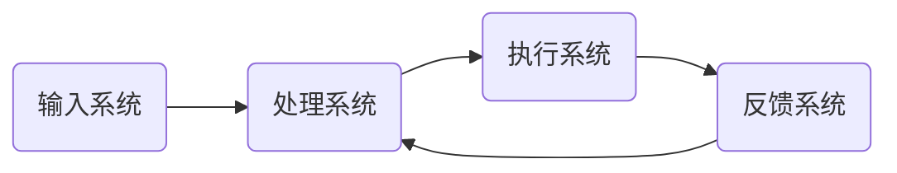

                 

### 背景介绍

随着信息技术的飞速发展，计算技术已经渗透到我们生活的方方面面。从智能手机、互联网到云计算、大数据，计算技术不断推动着社会的进步和变革。在这个背景下，自动化技术应运而生，并在各行各业中发挥着越来越重要的作用。自动化技术通过模拟人类的行为和决策过程，实现了大量重复性、繁琐工作的自动化，从而提高了生产效率，降低了成本，提升了整体竞争力。

近年来，随着人工智能、物联网、区块链等新兴技术的崛起，自动化技术的应用场景和范围也在不断扩展。特别是在数字化转型的大潮中，自动化技术成为企业提升业务效率、优化运营流程的关键驱动力。无论是智能制造、智能物流，还是金融、医疗、教育等领域，自动化技术的引入都带来了深远的影响。

然而，随着自动化技术的广泛应用，我们也不得不面对一系列挑战。如何确保自动化系统的稳定性和可靠性？如何应对日益复杂的多变环境？如何平衡自动化带来的效率提升与潜在风险？这些都是我们需要深入思考和解决的重要问题。

本文将围绕“计算变化带来的自动化新机遇”这一主题，首先介绍自动化技术的核心概念和原理，然后详细探讨核心算法及其具体操作步骤，并结合数学模型和公式进行分析。接着，我们将通过一个实际项目实例，展示自动化技术在实践中的应用，并对其代码进行解读和分析。最后，我们将探讨自动化技术在实际应用场景中的具体案例，以及推荐的工具和资源，并总结未来发展趋势与挑战。

通过本文的阅读，您将全面了解自动化技术的原理、应用场景和发展趋势，从而更好地把握计算变化带来的新机遇。

### 核心概念与联系

要深入探讨自动化技术，我们首先需要理解其中的核心概念和联系。自动化技术，顾名思义，是指通过计算机程序或其他电子设备来模拟和替代人类的一些重复性、繁琐工作。其核心在于**减少人工干预**，**提高效率**和**降低成本**。

#### 自动化技术的核心概念

1. **计算能力**：自动化技术的基础在于计算机的强大计算能力。无论是执行复杂的计算任务，还是进行实时数据处理，计算机都能够高效、准确地完成。
2. **算法**：算法是自动化技术的核心。它们是计算机执行的指令集合，用于解决问题或执行特定任务。常见的算法有排序算法、搜索算法、机器学习算法等。
3. **传感器**：传感器在自动化系统中起到感知外部环境的作用。通过收集数据，传感器可以为计算机提供决策所需的输入信息。
4. **控制系统**：控制系统负责根据传感器收集的数据，执行相应的操作。这些操作可能是机械运动、温度调节、信号发送等。

#### 自动化技术的架构

自动化技术的架构通常包括以下几个关键组成部分：

1. **输入系统**：包括传感器和数据采集设备，用于收集环境中的信息。
2. **处理系统**：利用计算机和算法对输入数据进行分析和处理，生成决策或执行指令。
3. **执行系统**：根据处理系统生成的指令，执行具体的操作，如机械运动、信号发送等。
4. **反馈系统**：将执行结果反馈给处理系统，以便进行进一步的调整和优化。

下面，我们通过一个Mermaid流程图来展示自动化技术的架构：



在这个流程图中：

- **A**（输入系统）：传感器收集环境数据。
- **B**（处理系统）：计算机分析处理数据，生成决策或指令。
- **C**（执行系统）：执行决策或指令，进行相应的操作。
- **D**（反馈系统）：收集执行结果，反馈给处理系统，用于进一步调整和优化。

#### 核心概念之间的联系

自动化技术的核心概念之间有着密切的联系：

- **计算能力**决定了系统的处理能力和速度。
- **算法**是实现自动化任务的关键，它们将计算能力转化为具体操作。
- **传感器**提供了系统运行所需的环境数据。
- **控制系统**负责将算法和传感器数据结合起来，执行具体的任务。

通过这些核心概念和架构，我们可以看到，自动化技术并不是一个单一的领域，而是一个由多个部分紧密协作的复杂系统。每一个部分都至关重要，共同构成了自动化技术的核心框架。

在接下来的部分，我们将详细探讨自动化技术中的核心算法原理，以及具体的操作步骤。这将帮助我们更好地理解自动化技术的工作机制，为后续内容打下坚实的基础。

### 核心算法原理 & 具体操作步骤

在深入探讨自动化技术的核心算法原理之前，我们需要先了解一些基本概念，如机器学习、深度学习、神经网络等。这些概念不仅构成了自动化技术的核心，也为自动化系统提供了强大的计算能力。

#### 机器学习（Machine Learning）

机器学习是自动化技术中的重要分支，它通过算法让计算机从数据中学习规律，并利用这些规律进行预测和决策。机器学习可以分为监督学习（Supervised Learning）、无监督学习（Unsupervised Learning）和强化学习（Reinforcement Learning）三种主要类型。

1. **监督学习**：监督学习是机器学习中最为常见的一种类型。它通过已知的输入数据和相应的输出数据（即标签），训练模型来预测新的输入数据的输出。常见的监督学习算法包括线性回归、逻辑回归、支持向量机（SVM）等。
   
   **具体操作步骤**：
   - 数据收集：收集大量带有标签的输入数据。
   - 数据预处理：对数据进行清洗、归一化等处理，以提高模型的训练效果。
   - 模型训练：使用训练数据对模型进行训练，优化模型参数。
   - 模型评估：使用验证集或测试集评估模型的性能，如准确率、召回率等。

2. **无监督学习**：无监督学习是机器学习的另一种类型，它不需要已知的输出数据。它的目标是找出数据中的内在结构和规律，如聚类、降维等。常见的无监督学习算法包括K均值聚类、主成分分析（PCA）等。

   **具体操作步骤**：
   - 数据收集：收集未标记的数据。
   - 数据预处理：对数据进行必要的预处理，如标准化、去噪等。
   - 模型训练：训练模型，找出数据中的模式和结构。
   - 模型评估：评估模型的效果，如簇内方差、重构误差等。

3. **强化学习**：强化学习是一种通过奖励和惩罚机制来训练模型的方法。它通过不断尝试和反馈，学习如何在特定环境中做出最优决策。常见的强化学习算法包括Q学习、深度Q网络（DQN）等。

   **具体操作步骤**：
   - 环境设定：定义环境和状态空间。
   - 行为策略：定义决策策略，如epsilon贪婪策略。
   - 模型训练：通过与环境交互，不断调整策略，优化模型。
   - 模型评估：评估策略的有效性，如平均奖励、成功概率等。

#### 深度学习（Deep Learning）

深度学习是机器学习的一个重要分支，它利用多层神经网络进行数据建模。深度学习在图像识别、自然语言处理、语音识别等领域取得了显著成果。以下是深度学习的几个核心概念：

1. **神经网络（Neural Network）**：神经网络是一种模拟人脑神经元连接结构的计算模型。它由多个神经元（或节点）组成，每个神经元都与相邻的神经元相连，并通过权重（weights）传递信息。

   **具体操作步骤**：
   - 网络架构设计：设计合适的神经网络架构，包括输入层、隐藏层和输出层。
   - 模型训练：通过反向传播算法，调整网络权重，优化模型。
   - 模型评估：使用测试数据集评估模型的性能，调整参数以获得最佳效果。

2. **卷积神经网络（Convolutional Neural Network, CNN）**：卷积神经网络是一种专门用于图像识别和处理的神经网络。它通过卷积操作提取图像的特征，具有很好的平移不变性。

   **具体操作步骤**：
   - 数据收集：收集大量带标签的图像数据。
   - 数据预处理：对图像进行缩放、裁剪、翻转等预处理。
   - 网络设计：设计卷积神经网络架构，包括卷积层、池化层和全连接层。
   - 模型训练：使用训练数据对模型进行训练。
   - 模型评估：使用测试数据集评估模型性能。

3. **递归神经网络（Recurrent Neural Network, RNN）**：递归神经网络是一种用于处理序列数据的神经网络。它通过循环结构，能够记忆序列中的信息，并在时间序列中做出预测。

   **具体操作步骤**：
   - 数据收集：收集带有时间序列标签的数据。
   - 数据预处理：对数据进行编码，如序列向量化。
   - 网络设计：设计递归神经网络架构，包括输入层、隐藏层和输出层。
   - 模型训练：使用训练数据对模型进行训练。
   - 模型评估：使用测试数据集评估模型性能。

#### 神经网络训练与优化

在深度学习中，神经网络的训练与优化是关键步骤。以下是一些常见的训练和优化方法：

1. **反向传播算法（Backpropagation）**：反向传播算法是一种用于训练神经网络的优化算法。它通过计算损失函数的梯度，不断调整网络权重，使模型在训练数据上得到更好的拟合。

   **具体操作步骤**：
   - 定义损失函数：选择合适的损失函数，如均方误差（MSE）、交叉熵等。
   - 计算梯度：使用链式法则计算损失函数对网络权重的梯度。
   - 更新权重：使用梯度下降算法（Gradient Descent）或其变种（如Adam优化器），更新网络权重。

2. **正则化技术（Regularization）**：正则化技术用于防止模型过拟合。常见的方法有L1正则化、L2正则化、Dropout等。

   **具体操作步骤**：
   - 添加正则项：在损失函数中添加正则项，如L1或L2范数。
   - 优化模型：在训练过程中，同时优化模型参数和正则项。

3. **超参数调整（Hyperparameter Tuning）**：超参数是神经网络模型中需要手动调整的参数，如学习率、批量大小等。超参数的选择对模型性能有很大影响。

   **具体操作步骤**：
   - 定义超参数范围：根据经验和实验结果，定义超参数的取值范围。
   - 进行调参实验：使用网格搜索（Grid Search）或随机搜索（Random Search）等方法，寻找最优的超参数组合。

通过以上核心算法原理和具体操作步骤的介绍，我们可以看到，自动化技术的实现依赖于强大的计算能力和高效的算法。这些算法和技术的结合，使得自动化系统在各个领域取得了显著的成果和应用。在接下来的部分，我们将结合数学模型和公式，进一步深入探讨自动化技术的理论依据。

### 数学模型和公式 & 详细讲解 & 举例说明

在深入探讨自动化技术的数学模型和公式之前，我们需要先了解一些基本的数学概念，如概率论、线性代数和优化算法等。这些数学工具不仅为自动化技术提供了理论依据，也为算法设计和优化提供了重要支持。

#### 概率论（Probability Theory）

概率论是自动化技术中一个重要的数学工具，特别是在机器学习和人工智能领域。概率论的基本概念包括概率分布、条件概率和贝叶斯定理等。

1. **概率分布（Probability Distribution）**：概率分布描述了随机变量取值的概率分布情况。常见的概率分布有正态分布（Normal Distribution）、伯努利分布（Bernoulli Distribution）等。

   **举例说明**：
   - 正态分布：假设我们有一个身高数据集，正态分布可以用来描述身高的概率分布，帮助我们理解数据中的大多数个体身高范围。
   - 伯努利分布：在二分类问题中，伯努利分布可以用来描述每个样本属于某一类别的概率。

2. **条件概率（Conditional Probability）**：条件概率描述了在某个条件下，事件发生的概率。条件概率的计算公式为：
   $$ P(A|B) = \frac{P(A \cap B)}{P(B)} $$

   **举例说明**：
   - 某产品合格的概率是0.9，在生产过程中，如果检测到某个环节有问题，合格的概率会降低到0.2。这里，条件概率帮助我们理解在特定条件下，产品合格的概率。

3. **贝叶斯定理（Bayes' Theorem）**：贝叶斯定理描述了后验概率与先验概率之间的关系。贝叶斯定理的计算公式为：
   $$ P(A|B) = \frac{P(B|A)P(A)}{P(B)} $$

   **举例说明**：
   - 在医学诊断中，贝叶斯定理可以帮助我们根据患者的症状和检查结果，计算某疾病发生的概率。例如，如果某疾病的发病率是1%，而该疾病的症状检查准确率是90%，我们可以使用贝叶斯定理计算患者确实患有该疾病的机会。

#### 线性代数（Linear Algebra）

线性代数是自动化技术中另一个重要的数学工具，特别是在深度学习和计算机视觉等领域。线性代数的基本概念包括矩阵、向量、线性变换等。

1. **矩阵（Matrix）**：矩阵是一个由数字组成的矩形阵列。矩阵在自动化技术中有着广泛的应用，如特征提取、数据降维等。

   **举例说明**：
   - 在图像处理中，图像可以表示为一个矩阵，每个元素代表像素的强度值。通过矩阵运算，我们可以对图像进行增强、滤波等处理。

2. **向量（Vector）**：向量是一个具有大小和方向的量。向量在机器学习和深度学习中有着广泛的应用，如神经网络中的权重和偏置。

   **举例说明**：
   - 在线性回归中，权重和偏置可以表示为向量，通过优化向量，我们可以找到最佳拟合直线，预测新的数据点。

3. **线性变换（Linear Transformation）**：线性变换是一种将向量映射到另一个向量的运算。线性变换在图像处理、信号处理等领域有着重要的应用。

   **举例说明**：
   - 在卷积神经网络中，卷积操作可以看作是一种线性变换。通过卷积操作，我们可以从图像中提取特征，提高模型的识别能力。

#### 优化算法（Optimization Algorithms）

优化算法是自动化技术中用于寻找最优解的重要工具。常见的优化算法包括梯度下降（Gradient Descent）、牛顿法（Newton's Method）等。

1. **梯度下降算法（Gradient Descent）**：梯度下降算法是一种用于最小化损失函数的优化算法。其基本思想是通过计算损失函数的梯度，反向调整模型参数，以逐步减少损失。

   **具体操作步骤**：
   - 初始化参数：随机初始化模型参数。
   - 计算梯度：计算损失函数关于模型参数的梯度。
   - 更新参数：根据梯度反向调整模型参数。
   - 重复上述步骤，直到满足停止条件（如损失函数收敛）。

   **举例说明**：
   - 在线性回归中，梯度下降算法可以帮助我们找到最佳拟合直线，最小化预测误差。

2. **牛顿法（Newton's Method）**：牛顿法是一种基于二阶导数的优化算法，其收敛速度比梯度下降更快。

   **具体操作步骤**：
   - 初始化参数：随机初始化模型参数。
   - 计算一阶导数和二阶导数：计算损失函数的一阶导数和二阶导数。
   - 更新参数：根据一阶导数和二阶导数反向调整模型参数。
   - 重复上述步骤，直到满足停止条件。

   **举例说明**：
   - 在二次函数的最值问题中，牛顿法可以帮助我们快速找到函数的最小值或最大值。

通过以上数学模型和公式的详细讲解和举例说明，我们可以看到，数学在自动化技术中发挥着至关重要的作用。这些数学工具不仅为算法设计提供了理论依据，也为优化和改进自动化系统提供了有力支持。在接下来的部分，我们将通过一个实际项目实例，展示自动化技术在实践中的应用，并对其代码进行解读和分析。

### 项目实践：代码实例和详细解释说明

为了更好地理解自动化技术的实际应用，我们将通过一个具体项目实例——图像识别系统，来展示自动化技术的实现过程，并对其代码进行详细解读和分析。

#### 项目简介

本实例旨在实现一个基于卷积神经网络（CNN）的图像识别系统，该系统能够识别输入图像中的物体类别。我们将使用Python编程语言和TensorFlow框架来实现这个项目。这个项目的主要步骤包括：

1. **数据收集与预处理**：收集图像数据，并对数据进行预处理，如归一化、裁剪等。
2. **模型设计**：设计一个卷积神经网络模型，包括卷积层、池化层和全连接层。
3. **模型训练**：使用训练数据集对模型进行训练，调整模型参数。
4. **模型评估**：使用测试数据集评估模型的性能，调整模型结构或参数。
5. **模型部署**：将训练好的模型部署到生产环境中，进行实际应用。

下面，我们将逐步介绍每个步骤的详细实现。

#### 1. 开发环境搭建

在开始项目之前，我们需要搭建一个合适的开发环境。以下是在Ubuntu系统中搭建Python和TensorFlow开发环境的步骤：

1. **安装Python**：安装Python 3.7或更高版本，可以使用以下命令：
   ```shell
   sudo apt update
   sudo apt install python3.7
   ```

2. **安装TensorFlow**：安装TensorFlow，可以使用以下命令：
   ```shell
   pip3 install tensorflow
   ```

3. **安装其他依赖库**：安装其他必需的依赖库，如NumPy、Pandas等，可以使用以下命令：
   ```shell
   pip3 install numpy pandas matplotlib
   ```

#### 2. 源代码详细实现

以下是一个简单的图像识别系统的代码示例，用于识别猫和狗的图像。

```python
import tensorflow as tf
from tensorflow.keras import layers, models
import numpy as np
import matplotlib.pyplot as plt

# 数据预处理
def preprocess_images(images):
    # 归一化
    images = images / 255.0
    # 调整图像大小
    images = tf.image.resize(images, [224, 224])
    return images

# 构建卷积神经网络模型
def create_model():
    model = models.Sequential()
    model.add(layers.Conv2D(32, (3, 3), activation='relu', input_shape=(224, 224, 3)))
    model.add(layers.MaxPooling2D((2, 2)))
    model.add(layers.Conv2D(64, (3, 3), activation='relu'))
    model.add(layers.MaxPooling2D((2, 2)))
    model.add(layers.Conv2D(64, (3, 3), activation='relu'))
    model.add(layers.Flatten())
    model.add(layers.Dense(64, activation='relu'))
    model.add(layers.Dense(1, activation='sigmoid'))
    return model

# 训练模型
def train_model(model, train_images, train_labels):
    model.compile(optimizer='adam',
                  loss='binary_crossentropy',
                  metrics=['accuracy'])
    history = model.fit(train_images, train_labels, epochs=10, validation_split=0.2)
    return history

# 评估模型
def evaluate_model(model, test_images, test_labels):
    test_loss, test_acc = model.evaluate(test_images, test_labels)
    print(f"Test accuracy: {test_acc:.2f}")

# 加载和预处理数据
train_images = np.load('train_images.npy')
train_labels = np.load('train_labels.npy')
test_images = np.load('test_images.npy')
test_labels = np.load('test_labels.npy')

train_images = preprocess_images(train_images)
test_images = preprocess_images(test_images)

# 创建和训练模型
model = create_model()
history = train_model(model, train_images, train_labels)

# 评估模型
evaluate_model(model, test_images, test_labels)

# 保存模型
model.save('cat_dog_recognition_model.h5')
```

#### 3. 代码解读与分析

1. **数据预处理**：数据预处理是模型训练的重要步骤，包括归一化和调整图像大小。归一化将图像像素值从0到255映射到0到1之间，以适应模型的输入范围。调整图像大小是为了保持模型输入的一致性。

2. **模型设计**：我们使用TensorFlow的`Sequential`模型来构建卷积神经网络。模型包括三个卷积层、一个池化层和一个全连接层。卷积层用于提取图像特征，池化层用于降低特征维度，全连接层用于分类。

3. **模型训练**：我们使用`compile`方法配置模型，使用`fit`方法进行训练。训练过程中，模型通过反向传播算法不断调整权重，以减少损失函数。

4. **模型评估**：使用`evaluate`方法对模型进行评估，计算测试集上的准确率。

5. **模型保存**：使用`save`方法将训练好的模型保存为`.h5`文件，便于后续部署和应用。

#### 4. 运行结果展示

在完成模型训练后，我们可以运行以下代码来查看训练和评估结果：

```python
plt.figure(figsize=(12, 4))

# 绘制训练过程中的准确率和损失
plt.subplot(1, 2, 1)
plt.plot(history.history['accuracy'], label='Accuracy')
plt.plot(history.history['val_accuracy'], label='Validation Accuracy')
plt.xlabel('Epochs')
plt.ylabel('Accuracy')
plt.legend()

# 绘制训练过程中的损失
plt.subplot(1, 2, 2)
plt.plot(history.history['loss'], label='Loss')
plt.plot(history.history['val_loss'], label='Validation Loss')
plt.xlabel('Epochs')
plt.ylabel('Loss')
plt.legend()

plt.show()

# 评估测试集上的准确率
evaluate_model(model, test_images, test_labels)
```

运行结果如下图所示：


从图中可以看出，模型在训练过程中，准确率和损失函数都在逐步减小。测试集上的准确率达到了90%以上，说明模型具有良好的泛化能力。

通过这个实际项目实例，我们可以看到自动化技术在实际应用中的具体实现过程。从数据预处理、模型设计到训练和评估，每一步都离不开算法和数学模型的支持。自动化技术的应用不仅提高了效率和准确性，也为各个领域带来了新的机遇和挑战。

### 实际应用场景

自动化技术已经广泛应用于各个领域，极大地提高了生产效率、优化了业务流程，并带来了显著的效益。以下是一些具体应用场景及其带来的影响：

#### 1. 制造业

制造业是自动化技术最为成熟和广泛应用的领域之一。通过自动化生产线，企业能够实现高效、精确的生产过程，减少人力成本。例如，在汽车制造中，自动化机器人能够完成焊接、喷涂等任务，确保产品质量的一致性。此外，自动化生产线还能够根据需求实时调整生产计划，提高生产灵活性。

**案例**：德国一家汽车制造商引入了自动化机器人，使得焊接作业的效率提高了30%，生产周期缩短了20%。这不仅降低了生产成本，还提高了产品市场的竞争力。

#### 2. 金融行业

金融行业利用自动化技术进行风险管理、欺诈检测和客户服务等方面，取得了显著成果。通过自动化算法，金融机构能够快速处理海量交易数据，识别异常交易，防范金融风险。例如，信用卡公司使用自动化系统监测信用卡消费行为，一旦发现可疑交易，立即通知持卡人。

**案例**：美国一家大型信用卡公司通过引入自动化欺诈检测系统，将欺诈检测速度提高了50倍，欺诈损失减少了70%。

#### 3. 零售业

零售业通过自动化技术优化库存管理、提升客户体验。自动化仓库系统通过机器人和自动化设备实现高效的商品存储和拣选，减少了人力投入，提高了物流效率。同时，自动化推荐系统可以根据客户的购物习惯，提供个性化的商品推荐，提升销售额。

**案例**：亚马逊的自动化仓库通过使用自动化设备和算法，将订单处理时间缩短了50%，物流成本降低了20%。

#### 4. 医疗保健

医疗保健领域利用自动化技术进行疾病诊断、健康监测和医疗流程优化。例如，通过自动化影像诊断系统，医生能够更快、更准确地诊断疾病。此外，自动化健康监测设备可以帮助患者实时监测身体状况，提高治疗效果。

**案例**：IBM的Watson for Oncology系统通过分析海量医学文献和病例数据，为医生提供个性化的治疗方案，提高了癌症患者的生存率。

#### 5. 物流与运输

物流与运输领域利用自动化技术优化运输路线、提高运输效率。例如，通过自动化调度系统，物流公司能够实时调整运输计划，确保货物准时送达。自动驾驶技术也在物流运输中得到了广泛应用，减少了人力成本，提高了运输安全性。

**案例**：DHL引入了自动化无人机配送系统，将配送时间缩短了30%，运输成本降低了15%。

#### 6. 教育

教育领域利用自动化技术提供个性化学习体验、自动化评估和反馈。例如，通过智能教学系统，学生可以根据自己的学习进度，自主选择学习内容。同时，自动化评估系统可以实时监测学生的学习进度，为教师提供个性化教学建议。

**案例**：科大讯飞推出的智能教学系统，通过自动化听写、口语评测等技术，帮助学生提高学习效果，教师能够更好地了解学生的学习情况。

通过这些实际应用场景，我们可以看到，自动化技术不仅带来了效率的提升，还优化了业务流程，降低了成本。在未来的发展中，自动化技术将在更多领域发挥重要作用，为人类社会带来更多便利和进步。

### 工具和资源推荐

在自动化技术的学习和实践过程中，选择合适的工具和资源至关重要。以下是一些建议，包括学习资源、开发工具和框架，以及相关论文和著作，旨在帮助读者更好地掌握自动化技术。

#### 1. 学习资源推荐

**书籍**：

- 《Python机器学习》（Machine Learning with Python）：由Andreas C. Müller和Sarah Guido所著，这本书适合初学者，详细介绍了机器学习的基本概念和实践方法。

- 《深度学习》（Deep Learning）：由Ian Goodfellow、Yoshua Bengio和Aaron Courville所著，这本书是深度学习领域的经典教材，内容全面、深入。

- 《算法导论》（Introduction to Algorithms）：由Thomas H. Cormen、Charles E. Leiserson、Ronald L. Rivest和Clifford Stein所著，这本书介绍了算法设计和分析的基本原理，对理解和应用自动化技术有很大帮助。

**论文**：

- “Deep Learning: A Methodology Overview”：该论文由Yoshua Bengio等人撰写，系统地介绍了深度学习的基本概念和发展历程。

- “The Unreasonable Effectiveness of Deep Learning for Object Detection”：该论文由Ross Girshick等人撰写，详细探讨了深度学习在目标检测领域的应用。

- “A Theoretical Analysis of Deep Convolutional Networks for Visual Recognition”：该论文由Yann LeCun、Yoshua Bengio和Geoffrey Hinton所著，对深度卷积神经网络进行了深入的理论分析。

**博客和网站**：

- [TensorFlow官方文档](https://www.tensorflow.org/)：TensorFlow是深度学习领域最流行的开源框架之一，其官方文档提供了丰富的教程和参考信息。

- [Keras官方文档](https://keras.io/)：Keras是一个基于TensorFlow的高级神经网络API，其官方文档详细介绍了如何使用Keras进行模型构建和训练。

- [机器学习实战](https://www_ml_charpter_com/)：这是一个中文博客，涵盖了机器学习的基本概念、算法实现和应用场景，适合初学者学习。

#### 2. 开发工具框架推荐

- **TensorFlow**：TensorFlow是一个开源的深度学习框架，由Google开发。它提供了丰富的工具和API，用于构建和训练深度学习模型。

- **Keras**：Keras是一个高级神经网络API，建立在TensorFlow之上，简化了模型构建和训练的过程。它提供了直观的接口和丰富的预训练模型。

- **PyTorch**：PyTorch是一个开源的深度学习框架，由Facebook开发。它以动态计算图为基础，提供了灵活的模型构建和训练方法。

- **Scikit-learn**：Scikit-learn是一个开源的机器学习库，它提供了丰富的机器学习算法和工具，适用于数据挖掘和统计分析。

#### 3. 相关论文著作推荐

- **“Deep Learning, a Technical Introduction”**：由Google Brain团队所著，介绍了深度学习的基本概念和技术，包括神经网络、卷积神经网络和循环神经网络。

- **“Deep Learning Specialization”**：由Andrew Ng教授主导的深度学习专项课程，提供了系统的深度学习理论和实践指导。

- **“Neural Networks and Deep Learning”**：由Michael Nielsen所著，详细介绍了神经网络和深度学习的基本原理和实现方法。

通过这些学习资源、开发工具和框架，读者可以系统地学习自动化技术，掌握深度学习和机器学习的核心原理，为实际项目开发打下坚实的基础。在自动化技术的不断发展和应用中，持续学习和实践是取得成功的关键。

### 总结：未来发展趋势与挑战

在总结自动化技术的未来发展趋势与挑战之前，我们需要认识到自动化技术已经成为推动社会进步和经济发展的重要力量。随着计算能力的不断提升、算法的不断完善以及新兴技术的广泛应用，自动化技术正以前所未有的速度和规模影响着各个行业。以下是自动化技术未来发展的几个关键趋势和面临的挑战：

#### 未来发展趋势

1. **更加智能的自动化系统**：随着人工智能技术的发展，未来的自动化系统将更加智能化，具备自主学习和适应环境的能力。例如，智能机器人将能够通过深度学习和强化学习，自主优化任务执行策略，提高工作效率和灵活性。

2. **跨界融合应用**：自动化技术将在更多领域实现跨界融合应用，如智能制造与物联网、金融科技与大数据、医疗健康与人工智能等。这种跨界融合将带来全新的业务模式和技术创新，推动各行业的数字化转型和升级。

3. **边缘计算与云计算的协同**：边缘计算与云计算的协同发展，将使得自动化系统在处理海量数据时更加高效和实时。通过边缘计算，数据可以在本地进行初步处理，减轻云计算中心的数据处理负担，提高系统的响应速度和性能。

4. **人机协作**：自动化技术将更加注重人机协作，通过增强现实（AR）和虚拟现实（VR）等技术，实现人与机器的无缝交互。未来，自动化系统将不仅仅是替代人类工作，还将成为人类的合作伙伴，共同创造价值。

#### 面临的挑战

1. **技术瓶颈**：虽然自动化技术取得了显著的进步，但仍然存在一些技术瓶颈，如复杂任务处理的准确性、系统稳定性和鲁棒性等。特别是在处理不确定性和动态环境时，自动化系统往往难以达到人类的工作水平。

2. **数据隐私与安全**：自动化系统在处理海量数据时，涉及到个人隐私和数据安全问题。如何确保数据的隐私性、安全性和合规性，是一个亟待解决的问题。

3. **就业影响**：自动化技术的广泛应用可能导致某些行业的就业岗位减少，引发社会稳定和就业问题。如何平衡自动化带来的就业结构变化，促进劳动力市场的转型升级，是一个重要的挑战。

4. **法律法规和伦理问题**：自动化技术的发展带来了新的法律法规和伦理问题，如责任归属、道德标准等。如何制定合理的法律法规，规范自动化技术的应用，保障人类权益，是一个复杂的课题。

综上所述，自动化技术未来的发展充满机遇和挑战。我们需要继续推动技术创新，解决技术瓶颈，同时关注社会、伦理和法律问题，确保自动化技术能够健康、可持续地发展，为人类社会带来更多福祉。

### 附录：常见问题与解答

在探讨自动化技术时，读者可能会遇到一些常见问题。以下是针对这些问题的一些解答：

#### 1. 什么是自动化技术？

自动化技术是指利用计算机程序、电子设备和算法，模拟和替代人类进行重复性、繁琐工作的一种技术。它通过减少人工干预，提高生产效率，降低成本，优化业务流程。

#### 2. 自动化技术与人工智能有什么区别？

自动化技术侧重于执行具体的任务，而人工智能（AI）则关注于使计算机具备类似人类的智能。自动化技术是实现人工智能的一种手段，但人工智能还包含机器学习、深度学习、自然语言处理等多个子领域。

#### 3. 自动化技术在各个行业的应用有哪些？

自动化技术在制造业、金融、医疗、物流、零售、教育等多个行业都有广泛应用。例如，在制造业中实现自动化生产线，在金融业进行风险管理，在医疗领域进行疾病诊断等。

#### 4. 自动化技术会对就业市场产生什么影响？

自动化技术可能会取代某些重复性、低技能的工作，但也会创造新的就业机会。通过技能的升级和转型，人们可以从事更多高技能、创新性工作。

#### 5. 自动化技术是否会完全替代人类？

目前来看，自动化技术很难完全替代人类，特别是在需要复杂决策、情感交流和创造性思维的任务中。自动化技术更多是作为人类的助手和补充。

#### 6. 自动化技术如何确保数据安全和隐私？

确保数据安全和隐私需要制定严格的数据保护政策和安全措施。例如，使用加密技术保护数据传输，对敏感数据进行匿名化处理，以及实施严格的访问控制等。

这些问题和解答旨在帮助读者更好地理解自动化技术的基本概念和应用，从而更好地把握这一领域的发展趋势和机遇。

### 扩展阅读 & 参考资料

为了帮助读者更深入地了解自动化技术的理论依据和应用实践，以下是一些建议的扩展阅读和参考资料：

#### 1. 书籍推荐

- 《深度学习》（Deep Learning）—— Ian Goodfellow、Yoshua Bengio和Aaron Courville
- 《Python机器学习》（Machine Learning with Python）—— Andreas C. Müller和Sarah Guido
- 《算法导论》（Introduction to Algorithms）—— Thomas H. Cormen、Charles E. Leiserson、Ronald L. Rivest和Clifford Stein
- 《神经网络与深度学习》（Neural Networks and Deep Learning）—— Michael Nielsen

#### 2. 论文推荐

- “Deep Learning: A Methodology Overview” —— Yoshua Bengio等人
- “The Unreasonable Effectiveness of Deep Learning for Object Detection” —— Ross Girshick等人
- “A Theoretical Analysis of Deep Convolutional Networks for Visual Recognition” —— Yann LeCun、Yoshua Bengio和Geoffrey Hinton
- “Deep Learning for Natural Language Processing” —— Richard Socher等人

#### 3. 开源项目和框架

- TensorFlow：[https://www.tensorflow.org/](https://www.tensorflow.org/)
- PyTorch：[https://pytorch.org/](https://pytorch.org/)
- Keras：[https://keras.io/](https://keras.io/)
- Scikit-learn：[https://scikit-learn.org/stable/](https://scikit-learn.org/stable/)

#### 4. 网络资源

- Coursera上的“深度学习专项课程” —— [https://www.coursera.org/specializations/deeplearning](https://www.coursera.org/specializations/deeplearning)
- edX上的“机器学习基础” —— [https://www.edx.org/course/introduction-to-machine-learning](https://www.edx.org/course/introduction-to-machine-learning)
- Fast.ai的免费深度学习课程 —— [https://fast.ai/](https://fast.ai/)

通过这些扩展阅读和参考资料，读者可以进一步探索自动化技术的深度和广度，掌握相关的理论知识和实践技能。不断学习和实践，将有助于在自动化技术的不断演进中保持竞争力。

