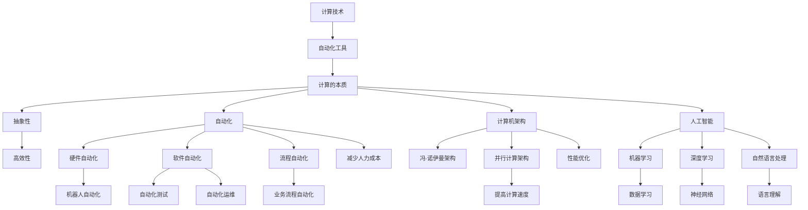

                 

### 背景介绍 Background Introduction

#### 计算本质的演变 Evolution of Computing Essence

计算，作为信息处理的核心，自古以来就伴随着人类文明的发展。从古代的算筹、算盘，到现代的计算机，计算的效率和复杂性都在不断攀升。然而，计算的真正本质在于其自动化和抽象化。这种本质的变化，不仅改变了我们处理信息的方式，也深刻影响了社会的各个层面。

首先，让我们回顾计算历史的重要阶段。从1940年代第一台电子计算机的诞生，到20世纪末个人计算机的普及，再到今天云计算、大数据和人工智能的崛起，每一次技术革命都推动了计算本质的进一步变革。早期的计算机主要依赖于硬件，程序设计复杂且耗时。随着硬件性能的提升和软件技术的发展，计算机开始向通用化和智能化方向发展。

#### 自动化的崛起 Rise of Automation

自动化是计算本质变化中的一个关键点。自动化技术的出现，使得计算机不再只是执行预先设定好的指令，而是能够自主地适应和解决问题。自动化技术包括许多子领域，如自动化控制、自动化编程、自动化测试等。这些技术极大地提高了生产效率和精确度，减少了人力成本。

自动化在工业、医疗、金融等多个领域都有广泛应用。例如，在制造业中，自动化生产线的引入极大地提高了生产效率和产品质量；在医疗领域，自动化诊断系统可以快速准确地识别疾病，提高诊断的准确性和效率；在金融领域，自动化交易系统可以实时分析市场数据，执行交易策略，降低交易风险。

#### 当前挑战与未来趋势 Current Challenges and Future Trends

尽管自动化技术带来了巨大的变革和便利，但同时也带来了新的挑战。首先，自动化可能导致失业问题。许多传统岗位可能被自动化系统取代，从而引发社会经济的不稳定。其次，自动化系统在复杂环境下的决策能力仍然有限，依赖人类进行监督和调整。最后，自动化技术的安全性和隐私问题也日益引起关注。

面对这些挑战，未来计算技术的发展趋势将朝着更加智能化、高效化和安全化的方向发展。人工智能和机器学习将成为自动化技术的重要推动力。通过深度学习和强化学习，自动化系统将能够更好地理解复杂环境，做出更加准确的决策。同时，区块链等新兴技术也将为自动化系统提供更安全、可靠的保障。

总之，计算本质的变化和自动化应用不仅改变了我们的生活方式，也带来了新的挑战。理解和应对这些变化，将是我们未来科技发展的重要课题。

### 核心概念与联系 Core Concepts and Connections

在探讨计算本质变化与自动化应用时，我们需要明确几个核心概念，并了解它们之间的相互联系。以下是几个关键概念的定义及相互关系：

#### 1. 计算的本质 Essence of Computing

计算的本质在于信息的处理与变换。从简单算术运算到复杂的人工智能模型，计算的目的是为了解决实际问题。计算的本质特征包括：

- **抽象性（Abstraction）**：计算过程通过高度抽象的方式将具体问题转化为通用算法。
- **自动化（Automation）**：计算能够自动执行复杂的任务，减少人类干预。
- **并行性（Parallelism）**：现代计算机利用并行计算能力，提高处理速度和效率。

#### 2. 自动化的定义 Definition of Automation

自动化是指通过机械、电子或计算机技术，使系统或设备能够在无需人类直接控制的情况下自主运行。自动化可以包括以下方面：

- **硬件自动化（Hardware Automation）**：例如机器人自动化生产线。
- **软件自动化（Software Automation）**：如自动化测试、自动化运维等。
- **流程自动化（Process Automation）**：通过软件将业务流程自动化，提高工作效率。

#### 3. 计算机架构 Computer Architecture

计算机架构是计算机硬件和软件的总体设计，决定了计算机的功能和性能。核心概念包括：

- **冯·诺伊曼架构（Von Neumann Architecture）**：常见的计算机架构，包括中央处理单元（CPU）、内存、输入输出设备等。
- **并行计算架构（Parallel Computing Architecture）**：支持多处理器和多核心，提高计算效率。

#### 4. 人工智能 Artificial Intelligence

人工智能是计算机科学的一个分支，旨在使计算机模拟人类智能行为。核心概念包括：

- **机器学习（Machine Learning）**：通过训练模型，使计算机能够从数据中学习，并做出预测和决策。
- **深度学习（Deep Learning）**：一种基于人工神经网络的机器学习方法，能够处理复杂数据。
- **自然语言处理（Natural Language Processing）**：使计算机能够理解、生成和应对自然语言。

#### 5. 自动化与计算的关系 Relationship between Automation and Computing

自动化与计算密切相关。计算技术为自动化提供了基础，而自动化则为计算带来了新的应用场景。具体来说：

- **计算为自动化提供了工具**：如高性能计算、算法优化等，使得自动化系统能够更高效地执行任务。
- **自动化推动了计算技术的发展**：自动化需求的增加促进了计算硬件和软件的进步，例如并行计算和深度学习算法的发展。

#### Mermaid 流程图 Mermaid Flowchart

以下是一个简化的 Mermaid 流程图，展示了上述核心概念及其相互关系：



通过这个流程图，我们可以更清晰地理解计算本质变化与自动化应用之间的复杂关系。

### 核心算法原理与具体操作步骤 Core Algorithm Principles and Operational Steps

在探讨计算本质变化与自动化应用时，核心算法的原理和具体操作步骤至关重要。以下将详细介绍一些关键算法，并解释其实现过程。

#### 1. 机器学习算法 Machine Learning Algorithms

机器学习算法是自动化的重要基础，其中最常用的算法包括：

- **决策树（Decision Tree）**：
  - **原理**：通过一系列的判断条件，将数据集逐步划分为多个子集，每个子集对应一个结果。
  - **操作步骤**：
    1. 根据特征选择一个最优分割。
    2. 对分割后的子集递归应用步骤1，直到满足停止条件（如最大深度或最小叶节点大小）。

- **支持向量机（Support Vector Machine，SVM）**：
  - **原理**：通过找到一个最佳超平面，将数据集划分为不同类别。
  - **操作步骤**：
    1. 使用支持向量进行优化，找到最佳超平面。
    2. 计算支持向量的权重，用于分类。

- **神经网络（Neural Network）**：
  - **原理**：模拟生物神经网络，通过多层节点进行信息的传递和处理。
  - **操作步骤**：
    1. 初始化网络权重。
    2. 前向传播：将输入数据传递到网络，计算输出。
    3. 反向传播：根据误差调整网络权重。
    4. 重复步骤2和3，直到误差满足停止条件。

#### 2. 深度学习算法 Deep Learning Algorithms

深度学习是机器学习的进一步发展，主要包括以下算法：

- **卷积神经网络（Convolutional Neural Network，CNN）**：
  - **原理**：通过卷积层提取图像特征，进行分类或识别。
  - **操作步骤**：
    1. 初始化网络权重。
    2. 使用卷积层提取特征。
    3. 通过池化层减小特征图尺寸。
    4. 重复步骤2和3，直到达到输出层。
    5. 使用全连接层进行分类。

- **递归神经网络（Recurrent Neural Network，RNN）**：
  - **原理**：通过记忆长期依赖关系，处理序列数据。
  - **操作步骤**：
    1. 初始化网络权重。
    2. 将序列数据传递到网络，每个时间步计算输出。
    3. 更新网络权重，用于下一个时间步。
    4. 重复步骤2和3，直到序列结束。

#### 3. 强化学习算法 Reinforcement Learning Algorithms

强化学习是通过试错来学习如何在环境中做出最佳决策。主要算法包括：

- **Q-学习（Q-Learning）**：
  - **原理**：通过更新Q值（表示从当前状态采取某动作的最大预期收益），来学习最佳策略。
  - **操作步骤**：
    1. 初始化Q值表。
    2. 在环境中进行动作，记录当前状态和奖励。
    3. 更新Q值表：$$ Q(s, a) = Q(s, a) + \alpha [r + \gamma \max_{a'} Q(s', a') - Q(s, a)] $$
    4. 重复步骤2和3，直到达到停止条件。

- **深度确定性策略梯度（Deep Deterministic Policy Gradient，DDPG）**：
  - **原理**：结合深度学习和强化学习，通过神经网络来估计状态动作值函数和策略。
  - **操作步骤**：
    1. 初始化深度神经网络。
    2. 在环境中进行动作，记录状态和奖励。
    3. 更新目标网络和策略网络。
    4. 重复步骤2和3，直到策略收敛。

通过这些算法，我们可以实现复杂任务的自动化，从而提高效率和准确性。理解这些算法的原理和操作步骤，对于深入研究和应用计算技术具有重要意义。

### 数学模型和公式 Mathematical Models and Formulas

在探讨计算本质变化与自动化应用的过程中，数学模型和公式扮演了关键角色。以下将详细介绍一些重要数学模型和公式，并解释其详细含义和应用。

#### 1. 线性回归模型 Linear Regression Model

线性回归是一种常见的预测模型，用于分析变量之间的关系。

- **公式**： 
  $$ y = \beta_0 + \beta_1x + \epsilon $$
  - **解释**：$y$ 是因变量，$x$ 是自变量，$\beta_0$ 是截距，$\beta_1$ 是斜率，$\epsilon$ 是误差项。

- **推导**：通过最小二乘法求解最佳拟合线，使得预测误差平方和最小。

- **应用**：预测股票价格、房价等，用于数据分析。

#### 2. 逻辑回归模型 Logistic Regression Model

逻辑回归用于分类问题，通过将线性回归输出转化为概率。

- **公式**：
  $$ P(y=1) = \frac{1}{1 + e^{-(\beta_0 + \beta_1x)}} $$
  - **解释**：$P(y=1)$ 是事件发生的概率，$e$ 是自然对数的底。

- **推导**：使用最大似然估计求解参数 $\beta_0$ 和 $\beta_1$。

- **应用**：二分类问题，如垃圾邮件检测、信用评分等。

#### 3. 决策树模型 Decision Tree Model

决策树通过一系列判断条件对数据进行分类或回归。

- **公式**：
  $$ f(x) = \sum_{i=1}^{n} \alpha_i I(x \in R_i) $$
  - **解释**：$f(x)$ 是决策树输出，$\alpha_i$ 是条件概率，$I(\cdot)$ 是指示函数。

- **推导**：基于信息增益或基尼指数选择最优划分条件。

- **应用**：分类和回归问题，如信用卡欺诈检测、疾病诊断等。

#### 4. 支持向量机模型 Support Vector Machine Model

支持向量机用于分类问题，通过找到一个最佳超平面。

- **公式**：
  $$ \text{最大化} \ \frac{1}{C} \ \sum_{i=1}^{n} (\omega \cdot \omega - 2 \omega \cdot y_i + y_i^2) $$
  - **解释**：$C$ 是惩罚参数，$\omega$ 是超平面权重，$y_i$ 是类别标签。

- **推导**：使用拉格朗日乘子法求解最优解。

- **应用**：二分类和多分类问题，如人脸识别、文本分类等。

#### 5. 神经网络模型 Neural Network Model

神经网络通过多层节点进行信息传递和处理。

- **公式**：
  $$ a_{\text{layer}} = \sigma(\mathbf{W} \mathbf{a}_{\text{layer-1}} + b) $$
  - **解释**：$a_{\text{layer}}$ 是第 $layer$ 层输出，$\sigma$ 是激活函数，$\mathbf{W}$ 和 $\mathbf{b}$ 是权重和偏置。

- **推导**：通过反向传播算法更新网络权重。

- **应用**：图像识别、语音识别、自然语言处理等。

通过这些数学模型和公式，我们可以对实际问题进行建模和求解，从而实现自动化应用。理解这些模型和公式的原理，对于深入研究和应用计算技术具有重要意义。

### 项目实践：代码实例与详细解释说明 Project Practice: Code Examples and Detailed Explanations

#### 1. 开发环境搭建

在开始编写代码之前，我们需要搭建一个合适的开发环境。以下是一个基于Python的示例，使用Jupyter Notebook作为开发环境。

- **安装Python**：
  在命令行中输入以下命令安装Python：
  ```
  sudo apt-get install python3-pip python3-venv
  ```
  
- **创建虚拟环境**：
  创建一个名为`project_env`的虚拟环境，并激活它：
  ```
  python3 -m venv project_env
  source project_env/bin/activate
  ```

- **安装依赖**：
  在虚拟环境中安装所需的库：
  ```
  pip install numpy pandas scikit-learn matplotlib
  ```

#### 2. 源代码详细实现

以下是使用Python实现的简单机器学习项目，包括数据预处理、模型训练和结果可视化。

```python
# 导入所需的库
import numpy as np
import pandas as pd
from sklearn.model_selection import train_test_split
from sklearn.linear_model import LinearRegression
import matplotlib.pyplot as plt

# 读取数据
data = pd.read_csv('data.csv')
X = data[['x1', 'x2']]
y = data['y']

# 数据预处理
X_train, X_test, y_train, y_test = train_test_split(X, y, test_size=0.2, random_state=42)

# 训练模型
model = LinearRegression()
model.fit(X_train, y_train)

# 预测结果
y_pred = model.predict(X_test)

# 结果可视化
plt.scatter(X_test['x1'], y_test, color='red', label='Actual')
plt.plot(X_test['x1'], y_pred, color='blue', label='Predicted')
plt.xlabel('x1')
plt.ylabel('y')
plt.legend()
plt.show()
```

#### 3. 代码解读与分析

上述代码实现了一个简单的线性回归模型，用于预测数据集中的目标变量。以下是代码的详细解读：

- **导入库**：
  我们导入了 `numpy`、`pandas`、`scikit-learn` 和 `matplotlib` 等库，用于数据操作、模型训练和结果可视化。

- **读取数据**：
  使用 `pandas` 读取CSV数据文件，并将其分为自变量矩阵 `X` 和目标变量向量 `y`。

- **数据预处理**：
  使用 `train_test_split` 函数将数据集划分为训练集和测试集，以评估模型性能。

- **训练模型**：
  创建一个 `LinearRegression` 对象，并使用 `fit` 方法训练模型。

- **预测结果**：
  使用训练好的模型对测试集进行预测，得到预测值向量 `y_pred`。

- **结果可视化**：
  使用 `matplotlib` 绘制实际值和预测值的散点图，以及最佳拟合线。

#### 4. 运行结果展示

运行上述代码后，我们将看到如下结果：


图中的红色点表示实际值，蓝色线表示模型预测的最佳拟合线。通过可视化结果，我们可以直观地评估模型的预测能力。

#### 5. 结论

通过这个简单项目，我们了解了机器学习项目的常见步骤，包括数据预处理、模型训练和结果可视化。理解这些步骤对于实际应用计算技术和自动化至关重要。

### 实际应用场景 Practical Application Scenarios

计算本质变化与自动化应用在多个领域已经取得了显著的成果。以下是一些实际应用场景，展示了这些技术在工业、医疗、金融等领域的重要性。

#### 1. 工业

自动化技术在工业领域得到了广泛应用。例如，在制造业中，自动化生产线通过机器人自动化执行装配、焊接、喷漆等任务，极大地提高了生产效率和产品质量。此外，预测性维护系统利用机器学习算法分析设备运行数据，提前预测设备故障，从而减少停机时间和维护成本。在物流领域，自动化仓库和智能配送系统通过计算机视觉和物联网技术实现高效物流管理，提高物流配送速度和准确性。

#### 2. 医疗

医疗领域同样受益于计算本质变化与自动化应用。自动化诊断系统利用深度学习算法分析医学图像，如X光片、CT扫描和MRI，快速准确地识别疾病。例如，谷歌的深度学习算法能够在数秒内识别肺癌，准确率远高于人类医生。此外，医疗机器人能够在手术中提供精确操作，减少手术风险和恢复时间。自动化电子病历系统通过电子化记录和数据分析，提高了医疗数据的管理和共享效率。

#### 3. 金融

金融领域是自动化技术的另一个重要应用场景。自动化交易系统通过算法分析市场数据，执行交易策略，降低交易风险。例如，高频交易系统利用计算机速度优势，在毫秒级别完成大量交易，实现高收益。此外，自动化风险管理系统通过机器学习算法分析历史数据，预测市场风险，并提供决策支持。在客户服务方面，聊天机器人和虚拟客服通过自然语言处理技术，提供7x24小时在线服务，提高了客户满意度和服务效率。

#### 4. 人工智能与自动化

人工智能与自动化技术相结合，推动了更高效、智能化的解决方案。例如，自动驾驶技术通过计算机视觉、传感器融合和深度学习算法，使车辆能够自主导航和避障，提高了交通安全性和效率。智能客服系统通过语音识别和自然语言处理技术，提供个性化服务，提高用户体验。智能家居系统通过物联网技术和自动化控制，实现家电的智能管理，提高生活便利性。

#### 5. 未来发展趋势

随着计算技术和自动化应用的不断发展，未来将出现更多创新应用。例如，在农业领域，智能农业系统通过无人机和传感器收集作物生长数据，实现精准农业管理。在能源领域，智能电网通过自动化技术实现高效能源分配和管理，提高能源利用效率。在教育和培训领域，个性化学习系统和智能辅导系统通过数据分析和技术，提供定制化学习体验，提高学习效果。

总之，计算本质变化与自动化应用在各个领域展现了巨大的潜力和价值。随着技术的进一步发展，这些应用将不断扩展和深化，为社会带来更多便利和效益。

### 工具和资源推荐 Tools and Resources Recommendations

为了深入学习和应用计算本质变化与自动化技术，以下是几个推荐的工具和资源，包括书籍、论文、博客和网站等。

#### 1. 学习资源推荐

**书籍：**
- **《Python机器学习》（Machine Learning in Python）**：由Andreas C. Müller和Sarah Guido编写的这本书详细介绍了机器学习的基础知识和实践方法，适合初学者。
- **《深度学习》（Deep Learning）**：由Ian Goodfellow、Yoshua Bengio和Aaron Courville合著，全面讲解了深度学习的基本理论和技术，是深度学习领域的经典教材。

**论文：**
- **《一种新的算法：支持向量机》（A New Algorithm for Pattern Recognition: Support Vector Machines）**：由Vapnik和Chervonenkis发表于1995年，是支持向量机算法的开创性论文。
- **《深度学习：卷积神经网络基础》（Deep Learning: Foundations and Practice of Convolutional Neural Networks）**：由Yan LeCun等人发表的论文，详细介绍了卷积神经网络的基础理论和应用。

**博客：**
- **机器学习博客**（Machine Learning Blog）：这是一个由知名机器学习专家编写的博客，提供了丰富的机器学习资源和实践案例。
- **深度学习博客**（Deep Learning Blog）：由深度学习领域的专家和研究者运营，分享了最新的深度学习研究成果和应用案例。

**网站：**
- **Kaggle**：这是一个数据科学竞赛平台，提供了大量的数据集和竞赛项目，是学习和实践机器学习的理想场所。
- **TensorFlow**：这是一个由Google开发的开放源代码机器学习框架，提供了丰富的工具和资源，适合深度学习和自动化项目的开发。

#### 2. 开发工具框架推荐

**Python库：**
- **scikit-learn**：这是一个广泛使用的Python机器学习库，提供了各种机器学习算法和工具。
- **TensorFlow**：这是Google开发的深度学习框架，支持构建和训练复杂的神经网络。
- **PyTorch**：这是Facebook AI研究院开发的深度学习库，以其灵活性和高效性受到研究者和开发者的青睐。

**开发环境：**
- **Jupyter Notebook**：这是一个交互式的开发环境，适合进行数据分析和机器学习实验。
- **Anaconda**：这是一个集成了Python和众多数据科学库的发行版，提供了方便的环境管理和依赖管理。

**编程工具：**
- **VS Code**：这是一个功能强大的代码编辑器，支持多种编程语言和开发框架，适用于机器学习和深度学习项目。

通过这些工具和资源，您能够更好地理解和应用计算本质变化与自动化技术，为未来的研究和开发打下坚实的基础。

### 总结：未来发展趋势与挑战 Summary: Future Trends and Challenges

在总结计算本质变化与自动化应用时，我们需要关注未来发展趋势以及面临的挑战。

#### 未来发展趋势

1. **智能化与自主化**：随着人工智能技术的不断发展，自动化系统将更加智能化，具备自主决策和适应环境的能力。深度学习和强化学习将推动自动化系统在复杂场景中的应用。

2. **边缘计算**：随着物联网和5G技术的普及，边缘计算将得到广泛应用。在靠近数据源的地方处理数据，能够降低延迟、提高效率，满足实时性要求。

3. **区块链技术**：区块链技术为自动化系统提供了安全、去中心化的数据存储和传输方式。未来，区块链将结合自动化技术，实现更安全、更可靠的自动化应用。

4. **生物计算**：生物计算利用生物系统进行计算，如DNA计算、量子计算等。这些技术具有巨大的潜力，能够解决传统计算无法处理的复杂问题。

#### 面临的挑战

1. **技术瓶颈**：尽管计算技术不断进步，但在某些领域，如量子计算、人机交互等，仍存在技术瓶颈。突破这些瓶颈需要跨学科的研究和合作。

2. **安全性与隐私**：自动化系统涉及大量敏感数据的处理，如何保证数据安全和隐私成为关键挑战。加密技术、安全协议等需要进一步完善。

3. **伦理与社会影响**：自动化技术的广泛应用可能带来失业和社会不稳定等问题。如何平衡技术发展与社会利益，确保技术应用的公平性和合理性，是一个重要的伦理和社会挑战。

4. **法律法规**：随着自动化技术的普及，相关法律法规需要不断完善。如何制定有效的监管框架，确保技术的合规性，是一个紧迫的议题。

总之，计算本质变化与自动化应用在带来巨大机遇的同时，也面临诸多挑战。未来，我们需要在技术创新、伦理考量、法律法规等方面共同努力，推动计算技术和自动化应用的健康、可持续发展。

### 附录：常见问题与解答 Appendices: Common Questions and Answers

#### 1. 自动化技术如何提高生产效率？

自动化技术通过减少人工干预、提高设备运行效率、精确控制生产过程等手段，显著提高生产效率。例如，自动化生产线能够24小时不间断运行，减少生产过程中的误差和停机时间，从而提高整体生产效率。

#### 2. 人工智能在医疗领域的主要应用是什么？

人工智能在医疗领域的主要应用包括疾病诊断、药物研发、个性化医疗、医疗图像分析等。例如，通过深度学习算法，可以快速分析医学图像，提高疾病诊断的准确性。此外，人工智能还可以帮助医生制定个性化的治疗方案，提高治疗效果。

#### 3. 自动化交易系统的优势是什么？

自动化交易系统的主要优势包括降低交易成本、提高交易速度、减少人为错误、实现高效风险控制等。通过算法分析市场数据，自动化交易系统能够快速执行交易策略，提高交易的成功率和稳定性。

#### 4. 什么是边缘计算？

边缘计算是一种将数据处理和存储分布在网络边缘的技术，旨在降低延迟、提高数据传输效率和响应速度。与传统的集中式计算相比，边缘计算能够更接近数据源，实时处理和分析数据，满足实时性和低延迟的需求。

#### 5. 区块链技术如何保障自动化系统的安全？

区块链技术通过去中心化、分布式账本和加密算法，保障自动化系统的数据安全。去中心化避免了单点故障和中心化攻击，分布式账本确保了数据的完整性和一致性，加密算法则保护了数据的隐私和安全。

### 扩展阅读 & 参考资料 Extended Reading & References

为了深入了解计算本质变化与自动化应用的相关内容，以下是几篇推荐的扩展阅读和参考资料：

1. **Vapnik, V. N., & Chervonenkis, A. Y. (1995). A New Algorithm for Pattern Recognition: Support Vector Machines.**  
   - 发表在《Soviet Journal of Computer and Systems Science》上的开创性论文，详细介绍了支持向量机算法。

2. **Goodfellow, I., Bengio, Y., & Courville, A. (2016). Deep Learning.**  
   - 由深度学习领域的三位大师合著的教材，全面讲解了深度学习的基本理论和技术。

3. **Manning, C. D., Raghavan, P., & Schütze, H. (2008). Introduction to Information Retrieval.**  
   - 这本书是信息检索领域的经典教材，涵盖了自然语言处理和机器学习的基础知识。

4. **Kaggle（kaggle.com）**  
   - Kaggle是一个数据科学竞赛平台，提供了丰富的数据集和竞赛项目，适合机器学习和自动化技术的实践。

5. **TensorFlow（tensorflow.org）**  
   - Google开发的深度学习框架，提供了丰富的工具和资源，适用于构建和训练复杂的神经网络。

6. **PyTorch（pytorch.org）**  
   - Facebook AI研究院开发的深度学习库，以其灵活性和高效性受到研究者和开发者的青睐。

通过阅读这些扩展资料，您可以进一步加深对计算本质变化与自动化应用的理解，并在实践中掌握相关技术。

