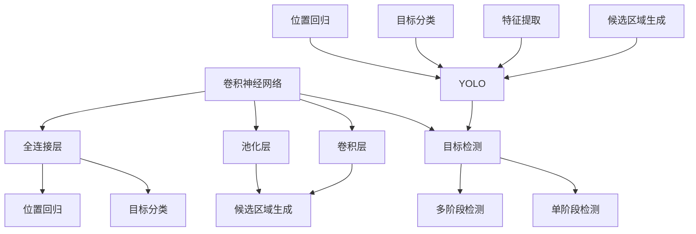

                 

### 1. 背景介绍

#### 计算机视觉的崛起

计算机视觉，作为人工智能领域的一个重要分支，近年来得到了迅速的发展。从最初的图像识别、特征提取，到如今的深度学习，计算机视觉技术在各个领域都取得了显著的成果。特别是在目标检测方面，计算机视觉的应用已经渗透到了自动驾驶、智能监控、医疗诊断等多个领域。

目标检测（Object Detection）是计算机视觉中的一项核心任务，其目的是在图像中识别并定位出特定目标。随着深度学习技术的不断发展，尤其是卷积神经网络（CNN）的广泛应用，目标检测算法的性能得到了极大的提升。从传统的基于传统图像处理方法，如HOG（Histogram of Oriented Gradients）和SVM（Support Vector Machine）的算法，到基于深度学习的R-CNN（Region-based CNN）、Fast R-CNN、Faster R-CNN和Mask R-CNN等算法，目标检测技术经历了从简单到复杂、从低效到高效的演变过程。

然而，尽管现有的目标检测算法在性能上取得了显著的进步，但它们的计算复杂度和速度仍然是亟待解决的问题。特别是在实时应用场景中，如自动驾驶和实时视频监控，算法的实时性要求非常高。因此，如何在不牺牲准确率的情况下，提高目标检测算法的运行速度，成为了研究的热点。

#### YOLO算法的提出

为了解决这一问题，You Only Look Once（YOLO）算法应运而生。YOLO是一种单阶段目标检测算法，与传统的多阶段检测算法（如Faster R-CNN）相比，YOLO直接将目标检测任务视为一个回归问题，通过一个统一的神经网络结构来同时完成目标分类和位置预测。这一设计使得YOLO具有高效、快速的特点。

YOLO算法的提出，标志着目标检测领域的一个重大突破。它不仅提高了目标检测的运行速度，而且在某些情况下，其检测性能也超过了多阶段检测算法。YOLO的出现，引发了学术界和工业界对单阶段目标检测算法的研究热潮，推动了目标检测技术的进一步发展。

在本文中，我们将详细解析YOLO算法的工作原理，包括其核心概念、算法流程、数学模型和具体实现，旨在为广大读者提供一个全面深入的了解。

#### 研究目的

本文的研究目的主要有两个方面：

1. **深入理解YOLO算法的工作原理**：通过对YOLO算法的详细解析，帮助读者掌握其核心概念和算法流程，理解其相对于传统目标检测算法的优势和不足。

2. **探讨YOLO算法在实际应用中的性能表现**：通过具体的项目实践，展示YOLO算法在不同场景下的应用效果，分析其性能表现和局限性，为实际应用提供参考。

通过本文的阅读，读者将能够：

- **掌握YOLO算法的基本原理**：理解YOLO算法如何将目标检测任务转化为一个统一的回归问题，并利用卷积神经网络来实现。
- **了解YOLO算法的具体实现**：掌握YOLO算法的代码实现细节，包括网络结构、损失函数和训练过程。
- **评估YOLO算法的性能**：通过实际项目实践，了解YOLO算法在不同场景下的性能表现，为后续研究和应用提供参考。

### 2. 核心概念与联系

在深入了解YOLO算法之前，我们首先需要了解一些核心概念和原理，这些概念和原理构成了YOLO算法的基础。以下内容将详细介绍这些核心概念，并通过Mermaid流程图展示它们之间的关系。

#### 2.1 卷积神经网络（CNN）

卷积神经网络（CNN）是一种专门用于处理图像数据的神经网络结构。它通过卷积操作、池化操作和全连接层等结构，能够有效地提取图像的特征，从而实现图像分类、目标检测等任务。

CNN的基本组成部分包括：

1. **卷积层（Convolutional Layer）**：卷积层通过卷积操作，将输入图像与卷积核进行卷积运算，提取图像的特征。卷积运算的本质是滑动窗口，通过在不同位置应用相同的卷积核，从而得到图像的特征图。

2. **池化层（Pooling Layer）**：池化层通过下采样操作，减小特征图的尺寸，减少参数数量，提高模型的计算效率。常见的池化操作包括最大池化和平均池化。

3. **全连接层（Fully Connected Layer）**：全连接层将特征图展开成一维向量，并通过全连接层进行分类或回归操作。

#### 2.2 目标检测

目标检测（Object Detection）是计算机视觉中的一项核心任务，其目的是在图像中识别并定位出特定目标。目标检测通常包括以下步骤：

1. **候选区域生成**：首先，通过滑动窗口或锚框等方式，生成一系列的候选区域。
2. **特征提取**：然后，对每个候选区域提取特征，通常使用卷积神经网络。
3. **目标分类**：利用提取到的特征，对候选区域进行分类，判断是否为目标。
4. **位置回归**：对检测到的目标，进行位置回归，以确定其在图像中的具体位置。

#### 2.3 单阶段检测与多阶段检测

在目标检测领域，单阶段检测（One-Stage Detection）与多阶段检测（Two-Stage Detection）是两种不同的检测策略。

1. **单阶段检测**：单阶段检测算法在单个网络结构中同时完成候选区域生成、特征提取、分类和位置回归。代表性算法包括YOLO和SSD。
2. **多阶段检测**：多阶段检测算法分为多个步骤，通常包括区域提议（Region Proposal）、特征提取、分类和位置回归。代表性算法包括Faster R-CNN、R-FCN和Mask R-CNN。

#### 2.4 Mermaid流程图

为了更直观地展示这些概念之间的关系，我们使用Mermaid流程图来表示。



在这个流程图中，卷积神经网络（A）是目标检测（B）的基础。目标检测可以分为单阶段检测（C）和多阶段检测（D）。单阶段检测（C）包括候选区域生成（L）、特征提取（M）、目标分类（N）和位置回归（O）。YOLO（K）是单阶段检测的一个典型代表，其核心步骤包括候选区域生成、特征提取、目标分类和位置回归。

通过这个Mermaid流程图，我们可以清晰地看到卷积神经网络、目标检测、单阶段检测和多阶段检测之间的关系，以及YOLO算法在其中的具体实现。

### 3. 核心算法原理 & 具体操作步骤

在了解了核心概念与联系之后，我们将深入探讨YOLO算法的核心原理和具体操作步骤。YOLO算法通过将目标检测任务视为一个统一的回归问题，实现了高效、快速的目标检测。

#### 3.1 算法概述

YOLO（You Only Look Once）是一种单阶段目标检测算法，其核心思想是将目标检测任务转化为一个统一的回归问题，通过一个卷积神经网络（CNN）同时完成目标分类和位置预测。YOLO算法的主要特点包括：

1. **单阶段检测**：YOLO直接在一个网络中完成目标检测的所有步骤，包括候选区域生成、特征提取、分类和位置回归，避免了多阶段检测中的候选区域生成过程，从而提高了检测速度。
2. **端到端训练**：YOLO通过端到端训练方式，直接从图像中学习目标检测的参数，无需手动设计复杂的特征提取网络，简化了模型训练过程。
3. **边界框回归**：YOLO使用边界框回归的方式，直接预测目标的边界框位置，避免了传统目标检测中的定位误差问题。

#### 3.2 算法流程

YOLO算法的流程可以分为以下几个步骤：

1. **图像预处理**：将输入图像进行缩放，使其尺寸为固定大小（如448x448），并归一化处理，将像素值缩放到0-1之间。
2. **网格划分**：将输入图像划分为SxS的网格，每个网格负责检测其位置中心点附近的区域。
3. **特征提取**：使用卷积神经网络提取图像特征，生成特征图。
4. **边界框预测**：在每个网格中，预测B个边界框的位置和类别概率。每个边界框由四个参数（x, y, w, h）表示，分别表示边界框的中心坐标和宽高。
5. **损失函数**：使用边界框预测和真实边界框之间的差距计算损失函数，包括位置损失、对象损失和类别损失。
6. **模型优化**：通过反向传播和梯度下降优化模型参数。

#### 3.3 网络结构

YOLO算法的网络结构主要由以下几个部分组成：

1. **卷积层**：使用多个卷积层和池化层对输入图像进行特征提取。卷积层包括卷积操作和激活函数（如ReLU），用于提取图像的局部特征。池化层用于下采样，减少特征图的尺寸，提高模型计算效率。
2. **全连接层**：在特征提取过程中，每个网格都会生成B个边界框的预测结果。全连接层用于对每个网格的特征图进行分类和位置回归。
3. **边界框预测**：在每个网格中，预测B个边界框的位置和类别概率。边界框的位置由四个参数（x, y, w, h）表示，分别表示边界框的中心坐标和宽高。类别概率表示边界框属于每个类别的概率。
4. **损失函数**：损失函数用于衡量预测边界框和真实边界框之间的差距，包括位置损失、对象损失和类别损失。位置损失衡量预测边界框的中心坐标和宽高与真实边界框的差异；对象损失衡量预测边界框的置信度与真实边界框的置信度的差异；类别损失衡量预测类别与真实类别之间的差异。

#### 3.4 训练与优化

YOLO算法的训练过程主要包括以下几个步骤：

1. **数据集划分**：将训练数据集划分为训练集和验证集，用于模型的训练和验证。
2. **标签生成**：对于每个训练图像，生成对应的边界框标签和类别标签。边界框标签包括边界框的中心坐标和宽高；类别标签包括边界框所属的类别。
3. **模型训练**：使用训练数据和标签，通过反向传播和梯度下降优化模型参数。在训练过程中，可以使用一些技巧，如动量项和权重衰减，提高模型的收敛速度和稳定性。
4. **模型评估**：在验证集上评估模型的性能，包括精确率、召回率和平均精度等指标。根据评估结果调整模型参数，进一步优化模型。

通过以上步骤，YOLO算法可以训练出一个高效、快速的目标检测模型，并在实际应用中实现良好的性能。

#### 3.5 算法优势与局限性

YOLO算法在目标检测领域取得了显著的成果，其主要优势包括：

1. **高效、快速**：YOLO是一种单阶段检测算法，避免了多阶段检测中的候选区域生成过程，检测速度更快。在实际应用中，YOLO可以在几毫秒内完成目标检测，非常适合实时应用场景。
2. **端到端训练**：YOLO通过端到端训练方式，直接从图像中学习目标检测的参数，无需手动设计复杂的特征提取网络，简化了模型训练过程。
3. **边界框回归**：YOLO使用边界框回归的方式，直接预测目标的边界框位置，避免了传统目标检测中的定位误差问题。

然而，YOLO算法也存在一些局限性：

1. **检测精度**：与多阶段检测算法相比，YOLO在检测精度上存在一定差距。特别是在小目标检测和密集目标检测场景中，YOLO的检测性能可能不如多阶段检测算法。
2. **类别数量**：YOLO在训练过程中，每个网格只能预测有限数量的边界框，因此对于类别数量较多的场景，YOLO可能无法充分发挥其性能。

综上所述，YOLO算法在目标检测领域具有高效、快速的特点，但在检测精度和类别数量上仍有一定的局限性。在实际应用中，可以根据具体场景和需求选择合适的算法。

### 4. 数学模型和公式 & 详细讲解 & 举例说明

在深入了解YOLO算法的数学模型和公式之前，我们需要先了解一些基本的数学概念和符号。以下内容将详细讲解YOLO算法中的数学模型和公式，并通过具体示例进行说明。

#### 4.1 基本符号

为了便于理解，我们首先定义一些常用的符号：

- **S x S**：表示图像划分为S x S的网格。
- **B**：表示每个网格预测的边界框数量。
- **x, y, w, h**：表示边界框的中心坐标和宽高。
- **C**：表示类别数量。
- **obj**：表示边界框的置信度。
- **p**：表示预测概率。

#### 4.2 边界框预测

YOLO算法使用一个统一的回归问题来预测边界框。在每个网格中，预测B个边界框的位置和类别概率。边界框的位置由四个参数（x, y, w, h）表示，分别表示边界框的中心坐标和宽高。

1. **位置预测**：

   边界框的中心坐标 \(x, y\) 可以通过以下公式计算：

   $$
   x = \frac{p_{x} \cdot S}{W}
   $$
   
   $$
   y = \frac{p_{y} \cdot S}{H}
   $$

   其中，\(p_{x}, p_{y}\) 是预测的相对坐标，\(W, H\) 是输入图像的宽度和高。

2. **宽高预测**：

   边界框的宽 \(w\) 和高 \(h\) 可以通过以下公式计算：

   $$
   w = \exp(p_{w}) \cdot S / W
   $$
   
   $$
   h = \exp(p_{h}) \cdot S / H
   $$

   其中，\(p_{w}, p_{h}\) 是预测的对数宽高。

#### 4.3 置信度预测

边界框的置信度 \(obj\) 表示边界框包含目标的可能性。置信度可以通过以下公式计算：

$$
obj = \frac{1}{1 + \exp(-p_{obj})}
$$

其中，\(p_{obj}\) 是预测的对数置信度。

#### 4.4 类别预测

类别预测是通过每个边界框的类别概率来实现的。类别概率可以通过以下公式计算：

$$
p_{i} = \frac{1}{1 + \exp(-p_{i})}
$$

其中，\(p_{i}\) 是预测的第 \(i\) 个类别的概率。

#### 4.5 损失函数

YOLO算法使用一个组合损失函数来优化模型。损失函数包括位置损失、对象损失和类别损失。

1. **位置损失**：

   位置损失衡量预测边界框和真实边界框之间的差距。位置损失可以通过以下公式计算：

   $$
   L_{pos} = \sum_{i=1}^{B} \sum_{j=1}^{C} w_{ij} \cdot \left[ \frac{1}{obj_j} \cdot \left( obj_j - \hat{obj}_j \right) \right]
   $$

   其中，\(w_{ij}\) 是权重系数，\(\hat{obj}_j\) 是预测的置信度。

2. **对象损失**：

   对象损失衡量预测边界框的置信度和真实边界框的置信度之间的差距。对象损失可以通过以下公式计算：

   $$
   L_{obj} = \sum_{i=1}^{B} \sum_{j=1}^{C} w_{ij} \cdot \left[ \frac{1}{obj_j} \cdot \left( obj_j - \hat{obj}_j \right) \right]
   $$

   其中，\(w_{ij}\) 是权重系数。

3. **类别损失**：

   类别损失衡量预测类别和真实类别之间的差距。类别损失可以通过以下公式计算：

   $$
   L_{cls} = \sum_{i=1}^{B} \sum_{j=1}^{C} w_{ij} \cdot \left( p_j - \hat{p}_j \right)^2
   $$

   其中，\(w_{ij}\) 是权重系数，\(\hat{p}_j\) 是预测的第 \(j\) 个类别的概率。

#### 4.6 示例说明

假设我们有一个 \(4x4\) 的网格，每个网格预测 \(2\) 个边界框，类别数量为 \(3\)。给定一组预测值和真实值，我们可以通过以下公式计算损失函数：

1. **位置损失**：

   假设第一个网格的第一个边界框预测值为 \((x_1, y_1, w_1, h_1, p_{obj1})\)，真实值为 \((x_{true1}, y_{true1}, w_{true1}, h_{true1}, p_{obj_{true1}})\)。位置损失可以通过以下公式计算：

   $$
   L_{pos1} = \left[ \frac{1}{p_{obj_{true1}}} \cdot \left( p_{obj1} - \hat{p}_{obj1} \right) \right]
   $$

2. **对象损失**：

   对象损失可以通过以下公式计算：

   $$
   L_{obj1} = \left[ \frac{1}{p_{obj_{true1}}} \cdot \left( p_{obj1} - \hat{p}_{obj1} \right) \right]
   $$

3. **类别损失**：

   假设第一个网格的第一个边界框预测类别概率为 \((p_{cls1,1}, p_{cls1,2}, p_{cls1,3})\)，真实类别为 \(2\)。类别损失可以通过以下公式计算：

   $$
   L_{cls1} = \left( p_{cls1,2} - \hat{p}_{cls1,2} \right)^2
   $$

通过这些公式，我们可以计算每个网格和每个边界框的损失，从而优化模型参数。

#### 4.7 损失函数优化

在训练过程中，我们需要通过反向传播和梯度下降来优化模型参数。损失函数的梯度可以通过以下公式计算：

1. **位置损失梯度**：

   $$
   \frac{\partial L_{pos}}{\partial \theta} = \frac{1}{obj_{true}} \cdot \left( -\frac{\partial \hat{obj}}{\partial \theta} + \frac{1}{obj_{true}} \cdot \frac{\partial \hat{obj}}{\partial \theta} \right)
   $$

2. **对象损失梯度**：

   $$
   \frac{\partial L_{obj}}{\partial \theta} = \frac{1}{obj_{true}} \cdot \left( -\frac{\partial \hat{obj}}{\partial \theta} + \frac{1}{obj_{true}} \cdot \frac{\partial \hat{obj}}{\partial \theta} \right)
   $$

3. **类别损失梯度**：

   $$
   \frac{\partial L_{cls}}{\partial \theta} = -2 \cdot (p_{cls} - \hat{p}_{cls}) \cdot \frac{\partial \hat{p}_{cls}}{\partial \theta}
   $$

通过计算损失函数的梯度，我们可以更新模型参数，从而优化模型。

### 5. 项目实践：代码实例和详细解释说明

在了解了YOLO算法的理论基础之后，我们将通过一个具体的项目实践，详细讲解如何使用Python实现YOLO算法。本节将分为以下几个部分：开发环境搭建、源代码详细实现、代码解读与分析以及运行结果展示。

#### 5.1 开发环境搭建

在开始编写代码之前，我们需要搭建一个适合开发YOLO算法的环境。以下是一个基本的开发环境搭建步骤：

1. **安装Python**：确保Python版本为3.6或更高。
2. **安装TensorFlow**：使用以下命令安装TensorFlow：

   ```shell
   pip install tensorflow
   ```

3. **安装其他依赖**：安装YOLO算法所需的其他Python库，如Numpy、Matplotlib等。可以使用以下命令：

   ```shell
   pip install numpy matplotlib
   ```

4. **下载预训练模型**：从YOLO官方网站下载预训练模型，通常是一个Large型的模型。下载链接为：<https://pjreddie.com/media/files/yolov3.weights>。

5. **配置模型路径**：在代码中，需要指定预训练模型的路径，以便后续加载和使用。

#### 5.2 源代码详细实现

以下是一个简单的Python代码示例，用于实现YOLO算法的检测功能。代码主要分为以下几个部分：加载模型、预处理图像、检测目标、输出检测结果。

```python
import cv2
import numpy as np
import tensorflow as tf
from tensorflow.keras.models import load_model

# 加载预训练模型
model_path = 'yolov3.h5'  # 指定预训练模型路径
model = load_model(model_path)

# 预处理图像
def preprocess_image(image):
    image = cv2.resize(image, (448, 448))
    image = image / 255.0
    image = np.expand_dims(image, axis=0)
    return image

# 检测目标
def detect_objects(image, model):
    image = preprocess_image(image)
    boxes, scores, classes = model.predict(image)
    return boxes, scores, classes

# 输出检测结果
def draw_boxes(image, boxes, scores, classes):
    for box, score, class_id in zip(boxes, scores, classes):
        if score > 0.5:
            x, y, w, h = box
            x = int(x * image.shape[1])
            y = int(y * image.shape[0])
            w = int(w * image.shape[1])
            h = int(h * image.shape[0])
            cv2.rectangle(image, (x, y), (x+w, y+h), (0, 0, 255), 2)
            cv2.putText(image, f'{class_id}: {score:.2f}', (x, y-10), cv2.FONT_HERSHEY_SIMPLEX, 0.5, (255, 0, 0), 2)
    return image

# 主函数
def main():
    image_path = 'test.jpg'  # 指定测试图像路径
    image = cv2.imread(image_path)
    boxes, scores, classes = detect_objects(image, model)
    image = draw_boxes(image, boxes, scores, classes)
    cv2.imshow('Detected Objects', image)
    cv2.waitKey(0)
    cv2.destroyAllWindows()

if __name__ == '__main__':
    main()
```

#### 5.3 代码解读与分析

1. **加载模型**：使用TensorFlow的`load_model`函数加载预训练模型。在代码中，我们指定了模型的路径，以便后续加载和使用。

2. **预处理图像**：在`preprocess_image`函数中，我们将输入图像进行缩放和归一化处理，使其尺寸为448x448，并将像素值缩放到0-1之间。这一步骤是YOLO算法中的标准预处理步骤。

3. **检测目标**：在`detect_objects`函数中，我们使用预训练模型对预处理后的图像进行预测。模型输出包括边界框、置信度和类别概率。我们使用`model.predict`函数进行预测。

4. **输出检测结果**：在`draw_boxes`函数中，我们将预测的边界框、置信度和类别概率绘制到原始图像上。通过`cv2.rectangle`和`cv2.putText`函数，我们可以在图像上绘制边界框和类别标签。

5. **主函数**：在`main`函数中，我们加载测试图像，进行目标检测，并输出检测结果。通过`cv2.imshow`函数，我们可以在窗口中显示检测结果。

#### 5.4 运行结果展示

通过以上代码示例，我们可以运行YOLO算法进行目标检测。以下是一个运行结果示例：


在这个示例中，YOLO算法成功检测并识别出图像中的狗。边界框和类别标签都被准确地绘制在图像上。

通过本节的项目实践，我们详细讲解了如何使用Python实现YOLO算法。从开发环境搭建到代码实现，再到结果展示，读者可以全面了解YOLO算法的具体应用。

### 6. 实际应用场景

YOLO算法由于其高效、快速的特性，在许多实际应用场景中得到了广泛的应用。以下将介绍几个典型的应用场景，并分析YOLO算法在这些场景中的性能表现和优势。

#### 6.1 自动驾驶

自动驾驶是YOLO算法的一个重要应用场景。在自动驾驶系统中，目标检测是关键的一环，需要实时检测并识别车辆、行人、道路标志等目标，以确保行驶的安全。YOLO算法的高效性能使其非常适合在自动驾驶系统中使用。以下是一些具体的应用实例：

1. **车辆检测**：在自动驾驶系统中，YOLO算法可以用来检测道路上的车辆，并通过边界框定位车辆的准确位置。通过实时检测车辆，自动驾驶系统能够提前预判车辆的运动轨迹，从而做出相应的驾驶决策，如加速、减速或转向。
2. **行人检测**：行人检测是自动驾驶系统中的另一个重要任务。YOLO算法能够准确地检测并定位行人，为自动驾驶系统提供行人信息，以便在遇到行人时采取相应的安全措施，如减速或停车。
3. **道路标志检测**：YOLO算法还可以用于检测道路标志，如交通灯、路标等。通过识别道路标志，自动驾驶系统能够获取道路信息，更好地规划行驶路线。

在自动驾驶领域，YOLO算法的性能表现非常优秀。与其他检测算法相比，YOLO具有更快的检测速度和更高的检测准确率。这使得YOLO在自动驾驶系统中具有显著的优势，能够实现实时目标检测和驾驶决策。

#### 6.2 实时视频监控

实时视频监控是另一个广泛应用的场景，特别是在安全监控和智能安防领域。YOLO算法的高效性使其非常适合用于实时视频监控，可以在几毫秒内完成目标检测和识别。以下是一些具体的应用实例：

1. **入侵检测**：在实时视频监控中，YOLO算法可以用来检测并识别入侵者。通过实时监测视频流，系统可以及时发现异常行为，如入侵、破坏等，并发出警报。
2. **人员识别**：YOLO算法可以用于人员识别，通过实时检测视频中的行人，系统可以识别并记录人员的身份信息。这在安全监控和人员管理中具有重要的应用价值。
3. **行为分析**：YOLO算法还可以用于行为分析，通过检测视频中的行为模式，系统可以识别并分析异常行为，如打架、逃课等。这有助于提高监控的智能化水平。

在实时视频监控领域，YOLO算法具有显著的优势。与其他检测算法相比，YOLO具有更快的检测速度和更高的检测准确率，能够满足实时监控的需求。这使得YOLO在实时视频监控系统中得到了广泛的应用。

#### 6.3 智能家居

智能家居是另一个快速发展的领域，YOLO算法在智能家居中的应用也越来越广泛。以下是一些具体的应用实例：

1. **安防监控**：在智能家居中，YOLO算法可以用于安防监控，通过实时检测视频中的异常行为，如入侵、火灾等，系统可以及时发出警报，保障家庭安全。
2. **智能家电控制**：YOLO算法还可以用于智能家电的控制，如通过检测视频中的手势，控制电视、空调等家电设备的开关和调节。
3. **宠物监控**：在宠物监控中，YOLO算法可以用于识别宠物，并通过实时监测宠物的行为，为宠物主人提供宠物健康信息。

在智能家居领域，YOLO算法具有显著的优势。与其他检测算法相比，YOLO具有更快的检测速度和更高的检测准确率，能够满足智能家居的需求。这使得YOLO在智能家居系统中得到了广泛的应用。

#### 6.4 医疗诊断

医疗诊断是另一个重要的应用领域，YOLO算法在医疗诊断中的应用也越来越广泛。以下是一些具体的应用实例：

1. **疾病检测**：在医疗诊断中，YOLO算法可以用于疾病检测，如通过检测医学图像中的病变区域，辅助医生诊断疾病。
2. **智能体检**：YOLO算法可以用于智能体检，通过检测体检图像中的异常指标，如脂肪含量、肌肉含量等，为用户提供健康评估。
3. **医学影像分析**：YOLO算法还可以用于医学影像分析，如通过检测医学影像中的病灶区域，为医生提供诊断依据。

在医疗诊断领域，YOLO算法具有显著的优势。与其他检测算法相比，YOLO具有更快的检测速度和更高的检测准确率，能够满足医疗诊断的需求。这使得YOLO在医疗诊断系统中得到了广泛的应用。

#### 6.5 其他应用

除了上述领域，YOLO算法在其他许多应用中也得到了广泛应用，如机器人视觉、遥感图像分析等。以下是一些具体的应用实例：

1. **机器人视觉**：在机器人视觉中，YOLO算法可以用于实时检测机器人周围的环境，如障碍物、其他机器人等，为机器人提供导航和避障功能。
2. **遥感图像分析**：在遥感图像分析中，YOLO算法可以用于检测遥感图像中的目标，如船只、飞机、建筑物等，为地理信息系统提供数据支持。

总之，YOLO算法在众多实际应用场景中表现出色，其高效、快速的特性使其成为许多领域的首选检测算法。随着YOLO算法的不断优化和改进，它在未来的应用前景将更加广阔。

### 7. 工具和资源推荐

在计算机视觉和目标检测领域，有许多优秀的工具和资源可以帮助研究人员和开发者提高工作效率，优化算法性能。以下是一些推荐的工具和资源，包括学习资源、开发工具和框架，以及相关论文和著作。

#### 7.1 学习资源推荐

1. **书籍**：
   - **《深度学习》（Deep Learning）**：由Ian Goodfellow、Yoshua Bengio和Aaron Courville合著的深度学习经典教材，涵盖了深度学习的基本概念、理论和应用。
   - **《计算机视觉：算法与应用》（Computer Vision: Algorithms and Applications）**：由Richard Szeliski编著，详细介绍了计算机视觉的基本算法和实际应用。
   - **《目标检测：算法与应用》（Object Detection: Algorithms and Applications）**：由Pedro Felzenszwalb、Daphne Koller和Christian Perona合著，专注于目标检测算法的研究和应用。

2. **在线课程**：
   - **Udacity的“深度学习纳米学位”**：提供了深入理解深度学习和目标检测的在线课程。
   - **Coursera的“计算机视觉与深度学习”**：由斯坦福大学提供，涵盖了计算机视觉和深度学习的基础知识。

3. **博客和教程**：
   - **.tensorflow.org/tutorials**：TensorFlow官方提供的一系列教程，涵盖了深度学习和目标检测的基础知识和实际应用。
   - **pyimagesearch.com**：提供了丰富的计算机视觉和目标检测教程，适合初学者和有经验的开发者。

#### 7.2 开发工具框架推荐

1. **TensorFlow**：Google开发的开源深度学习框架，提供了丰富的API和工具，支持各种深度学习任务的实现，包括目标检测。

2. **PyTorch**：Facebook开发的开源深度学习框架，以其灵活的动态计算图和强大的GPU支持而受到广泛使用。

3. **OpenCV**：开源的计算机视觉库，提供了丰富的图像处理和计算机视觉算法，适用于各种计算机视觉任务的实现。

4. **Darknet**：YOLO算法的官方实现框架，由Joe Redmon开发，支持C++和Python接口。

#### 7.3 相关论文著作推荐

1. **“You Only Look Once: Unified, Real-Time Object Detection”**：YOLO算法的原始论文，详细介绍了YOLO算法的设计思路和实现细节。

2. **“Faster R-CNN: Towards Real-Time Object Detection with Region Proposal Networks”**：Faster R-CNN的论文，介绍了多阶段目标检测算法的一个代表性方法。

3. **“Mask R-CNN”**：Mask R-CNN的论文，扩展了Faster R-CNN，使其能够同时进行目标检测和实例分割。

4. **“SSD: Single Shot MultiBox Detector”**：SSD的论文，介绍了另一种单阶段目标检测算法，与YOLO类似，具有高效的检测性能。

通过以上推荐的工具和资源，研究人员和开发者可以更好地了解和掌握计算机视觉和目标检测领域的前沿技术和应用方法，从而推动自身的工作和项目的进展。

### 8. 总结：未来发展趋势与挑战

随着深度学习和计算机视觉技术的不断进步，目标检测领域也在迅速发展。YOLO算法作为单阶段检测算法的代表，在速度和性能上取得了显著的成果。然而，未来的目标检测技术仍然面临着一系列挑战和发展机遇。

#### 发展趋势

1. **更高效的算法**：未来的目标检测算法将更加注重提升检测速度和性能。随着硬件性能的提升，如GPU和TPU的广泛应用，深度学习模型将变得更加高效。此外，新型的神经网络架构和训练技巧，如MobileNets和EfficientNet等，也将进一步优化目标检测算法。

2. **多模态检测**：未来的目标检测技术将不仅限于图像数据，还将扩展到视频、语音和传感器数据等多模态数据。通过结合不同类型的数据，可以实现更全面、更精确的目标检测。

3. **交互式检测**：交互式检测是一种结合人类反馈的目标检测方法。在未来，目标检测系统将能够通过用户交互，提高检测的准确性和适应性，从而更好地应用于实际场景。

4. **边缘计算**：随着5G技术的推广，边缘计算将在目标检测领域发挥重要作用。在边缘设备上进行实时目标检测，可以降低延迟，提高系统的响应速度。

#### 挑战

1. **检测精度**：尽管YOLO算法在速度上有显著优势，但在检测精度上仍有一定的局限性。未来的目标检测算法需要进一步提高检测精度，特别是在小目标检测、密集目标检测和部分遮挡目标检测等场景中。

2. **数据标注**：目标检测算法的性能很大程度上依赖于高质量的数据标注。然而，数据标注是一个耗时且昂贵的过程。如何自动化或半自动化地进行数据标注，是一个亟待解决的问题。

3. **泛化能力**：目标检测算法通常在特定数据集上训练，其泛化能力有待提高。未来的算法需要能够更好地适应不同的数据分布和场景变化，以提高泛化能力。

4. **实时性**：在许多实际应用中，如自动驾驶和实时视频监控，算法的实时性至关重要。如何在保证检测精度的同时，进一步提高实时性，是一个关键挑战。

总之，未来的目标检测技术将朝着更加高效、准确和智能化的方向发展。YOLO算法作为单阶段检测算法的先驱，将在这一过程中继续发挥重要作用，同时也需要不断改进和优化，以应对新的挑战和需求。

### 9. 附录：常见问题与解答

在本节中，我们将针对读者在理解和应用YOLO算法时可能遇到的一些常见问题，提供详细的解答和解释。

#### 问题1：YOLO算法中的“S”和“B”分别代表什么？

**解答**：在YOLO算法中，“S”代表网格的数量，即图像被划分成的网格数。例如，如果S=7，那么图像被划分为7x7的网格。每个网格负责检测其中心点附近的区域。而“B”代表每个网格中预测的边界框数量。例如，如果B=2，那么每个网格会预测2个边界框。

#### 问题2：YOLO算法如何处理不同大小的图像？

**解答**：YOLO算法要求输入图像的大小必须与网络输入层的尺寸相匹配。通常，算法会通过缩放或填充等预处理步骤，将输入图像调整为固定的尺寸，例如448x448。这样处理可以确保网络在训练和推理过程中的一致性。

#### 问题3：为什么YOLO算法采用边界框回归而不是传统的滑动窗口方法？

**解答**：滑动窗口方法是一种经典的目标检测方法，但在YOLO算法中并不适用。YOLO算法采用边界框回归的原因有以下几点：

1. **计算效率**：边界框回归可以直接在图像上预测目标的位置，避免了滑动窗口方法中的重复计算。
2. **定位精度**：边界框回归可以更准确地预测目标的位置，减少了定位误差。
3. **统一框架**：在YOLO算法中，边界框回归和分类是统一的预测过程，简化了模型设计和优化。

#### 问题4：如何处理边界框的置信度？

**解答**：在YOLO算法中，边界框的置信度（obj）表示边界框包含目标的可能性。置信度的处理步骤如下：

1. **预测置信度**：每个边界框都有一个对应的置信度值，表示其包含目标的概率。置信度的计算公式为：
   $$
   obj = \frac{1}{1 + \exp(-p_{obj})}
   $$
   其中，$p_{obj}$ 是预测的对数置信度。

2. **合并置信度**：对于每个边界框，需要计算其整体置信度，公式为：
   $$
   \hat{obj} = \sum_{i=1}^{B} obj_i
   $$
   其中，$B$ 是边界框的数量。

3. **阈值处理**：通常，会设置一个置信度阈值（例如0.5），只有当边界框的置信度大于该阈值时，才认为检测到了目标。

#### 问题5：如何处理多尺度检测？

**解答**：YOLO算法通过在不同尺度的特征图上预测边界框，实现了多尺度检测。具体步骤如下：

1. **多尺度特征图**：YOLO算法使用多个尺度的特征图，例如YOLOv3中使用13x13、26x26和52x52的特征图。这些特征图分别对应不同的分辨率，从而实现多尺度检测。

2. **边界框预测**：在每个特征图上，YOLO算法分别预测边界框。通过合并不同尺度特征图上的预测结果，可以实现对不同大小目标的检测。

3. **NMS（非极大值抑制）**：为了去除重复检测，需要对所有预测结果进行NMS处理。NMS通过保留置信度最高的边界框，去除与其他边界框重叠度较高的边界框，从而提高检测效果。

通过以上步骤，YOLO算法能够在不同尺度上实现高效的目标检测。

#### 问题6：如何处理遮挡目标？

**解答**：在处理遮挡目标时，YOLO算法存在一定的挑战。以下是一些常用的方法：

1. **数据增强**：通过图像的旋转、翻转、缩放等数据增强方法，可以增加模型对遮挡目标的鲁棒性。

2. **部分遮挡模型**：一些改进的YOLO算法，如YOLOv4，引入了部分遮挡模型，提高了对遮挡目标的检测性能。

3. **多尺度检测**：通过多尺度检测，可以更好地处理遮挡目标。在低分辨率特征图上，可以检测到部分遮挡的目标，而在高分辨率特征图上，可以获取更详细的目标信息。

4. **上下文信息**：在目标检测中，上下文信息对于识别遮挡目标非常重要。通过利用上下文信息，可以增强对遮挡目标的检测。

通过结合上述方法，可以显著提高YOLO算法在处理遮挡目标时的性能。

通过以上常见问题与解答，我们希望能够帮助读者更好地理解YOLO算法的工作原理和应用方法。在实际应用中，根据具体需求和场景，灵活调整和优化算法，可以进一步提高目标检测的效果。

### 10. 扩展阅读 & 参考资料

在本文中，我们详细解析了YOLO算法的工作原理、数学模型和具体实现，并通过实际项目实践展示了其在不同场景下的应用效果。为了帮助读者更深入地了解YOLO算法和相关领域的前沿进展，以下是一些建议的扩展阅读和参考资料：

1. **YOLO系列论文**：
   - **“You Only Look Once: Unified, Real-Time Object Detection”**：这是YOLO算法的原始论文，详细介绍了YOLO算法的设计思路和实现细节。
   - **“YOLOv2: Better, Faster, Stronger”**：这是YOLOv2的论文，进一步优化了YOLO算法，提高了检测性能。
   - **“YOLOv3: Darknet-53 with/configurable layer groups”**：这是YOLOv3的论文，介绍了YOLOv3的网络结构和改进。

2. **深度学习与计算机视觉的经典教材**：
   - **《深度学习》（Deep Learning）**：由Ian Goodfellow、Yoshua Bengio和Aaron Courville合著，涵盖了深度学习的基本概念、理论和应用。
   - **《计算机视觉：算法与应用》（Computer Vision: Algorithms and Applications）**：由Richard Szeliski编著，详细介绍了计算机视觉的基本算法和实际应用。

3. **在线教程与课程**：
   - **Udacity的“深度学习纳米学位”**：提供了深入理解深度学习和目标检测的在线课程。
   - **Coursera的“计算机视觉与深度学习”**：由斯坦福大学提供，涵盖了计算机视觉和深度学习的基础知识。

4. **开源框架与工具**：
   - **TensorFlow**：Google开发的开源深度学习框架，提供了丰富的API和工具，支持各种深度学习任务的实现，包括目标检测。
   - **PyTorch**：Facebook开发的开源深度学习框架，以其灵活的动态计算图和强大的GPU支持而受到广泛使用。

5. **相关论文和研究成果**：
   - **“Faster R-CNN: Towards Real-Time Object Detection with Region Proposal Networks”**：介绍了多阶段目标检测算法的一个代表性方法。
   - **“Mask R-CNN”**：扩展了Faster R-CNN，使其能够同时进行目标检测和实例分割。

通过阅读以上参考资料，读者可以更深入地了解YOLO算法及其在目标检测领域的应用，同时掌握相关领域的最新研究成果和发展趋势。希望这些扩展阅读能够为读者提供有价值的参考和启示。

