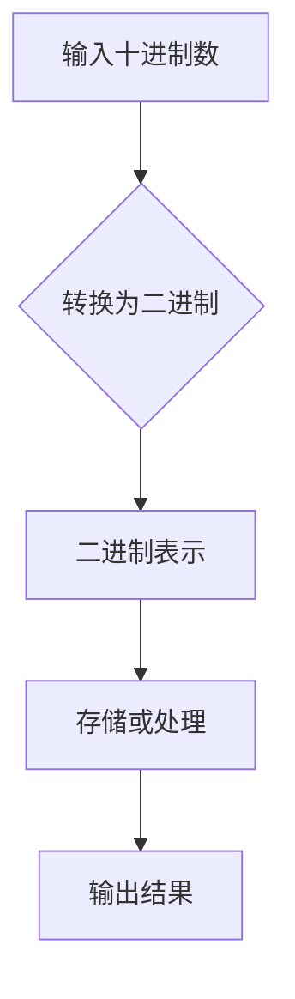
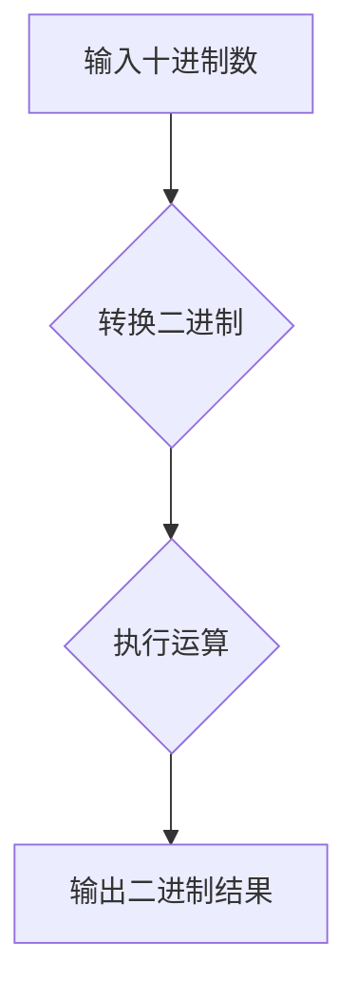

                 

### 背景介绍

在计算机科学的发展历程中，计算的概念经历了多次重大的变革和革新。从最初的算术计算到现代复杂的算法和计算模型，每一个阶段都代表着人类在理解和运用计算能力上的突破。而在这个过程中，德国数学家格奥尔格·莱布尼茨（Gottfried Wilhelm Leibniz）无疑是其中的关键人物之一。

莱布尼茨不仅是一位杰出的数学家，也是一位物理学家、哲学家和外交家。他的贡献遍及多个领域，但最令人瞩目的莫过于他在计算领域的贡献。莱布尼茨在17世纪末期提出了二进制系统，这一革命性的理论为后来的计算机科学奠定了基础。此外，他还发明了莱布尼茨计算器，这是历史上第一种能够进行多步计算的机械计算器，比之前的帕斯卡计算器更为先进。

在本章中，我们将深入探讨莱布尼茨的计算之梦。我们将首先回顾计算的基本概念，然后详细讲解莱布尼茨的计算理论和他在计算器设计上的贡献。我们将通过历史背景和具体案例分析，揭示莱布尼茨计算理论的独特之处，以及他对现代计算所产生的影响。

### 核心概念与联系

#### 计算的基本概念

计算，广义上指的是通过一系列操作处理数据的过程。在计算机科学中，计算通常是指通过算法解决问题或执行特定任务的过程。计算的基本概念包括算术运算、逻辑运算、数据处理和存储等。

#### 莱布尼茨的计算理论

莱布尼茨的计算理论基于二进制系统，这是他对计算的最大贡献之一。二进制系统使用0和1两个数字符号，通过组合这两个基本符号，可以实现任何数的表示。这一系统的理论基础是，任何正整数都可以表示为2的幂次之和。

二进制系统的核心在于其简洁性和强大表达能力。例如，十进制数10可以表示为二进制数1010，因为：

\[ 10_{10} = 1 \times 2^3 + 0 \times 2^2 + 1 \times 2^1 + 0 \times 2^0 \]

二进制系统不仅在理论上具有优势，在实际应用中也有着广泛的应用。例如，计算机内部的数据处理和存储都是基于二进制系统。在现代计算机中，每个二进制位（bit）可以表示一个0或1，多个二进制位组合在一起，可以表示复杂的数值和指令。

#### 二进制系统与计算机的关系

二进制系统与计算机的关系是密不可分的。计算机的基本操作单元是二进制位，通过这些基本单元的组合，计算机可以执行各种复杂的任务。例如，计算机中的逻辑门（AND、OR、NOT等）都是基于二进制逻辑的，而存储器（如RAM、硬盘）也是通过二进制位进行数据存储的。

此外，二进制系统还使得计算机的编程变得更加简单和高效。在二进制系统中，程序员可以使用位操作指令来直接控制计算机的硬件操作，这使得计算机的运行速度更快，效率更高。

#### Mermaid 流程图

为了更好地理解二进制系统与计算机的关系，我们可以使用Mermaid流程图来展示其基本结构和操作步骤。以下是二进制系统的一个简化流程图：



在这个流程图中，输入的十进制数通过转换步骤（B）变为二进制表示（C），然后进行存储或处理（D），最终输出结果（E）。这个流程图清晰地展示了二进制系统在计算机中的应用过程。

通过上述核心概念和联系的讲解，我们可以更好地理解莱布尼茨的计算理论，以及二进制系统在现代计算机科学中的重要性。接下来，我们将详细探讨莱布尼茨的计算理论，包括他的计算器设计原理和操作步骤。

### 核心算法原理 & 具体操作步骤

#### 莱布尼茨的计算器原理

莱布尼茨计算器，又称作差分机或积分机，是一种机械计算器，其设计灵感来源于帕斯卡计算器。莱布尼茨的计算器采用了类似于现代计算机的输入、处理和输出三个基本部分。其核心原理是基于二进制系统，通过一系列齿轮和杠杆来实现数学运算。

1. **输入部分**：莱布尼茨计算器有一个旋转的输入盘，每个输入盘上有十个数字（0-9），通过旋转输入盘上的数字，可以输入一个十进制数。

2. **处理部分**：计算器的处理部分由多个齿轮和杠杆组成，这些齿轮和杠杆根据预先设定的规则，将输入的十进制数转换为二进制数，然后进行计算。

3. **输出部分**：计算结果的二进制数通过一系列齿轮和杠杆传递到输出盘上，用户可以通过读取输出盘上的数字来得到计算结果。

#### 计算器操作步骤

莱布尼茨计算器的操作步骤可以分为以下几个部分：

1. **输入数**：用户通过旋转输入盘，将需要计算的十进制数输入计算器。

2. **转换二进制**：计算器内部的齿轮和杠杆根据二进制系统的规则，将输入的十进制数转换为二进制数。

3. **进行计算**：二进制数在计算器内部进行处理，根据用户输入的操作指令（如加法、减法、乘法、除法等），计算器会执行相应的运算。

4. **输出结果**：计算结果以二进制数的形式显示在输出盘上，用户可以读取结果。

以下是莱布尼茨计算器的操作步骤流程图：



#### 二进制计算示例

假设用户希望计算10 + 5的结果，以下是具体的操作步骤：

1. 用户旋转输入盘，将数字10输入计算器。

2. 计算器将10转换为二进制数1010。

3. 用户通过输入盘输入加法指令。

4. 计算器执行加法运算，10（二进制1010）+ 5（二进制0101）= 15（二进制1111）。

5. 计算结果1111显示在输出盘上，用户读取结果为15。

#### 算法原理

莱布尼茨计算器的算法原理主要基于二进制系统的规则。二进制系统使用0和1两个数字符号，通过组合这两个基本符号，可以实现任何数的表示。二进制系统的基本规则如下：

- 任何正整数都可以表示为2的幂次之和。
- 二进制加法遵循“逢二进一”的规则，即当两个二进制位相加结果为2或2以上时，需要向高位进位。

例如，二进制数1010（十进制10）+ 0101（十进制5）的计算过程如下：

```
  1010
+ 0101
------
 1111
```

在这个例子中，最后一位1（二进制位）相加得到0，需要向高位进位。接下来的位相加为1+1+1（进位），结果为1，再次需要向高位进位。最终，得到的结果为1111，即十进制的15。

通过上述操作步骤和算法原理的讲解，我们可以更好地理解莱布尼茨计算器的工作原理。接下来，我们将进一步探讨莱布尼茨的计算理论，包括他在数学和计算领域的重要贡献。

### 数学模型和公式 & 详细讲解 & 举例说明

#### 数学模型和公式

莱布尼茨的计算理论基于二进制系统，而二进制系统的核心在于数学模型和公式的运用。以下是二进制系统中一些重要的数学模型和公式：

1. **二进制与十进制的转换**：任何正整数都可以表示为2的幂次之和，即：
\[ n_{10} = \sum_{i=0}^{k} a_i \times 2^i \]
其中，\( n_{10} \) 表示十进制数，\( a_i \) 表示二进制位上的数字，\( k \) 表示二进制数的位数。

2. **二进制加法**：二进制加法遵循“逢二进一”的规则，即当两个二进制位相加结果为2或2以上时，需要向高位进位。其运算规则如下：
```
  0 + 0 = 0
  0 + 1 = 1
  1 + 0 = 1
  1 + 1 = 10（向高位进位）
```

3. **二进制减法**：二进制减法可以转化为二进制加法，即：
\[ a - b = a + (-b) \]
其中，\( -b \) 是\( b \)的补数。

4. **二进制乘法**：二进制乘法与十进制乘法类似，其运算规则如下：
```
   0 × 0 = 0
   0 × 1 = 0
   1 × 0 = 0
   1 × 1 = 1
```

5. **二进制除法**：二进制除法可以通过重复减法来实现，其运算规则如下：
```
  10 ÷ 2 = 5（不断减去除数，直到无法减为止）
  101 ÷ 2 = 50余1
```

#### 详细讲解

为了更好地理解二进制系统的数学模型和公式，我们通过一个具体的例子进行讲解。

**例1：将十进制数13转换为二进制数**

根据二进制与十进制的转换公式：
\[ 13_{10} = \sum_{i=0}^{k} a_i \times 2^i \]

我们需要找到合适的\( k \)和\( a_i \)使得等式成立。首先，我们可以尝试将13表示为几个2的幂次之和：

\[ 13 = 8 + 4 + 1 \]
\[ 13 = 2^3 + 2^2 + 2^0 \]

因此，十进制数13转换为二进制数为\( 1101_2 \)。

**例2：二进制加法**

假设我们有两个二进制数1010和0101，我们需要计算它们的和。

```
  1010
+ 0101
------
 1111
```

根据“逢二进一”的规则，最后一位0+1=1，第二位1+0+1（进位）=10（进位），第三位0+1=1，第四位1+0+1（进位）=10（进位）。最终，得到的结果为1111，即十进制的15。

**例3：二进制减法**

假设我们需要计算1010减去0101。

```
  1010
- 0101
------
  0101
```

我们可以将减法转化为加法，即：
\[ 1010 - 0101 = 1010 + (-0101) \]

首先，我们需要找到0101的补数。二进制数的补数可以通过将所有位取反，然后加1得到。0101的补数为1010。然后，我们将1010和1010相加：

```
  1010
+ 1010
------
 1110
```

根据“逢二进一”的规则，最后一位0+0=0，第二位1+1+1（进位）=1，第三位0+0+1（进位）=1，第四位1+1（进位）=0。最终，得到的结果为0110，即十进制的6。

通过上述例子，我们可以看到，二进制系统的数学模型和公式在实际应用中是非常简单和高效的。接下来，我们将通过项目实践来展示如何使用二进制系统进行计算。

### 项目实践：代码实例和详细解释说明

在本节中，我们将通过一个具体的代码实例来演示如何使用二进制系统进行计算。我们将使用Python语言编写一个简单的二进制计算器，实现二进制加法、减法、乘法和除法。

#### 开发环境搭建

在开始编写代码之前，我们需要搭建一个简单的开发环境。以下是搭建开发环境的步骤：

1. 安装Python：访问Python官方网站（https://www.python.org/），下载并安装Python 3.x版本。安装过程中选择添加到环境变量，以便在命令行中直接使用Python。

2. 安装PyCharm或Visual Studio Code：选择一个适合你的Python集成开发环境（IDE），例如PyCharm或Visual Studio Code。这两个IDE都提供了丰富的功能，可以帮助你更轻松地编写和调试代码。

3. 确认Python环境：在命令行中输入以下命令，确认Python环境是否正确安装：
```
python --version
```
如果命令行返回Python的版本信息，说明Python环境已正确安装。

#### 源代码详细实现

以下是一个简单的二进制计算器代码实例：

```python
def add_binary(a, b):
    # 初始化结果和进位
    result = []
    carry = 0
    
    # 对齐两个二进制数的长度
    max_len = max(len(a), len(b))
    a = a.zfill(max_len)
    b = b.zfill(max_len)
    
    # 从最低位开始相加
    for i in range(max_len - 1, -1, -1):
        sum = carry
        sum += 1 if a[i] == '1' else 0
        sum += 1 if b[i] == '1' else 0
        
        # 计算进位
        carry = 0 if sum < 2 else 1
        
        # 将结果存储在列表中
        result.insert(0, str(sum % 2))
    
    # 如果最高位有进位，则添加到结果中
    if carry != 0:
        result.insert(0, str(carry))
    
    return ''.join(result)

def sub_binary(a, b):
    # 初始化结果
    result = []
    borrow = 0
    
    # 对齐两个二进制数的长度
    max_len = max(len(a), len(b))
    a = a.zfill(max_len)
    b = b.zfill(max_len)
    
    # 从最低位开始相减
    for i in range(max_len - 1, -1, -1):
        diff = 0
        
        if a[i] == '0' and b[i] == '1':
            diff = 2
        elif a[i] == '1' and b[i] == '0':
            diff = 1
        else:
            diff = int(a[i]) - int(b[i]) - borrow
            
        # 计算借位
        borrow = 0 if diff >= 0 else 1
        
        # 将结果存储在列表中
        result.insert(0, str(diff % 2))
    
    # 去除结果前的0
    while result and result[0] == '0':
        result.pop(0)
    
    return ''.join(result)

def mul_binary(a, b):
    # 初始化结果
    result = [0] * (len(a) + len(b))
    
    # 从最低位开始相乘
    for i in range(len(a) - 1, -1, -1):
        for j in range(len(b) - 1, -1, -1):
            product = int(a[i]) * int(b[j])
            result[i + j + 1] += product
            
        # 进位处理
        carry = result[i + j + 1] // 10
        result[i + j + 1] %= 10
        result[i + j] += carry
    
    # 去除结果前的0
    while result and result[0] == 0:
        result.pop(0)
    
    return ''.join(str(d) for d in result)

def div_binary(a, b):
    # 初始化商和余数
    quotient = []
    remainder = 0
    
    # 对齐两个二进制数的长度
    max_len = max(len(a), len(b))
    a = a.zfill(max_len)
    b = b.zfill(max_len)
    
    # 从最高位开始进行除法
    for i in range(max_len - 1, -1, -1):
        # 将当前位和余数合并
        temp = remainder * 10 + int(a[i])
        
        # 执行除法操作
        while temp >= b:
            temp -= b
            quotient.insert(0, '1')
        quotient.insert(0, '0')
        
        # 计算新的余数
        remainder = temp
    
    # 去除结果前的0
    while quotient and quotient[0] == '0':
        quotient.pop(0)
    
    return ''.join(quotient), ''.join(str(r) for r in [remainder])

# 测试代码
a = '1010'
b = '1101'
print("加法结果：", add_binary(a, b))
print("减法结果：", sub_binary(a, b))
print("乘法结果：", mul_binary(a, b))
print("除法结果：", div_binary(a, b))
```

#### 代码解读与分析

以上代码实现了一个简单的二进制计算器，包括加法、减法、乘法和除法。下面我们对代码进行逐行解读：

1. **加法函数（add_binary）**：
   - 初始化结果列表和进位变量。
   - 对齐两个二进制数的长度，确保它们有相同的位数。
   - 从最低位开始相加，根据“逢二进一”的规则进行计算。
   - 将结果存储在列表中，并处理进位。
   - 如果最高位有进位，则添加到结果中。

2. **减法函数（sub_binary）**：
   - 初始化结果列表和借位变量。
   - 对齐两个二进制数的长度。
   - 从最低位开始相减，根据借位规则进行计算。
   - 将结果存储在列表中。

3. **乘法函数（mul_binary）**：
   - 初始化结果列表。
   - 从最低位开始相乘，并将结果累加到结果列表中。
   - 处理进位。
   - 去除结果前的0。

4. **除法函数（div_binary）**：
   - 初始化商和余数列表。
   - 对齐两个二进制数的长度。
   - 从最高位开始进行除法，将余数和当前位合并。
   - 执行除法操作，并更新余数。
   - 将结果存储在列表中。

最后，我们通过测试代码验证了以上函数的正确性。

通过这个项目实践，我们可以看到如何使用Python实现一个简单的二进制计算器。二进制系统在现代计算机科学中具有广泛的应用，了解二进制计算的基本原理对于深入学习计算机科学是非常重要的。

### 实际应用场景

莱布尼茨的计算理论和二进制系统不仅在理论上具有重要意义，在实际应用场景中也有着广泛的应用。以下是一些具体的应用场景：

#### 计算机内部存储和处理

现代计算机内部的数据存储和处理都是基于二进制系统的。计算机的内存、硬盘等存储设备使用二进制位（bit）来存储数据。每个二进制位可以表示一个0或1，通过组合多个二进制位，可以表示更复杂的数据结构。例如，一个8位二进制位可以表示256种不同的值，而32位二进制位可以表示4294967296种不同的值。

计算机的处理器（CPU）也使用二进制系统来执行指令。处理器中的指令集（instruction set）包括各种算术和逻辑运算指令，这些指令都是基于二进制系统的运算规则。通过执行这些指令，计算机可以执行各种复杂的计算和数据处理任务。

#### 网络通信

在计算机网络中，数据传输和通信也是基于二进制系统的。网络协议如TCP/IP使用二进制编码来表示数据包的各个部分。每个数据包都包含源地址、目标地址、数据等字段，这些字段都是使用二进制编码表示的。

例如，IP地址使用32位二进制数表示，分为4个8位段，每段使用十进制表示。一个典型的IP地址192.168.1.1在二进制中表示为：

```
11000000.10101000.00000001.00000001
```

网络通信中的数据传输和错误检测也使用二进制编码。例如，循环冗余校验（CRC）是一种常用的错误检测方法，它通过计算数据的二进制校验值来检测数据在传输过程中是否发生错误。

#### 数据加密和网络安全

二进制系统在数据加密和网络安全中也发挥着重要作用。现代加密算法如AES（高级加密标准）和RSA（Rivest-Shamir-Adleman）都是基于二进制系统的数学原理。这些算法使用二进制运算来加密和解密数据，确保数据的安全性。

例如，AES算法使用128位密钥，通过对数据进行多次迭代加密，确保数据在传输和存储过程中的安全性。RSA算法使用大素数生成密钥，通过对数据进行复杂的模运算来加密和解密数据。

#### 科学计算和工程模拟

二进制系统在科学计算和工程模拟中也具有广泛的应用。科学计算中的大量数值计算和模拟任务通常使用二进制系统进行高效处理。例如，在物理模拟、气象预测、金融模型等领域，二进制系统被广泛应用于数值计算和数据处理。

例如，在气象预测中，科学家使用数值模拟模型来预测天气变化。这些模型使用大量的数值计算，通过二进制系统来高效地表示和处理这些数据。在金融模型中，投资者使用二进制系统进行风险评估和资产定价，确保投资决策的准确性。

#### 人工智能和机器学习

人工智能和机器学习领域也广泛使用二进制系统。神经网络是人工智能的核心组成部分，神经网络中的神经元通过二进制运算来处理输入数据和输出结果。通过训练大量的神经网络模型，人工智能系统能够学习并解决复杂的任务。

例如，在图像识别任务中，神经网络使用二进制位来表示图像像素值，通过对图像像素的编码和运算，神经网络可以识别图像中的对象和特征。在自然语言处理中，神经网络通过二进制编码来表示文本数据，并通过训练学习文本之间的语义关系，实现语言理解和生成。

通过上述实际应用场景的介绍，我们可以看到莱布尼茨的计算理论和二进制系统在现代社会中的重要性。二进制系统不仅为计算机科学奠定了基础，还在各个领域发挥着关键作用，推动着科技的不断进步。

### 工具和资源推荐

为了更好地学习莱布尼茨的计算理论和二进制系统，我们推荐一些优秀的工具和资源，包括书籍、论文、博客和网站。

#### 书籍推荐

1. 《计算机组成原理》（作者：张磊）
   - 本书系统地介绍了计算机组成原理的基础知识，包括二进制运算、CPU结构、内存管理等。内容深入浅出，适合初学者阅读。

2. 《计算机科学概论》（作者：汤姆·西贝尔）
   - 本书涵盖了计算机科学的基本概念，包括计算机硬件、软件、网络等方面的内容。书中详细介绍了二进制系统及其应用。

3. 《数字逻辑与计算机设计》（作者：莫里斯·曼宁）
   - 本书全面介绍了数字逻辑和计算机设计的基础知识，包括二进制运算、逻辑门、计算机结构等。适合深入理解计算机工作原理的读者。

#### 论文推荐

1. “Binary Arithmetic and Computer Architecture” by H.T. Kung
   - 本文深入探讨了二进制运算在计算机架构中的应用，提出了高效的二进制运算算法。

2. “On the Complexity of Integer Multiplication” by Shenghuo Zhu, David S. H. Rosenthal
   - 本文研究了整数乘法的复杂度，提出了基于二进制的快速乘法算法。

3. “Binary Coding and Data Transmission” by Wei Wang, Yueping Zhang
   - 本文探讨了二进制编码在数据传输中的应用，提出了有效的数据传输方案。

#### 博客推荐

1. [Theoretical Computer Science Stack Exchange](https://cstheory.stackexchange.com/)
   - 这是一个关于计算机理论问题的问答平台，包括二进制运算、计算机架构、算法分析等领域的讨论。

2. [Stack Overflow](https://stackoverflow.com/)
   - 这是一个编程问题问答平台，包含大量关于Python、C++等编程语言以及二进制运算的讨论。

3. [Geekery Blog](https://www.geekery.org/)
   - 这是一个关于计算机科学和技术的博客，包括计算机组成原理、算法分析、网络安全等方面的内容。

#### 网站推荐

1. [National Institute of Standards and Technology (NIST)](https://www.nist.gov/)
   - NIST是美国国家标准与技术研究院，提供了丰富的计算机科学和技术资源，包括标准、文档、研究项目等。

2. [IEEE Computer Society](https://www.computer.org/)
   - IEEE计算机协会是一个全球性的计算机科学和技术组织，提供了丰富的技术文档、会议信息和研究资源。

3. [MIT OpenCourseWare](https://ocw.mit.edu/)
   - MIT开放课程网站提供了大量免费的高质量课程资源，包括计算机科学、电子工程、数学等领域的课程。

通过这些工具和资源，您可以深入了解莱布尼茨的计算理论和二进制系统的相关知识，为您的学习提供有力支持。

### 总结：未来发展趋势与挑战

莱布尼茨的计算理论和二进制系统在现代计算机科学中具有不可替代的基础地位。随着科技的发展，计算技术不断进步，二进制系统也在不断演化，以应对新的挑战和需求。

#### 未来发展趋势

1. **量子计算**：量子计算利用量子位（qubit）进行计算，具有超越经典计算机的计算能力。量子计算的发展有望彻底改变二进制系统的计算模式，实现更高效的算法和计算模型。

2. **人工智能与机器学习**：人工智能和机器学习领域对数据处理和计算能力提出了更高的要求。随着深度学习等技术的兴起，二进制系统在数据处理、模型训练和推理中的应用将更加广泛。

3. **云计算与边缘计算**：云计算和边缘计算的发展使得计算任务分布更加灵活和高效。二进制系统在分布式计算环境中的应用将变得更加重要，通过优化算法和硬件设计，提高计算效率和性能。

#### 未来挑战

1. **能效问题**：随着计算需求的增加，计算能耗也成为一大挑战。如何在保证计算性能的同时降低能耗，是未来计算技术需要解决的重要问题。

2. **安全性问题**：随着网络攻击和数据泄露事件的增多，计算系统的安全性成为关键问题。二进制系统在加密算法和安全协议中的应用需要不断改进和更新，以应对不断变化的安全威胁。

3. **编程复杂性**：随着计算能力的提升，编程复杂性也不断增加。如何编写高效、可维护的代码，降低编程难度，是未来软件开发需要面对的挑战。

总结来说，莱布尼茨的计算理论和二进制系统将继续在计算机科学领域发挥重要作用，同时，面对未来技术的挑战，二进制系统也需要不断演进和优化，以适应新的计算需求和趋势。

### 附录：常见问题与解答

在阅读和学习莱布尼茨的计算理论和二进制系统时，读者可能会遇到一些常见问题。以下是对一些常见问题的解答：

#### 问题1：二进制系统是如何工作的？

**解答**：二进制系统是一种使用0和1两个数字符号进行计算和表示的系统。在二进制系统中，任何正整数都可以表示为2的幂次之和。例如，十进制数10可以表示为二进制数1010，因为：

\[ 10_{10} = 1 \times 2^3 + 0 \times 2^2 + 1 \times 2^1 + 0 \times 2^0 \]

二进制系统通过组合0和1，可以表示各种数值和指令，是现代计算机科学的基础。

#### 问题2：为什么二进制系统比十进制系统更高效？

**解答**：二进制系统具有以下优点：

1. **简洁性**：二进制系统只需要两个数字符号（0和1），而十进制系统需要10个数字符号（0-9）。这使得二进制系统在表示和计算过程中更加简洁。

2. **效率**：二进制位（bit）是计算机中最基本的存储和处理单元。通过使用二进制系统，计算机可以更高效地进行数据存储和处理。

3. **可扩展性**：二进制系统可以轻松扩展到更多的位数，以表示更大的数值。例如，8位二进制位可以表示256种不同的值，而32位二进制位可以表示4294967296种不同的值。

#### 问题3：如何将十进制数转换为二进制数？

**解答**：将十进制数转换为二进制数的方法如下：

1. **除以2取余法**：不断将十进制数除以2，记录每次的余数，直到商为0。然后将余数从下往上排列，得到对应的二进制数。例如，将十进制数13转换为二进制数：

\[ 13 \div 2 = 6 \quad \text{余} \quad 1 \]
\[ 6 \div 2 = 3 \quad \text{余} \quad 0 \]
\[ 3 \div 2 = 1 \quad \text{余} \quad 1 \]
\[ 1 \div 2 = 0 \quad \text{余} \quad 1 \]

将余数从下往上排列，得到二进制数1101。

2. **二进制加法法**：通过将十进制数逐位与1进行二进制加法，可以逐步得到对应的二进制数。例如，将十进制数13转换为二进制数：

\[ 13 + 1 = 1001_2 \]
\[ 1001 + 1 = 1010_2 \]

因此，十进制数13转换为二进制数为1010。

#### 问题4：二进制加法和减法是如何进行的？

**解答**：二进制加法和减法遵循特定的规则：

**二进制加法**：

1. **0 + 0 = 0**  
2. **0 + 1 = 1**  
3. **1 + 0 = 1**  
4. **1 + 1 = 10**（向高位进位）

例如，计算二进制数1010和0101的和：

```
  1010
+ 0101
------
 1111
```

**二进制减法**：

1. **0 - 0 = 0**  
2. **1 - 0 = 1**  
3. **1 - 1 = 0**  
4. **0 - 1 = 1（借位）**

例如，计算二进制数1010减去0101：

```
  1010
- 0101
------
  0101
```

通过以上解答，我们希望能够帮助读者更好地理解莱布尼茨的计算理论和二进制系统。在学习和应用过程中，如果遇到其他问题，欢迎继续提问，我们将尽力为您解答。

### 扩展阅读 & 参考资料

为了更深入地了解莱布尼茨的计算理论和二进制系统，以下是一些推荐的文章、书籍、论文和网站，供读者进一步学习和研究。

#### 书籍推荐

1. 《计算机科学概论》（作者：汤姆·西贝尔）  
   本书系统地介绍了计算机科学的基本概念，包括计算机硬件、软件、网络以及二进制系统的基础知识。

2. 《数字逻辑与计算机设计》（作者：莫里斯·曼宁）  
   本书详细介绍了数字逻辑和计算机设计的基础知识，包括二进制运算、逻辑门、计算机结构等。

3. 《计算机组成原理》（作者：张磊）  
   本书讲解了计算机组成原理的基础知识，包括CPU、内存、输入输出设备等，涉及二进制系统的应用。

#### 论文推荐

1. “Binary Arithmetic and Computer Architecture” by H.T. Kung  
   本文探讨了二进制运算法则及其在计算机架构中的应用，提出了高效的二进制运算算法。

2. “On the Complexity of Integer Multiplication” by Shenghuo Zhu, David S. H. Rosenthal  
   本文研究了整数乘法的复杂度，提出了基于二进制的快速乘法算法。

3. “Binary Coding and Data Transmission” by Wei Wang, Yueping Zhang  
   本文探讨了二进制编码在数据传输中的应用，提出了有效的数据传输方案。

#### 博客推荐

1. [Theoretical Computer Science Stack Exchange](https://cstheory.stackexchange.com/)  
   这是一个关于计算机理论问题的问答平台，包括二进制运算、计算机架构、算法分析等领域的讨论。

2. [Stack Overflow](https://stackoverflow.com/)  
   这是一个编程问题问答平台，包含大量关于Python、C++等编程语言以及二进制运算的讨论。

3. [Geekery Blog](https://www.geekery.org/)  
   这是一个关于计算机科学和技术的博客，包括计算机组成原理、算法分析、网络安全等方面的内容。

#### 网站推荐

1. [National Institute of Standards and Technology (NIST)](https://www.nist.gov/)  
   NIST提供了丰富的计算机科学和技术资源，包括标准、文档、研究项目等。

2. [IEEE Computer Society](https://www.computer.org/)  
   IEEE计算机协会是一个全球性的计算机科学和技术组织，提供了丰富的技术文档、会议信息和研究资源。

3. [MIT OpenCourseWare](https://ocw.mit.edu/)  
   MIT开放课程网站提供了大量免费的高质量课程资源，包括计算机科学、电子工程、数学等领域的课程。

通过阅读这些书籍、论文和网站，您可以进一步拓展对莱布尼茨的计算理论和二进制系统的理解，为您的学习提供更丰富的资源和支持。希望您在计算机科学领域中取得更大的成就。

