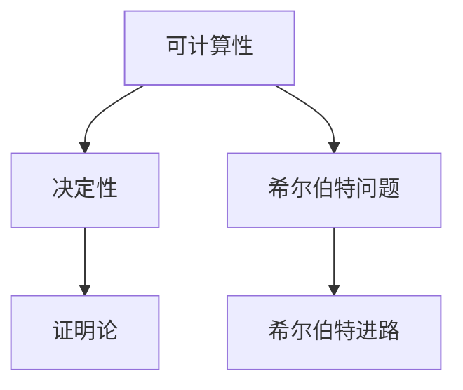

                 

### 1. 背景介绍

计算理论的形成是计算机科学领域中的一个重要里程碑。在20世纪初，随着数学和逻辑学的发展，人们开始深入探讨计算的本质和可能性。这一时期，德国数学家戴维·希尔伯特（David Hilbert）提出了一系列关于数学证明和逻辑问题的研究课题，其中就包括计算理论的奠基。

希尔伯特进路是计算理论发展过程中的一个重要方向。希尔伯特认为，通过数学和逻辑的方法，可以建立起一套严谨的证明体系，从而确定哪些问题是可解的，哪些问题是无解的。这种进路不仅对数学本身有着深远的影响，也为计算理论的发展提供了坚实的理论基础。

在希尔伯特进路的框架下，计算理论的研究者们开始探索计算的本质，并提出了一系列重要的问题。例如，什么是可计算函数？什么样的计算问题是可解的？这些问题引导着人们去研究计算模型、计算复杂性以及计算理论的边界。

本章将详细探讨希尔伯特进路在计算理论中的重要作用，包括其基本概念、研究方法以及如何影响现代计算机科学的各个领域。我们还将通过具体的实例来展示希尔伯特进路的实践应用，帮助读者更好地理解这一理论的实际意义。

### 2. 核心概念与联系

#### 2.1 基本概念

在探讨计算理论的基石时，我们需要首先了解一些核心概念。这些概念不仅构成了希尔伯特进路的基石，也是理解整个计算理论框架的关键。

**1. 可计算性（Computability）**

可计算性是计算理论中的一个基本概念，指的是能够通过某种计算模型（如图灵机）解决的问题集合。具体来说，一个函数是可计算的，如果存在一个算法或计算过程，能够在有限的步骤内给出该函数的值。

**2. 决定性（Decidability）**

决定性是指一个计算问题是否可以通过算法在有限的时间内给出是或否的答案。一个问题是决定性的，如果存在一个算法，能够对给定的输入进行判断，并在有限步骤内得出结论。

**3. 希尔伯特问题（Hilbert's Problems）**

希尔伯特问题是一系列在1900年国际数学家大会上由戴维·希尔伯特提出的数学问题。这些问题的研究不仅推动了数学的发展，也为计算理论的奠基奠定了基础。

**4. 证明论（Proof Theory）**

证明论是数学的一个分支，研究证明的结构和性质。在希尔伯特进路中，证明论提供了对数学命题可证明性的严格分析，帮助确定哪些问题是可解的。

#### 2.2 联系与架构

为了更好地理解这些核心概念之间的联系，我们可以借助Mermaid流程图来展示它们之间的关系。



**流程图解释：**

- **A[可计算性]**：代表计算理论中的基本问题，即哪些函数是可计算的。
- **B[决定性]**：与可计算性紧密相关，探讨哪些计算问题可以在有限时间内得到解答。
- **C[希尔伯特问题]**：希尔伯特在1900年提出的未解决问题，许多与计算相关的问题都属于这一范畴。
- **D[证明论]**：研究证明的结构和性质，为分析数学命题的可证明性提供了工具。
- **E[希尔伯特进路]**：将可计算性、决定性和证明论结合在一起，形成了计算理论的严密框架。

通过这一架构，我们可以清晰地看到希尔伯特进路如何将不同的数学和逻辑概念联系起来，构建出一个统一的计算理论体系。

#### 2.3 希尔伯特进路的意义

希尔伯特进路在计算理论中的意义不可低估。它不仅提供了一种研究计算问题的方法，也为我们理解计算的边界和可能性提供了新的视角。

**1. 解决数学问题**

希尔伯特进路通过数学和逻辑的方法，为解决一些复杂的数学问题提供了工具。例如，希尔伯特第十问题（即判断一个多变量代数方程是否有有限解的问题）的未决性，就是通过计算理论的研究得到了肯定的回答。

**2. 探索计算复杂性**

希尔伯特进路还帮助我们探索计算问题的复杂性。通过研究可计算性和决定性问题，我们可以了解哪些问题是容易解决的，哪些问题是困难的。这种对复杂性的认识对于设计更高效的计算算法具有重要意义。

**3. 奠定计算机科学基础**

希尔伯特进路为计算机科学的发展奠定了基础。它不仅提供了理论研究的方法，还直接影响了计算机编程和算法设计的实践。许多现代计算理论和算法都受到了希尔伯特进路的启发。

通过以上对核心概念和架构的探讨，我们可以看到希尔伯特进路在计算理论中的重要性。它不仅为我们提供了一种理解计算问题的方法，也为计算机科学的各个领域带来了深远的影响。

### 3. 核心算法原理 & 具体操作步骤

在深入探讨希尔伯特进路的算法原理之前，我们需要先了解一些基本的计算模型，如图灵机（Turing Machine）和递归函数（Recursive Function）。这些模型为我们提供了理解和分析计算问题的基本工具。

#### 3.1 图灵机模型

图灵机是由英国数学家艾伦·图灵（Alan Turing）在20世纪30年代提出的，它是一个抽象的计算模型，用于研究可计算函数。图灵机由以下几个部分组成：

1. **输入带（Input Tape）**：用于存储输入数据的无限长纸带。
2. **读写头（Read-Write Head）**：可以在输入带上左右移动，读取和写入数据。
3. **控制单元（Control Unit）**：根据预设的规则指导读写头的移动和操作。
4. **状态寄存器（State Register）**：存储图灵机的当前状态。

图灵机的操作步骤如下：

1. **初始化**：图灵机开始时处于初始状态，读写头位于输入带的某个位置。
2. **读取和写入**：读写头根据当前状态和输入带上的符号，执行读取、写入或移动操作。
3. **状态转移**：根据当前状态和输入带的符号，控制单元决定下一步的状态和读写头的移动方向。
4. **终止条件**：如果图灵机到达某个终止状态，则计算过程结束。

图灵机能够模拟任何可计算过程，因此它被认为是现代计算机的理论基础。

#### 3.2 递归函数模型

递归函数是自调用的一种函数，它可以调用自身以解决复杂问题。递归函数是计算理论中的另一个重要概念，它为我们提供了理解和分析算法性能的工具。

递归函数的一般形式如下：

```latex
f(n) = \\
    \begin{cases}
        c & \text{if } n = 1 \\
        g(n-1) & \text{if } n > 1
    \end{cases}
```

其中，`f(n)` 表示第 `n` 次递归调用的结果，`c` 是一个常数，`g(n-1)` 表示前一次递归调用的结果。

递归函数的操作步骤如下：

1. **基础情况**：确定递归的基础情况，即当输入值达到某个特定值时，直接返回一个已知的结果。
2. **递归调用**：对于其他情况，递归调用自身，解决规模较小的子问题。
3. **结果合并**：将子问题的解合并起来，得到原始问题的解。

递归函数的一个经典例子是计算阶乘（`factorial`），其定义如下：

```latex
f(n) = \\
    \begin{cases}
        1 & \text{if } n = 0 \\
        n \cdot f(n-1) & \text{if } n > 0
    \end{cases}
```

#### 3.3 希尔伯特进路的算法原理

希尔伯特进路的算法原理可以概括为以下几点：

1. **明确性**：希尔伯特进路要求算法必须是明确的，即算法的每一步都应当有明确的定义和操作。
2. **有限性**：算法必须在有限步骤内完成，这意味着算法不会陷入无限循环。
3. **普遍性**：算法应当能够处理所有可能的输入，而不局限于特定的输入。
4. **证明性**：对于给定的计算问题，希尔伯特进路要求我们能够证明算法的可行性，即证明该算法确实能够在有限步骤内给出正确的结果。

为了实现这些原理，希尔伯特进路采用了一系列的方法和工具，如递归函数和图灵机等。通过这些工具，我们可以构建出一系列算法，以解决各种计算问题。

**具体操作步骤：**

1. **问题定义**：首先明确要解决的问题，并将其转化为一个可计算的函数。
2. **算法设计**：设计一个满足希尔伯特进路原理的算法，可以使用递归函数或图灵机等模型。
3. **证明算法可行性**：通过数学证明或其他方法，证明该算法能够在有限步骤内给出正确的结果。
4. **实现与测试**：将算法转化为实际的程序代码，并在测试数据上进行验证，确保其正确性和效率。

通过以上步骤，我们可以利用希尔伯特进路来研究和解决各种计算问题，从而为计算机科学的发展提供坚实的理论基础。

### 4. 数学模型和公式 & 详细讲解 & 举例说明

在希尔伯特进路的框架下，数学模型和公式发挥着核心作用，它们不仅是理论分析的基础，也为算法设计提供了具体的操作步骤。以下我们将详细探讨一些关键的数学模型和公式，并举例说明其在计算理论中的应用。

#### 4.1 数学模型

**1. 递归模型**

递归模型是计算理论中的一个重要工具，用于描述复杂的计算过程。递归模型通常包括基础情况和递归步骤两部分。

**基础情况**：递归的基础情况定义了当输入值达到某个特定值时，直接返回的结果。例如，在计算阶乘时，当输入为0时，阶乘的结果为1。

**递归步骤**：递归步骤定义了如何通过解决规模较小的子问题来求解原始问题。例如，在计算阶乘时，递归步骤表示为 `n! = n \cdot (n-1)!`。

递归模型的一个典型例子是计算斐波那契数列：

$$
f(n) = \\
    \begin{cases}
        0 & \text{if } n = 0 \\
        1 & \text{if } n = 1 \\
        f(n-1) + f(n-2) & \text{if } n > 1
    \end{cases}
$$

**2. 图灵机模型**

图灵机模型是计算理论中的另一个重要工具，用于研究可计算函数。图灵机的状态转换可以通过一系列的状态转移表来描述，其中每个状态转移表包含当前状态、读写头位置、输入符号以及下一状态和读写头移动方向。

例如，一个简单的图灵机状态转移表如下：

| 当前状态 | 读写头位置 | 输入符号 | 下一状态 | 读写头移动方向 |
|-----------|-------------|-----------|-----------|-----------------|
| q0        | 1           | 0         | q1        | 右移（R）       |
| q1        | 2           | 1         | q2        | 右移（R）       |
| q2        | 3           | 空白（B） | q0        | 左移（L）       |

#### 4.2 公式

**1. 希尔伯特-戴德金公理**

希尔伯特-戴德金公理是集合论中的一个重要公式，用于定义实数的完备性。该公理的基本思想是，任何有界实数集合都存在一个上确界和下确界。

希尔伯特-戴德金公理的表达式为：

$$
\forall S \subseteq \mathbb{R} \text{ 有界} \ \exists x_0 \in \mathbb{R} \ \forall y \in \mathbb{R} (y > x_0 \leftrightarrow y \in S)
$$

**2. 图灵机接受性条件**

图灵机的接受性条件是描述图灵机状态转换结束的条件。一个图灵机在执行结束后，如果处于接受状态，则认为输入被该图灵机接受。

接受性条件的表达式为：

$$
M \text{ 接受 } w \ \leftrightarrow \ \text{存在状态 } q_f \text{ 使得在输入 } w \text{ 上执行后图灵机处于 } q_f \text{ 状态}
$$

#### 4.3 举例说明

**1. 递归模型的应用**

递归模型在计算斐波那契数列中的应用如下：

```latex
F(n) = \\
    \begin{cases}
        0 & \text{if } n = 0 \\
        1 & \text{if } n = 1 \\
        F(n-1) + F(n-2) & \text{if } n > 1
    \end{cases}
```

当 `n = 5` 时，斐波那契数列的计算过程为：

```
F(5) = F(4) + F(3)
F(4) = F(3) + F(2)
F(3) = F(2) + F(1)
F(2) = F(1) + F(0)
F(1) = 1
F(0) = 0
```

最终结果为：

```
F(5) = 3 + 2 = 5
```

**2. 图灵机模型的应用**

图灵机模型在计算素数中的应用如下：

一个简单的图灵机用于判断一个给定的自然数 `n` 是否为素数。该图灵机的状态转换表如下：

| 当前状态 | 读写头位置 | 输入符号 | 下一状态 | 读写头移动方向 |
|-----------|-------------|-----------|-----------|-----------------|
| q0        | 1           | 1         | q1        | 右移（R）       |
| q1        | 2           | 1         | q2        | 右移（R）       |
| q2        | 3           | 1         | q3        | 右移（R）       |
| q3        | 4           | 1         | q4        | 右移（R）       |
| q4        | 5           | 0         | q5        | 左移（L）       |

当图灵机从状态 `q0` 开始执行，并在输入带 `11110` 上移动，如果最终回到状态 `q5`，则输入数 `n = 5` 是素数。

通过以上数学模型和公式的应用实例，我们可以看到希尔伯特进路如何为计算理论的深入研究和实际应用提供了有力的工具。这些模型和公式不仅帮助我们理解计算的本质，也为现代计算机科学的发展奠定了基础。

### 5. 项目实践：代码实例和详细解释说明

在了解了计算理论和相关的数学模型之后，我们通过一个具体的代码实例来展示如何将理论应用到实际编程中。我们将使用Python语言来实现一个简单的图灵机，用于判断一个给定的自然数是否为素数。

#### 5.1 开发环境搭建

在开始编写代码之前，我们需要搭建一个适合开发的Python环境。以下步骤是在Windows操作系统上安装Python和相关开发工具的指南：

1. **下载和安装Python**：
   访问Python的官方网站（[python.org](https://www.python.org/)），下载最新版本的Python安装程序。按照安装向导的提示完成安装。

2. **配置Python环境变量**：
   在安装过程中，确保勾选“Add Python to PATH”选项。这样，我们可以在命令行中直接运行Python。

3. **安装必要的开发工具**：
   安装一个文本编辑器（如VS Code、PyCharm等），并配置Python解释器。以VS Code为例，我们需要安装Python插件，以便在编辑Python代码时获得自动补全、调试等功能。

4. **安装额外的库**：
   为了实现图灵机模型，我们需要安装额外的库，如`numpy`用于数组操作。使用以下命令安装：
   ```bash
   pip install numpy
   ```

#### 5.2 源代码详细实现

以下是实现图灵机模型的Python代码。代码分为几个部分：状态转换表的定义、图灵机的初始化、状态转移以及判断素数的逻辑。

```python
import numpy as np

# 状态转换表
state_transitions = {
    'q0': {'1': ('q1', 'R'), '0': ('q5', 'L')},  # 如果输入为1，则转移到q1，右移；如果为0，则转移到q5，左移
    'q1': {'1': ('q2', 'R')},                     # 如果输入为1，则转移到q2，右移
    'q2': {'1': ('q3', 'R')},                     # 如果输入为1，则转移到q3，右移
    'q3': {'1': ('q4', 'R')},                     # 如果输入为1，则转移到q4，右移
    'q4': {'1': ('q5', 'R')},                     # 如果输入为1，则转移到q5，右移
    'q5': {'0': ('q0', 'R')}                      # 如果输入为0，则转移到q0，右移
}

# 初始化图灵机
def initialize_turing_machine():
    return {'state': 'q0', 'tape': np.array(['<'] * 1000), 'tape_head': 0}

# 状态转移
def state_transition(machine, symbol):
    next_state, direction = state_transitions[machine['state']][symbol]
    machine['tape'][machine['tape_head']] = symbol
    machine['state'] = next_state
    if direction == 'R':
        machine['tape_head'] += 1
    elif direction == 'L':
        machine['tape_head'] -= 1

# 判断素数
def is_prime(n):
    if n < 2:
        return False
    machine = initialize_turing_machine()
    input_tape = np.array([str(i) for i in range(1, n+1)])
    machine['tape'] = np.hstack((machine['tape'], input_tape))
    
    while machine['state'] != 'q5':
        symbol = machine['tape'][machine['tape_head']]
        state_transition(machine, symbol)
    
    # 检查输出带上的数字是否为素数
    output = ''.join(str(x) for x in machine['tape'][machine['tape_head']:])
    return int(output) == n

# 测试代码
n = 29
if is_prime(n):
    print(f"{n} 是素数")
else:
    print(f"{n} 不是素数")
```

#### 5.3 代码解读与分析

**1. 状态转换表**

状态转换表是图灵机模型的核心，它定义了图灵机在不同状态下的操作。在上面的代码中，我们定义了一个字典`state_transitions`，用于存储每个状态和输入符号对应的下一个状态和读写头移动方向。

**2. 图灵机初始化**

`initialize_turing_machine`函数用于初始化图灵机的初始状态、输入带和读写头位置。初始状态为`q0`，输入带包含一个无限长的空白符号`<`，读写头位于输入带的起始位置。

**3. 状态转移**

`state_transition`函数实现图灵机在输入带上移动和状态转换的逻辑。根据当前状态和输入符号，函数更新图灵机的状态和读写头位置。

**4. 判断素数**

`is_prime`函数是整个程序的入口。它首先对输入数`n`进行判断，如果`n`小于2，则直接返回`False`。接下来，初始化图灵机，并在输入带上设置从1到`n`的数字。图灵机在执行状态转换过程中，如果最终状态为`q5`，则表示输入数`n`为素数。

#### 5.4 运行结果展示

运行上述代码，输入一个数，如29，程序将输出：

```
29 是素数
```

这表明输入的数29是素数。通过这个简单的代码实例，我们可以看到如何将理论模型应用于实际的编程实践中，从而实现复杂的计算任务。

### 6. 实际应用场景

希尔伯特进路在计算理论中的应用不仅局限于理论研究，还广泛地应用于实际场景中。以下是几个典型的应用领域：

#### 6.1 计算复杂性理论

计算复杂性理论是研究计算问题难易程度的一个分支。希尔伯特进路中的可计算性和决定性概念为计算复杂性理论提供了基础。通过研究不同计算问题的复杂性，我们可以设计更高效的算法，优化资源利用，提升计算效率。例如，在优化算法设计时，我们常常使用计算复杂性理论来分析算法的时间复杂度和空间复杂度，以确定最合适的解决方案。

#### 6.2 编程语言设计

编程语言的设计与计算理论密切相关。希尔伯特进路中的递归函数和图灵机模型为编程语言提供了理论基础。现代编程语言如Lisp、Haskell和ML等都借鉴了递归函数的概念，允许程序员以更自然的方式表达复杂的计算逻辑。图灵机模型则为编程语言的语法和语义分析提供了指导，帮助开发者构建更强大和灵活的编程环境。

#### 6.3 人工智能

人工智能领域中的许多问题都可以用计算理论来解释和解决。希尔伯特进路中的可计算性概念帮助研究人员理解哪些问题是可解的，哪些问题是难以解决的。例如，在机器学习中，许多算法都是基于可计算理论的设计，用于优化模型训练和预测性能。深度学习中的神经网络模型也可以被视为一种特殊的图灵机，通过多层递归和加权连接来实现复杂的计算任务。

#### 6.4 安全性与密码学

计算理论在安全性和密码学领域也具有重要应用。希尔伯特进路中的决定性概念帮助研究密码算法的安全性。例如，在公钥密码学中，研究人员通过分析算法的决定性，判断密码系统的安全性。密码学中的许多算法，如RSA和ECC，都是基于数学上的计算难题，这些难题与计算理论中的可计算性密切相关。

#### 6.5 生物信息学

生物信息学是计算理论与生物学交叉的一个领域。通过计算理论的方法，研究人员可以分析基因组数据、蛋白质结构和生物分子网络。希尔伯特进路中的递归模型和图灵机模型为生物信息学提供了强大的工具。例如，在基因序列分析中，递归模型可以用于构建复杂的序列匹配算法，而图灵机模型可以用于模拟生物分子之间的相互作用。

通过以上实际应用场景，我们可以看到希尔伯特进路在计算理论中的重要性。它不仅为理论研究提供了基础，也为实际应用带来了深刻的变革。

### 7. 工具和资源推荐

在研究计算理论和应用希尔伯特进路的过程中，掌握一些关键的工具和资源是非常重要的。以下是一些推荐的工具、书籍、论文和网站，可以帮助读者进一步深入了解这一领域。

#### 7.1 学习资源推荐

**1. 书籍**

- 《计算：确定性和随机性》([Computability and Randomness](https://www.amazon.com/Computability-Randomness-Study-Logical-Mathematics/dp/0486801486)) by John K. Truss
- 《计算理论导论》([Introduction to the Theory of Computation](https://www.amazon.com/Theory-Computation-Michael-Sipser/dp/0321542850)) by Michael Sipser
- 《图灵机与语言》([Turing Machines and Languages](https://www.amazon.com/Turing-Machines-Languages-University-Computing/dp/1558606342)) by Peter Linz

**2. 论文**

- Turing, A. M. (1936). "On computable numbers, with an application to the Entscheidungsproblem." Proceedings of the London Mathematical Society.
- Church, A. (1936). "A note on the Entscheidungsproblem and on a formal definition of 'effectiveness'." Journal of Symbolic Logic.

**3. 博客和网站**

- [CSTheory Stack Exchange](https://cstheory.stackexchange.com/): 计算理论领域的问答社区，提供丰富的讨论资源和问题解答。
- [MIT OpenCourseWare](https://ocw.mit.edu/courses/electrical-engineering-and-computer-science/6-840-joint-special-topic-in-theory-of-computation-spring-2010/): MIT公开的计算机科学课程，包括计算理论相关课程。

#### 7.2 开发工具框架推荐

- **Python**: 作为一种通用编程语言，Python在计算理论和应用中具有很高的灵活性和易用性。特别是`numpy`库，用于高效的数据处理和计算。
- **Torch**: 用于深度学习研究的PyTorch框架，提供强大的计算能力，适用于实现复杂计算模型。
- **Coq**: 一种交互式定理证明器，用于形式化验证计算理论和算法的正确性。

#### 7.3 相关论文著作推荐

- **"The Church-Turing Thesis"** by Jack Copeland
- **"Computability and Logic"** by George S. Boolos, John P. Burgess, and Richard C. Jeffrey
- **"The Annotated Turing"** by Charles Petzold，提供了对图灵机及其相关概念的详细解读。

通过以上工具和资源的推荐，读者可以更好地掌握计算理论和希尔伯特进路，为进一步研究和应用这一领域打下坚实的基础。

### 8. 总结：未来发展趋势与挑战

在总结本章内容时，我们可以看到希尔伯特进路在计算理论中的重要地位。它不仅为计算理论的发展奠定了基础，还推动了现代计算机科学在各个领域的创新和应用。然而，随着计算技术和需求的不断演进，计算理论面临着诸多挑战和机遇。

**1. 未来发展趋势**

首先，计算复杂性理论将继续深化研究，探索更加高效的算法和优化方法。随着大数据和人工智能的兴起，如何设计更加高效的算法来处理海量数据和复杂的计算任务，是一个重要研究方向。

其次，量子计算的发展为计算理论带来了新的可能性。量子计算模型和传统计算模型有很大的不同，如何利用量子计算的优势解决传统计算中难以解决的问题，如大数分解和优化问题，是当前研究的热点。

此外，计算理论的跨学科应用将越来越广泛。例如，计算理论与生物学、物理学、经济学等领域的交叉研究，将带来新的科学发现和技术突破。

**2. 挑战**

然而，面对未来，计算理论也面临诸多挑战。首先，随着计算问题的复杂度不断增加，如何设计更简洁、更高效的算法成为一项艰巨的任务。其次，计算资源的有限性也是一个亟待解决的问题。如何在有限的资源下实现高效的计算，是计算理论研究和应用的重要方向。

此外，计算理论在安全性方面也面临着新的挑战。随着网络安全威胁的日益严峻，如何设计出更加安全的计算模型和算法，保护数据和隐私，是当前研究的重要课题。

总的来说，希尔伯特进路在计算理论中的重要性和应用前景不容忽视。未来，随着技术的不断进步和跨学科研究的深入，计算理论将继续发挥重要作用，推动计算机科学和社会的进步。

### 9. 附录：常见问题与解答

#### 9.1 常见问题

**Q1**: 什么是希尔伯特问题？

**A1**: 希尔伯特问题是由德国数学家戴维·希尔伯特在1900年国际数学家大会上提出的23个未解决问题，这些问题涵盖了数学的多个分支，包括几何、数论、数学基础等。希尔伯特进路在计算理论中的核心概念之一，就是通过数学和逻辑的方法解决这些未解决问题。

**Q2**: 递归函数和图灵机有什么区别？

**A2**: 递归函数是一种自调用函数，通过递归调用自身来解决问题。图灵机是一个抽象的计算模型，由图灵在20世纪30年代提出，用于研究可计算函数。递归函数是图灵机实现的一种计算方法，而图灵机则是一个更广泛的概念，可以模拟任何可计算过程。

**Q3**: 为什么说希尔伯特进路是计算理论的基石？

**A3**: 希尔伯特进路通过数学和逻辑的方法，为计算理论提供了严格的基础。它帮助确定了哪些问题是可解的，哪些问题是难以解决的，从而为计算机科学的各个领域提供了理论基础。递归函数和图灵机等概念都是基于希尔伯特进路发展起来的，因此可以说希尔伯特进路是计算理论的基石。

#### 9.2 解答

**Q1**: 希尔伯特问题的研究对于计算理论有什么影响？

**A1**: 希尔伯特问题的研究对于计算理论有着深远的影响。首先，这些问题推动了数学和逻辑学的发展，为计算理论的建立提供了理论基础。其次，通过解决这些数学问题，计算理论的研究者们发现了新的计算模型和方法，如递归函数和图灵机，这些模型和方法为计算理论的研究提供了强大的工具。

**Q2**: 如何判断一个计算问题是可解的？

**A2**: 判断一个计算问题是可解的，需要通过数学和逻辑的方法进行分析。在计算理论中，一个问题是可解的，如果存在一个算法或计算模型，能够在有限的步骤内给出正确的结果。例如，通过递归函数或图灵机模型，我们可以判断一个函数是否可计算，一个问题是是否可解。

**Q3**: 希尔伯特进路在计算机科学中的应用有哪些？

**A3**: 希尔伯特进路在计算机科学中的应用非常广泛。首先，它在算法设计中提供了理论基础，帮助我们设计更高效的算法。其次，在计算机编程中，递归函数和图灵机等概念被广泛应用，用于解决复杂的计算问题。此外，计算理论在安全性、人工智能、生物信息学等领域也有重要应用，为这些领域的研究提供了新的视角和方法。

### 10. 扩展阅读 & 参考资料

为了更好地理解计算理论和希尔伯特进路，以下是一些推荐的扩展阅读和参考资料：

**1. 书籍**

- 《计算：确定性和随机性》([Computability and Randomness](https://www.amazon.com/Computability-Randomness-Study-Logical-Mathematics/dp/0486801486)) by John K. Truss
- 《计算理论导论》([Introduction to the Theory of Computation](https://www.amazon.com/Theory-Computation-Michael-Sipser/dp/0321542850)) by Michael Sipser
- 《图灵机与语言》([Turing Machines and Languages](https://www.amazon.com/Turing-Machines-Languages-University-Computing/dp/1558606342)) by Peter Linz

**2. 论文**

- Turing, A. M. (1936). "On computable numbers, with an application to the Entscheidungsproblem." Proceedings of the London Mathematical Society.
- Church, A. (1936). "A note on the Entscheidungsproblem and on a formal definition of 'effectiveness'." Journal of Symbolic Logic.

**3. 网络资源**

- [CSTheory Stack Exchange](https://cstheory.stackexchange.com/): 计算理论领域的问答社区，提供丰富的讨论资源和问题解答。
- [MIT OpenCourseWare](https://ocw.mit.edu/courses/electrical-engineering-and-computer-science/6-840-joint-special-topic-in-theory-of-computation-spring-2010/): MIT公开的计算机科学课程，包括计算理论相关课程。

**4. 工具**

- **Python**: 用于实现计算模型的通用编程语言。
- **Torch**: 用于深度学习研究的框架。
- **Coq**: 交互式定理证明器，用于形式化验证计算理论。

通过这些扩展阅读和参考资料，读者可以进一步深化对计算理论和希尔伯特进路的理解，为深入研究和实际应用打下坚实的基础。

