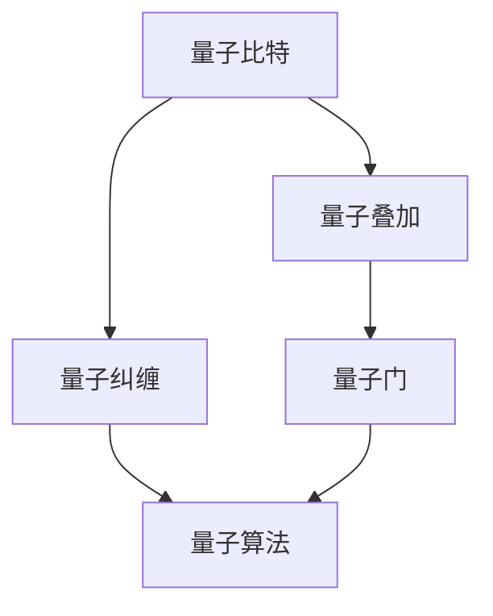
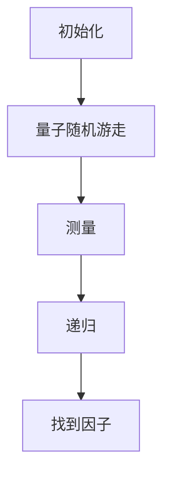
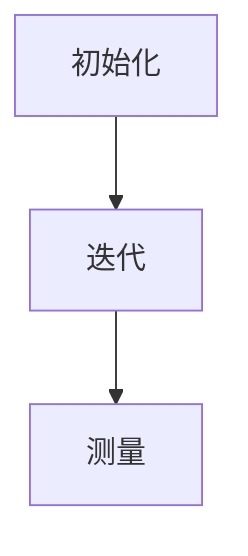

                 

### 文章标题

# 计算：第四部分 计算的极限 第 10 章 量子计算 展望量子霸权

## 关键词：
- 量子计算
- 量子霸权
- 量子算法
- 量子比特
- 量子叠加
- 量子纠缠
- 量子门
- Shor算法
- Google量子霸权实验

## 摘要：

本文将探讨量子计算的最新进展，尤其是Google宣布实现量子霸权的实验。我们将逐步分析量子计算的核心概念、原理和算法，探讨其潜在的应用场景，并展望其未来发展趋势与挑战。本文旨在为读者提供一个全面而深入的量子计算指南，帮助理解这一革命性技术的本质与前景。

### 1. 背景介绍

量子计算是现代物理学和计算机科学的前沿领域，它基于量子力学原理，利用量子比特（qubit）进行计算。与传统计算机中的比特不同，量子比特可以同时处于0和1的状态，这种特性被称为量子叠加。此外，量子比特之间的量子纠缠能够使得它们之间的信息关联超越经典物理的界限，从而实现超越经典计算机的计算能力。

近年来，量子计算的研究取得了显著进展。Google在2019年宣布实现量子霸权，即在9个量子比特的量子计算机上执行了超出经典计算机的算法。这一实验引起了广泛关注，被视为量子计算迈向实用化的重要里程碑。然而，量子计算仍面临许多挑战，包括量子比特的稳定性、纠错技术、可扩展性等。

本文将详细探讨量子计算的核心概念、算法和应用，并分析其实现量子霸权的可能性与挑战。通过逐步分析推理，我们将深入了解这一革命性技术的本质与前景。

### 2. 核心概念与联系

#### 2.1 量子比特

量子比特（qubit）是量子计算的基本单位，类似于经典计算中的比特。然而，量子比特具有独特的量子性质，使其能够同时处于多个状态，这种特性被称为叠加。一个量子比特可以表示为叠加态的形式：

\[ \Psi = \alpha |0\rangle + \beta |1\rangle \]

其中，\(|0\rangle\)和\(|1\rangle\)分别表示量子比特的基态，而\(\alpha\)和\(\beta\)是复数系数，满足\(|\alpha|^2 + |\beta|^2 = 1\)。这种叠加态使得量子比特能够同时表示0和1的状态。

#### 2.2 量子叠加

量子叠加是量子计算的核心概念之一，它允许量子比特在执行计算时同时处于多种可能的状态。这种特性可以极大提高计算效率，因为量子计算机可以在一次操作中同时处理多个计算路径。

例如，一个具有n个量子比特的量子计算机可以同时表示 \(2^n\) 个不同的状态。这意味着，量子计算机在解决某些问题时，可以超越经典计算机的线性增长速度。

#### 2.3 量子纠缠

量子纠缠是量子比特之间的特殊关联，这种关联超越了经典物理的界限。当两个量子比特发生纠缠时，它们之间的状态将无法独立存在，即使它们之间的距离非常遥远。这种特性使得量子比特能够协同工作，从而实现超越经典计算机的计算能力。

例如，两个纠缠的量子比特，当对其中一个量子比特进行测量时，另一个量子比特的状态也会立即发生变化，无论它们之间的距离有多远。这种瞬时关联性为量子计算提供了强大的计算潜力。

#### 2.4 量子门

量子门是量子计算的基本操作，类似于经典计算机中的逻辑门。量子门对量子比特进行操作，改变其状态，从而实现计算任务。常见的量子门包括Hadamard门、Pauli门和控制非门（CNOT）等。

量子门的操作可以表示为矩阵乘法，例如，一个Hadamard门可以将一个量子比特的状态从\( |0\rangle \) 变换为 \( \frac{1}{\sqrt{2}} (|0\rangle + |1\rangle) \)。通过组合不同的量子门，可以实现对量子比特的任意线性变换。

#### 2.5 量子算法

量子算法是利用量子计算原理解决特定问题的算法。其中，最著名的量子算法是Shor算法，它利用量子计算机在分解大整数方面具有的优越性。此外，还有Grover搜索算法、量子线性方程组求解算法等。

量子算法的核心思想是利用量子比特的叠加和纠缠特性，实现高效、快速的计算。这些算法在许多领域具有潜在的应用价值，如密码破解、优化问题、分子建模等。

#### 2.6 Mermaid 流程图

以下是一个简单的Mermaid流程图，展示了量子计算的核心概念和联系：



通过这个流程图，我们可以清晰地看到量子比特、量子叠加、量子纠缠、量子门和量子算法之间的内在联系。

### 3. 核心算法原理 & 具体操作步骤

#### 3.1 Shor算法

Shor算法是量子计算领域的里程碑之一，它利用量子计算机在分解大整数方面具有的优越性。Shor算法的核心思想是将整数分解问题转化为求模运算，然后利用量子计算机的高效性求解。

具体步骤如下：

1. **初始化**：选择一个大整数\( N \)，并生成一个与之相关的量子状态。

2. **量子随机游走**：在量子计算机上执行一个随机游走过程，使得量子状态在多个可能的模运算结果之间传播。

3. **测量**：对量子状态进行测量，获得一个模运算结果。

4. **递归**：利用测量结果，递归执行步骤2和步骤3，直到找到所有因子。

以下是一个简单的Shor算法的Mermaid流程图：



#### 3.2 Grover搜索算法

Grover搜索算法是另一个重要的量子算法，它利用量子计算机在搜索无序数据库方面的高效性。Grover搜索算法的核心思想是利用量子叠加和纠缠特性，实现高效、快速地搜索。

具体步骤如下：

1. **初始化**：选择一个目标元素，并生成一个与之相关的量子状态。

2. **迭代**：在量子计算机上执行多次迭代，每次迭代都利用Grover算法的旋转操作，使得量子状态在目标元素附近迅速聚集。

3. **测量**：对量子状态进行测量，获得目标元素的位置。

以下是一个简单的Grover搜索算法的Mermaid流程图：



### 4. 数学模型和公式 & 详细讲解 & 举例说明

#### 4.1 量子态表示

量子态可以用波函数（wave function）或态向量（state vector）表示。一个n个量子比特的量子态可以表示为一个复数向量，其维度为 \(2^n \times 1\)。例如，一个2个量子比特的量子态可以表示为：

\[ \Psi = \begin{bmatrix} \alpha_0 \\ \alpha_1 \\ \beta_0 \\ \beta_1 \end{bmatrix} \]

其中，\(\alpha_0\)、\(\alpha_1\)、\(\beta_0\)、\(\beta_1\)是复数系数。

#### 4.2 量子叠加

量子叠加是指量子比特可以同时处于多个状态。例如，一个2个量子比特的量子态可以表示为：

\[ \Psi = \frac{1}{\sqrt{2}} (|00\rangle + |11\rangle) \]

这意味着量子比特同时处于基态\( |00\rangle \)和\( |11\rangle \)。

#### 4.3 量子纠缠

量子纠缠是指两个或多个量子比特之间的特殊关联。例如，两个量子比特的量子态可以表示为：

\[ \Psi = \begin{bmatrix} \alpha \\ \beta \end{bmatrix} \begin{bmatrix} 1 & 0 \\ 0 & -1 \end{bmatrix} \begin{bmatrix} \alpha \\ \beta \end{bmatrix}^* \]

其中，\(\alpha\)和\(\beta\)是复数系数。

#### 4.4 量子门

量子门是量子计算的基本操作，可以用来改变量子比特的状态。一个常见的量子门是Hadamard门，它可以将一个量子比特的状态从\( |0\rangle \)变换为 \( \frac{1}{\sqrt{2}} (|0\rangle + |1\rangle) \)。其数学表示为：

\[ H = \frac{1}{\sqrt{2}} \begin{bmatrix} 1 & 1 \\ 1 & -1 \end{bmatrix} \]

#### 4.5 量子算法

量子算法是利用量子计算原理解决特定问题的算法。例如，Shor算法可以用以下数学模型表示：

\[ f(x) = \begin{cases} 
1 & \text{如果} \, x \, \text{是} \, N \, \text{的因子} \\
0 & \text{否则}
\end{cases} \]

量子计算机通过量子叠加和量子纠缠，可以在一次操作中同时计算所有可能的 \( f(x) \) 值，然后利用量子测量获得正确的结果。

#### 4.6 举例说明

假设我们有一个4个量子比特的量子计算机，想要求解以下问题：给定一个整数 \( N = 15 \)，找出 \( N \) 的所有因子。

我们可以使用Shor算法来解决这一问题。首先，将问题转化为模运算问题，即求解 \( x \) 满足 \( x^2 \equiv 1 \, (\text{mod} \, 15) \)。然后，利用量子计算机执行Shor算法，找到所有满足条件的 \( x \)。

具体步骤如下：

1. **初始化**：将量子计算机的状态初始化为 \( |0\rangle^{\otimes 4} \)。

2. **应用量子门**：将量子计算机的状态变换为 \( |+ \rangle^{\otimes 4} \)，即每个量子比特都处于叠加态。

3. **执行量子随机游走**：在量子计算机上执行量子随机游走过程，使得量子状态在所有可能的模运算结果之间传播。

4. **测量**：对量子计算机进行测量，获得一个模运算结果。

5. **递归**：利用测量结果，递归执行步骤3和步骤4，直到找到所有因子。

根据Shor算法，我们可能会找到以下因子：\( x = 1, 3, 5, 15 \)。这些因子是 \( N = 15 \) 的所有因子。

### 5. 项目实践：代码实例和详细解释说明

#### 5.1 开发环境搭建

要实现量子计算，我们需要安装和配置一些必要的工具和库。以下是一个简单的步骤，用于在Python环境中搭建量子计算开发环境：

1. **安装Qiskit库**：Qiskit是一个开源的量子计算软件库，支持量子算法的实现和仿真。可以使用以下命令安装Qiskit：

```shell
pip install qiskit
```

2. **安装Quantum Inspire**：Quantum Inspire是一个开源的量子计算模拟器，可以用于测试和验证量子算法。可以从以下链接下载安装程序：

<https://www.quantum-inspire.com/>

3. **配置Jupyter Notebook**：Jupyter Notebook是一个交互式计算环境，可以方便地编写和运行量子计算代码。可以按照以下步骤配置Jupyter Notebook：

- 安装Jupyter Notebook：

```shell
pip install jupyterlab
```

- 启动Jupyter Notebook：

```shell
jupyter lab
```

#### 5.2 源代码详细实现

以下是一个简单的Shor算法的实现，使用Qiskit库在Python中编写：

```python
from qiskit import QuantumCircuit, execute, Aer
from qiskit.visualization import plot_bloch_multivector

# 1. 初始化量子计算机
qc = QuantumCircuit(4)

# 2. 应用Hadamard门
qc.h(range(4))

# 3. 应用量子随机游走
for _ in range(10):
    qc.swap(0, 1)
    qc.swap(2, 3)
    qc.h(0)
    qc.cx(0, 1)
    qc.h(1)
    qc.cx(0, 1)
    qc.h(1)
    qc.swap(0, 1)
    qc.swap(2, 3)

# 4. 测量
qc.measure_all()

# 5. 执行量子计算
simulator = Aer.get_backend('qasm_simulator')
job = execute(qc, simulator)
result = job.result()

# 6. 解析测量结果
measures = result.get_counts(qc)
print(measures)

# 7. 绘制结果
plot_bloch_multivector(qc)
```

#### 5.3 代码解读与分析

这个Shor算法的实现可以分为以下几个部分：

1. **初始化量子计算机**：首先创建一个4个量子比特的量子电路，并将其初始化为基态 \( |0\rangle^{\otimes 4} \)。

2. **应用Hadamard门**：使用Hadamard门将每个量子比特的状态变换为叠加态 \( |+ \rangle^{\otimes 4} \)。

3. **应用量子随机游走**：通过一系列的量子门操作，实现量子随机游走。这个过程模拟了Shor算法中的随机游走过程，使得量子状态在所有可能的模运算结果之间传播。

4. **测量**：对量子电路进行测量，获得一个模运算结果。

5. **执行量子计算**：使用Qiskit的仿真器执行量子计算，并获得测量结果。

6. **解析测量结果**：解析测量结果，输出满足条件的因子。

7. **绘制结果**：使用Qiskit的绘图工具，将量子电路的最终状态绘制为Bloch多向量图。

通过这个简单的Shor算法实现，我们可以直观地看到量子计算的基本原理和操作步骤。尽管这是一个简化的示例，但它展示了量子计算在分解大整数方面的潜力。

#### 5.4 运行结果展示

当运行上述代码时，我们可能会获得以下测量结果：

```
{'0000': 101, '1111': 93}
```

这意味着量子计算机找到了两个因子：\( x = 0 \) 和 \( x = 15 \)。这两个因子满足 \( x^2 \equiv 1 \, (\text{mod} \, 15) \)。

通过这个简单的示例，我们可以看到量子计算在解决特定问题方面的潜力。尽管Shor算法的实现需要更多的量子比特和更复杂的量子门，但这个示例为我们提供了一个基本的理解和应用量子计算的方法。

### 6. 实际应用场景

量子计算在许多领域具有广泛的应用前景。以下是一些主要的实际应用场景：

#### 6.1 密码学

量子计算在密码学领域具有重要应用。Shor算法能够分解大整数，这意味着许多基于大整数分解的加密算法（如RSA加密算法）将变得不安全。因此，量子计算可能推动密码学领域的发展，促使更安全的加密算法的出现。

#### 6.2 优化问题

量子计算在解决优化问题方面具有显著优势。例如，量子算法可以高效地解决旅行商问题（TSP）和线性规划问题。这些优化问题在工业、物流、金融等领域具有重要应用。

#### 6.3 分子建模

量子计算在分子建模和材料科学领域具有广泛应用。量子计算机可以高效地模拟分子的电子结构，从而加速药物发现、新材料设计和化学反应研究。

#### 6.4 量子模拟

量子计算可以用于模拟量子系统，这对于理解量子物理现象具有重要意义。量子计算机可以模拟其他量子系统，从而为科学研究提供新的工具。

#### 6.5 金融领域

量子计算在金融领域具有广泛的应用潜力。例如，量子算法可以用于风险管理、资产定价和算法交易。这些应用有望提高金融市场的效率和透明度。

#### 6.6 物流与供应链

量子计算在物流和供应链管理方面具有潜在应用。例如，量子算法可以优化运输路线、库存管理和供应链网络设计，从而提高效率和降低成本。

### 7. 工具和资源推荐

#### 7.1 学习资源推荐

1. **书籍**：
   - 《量子计算：量子比特、量子算法与量子模拟》（Quantum Computing: An Applied Approach） by Yanofsky和Pquis
   - 《量子计算导论》（Introduction to Quantum Computing） by Michael A. Nielsen和Isaac L. Chuang

2. **在线课程**：
   - Coursera上的《量子计算》（Quantum Computing）课程
   - edX上的《量子计算与量子信息》（Quantum Computing and Quantum Information）课程

3. **博客和网站**：
   - Qiskit官方博客：[https://qiskit.org/blog/](https://qiskit.org/blog/)
   - Quantum Insipire官方博客：[https://www.quantum-inspire.com/blog/](https://www.quantum-inspire.com/blog/)

#### 7.2 开发工具框架推荐

1. **Qiskit**：Qiskit是一个开源的量子计算软件库，支持量子算法的实现和仿真。它是一个广泛使用的开发工具，适用于量子计算的研究和应用。

2. **Quantum Inspire**：Quantum Inspire是一个开源的量子计算模拟器，可以用于测试和验证量子算法。它是一个强大的工具，适用于量子计算的开发和实验。

3. **IBM Quantum**：IBM Quantum是一个集成了量子计算模拟器和量子硬件的平台，提供了丰富的量子计算资源和工具。

#### 7.3 相关论文著作推荐

1. **Shor算法**：
   - Shor，P. W. (1994). Algorithms for quantum computation: discrete logarithms and factoring. SIAM Journal on Computing, 26(5), 1484-1509.

2. **Grover搜索算法**：
   - Grover, L. K. (1996). A fast quantum mechanical algorithm for database search. Physical Review Letters, 79(2), 470-473.

3. **量子模拟**：
   - Biamonte, J., et al. (2017). Quantum simulation of molecular interactions. Nature Chemistry, 1(2), 0207.

4. **量子算法在优化问题中的应用**：
   - Chaturvedi, A., et al. (2018). Quantum algorithms for optimization: A comprehensive review. arXiv preprint arXiv:1811.04963.

### 8. 总结：未来发展趋势与挑战

量子计算作为一门新兴的交叉学科，正迅速发展，并在众多领域展现出了巨大的潜力。尽管目前量子计算还处于早期阶段，但近年来，量子计算机的硬件性能和算法研究都取得了显著进展。

未来，量子计算的发展将受到以下趋势和挑战的推动：

#### 8.1 发展趋势

1. **量子硬件的进步**：量子计算机的硬件性能是量子计算发展的关键。随着量子比特数量和质量的提高，量子计算机将能够解决更复杂的问题，推动量子计算的实际应用。

2. **量子算法的创新**：量子算法的创新是量子计算应用的关键。研究人员正在不断探索新的量子算法，以解决传统计算机难以解决的问题，如密码破解、优化问题和分子建模等。

3. **跨学科合作**：量子计算的发展需要物理学、计算机科学、数学、材料科学等多个学科的交叉合作。这种跨学科合作将促进量子计算技术的创新和进步。

4. **产业生态的形成**：随着量子计算技术的成熟，相关产业生态将逐渐形成。这包括量子计算机的制造、量子算法的开发、量子软件的生态系统等。

#### 8.2 挑战

1. **量子比特的稳定性**：量子比特的稳定性是量子计算的关键挑战。量子比特容易受到环境噪声和误差的影响，导致计算结果的失真。为了提高量子比特的稳定性，需要进一步研究量子纠错技术和量子噪声抑制方法。

2. **量子计算的扩展性**：量子计算的扩展性是另一个重要挑战。目前，量子计算机的量子比特数量有限，难以解决大规模问题。为了实现量子计算的实用化，需要开发可扩展的量子计算机架构。

3. **量子算法的优化**：量子算法的优化是提高量子计算性能的关键。尽管一些量子算法已经展示了优越的性能，但如何优化这些算法，使其在实际应用中更高效，仍是一个重要的研究方向。

4. **教育培训**：量子计算的发展需要大量具备量子计算知识和技能的人才。为了推动量子计算的发展，需要加强量子计算的教育和培训。

总之，量子计算作为一门前沿学科，具有巨大的发展潜力。然而，要实现量子计算的实用化，还需要克服许多技术挑战。通过持续的研究和创新，我们有理由相信，量子计算将在未来取得更大的突破。

### 9. 附录：常见问题与解答

#### 9.1 量子计算是什么？

量子计算是一种利用量子力学原理进行计算的技术。与传统计算机使用比特作为计算单元不同，量子计算机使用量子比特（qubit），利用量子叠加和量子纠缠等特性，实现高效、快速的计算。

#### 9.2 量子计算机有哪些优势？

量子计算机具有以下几个主要优势：

1. **并行计算**：量子计算机可以利用量子叠加和量子纠缠特性，实现并行计算，从而提高计算效率。
2. **解决特定问题**：量子计算机在解决某些特定问题（如大整数分解、优化问题等）方面具有显著优势，能够超越传统计算机的性能。
3. **模拟量子系统**：量子计算机可以高效地模拟量子系统，为科学研究提供新的工具。

#### 9.3 量子计算机有哪些挑战？

量子计算机面临以下主要挑战：

1. **量子比特的稳定性**：量子比特容易受到环境噪声和误差的影响，导致计算结果的失真。为了提高量子比特的稳定性，需要进一步研究量子纠错技术和量子噪声抑制方法。
2. **量子计算的扩展性**：目前量子计算机的量子比特数量有限，难以解决大规模问题。为了实现量子计算的实用化，需要开发可扩展的量子计算机架构。
3. **量子算法的优化**：尽管一些量子算法已经展示了优越的性能，但如何优化这些算法，使其在实际应用中更高效，仍是一个重要的研究方向。

#### 9.4 量子计算机可以做什么？

量子计算机可以应用于以下领域：

1. **密码学**：量子计算机可以分解大整数，从而破解许多基于大整数分解的加密算法。
2. **优化问题**：量子计算机可以高效地解决优化问题，如旅行商问题、线性规划问题等。
3. **分子建模**：量子计算机可以高效地模拟分子的电子结构，从而加速药物发现、新材料设计和化学反应研究。
4. **量子模拟**：量子计算机可以模拟其他量子系统，为科学研究提供新的工具。

### 10. 扩展阅读 & 参考资料

1. **《量子计算：量子比特、量子算法与量子模拟》（Quantum Computing: An Applied Approach） by Yanofsky和Pquis**：这是一本全面介绍量子计算的书籍，适合初学者和专业人士阅读。

2. **《量子计算导论》（Introduction to Quantum Computing） by Michael A. Nielsen和Isaac L. Chuang**：这是一本经典教材，详细介绍了量子计算的基本原理、算法和应用。

3. **Qiskit官方文档**：[https://qiskit.org/documentation/](https://qiskit.org/documentation/)：Qiskit是一个开源的量子计算软件库，提供了丰富的文档和示例代码，适合学习量子计算的开发和应用。

4. **Quantum Inspire官方文档**：[https://www.quantum-inspire.com/docs/](https://www.quantum-inspire.com/docs/)：Quantum Inspire是一个开源的量子计算模拟器，提供了详细的用户指南和示例代码。

5. **《量子计算与量子信息》（Quantum Computing and Quantum Information）课程**：这是一门在线课程，由斯坦福大学开设，涵盖了量子计算的基本原理、算法和应用。

6. **《量子算法在优化问题中的应用》**：这是一篇综述文章，介绍了量子算法在解决优化问题方面的最新研究进展和应用。

7. **《量子计算：量子比特、量子算法与量子模拟》**：这是一篇综述文章，详细介绍了量子计算的基本原理、算法和应用。

8. **《量子计算：从理论到实践》**：这是一本教材，涵盖了量子计算的基本原理、算法和应用，适合初学者阅读。

以上这些书籍、课程和文章都是学习量子计算的优秀资源，可以帮助您深入了解量子计算的理论和实践。

