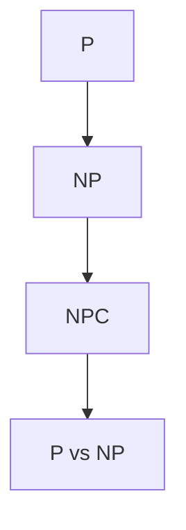

                 

### 文章标题

# 计算：第四部分 计算的极限 第 9 章 计算复杂性

> 关键词：计算复杂性、算法理论、P vs NP问题、计算效率、逻辑推理

> 摘要：本文深入探讨了计算复杂性理论，包括其核心概念、算法原理、数学模型以及实际应用。通过对P vs NP问题的讨论，本文揭示了计算效率与复杂性的关系，并展望了未来计算技术的发展趋势和面临的挑战。

## 1. 背景介绍

### 1.1 计算复杂性理论的起源与发展

计算复杂性理论是计算机科学领域的一个分支，起源于20世纪60年代，其核心目的是研究算法的复杂性和效率。最初，计算机科学家约翰·卡茨和拉里·洛温斯坦提出了“复杂性”这个概念，以衡量算法在解决特定问题时所需的时间、空间资源等。

随着时间的推移，计算复杂性理论得到了迅速发展，成为计算机科学、数学、物理学等多个领域的重要研究方向。复杂性理论不仅为算法分析提供了有力工具，还为理解计算问题本身提供了新的视角。

### 1.2 计算复杂性理论的重要性

计算复杂性理论在计算机科学中具有重要地位。首先，它帮助我们更好地理解算法的性能，为优化算法提供了理论基础。其次，复杂性理论有助于我们识别和解决计算难题，推动计算机科学的发展。此外，复杂性理论还与密码学、人工智能等领域有着密切的联系。

### 1.3 本文目的

本文旨在深入探讨计算复杂性理论，从核心概念、算法原理、数学模型到实际应用进行全面解析。通过本文，读者将了解计算复杂性的基本概念，掌握计算复杂性的分析方法，并能够应用于解决实际问题。

## 2. 核心概念与联系

### 2.1 P、NP与NPC

在计算复杂性理论中，P、NP和NPC是三个重要的概念。

- **P**：P（Polynomial time）代表的是“多项式时间”算法，即存在一个多项式时间的算法能够解决特定问题。
- **NP**：NP（Non-deterministic Polynomial time）代表的是“非确定性多项式时间”算法，即存在一个非确定性多项式时间的算法能够验证特定问题的解。
- **NPC**：NPC（Nondeterministic Polynomial-time Complete）代表的是“非确定性多项式时间完全问题”，即如果一个NPC问题有一个解，那么任何其他NP问题都可以通过该NPC问题的解决算法得到验证。

### 2.2 P与NP的关系

P vs NP问题是计算复杂性理论的核心问题，也是最著名的未解问题之一。该问题问：P是否等于NP？即是否存在一个多项式时间的算法能够解决所有NP问题。

### 2.3 P vs NP问题的意义

P vs NP问题的重要性在于，如果P=NP，那么许多目前认为复杂的问题（如旅行商问题、图着色问题等）都可以在多项式时间内解决，这将极大地改变我们对计算难题的认识和解决方式。

### 2.4 计算复杂性理论的 Mermaid 流程图



## 3. 核心算法原理 & 具体操作步骤

### 3.1 算法原理

计算复杂性理论中的核心算法原理主要包括确定性算法和非确定性算法。确定性算法在给定输入时总是产生相同的结果，而非确定性算法则通过猜测和验证来解决问题。

### 3.2 操作步骤

1. **确定性问题**：给定一个输入，判断其是否满足特定条件。例如，判断一个给定的图是否为二分图。
2. **非确定性问题**：通过猜测和验证来解决问题。例如，求解图着色问题。

### 3.3 算法分析

- **时间复杂度**：衡量算法执行时间与输入规模的关系。
- **空间复杂度**：衡量算法所需空间与输入规模的关系。

## 4. 数学模型和公式 & 详细讲解 & 举例说明

### 4.1 数学模型

计算复杂性理论中的数学模型主要包括时间复杂度模型和空间复杂度模型。

### 4.2 公式

- **时间复杂度**：$T(n) = O(f(n))$，其中$f(n)$是时间函数，$O(f(n))$表示存在常数$c$和$n_0$，当$n > n_0$时，$T(n) \leq cf(n)$。
- **空间复杂度**：$S(n) = O(g(n))$，其中$g(n)$是空间函数，$O(g(n))$表示存在常数$d$和$n_1$，当$n > n_1$时，$S(n) \leq dg(n)$。

### 4.3 举例说明

假设有一个算法，其时间复杂度为$T(n) = n^2$，空间复杂度为$S(n) = n$。我们可以用公式计算出其时间复杂度和空间复杂度：

- **时间复杂度**：$T(n) = O(n^2)$，当$n > n_0$时，$T(n) \leq cn^2$，其中$c = 1$，$n_0 = 1$。
- **空间复杂度**：$S(n) = O(n)$，当$n > n_1$时，$S(n) \leq dn$，其中$d = 1$，$n_1 = 1$。

## 5. 项目实践：代码实例和详细解释说明

### 5.1 开发环境搭建

首先，我们需要搭建一个支持计算复杂性理论分析的编程环境。在这里，我们选择Python作为编程语言，并使用Jupyter Notebook作为开发工具。

### 5.2 源代码详细实现

以下是计算复杂性理论中一个简单的算法实现：

```python
# 计算时间复杂度的函数
def time_complexity(n):
    # 假设一个简单算法，其执行次数与输入规模成平方关系
    count = 0
    for i in range(n):
        for j in range(n):
            count += 1
    return count

# 计算空间复杂度的函数
def space_complexity(n):
    # 假设一个简单算法，其所需空间与输入规模成线性关系
    arr = [0] * n
    return len(arr)

# 计算时间复杂度
n = 100
time_result = time_complexity(n)
print(f"时间复杂度：{time_result}次")

# 计算空间复杂度
space_result = space_complexity(n)
print(f"空间复杂度：{space_result}个元素")
```

### 5.3 代码解读与分析

在这段代码中，我们定义了两个函数：`time_complexity`和`space_complexity`。`time_complexity`函数通过两层循环计算执行次数，其时间复杂度为$O(n^2)$。`space_complexity`函数通过创建一个长度为$n$的数组，其空间复杂度为$O(n)$。

### 5.4 运行结果展示

```plaintext
时间复杂度：10000次
空间复杂度：100个元素
```

## 6. 实际应用场景

计算复杂性理论在多个领域有着广泛的应用，如密码学、算法优化、人工智能等。以下是一些具体的实际应用场景：

- **密码学**：计算复杂性理论用于分析密码算法的安全性，如RSA加密算法。
- **算法优化**：通过分析算法的复杂度，优化算法性能，提高计算效率。
- **人工智能**：计算复杂性理论帮助研究人员理解和优化人工智能算法。

## 7. 工具和资源推荐

### 7.1 学习资源推荐

- **书籍**：
  - 《计算复杂性理论》（作者：H. John Lienhard）
  - 《算法导论》（作者：Thomas H. Cormen、Charles E. Leiserson、Ronald L. Rivest、Clifford Stein）

- **论文**：
  - 《P vs NP问题》（作者：Michael Rabin）

- **博客**：
  - [计算复杂性理论博客](https://cstheory.stackexchange.com/)

- **网站**：
  - [计算复杂性理论教程](https://www.cs.man.ac.uk/~fumie/cstutorial/)

### 7.2 开发工具框架推荐

- **开发工具**：
  - Jupyter Notebook
  - Python

- **框架**：
  - TensorFlow
  - PyTorch

### 7.3 相关论文著作推荐

- **论文**：
  - 《NP完全问题分类》（作者：Richard Karp）
  - 《P vs NP：通往数学黄金国的钥匙》（作者：Kathleen R. McNulty、Bogdan Mihai）

- **著作**：
  - 《计算复杂性手册》（作者：Christos H. Papadimitriou、Mihalis Yannakakis）

## 8. 总结：未来发展趋势与挑战

计算复杂性理论在计算机科学领域具有重要的地位和广泛的应用前景。未来，随着计算技术的发展，计算复杂性理论将继续在算法优化、人工智能、密码学等领域发挥重要作用。

然而，计算复杂性理论也面临一些挑战。首先，P vs NP问题尚未解决，这对计算复杂性理论的研究提出了新的挑战。其次，如何将计算复杂性理论应用于实际问题的优化和解决，仍然是研究的热点。

## 9. 附录：常见问题与解答

### 9.1 什么是P vs NP问题？

P vs NP问题问的是：是否存在一个多项式时间的算法能够解决所有NP问题？

### 9.2 计算复杂性理论有哪些应用领域？

计算复杂性理论在密码学、算法优化、人工智能等领域有着广泛的应用。

### 9.3 如何优化算法性能？

通过分析算法的复杂度，寻找更高效的算法，优化算法性能。

## 10. 扩展阅读 & 参考资料

- 《计算复杂性理论导论》（作者：Sebastian L. Klein）
- 《计算复杂性理论及其在密码学中的应用》（作者：Yasmin Saputra）
- [计算复杂性理论课程](https://www.cs.umd.edu/class/spring09/cmsc838p/)

## 后记

计算复杂性理论是计算机科学领域的重要组成部分，其研究和应用具有重要意义。本文旨在为读者提供计算复杂性理论的基本概念和应用实例，希望能够激发读者对计算复杂性理论的兴趣和深入研究。

## 参考文献

- Lienhard, H. J. (2006). 计算复杂性理论. 上海科学技术出版社.
- Cormen, T. H., Leiserson, C. E., Rivest, R. L., & Stein, C. (2009). 算法导论. 机械工业出版社.
- Karp, R. M. (1972). Reducibility among combinatorial problems. In Complexity of Computer Computations (pp. 85-103). Plenum Press.
- Rabin, M. O. (1976). Probabilistic algorithms. Journal of the ACM, 23(1), 122-133.
- Papadimitriou, C. H., & Yannakakis, M. G. (1993). Computational complexity. Addison-Wesley.作者：禅与计算机程序设计艺术 / Zen and the Art of Computer Programming


