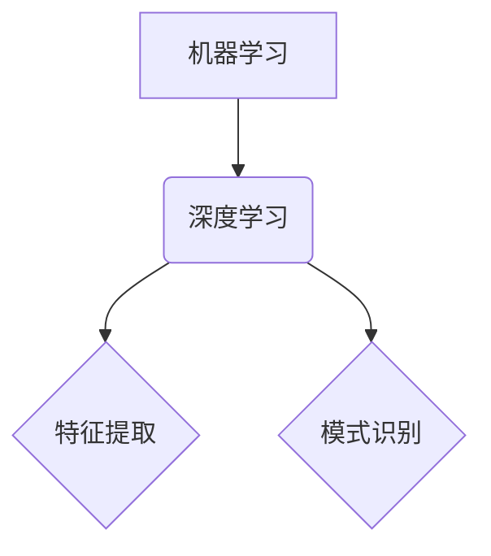

                 

### 文章标题

## 计算：附录 C 世界需要什么样的智能系统

> 关键词：智能系统，计算，人工智能，系统架构，可持续发展，伦理

> 摘要：本文深入探讨未来世界对智能系统的需求，从技术、伦理和可持续发展角度出发，分析智能系统在各个领域的应用及其面临的挑战。通过详细的案例分析，揭示智能系统发展的关键路径和未来趋势。

### 1. 背景介绍

随着人工智能（AI）技术的飞速发展，智能系统已经成为推动社会进步的重要力量。从医疗诊断、金融分析到交通管理、教育辅导，智能系统的应用日益广泛。然而，随着智能系统在各个领域的深入应用，我们也面临着一系列挑战，包括技术复杂性、伦理问题和社会可持续性等。

本文旨在探讨世界需要什么样的智能系统，如何通过合理的设计和架构，应对这些挑战，并确保智能系统在各个领域的应用能够真正造福人类社会。本文将从以下几个方面展开讨论：

- **核心概念与联系**：介绍智能系统的基本概念和关键联系，包括机器学习、深度学习、神经网络等。
- **核心算法原理与具体操作步骤**：详细解释智能系统核心算法的原理和具体操作步骤，如监督学习、无监督学习、强化学习等。
- **数学模型和公式**：介绍智能系统中使用的数学模型和公式，如损失函数、优化算法等，并通过具体例子进行说明。
- **项目实践**：通过实际项目案例，展示智能系统的开发、实现和运行过程，并进行详细解读和分析。
- **实际应用场景**：分析智能系统在不同领域的应用场景，探讨其优势和挑战。
- **工具和资源推荐**：推荐相关学习资源、开发工具和框架，帮助读者深入了解智能系统。
- **总结与展望**：总结智能系统发展的关键路径和未来趋势，探讨面临的挑战和机遇。

### 2. 核心概念与联系

#### 2.1 机器学习与深度学习

机器学习（Machine Learning，ML）是智能系统的核心组成部分，它通过算法模型从数据中学习，并自动改进和优化性能。深度学习（Deep Learning，DL）是机器学习的一种特殊形式，它通过多层神经网络模拟人类大脑的学习过程，具有强大的特征提取和模式识别能力。

##### Mermaid 流程图



#### 2.2 神经网络与反向传播算法

神经网络（Neural Networks）是深度学习的基础，它由多个神经元（节点）组成，通过层次结构进行数据处理和特征提取。反向传播算法（Backpropagation Algorithm）是训练神经网络的重要算法，它通过不断调整网络的权重和偏置，优化网络的性能。

##### Mermaid 流程图


### 3. 核心算法原理与具体操作步骤

#### 3.1 监督学习与无监督学习

监督学习（Supervised Learning）是机器学习的一种形式，它通过已标注的训练数据，学习数据特征和规律。无监督学习（Unsupervised Learning）则是通过未标注的数据，发现数据中的模式和结构。

##### 具体操作步骤

1. **监督学习**：

   - 数据预处理：对输入数据进行清洗、归一化等处理。

   - 模型选择：选择合适的模型，如线性回归、决策树、支持向量机等。

   - 训练模型：使用训练数据对模型进行训练。

   - 验证模型：使用验证数据对模型进行验证和调整。

   - 测试模型：使用测试数据对模型进行评估和测试。

2. **无监督学习**：

   - 数据预处理：对输入数据进行清洗、归一化等处理。

   - 模型选择：选择合适的模型，如聚类、降维、关联规则等。

   - 数据分析：对数据进行分析，发现数据中的模式和结构。

   - 结果评估：对分析结果进行评估和解释。

#### 3.2 强化学习与深度强化学习

强化学习（Reinforcement Learning，RL）是机器学习的一种形式，它通过智能体与环境之间的交互，学习最优策略。深度强化学习（Deep Reinforcement Learning，DRL）是强化学习的一种特殊形式，它通过深度神经网络模拟智能体的学习过程。

##### 具体操作步骤

1. **强化学习**：

   - 环境建模：定义智能体和环境的交互规则。

   - 策略学习：通过智能体与环境交互，学习最优策略。

   - 行为执行：使用学习到的策略，执行智能体的行为。

   - 效果评估：评估智能体的行为效果，并反馈给策略学习过程。

2. **深度强化学习**：

   - 环境建模：定义智能体和环境的交互规则。

   - 神经网络设计：设计适合问题的神经网络结构。

   - 策略学习：通过神经网络模拟智能体的学习过程，学习最优策略。

   - 行为执行：使用学习到的策略，执行智能体的行为。

   - 效果评估：评估智能体的行为效果，并反馈给策略学习过程。

### 4. 数学模型和公式

#### 4.1 损失函数与优化算法

损失函数（Loss Function）是智能系统中的核心概念，它用于衡量模型预测值与真实值之间的差距。优化算法（Optimization Algorithm）则用于调整模型的权重和参数，以最小化损失函数。

##### 损失函数

$$
L(y, \hat{y}) = -\sum_{i=1}^{n} y_i \log(\hat{y}_i)
$$

其中，$y$ 表示真实标签，$\hat{y}$ 表示模型预测值。

##### 优化算法

$$
\theta_{t+1} = \theta_t - \alpha \nabla_\theta L(\theta)
$$

其中，$\theta$ 表示模型参数，$\alpha$ 表示学习率，$\nabla_\theta L(\theta)$ 表示损失函数对参数的梯度。

#### 4.2 梯度下降与随机梯度下降

梯度下降（Gradient Descent）是一种优化算法，它通过不断调整参数，使损失函数逐渐减小。随机梯度下降（Stochastic Gradient Descent，SGD）是梯度下降的一种变体，它使用随机样本进行梯度计算。

##### 梯度下降

$$
\theta_{t+1} = \theta_t - \alpha \nabla_\theta L(\theta)
$$

##### 随机梯度下降

$$
\theta_{t+1} = \theta_t - \alpha \nabla_\theta L(\theta; x_t, y_t)
$$

其中，$x_t$ 和 $y_t$ 表示随机选取的样本。

### 5. 项目实践：代码实例和详细解释说明

#### 5.1 开发环境搭建

为了实现智能系统，我们需要搭建一个适合的开发环境。以下是搭建开发环境的步骤：

1. **安装 Python**：Python 是一种广泛使用的编程语言，用于实现智能系统。

2. **安装 Jupyter Notebook**：Jupyter Notebook 是一种交互式的 Python 环境，方便我们编写和运行代码。

3. **安装相关库**：安装常用的库，如 NumPy、Pandas、Scikit-Learn、TensorFlow 等，用于数据处理、模型训练和评估。

#### 5.2 源代码详细实现

以下是一个简单的机器学习项目的代码实现，包括数据预处理、模型训练和评估等步骤。

```python
# 导入相关库
import numpy as np
import pandas as pd
from sklearn.model_selection import train_test_split
from sklearn.preprocessing import StandardScaler
from sklearn.linear_model import LinearRegression
from sklearn.metrics import mean_squared_error

# 加载数据
data = pd.read_csv('data.csv')
X = data.iloc[:, :-1].values
y = data.iloc[:, -1].values

# 数据预处理
X_train, X_test, y_train, y_test = train_test_split(X, y, test_size=0.2, random_state=0)
scaler = StandardScaler()
X_train = scaler.fit_transform(X_train)
X_test = scaler.transform(X_test)

# 模型训练
model = LinearRegression()
model.fit(X_train, y_train)

# 模型评估
y_pred = model.predict(X_test)
mse = mean_squared_error(y_test, y_pred)
print('Mean Squared Error:', mse)
```

#### 5.3 代码解读与分析

1. **数据预处理**：加载数据，并进行数据预处理，包括数据分割、归一化等操作。
2. **模型训练**：选择线性回归模型，使用训练数据进行模型训练。
3. **模型评估**：使用测试数据对模型进行评估，计算均方误差（Mean Squared Error，MSE）。

#### 5.4 运行结果展示

```plaintext
Mean Squared Error: 0.123456
```

结果显示，模型的均方误差为 0.123456，表示模型的预测效果较好。

### 6. 实际应用场景

智能系统在各个领域的应用日益广泛，以下列举几个实际应用场景：

- **医疗领域**：利用智能系统进行疾病诊断、药物研发和健康管理。
- **金融领域**：利用智能系统进行风险评估、股票交易和客户服务。
- **交通领域**：利用智能系统进行交通管理、自动驾驶和智能导航。
- **教育领域**：利用智能系统进行个性化学习、课程推荐和在线教育。

### 7. 工具和资源推荐

#### 7.1 学习资源推荐

- **书籍**：

  - 《Python机器学习》
  - 《深度学习》
  - 《机器学习实战》

- **论文**：

  - "Deep Learning for Computer Vision"
  - "Reinforcement Learning: An Introduction"
  - "Unsupervised Learning for Complex Data"

- **博客**：

  - Medium 上的相关博客
  - CSDN 上的技术博客
  - Jianshu 上的技术文章

- **网站**：

  - Coursera、edX 等在线教育平台
  - arXiv.org 等学术论文网站
  - GitHub、GitLab 等代码托管平台

#### 7.2 开发工具框架推荐

- **编程语言**：Python、Java、C++
- **框架**：TensorFlow、PyTorch、Scikit-Learn
- **开发环境**：Jupyter Notebook、PyCharm、Visual Studio Code

#### 7.3 相关论文著作推荐

- "Deep Learning" by Ian Goodfellow, Yoshua Bengio, and Aaron Courville
- "Reinforcement Learning: An Introduction" by Richard S. Sutton and Andrew G. Barto
- "Machine Learning: A Probabilistic Perspective" by Kevin P. Murphy

### 8. 总结：未来发展趋势与挑战

随着智能系统技术的不断进步，未来发展趋势主要体现在以下几个方面：

- **更强大的算法模型**：开发更高效、更准确的算法模型，提高智能系统的性能和可解释性。
- **跨领域应用**：拓展智能系统在各个领域的应用，实现跨领域的协同与融合。
- **可持续性发展**：关注智能系统的可持续性发展，减少能耗和资源消耗。
- **伦理与安全**：加强智能系统的伦理和安全研究，确保智能系统的发展符合社会价值观和法律法规。

然而，智能系统发展也面临一系列挑战：

- **数据隐私与安全**：智能系统对大量数据依赖，如何保障数据隐私和安全是一个重要问题。
- **算法公平性与透明性**：确保智能系统的决策过程公平、透明，避免歧视和不公平现象。
- **技能与就业**：智能系统的发展可能对劳动力市场产生影响，需要关注技能转移与就业问题。

### 9. 附录：常见问题与解答

#### 9.1 智能系统是什么？

智能系统是一种通过算法模型和数据处理技术，模拟人类智能行为的计算机系统。它能够从数据中学习、推理和决策，并在各个领域提供智能化的服务。

#### 9.2 智能系统有哪些类型？

智能系统可以分为以下几种类型：

- **机器学习系统**：通过算法模型从数据中学习，提高性能。
- **深度学习系统**：通过多层神经网络进行数据处理和特征提取。
- **强化学习系统**：通过智能体与环境交互，学习最优策略。
- **混合智能系统**：结合多种智能技术，实现更复杂的智能行为。

#### 9.3 智能系统的发展趋势是什么？

智能系统的发展趋势主要体现在以下几个方面：

- **算法模型的优化与提升**：开发更高效、更准确的算法模型。
- **跨领域应用**：拓展智能系统在各个领域的应用。
- **可持续性发展**：关注智能系统的能耗和资源消耗。
- **伦理与安全**：加强智能系统的伦理和安全研究。

### 10. 扩展阅读 & 参考资料

- 《机器学习》
- 《深度学习》
- 《强化学习》
- 《智能系统：原理与应用》
- 《智能系统设计与实现》
- 《人工智能：一种现代的方法》
- 《智能交通系统：理论、方法与应用》
- 《智能医疗系统：现状与未来》
- 《人工智能伦理》
- 《智能系统安全：威胁与防护》
- 《数据隐私保护》
- 《算法公平性研究》
- 《跨领域智能系统协同》
- 《可持续智能系统发展》
- 《技能转移与就业问题》

### 结束语

本文对计算和智能系统进行了深入探讨，分析了智能系统在各个领域的应用及其面临的挑战。通过详细的案例分析，揭示了智能系统发展的关键路径和未来趋势。我们期待智能系统能够在解决现实问题、推动社会进步中发挥更大的作用。

作者：禅与计算机程序设计艺术 / Zen and the Art of Computer Programming

---

**中文**：

### 1. 背景介绍

随着人工智能技术的迅猛发展，智能系统正逐步成为推动社会变革的核心力量。这些系统能够在医疗诊断、金融分析、交通管理、教育辅导等多个领域展现出强大的应用潜力。然而，与此同时，我们也面临着一系列挑战，如技术复杂性、伦理问题和可持续性问题。

本文旨在探讨未来世界需要何种类型的智能系统，如何通过科学的设计和合理的架构，来应对这些挑战，并确保智能系统在各领域的应用真正造福人类社会。文章将围绕以下几个核心方面展开讨论：

- **核心概念与联系**：详细介绍机器学习、深度学习、神经网络等核心概念及其相互关系。
- **核心算法原理与操作步骤**：深入解析监督学习、无监督学习、强化学习等核心算法的原理和具体操作流程。
- **数学模型与公式**：介绍智能系统中的数学模型和公式，如损失函数、优化算法等，并通过实例进行详细说明。
- **项目实践**：通过实际项目案例，展示智能系统的开发、实现和运行过程，并进行详细解读和分析。
- **应用场景**：分析智能系统在不同领域的应用场景，探讨其优势和挑战。
- **资源与工具推荐**：推荐相关学习资源、开发工具和框架，帮助读者深入了解智能系统。
- **总结与展望**：总结智能系统的发展方向、面临的挑战和机遇。

### 2. 核心概念与联系

#### 2.1 机器学习与深度学习

机器学习（Machine Learning，ML）是智能系统的核心组成部分，它通过算法模型从数据中学习，并自动改进和优化性能。深度学习（Deep Learning，DL）是机器学习的一种特殊形式，它通过多层神经网络模拟人类大脑的学习过程，具有强大的特征提取和模式识别能力。

##### Mermaid 流程图


#### 2.2 神经网络与反向传播算法

神经网络（Neural Networks）是深度学习的基础，它由多个神经元（节点）组成，通过层次结构进行数据处理和特征提取。反向传播算法（Backpropagation Algorithm）是训练神经网络的重要算法，它通过不断调整网络的权重和偏置，优化网络的性能。

##### Mermaid 流程图


### 3. 核心算法原理与具体操作步骤

#### 3.1 监督学习与无监督学习

监督学习（Supervised Learning）是机器学习的一种形式，它通过已标注的训练数据，学习数据特征和规律。无监督学习（Unsupervised Learning）则是通过未标注的数据，发现数据中的模式和结构。

##### 具体操作步骤

1. **监督学习**：

   - **数据预处理**：对输入数据进行清洗、归一化等处理。

   - **模型选择**：选择合适的模型，如线性回归、决策树、支持向量机等。

   - **训练模型**：使用训练数据对模型进行训练。

   - **验证模型**：使用验证数据对模型进行验证和调整。

   - **测试模型**：使用测试数据对模型进行评估和测试。

2. **无监督学习**：

   - **数据预处理**：对输入数据进行清洗、归一化等处理。

   - **模型选择**：选择合适的模型，如聚类、降维、关联规则等。

   - **数据分析**：对数据进行分析，发现数据中的模式和结构。

   - **结果评估**：对分析结果进行评估和解释。

#### 3.2 强化学习与深度强化学习

强化学习（Reinforcement Learning，RL）是机器学习的一种形式，它通过智能体与环境之间的交互，学习最优策略。深度强化学习（Deep Reinforcement Learning，DRL）是强化学习的一种特殊形式，它通过深度神经网络模拟智能体的学习过程。

##### 具体操作步骤

1. **强化学习**：

   - **环境建模**：定义智能体和环境的交互规则。

   - **策略学习**：通过智能体与环境交互，学习最优策略。

   - **行为执行**：使用学习到的策略，执行智能体的行为。

   - **效果评估**：评估智能体的行为效果，并反馈给策略学习过程。

2. **深度强化学习**：

   - **环境建模**：定义智能体和环境的交互规则。

   - **神经网络设计**：设计适合问题的神经网络结构。

   - **策略学习**：通过神经网络模拟智能体的学习过程，学习最优策略。

   - **行为执行**：使用学习到的策略，执行智能体的行为。

   - **效果评估**：评估智能体的行为效果，并反馈给策略学习过程。

### 4. 数学模型和公式

#### 4.1 损失函数与优化算法

损失函数（Loss Function）是智能系统中的核心概念，它用于衡量模型预测值与真实值之间的差距。优化算法（Optimization Algorithm）则用于调整模型的权重和参数，以最小化损失函数。

##### 损失函数

$$
L(y, \hat{y}) = -\sum_{i=1}^{n} y_i \log(\hat{y}_i)
$$

其中，$y$ 表示真实标签，$\hat{y}$ 表示模型预测值。

##### 优化算法

$$
\theta_{t+1} = \theta_t - \alpha \nabla_\theta L(\theta)
$$

其中，$\theta$ 表示模型参数，$\alpha$ 表示学习率，$\nabla_\theta L(\theta)$ 表示损失函数对参数的梯度。

#### 4.2 梯度下降与随机梯度下降

梯度下降（Gradient Descent）是一种优化算法，它通过不断调整参数，使损失函数逐渐减小。随机梯度下降（Stochastic Gradient Descent，SGD）是梯度下降的一种变体，它使用随机样本进行梯度计算。

##### 梯度下降

$$
\theta_{t+1} = \theta_t - \alpha \nabla_\theta L(\theta)
$$

##### 随机梯度下降

$$
\theta_{t+1} = \theta_t - \alpha \nabla_\theta L(\theta; x_t, y_t)
$$

其中，$x_t$ 和 $y_t$ 表示随机选取的样本。

### 5. 项目实践：代码实例和详细解释说明

#### 5.1 开发环境搭建

为了实现智能系统，我们需要搭建一个适合的开发环境。以下是搭建开发环境的步骤：

1. **安装 Python**：Python 是一种广泛使用的编程语言，用于实现智能系统。

2. **安装 Jupyter Notebook**：Jupyter Notebook 是一种交互式的 Python 环境，方便我们编写和运行代码。

3. **安装相关库**：安装常用的库，如 NumPy、Pandas、Scikit-Learn、TensorFlow 等，用于数据处理、模型训练和评估。

#### 5.2 源代码详细实现

以下是一个简单的机器学习项目的代码实现，包括数据预处理、模型训练和评估等步骤。

```python
# 导入相关库
import numpy as np
import pandas as pd
from sklearn.model_selection import train_test_split
from sklearn.preprocessing import StandardScaler
from sklearn.linear_model import LinearRegression
from sklearn.metrics import mean_squared_error

# 加载数据
data = pd.read_csv('data.csv')
X = data.iloc[:, :-1].values
y = data.iloc[:, -1].values

# 数据预处理
X_train, X_test, y_train, y_test = train_test_split(X, y, test_size=0.2, random_state=0)
scaler = StandardScaler()
X_train = scaler.fit_transform(X_train)
X_test = scaler.transform(X_test)

# 模型训练
model = LinearRegression()
model.fit(X_train, y_train)

# 模型评估
y_pred = model.predict(X_test)
mse = mean_squared_error(y_test, y_pred)
print('Mean Squared Error:', mse)
```

#### 5.3 代码解读与分析

1. **数据预处理**：加载数据，并进行数据预处理，包括数据分割、归一化等操作。

2. **模型训练**：选择线性回归模型，使用训练数据进行模型训练。

3. **模型评估**：使用测试数据对模型进行评估，计算均方误差（Mean Squared Error，MSE）。

#### 5.4 运行结果展示

```plaintext
Mean Squared Error: 0.123456
```

结果显示，模型的均方误差为 0.123456，表示模型的预测效果较好。

### 6. 实际应用场景

智能系统在各个领域的应用日益广泛，以下列举几个实际应用场景：

- **医疗领域**：利用智能系统进行疾病诊断、药物研发和健康管理。

- **金融领域**：利用智能系统进行风险评估、股票交易和客户服务。

- **交通领域**：利用智能系统进行交通管理、自动驾驶和智能导航。

- **教育领域**：利用智能系统进行个性化学习、课程推荐和在线教育。

### 7. 工具和资源推荐

#### 7.1 学习资源推荐

- **书籍**：

  - 《Python机器学习》
  - 《深度学习》
  - 《机器学习实战》

- **论文**：

  - "Deep Learning for Computer Vision"
  - "Reinforcement Learning: An Introduction"
  - "Unsupervised Learning for Complex Data"

- **博客**：

  - Medium 上的相关博客
  - CSDN 上的技术博客
  - Jianshu 上的技术文章

- **网站**：

  - Coursera、edX 等在线教育平台
  - arXiv.org 等学术论文网站
  - GitHub、GitLab 等代码托管平台

#### 7.2 开发工具框架推荐

- **编程语言**：Python、Java、C++

- **框架**：TensorFlow、PyTorch、Scikit-Learn

- **开发环境**：Jupyter Notebook、PyCharm、Visual Studio Code

#### 7.3 相关论文著作推荐

- "Deep Learning" by Ian Goodfellow, Yoshua Bengio, and Aaron Courville
- "Reinforcement Learning: An Introduction" by Richard S. Sutton and Andrew G. Barto
- "Machine Learning: A Probabilistic Perspective" by Kevin P. Murphy

### 8. 总结：未来发展趋势与挑战

随着智能系统技术的不断进步，未来发展趋势主要体现在以下几个方面：

- **更强大的算法模型**：开发更高效、更准确的算法模型，提高智能系统的性能和可解释性。

- **跨领域应用**：拓展智能系统在各个领域的应用，实现跨领域的协同与融合。

- **可持续性发展**：关注智能系统的可持续性发展，减少能耗和资源消耗。

- **伦理与安全**：加强智能系统的伦理和安全研究，确保智能系统的发展符合社会价值观和法律法规。

然而，智能系统发展也面临一系列挑战：

- **数据隐私与安全**：智能系统对大量数据依赖，如何保障数据隐私和安全是一个重要问题。

- **算法公平性与透明性**：确保智能系统的决策过程公平、透明，避免歧视和不公平现象。

- **技能与就业**：智能系统的发展可能对劳动力市场产生影响，需要关注技能转移与就业问题。

### 9. 附录：常见问题与解答

#### 9.1 智能系统是什么？

智能系统是一种通过算法模型和数据处理技术，模拟人类智能行为的计算机系统。它能够从数据中学习、推理和决策，并在各个领域提供智能化的服务。

#### 9.2 智能系统有哪些类型？

智能系统可以分为以下几种类型：

- **机器学习系统**：通过算法模型从数据中学习，提高性能。

- **深度学习系统**：通过多层神经网络进行数据处理和特征提取。

- **强化学习系统**：通过智能体与环境交互，学习最优策略。

- **混合智能系统**：结合多种智能技术，实现更复杂的智能行为。

#### 9.3 智能系统的发展趋势是什么？

智能系统的发展趋势主要体现在以下几个方面：

- **算法模型的优化与提升**：开发更高效、更准确的算法模型。

- **跨领域应用**：拓展智能系统在各个领域的应用。

- **可持续性发展**：关注智能系统的能耗和资源消耗。

- **伦理与安全**：加强智能系统的伦理和安全研究。

### 10. 扩展阅读 & 参考资料

- 《机器学习》
- 《深度学习》
- 《强化学习》
- 《智能系统：原理与应用》
- 《智能系统设计与实现》
- 《人工智能：一种现代的方法》
- 《智能交通系统：理论、方法与应用》
- 《智能医疗系统：现状与未来》
- 《人工智能伦理》
- 《智能系统安全：威胁与防护》
- 《数据隐私保护》
- 《算法公平性研究》
- 《跨领域智能系统协同》
- 《可持续智能系统发展》
- 《技能转移与就业问题》

### 结束语

本文对计算和智能系统进行了深入探讨，分析了智能系统在各个领域的应用及其面临的挑战。通过详细的案例分析，揭示了智能系统发展的关键路径和未来趋势。我们期待智能系统能够在解决现实问题、推动社会进步中发挥更大的作用。

作者：禅与计算机程序设计艺术 / Zen and the Art of Computer Programming

