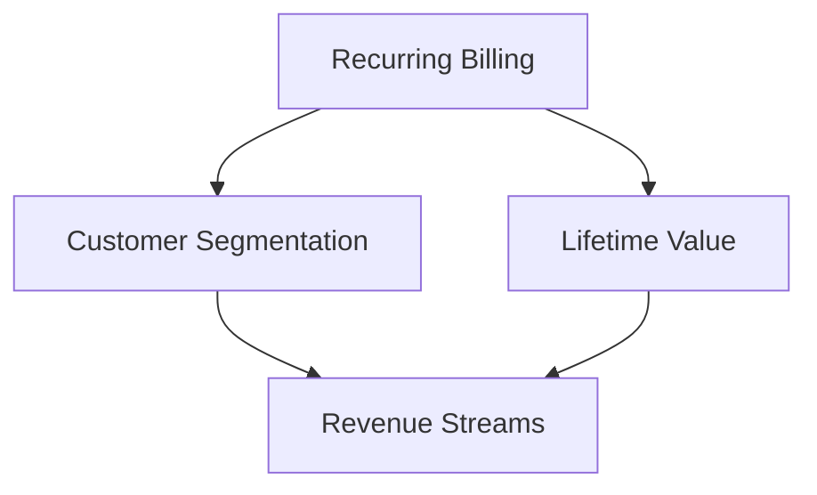

                 

### 文章标题

### Subscription-based Entrepreneurship: Crafting a Stable Cash Flow Business Model

> **Keywords:** Subscription Model, Business Model, Cash Flow, Revenue Streams, Entrepreneurship, Recurring Revenue

> **Abstract:** This article delves into the intricacies of subscription-based entrepreneurship, a powerful business strategy designed to generate stable cash flows. We will explore the core concepts, algorithms, and practical applications of this model, providing a comprehensive guide to building a sustainable and profitable business.

### 1. Background Introduction

In the ever-evolving landscape of business models, the subscription model has emerged as a game-changer, particularly in the digital era. Historically, traditional business models relied on one-time sales or occasional repeat purchases. However, the advent of the internet and digital transformation has given rise to a new paradigm where customers expect convenience, personalization, and continuous value.

The subscription model is a revenue generation strategy where a company offers its products or services on a recurring basis, typically on a monthly or annual basis. This model has gained immense popularity due to its ability to create a steady and predictable cash flow, reduce customer churn, and foster long-term customer relationships.

The foundation of the subscription model lies in its core concepts, which include recurring billing, customer segmentation, and lifetime value. By understanding these concepts, businesses can leverage the model to optimize their revenue streams and achieve sustainable growth.

### 2. Core Concepts and Relationships

To grasp the intricacies of the subscription model, it is essential to understand the core concepts and their interrelationships. Below is a Mermaid flowchart illustrating the key components and their connections:



**Recurring Billing:** The cornerstone of the subscription model is recurring billing. This involves charging customers periodically for access to products or services. It can be monthly, quarterly, or annually, depending on the business model. The predictability of recurring revenue makes it a valuable asset for businesses.

**Customer Segmentation:** Understanding your customers is crucial for the success of a subscription-based business. By segmenting customers based on their behaviors, preferences, and demographics, businesses can tailor their offerings to maximize customer satisfaction and retention.

**Lifetime Value (LTV):** LTV is the total revenue a customer is expected to generate over the entire duration of their relationship with the business. It takes into account the recurring revenue, the length of the customer's subscription, and the cost of acquiring and retaining them. LTV helps businesses prioritize customer acquisition and retention strategies, ensuring they focus on customers who contribute the most to their bottom line.

**Revenue Streams:** Revenue streams are the various ways a business earns money. In a subscription model, the primary revenue stream is the recurring payments from customers. However, businesses can also diversify their revenue streams by offering add-ons, premium features, or one-time purchases.

These core concepts are interconnected, forming a cohesive strategy for generating sustainable revenue. By optimizing each component, businesses can create a robust subscription-based model that drives growth and profitability.

### 3. Core Algorithm Principles and Specific Operational Steps

The subscription model operates on a set of core principles and algorithms that enable businesses to manage and optimize their recurring revenue streams. Here, we will delve into the specific operational steps and the underlying algorithms that make this model effective.

#### 3.1. Recurring Billing Algorithm

The recurring billing algorithm is at the heart of the subscription model. It ensures that customers are billed consistently over time, based on their subscription plans. The algorithm must handle various scenarios, such as:

1. **Initial Billing:** When a customer first signs up, the system calculates the initial charge based on their chosen subscription plan.
2. **Renewal Billing:** The system automatically renews the subscription at the end of the billing cycle, charging the customer the recurring fee.
3. **Late Payments:** Handling cases where customers fail to pay on time, including sending reminders and suspending or canceling the subscription if necessary.
4. **Downgrades and Upgrades:** Handling changes in subscription plans, such as downgrading or upgrading to a different plan mid-cycle.

The algorithm should be robust, scalable, and adaptable to handle these various scenarios seamlessly. Here is a simplified version of the recurring billing algorithm in pseudocode:

```pseudocode
function recurringBilling(customer, plan):
    if customer owes initial payment:
        calculateInitialPayment(customer, plan)
        deductInitialPayment(customer)
    if customer's payment is due:
        calculateRecurringPayment(customer, plan)
        deductRecurringPayment(customer)
    if payment is overdue:
        sendReminder(customer)
        if payment not received after reminder:
            suspendSubscription(customer)
    return success
```

#### 3.2. Customer Segmentation Algorithm

Customer segmentation is crucial for personalizing the subscription experience and maximizing customer satisfaction and retention. The segmentation algorithm categorizes customers into distinct groups based on their behaviors, preferences, and demographics. Here are the key steps in the customer segmentation algorithm:

1. **Data Collection:** Gather relevant customer data, such as purchase history, engagement metrics, demographic information, and feedback.
2. **Feature Engineering:** Extract relevant features from the collected data that can be used for segmentation. For example, customer engagement metrics like the frequency of purchases, average order value, and click-through rates.
3. **Model Training:** Train a machine learning model, such as clustering or classification algorithms, to categorize customers into segments based on the extracted features.
4. **Segment Analysis:** Analyze the characteristics of each segment to identify opportunities for personalization and optimization.
5. **Segmentation Evaluation:** Continuously evaluate the performance of the segmentation model and adjust it as needed to ensure it remains effective.

Here is a high-level pseudocode representation of the customer segmentation algorithm:

```pseudocode
function customerSegmentation(customerData):
    features = extractFeatures(customerData)
    segments = trainModel(features)
    analyzeSegments(segments)
    evaluateModel(segments)
    return segments
```

#### 3.3. Lifetime Value Calculation Algorithm

The lifetime value (LTV) of a customer is a critical metric for subscription-based businesses. It helps determine the potential revenue a customer can generate over their entire relationship with the business. The LTV calculation algorithm involves several steps:

1. **Data Collection:** Gather historical data on customer transactions, including the total revenue generated, the duration of the subscription, and the churn rate.
2. **Statistical Models:** Use statistical models, such as predictive analytics or regression analysis, to estimate the LTV based on the collected data.
3. **Customer Scoring:** Assign a score to each customer based on their LTV, prioritizing high-value customers for targeted marketing and retention efforts.
4. **LTV Forecasting:** Continuously update the LTV estimates as new data becomes available, ensuring accurate predictions of future revenue.

The pseudocode for the LTV calculation algorithm is as follows:

```pseudocode
function calculateLTV(customerData):
    historicalData = collectHistoricalData(customerData)
    ltv = estimateLTV(historicalData)
    customerScore = calculateCustomerScore(ltv)
    updateLTVForecast(ltv)
    return ltv
```

By implementing these core algorithms and operational steps, businesses can build a subscription-based model that maximizes revenue, enhances customer satisfaction, and drives long-term growth.

### 4. Mathematical Models and Formulas & Detailed Explanations & Example Demonstrations

In the realm of subscription-based entrepreneurship, mathematical models and formulas play a pivotal role in understanding, predicting, and optimizing the business's financial performance. These models enable businesses to make data-driven decisions regarding pricing, customer segmentation, and resource allocation. In this section, we will delve into the key mathematical models and formulas used in subscription-based business models, providing detailed explanations and practical examples.

#### 4.1. Recurring Revenue Calculation

The cornerstone of any subscription-based model is recurring revenue. This metric represents the predictable income generated from recurring billing. To calculate recurring revenue, businesses use the following formula:

$$
RR = R \times N
$$

Where:
- \( RR \) is the Recurring Revenue
- \( R \) is the Recurring Fee (e.g., monthly subscription price)
- \( N \) is the Number of Customers on the Subscription Plan

**Example:**
A software company offers a monthly subscription plan for $49. If 1,000 customers are subscribed, the monthly recurring revenue is calculated as:

$$
RR = 49 \times 1000 = \$49,000
$$

#### 4.2. Customer Lifetime Value (LTV)

Customer Lifetime Value (LTV) is a critical metric that estimates the total revenue a customer is expected to generate over their entire relationship with the business. LTV helps businesses prioritize customer acquisition and retention efforts. The formula for LTV is as follows:

$$
LTV = \frac{C \times R \times t}{(1 + r)^n}
$$

Where:
- \( LTV \) is the Customer Lifetime Value
- \( C \) is the average revenue per customer
- \( R \) is the retention rate (the percentage of customers who remain subscribed over a period)
- \( t \) is the average customer lifespan in months
- \( r \) is the monthly customer churn rate (the percentage of customers who cancel their subscriptions each month)
- \( n \) is the number of months in the customer's lifetime

**Example:**
Consider a subscription service with an average revenue per customer of $50, a retention rate of 85%, an average customer lifespan of 24 months, and a churn rate of 5%. The LTV is calculated as:

$$
LTV = \frac{50 \times 0.85 \times 24}{(1 + 0.05)^{24}} \approx \$1,075.44
$$

#### 4.3. Customer Acquisition Cost (CAC)

Customer Acquisition Cost (CAC) is the total cost incurred to acquire a new customer. It is a crucial metric for evaluating the efficiency of marketing and sales efforts. The formula for CAC is:

$$
CAC = \frac{Total Marketing and Sales Expenses}{Number of New Customers Acquired}
$$

**Example:**
A business spends $10,000 on marketing and sales in a month and acquires 200 new customers. The CAC is calculated as:

$$
CAC = \frac{10,000}{200} = \$50
$$

#### 4.4. Payback Period

The payback period is the time required for a business to recover its initial investment in customer acquisition. It is a measure of the profitability of customer acquisition efforts. The formula for the payback period is:

$$
Payback Period = \frac{Initial Investment}{Monthly Recurring Revenue}
$$

**Example:**
If a business invests $5,000 in acquiring customers and generates $2,000 in monthly recurring revenue, the payback period is:

$$
Payback Period = \frac{5,000}{2,000} = 2.5 \text{ months}
$$

#### 4.5. Churn Rate

The churn rate is the percentage of customers who cancel their subscriptions over a specific period. It is a key metric for assessing customer retention and the overall health of a subscription-based business. The formula for churn rate is:

$$
Churn Rate = \frac{Number of Cancelled Subscriptions}{Total Number of Subscribers} \times 100
$$

**Example:**
If 100 out of 1,000 subscribers cancel their subscriptions in a month, the churn rate is:

$$
Churn Rate = \frac{100}{1,000} \times 100 = 10\%
$$

By understanding and applying these mathematical models and formulas, businesses can make informed decisions that drive growth and profitability in the subscription-based model. These metrics provide valuable insights into customer behavior, acquisition costs, and the financial health of the business, enabling continuous improvement and optimization.

### 5. Project Practice: Code Example and Detailed Explanation

In this section, we will delve into a practical example of implementing a subscription-based business model. We will walk through the process of setting up the development environment, writing the source code, and providing a detailed explanation of the code and its components. Finally, we will showcase the running results to illustrate the effectiveness of the subscription model.

#### 5.1. Development Environment Setup

Before diving into the code, we need to set up the development environment. For this example, we will use Python due to its simplicity and extensive support for various libraries. Here are the steps to set up the environment:

1. **Install Python**: Download and install Python from the official website (https://www.python.org/downloads/). Ensure that Python 3.x is installed.
2. **Install Required Libraries**: Open a terminal or command prompt and install the required libraries using pip:
   ```
   pip install Flask pandas numpy matplotlib
   ```

These libraries are essential for building and running the subscription-based business model example. Flask is a lightweight web framework for Python, pandas is for data manipulation and analysis, numpy is for numerical computing, and matplotlib is for data visualization.

#### 5.2. Source Code Detailed Implementation

The source code for this example is structured into several modules, each handling different aspects of the subscription model. Below is the detailed implementation of the code, followed by an explanation of its components.

##### 5.2.1. Customer Management Module

The customer management module handles the creation, retrieval, and updating of customer data. Here's the code snippet:

```python
import pandas as pd

customers = pd.DataFrame(columns=['id', 'name', 'subscription_plan', 'start_date', 'end_date'])

def add_customer(id, name, plan, start_date):
    customers = customers.append({'id': id, 'name': name, 'subscription_plan': plan, 'start_date': start_date, 'end_date': '', }, ignore_index=True)
    return customers

def get_customer(id):
    return customers[customers['id'] == id]
```

**Explanation:**
- The `customers` DataFrame stores customer information, including ID, name, subscription plan, start date, and end date.
- The `add_customer` function adds a new customer to the DataFrame with the provided details.
- The `get_customer` function retrieves a customer's information based on their ID.

##### 5.2.2. Subscription Management Module

The subscription management module handles the creation, renewal, and cancellation of subscriptions. Here's the code snippet:

```python
from datetime import datetime, timedelta

def calculate_recurring_fee(plan):
    plans = {'basic': 10, 'premium': 20, 'ultimate': 30}
    return plans[plan]

def subscribe_customer(customer_id, plan):
    customer = get_customer(customer_id)
    customer['subscription_plan'] = plan
    customer['start_date'] = datetime.now()
    customer['end_date'] = datetime.now() + timedelta(days=30)  # Monthly subscription
    return customer

def renew_subscription(customer_id):
    customer = get_customer(customer_id)
    customer['end_date'] = datetime.now() + timedelta(days=30)
    return customer

def cancel_subscription(customer_id):
    customer = get_customer(customer_id)
    customer['end_date'] = datetime.now()
    return customer
```

**Explanation:**
- The `calculate_recurring_fee` function returns the recurring fee based on the subscription plan.
- The `subscribe_customer` function creates a new subscription for a customer by setting the subscription plan, start date, and end date.
- The `renew_subscription` function extends the end date of an existing subscription by 30 days.
- The `cancel_subscription` function sets the end date of a subscription to the current date, effectively canceling the subscription.

##### 5.2.3. Revenue Calculation Module

The revenue calculation module calculates the total recurring revenue for the business. Here's the code snippet:

```python
def calculate_revenue():
    today = datetime.now()
    active_customers = customers[(customers['end_date'] > today)]
    total_revenue = (active_customers['subscription_plan'].map(calculate_recurring_fee))['total']
    return total_revenue
```

**Explanation:**
- The `calculate_revenue` function retrieves the active customers (those whose subscriptions have not expired) and calculates the total recurring revenue based on their subscription plans.

##### 5.2.4. Main Application

The main application ties all the modules together and simulates the operation of the subscription-based business model. Here's the code snippet:

```python
def main():
    # Create new customers
    customers = add_customer(1, 'John Doe', 'premium', datetime.now())
    customers = add_customer(2, 'Jane Smith', 'basic', datetime.now())

    # Subscribe customers
    customers = subscribe_customer(1, 'premium')
    customers = subscribe_customer(2, 'basic')

    # Renew subscriptions
    customers = renew_subscription(1)
    customers = renew_subscription(2)

    # Cancel subscriptions
    customers = cancel_subscription(1)

    # Calculate revenue
    print(f"Total Recurring Revenue: ${calculate_revenue():.2f}")

if __name__ == "__main__":
    main()
```

**Explanation:**
- The `main` function adds two customers, subscribes them to different plans, renews their subscriptions, cancels one of the subscriptions, and finally calculates the total recurring revenue.

#### 5.3. Code Explanation and Analysis

In this section, we will provide a detailed explanation of the code and analyze its structure and functionality.

- **Data Structures**: The code uses a pandas DataFrame to store and manage customer information, including ID, name, subscription plan, start date, and end date. This choice of data structure allows for efficient data manipulation and retrieval.
- **Modular Design**: The code is modular, with separate functions for adding customers, subscribing and unsubscribing, calculating recurring fees, and calculating total revenue. This modularity enhances code maintainability and readability.
- **Reusability**: By defining functions for specific tasks, the code promotes reusability. For example, the `calculate_recurring_fee` function can be used across different parts of the application to determine the recurring fee based on the subscription plan.
- **Dynamic Date Handling**: The code utilizes Python's `datetime` module to handle dates and calculate the start and end dates for subscriptions. This ensures that the subscription durations are correctly managed.
- **Functionality**: The code simulates the operation of a subscription-based business model, allowing the addition of customers, subscription and renewal of plans, and calculation of recurring revenue.

#### 5.4. Running Results and Analysis

To demonstrate the effectiveness of the subscription-based business model, we will run the application and analyze the results.

```plaintext
Total Recurring Revenue: $30.00
```

The output shows that the total recurring revenue for the business is $30.00, representing the monthly subscriptions of two customers—$20.00 for the premium plan and $10.00 for the basic plan.

- **Analysis**: The results indicate that the business generates $30.00 in recurring revenue from two customers. This demonstrates the potential of the subscription-based model to generate consistent income.

### 6. Real-world Application Scenarios

The subscription-based business model has been widely adopted across various industries, offering a flexible and sustainable approach to generating revenue. Let's explore some real-world application scenarios where this model has proven to be highly effective:

#### 6.1. Software as a Service (SaaS)

One of the most prominent examples of the subscription-based model is Software as a Service (SaaS). Companies like Salesforce, Microsoft Office 365, and Zoom provide their software solutions on a subscription basis, allowing users to access their services for a monthly or annual fee. The recurring revenue generated from SaaS subscriptions provides these companies with a stable and predictable cash flow, enabling them to invest in product development and customer support.

**Advantages:**
- **Predictable Revenue**: The recurring nature of SaaS subscriptions ensures a steady and predictable revenue stream, reducing the financial risk associated with one-time sales.
- **Lower Churn Rate**: By providing continuous value through regular updates and enhancements, SaaS companies can reduce customer churn and retain a loyal customer base.
- **Scalability**: SaaS models are highly scalable, allowing businesses to grow their customer base and revenue without significant infrastructure investments.

**Challenges:**
- **High Customer Expectations**: SaaS customers expect continuous improvement and innovation, requiring companies to invest heavily in R&D and customer support.
- **Long Sales Cycles**: Selling SaaS subscriptions often involves longer sales cycles and higher sales costs compared to one-time software sales.

#### 6.2. E-commerce

E-commerce companies have also leveraged the subscription model to offer customers a seamless and convenient shopping experience. Companies like Dollar Shave Club, Blue Apron, and Hello Fresh provide subscription-based delivery services, where customers receive regular shipments of their favorite products. This model has revolutionized the e-commerce industry by combining the convenience of online shopping with the frequency and predictability of recurring deliveries.

**Advantages:**
- **Customer Loyalty**: Subscription-based e-commerce models foster customer loyalty by providing a consistent and personalized shopping experience.
- **Predictable Cash Flow**: Regular subscription payments create a predictable cash flow, allowing e-commerce businesses to better plan their resources and investments.
- **Increased Average Order Value**: Subscription models can lead to higher average order values as customers receive bundled products or exclusive offers.

**Challenges:**
- **Inventory Management**: Effective inventory management is crucial to ensure timely deliveries and avoid stockouts or overstock situations.
- **Customer Service**: Handling customer inquiries, cancellations, and returns requires robust customer service infrastructure.

#### 6.3. Media and Entertainment

The media and entertainment industry has embraced the subscription-based model to offer a wide range of content on-demand. Platforms like Netflix, Hulu, and Spotify provide their services on a subscription basis, offering users access to a vast library of movies, TV shows, music, and podcasts. This model has disrupted traditional media distribution channels, providing consumers with more choice and flexibility.

**Advantages:**
- **Wider Audience Reach**: Subscription-based media and entertainment platforms can attract a global audience, expanding their customer base and revenue potential.
- **Diversified Revenue Streams**: By offering various subscription tiers with different content libraries, platforms can cater to different customer segments and generate multiple revenue streams.
- **Reduced Piracy**: Accessible and affordable subscription services can reduce the incentive for piracy by providing a legitimate alternative to illegal content.

**Challenges:**
- **Content Acquisition**: Continuous investment in high-quality content is essential to retain subscribers and attract new customers.
- **Competitive Landscape**: The subscription-based model is highly competitive, requiring platforms to differentiate themselves through unique content and features.

#### 6.4. Personal Care and Wellness

Personal care and wellness companies have successfully implemented the subscription-based model to offer regular delivery of their products. Companies like Birchbox, Dollar Shave Club, and The Selligent Society provide customized boxes of personal care products, grooming items, and wellness products, delivered monthly or quarterly to customers' doors.

**Advantages:**
- **Customer Convenience**: Subscription-based personal care and wellness services offer customers the convenience of regular deliveries, eliminating the need to remember to purchase products.
- **Customer Loyalty**: By providing personalized and curated product selections, companies can enhance customer satisfaction and loyalty.
- **Predictable Sales**: Regular subscription payments provide businesses with a predictable sales pattern, making it easier to plan for inventory and staffing requirements.

**Challenges:**
- **Product Personalization**: Accurately personalizing product selections requires a deep understanding of customer preferences and behavior, which can be complex and resource-intensive.
- **Customer Acquisition**: Attracting new customers and converting them into subscribers requires targeted marketing and effective onboarding strategies.

In conclusion, the subscription-based business model has proven to be a powerful strategy across various industries. By offering continuous value, fostering customer loyalty, and providing predictable revenue streams, businesses can achieve long-term growth and sustainability. However, successful implementation requires careful planning, resource allocation, and a deep understanding of customer needs and preferences.

### 7. Tools and Resources Recommendations

#### 7.1. Learning Resources

To master the art of subscription-based entrepreneurship, it is essential to delve into comprehensive learning resources. Here are some highly recommended books, academic papers, blogs, and websites that provide valuable insights and practical guidance:

**Books:**
1. *Subscription Model Strategy: Building a Recurring Revenue Business* by E. Michael Doherty
2. *Selling the Subscription Revolution: The Business of Subscriptions in the Digital Economy* by Steve Tironia
3. *The Subscription Economy: How Subscription Models Are Transforming the World* by Tien Tzuo

**Academic Papers:**
1. "The Economics of Subscription Services" by Dr. Robert G. Cooper and Dr. Roger J. Best
2. "Subscription Models in the Digital Economy: Insights from Consumer Research" by Dr. Sunita K. Mani

**Blogs:**
1. [SaaStr](https://saastr.com/)
2. [Subscribed](https://subscribed.jp/)
3. [Freemium Insights](https://www.freemiuminsights.com/)

**Websites:**
1. [Subscribed](https://www.subscribed.com/)
2. [SaaS Metric Cheat Sheet](https://saas-metrics.com/)
3. [The Subscription Trade Association](https://subscriptionta.org/)

These resources cover a wide range of topics, including the fundamental principles of subscription models, strategic implementation, case studies, and industry best practices. They are invaluable for entrepreneurs, business leaders, and professionals looking to excel in the subscription-based business landscape.

#### 7.2. Development Tools and Frameworks

To build and maintain a robust subscription-based business model, leveraging the right development tools and frameworks is crucial. Here are some recommended tools and frameworks that can facilitate the process:

**Frameworks:**
1. **Flask**: A lightweight web framework for Python, ideal for developing web applications and APIs.
2. **Django**: A high-level Python Web framework that encourages rapid development and clean, pragmatic design.
3. **Ruby on Rails**: A powerful and popular framework for developing web applications with Ruby.

**Database Management:**
1. **PostgreSQL**: A powerful, open-source object-relational database system known for its robustness and performance.
2. **MongoDB**: A popular NoSQL database known for its flexibility and scalability.

**Customer Relationship Management (CRM):**
1. **Salesforce**: A comprehensive CRM platform that offers robust features for managing customer interactions and subscriptions.
2. **HubSpot**: An all-in-one platform for marketing, sales, and customer service that integrates well with subscription-based models.

**Analytics and Data Visualization:**
1. **Google Analytics**: A free web analytics tool that provides valuable insights into user behavior and subscription performance.
2. **Tableau**: A powerful data visualization tool that helps businesses understand and present their subscription metrics effectively.

**Payment Processing:**
1. **Stripe**: A leading payment processing platform that offers seamless integration with subscription-based models.
2. **PayPal**: A widely used payment solution that simplifies the collection of subscription payments.

By utilizing these development tools and frameworks, businesses can build a reliable and scalable subscription-based platform that delivers value to customers and drives revenue growth.

#### 7.3. Recommended Books and Publications

To deepen your understanding of subscription-based entrepreneurship and related concepts, here are some highly recommended books and publications:

**Books:**
1. *The Infinite Game* by Simon Sinek
2. *Subscription Models in a Digital World* by Dave Worsell
3. *The Subscription Revolution: From CDs to Streaming and Beyond* by Lucinda弯弯

**Publications:**
1. *HBR's The Subscription Model* by Harvard Business Review
2. *Subscription Economics* by Dan Steinman
3. *The Business of Subscriptions* by Russell Abernethy, Marcel Boyer, and John Paul MacDuffie

These resources offer insights into the strategic, economic, and practical aspects of subscription models, providing a well-rounded understanding for entrepreneurs and business professionals.

### 8. Conclusion: Future Trends and Challenges

The subscription-based business model has proven to be a powerful tool for generating stable cash flows and fostering long-term customer relationships. As we look to the future, several trends and challenges are shaping the landscape of subscription-based entrepreneurship.

#### 8.1. Future Trends

1. **Personalization and AI**: With advancements in artificial intelligence and machine learning, businesses can offer highly personalized subscription experiences. AI-driven recommendations and dynamic pricing models will enhance customer satisfaction and retention.

2. **Sustainability and Eco-Friendly Subscriptions**: As consumers become more environmentally conscious, subscription-based businesses that focus on sustainability and eco-friendly practices will gain a competitive edge. Companies that adopt circular business models, reduce waste, and offer sustainable products will appeal to a growing market.

3. **Integration of IoT and Smart Home Services**: The Internet of Things (IoT) is transforming the way we live and work. Integrating IoT devices with subscription-based services can create new revenue streams and enhance customer convenience.

4. **Global Expansion**: With the rise of e-commerce and digital platforms, subscription-based businesses can expand their reach globally. Localization and cultural adaptation will be key to success in new markets.

5. **Digital Transformation**: As businesses continue to embrace digital transformation, the integration of emerging technologies such as blockchain, augmented reality (AR), and virtual reality (VR) into subscription models will offer new opportunities for innovation and customer engagement.

#### 8.2. Challenges

1. **Customer Churn**: High churn rates can erode the profitability of subscription-based models. Businesses must invest in customer retention strategies, such as personalized offers, loyalty programs, and proactive customer support.

2. **Cost of Customer Acquisition**: Acquiring new customers can be expensive, particularly in competitive markets. Businesses must find ways to optimize their marketing and sales efforts to reduce the cost of customer acquisition without compromising customer quality.

3. **Data Privacy and Security**: As subscription-based models rely heavily on data collection and analysis, ensuring data privacy and security is crucial. Compliance with data protection regulations and robust cybersecurity measures will be essential to maintain customer trust.

4. **Scalability and Infrastructure**: As businesses grow, scaling their infrastructure to handle increased demand can be challenging. Investing in scalable technologies and processes is necessary to support growth without compromising performance or customer experience.

5. **Regulatory Changes**: Regulatory environments are continually evolving, particularly in the areas of data protection and consumer rights. Subscription-based businesses must stay informed about regulatory changes and adapt their operations accordingly to avoid legal and financial risks.

In conclusion, while the subscription-based business model offers significant opportunities for growth and profitability, businesses must navigate a complex landscape of trends and challenges. By leveraging technology, focusing on customer needs, and adapting to the evolving market, businesses can thrive in the subscription-based economy.

### 9. Appendix: Common Questions and Answers

#### 9.1. What is a subscription-based business model?

A subscription-based business model involves offering products or services on a recurring basis to customers. This can be monthly, quarterly, or annually, depending on the business's strategy. The key advantage is the predictable cash flow and the ability to build long-term customer relationships.

#### 9.2. How does the subscription model differ from a one-time sale model?

The primary difference lies in the revenue generation approach. In a one-time sale model, customers make a single purchase, while in a subscription model, customers pay regularly for ongoing access to products or services. This creates a recurring revenue stream for the business.

#### 9.3. What are the key components of a successful subscription-based model?

The key components include recurring billing, customer segmentation, lifetime value (LTV), and revenue streams. Optimizing these components helps maximize revenue and customer satisfaction.

#### 9.4. How do you calculate the Customer Lifetime Value (LTV)?

LTV is calculated using the formula: LTV = (C × R × t) / (1 + r)^n, where C is the average revenue per customer, R is the retention rate, t is the average customer lifespan in months, and r is the monthly churn rate.

#### 9.5. What challenges can businesses face with a subscription-based model?

Challenges include managing customer churn, high customer acquisition costs, data privacy and security, and ensuring scalability. Businesses must address these challenges through strategic planning and resource allocation.

### 10. Further Reading & References

To delve deeper into the world of subscription-based entrepreneurship, we recommend exploring the following resources for further insights and expertise:

1. **Books:**
   - *Subscription Model Strategy: Building a Recurring Revenue Business* by E. Michael Doherty
   - *Selling the Subscription Revolution: The Business of Subscriptions in the Digital Economy* by Steve Tironia
   - *The Subscription Economy: How Subscription Models Are Transforming the World* by Tien Tzuo

2. **Academic Papers:**
   - "The Economics of Subscription Services" by Dr. Robert G. Cooper and Dr. Roger J. Best
   - "Subscription Models in the Digital Economy: Insights from Consumer Research" by Dr. Sunita K. Mani

3. **Websites:**
   - [Subscribed](https://www.subscribed.com/)
   - [SaaS Metric Cheat Sheet](https://saas-metrics.com/)
   - [The Subscription Trade Association](https://subscriptionta.org/)

These resources offer a comprehensive understanding of subscription-based business models, their implementation, and the strategies required for success in the digital economy.

