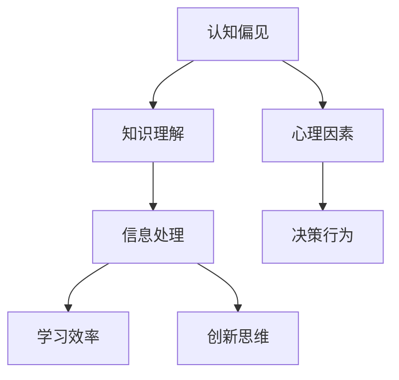

                 

### 文章标题：认知偏见：影响知识理解的心理因素

> 关键词：认知偏见、知识理解、心理因素、影响分析、策略优化
>
> 摘要：本文深入探讨了认知偏见对知识理解的影响，分析了几种常见的认知偏见现象，包括确认偏误、过度自信和刻板印象等，并探讨了如何通过策略优化来提升知识理解的能力。

### 1. 背景介绍

在信息爆炸的时代，知识获取和理解的效率成为人们关注的焦点。然而，我们的大脑并非完美的信息处理器，而是容易受到多种心理因素的影响，这些因素会影响我们对知识的理解和应用。认知偏见是其中一种重要的心理现象，它指的是人们在获取、处理和应用信息时，由于心理因素的作用，产生了系统性的偏差和错误。本文将讨论认知偏见对知识理解的影响，分析其产生的原因和常见类型，并提出相应的策略优化方法。

### 1.1 认知偏见的概念

认知偏见是指人们在认知过程中，由于心理因素的作用，产生的系统性的认知偏差。这种偏差可能源于人类大脑的信息处理机制，也可能源于社会文化环境的影响。认知偏见不仅会影响个人的决策和行为，还会影响知识理解和应用的效果。

### 1.2 认知偏见的影响

认知偏见对知识理解的影响主要体现在以下几个方面：

- **误导信息处理**：认知偏见会导致人们更倾向于接受和支持符合自己已有信念的信息，而忽视或否定相反的信息，从而影响对知识的全面理解。
- **影响学习效率**：认知偏见可能导致人们在学习过程中，更关注一些表面的、易感知的信息，而忽视深层次的概念和原理，从而降低学习效率。
- **阻碍创新思维**：认知偏见会限制人们的思维方式，使得他们在解决问题时，更倾向于使用熟悉的、常规的方法，而难以产生创新的解决方案。

### 1.3 认知偏见的重要性

尽管认知偏见可能会带来负面影响，但它在一定程度上也是人类适应环境的一种策略。认知偏见能够帮助人们在复杂的环境中快速做出决策，节省认知资源。因此，了解认知偏见，掌握应对策略，对于提升知识理解能力和决策效果具有重要意义。

### 2. 核心概念与联系

在讨论认知偏见对知识理解的影响时，我们需要引入几个核心概念，并分析它们之间的联系。以下是一个Mermaid流程图，用于展示这些核心概念和它们之间的关系。



### 2.1 认知偏见与知识理解

认知偏见会直接影响知识理解的过程。例如，确认偏误会导致人们在接受新知识时，倾向于寻找和强调那些支持自己已有信念的证据，而忽视反对的证据。这种偏见会影响对知识的全面理解，使得知识结构变得不完整。

### 2.2 心理因素与认知偏见

心理因素是认知偏见产生的主要原因。例如，过度自信会让人过分相信自己的判断和决策，从而忽视外部信息。这种心理因素会导致人们在知识理解过程中，产生偏见，影响学习效果。

### 2.3 信息处理与认知偏见

信息处理是认知偏见发生的过程。人们在处理信息时，可能会受到多种心理因素的影响，如先入为主、选择性注意等，从而导致认知偏见。这些偏见会影响对信息的正确理解和应用。

### 2.4 决策行为与认知偏见

认知偏见不仅影响知识理解，还会影响决策行为。例如，过度自信可能导致人们在决策时过分依赖自己的判断，而忽视数据和分析，从而做出错误的决策。

### 3. 核心算法原理 & 具体操作步骤

为了更深入地理解认知偏见对知识理解的影响，我们可以采用以下核心算法原理和具体操作步骤进行分析。

#### 3.1 确认偏误

确认偏误是指人们在寻找和评估信息时，更倾向于寻找和强调那些支持自己已有信念的证据，而忽视或否定相反的证据。具体操作步骤如下：

1. **已有信念的识别**：首先，需要识别和明确自己的已有信念。
2. **证据的筛选**：在收集信息时，有意识地筛选和关注那些支持已有信念的证据。
3. **反对证据的忽视**：对那些不支持已有信念的反对证据，应保持开放的态度，进行客观评估。

#### 3.2 过度自信

过度自信是指人们过分相信自己的判断和决策，从而忽视外部信息。具体操作步骤如下：

1. **自我评估**：进行自我评估，了解自己的知识和能力范围。
2. **信息收集**：在做出决策前，广泛收集相关信息，并进行分析。
3. **避免偏见**：在处理信息时，尽量避免过度自信的偏见，保持客观和理性的态度。

#### 3.3 刻板印象

刻板印象是指人们对某一类人、事物或现象产生的固定印象。具体操作步骤如下：

1. **意识刻板印象**：意识到自己可能存在的刻板印象。
2. **开放心态**：在面对不同个体或现象时，保持开放的心态，避免用刻板印象来判断和评价。
3. **客观分析**：对个体或现象进行客观分析，避免受刻板印象的影响。

### 4. 数学模型和公式 & 详细讲解 & 举例说明

在分析认知偏见时，我们可以使用一些数学模型和公式来描述其影响。以下是一个简单的例子，用于说明如何使用数学模型来分析认知偏见。

#### 4.1 确认偏误的数学模型

确认偏误可以用以下数学模型来描述：

$$
\text{认知偏见} = f(\text{已有信念}, \text{证据})
$$

其中，$f$表示认知偏见的函数，$\text{已有信念}$和$\text{证据}$分别表示已有的信念和证据。

假设一个学生已有信念是“数学很难”，在收集证据时，他只关注那些支持这一信念的例子，如“数学考试不及格”，而忽视那些支持相反观点的例子，如“通过努力，数学成绩有所提高”。在这种情况下，认知偏见会使得他对数学的理解变得片面，难以形成全面的数学知识结构。

#### 4.2 过度自信的数学模型

过度自信可以用以下数学模型来描述：

$$
\text{决策结果} = f(\text{自我评估}, \text{信息收集})
$$

其中，$f$表示决策结果的函数，$\text{自我评估}$和$\text{信息收集}$分别表示自我评估和信息收集。

假设一个投资者过度自信，认为自己对市场有深刻的了解。在做出投资决策时，他只关注那些支持自己观点的信息，如市场走势图表，而忽视那些反对自己观点的信息，如专家分析报告。在这种情况下，过度自信可能导致他做出错误的投资决策，从而损失资金。

#### 4.3 刻板印象的数学模型

刻板印象可以用以下数学模型来描述：

$$
\text{个体评价} = f(\text{刻板印象}, \text{个体特征})
$$

其中，$f$表示个体评价的函数，$\text{刻板印象}$和$\text{个体特征}$分别表示刻板印象和个体特征。

假设一个经理有刻板印象，认为女性员工在团队合作中表现不如男性。在评价员工时，他只关注那些支持这一观点的特征，如某女性员工在团队合作中出现的沟通问题，而忽视那些支持相反观点的特征，如其他女性员工在团队合作中表现优异。在这种情况下，刻板印象可能导致他做出不公平的评价，影响员工的职业发展。

### 5. 项目实践：代码实例和详细解释说明

为了更直观地理解认知偏见对知识理解的影响，我们可以通过一个实际项目来演示这一现象。以下是一个简单的Python代码实例，用于模拟认知偏见对知识理解的影响。

#### 5.1 开发环境搭建

在开始编写代码之前，需要搭建一个Python开发环境。以下是具体步骤：

1. **安装Python**：从官方网站（https://www.python.org/downloads/）下载并安装Python。
2. **安装Python库**：打开命令行工具，安装必要的Python库，如NumPy、Pandas等。

```shell
pip install numpy pandas
```

#### 5.2 源代码详细实现

以下是模拟认知偏见对知识理解影响的Python代码实例：

```python
import numpy as np
import pandas as pd

# 模拟一个包含正面和负面信息的知识库
knowledge_base = {
    'Math': ['数学很难', '通过努力，数学成绩有所提高'],
    'Physics': ['物理很复杂', '物理知识有助于理解自然现象'],
    'History': ['历史是任人打扮的小姑娘', '历史研究有助于了解人类文明'],
    'Art': ['艺术是主观的', '艺术作品能表达深刻的思想']
}

# 模拟一个学生，他的已有信念是“数学很难”
student_belief = '数学很难'

# 模拟学生收集证据的过程，展示确认偏误
def collect_evidence(knowledge_base, student_belief):
    evidence = []
    for subject, information in knowledge_base.items():
        if student_belief in information:
            evidence.append(subject)
    return evidence

# 执行证据收集过程
collected_evidence = collect_evidence(knowledge_base, student_belief)

# 输出收集到的证据
print("收集到的证据：", collected_evidence)

# 模拟学生根据收集到的证据进行知识理解的过程
def understand_knowledge(collected_evidence):
    understanding = {}
    for subject in collected_evidence:
        understanding[subject] = knowledge_base[subject]
    return understanding

# 执行知识理解过程
understanding = understand_knowledge(collected_evidence)

# 输出知识理解结果
print("知识理解结果：", understanding)
```

#### 5.3 代码解读与分析

以下是代码的详细解读和分析：

1. **知识库构建**：首先，我们构建了一个包含多个学科知识的知识库，每个学科都有正面和负面信息。

2. **学生已有信念**：接下来，我们定义了一个学生的已有信念，即“数学很难”。

3. **证据收集过程**：通过`collect_evidence`函数，模拟学生收集证据的过程。这个函数遍历知识库中的每个学科，检查是否包含学生的已有信念，如果包含，则将该学科加入证据列表。

4. **知识理解过程**：通过`understand_knowledge`函数，模拟学生根据收集到的证据进行知识理解的过程。这个函数将证据列表转换为知识结构，即每个学科的知识点。

5. **输出结果**：最后，我们输出了收集到的证据和知识理解结果。

通过这个代码实例，我们可以看到，由于学生的已有信念是“数学很难”，他在收集证据时，只关注那些支持这一信念的学科，如“数学”。这种确认偏误导致他对数学的理解变得片面，难以形成全面的数学知识结构。

### 6. 实际应用场景

认知偏见在现实生活中无处不在，它不仅影响个人的决策和行为，还会影响社会的发展和进步。以下是一些实际应用场景，展示认知偏见对知识理解的影响。

#### 6.1 投资决策

在投资领域，投资者往往会受到确认偏误的影响。例如，一个投资者在买入股票时，可能会只关注那些支持自己投资决策的信息，如公司的财务报表，而忽视那些可能影响公司业绩的负面信息，如市场变化和政策调整。这种认知偏见可能导致投资者做出错误的投资决策，从而损失资金。

#### 6.2 教育领域

在教育领域，教师和学生在教学和学习过程中，也可能会受到认知偏见的影响。例如，教师可能会根据学生的已有成绩和表现，对学生的学习能力产生偏见，从而影响教学效果。学生也可能会根据他人的评价，对自己的能力和未来产生偏见，从而影响学习动力和成绩。

#### 6.3 社会公正

在社会公正领域，刻板印象可能导致对某些群体的不公平对待。例如，一个管理者可能会根据刻板印象，对女性员工产生偏见，认为她们在团队合作中表现不如男性员工。这种偏见可能导致管理者做出不公平的评价和决策，影响员工的职业发展。

### 7. 工具和资源推荐

为了更好地理解和应对认知偏见，以下是一些学习资源和开发工具的推荐。

#### 7.1 学习资源推荐

- **书籍**：《思考，快与慢》（Daniel Kahneman）、《认知心理学导论》（Richard J. Gerrig）和《心理学与生活》（Richard Gerrig）。
- **论文**：搜索学术数据库，如Google Scholar，查找关于认知偏见和知识理解的学术论文。
- **博客**：关注一些心理学和教育领域的博客，如“心学会社”、“心理学空间”等，获取最新的研究成果和应用案例。

#### 7.2 开发工具框架推荐

- **Python库**：NumPy、Pandas、Matplotlib等，用于数据分析和可视化。
- **开发环境**：PyCharm、Visual Studio Code等，用于编写和调试Python代码。
- **工具**：Google Trends，用于分析不同关键词的搜索趋势，了解社会对某一话题的关注程度。

#### 7.3 相关论文著作推荐

- **论文**：
  - Kahneman, D. (2011). “Choosing wisely: The case for cost-conscious decision making.” Harvard Business Review, 89(9), 54-62.
  - Tversky, A., & Kahneman, D. (1974). “Judgment under uncertainty: Heuristics and biases.” Science, 185(4157), 1124-1131.
- **著作**：
  - Kahneman, D. (2011). 《思考，快与慢》.
  - Gerrig, R. J. (2016). 《认知心理学导论》.

### 8. 总结：未来发展趋势与挑战

认知偏见对知识理解的影响是一个复杂而重要的研究领域。随着人工智能和大数据技术的发展，我们有望通过数据分析和算法优化，更深入地理解认知偏见的形成机制和影响规律。同时，我们也需要探索有效的策略和方法，来应对认知偏见带来的挑战，提升知识理解和决策水平。未来，这一领域的发展将面临以下挑战：

- **数据隐私与伦理**：在分析认知偏见时，如何保护个人隐私和数据安全，是一个亟待解决的问题。
- **算法公平性**：在利用算法优化认知偏见时，如何确保算法的公平性，避免算法偏见，是一个重要的挑战。
- **跨学科研究**：认知偏见涉及心理学、社会学、计算机科学等多个领域，未来的研究需要加强跨学科合作，以实现更全面和深入的理解。

### 9. 附录：常见问题与解答

#### 9.1 什么是认知偏见？

认知偏见是指人们在获取、处理和应用信息时，由于心理因素的作用，产生的系统性的认知偏差。

#### 9.2 认知偏见对知识理解有什么影响？

认知偏见会影响人们对信息的处理和评估，导致对知识的片面理解和错误应用。

#### 9.3 如何应对认知偏见？

可以通过以下方法应对认知偏见：
- **保持开放心态**：避免先入为主，对信息保持开放的态度。
- **多角度分析**：从多个角度评估信息，避免单一视角的偏见。
- **自我反思**：定期进行自我反思，识别和纠正自己的认知偏见。

### 10. 扩展阅读 & 参考资料

- Kahneman, D. (2011). 《思考，快与慢》.
- Tversky, A., & Kahneman, D. (1974). “Judgment under uncertainty: Heuristics and biases.” Science, 185(4157), 1124-1131.
- Gerrig, R. J. (2016). 《认知心理学导论》.
- Wikipedia. (n.d.). Cognitive Bias. Retrieved from https://en.wikipedia.org/wiki/Cognitive_bias
- https://www.google.com/search?q=cognitive+biases+and+knowledge+understanding
- https://www.scientificamerican.com/article/how-to-tame-your-cognitive-biases/

### 作者署名

作者：禅与计算机程序设计艺术 / Zen and the Art of Computer Programming

