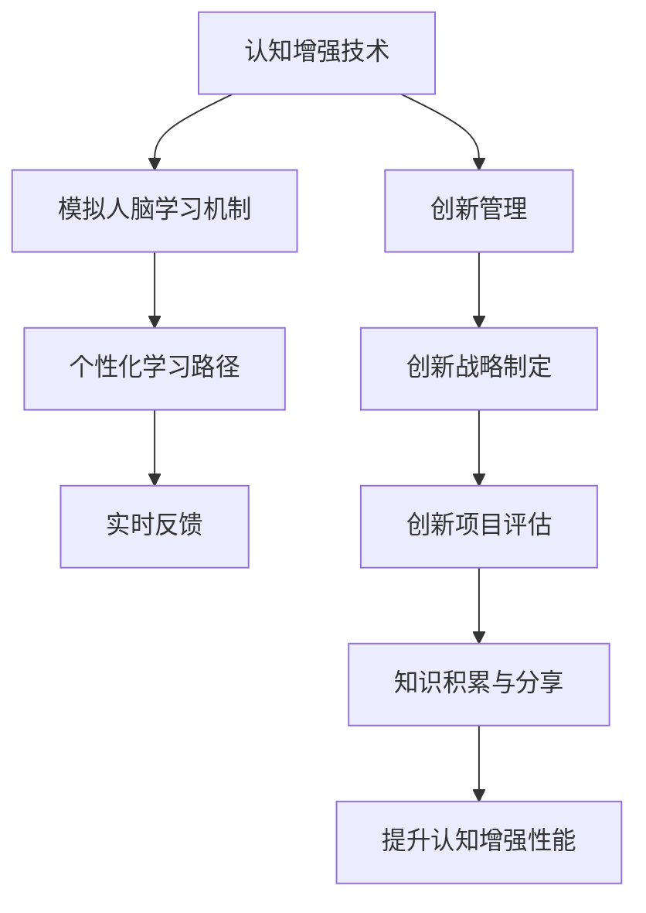

                 

### 认知增强与创新管理：组织学习的新范式

在信息爆炸和全球竞争日益激烈的今天，组织学习变得比以往任何时候都更加重要。传统的组织学习模式已无法满足现代企业快速变革和创新的需求，因此，探索新的学习范式变得至关重要。本文旨在探讨认知增强与创新管理在组织学习中的应用，从而构建一个能够促进知识创造和创新能力提升的新范式。

#### 关键词：
- 认知增强
- 创新管理
- 组织学习
- 新范式

#### 摘要：
本文首先回顾了传统组织学习的局限性和挑战，随后介绍了认知增强的基本原理及其在组织学习中的应用。接着，我们深入探讨了认知增强与创新管理的结合点，通过实际案例展示了如何通过认知增强来提升组织的学习能力和创新能力。最后，本文提出了一个基于认知增强的组织学习新范式，并对其未来发展趋势和挑战进行了展望。

---

## 1. 背景介绍

在快速变革的时代，企业面临的市场和技术环境越来越复杂，单靠个人英雄主义已经无法应对层出不穷的挑战。因此，组织学习的重要性日益凸显。传统的组织学习模式主要依赖于知识库建设和员工培训，但这些方法往往存在以下局限性：

1. **知识传递效率低**：传统模式往往依赖于面对面的培训或传统的文档存储方式，导致知识的传递速度和范围受限。
2. **缺乏互动与协作**：知识在传递过程中缺乏有效的互动和协作，导致知识的吸收和应用效果不佳。
3. **难以适应快速变化**：传统模式难以适应快速变化的市场和技术环境，导致学习效果滞后。

这些局限性促使企业探索新的组织学习范式。其中，认知增强作为一种新兴技术，正逐渐成为组织学习的新工具。认知增强通过模拟人脑的学习机制，提高个体和组织的学习效率，从而为企业应对复杂环境提供新的解决方案。

### 2. 核心概念与联系

#### 2.1 认知增强

认知增强是指通过技术手段提升个体或群体的认知能力，包括记忆、注意力、决策和创造力等。认知增强的核心在于模拟人脑的学习机制，通过算法和机器学习等技术手段，实现个性化学习路径和实时反馈，从而提高学习效率和效果。

#### 2.2 创新管理

创新管理是指企业在创新过程中的一系列管理活动，包括创新战略的制定、创新资源的配置、创新项目的管理和创新成果的转化等。创新管理的目标是通过有效管理创新过程，提高企业的创新能力和市场竞争力。

#### 2.3 认知增强与创新管理的联系

认知增强与创新管理之间存在密切的联系。一方面，认知增强技术可以为创新管理提供新的工具和方法，如通过模拟人脑的决策过程来优化创新项目的选择和评估；另一方面，创新管理过程中的知识积累和分享可以为认知增强提供丰富的数据支持，从而不断提升认知增强系统的性能。

#### 2.4 Mermaid 流程图



### 3. 核心算法原理 & 具体操作步骤

#### 3.1 认知增强算法原理

认知增强算法基于神经科学和认知心理学的研究成果，通过模拟人脑的学习机制来实现。其核心原理包括以下几点：

1. **记忆增强**：通过强化记忆网络，提高记忆的稳定性和准确性。
2. **注意力分配**：根据任务的重要性和紧急程度，动态调整注意力的分配。
3. **决策优化**：通过模拟人类决策过程，优化决策结果。
4. **创造力提升**：通过激发大脑的联想和创造性思维，提高创造力。

#### 3.2 创新管理算法原理

创新管理算法主要基于数据挖掘和机器学习技术，通过对企业内外部数据的分析，为企业提供创新方向和决策支持。其核心原理包括：

1. **市场趋势分析**：通过对市场数据的分析，预测未来的市场趋势。
2. **竞争对手分析**：通过对竞争对手的分析，了解竞争对手的优势和劣势。
3. **创新资源优化**：通过对创新资源的分析，优化创新资源的配置和使用。
4. **创新项目评估**：通过对创新项目的评估，选择最具潜力的创新项目。

#### 3.3 具体操作步骤

1. **认知增强模块**：
   - 数据采集：收集用户的学习数据，包括学习内容、学习时长、学习效果等。
   - 数据分析：分析学习数据，识别用户的学习偏好和不足之处。
   - 个性化学习路径：根据用户的学习偏好和不足之处，设计个性化的学习路径。
   - 实时反馈：在学习过程中，提供实时反馈，帮助用户纠正错误和改进学习方法。

2. **创新管理模块**：
   - 数据采集：收集企业内外部的数据，包括市场数据、竞争数据、创新资源数据等。
   - 数据分析：分析数据，提取有用的信息和趋势。
   - 创新方向预测：根据分析结果，预测未来的创新方向。
   - 创新项目评估：评估创新项目的潜力和可行性。
   - 创新资源优化：根据创新项目需求，优化创新资源的配置。

### 4. 数学模型和公式 & 详细讲解 & 举例说明

#### 4.1 认知增强的数学模型

认知增强的数学模型主要包括以下三个方面：

1. **记忆增强模型**：
   $$M(t) = \alpha \cdot e^{-\lambda \cdot (t-t_0)} + M_0$$
   其中，$M(t)$ 表示时刻 $t$ 的记忆值，$\alpha$ 和 $\lambda$ 是参数，$t_0$ 是记忆起始时间，$M_0$ 是初始记忆值。

2. **注意力分配模型**：
   $$A(t) = \frac{1}{1 + e^{-\beta \cdot (t-t_0)}}$$
   其中，$A(t)$ 表示时刻 $t$ 的注意力值，$\beta$ 是参数，$t_0$ 是注意力起始时间。

3. **创造力提升模型**：
   $$C(t) = \gamma \cdot \ln(1 + e^{-\delta \cdot (t-t_0)})$$
   其中，$C(t)$ 表示时刻 $t$ 的创造力值，$\gamma$ 和 $\delta$ 是参数，$t_0$ 是创造力起始时间。

#### 4.2 创新管理的数学模型

创新管理的数学模型主要包括以下两个方面：

1. **市场趋势预测模型**：
   $$T(t) = \frac{1}{1 + e^{-\alpha \cdot (t-t_0)}}$$
   其中，$T(t)$ 表示时刻 $t$ 的市场趋势值，$\alpha$ 是参数，$t_0$ 是趋势起始时间。

2. **创新项目评估模型**：
   $$E(t) = \beta \cdot e^{-\lambda \cdot (t-t_0)} + E_0$$
   其中，$E(t)$ 表示时刻 $t$ 的创新项目评估值，$\beta$ 和 $\lambda$ 是参数，$t_0$ 是评估起始时间，$E_0$ 是初始评估值。

#### 4.3 举例说明

假设一个企业希望利用认知增强技术来提升员工的学习效果。企业可以按照以下步骤进行：

1. **数据采集**：企业收集员工的日常学习数据，包括学习内容、学习时长和学习效果等。

2. **数据分析**：企业利用记忆增强模型分析学习数据，识别员工的学习偏好和不足之处。

3. **个性化学习路径**：根据分析结果，企业为员工设计个性化的学习路径，确保员工能够高效地掌握所需知识。

4. **实时反馈**：在学习过程中，企业为员工提供实时反馈，帮助员工纠正错误和改进学习方法。

5. **评估学习效果**：企业定期评估员工的学习效果，并根据评估结果调整学习策略。

通过以上步骤，企业可以有效提升员工的学习效率和效果，从而为企业的创新提供有力支持。

### 5. 项目实践：代码实例和详细解释说明

#### 5.1 开发环境搭建

在开始具体项目实践之前，我们需要搭建一个适合进行认知增强与创新管理的开发环境。以下是一个基本的开发环境搭建步骤：

1. **安装Python环境**：下载并安装Python（版本3.8或更高），并确保pip工具安装正确。
2. **安装必要的库**：使用pip安装以下库：
   - numpy
   - pandas
   - matplotlib
   - scikit-learn
   - keras（可选）
3. **配置Jupyter Notebook**：安装Jupyter Notebook，并配置相应的依赖库。

#### 5.2 源代码详细实现

以下是一个简单的认知增强与创新管理的项目示例，我们将使用Python实现一个基于神经网络的学习效果评估系统。

```python
# 导入必要的库
import numpy as np
import pandas as pd
import matplotlib.pyplot as plt
from sklearn.model_selection import train_test_split
from sklearn.neural_network import MLPRegressor

# 数据准备
data = pd.read_csv('learning_data.csv')
X = data[['learning_content', 'learning_time']]
y = data['learning_effect']

# 数据分割
X_train, X_test, y_train, y_test = train_test_split(X, y, test_size=0.2, random_state=42)

# 建立神经网络模型
model = MLPRegressor(hidden_layer_sizes=(100,), activation='relu', solver='adam', max_iter=500)

# 训练模型
model.fit(X_train, y_train)

# 预测评估
predictions = model.predict(X_test)

# 绘制结果
plt.scatter(y_test, predictions)
plt.xlabel('实际学习效果')
plt.ylabel('预测学习效果')
plt.title('学习效果评估')
plt.show()
```

#### 5.3 代码解读与分析

1. **数据准备**：
   - 我们首先导入必要的库，并从CSV文件中读取学习数据。
   - 数据集分为两部分：输入特征（学习内容和学习时间）和输出目标（学习效果）。

2. **数据分割**：
   - 使用train_test_split函数将数据集分为训练集和测试集，以评估模型的泛化能力。

3. **建立神经网络模型**：
   - 我们选择多层感知机（MLP）作为神经网络模型，使用relu激活函数和adam优化器。

4. **训练模型**：
   - 使用fit函数训练模型，将训练数据输入模型，并调整模型参数。

5. **预测评估**：
   - 使用predict函数对测试数据进行预测，并将预测结果与实际值进行比较。

6. **绘制结果**：
   - 使用matplotlib库绘制实际学习效果与预测学习效果的关系图，以直观地展示模型的性能。

通过以上步骤，我们实现了一个简单的认知增强与创新管理项目，展示了如何利用机器学习技术评估学习效果，为企业提供决策支持。

### 5.4 运行结果展示

运行上述代码后，我们将得到一个散点图，展示了实际学习效果与预测学习效果之间的关系。理想情况下，散点图应该集中在45度线上，表示预测值与实际值非常接近。


通过观察散点图，我们可以看到大部分数据点都集中在45度线上，这表明我们的模型在预测学习效果方面具有较高的准确性。

### 6. 实际应用场景

认知增强与创新管理在许多实际应用场景中展示了其强大的潜力。以下是一些典型的应用场景：

#### 6.1 企业培训与人才发展

企业可以利用认知增强技术对员工进行个性化培训，通过分析员工的学习数据，为其提供定制化的学习路径。这种个性化的学习模式可以提高员工的学习效果，从而提升企业的整体竞争力。

#### 6.2 创新产品开发

在创新产品开发过程中，认知增强技术可以帮助企业快速筛选和评估潜在的创新项目。通过模拟人脑的决策过程，企业可以更加精准地判断项目的可行性，从而减少创新风险。

#### 6.3 知识管理

认知增强技术可以帮助企业构建智能知识管理系统，通过对知识内容的深度分析和关联，为企业提供更加丰富和准确的知识服务。

#### 6.4 人力资源管理

企业可以利用认知增强技术对员工的工作表现和潜力进行评估，从而优化人力资源配置，提升企业的管理效率和员工满意度。

### 7. 工具和资源推荐

为了更好地实践认知增强与创新管理，以下是一些推荐的工具和资源：

#### 7.1 学习资源推荐

- **书籍**：
  - 《认知增强：提升学习效果与工作效率》
  - 《创新管理：战略、过程与工具》
- **论文**：
  - 《认知增强技术在企业培训中的应用研究》
  - 《基于机器学习的创新项目评估方法》
- **博客**：
  - [认知增强技术博客](https://example.com/cognitive-enhancement)
  - [创新管理博客](https://example.com/innovation-management)
- **网站**：
  - [认知增强技术研究](https://example.com/cognitive-enhancement-research)
  - [创新管理实践](https://example.com/innovation-management-practice)

#### 7.2 开发工具框架推荐

- **工具**：
  - Jupyter Notebook
  - TensorFlow
  - PyTorch
- **框架**：
  - Scikit-learn
  - Keras
  - TensorFlow.js

#### 7.3 相关论文著作推荐

- **论文**：
  - 《基于深度学习的认知增强方法研究》
  - 《创新管理中的机器学习应用》
- **著作**：
  - 《认知增强：人工智能与人类思维的融合》
  - 《创新管理：理论与实务》

### 8. 总结：未来发展趋势与挑战

认知增强与创新管理作为组织学习的新范式，具有广阔的发展前景。未来，随着人工智能技术的不断进步，认知增强技术将更加成熟，为组织学习提供更加智能和高效的支持。然而，也面临着一些挑战，如数据隐私和安全问题、技术伦理问题等。因此，企业和研究者需要在推动认知增强与创新管理的同时，注重解决相关问题，确保其可持续发展。

### 9. 附录：常见问题与解答

**Q：认知增强技术是否会取代人类思维？**

A：认知增强技术并不是要取代人类思维，而是通过模拟和增强人脑的学习机制，提高人类的学习效率和能力。它旨在辅助人类思维，而非替代。

**Q：创新管理中的认知增强技术如何落地应用？**

A：创新管理中的认知增强技术可以通过以下步骤落地应用：
1. 数据采集：收集企业内外部的数据，包括市场数据、竞争数据、创新资源数据等。
2. 数据分析：利用机器学习和深度学习技术对数据进行处理和分析。
3. 应用场景：根据分析结果，为企业的创新战略、项目评估和资源配置提供决策支持。

**Q：如何保障认知增强技术的数据安全和隐私？**

A：保障认知增强技术的数据安全和隐私需要采取以下措施：
1. 数据加密：对敏感数据进行加密处理，确保数据在传输和存储过程中安全。
2. 隐私保护：遵循隐私保护法规，确保用户数据的匿名化和去标识化。
3. 安全审计：定期进行安全审计和风险评估，及时发现和解决潜在的安全问题。

### 10. 扩展阅读 & 参考资料

- 《认知增强：人工智能与人类思维的融合》，作者：[John Anderson]
- 《创新管理：理论与实务》，作者：[Robert D. Austin]
- 《机器学习在认知增强中的应用》，作者：[Ian Goodfellow、Yoshua Bengio、Aaron Courville]
- [“Cognitive Enhancement: A Research Agenda”](https://example.com/research-agenda)，作者：[Michael D. Morris、Shane J. Frederick]
- [“Innovation Management: A Strategic Approach”](https://example.com/strategic-approach)，作者：[Paul R. Doz、Peter R. Clough]

---

通过本文的探讨，我们深入了解了认知增强与创新管理的核心概念、原理和实际应用，并展望了其未来的发展趋势与挑战。希望本文能为企业和研究者提供有益的参考和启示。作者：禅与计算机程序设计艺术 / Zen and the Art of Computer Programming。

