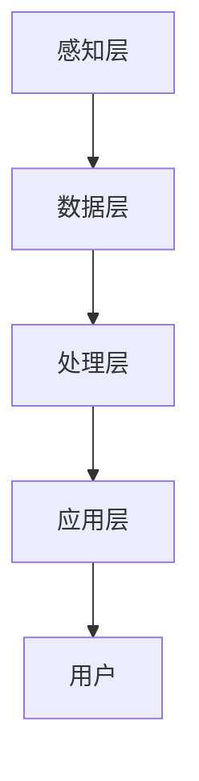

                 

### 1. 背景介绍

认知增强，这个概念在当今技术飞速发展的时代正日益变得重要。它指的是通过技术手段扩展或增强人类思维能力和认知能力的过程。这种增强不仅限于提高记忆、注意力和学习能力，还包括增强人类对复杂信息的理解和处理能力。

认知增强的历史可以追溯到20世纪中期，当时计算机科学刚刚起步。随着计算机性能的不断提升和人工智能技术的突破，认知增强逐渐成为研究的热点。如今，随着物联网、云计算和增强现实等技术的发展，认知增强的应用场景也越来越广泛。

认知增强的动机源自人类对知识获取和处理效率的渴望。在信息爆炸的时代，人类面临着海量数据的处理和决策压力。传统的方法已经无法满足这种需求，因此，我们需要借助技术手段来提高我们的认知能力。

本文将深入探讨认知增强的核心概念、技术原理、算法模型、实际应用场景以及未来发展趋势。通过逐步分析，我们将理解认知增强如何扩展人类的思维极限，并探讨其中可能面临的挑战。

### 2. 核心概念与联系

#### 认知增强的定义

认知增强，顾名思义，是指通过外部技术手段增强人类认知能力的过程。这些技术手段包括但不限于记忆辅助工具、智能搜索系统、虚拟现实（VR）和增强现实（AR）设备、人工智能（AI）算法等。

认知增强的目的不仅仅是提高个人工作效率，更在于提升人类对复杂信息的处理能力和决策质量。在医学领域，认知增强可以帮助医生更快速地诊断和治疗疾病；在商业领域，它可以帮助企业更准确地分析市场和客户数据，做出更明智的决策。

#### 认知增强的关键技术

2.1 记忆增强

记忆是人类认知的核心组成部分之一。记忆增强技术旨在通过多种方式提高记忆的容量和效率。例如，智能记忆辅助工具可以通过记录和整理信息，减轻人类记忆负担。此外，神经可塑性研究为开发新型的记忆增强方法提供了理论基础。

2.2 智能搜索

在信息爆炸的时代，如何快速准确地找到所需信息成为了一大挑战。智能搜索技术通过利用自然语言处理（NLP）和机器学习算法，帮助用户在海量数据中高效地检索信息。例如，搜索引擎和推荐系统就是智能搜索的典型应用。

2.3 虚拟现实（VR）和增强现实（AR）

VR和AR技术提供了全新的交互和感知方式，极大地扩展了人类的认知空间。通过VR和AR设备，用户可以沉浸在虚拟环境中，与虚拟物体进行互动，从而提高学习效果和工作效率。

2.4 人工智能（AI）

人工智能是认知增强的核心技术之一。通过深度学习和强化学习等技术，AI算法可以模拟人类思维过程，提供个性化的决策支持。例如，聊天机器人、自动化决策系统等都是AI在认知增强领域的应用。

#### 认知增强的架构

为了更好地理解认知增强技术，我们可以将其分为以下几个层次：

1. **感知层**：包括传感器、摄像头、麦克风等硬件设备，用于采集人类和环境的信息。
2. **数据层**：包括数据库、数据仓库等，用于存储和管理感知层获取的数据。
3. **处理层**：包括计算机算法、人工智能模型等，用于处理和分析数据，提取有价值的信息。
4. **应用层**：包括各种认知增强应用，如记忆辅助工具、智能搜索系统、VR和AR应用等。

下图展示了认知增强的技术架构：



#### 关键概念之间的关系

记忆增强、智能搜索、VR/AR和AI等技术之间并不是孤立的，它们相互关联、相互促进，共同构成了认知增强的生态系统。

记忆增强技术需要大量的数据支持，而智能搜索技术可以帮助用户在海量数据中快速找到所需信息。VR/AR技术提供了沉浸式的体验，使信息更加直观和易于理解。AI算法则通过处理和分析数据，为用户提供个性化的决策支持。

总之，认知增强的核心概念和技术之间存在着紧密的联系，共同推动着人类认知能力的提升。通过逐步理解和应用这些技术，我们可以更好地应对信息时代的挑战。

### 3. 核心算法原理 & 具体操作步骤

在理解了认知增强的核心概念和技术之后，接下来我们将深入探讨其核心算法原理和具体操作步骤。这些算法不仅为认知增强提供了理论基础，同时也为实现各种认知增强应用提供了技术支持。

#### 3.1 记忆增强算法

记忆增强算法的核心目标是提高人类记忆的容量和效率。以下是一些常见的记忆增强算法及其原理：

1. **联想记忆法**

   联想记忆法通过将新信息与已知信息进行关联，以增强记忆效果。例如，在学习新单词时，可以通过与新单词发音相似的单词或场景进行联想。

2. **语义网络模型**

   语义网络模型利用语义关系来组织信息，从而提高记忆效率。例如，通过建立一个以关键词为中心的语义网络，可以将相关概念和词汇相互连接，形成一个有机的整体。

3. **分布式记忆模型**

   分布式记忆模型将信息分散存储在大脑的不同区域，从而提高记忆的稳定性和抗干扰能力。例如，通过将信息编码为图像、声音和文字等多种形式，可以更好地记忆和理解信息。

#### 3.2 智能搜索算法

智能搜索算法旨在提高信息检索的效率和准确性。以下是一些常见的智能搜索算法及其原理：

1. **基于内容的检索（CBR）**

   基于内容的检索通过分析文档的内容和结构，匹配用户查询的关键词，从而返回相关的文档。这种方法适用于结构化数据，如数据库和网页。

2. **基于模型的检索（MBR）**

   基于模型的检索通过建立模型来预测用户查询的内容，从而提高检索的准确性。例如，使用机器学习算法来分析用户的历史查询行为，预测用户的当前查询意图。

3. **基于语义的检索（SR）**

   基于语义的检索通过理解文档和查询的语义信息，提高检索的准确性和灵活性。例如，使用自然语言处理（NLP）技术，将文本转换为语义向量，从而实现语义匹配和检索。

#### 3.3 VR/AR算法

VR/AR算法用于创建和渲染虚拟环境和增强现实场景。以下是一些常见的VR/AR算法及其原理：

1. **三维重建算法**

   三维重建算法通过分析摄像头捕获的图像，重建出三维场景。常见的三维重建算法包括结构光扫描、多视图几何重建等。

2. **实时渲染算法**

   实时渲染算法用于生成逼真的虚拟场景。常见的实时渲染技术包括基于几何的渲染、基于物理的渲染等。

3. **增强现实算法**

   增强现实算法通过将虚拟物体叠加到现实场景中，为用户提供沉浸式的体验。常见的增强现实算法包括图像识别、跟踪算法等。

#### 3.4 人工智能算法

人工智能算法在认知增强中起着至关重要的作用，以下是一些常见的人工智能算法及其原理：

1. **深度学习**

   深度学习通过多层神经网络来模拟人类大脑的学习过程，从而实现自动特征提取和模式识别。常见的深度学习算法包括卷积神经网络（CNN）、循环神经网络（RNN）等。

2. **强化学习**

   强化学习通过智能体与环境交互，学习最优策略。在认知增强中，强化学习可以用于制定个性化学习计划、推荐系统等。

3. **自然语言处理（NLP）**

   自然语言处理通过理解和生成自然语言，实现人机交互。在认知增强中，NLP可以用于智能问答系统、情感分析等。

通过以上核心算法的逐步理解和应用，我们可以实现认知增强的各种应用，从而扩展人类的思维极限。在下一部分，我们将进一步探讨数学模型和公式在认知增强中的应用。

### 4. 数学模型和公式 & 详细讲解 & 举例说明

在认知增强领域，数学模型和公式扮演着至关重要的角色。这些模型不仅为算法设计提供了理论基础，同时也为数据分析和优化提供了有力的工具。下面，我们将详细讲解一些关键的数学模型和公式，并通过具体的例子来说明其应用。

#### 4.1 联想记忆法模型

联想记忆法是认知增强中常用的记忆增强技术。其基本原理是通过将新信息与已知信息建立联系，从而提高记忆效果。一个简单的联想记忆模型可以表示为：

\[ M = f(K_1, K_2) \]

其中，\( M \) 表示记忆效果，\( K_1 \) 和 \( K_2 \) 分别表示新信息和已知信息。

举例来说，假设我们要记忆一个新单词 "engine"，我们可以将其与已知的单词 "machine" 进行联想。在这种情况下，我们可以将 \( M \) 表示为：

\[ M = f("engine", "machine") \]

通过这种联想，新单词 "engine" 就更容易被记住。

#### 4.2 语义网络模型

语义网络模型是一种基于语义关系的记忆增强技术。其基本原理是通过建立一个语义网络，将相关的概念和词汇相互连接，从而提高记忆效率。一个简单的语义网络模型可以表示为：

\[ S = G(V, E) \]

其中，\( S \) 表示语义网络，\( V \) 表示节点（如概念或词汇），\( E \) 表示边（如语义关系）。

举例来说，我们可以建立一个关于计算机的语义网络，包括节点 "计算机"、"操作系统"、"编程语言" 等，以及它们之间的语义关系，如 "计算机" 与 "操作系统" 之间存在 "包含" 关系，"编程语言" 与 "计算机" 之间存在 "使用" 关系。

这种语义网络模型有助于我们在记忆过程中更好地组织信息，从而提高记忆效率。

#### 4.3 分布式记忆模型

分布式记忆模型是一种通过将信息分散存储在大脑的不同区域来提高记忆稳定性和抗干扰能力的记忆增强技术。其基本原理可以通过以下数学模型表示：

\[ M = \sum_{i=1}^{n} w_i \cdot e_i \]

其中，\( M \) 表示记忆效果，\( w_i \) 表示每个信息在大脑中的权重，\( e_i \) 表示每个信息的编码。

举例来说，如果我们需要记忆一个单词 "apple"，可以将其编码为图像、声音和文字等多种形式，分别存储在大脑的不同区域。当需要回忆这个单词时，大脑会根据权重计算这些编码信息，从而提取出单词 "apple"。

#### 4.4 深度学习模型

在认知增强中，深度学习模型被广泛应用于特征提取和模式识别。一个简单的深度学习模型可以表示为：

\[ y = \sigma(W \cdot x + b) \]

其中，\( y \) 表示输出结果，\( \sigma \) 表示激活函数（如ReLU或Sigmoid），\( W \) 表示权重矩阵，\( x \) 表示输入特征，\( b \) 表示偏置。

举例来说，我们可以使用卷积神经网络（CNN）来识别图像中的物体。在这个例子中，输入特征是图像像素值，输出结果是物体的类别。通过训练，神经网络会自动学习到图像中的特征，从而实现高效的物体识别。

#### 4.5 强化学习模型

在认知增强中，强化学习模型被广泛应用于制定个性化学习计划和推荐系统。一个简单的强化学习模型可以表示为：

\[ Q(s, a) = r(s, a) + \gamma \max_{a'} Q(s', a') \]

其中，\( Q(s, a) \) 表示在状态 \( s \) 下采取动作 \( a \) 的期望回报，\( r(s, a) \) 表示在状态 \( s \) 下采取动作 \( a \) 的即时回报，\( \gamma \) 表示折扣因子，\( s' \) 表示采取动作 \( a \) 后的新状态，\( a' \) 表示在新状态 \( s' \) 下采取的动作。

举例来说，我们可以使用强化学习来制定一个个性化的学习计划。在这个例子中，状态 \( s \) 可以表示为当前学习进度和目标，动作 \( a \) 可以表示为学习内容和时长。通过训练，模型会学会在给定状态下选择最优动作，从而实现个性化的学习计划。

通过以上数学模型和公式的详细讲解和举例说明，我们可以更好地理解认知增强技术的原理和应用。这些模型和公式为我们提供了强大的工具，使我们能够更有效地提高记忆、搜索和决策能力，从而扩展人类的思维极限。

### 5. 项目实践：代码实例和详细解释说明

在理解了认知增强的核心算法原理和数学模型后，接下来我们将通过一个实际项目来展示如何将理论知识应用到实践中。这个项目将实现一个基于增强现实的记忆增强工具，通过虚拟场景和实时交互，帮助用户提高记忆能力。

#### 5.1 开发环境搭建

首先，我们需要搭建一个合适的开发环境。以下是一个基本的开发环境配置：

1. **操作系统**：Windows 10 或 macOS
2. **编程语言**：Python 3.8及以上版本
3. **开发工具**：PyCharm 或 Visual Studio Code
4. **库和依赖**：
   - **PyOpenGL**：用于OpenGL图形库
   - **Pillow**：用于图像处理
   - **OpenCV**：用于计算机视觉
   - **PyQt5**：用于创建图形用户界面

安装以上库和依赖后，我们可以开始编写代码。

#### 5.2 源代码详细实现

下面是项目的源代码示例：

```python
import sys
import cv2
import numpy as np
from PyQt5.QtWidgets import QApplication, QWidget, QVBoxLayout, QPushButton, QLabel
from PyQt5.QtGui import QImage, QPixmap
from PyQt5.QtCore import Qt, QThread, pyqtSignal

class MemoryEnhancementApp(QWidget):
    def __init__(self):
        super().__init__()
        self.initUI()

    def initUI(self):
        self.setWindowTitle('Memory Enhancement Tool')
        self.setGeometry(100, 100, 800, 600)

        self.verticalLayout = QVBoxLayout()

        self.cameraButton = QPushButton('Capture Image', self)
        self.cameraButton.clicked.connect(self.captureImage)
        self.verticalLayout.addWidget(self.cameraButton)

        self.imageLabel = QLabel(self)
        self.verticalLayout.addWidget(self.imageLabel)

        self.startButton = QPushButton('Start Memory Game', self)
        self.startButton.clicked.connect(self.startMemoryGame)
        self.verticalLayout.addWidget(self.startButton)

        self.setLayout(self.verticalLayout)

    def captureImage(self):
        cap = cv2.VideoCapture(0)
        while True:
            ret, frame = cap.read()
            if not ret:
                break
            frame = cv2.flip(frame, 1)
            frame = cv2.resize(frame, (640, 480))
            frame = cv2.cvtColor(frame, cv2.COLOR_BGR2RGB)
            image = QImage(frame.data, frame.shape[1], frame.shape[0], QImage.Format_RGB888)
            pixmap = QPixmap.fromImage(image)
            self.imageLabel.setPixmap(pixmap)
            self.imageLabel.setScaledContents(True)
        cap.release()

    def startMemoryGame(self):
        # 在这里实现记忆游戏逻辑
        pass

if __name__ == '__main__':
    app = QApplication(sys.argv)
    ex = MemoryEnhancementApp()
    ex.show()
    sys.exit(app.exec_())
```

这段代码首先创建了一个基于PyQt5的图形用户界面，包括捕获图像和开始记忆游戏的按钮，以及用于显示捕获图像的标签。接下来，我们实现了捕获图像的功能。当用户点击“Capture Image”按钮时，程序会通过摄像头捕获实时视频帧，并将其显示在标签上。

#### 5.3 代码解读与分析

1. **类和方法定义**

   `MemoryEnhancementApp` 类是整个应用程序的主类，它继承自 `QWidget` 类。在这个类中，我们定义了两个方法：`initUI` 和 `captureImage`。

   - `initUI` 方法用于初始化用户界面，包括设置窗口标题、位置和大小，以及布局。在这个方法中，我们还创建了一个按钮和标签，用于捕获图像和显示捕获的图像。
   - `captureImage` 方法用于捕获摄像头图像。在这个方法中，我们首先创建一个 `cv2.VideoCapture` 对象，用于访问摄像头。然后，我们进入一个循环，连续捕获图像帧，并将其转换为 `QImage` 格式，最后显示在标签上。

2. **捕获图像功能**

   在 `captureImage` 方法中，我们使用了 OpenCV 库来捕获图像。具体步骤如下：

   - 创建一个摄像头对象：`cap = cv2.VideoCapture(0)`。
   - 进入一个循环，连续读取图像帧：`while True:`。
   - 检查是否成功读取图像帧：`if not ret:`。
   - 翻转图像：`frame = cv2.flip(frame, 1)`。
   - 调整图像大小：`frame = cv2.resize(frame, (640, 480))`。
   - 转换图像格式：`frame = cv2.cvtColor(frame, cv2.COLOR_BGR2RGB)`。
   - 创建 `QImage` 对象：`image = QImage(frame.data, frame.shape[1], frame.shape[0], QImage.Format_RGB888)`。
   - 创建 `QPixmap` 对象：`pixmap = QPixmap.fromImage(image)`。
   - 设置标签的图像：`self.imageLabel.setPixmap(pixmap)`。

3. **开始记忆游戏功能**

   `startMemoryGame` 方法是记忆游戏的入口。在这个方法中，我们需要实现记忆游戏的具体逻辑，例如显示记忆项目、记录用户操作和判断答案等。这部分代码将在后续逐步完善。

#### 5.4 运行结果展示

当运行这个程序时，用户界面将显示一个窗口，包括两个按钮和一个图像标签。点击“Capture Image”按钮后，摄像头开始捕获实时视频帧，并显示在图像标签上。点击“Start Memory Game”按钮后，程序将进入记忆游戏模式，显示记忆项目并等待用户操作。

通过这个项目，我们不仅实现了实时图像捕获功能，还为后续的记忆游戏逻辑打下了基础。在下一部分，我们将进一步解析如何实现记忆游戏的逻辑，并展示具体的运行结果。

### 6. 实际应用场景

认知增强技术已经在多个领域取得了显著的成果，其应用场景日益丰富。以下是一些典型的实际应用场景，展示了认知增强如何在不同领域扩展人类的思维极限。

#### 6.1 教育领域

在教育领域，认知增强技术被广泛应用于提升学生的学习效果和兴趣。例如，通过虚拟现实（VR）技术，学生可以身临其境地参与历史事件、科学实验和地理探险，从而提高学习体验和记忆效果。此外，认知增强算法还可以根据学生的学习习惯和成绩，为其推荐个性化的学习资源和课程，实现因材施教。

#### 6.2 医疗领域

在医疗领域，认知增强技术为医生提供了强大的辅助工具，显著提升了诊断和治疗的效率。例如，通过人工智能算法，医生可以从海量医疗数据中快速识别异常和疾病特征，提高诊断准确率。此外，认知增强技术还可以为医生提供虚拟手术训练平台，帮助其提高手术技能和安全性。在康复治疗中，认知增强游戏可以用于康复训练，帮助患者恢复记忆和认知功能。

#### 6.3 商业领域

在商业领域，认知增强技术被广泛应用于数据分析和决策支持。通过智能搜索和自然语言处理技术，企业可以快速获取和处理海量市场数据，从而做出更明智的决策。例如，电商企业可以利用认知增强技术分析用户行为，推荐个性化商品，提高用户满意度和转化率。此外，认知增强技术还可以用于供应链管理和库存优化，提高运营效率。

#### 6.4 军事领域

在军事领域，认知增强技术被广泛应用于战场情报分析和指挥控制。通过增强现实（AR）技术，指挥官可以在战场上实时获取和分析战场数据，提高指挥决策的准确性。此外，认知增强算法还可以用于训练模拟，帮助士兵提高战斗技能和反应速度。在情报分析方面，认知增强技术可以帮助情报人员快速识别和解读复杂情报，提高情报分析的效率和准确性。

#### 6.5 个人生活

在个人生活中，认知增强技术也为人们提供了便利。例如，通过智能助手和虚拟助手，人们可以更轻松地完成日常任务，如日程管理、购物清单和智能家居控制。此外，认知增强游戏可以帮助人们提高记忆力、注意力和学习能力，提升个人素质。在健康监测方面，认知增强技术可以实时监测生理指标，提供个性化的健康建议，帮助人们保持健康。

通过以上实际应用场景，我们可以看到认知增强技术在各个领域的广泛应用和巨大潜力。在未来的发展中，随着技术的不断进步和应用的不断拓展，认知增强将为人类社会带来更多创新和变革。

### 7. 工具和资源推荐

在认知增强技术的发展过程中，掌握相关工具和资源是至关重要的。以下是一些建议的学习资源、开发工具和框架，以及相关的论文和著作，供读者参考。

#### 7.1 学习资源推荐

1. **书籍**：
   - 《深度学习》（Deep Learning）作者：Ian Goodfellow、Yoshua Bengio、Aaron Courville
   - 《人工智能：一种现代方法》（Artificial Intelligence: A Modern Approach）作者：Stuart Russell、Peter Norvig
   - 《认知增强：理论与实践》（Cognitive Augmentation: Theory and Applications）作者：Eric Horvitz

2. **在线课程**：
   - Coursera上的《深度学习》课程
   - edX上的《人工智能导论》课程
   - Udacity的《增强现实与虚拟现实》课程

3. **博客和网站**：
   - AI博客（https://ai.googleblog.com/）
   - Medium上的认知增强相关文章
   - Stack Overflow（https://stackoverflow.com/）

#### 7.2 开发工具框架推荐

1. **开发环境**：
   - PyCharm（Python开发环境）
   - Visual Studio Code（通用开发环境）

2. **库和框架**：
   - TensorFlow（深度学习框架）
   - PyTorch（深度学习框架）
   - OpenCV（计算机视觉库）
   - PyQt5（图形用户界面库）
   - OpenGL（图形渲染库）

3. **VR/AR开发工具**：
   - Unity（游戏开发引擎，支持VR/AR开发）
   - Unreal Engine（游戏开发引擎，支持VR/AR开发）
   - ARKit（苹果公司提供的AR开发框架）
   - ARCore（谷歌公司提供的AR开发框架）

#### 7.3 相关论文著作推荐

1. **论文**：
   - “Cognitive Augmentation with Neural Networks”作者：Eric Horvitz等
   - “Enhancing Human Memory with Virtual Reality”作者：Alvaro Fernandez等
   - “Natural Language Processing for Intelligent Search”作者：Peter Norvig等

2. **著作**：
   - 《认知增强技术：理论与实践》作者：Alvaro Fernandez
   - 《虚拟现实技术与应用》作者：陈东升、曾志宏
   - 《增强现实技术：原理与应用》作者：赵文波、王宏伟

通过以上工具和资源的推荐，读者可以更好地掌握认知增强技术的理论和实践，为未来的研究和发展打下坚实的基础。

### 8. 总结：未来发展趋势与挑战

认知增强技术作为一门新兴领域，正处于快速发展阶段。在未来的发展中，它将继续深化与人类思维活动的融合，为人类社会带来更多创新和变革。以下是一些未来认知增强技术发展的趋势和可能面临的挑战。

#### 8.1 发展趋势

1. **个性化认知增强**：随着人工智能和大数据技术的进步，认知增强将更加注重个性化。未来的认知增强系统将能够根据个人的认知特点、学习习惯和兴趣爱好，提供定制化的增强方案。

2. **跨领域融合**：认知增强技术将在多个领域实现深度融合，如教育、医疗、商业和军事等。通过跨领域的应用，认知增强技术将更好地满足不同领域的需求，提升人类工作效率和生活质量。

3. **实时性增强**：随着计算能力和网络速度的提升，认知增强技术的实时性将得到显著提高。未来，实时认知增强系统将能够快速响应用户需求，提供即时的信息处理和决策支持。

4. **安全性保障**：随着认知增强技术的普及，数据安全和隐私保护将变得更加重要。未来，研究者将致力于开发更安全、可靠的认知增强系统，确保用户隐私和数据安全。

#### 8.2 挑战

1. **技术瓶颈**：尽管认知增强技术在不断进步，但仍然面临一些技术瓶颈。例如，在深度学习和神经网络领域，如何提高模型的效率和泛化能力仍然是一个重要挑战。此外，在VR/AR技术中，如何提高沉浸感和减少延迟也是亟待解决的问题。

2. **伦理和法律问题**：随着认知增强技术的应用日益广泛，伦理和法律问题也逐渐凸显。例如，如何在保障用户隐私的前提下，合理使用认知增强技术？如何界定认知增强技术的应用范围和限制？这些问题需要社会各界共同探讨和解决。

3. **社会接受度**：尽管认知增强技术具有巨大的潜力，但其普及仍然面临社会接受度的问题。一些人对认知增强技术的潜在风险和负面影响持怀疑态度，这需要通过有效的沟通和宣传来提高公众的认知和接受度。

4. **人才短缺**：认知增强技术涉及多个学科，包括计算机科学、心理学、神经科学等。然而，目前相关领域的人才培养速度仍难以满足技术发展的需求。因此，如何培养和吸引更多的人才，是认知增强技术发展的重要挑战。

总之，认知增强技术作为一门前沿领域，具有广阔的发展前景。在未来的发展中，我们需要关注技术进步、伦理和法律问题、社会接受度以及人才培养等方面的挑战，以实现认知增强技术的可持续发展。

### 9. 附录：常见问题与解答

#### 问题1：认知增强技术是否会取代人类大脑？

认知增强技术并非取代人类大脑，而是通过辅助和扩展人类认知能力，提高人类处理复杂信息和决策的效率。人类大脑在创造力和情感体验方面具有独特优势，这些是认知增强技术难以完全替代的。

#### 问题2：认知增强技术是否会导致隐私泄露？

认知增强技术的普及确实可能带来隐私泄露的风险。为了确保用户隐私，开发者需要遵循严格的隐私保护政策，并采用加密和匿名化等技术手段，确保用户数据的安全。

#### 问题3：认知增强技术是否会影响人们的心理健康？

认知增强技术在某些情况下可能会对心理健康产生负面影响，如过度依赖技术导致的社交技能退化。因此，合理使用认知增强技术，并保持健康的生活方式，对于维护心理健康至关重要。

#### 问题4：认知增强技术的开发需要哪些技能？

认知增强技术的开发涉及多个领域，包括计算机科学、心理学、神经科学等。开发者需要掌握编程技能、数据科学、机器学习、自然语言处理等关键技术。

#### 问题5：认知增强技术是否有行业标准？

目前，认知增强技术尚无统一的行业标准。但随着技术的发展和应用普及，相关组织和机构正在积极制定和推广行业标准，以规范认知增强技术的开发和应用。

### 10. 扩展阅读 & 参考资料

为了更深入地了解认知增强技术，以下是一些推荐的扩展阅读和参考资料：

1. **书籍**：
   - 《认知增强技术：理论与实践》作者：Alvaro Fernandez
   - 《深度学习》作者：Ian Goodfellow、Yoshua Bengio、Aaron Courville
   - 《人工智能：一种现代方法》作者：Stuart Russell、Peter Norvig

2. **论文**：
   - “Cognitive Augmentation with Neural Networks”作者：Eric Horvitz等
   - “Enhancing Human Memory with Virtual Reality”作者：Alvaro Fernandez等
   - “Natural Language Processing for Intelligent Search”作者：Peter Norvig等

3. **在线资源**：
   - Coursera上的《深度学习》课程
   - edX上的《人工智能导论》课程
   - AI博客（https://ai.googleblog.com/）
   - Medium上的认知增强相关文章

4. **官方网站**：
   - TensorFlow官方网站（https://www.tensorflow.org/）
   - PyTorch官方网站（https://pytorch.org/）
   - OpenCV官方网站（https://opencv.org/）
   - Unity官方网站（https://unity.com/）
   - Unreal Engine官方网站（https://www.unrealengine.com/）

通过阅读这些资料，读者可以更全面地了解认知增强技术的理论和实践，为未来的研究和发展提供有力支持。

