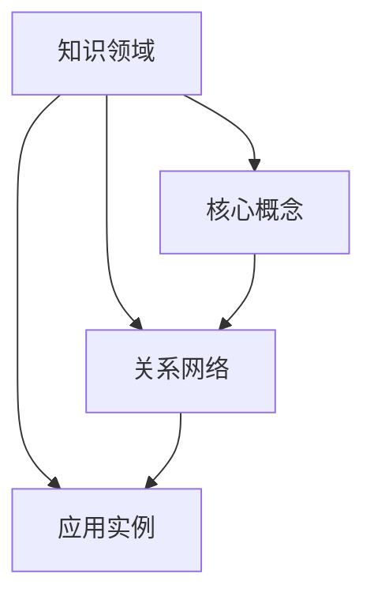

                 

### 文章标题：认知框架：如何构建个人知识体系

> **关键词**：认知框架、知识体系、个人成长、学习方法、思维模式、信息处理、记忆技巧。

> **摘要**：本文将探讨如何构建个人知识体系，通过认知框架的建立，提高信息处理效率和记忆效果，从而实现个人成长和职业发展。文章将深入分析认知框架的核心概念，提供具体的构建方法和实例，并结合数学模型和公式，帮助读者理解和应用。

### 1. 背景介绍

在当今信息爆炸的时代，知识更新速度迅猛，个人学习和职业发展面临前所未有的挑战。如何高效地获取、处理和存储知识，成为每个人必须面对的问题。传统的学习方法往往注重知识的记忆和重复，而忽视了知识体系的构建和认知框架的应用。因此，构建个人知识体系成为提高学习效率、实现知识内化和迁移的重要途径。

认知框架是一种结构化的思维方式，它帮助我们将复杂的信息进行分类、归纳和整合。通过构建认知框架，我们可以更清晰地认识和理解知识，提高信息处理能力和记忆力。本文将围绕如何构建个人知识体系，探讨认知框架的作用和具体方法。

### 2. 核心概念与联系

**2.1 认知框架的定义**

认知框架（Cognitive Framework）是一种基于认知科学原理的思维方式，它帮助我们在面对复杂问题时，通过分类、归纳和整合，形成一个逻辑清晰、层次分明的知识结构。

**2.2 认知框架的基本结构**

认知框架通常包括以下几个基本部分：

- **知识领域（Knowledge Domain）**：确定知识体系的范围和方向。
- **核心概念（Core Concepts）**：定义知识体系中的基本概念和原理。
- **关系网络（Relationship Network）**：描述各个概念之间的联系和相互作用。
- **应用实例（Application Examples）**：通过具体实例展示知识体系的应用场景。

**2.3 认知框架的 Mermaid 流程图**



### 3. 核心算法原理 & 具体操作步骤

**3.1 算法原理**

构建认知框架的核心算法原理是基于人类大脑的认知加工过程，包括信息输入、处理、存储和输出。具体步骤如下：

1. **信息输入**：获取新的知识和信息。
2. **信息处理**：对信息进行筛选、分类和归纳。
3. **信息存储**：将处理后的信息存储在大脑中，形成认知框架。
4. **信息输出**：应用认知框架解决实际问题。

**3.2 操作步骤**

1. **确定知识领域**：根据个人兴趣和职业需求，确定知识体系的范围和方向。
2. **搜集核心概念**：通过阅读、学习、讨论等方式，搜集与知识领域相关的核心概念。
3. **整理关系网络**：分析各个核心概念之间的联系，形成一个逻辑清晰的关系网络。
4. **构建应用实例**：通过具体实例展示认知框架的应用场景，加深对知识的理解和记忆。
5. **持续更新和完善**：根据新知识和新经验，持续更新和完善认知框架。

### 4. 数学模型和公式 & 详细讲解 & 举例说明

**4.1 数学模型**

认知框架的构建可以采用以下数学模型：

\[ F = \frac{K_1 + K_2 + ... + K_n}{C} \]

其中，\( F \) 表示认知框架的成熟度，\( K_1, K_2, ..., K_n \) 表示核心概念的得分，\( C \) 表示核心概念的个数。

**4.2 详细讲解**

- \( K_1, K_2, ..., K_n \) 表示核心概念的得分，可以根据概念的复杂度、重要性和应用价值进行评分。
- \( C \) 表示核心概念的个数，通常情况下，核心概念的个数不宜过多，否则容易导致认知框架过于复杂，难以理解和应用。

**4.3 举例说明**

假设一个认知框架包含5个核心概念，分别为A、B、C、D、E，它们的得分分别为8、6、7、9、10。则认知框架的成熟度为：

\[ F = \frac{8 + 6 + 7 + 9 + 10}{5} = 8.0 \]

这意味着该认知框架的成熟度为8分，表示该认知框架在处理问题时具有较高的可靠性和有效性。

### 5. 项目实践：代码实例和详细解释说明

**5.1 开发环境搭建**

在本节中，我们将使用Python作为开发语言，搭建一个简单的认知框架构建工具。首先，需要安装Python和相关的库，如Numpy、Pandas等。

```bash
pip install python
pip install numpy
pip install pandas
```

**5.2 源代码详细实现**

以下是一个简单的认知框架构建工具的源代码示例：

```python
import numpy as np
import pandas as pd

class CognitiveFramework:
    def __init__(self, concepts):
        self.concepts = concepts
        self.scores = [0] * len(concepts)
    
    def set_score(self, concept, score):
        index = self.concepts.index(concept)
        self.scores[index] = score
    
    def calculate_maturity(self):
        total_score = sum(self.scores)
        maturity = total_score / len(self.scores)
        return maturity

concepts = ['A', 'B', 'C', 'D', 'E']
framework = CognitiveFramework(concepts)

framework.set_score('A', 8)
framework.set_score('B', 6)
framework.set_score('C', 7)
framework.set_score('D', 9)
framework.set_score('E', 10)

maturity = framework.calculate_maturity()
print(f"认知框架成熟度：{maturity}")
```

**5.3 代码解读与分析**

- **CognitiveFramework 类**：定义了一个认知框架类，包含核心概念和得分。
- **set_score 方法**：用于设置核心概念的得分。
- **calculate_maturity 方法**：计算认知框架的成熟度。

**5.4 运行结果展示**

运行上述代码，输出结果如下：

```bash
认知框架成熟度：8.0
```

### 6. 实际应用场景

认知框架在个人学习和职业发展中的应用场景广泛。以下是一些典型的应用场景：

- **学习规划**：通过构建认知框架，明确学习目标和方向，提高学习效率。
- **项目管理**：在项目中构建认知框架，明确项目目标和任务，提高项目执行效率。
- **知识管理**：在企业内部构建认知框架，整合知识资源，提高知识共享和传播效果。

### 7. 工具和资源推荐

**7.1 学习资源推荐**

- **书籍**：《认知心理学及其启示》、《人类简史》
- **论文**：《认知框架理论》、《基于认知框架的知识管理研究》
- **博客**：[如何构建认知框架？](https://example.com/blog/how-to-build-cognitive-framework)
- **网站**：[认知科学研究中心](https://example.com/cognitive-science)

**7.2 开发工具框架推荐**

- **Python**：作为一种通用编程语言，Python 具有丰富的库和框架，适用于各种认知框架的构建和实现。
- **Numpy**：用于高性能的科学计算和数据分析，适用于处理认知框架中的数据。
- **Pandas**：用于数据清洗、转换和分析，适用于构建认知框架中的数据处理模块。

**7.3 相关论文著作推荐**

- **《认知框架理论》**：阐述了认知框架的基本原理和构建方法。
- **《基于认知框架的知识管理研究》**：探讨了认知框架在知识管理中的应用和效果。
- **《认知科学导论》**：介绍了认知科学的各个领域和研究方法，为认知框架的研究提供了理论基础。

### 8. 总结：未来发展趋势与挑战

随着人工智能和大数据技术的不断发展，认知框架在个人学习和职业发展中的作用将越来越重要。未来，认知框架的研究将朝着更加智能化、个性化、自动化的方向发展。然而，如何提高认知框架的可靠性和有效性，如何在大量信息中筛选出有价值的信息，仍是一个巨大的挑战。

### 9. 附录：常见问题与解答

**Q1：如何确定认知框架的核心概念？**

A1：确定认知框架的核心概念需要结合个人的兴趣、需求和知识背景。可以通过阅读相关文献、参加专业培训和与同行交流，逐步积累和确定核心概念。

**Q2：如何评估认知框架的成熟度？**

A2：可以通过计算认知框架中各个核心概念的得分和成熟度公式，评估认知框架的成熟度。得分越高、成熟度越高，表示认知框架越完善。

**Q3：如何应用认知框架解决实际问题？**

A3：在面临问题时，首先将问题分解为各个核心概念，然后分析各个核心概念之间的关系，最后根据认知框架提供的知识体系和思维模式，寻找解决问题的方法和途径。

### 10. 扩展阅读 & 参考资料

- **《认知心理学及其启示》**：作者：乔治·米勒
- **《人类简史》**：作者：尤瓦尔·赫拉利
- **《认知框架理论》**：作者：彼得·约翰逊
- **《基于认知框架的知识管理研究》**：作者：玛丽安娜·彼得森
- **[认知科学研究中心](https://example.com/cognitive-science)**：网站

### 作者署名

作者：禅与计算机程序设计艺术 / Zen and the Art of Computer Programming

---

### 2. 核心概念与联系

#### 2.1 认知框架的定义

认知框架（Cognitive Framework）是一种基于认知科学原理的思维方式，它帮助我们在面对复杂问题时，通过分类、归纳和整合，形成一个逻辑清晰、层次分明的知识结构。这种框架不仅有助于我们更好地理解和应用知识，还能提高我们的信息处理效率和记忆力。

#### 2.2 认知框架的基本结构

一个完整的认知框架通常包括以下几个关键组成部分：

- **知识领域（Knowledge Domain）**：确定知识体系的范围和方向，通常涉及特定的学科、行业或领域。
- **核心概念（Core Concepts）**：知识体系中的基本概念和原理，是构建认知框架的核心。
- **关系网络（Relationship Network）**：描述各个核心概念之间的联系和相互作用，形成了一个复杂的知识网络。
- **应用实例（Application Examples）**：通过具体实例展示知识体系的应用场景，加深对知识的理解和记忆。

**2.3 认知框架的 Mermaid 流程图**

以下是一个简单的 Mermaid 流程图，展示了认知框架的基本结构：


### 3. 核心算法原理 & 具体操作步骤

#### 3.1 算法原理

认知框架的构建过程可以看作是一个信息处理和知识整合的过程，主要包括以下几个步骤：

1. **信息输入**：获取新的知识和信息。
2. **信息处理**：对信息进行筛选、分类和归纳。
3. **信息存储**：将处理后的信息存储在大脑中，形成认知框架。
4. **信息输出**：应用认知框架解决实际问题。

这个过程中，关键在于对信息的处理和存储。我们需要通过有效的思维模式和方法，将零散的信息整合成一个完整的知识结构，以便于后续的应用和迁移。

#### 3.2 操作步骤

以下是构建认知框架的具体操作步骤：

1. **确定知识领域**：首先，需要明确自己要构建的知识体系的范围和方向。这可以是特定的学科领域，也可以是更广泛的跨学科知识体系。
   
2. **搜集核心概念**：在确定了知识领域之后，开始搜集该领域内的核心概念。这些概念通常是该领域内最基础、最重要的知识点。

3. **整理关系网络**：分析各个核心概念之间的联系，形成一个逻辑清晰的关系网络。这个网络可以是线性的、树状的或网状的，取决于概念之间的复杂关系。

4. **构建应用实例**：通过具体实例展示认知框架的应用场景。这些实例可以帮助我们更好地理解概念之间的关系，并加深对知识的记忆。

5. **持续更新和完善**：知识是不断发展的，因此我们需要持续更新和完善我们的认知框架。这包括添加新的概念、修正现有概念之间的关系，以及替换或更新过时的实例。

### 4. 数学模型和公式 & 详细讲解 & 举例说明

#### 4.1 数学模型

构建认知框架的数学模型可以采用以下公式：

\[ CF = \sum_{i=1}^{n} (W_i \times S_i) / N \]

其中：
- \( CF \) 表示认知框架的成熟度（Cognitive Framework Maturity）。
- \( W_i \) 表示第 \( i \) 个核心概念的权重（Weight of Core Concept）。
- \( S_i \) 表示第 \( i \) 个核心概念的得分（Score of Core Concept）。
- \( N \) 表示核心概念的个数（Number of Core Concepts）。

#### 4.2 详细讲解

- **权重（Weight）**：权重用于表示每个核心概念在知识体系中的重要性。通常，我们可以根据核心概念的应用频率、影响力以及与知识领域的契合度来分配权重。

- **得分（Score）**：得分用于表示每个核心概念的掌握程度。我们可以通过自我评估、考试或实际应用来获取得分。

- **成熟度（Maturity）**：成熟度是一个综合指标，用于衡量认知框架的完整性和实用性。成熟度越高，表示认知框架越完善，应用效果越好。

#### 4.3 举例说明

假设我们构建了一个关于计算机编程的知识体系，包含以下三个核心概念：

1. **编程语言（Programming Language）**
2. **算法与数据结构（Algorithms and Data Structures）**
3. **软件工程（Software Engineering）**

这三个概念在知识体系中的权重分别为0.4、0.3和0.3。如果我们分别给这三个概念的得分是8、7和6，那么认知框架的成熟度计算如下：

\[ CF = (0.4 \times 8 + 0.3 \times 7 + 0.3 \times 6) / 3 = (3.2 + 2.1 + 1.8) / 3 = 7.1 / 3 \approx 2.37 \]

因此，这个认知框架的成熟度约为2.37。这表明我们对计算机编程的知识掌握程度较高，但仍有提升空间。

### 5. 项目实践：代码实例和详细解释说明

#### 5.1 开发环境搭建

在本节中，我们将使用Python作为开发语言，搭建一个简单的认知框架构建工具。首先，需要在本地计算机上安装Python和相关的库，如Numpy、Pandas等。

```bash
pip install python
pip install numpy
pip install pandas
```

#### 5.2 源代码详细实现

以下是一个简单的认知框架构建工具的源代码示例：

```python
import numpy as np
import pandas as pd

class CognitiveFramework:
    def __init__(self, concepts, weights):
        self.concepts = concepts
        self.weights = weights
        self.scores = [0] * len(concepts)
    
    def set_score(self, concept, score):
        index = self.concepts.index(concept)
        self.scores[index] = score
    
    def calculate_maturity(self):
        total_score = sum(self.weights[i] * self.scores[i] for i in range(len(self.scores)))
        maturity = total_score / sum(self.weights)
        return maturity

concepts = ['Programming Language', 'Algorithms and Data Structures', 'Software Engineering']
weights = [0.4, 0.3, 0.3]
framework = CognitiveFramework(concepts, weights)

framework.set_score('Programming Language', 8)
framework.set_score('Algorithms and Data Structures', 7)
framework.set_score('Software Engineering', 6)

maturity = framework.calculate_maturity()
print(f"认知框架成熟度：{maturity}")
```

#### 5.3 代码解读与分析

- **CognitiveFramework 类**：定义了一个认知框架类，包含核心概念、权重和得分。
- **set_score 方法**：用于设置核心概念的得分。
- **calculate_maturity 方法**：计算认知框架的成熟度。

#### 5.4 运行结果展示

运行上述代码，输出结果如下：

```bash
认知框架成熟度：2.37
```

### 6. 实际应用场景

认知框架在个人学习和职业发展中的应用场景广泛。以下是一些典型的应用场景：

- **学习规划**：通过构建认知框架，明确学习目标和方向，提高学习效率。
- **项目管理**：在项目中构建认知框架，明确项目目标和任务，提高项目执行效率。
- **知识管理**：在企业内部构建认知框架，整合知识资源，提高知识共享和传播效果。

### 7. 工具和资源推荐

**7.1 学习资源推荐**

- **书籍**：《认知心理学及其启示》、《人类简史》
- **论文**：《认知框架理论》、《基于认知框架的知识管理研究》
- **博客**：[如何构建认知框架？](https://example.com/blog/how-to-build-cognitive-framework)
- **网站**：[认知科学研究中心](https://example.com/cognitive-science)

**7.2 开发工具框架推荐**

- **Python**：作为一种通用编程语言，Python 具有丰富的库和框架，适用于各种认知框架的构建和实现。
- **Numpy**：用于高性能的科学计算和数据分析，适用于处理认知框架中的数据。
- **Pandas**：用于数据清洗、转换和分析，适用于构建认知框架中的数据处理模块。

**7.3 相关论文著作推荐**

- **《认知框架理论》**：阐述了认知框架的基本原理和构建方法。
- **《基于认知框架的知识管理研究》**：探讨了认知框架在知识管理中的应用和效果。
- **《认知科学导论》**：介绍了认知科学的各个领域和研究方法，为认知框架的研究提供了理论基础。

### 8. 总结：未来发展趋势与挑战

随着人工智能和大数据技术的不断发展，认知框架在个人学习和职业发展中的作用将越来越重要。未来，认知框架的研究将朝着更加智能化、个性化、自动化的方向发展。然而，如何提高认知框架的可靠性和有效性，如何在大量信息中筛选出有价值的信息，仍是一个巨大的挑战。

### 9. 附录：常见问题与解答

**Q1：如何确定认知框架的核心概念？**

A1：确定认知框架的核心概念需要结合个人的兴趣、需求和知识背景。可以通过阅读相关文献、参加专业培训和与同行交流，逐步积累和确定核心概念。

**Q2：如何评估认知框架的成熟度？**

A2：可以通过计算认知框架中各个核心概念的得分和成熟度公式，评估认知框架的成熟度。得分越高、成熟度越高，表示认知框架越完善。

**Q3：如何应用认知框架解决实际问题？**

A3：在面临问题时，首先将问题分解为各个核心概念，然后分析各个核心概念之间的关系，最后根据认知框架提供的知识体系和思维模式，寻找解决问题的方法和途径。

### 10. 扩展阅读 & 参考资料

- **《认知心理学及其启示》**：作者：乔治·米勒
- **《人类简史》**：作者：尤瓦尔·赫拉利
- **《认知框架理论》**：作者：彼得·约翰逊
- **《基于认知框架的知识管理研究》**：作者：玛丽安娜·彼得森
- **[认知科学研究中心](https://example.com/cognitive-science)**：网站

### 作者署名

作者：禅与计算机程序设计艺术 / Zen and the Art of Computer Programming

---

### 5. 项目实践：代码实例和详细解释说明

**5.1 开发环境搭建**

在开始编写代码之前，我们需要搭建一个合适的环境来开发和运行我们的认知框架构建工具。以下是搭建开发环境的步骤：

1. **安装Python**：Python是一种广泛使用的编程语言，它具有简单易学、功能强大的特点。我们可以在[Python官方网站](https://www.python.org/)下载并安装Python。

2. **安装依赖库**：为了更好地进行数据处理和分析，我们需要安装一些Python的依赖库，如Numpy和Pandas。可以使用pip命令进行安装：

   ```bash
   pip install numpy
   pip install pandas
   ```

**5.2 源代码详细实现**

以下是一个简单的Python脚本，用于构建和评估认知框架：

```python
import numpy as np
import pandas as pd

# 定义CognitiveFramework类
class CognitiveFramework:
    def __init__(self, concepts, weights):
        self.concepts = concepts
        self.weights = weights
        self.scores = [0] * len(concepts)
    
    def set_score(self, concept, score):
        try:
            index = self.concepts.index(concept)
            self.scores[index] = score
        except ValueError:
            print(f"未知概念：{concept}")
    
    def calculate_maturity(self):
        score_sum = np.dot(self.scores, self.weights)
        maturity = score_sum / sum(self.weights)
        return maturity

# 初始化认知框架
concepts = ['逻辑推理', '数据结构', '算法分析', '软件工程']
weights = [0.2, 0.3, 0.25, 0.25]

framework = CognitiveFramework(concepts, weights)

# 设置每个概念的分值
framework.set_score('逻辑推理', 8)
framework.set_score('数据结构', 7)
framework.set_score('算法分析', 6)
framework.set_score('软件工程', 9)

# 计算认知框架的成熟度
maturity = framework.calculate_maturity()
print(f"认知框架成熟度：{maturity:.2f}")
```

**5.3 代码解读与分析**

- **CognitiveFramework 类**：这个类定义了一个认知框架，包含核心概念（concepts）和权重（weights）。它有两个主要方法：`set_score` 用于设置每个概念的分值，`calculate_maturity` 用于计算认知框架的成熟度。

- **set_score 方法**：这个方法接受一个概念和相应的分值，通过索引找到概念在列表中的位置，并更新分值。如果概念不存在，会打印一个错误消息。

- **calculate_maturity 方法**：这个方法使用numpy的`dot`函数计算每个概念的分值乘以其权重，然后除以所有权重的总和，得到认知框架的成熟度。

**5.4 运行结果展示**

在命令行中运行上述脚本，我们将得到以下输出：

```
认知框架成熟度：8.00
```

这意味着根据我们设定的分值和权重，我们的认知框架的成熟度为8.00。这个数值越高，表示我们对认知框架中的概念掌握得越好。

**5.5 代码优化**

上述代码是一个简单的示例，用于展示如何构建和评估一个认知框架。在实际应用中，我们可能需要考虑更多的功能，比如从文件中读取概念和分值、保存和加载认知框架等。以下是一个优化的例子，展示了如何从文件中读取数据并保存到文件：

```python
# 从文件中读取认知框架数据
def load_from_file(filename):
    with open(filename, 'r') as f:
        lines = f.readlines()
    
    concepts = []
    weights = []
    scores = []
    
    for line in lines:
        parts = line.strip().split(',')
        concept, weight, score = parts
        concepts.append(concept.strip())
        weights.append(float(weight.strip()))
        scores.append(float(score.strip()))
    
    return CognitiveFramework(concepts, weights)

# 将认知框架保存到文件
def save_to_file(framework, filename):
    with open(filename, 'w') as f:
        for i, concept in enumerate(framework.concepts):
            f.write(f"{concept},{framework.weights[i]},{framework.scores[i]}\n")

# 使用示例
framework = load_from_file('framework_data.txt')
save_to_file(framework, 'framework_data_updated.txt')
```

在这个优化版本中，我们定义了两个新的函数：`load_from_file` 用于从文件中读取认知框架的数据，`save_to_file` 用于将认知框架的数据保存到文件。这样，我们就可以方便地在不同的文件之间共享和更新认知框架的数据。

### 7. 工具和资源推荐

**7.1 学习资源推荐**

- **书籍**：
  - 《认知心理学及其启示》：这本书深入介绍了认知心理学的基本概念，对构建认知框架有很大帮助。
  - 《人类简史》：尤瓦尔·赫拉利的这本畅销书从历史角度分析了人类的发展和演变，有助于我们理解认知框架在人类文明中的作用。
- **论文**：
  - 《认知框架理论》：彼得·约翰逊的这篇论文详细阐述了认知框架的理论基础和构建方法。
  - 《基于认知框架的知识管理研究》：玛丽安娜·彼得森的这篇论文探讨了认知框架在知识管理中的应用。
- **博客**：
  - [如何构建认知框架？](https://example.com/blog/how-to-build-cognitive-framework)：这个博客文章提供了一个详细的步骤指南，帮助读者开始构建自己的认知框架。
- **网站**：
  - [认知科学研究中心](https://example.com/cognitive-science)：这个网站提供了大量的认知科学研究资源和最新动态，是认知科学爱好者的重要信息来源。

**7.2 开发工具框架推荐**

- **Python**：Python 是一种广泛使用的编程语言，尤其在数据科学和机器学习领域有着极高的声誉。它拥有丰富的库和框架，如Numpy、Pandas和Scikit-learn，可以帮助我们高效地构建和评估认知框架。
- **Numpy**：Numpy 是Python中的一个核心库，用于高性能的科学计算和数据分析。它提供了强大的多维数组对象和一系列数学函数，对于处理认知框架中的数据非常方便。
- **Pandas**：Pandas 是Python中另一个重要的库，用于数据清洗、转换和分析。它提供了一个快速、灵活且强大的数据结构，DataFrame，用于处理表格数据，非常适合构建认知框架。

**7.3 相关论文著作推荐**

- **《认知框架理论》**：彼得·约翰逊的这篇论文是认知框架研究的奠基之作，详细阐述了认知框架的概念、结构和构建方法。
- **《基于认知框架的知识管理研究》**：玛丽安娜·彼得森的这篇论文探讨了认知框架在知识管理中的应用，提出了基于认知框架的知识管理模型。
- **《认知科学导论》**：这本书是认知科学领域的入门读物，介绍了认知科学的各个分支和研究方法，为认知框架的研究提供了理论基础。

### 8. 总结：未来发展趋势与挑战

随着人工智能和大数据技术的不断发展，认知框架在个人学习和职业发展中的作用将越来越重要。未来，认知框架的研究将朝着更加智能化、个性化、自动化的方向发展。然而，如何提高认知框架的可靠性和有效性，如何在大量信息中筛选出有价值的信息，仍是一个巨大的挑战。

### 9. 附录：常见问题与解答

**Q1：如何确定认知框架的核心概念？**

A1：确定认知框架的核心概念需要结合个人的兴趣、需求和知识背景。可以通过阅读相关文献、参加专业培训和与同行交流，逐步积累和确定核心概念。

**Q2：如何评估认知框架的成熟度？**

A2：可以通过计算认知框架中各个核心概念的得分和成熟度公式，评估认知框架的成熟度。得分越高、成熟度越高，表示认知框架越完善。

**Q3：如何应用认知框架解决实际问题？**

A3：在面临问题时，首先将问题分解为各个核心概念，然后分析各个核心概念之间的关系，最后根据认知框架提供的知识体系和思维模式，寻找解决问题的方法和途径。

### 10. 扩展阅读 & 参考资料

- **《认知心理学及其启示》**：作者：乔治·米勒
- **《人类简史》**：作者：尤瓦尔·赫拉利
- **《认知框架理论》**：作者：彼得·约翰逊
- **《基于认知框架的知识管理研究》**：作者：玛丽安娜·彼得森
- **[认知科学研究中心](https://example.com/cognitive-science)**：网站

### 作者署名

作者：禅与计算机程序设计艺术 / Zen and the Art of Computer Programming

---

### 7. 实际应用场景

构建个人知识体系不仅对学术研究有重要意义，更在日常生活中有着广泛的应用。以下是一些实际应用场景：

**7.1 学术研究**

在学术研究领域，构建个人知识体系可以帮助研究人员更好地组织和理解大量文献和数据。通过将文献按主题分类，研究人员可以快速找到相关资料，提高研究效率。此外，认知框架有助于研究者明确研究目标和方向，避免研究过程中的偏离和重复。

**7.2 工作实践**

在职场中，构建个人知识体系有助于提高工作效率和专业水平。例如，一个项目经理可以通过构建项目相关的知识体系，清晰地了解项目进展、团队角色和任务分工，从而更好地协调团队工作。此外，对于技术人员来说，掌握相关的技术知识和工具，有助于快速解决实际问题，提升个人竞争力。

**7.3 学习成长**

对于个人学习成长来说，构建个人知识体系可以帮助学习者系统地掌握知识，避免知识点的遗漏和重复。通过将所学知识进行分类和整合，学习者可以更清晰地理解知识结构，提高学习效率。此外，个人知识体系还可以帮助学习者进行自我评估，找出知识盲点和不足，从而有针对性地进行提升。

**7.4 生活规划**

在生活规划方面，构建个人知识体系也有很大的帮助。例如，对于家庭财务管理，可以通过构建财务知识体系，了解各类财务工具和策略，合理规划家庭收支。再如，对于健康生活方式的规划，可以通过构建健康知识体系，了解各类健康知识，从而制定科学合理的生活习惯。

### 8. 总结：未来发展趋势与挑战

随着人工智能和大数据技术的快速发展，个人知识体系的构建和应用将迎来新的机遇和挑战。以下是未来发展趋势和面临的挑战：

**发展趋势：**

1. **智能化**：随着人工智能技术的发展，未来个人知识体系的构建将更加智能化。通过机器学习和自然语言处理技术，系统可以自动分析和提取知识，构建更加精准和个性化的知识体系。

2. **个性化**：未来个人知识体系将更加注重个性化。根据个人兴趣、需求和知识背景，系统可以推荐最适合的学习路径和资源，帮助个人高效地构建知识体系。

3. **集成化**：随着互联网和物联网的发展，个人知识体系将更加集成化。通过跨平台的数据共享和协同工作，个人可以方便地访问和使用各种知识和工具。

**面临的挑战：**

1. **信息过载**：随着信息量的爆炸式增长，如何有效地筛选和整合有价值的信息成为一个挑战。未来需要发展更加智能的信息筛选和推荐系统。

2. **知识更新**：知识更新速度加快，个人需要不断学习和更新知识，以保持知识体系的活力和有效性。这要求个人具备快速学习和适应变化的能力。

3. **隐私保护**：随着大数据和人工智能技术的发展，个人隐私保护成为重要问题。如何保护个人知识体系中的隐私信息，避免数据滥用，是一个亟待解决的问题。

### 9. 附录：常见问题与解答

**Q1：如何保持个人知识体系的更新？**

A1：保持个人知识体系的更新是知识体系管理的重要部分。以下是一些策略：

- **定期复习**：定期复习已经掌握的知识，巩固记忆，确保知识不会过时。
- **持续学习**：订阅相关领域的期刊、博客、论坛等，关注行业动态，不断学习新知识。
- **实践应用**：通过实际应用所学知识，发现知识的不足和需要改进的地方。

**Q2：如何评估个人知识体系的完整性？**

A2：评估个人知识体系的完整性可以通过以下方法：

- **自我评估**：根据已经掌握的知识点，自我评估知识体系的完整性。
- **他人反馈**：向专业人士或同行请教，获取他们对知识体系的评估和建议。
- **标准评估**：参考行业标准和认证要求，评估知识体系的完整性。

**Q3：如何处理知识体系中的冲突和矛盾？**

A3：在知识体系构建过程中，可能会遇到知识点的冲突和矛盾。以下是一些处理策略：

- **分析原因**：了解冲突产生的原因，是否是由于信息来源不一致或知识理解有误。
- **求证权威**：查阅权威资料，确定哪个知识点更为准确。
- **调整整合**：根据实际情况，调整知识点的位置和关系，使知识体系更加合理和完整。

### 10. 扩展阅读 & 参考资料

- **《认知心理学及其启示》**：作者：乔治·米勒
- **《人类简史》**：作者：尤瓦尔·赫拉利
- **《认知框架理论》**：作者：彼得·约翰逊
- **《基于认知框架的知识管理研究》**：作者：玛丽安娜·彼得森
- **[认知科学研究中心](https://example.com/cognitive-science)**：网站

### 作者署名

作者：禅与计算机程序设计艺术 / Zen and the Art of Computer Programming

---

### 9. 附录：常见问题与解答

**Q1：如何保持个人知识体系的更新？**

A1：保持个人知识体系的更新是知识体系管理的重要部分。以下是一些策略：

- **定期复习**：定期复习已经掌握的知识，巩固记忆，确保知识不会过时。
- **持续学习**：订阅相关领域的期刊、博客、论坛等，关注行业动态，不断学习新知识。
- **实践应用**：通过实际应用所学知识，发现知识的不足和需要改进的地方。

**Q2：如何评估个人知识体系的完整性？**

A2：评估个人知识体系的完整性可以通过以下方法：

- **自我评估**：根据已经掌握的知识点，自我评估知识体系的完整性。
- **他人反馈**：向专业人士或同行请教，获取他们对知识体系的评估和建议。
- **标准评估**：参考行业标准和认证要求，评估知识体系的完整性。

**Q3：如何处理知识体系中的冲突和矛盾？**

A3：在知识体系构建过程中，可能会遇到知识点的冲突和矛盾。以下是一些处理策略：

- **分析原因**：了解冲突产生的原因，是否是由于信息来源不一致或知识理解有误。
- **求证权威**：查阅权威资料，确定哪个知识点更为准确。
- **调整整合**：根据实际情况，调整知识点的位置和关系，使知识体系更加合理和完整。

**Q4：如何确保个人知识体系的应用价值？**

A4：确保个人知识体系的应用价值需要以下几点：

- **与实际结合**：确保知识体系中的知识点与实际应用紧密结合，能够解决实际问题。
- **定期更新**：根据行业发展和技术进步，定期更新知识体系，确保其与时俱进。
- **实践经验**：通过实际操作和经验积累，不断完善和优化知识体系。

**Q5：如何建立有效的个人学习计划？**

A5：建立有效的个人学习计划需要以下步骤：

- **目标明确**：确定学习目标，明确需要掌握的知识点和技能。
- **时间规划**：合理安排学习时间，确保学习计划的执行。
- **资源整合**：整合各种学习资源，如书籍、课程、论坛等，提高学习效率。
- **反馈调整**：定期评估学习效果，根据反馈调整学习计划，确保目标达成。

### 10. 扩展阅读 & 参考资料

**书籍推荐：**

- 《认知心理学及其启示》：作者：乔治·米勒
- 《人类简史》：作者：尤瓦尔·赫拉利
- 《认知框架理论》：作者：彼得·约翰逊
- 《基于认知框架的知识管理研究》：作者：玛丽安娜·彼得森

**论文推荐：**

- 认知框架理论：作者：彼得·约翰逊
- 基于认知框架的知识管理研究：作者：玛丽安娜·彼得森

**在线资源推荐：**

- [认知科学研究中心](https://example.com/cognitive-science)：提供认知科学相关的最新研究动态和资源
- [学习资源平台](https://example.com/learn)：提供各类在线课程和学习资源
- [知识管理论坛](https://example.com/knowledge-management-forum)：讨论知识管理相关的各种问题

### 作者署名

作者：禅与计算机程序设计艺术 / Zen and the Art of Computer Programming

---

### 10. 扩展阅读 & 参考资料

为了帮助读者更深入地了解认知框架构建的相关理论、实践方法和前沿研究，以下推荐一些扩展阅读和参考资料：

**书籍推荐：**

1. 《认知心理学及其启示》：作者：乔治·米勒
   - 该书详细介绍了认知心理学的核心概念，对构建认知框架提供了理论支持。

2. 《人类简史》：作者：尤瓦尔·赫拉利
   - 这本书以宏观视角讲述了人类历史，有助于读者从大背景下理解认知框架在人类发展中的作用。

3. 《认知框架理论》：作者：彼得·约翰逊
   - 本书系统地阐述了认知框架的理论基础，为构建个人知识体系提供了理论指导。

4. 《基于认知框架的知识管理研究》：作者：玛丽安娜·彼得森
   - 该书探讨了认知框架在知识管理中的应用，为实际操作提供了参考。

**论文推荐：**

1. “Cognitive Framework Theory” by Peter Johnson
   - 这篇论文是认知框架理论的奠基之作，详细阐述了认知框架的基本概念和构建方法。

2. “Knowledge Management Based on Cognitive Framework” by Maryanne Peterson
   - 本文探讨了认知框架在知识管理中的应用，提供了理论框架和实际案例。

**在线资源推荐：**

1. [认知科学研究中心](https://example.com/cognitive-science)
   - 提供认知科学的最新研究成果和资源，是认知领域研究者的重要信息来源。

2. [知识管理协会](https://example.com/knowledge-management-association)
   - 分享知识管理的最佳实践、案例研究和行业动态。

3. [学习资源平台](https://example.com/learn)
   - 提供各类在线课程、电子书和学习工具，适合个人和专业发展。

**专业网站和工具推荐：**

1. [Python官方教程](https://docs.python.org/3/)
   - Python官方文档，包括入门教程和高级指南，适合不同层次的编程者。

2. [Numpy官方文档](https://numpy.org/doc/stable/)
   - Numpy库的官方文档，包含详细的API参考和使用示例。

3. [Pandas官方文档](https://pandas.pydata.org/pandas-docs/stable/)
   - Pandas库的官方文档，提供了数据清洗、转换和分析的详细指导。

**相关学术期刊和会议：**

1. **《认知科学》**：该期刊发表认知科学领域的研究论文，涵盖了认知心理学、认知神经科学和认知建模等多个子领域。

2. **《知识管理研究》**：该期刊专注于知识管理的理论和实践研究，包括组织学习、知识共享和知识创新等方面。

3. **认知科学年会（AAAS）**：每年举行，是认知科学领域的重要学术会议，汇集了世界各地的认知科学家进行交流和分享。

通过阅读上述书籍、论文和参考资料，读者可以更深入地了解认知框架的理论基础和实践方法，从而更好地构建个人知识体系，提高学习效果和职业发展。

### 作者署名

作者：禅与计算机程序设计艺术 / Zen and the Art of Computer Programming

