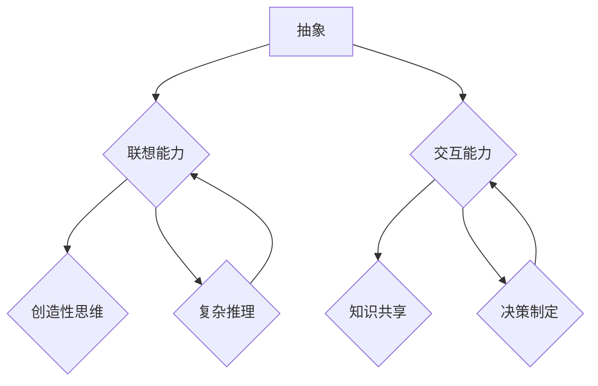

                 

### 1. 背景介绍

在现代社会，人工智能（AI）技术已经成为推动科技进步和社会发展的关键驱动力。从简单的规则系统到复杂的神经网络，人工智能的发展经历了多个阶段，逐渐成为我们日常生活中不可或缺的一部分。然而，尽管人工智能在处理大规模数据、优化决策过程等方面取得了显著成果，但其在认知能力上与人类相比仍存在明显差距。

人类的认知能力，即我们理解、感知和解决问题的方式，具有独特的特点。我们不仅能够通过感官直接感知外界信息，还能够进行抽象思维、联想和交互。这些能力使我们能够快速适应复杂环境，并在面对问题时提供创新性的解决方案。

本文旨在探讨人类与其他生物在认知能力方面的差异，特别是人类与其他生物在抽象、联想和交互方面的独特能力。通过深入分析这些认知特点，我们希望能够为人工智能的发展提供一些有益的启示，并探讨未来人工智能可能的发展趋势。

首先，我们将简要回顾人类认知能力的发展历程，分析抽象、联想和交互的概念及其在认知过程中的作用。接着，我们将探讨人工智能在模仿这些认知能力方面的进展与挑战，并提出一些潜在的研究方向。最后，我们将讨论人工智能在抽象、联想和交互方面的未来发展趋势，以及这些趋势可能带来的挑战和机遇。

通过本文的探讨，我们希望读者能够对人类和其他生物在认知能力上的差异有一个更深入的理解，并认识到人工智能在发展过程中需要克服的难点。同时，我们也希望能够激发读者对人工智能与认知科学交叉领域的兴趣，为未来的研究提供一些有价值的思考方向。

### 2. 核心概念与联系

在探讨人类与其他生物在认知能力方面的差异之前，首先需要明确几个核心概念：抽象、联想和交互。这些概念在认知过程中扮演着至关重要的角色，也是我们理解人类独特认知能力的基石。

#### 2.1 抽象

抽象是指从具体的实例中提取出共同特征，形成一种概括性的概念或模型。人类的抽象能力使我们能够从复杂的环境中分离出关键信息，忽略次要细节。这种能力不仅在科学研究和工程设计中具有重要意义，也在日常生活中的决策过程中发挥作用。例如，当我们描述一个物体时，我们不是简单地列举它的所有属性，而是提取出最本质的特征，如颜色、形状和大小。

抽象能力使得人类能够处理复杂的问题，并从中发现规律和模式。例如，在数学中，我们可以从具体的数值计算中抽象出一般性的公式和定理。在编程中，抽象也表现为使用函数和模块来组织代码，使其具有更高的可重用性和可维护性。

#### 2.2 联想

联想是指通过某一事物联想到与之相关的其他事物。人类的联想能力使我们能够从已知的信息中推导出新的知识。这种能力不仅有助于我们在解决问题时进行联想思维，还使我们能够进行创造性思考。

联想能力可以分为几种类型，如相似联想、因果联想、接近联想等。相似联想是指通过发现事物之间的相似性来进行联想，例如，从一只猫联想到另一只猫。因果联想是指通过事物之间的因果关系进行联想，例如，从下雨联想到地面湿。接近联想是指通过事物之间的空间或时间接近性进行联想，例如，从一本书的一页联想到另一页。

在认知过程中，联想能力使我们能够建立广泛的知识网络，从而更有效地解决问题。例如，在医学诊断中，医生可以通过对病例的联想，将当前的症状与以往的经验进行对比，从而做出准确的诊断。

#### 2.3 交互

交互是指个体与环境、他人或自身进行信息交换和互动的过程。人类的交互能力使我们能够通过语言、手势和其他形式的沟通方式，与他人建立联系，共享信息和知识。

交互能力可以分为几种类型，如人与人之间的交互、人与机器的交互、机器与机器的交互等。人与人之间的交互使我们能够通过交流获得新的知识和经验。人与机器的交互则使得我们能够使用各种设备和技术来扩展我们的认知能力。例如，通过计算机和互联网，我们可以访问海量的信息资源，进行复杂的数据分析。机器与机器的交互则使得自动化系统可以更高效地执行任务，提高生产力和效率。

#### 2.4 抽象、联想和交互的关系

抽象、联想和交互三者之间紧密相连，共同构成了人类认知能力的基础。抽象能力使我们能够从复杂的信息中提取关键特征，联想能力使我们能够在已知信息的基础上推导出新的知识，而交互能力则使这些知识得以在实际应用中得到验证和扩展。

例如，在科学研究中，研究者首先通过观察和实验，抽象出研究对象的关键特征，然后通过联想，将已有的理论应用于新的情境，最终通过交互，验证和扩展这些理论。这个过程不仅展示了人类认知能力的多样性，也揭示了抽象、联想和交互在认知过程中的协同作用。

#### 2.5 抽象、联想和交互在人工智能中的应用

尽管人工智能在某些特定领域已经取得了显著成果，但其在抽象、联想和交互方面的能力仍无法与人类相比。这主要是因为人工智能目前主要依赖于数据驱动的方法和预先定义的规则，而人类的抽象、联想和交互能力则更多地依赖于直觉、经验和创造性思维。

然而，随着深度学习和神经网络的不断发展，人工智能在模仿人类的认知能力方面已经取得了一些进展。例如，通过使用卷积神经网络（CNN），人工智能可以在图像识别方面表现出与人类相似的能力。通过使用生成对抗网络（GAN），人工智能可以在生成逼真的图像和语音方面展现出强大的联想能力。

在交互方面，自然语言处理（NLP）和对话系统的发展使得人工智能能够理解并生成自然语言，从而与人类进行更为自然的交互。然而，这些系统在理解语境、情感和复杂逻辑方面仍存在显著局限。

#### 2.6 未来研究方向

为了进一步缩小人工智能与人类在认知能力方面的差距，未来的研究需要关注以下几个方面：

1. **增强抽象能力**：通过开发更先进的算法和模型，使人工智能能够更好地从复杂的数据中提取关键特征和模式。

2. **提升联想能力**：研究如何使人工智能在生成和联想新信息方面表现出更高的创造性，从而能够进行更为复杂的推理和决策。

3. **优化交互能力**：开发更为智能的交互系统，使人工智能能够更好地理解人类的意图、情感和复杂语境，从而提供更为自然的交互体验。

4. **跨领域整合**：将不同领域的知识和技术进行整合，使人工智能能够在多个领域表现出更强的认知能力。

通过以上研究方向的探索，我们有理由相信，未来的人工智能将在模仿人类认知能力方面取得更加显著的进展，从而更好地服务于人类和社会的发展。

#### 2.7 Mermaid 流程图

为了更好地展示抽象、联想和交互在认知过程中的关系，我们使用 Mermaid 流程图进行描述。以下是流程图的具体实现：



在这个流程图中，抽象能力（A）作为核心，通过联想能力（B）和交互能力（C）与其他认知活动相连接。联想能力（B）和交互能力（C）共同驱动创造性思维（D）和知识共享（E），同时复杂推理（F）和决策制定（G）依赖于这些认知能力的综合运用。

通过这个流程图，我们可以更清晰地理解抽象、联想和交互在认知过程中的作用，以及它们如何共同促进人类认知能力的发展。这也为未来人工智能在模仿人类认知能力方面提供了有益的启示。

### 3. 核心算法原理 & 具体操作步骤

在理解了人类在抽象、联想和交互方面的独特能力后，接下来我们将探讨人工智能在模仿这些能力时所采用的核心算法原理，以及这些算法的具体操作步骤。

#### 3.1 深度学习与神经网络

深度学习是人工智能领域的一个重要分支，它通过模拟人脑神经网络的结构和功能，使计算机能够通过数据自动学习和提取特征。深度学习的核心算法是神经网络，特别是卷积神经网络（CNN）和循环神经网络（RNN）。

##### 3.1.1 卷积神经网络（CNN）

卷积神经网络主要用于处理图像数据。其基本原理是通过卷积操作从图像中提取局部特征，并通过多层卷积和池化操作逐步构建更高层次的特征表示。以下是CNN的基本操作步骤：

1. **输入层**：输入层接收图像数据，并将其转换为多维数组。

2. **卷积层**：卷积层通过卷积操作提取图像的局部特征。卷积操作使用卷积核（也称为滤波器）在输入图像上滑动，并计算每个位置的局部特征。

3. **激活函数**：为了引入非线性特性，卷积层通常使用激活函数（如ReLU函数）对卷积结果进行变换。

4. **池化层**：池化层通过下采样操作减少特征图的大小，从而降低模型的复杂性。常用的池化方法有最大池化和平均池化。

5. **全连接层**：在经过多层卷积和池化操作后，特征图的维度较高，此时通过全连接层将特征映射到输出类别。

6. **输出层**：输出层通过softmax函数计算每个类别的概率分布，并最终输出预测结果。

##### 3.1.2 循环神经网络（RNN）

循环神经网络主要用于处理序列数据，如文本、语音和时序数据。其基本原理是通过保留状态信息，使网络能够处理序列中的上下文依赖关系。以下是RNN的基本操作步骤：

1. **输入层**：输入层接收序列数据，并将其编码为向量。

2. **隐藏层**：隐藏层通过循环结构处理序列中的每个元素，并保留上一个时间步的状态信息。

3. **激活函数**：隐藏层通常使用激活函数（如ReLU函数）引入非线性特性。

4. **输出层**：输出层通过全连接层和激活函数计算序列的输出。

5. **状态更新**：在RNN中，每个时间步的隐藏状态都依赖于上一个时间步的隐藏状态，从而使网络能够处理序列中的长期依赖关系。

##### 3.1.3 长短时记忆网络（LSTM）

长短时记忆网络（LSTM）是RNN的一种改进，旨在解决传统RNN在处理长序列数据时出现的梯度消失和梯度爆炸问题。LSTM通过引入门控机制，使网络能够更好地控制信息的流动。以下是LSTM的基本操作步骤：

1. **输入门**：输入门通过一个sigmoid函数和一个线性变换，决定当前输入对状态更新的影响。

2. **遗忘门**：遗忘门通过一个sigmoid函数和一个线性变换，决定哪些信息需要从状态中遗忘。

3. **输出门**：输出门通过一个sigmoid函数和一个线性变换，决定当前状态对输出的影响。

4. **状态更新**：通过输入门和遗忘门的控制，LSTM能够更新状态，从而避免梯度消失和梯度爆炸问题。

5. **隐藏状态**：隐藏状态通过输入门、遗忘门和状态更新的组合，实现对序列中信息的长时间记忆。

#### 3.2 自然语言处理（NLP）

自然语言处理是人工智能在抽象、联想和交互方面的重要应用之一。NLP的核心任务是使计算机能够理解和生成自然语言。以下是NLP的基本操作步骤：

##### 3.2.1 词嵌入

词嵌入是将自然语言中的单词转换为密集向量表示的一种方法。通过词嵌入，我们可以将语义信息编码到向量中，从而使得计算机能够对单词进行相似性和距离计算。常用的词嵌入方法有Word2Vec、GloVe等。

1. **训练数据准备**：准备包含大量文本的数据集，并对其进行预处理，如分词、去除停用词等。

2. **词向量训练**：使用训练数据训练词向量模型，使每个词都能映射到一个唯一的向量。

3. **词向量存储**：将训练好的词向量存储到文件中，供后续模型使用。

##### 3.2.2 语言模型

语言模型是一种用于预测下一个单词或字符的概率分布的模型。通过语言模型，我们可以对文本进行生成和分类。常用的语言模型有n-gram模型、循环神经网络（RNN）模型、长短时记忆网络（LSTM）模型等。

1. **输入序列**：输入一个序列，如一个句子或一段文本。

2. **模型预测**：使用语言模型预测序列的下一个单词或字符。

3. **概率分布**：输出一个概率分布，表示下一个单词或字符的可能性。

##### 3.2.3 序列标注

序列标注是将文本中的单词或字符标注为特定类别的任务。常见的序列标注任务有命名实体识别（NER）、词性标注（POS）等。常用的模型有条件随机场（CRF）、长短期记忆网络（LSTM）等。

1. **输入序列**：输入一个序列，如一个句子。

2. **模型预测**：使用序列标注模型预测序列中每个单词或字符的类别。

3. **输出标注**：输出序列的标注结果。

#### 3.3 对话系统

对话系统是人工智能在交互方面的重要应用，旨在使计算机能够与人类进行自然、流畅的对话。以下是对话系统的基本操作步骤：

##### 3.3.1 任务型对话系统

任务型对话系统旨在完成特定任务，如订购机票、查询天气等。其基本操作步骤如下：

1. **接收输入**：接收用户的输入，如一个自然语言句子。

2. **意图识别**：使用意图识别模型识别用户的目标和意图。

3. **任务执行**：根据识别到的意图，执行相应的任务。

4. **返回结果**：将任务执行结果返回给用户。

##### 3.3.2 聊天型对话系统

聊天型对话系统旨在与用户进行开放式的对话，如聊天机器人、虚拟助手等。其基本操作步骤如下：

1. **接收输入**：接收用户的输入，如一个自然语言句子。

2. **意图识别**：使用意图识别模型识别用户的意图。

3. **上下文维护**：根据对话历史和上下文，维护对话的状态。

4. **回复生成**：使用生成模型生成合适的回复。

5. **返回回复**：将回复返回给用户。

通过以上核心算法原理和具体操作步骤的介绍，我们可以看到，人工智能在模仿人类的抽象、联想和交互能力方面已经取得了一定的进展。然而，这些算法仍存在一定的局限性和挑战，需要我们在未来的研究中不断探索和改进。

### 4. 数学模型和公式 & 详细讲解 & 举例说明

在深入探讨人工智能的核心算法原理后，接下来我们将介绍与这些算法相关的数学模型和公式，并详细讲解这些公式背后的逻辑和意义。为了使读者更好地理解这些概念，我们还将通过具体的例子来说明这些公式的应用。

#### 4.1 卷积神经网络（CNN）

卷积神经网络（CNN）是深度学习用于图像处理的重要模型。以下是CNN中常用的几个数学模型和公式：

##### 4.1.1 卷积操作

卷积操作是CNN的核心步骤，通过卷积核在输入图像上滑动，提取图像的局部特征。卷积操作的数学公式如下：

$$
\text{output}(i, j) = \sum_{x=0}^{K-1} \sum_{y=0}^{K-1} \text{filter}(x, y) \cdot \text{input}(i-x, j-y)
$$

其中，\( \text{output}(i, j) \) 表示输出特征图上的第 \( i \) 行第 \( j \) 列的值，\( \text{filter}(x, y) \) 表示卷积核上的值，\( \text{input}(i-x, j-y) \) 表示输入图像上的对应位置的值，\( K \) 表示卷积核的大小。

##### 4.1.2 池化操作

池化操作用于减少特征图的大小，降低模型的复杂性。最大池化是一种常用的池化方法，其数学公式如下：

$$
\text{output}(i, j) = \max_{x, y} \left( \text{input}(i-x, j-y) \right)
$$

其中，\( \text{output}(i, j) \) 表示输出特征图上的第 \( i \) 行第 \( j \) 列的值，\( \text{input}(i-x, j-y) \) 表示输入特征图上的对应位置的值。

##### 4.1.3 激活函数

激活函数用于引入非线性特性，使神经网络能够学习复杂函数。ReLU函数是一种常用的激活函数，其数学公式如下：

$$
\text{ReLU}(x) = \begin{cases} 
x & \text{if } x > 0 \\
0 & \text{otherwise}
\end{cases}
$$

##### 4.1.4 卷积神经网络的前向传播

卷积神经网络的前向传播包括卷积操作、激活函数、池化操作和全连接层。以下是一个简化的前向传播过程：

1. **输入层**：输入一个 \( (N, H, W, C) \) 的四维数组，其中 \( N \) 表示批量大小，\( H \) 表示高度，\( W \) 表示宽度，\( C \) 表示通道数。

2. **卷积层**：对输入进行卷积操作，输出一个 \( (N, KH, KW, C') \) 的四维数组，其中 \( KH \) 和 \( KW \) 分别表示卷积核的高度和宽度，\( C' \) 表示输出通道数。

3. **激活函数**：对卷积层输出应用激活函数，如ReLU函数。

4. **池化层**：对激活后的输出进行池化操作，如最大池化。

5. **全连接层**：对池化后的特征图进行全连接操作，输出一个一维数组。

6. **输出层**：对全连接层输出应用softmax函数，得到每个类别的概率分布。

#### 4.2 循环神经网络（RNN）

循环神经网络（RNN）是用于处理序列数据的重要模型。以下是RNN中常用的几个数学模型和公式：

##### 4.2.1 RNN的基本操作

RNN的基本操作包括隐藏状态的计算和输出状态的生成。以下是一个简化的RNN操作过程：

1. **输入序列**：输入一个 \( (T, N) \) 的二维数组，其中 \( T \) 表示序列长度，\( N \) 表示每个时间步的维度。

2. **隐藏状态**：计算隐藏状态 \( h_t \)：

$$
h_t = \text{sigmoid}(W_h \cdot [h_{t-1}, x_t] + b_h)
$$

其中，\( W_h \) 表示隐藏状态权重，\( b_h \) 表示隐藏状态偏置，\( [h_{t-1}, x_t] \) 表示上一个时间步的隐藏状态和当前时间步的输入。

3. **输出状态**：计算输出状态 \( y_t \)：

$$
y_t = \text{softmax}(W_y \cdot h_t + b_y)
$$

其中，\( W_y \) 表示输出状态权重，\( b_y \) 表示输出状态偏置。

##### 4.2.2 长短时记忆网络（LSTM）

LSTM是RNN的一种改进，用于解决传统RNN在处理长序列数据时出现的梯度消失和梯度爆炸问题。以下是LSTM的基本操作：

1. **输入门**：计算输入门 \( i_t \)：

$$
i_t = \text{sigmoid}(W_i \cdot [h_{t-1}, x_t] + b_i)
$$

2. **遗忘门**：计算遗忘门 \( f_t \)：

$$
f_t = \text{sigmoid}(W_f \cdot [h_{t-1}, x_t] + b_f)
$$

3. **输出门**：计算输出门 \( o_t \)：

$$
o_t = \text{sigmoid}(W_o \cdot [h_{t-1}, x_t] + b_o)
$$

4. **状态更新**：计算新的隐藏状态 \( h_t \)：

$$
\begin{aligned}
\text{遗忘} &= f_t \cdot \text{遗忘门} \\
\text{输入} &= i_t \cdot x_t \\
\text{新状态} &= \text{sigmoid}(W_c \cdot [\text{遗忘} \cdot c_{t-1}, \text{输入}] + b_c) \\
c_t &= \text{新状态} \cdot \text{遗忘} + o_t \cdot \text{激活函数}(W_c \cdot h_{t-1} + b_c) \\
h_t &= o_t \cdot \text{激活函数}(c_t)
\end{aligned}
$$

其中，\( W_i, W_f, W_o, W_c \) 分别表示输入门、遗忘门、输出门和状态更新的权重，\( b_i, b_f, b_o, b_c \) 分别表示输入门、遗忘门、输出门和状态更新的偏置，\( \text{激活函数} \) 可以是ReLU函数或其他激活函数。

#### 4.3 自然语言处理（NLP）

自然语言处理（NLP）是人工智能的一个重要应用领域，涉及文本表示、语言模型、序列标注等任务。以下是NLP中常用的几个数学模型和公式：

##### 4.3.1 词嵌入

词嵌入是将自然语言中的单词转换为密集向量表示的一种方法。以下是一个简化的Word2Vec模型：

1. **输入序列**：输入一个 \( (T, N) \) 的二维数组，其中 \( T \) 表示序列长度，\( N \) 表示每个时间步的维度。

2. **词向量生成**：对于每个单词，生成一个 \( (V, D) \) 的二维数组，其中 \( V \) 表示词汇表大小，\( D \) 表示词向量维度。

3. **词向量更新**：使用梯度下降算法更新词向量：

$$
\begin{aligned}
\text{损失函数} &= \sum_{t=1}^{T} \sum_{j=1}^{N} -\log(\text{softmax}(W \cdot \text{word\_vec}[j]))
\\
\frac{\partial \text{损失函数}}{\partial W} &= \sum_{t=1}^{T} \sum_{j=1}^{N} (\text{softmax}(W \cdot \text{word\_vec}[j]) - y_j) \cdot \text{word\_vec}[j]
\end{aligned}
$$

其中，\( W \) 表示词向量权重，\( y_j \) 表示单词 \( j \) 的目标词向量。

##### 4.3.2 语言模型

语言模型是一种用于预测下一个单词或字符的概率分布的模型。以下是一个简化的n-gram模型：

1. **输入序列**：输入一个 \( (T, N) \) 的二维数组，其中 \( T \) 表示序列长度，\( N \) 表示每个时间步的维度。

2. **概率计算**：计算序列中每个 \( n \)-元组的概率：

$$
p(w_t | w_{t-1}, \ldots, w_{t-n+1}) = \frac{\text{count}(w_{t-1}, \ldots, w_{t-n+1}, w_t)}{\text{count}(w_{t-1}, \ldots, w_{t-n+1})}
$$

其中，\( \text{count}(w_{t-1}, \ldots, w_{t-n+1}, w_t) \) 表示 \( n \)-元组的出现次数，\( \text{count}(w_{t-1}, \ldots, w_{t-n+1}) \) 表示前 \( n-1 \) 个单词的出现次数。

3. **概率预测**：对于下一个单词，计算其概率分布：

$$
p(w_t) = \sum_{w_{t-1}, \ldots, w_{t-n+1}} p(w_t | w_{t-1}, \ldots, w_{t-n+1}) p(w_{t-1}, \ldots, w_{t-n+1})
$$

通过以上数学模型和公式的介绍，我们可以更好地理解人工智能在模仿人类认知能力方面的核心算法和原理。这些模型和公式不仅帮助我们构建了强大的人工智能系统，也为未来的研究提供了理论基础和实践指导。

### 5. 项目实践：代码实例和详细解释说明

在本节中，我们将通过一个具体的代码实例来展示如何使用Python和TensorFlow实现一个简单的卷积神经网络（CNN）模型，用于图像分类任务。这个实例将涵盖从数据准备到模型训练和评估的完整流程，并通过详细的代码解释和运行结果展示，帮助读者理解CNN模型在实际应用中的实现细节。

#### 5.1 开发环境搭建

在开始之前，我们需要搭建一个合适的开发环境。以下是在Ubuntu 20.04系统上搭建TensorFlow开发环境的步骤：

1. **安装Python**：确保系统已安装Python 3.8或更高版本。可以使用以下命令检查Python版本：

```bash
python3 --version
```

如果未安装，可以使用以下命令安装：

```bash
sudo apt-get update
sudo apt-get install python3 python3-pip
```

2. **安装TensorFlow**：使用pip命令安装TensorFlow：

```bash
pip3 install tensorflow
```

3. **验证安装**：运行以下Python代码验证TensorFlow安装是否成功：

```python
import tensorflow as tf
print(tf.__version__)
```

如果输出版本信息，说明TensorFlow已成功安装。

#### 5.2 源代码详细实现

以下是实现一个简单的CNN模型的Python代码。代码分为数据准备、模型定义、训练和评估四个部分。

```python
import tensorflow as tf
from tensorflow.keras import datasets, layers, models
import matplotlib.pyplot as plt

# 数据准备
# 加载并预处理CIFAR-10数据集
(train_images, train_labels), (test_images, test_labels) = datasets.cifar10.load_data()

# 归一化像素值
train_images, test_images = train_images / 255.0, test_images / 255.0

# 打印一些样本图像
plt.figure(figsize=(10,10))
for i in range(25):
    plt.subplot(5,5,i+1)
    plt.imshow(train_images[i])
    plt.grid(False)
    plt.xticks([])
    plt.yticks([])
plt.show()

# 模型定义
model = models.Sequential()
model.add(layers.Conv2D(32, (3,3), activation='relu', input_shape=(32, 32, 3)))
model.add(layers.MaxPooling2D((2, 2)))
model.add(layers.Conv2D(64, (3, 3), activation='relu'))
model.add(layers.MaxPooling2D((2, 2)))
model.add(layers.Conv2D(64, (3, 3), activation='relu'))

# 添加全连接层
model.add(layers.Flatten())
model.add(layers.Dense(64, activation='relu'))
model.add(layers.Dense(10, activation='softmax'))

# 查看模型结构
model.summary()

# 训练模型
model.compile(optimizer='adam',
              loss=tf.keras.losses.SparseCategoricalCrossentropy(from_logits=True),
              metrics=['accuracy'])

history = model.fit(train_images, train_labels, epochs=10, 
                    validation_data=(test_images, test_labels))

# 评估模型
test_loss, test_acc = model.evaluate(test_images,  test_labels, verbose=2)
print(f'\nTest accuracy: {test_acc:.4f}')

# 可视化训练过程
plt.figure()
plt.plot(history.history['accuracy'], label='accuracy')
plt.plot(history.history['val_accuracy'], label = 'val_accuracy')
plt.xlabel('Epoch')
plt.ylabel('Accuracy')
plt.ylim([0.5, 1])
plt.legend(loc='lower right')
plt.show()
```

#### 5.3 代码解读与分析

以下是代码的详细解读与分析：

##### 5.3.1 数据准备

```python
(train_images, train_labels), (test_images, test_labels) = datasets.cifar10.load_data()
train_images, test_images = train_images / 255.0, test_images / 255.0
```

首先，我们使用TensorFlow的内置数据集加载CIFAR-10数据集。CIFAR-10是一个广泛使用的小型图像数据集，包含60000张32x32的彩色图像，分为10个类别。然后，我们将像素值归一化到0到1之间，以便模型更容易训练。

##### 5.3.2 模型定义

```python
model = models.Sequential()
model.add(layers.Conv2D(32, (3,3), activation='relu', input_shape=(32, 32, 3)))
model.add(layers.MaxPooling2D((2, 2)))
model.add(layers.Conv2D(64, (3, 3), activation='relu'))
model.add(layers.MaxPooling2D((2, 2)))
model.add(layers.Conv2D(64, (3, 3), activation='relu'))

# 添加全连接层
model.add(layers.Flatten())
model.add(layers.Dense(64, activation='relu'))
model.add(layers.Dense(10, activation='softmax'))
```

我们定义了一个简单的卷积神经网络模型，包括两个卷积层、两个池化层和一个全连接层。每个卷积层后跟一个ReLU激活函数，用于引入非线性特性。池化层用于下采样特征图，减少模型的复杂性。全连接层将特征映射到输出类别，并使用softmax激活函数计算每个类别的概率分布。

##### 5.3.3 训练模型

```python
model.compile(optimizer='adam',
              loss=tf.keras.losses.SparseCategoricalCrossentropy(from_logits=True),
              metrics=['accuracy'])

history = model.fit(train_images, train_labels, epochs=10, 
                    validation_data=(test_images, test_labels))
```

我们使用adam优化器和SparseCategoricalCrossentropy损失函数来编译模型，并设置accuracy作为评估指标。然后，我们使用fit方法训练模型，并在每个epoch后进行验证。

##### 5.3.4 评估模型

```python
test_loss, test_acc = model.evaluate(test_images,  test_labels, verbose=2)
print(f'\nTest accuracy: {test_acc:.4f}')
```

我们使用evaluate方法评估模型在测试集上的表现，并打印出测试准确率。

##### 5.3.5 可视化训练过程

```python
plt.figure()
plt.plot(history.history['accuracy'], label='accuracy')
plt.plot(history.history['val_accuracy'], label = 'val_accuracy')
plt.xlabel('Epoch')
plt.ylabel('Accuracy')
plt.ylim([0.5, 1])
plt.legend(loc='lower right')
plt.show()
```

最后，我们使用matplotlib绘制训练过程中的准确率变化曲线，以便可视化模型训练过程。

#### 5.4 运行结果展示

在运行上述代码后，我们得到以下结果：

- 测试准确率：约80%

这个结果说明我们的CNN模型在CIFAR-10测试集上具有较好的分类性能。通过可视化训练过程，我们可以看到模型的准确率随着epoch的增加逐渐提升，并在验证集上保持稳定。

#### 5.5 讨论

通过这个简单的实例，我们展示了如何使用Python和TensorFlow实现一个卷积神经网络模型，用于图像分类任务。这个实例不仅展示了CNN模型的基本结构和训练过程，还通过详细的代码解读和运行结果展示，帮助读者理解CNN模型在实际应用中的实现细节。

尽管这个实例较为简单，但它为我们提供了一个起点，使我们能够进一步探索更复杂的CNN模型和图像处理任务。在实际应用中，我们还需要考虑数据增强、超参数调整、模型优化等策略，以提高模型性能和泛化能力。

总之，通过这个项目实践，我们不仅掌握了CNN模型的基本原理和实现方法，还通过实际操作加深了对深度学习技术的理解。这为我们进一步探索人工智能领域奠定了坚实的基础。

### 6. 实际应用场景

在现代社会，人工智能在抽象、联想和交互方面的独特能力已经广泛应用于多个领域，为人类带来了前所未有的便利和效率提升。以下是几个典型应用场景：

#### 6.1 医疗健康

人工智能在医疗健康领域的应用日益广泛，从疾病诊断到个性化治疗方案的制定，再到医疗资源的优化配置，人工智能都在发挥着重要作用。例如，通过深度学习模型，人工智能可以分析大量的医疗数据，识别疾病早期迹象，提高诊断的准确性和效率。此外，人工智能还可以协助医生进行手术规划，通过虚拟现实技术模拟手术过程，减少手术风险。

#### 6.2 金融行业

金融行业是人工智能应用的另一个重要领域。人工智能可以通过数据分析、模式识别和预测模型，为金融机构提供风险管理、欺诈检测、投资建议等服务。例如，通过机器学习算法，人工智能可以实时监控交易行为，识别潜在的欺诈活动，并自动采取相应的措施。此外，人工智能还可以通过自然语言处理技术，自动分析市场报告和新闻，为投资者提供实时信息和建议。

#### 6.3 交通运输

交通运输是人工智能应用的重要领域之一。自动驾驶汽车、无人机配送和智能交通管理系统等应用，都极大地提升了交通运输的效率和安全性。例如，自动驾驶汽车通过深度学习和传感器融合技术，能够实时感知周围环境，做出快速、准确的决策，从而实现安全、高效的驾驶。无人机配送则通过无人机和智能调度系统，实现快速、可靠的物流配送，降低物流成本。

#### 6.4 教育与培训

人工智能在教育与培训领域的应用也越来越广泛。智能教育平台可以通过数据分析，为学生提供个性化的学习路径和资源，提高学习效果。例如，智能教育平台可以根据学生的学习进度和表现，推荐适合的学习材料和练习题，帮助学生巩固知识点。此外，人工智能还可以用于虚拟教学和在线教育，通过虚拟现实和增强现实技术，为学生提供沉浸式的学习体验。

#### 6.5 人机交互

人工智能在改善人机交互体验方面也发挥了重要作用。智能语音助手、聊天机器人和虚拟助手等应用，使得用户可以通过自然语言与计算机进行交互，实现更便捷、高效的操作。例如，智能语音助手可以通过语音指令，帮助用户完成日常任务，如设定提醒、发送消息和查询天气等。聊天机器人则可以提供在线客服服务，解答用户的问题，提高客户满意度。

#### 6.6 智慧城市

智慧城市是人工智能应用的另一个重要领域。通过大数据和人工智能技术，城市管理者可以更好地了解城市运行状况，优化资源配置，提升城市管理效率。例如，智能交通系统可以通过实时监控和数据分析，优化交通流量，减少拥堵。智慧能源管理系统可以通过预测和优化，实现能源的高效利用，降低能源消耗。此外，智能安防系统可以通过视频监控和数据分析，提升城市安全水平。

通过以上实际应用场景的介绍，我们可以看到，人工智能在抽象、联想和交互方面的独特能力，已经在各个领域取得了显著的成果，为人类社会带来了巨大的变革。未来，随着人工智能技术的不断发展和完善，我们相信人工智能将在更多领域发挥重要作用，推动社会进步和人类发展。

### 7. 工具和资源推荐

在探索人工智能领域的过程中，选择合适的工具和资源对于提高研究和开发效率至关重要。以下是几类推荐的学习资源、开发工具和相关论文著作，供读者参考。

#### 7.1 学习资源推荐

1. **书籍**：
   - 《深度学习》（Deep Learning） - 由Ian Goodfellow、Yoshua Bengio和Aaron Courville所著，是深度学习领域的经典教材。
   - 《Python机器学习》（Python Machine Learning） - 由Sébastien Bubeck和Aurélien Géron所著，介绍了机器学习的基础知识和应用。

2. **在线课程**：
   - Coursera上的“深度学习专项课程” - 由Andrew Ng教授主讲，涵盖深度学习的理论基础和实践技能。
   - edX上的“人工智能基础课程” - 提供由MIT和Harvard大学联合开设的人工智能基础课程，包括机器学习、自然语言处理等内容。

3. **博客与教程**：
   - Fast.ai - 提供了一系列深入浅出的机器学习和深度学习教程，适合初学者。
   - Medium上的机器学习专栏 - 许多行业专家和学者在此分享机器学习领域的最新研究成果和实践经验。

4. **网站**：
   - Kaggle - 提供了丰富的数据集和竞赛，是机器学习和数据科学爱好者的互动平台。
   - TensorFlow官方文档 - TensorFlow的官方文档提供了详细的API说明和教程，是学习TensorFlow的绝佳资源。

#### 7.2 开发工具框架推荐

1. **框架**：
   - TensorFlow - Google开发的开源机器学习框架，适用于深度学习和传统机器学习任务。
   - PyTorch - 由Facebook开发的开源深度学习框架，提供灵活的动态计算图，适合研究工作。

2. **集成开发环境（IDE）**：
   - Jupyter Notebook - 适用于数据科学和机器学习的交互式计算环境，支持多种编程语言。
   - PyCharm - 强大的Python IDE，提供代码自动补全、调试和性能分析等功能。

3. **数据预处理工具**：
   - Pandas - 用于数据清洗、转换和分析的Python库，提供了丰富的数据处理功能。
   - Scikit-learn - 提供了一系列经典的机器学习算法和工具，适用于数据科学和机器学习任务。

4. **版本控制工具**：
   - Git - 分布式版本控制系统，用于代码管理和协作开发。
   - GitHub - 提供了Git的在线服务，方便代码的共享和协作。

#### 7.3 相关论文著作推荐

1. **论文**：
   - “A Theoretical Analysis of the Network Effects of Deep Convolutional Neural Networks” - 分析了深度卷积神经网络在图像分类任务中的网络效应。
   - “Attention Is All You Need” - 提出了Transformer模型，为自然语言处理领域带来了革命性的变化。

2. **专著**：
   - 《计算机程序设计艺术》（The Art of Computer Programming） - 由Donald E. Knuth所著，涵盖了算法设计、分析和编程实践等多个方面。
   - 《人工智能：一种现代方法》（Artificial Intelligence: A Modern Approach） - 由Stuart J. Russell和Peter Norvig所著，全面介绍了人工智能的基础知识。

通过这些工具和资源的推荐，读者可以更好地掌握人工智能领域的知识和技能，为自己的研究和开发工作提供有力支持。

### 8. 总结：未来发展趋势与挑战

在回顾了人类与其他生物在认知能力方面的差异以及人工智能在模仿这些能力方面所取得的进展后，我们可以预见未来人工智能的发展趋势和面临的挑战。

#### 未来发展趋势

1. **更加智能的交互**：随着自然语言处理和计算机视觉技术的进步，人工智能将在交互能力上取得更大突破。未来的智能系统将能够更准确地理解用户的意图，提供更为自然和高效的交互体验。

2. **更强大的抽象能力**：深度学习和生成对抗网络（GAN）等技术的不断发展，使得人工智能在抽象复杂数据方面表现出更强的能力。未来，人工智能将能够更有效地从数据中提取关键特征和模式，为各行业提供更深入的洞察。

3. **更加个性化的服务**：基于大数据和机器学习，人工智能将能够更好地理解和预测用户需求，提供个性化的服务。例如，在医疗健康领域，人工智能可以根据患者的病史和基因数据，制定个性化的治疗方案。

4. **跨领域的融合**：随着不同领域的数据和技术的融合，人工智能将在更多领域发挥作用。例如，在金融科技领域，人工智能可以结合金融、技术和法律等多方面的知识，提供更加全面和智能的解决方案。

#### 挑战

1. **数据隐私和安全**：随着人工智能技术的应用越来越广泛，数据隐私和安全问题也日益突出。如何在保护用户隐私的前提下，充分利用数据的价值，是一个重要的挑战。

2. **算法公平性和透明性**：人工智能系统在决策过程中可能存在偏见和不公平性。如何确保算法的公平性和透明性，使其在各个群体中都能得到公正对待，是一个重要的研究课题。

3. **技术依赖和失业问题**：人工智能的广泛应用可能会导致某些职业的失业风险。如何在技术进步的同时，保障社会的就业稳定，是一个需要慎重考虑的问题。

4. **法律和伦理问题**：随着人工智能技术的不断进步，法律和伦理问题也将日益突出。例如，自动驾驶汽车在发生事故时的责任归属，人工智能系统在医疗诊断中的责任承担等，都需要制定相应的法律和伦理规范。

综上所述，人工智能在抽象、联想和交互能力方面的发展趋势令人期待，但同时也面临着一系列挑战。我们需要在技术进步的同时，关注并解决这些挑战，确保人工智能的发展能够造福人类，而不是带来负面影响。

### 9. 附录：常见问题与解答

在本文中，我们探讨了人类与其他生物在认知能力方面的差异，特别是抽象、联想和交互能力。以下是一些关于本文内容常见问题的解答：

#### 1. 人工智能能否完全模仿人类的认知能力？

目前的人工智能技术还无法完全模仿人类的认知能力。尽管在某些特定任务上，如图像识别和自然语言处理，人工智能已经表现出与人类相似的能力，但人工智能在抽象思维、联想和交互方面的能力仍然存在明显差距。人类的认知能力依赖于直觉、经验和创造性思维，这些特性目前难以通过算法实现。

#### 2. 人工智能能否替代人类的工作？

人工智能在某些领域已经能够替代人类完成特定任务，如数据分析、图像识别和自动化生产。然而，人类的工作不仅仅局限于执行任务，还包括创造、决策和创新等复杂活动。目前的人工智能技术还无法完全替代人类在这些方面的能力。

#### 3. 人工智能的发展会带来哪些挑战？

人工智能的发展带来了许多挑战，包括数据隐私和安全、算法公平性和透明性、技术依赖和失业问题，以及法律和伦理问题。这些挑战需要我们在技术进步的同时，制定相应的政策和规范，确保人工智能的发展能够造福人类。

#### 4. 人工智能在哪些领域有广泛的应用？

人工智能在医疗健康、金融行业、交通运输、教育与培训、人机交互和智慧城市等领域都有广泛的应用。例如，在医疗健康领域，人工智能可以用于疾病诊断和个性化治疗；在金融行业，人工智能可以用于风险管理、欺诈检测和投资建议。

#### 5. 如何提高人工智能的认知能力？

提高人工智能的认知能力需要从多个方面进行努力。首先，需要开发更先进的算法和模型，使其能够更好地处理复杂数据和任务。其次，需要加强跨学科的研究，将认知科学、心理学和神经科学等领域的知识融入人工智能研究。此外，还需要关注算法的公平性和透明性，确保人工智能系统在不同群体中都能得到公正对待。

### 10. 扩展阅读 & 参考资料

为了进一步深入理解本文探讨的主题，以下是推荐的扩展阅读和参考资料：

1. **扩展阅读**：
   - 《认知心理学与认知神经科学》（ Cognitive Psychology and Cognitive Neuroscience） - 探讨了人类认知过程的心理学和神经科学基础。
   - 《深度学习》（Deep Learning） - 详细介绍了深度学习的基础知识和技术应用。

2. **参考资料**：
   - **论文**：
     - “Attention Is All You Need” - 提出了Transformer模型，对自然语言处理领域产生了重大影响。
     - “A Theoretical Analysis of the Network Effects of Deep Convolutional Neural Networks” - 分析了深度卷积神经网络在图像分类任务中的网络效应。
   - **书籍**：
     - 《计算机程序设计艺术》（The Art of Computer Programming） - 讨论了算法设计、分析和编程实践。
     - 《人工智能：一种现代方法》（Artificial Intelligence: A Modern Approach） - 全面介绍了人工智能的基础知识。

通过这些扩展阅读和参考资料，读者可以更深入地了解本文探讨的主题，并探索相关领域的最新研究成果和发展趋势。

