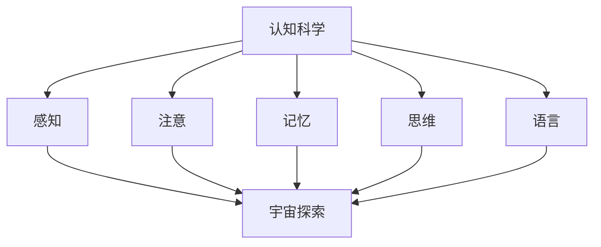

                 

### 文章标题

### 认知的形式化：人类能否把宇宙的奥秘探寻清楚？

> **关键词**：认知科学、形式化方法、宇宙探索、人工智能、数学模型

> **摘要**：本文探讨了人类认知的形式化方法，并探讨了其应用于宇宙探索的可能性。通过分析认知科学中的核心概念和算法原理，本文提出了一个逐步分析推理的框架，以解释人类认知如何可能揭示宇宙的奥秘。文章还通过数学模型和实例分析，探讨了认知形式化在解决复杂问题中的应用潜力，并对未来认知科学的发展趋势和挑战进行了展望。

## 1. 背景介绍

### 认知科学与宇宙探索

认知科学是一门研究人类思维和智能的跨学科领域，它试图通过计算机科学、心理学、神经科学和哲学等多学科的综合研究，揭示人类认知的原理和机制。宇宙探索则是人类对宇宙空间、天体物理和宇宙演化过程的研究，旨在理解宇宙的本质和规律。

尽管认知科学和宇宙探索看似截然不同的两个领域，但它们之间的联系却日益紧密。认知科学的发展为宇宙探索提供了新的视角和方法，例如，通过模拟人脑的认知过程，我们可以更好地理解宇宙中的复杂现象。同时，宇宙探索的进展也为认知科学提供了丰富的实验数据和理论支持，使得我们能够更深入地研究人类认知的本质。

### 认知的形式化

认知的形式化是指将认知过程和认知活动转化为形式化模型和算法的过程。这种方法旨在通过数学、逻辑和计算机科学等工具，对认知现象进行量化分析和建模。形式化方法不仅有助于我们更好地理解认知过程，还可以为人工智能和计算机科学的发展提供新的思路。

认知的形式化方法在认知科学中具有重要的地位。首先，它为认知科学提供了一种新的研究方法，使得我们能够通过数学和计算机科学的方法来研究认知现象。其次，形式化方法可以帮助我们建立更加精确和严谨的认知模型，从而提高认知科学的可信度和应用价值。最后，形式化方法为人工智能的发展提供了新的基础，使得计算机能够更好地模拟和理解人类认知过程。

### 人类认知与宇宙奥秘

人类认知在宇宙探索中扮演着关键角色。通过观察、思考和推理，人类能够对宇宙中的现象进行理解和解释。然而，宇宙的奥秘往往超出了人类认知的范畴，这使得我们对宇宙的理解仍然存在诸多未知和挑战。

认知的形式化方法为我们提供了探索宇宙奥秘的可能路径。通过将认知过程形式化，我们可以构建数学模型和算法，以揭示宇宙中的复杂现象和规律。例如，通过形式化的人类认知模型，我们可以模拟和理解宇宙中的黑洞、宇宙大爆炸等复杂现象。

## 2. 核心概念与联系

### 认知科学的核心概念

认知科学中的核心概念包括感知、注意、记忆、思维和语言等。这些概念相互关联，共同构成了人类认知的基本框架。

1. **感知**：感知是指人类通过感官接收外部信息的过程。它包括视觉、听觉、触觉、嗅觉和味觉等多种形式。感知是人类认知的起点，为后续的认知活动提供了基础。

2. **注意**：注意是指人类在处理信息时，选择关注某些信息而忽略其他信息的能力。注意机制有助于提高认知效率，使得人类能够专注于重要信息。

3. **记忆**：记忆是指人类对过去经验的存储和回忆能力。记忆是人类认知的重要组成部分，它帮助我们学习、适应和解决问题。

4. **思维**：思维是指人类通过逻辑推理、分析、综合和创造等方式，对信息进行处理和加工的过程。思维是人类认知的核心，它使得人类能够理解和解释复杂现象。

5. **语言**：语言是人类进行沟通和交流的主要工具，它通过符号和规则来传递信息和知识。语言是人类认知的延伸，它使得人类能够进行复杂的思维活动。

### 形式化方法在认知科学中的应用

形式化方法在认知科学中的应用主要体现在以下几个方面：

1. **数学建模**：通过数学建模，我们可以将认知现象转化为数学表达式和公式，从而对认知过程进行量化分析和建模。

2. **计算机模拟**：通过计算机模拟，我们可以创建虚拟的认知环境，对认知过程进行实验和验证。计算机模拟有助于我们更深入地理解认知现象和机制。

3. **算法设计**：通过算法设计，我们可以开发出基于认知原理的智能系统，从而实现某些认知功能。例如，计算机视觉系统可以通过模拟人类的视觉认知过程，实现对图像的识别和理解。

### 认知科学和宇宙探索的联系

认知科学和宇宙探索之间的联系可以通过以下方式体现：

1. **认知模型**：通过构建认知模型，我们可以模拟和理解宇宙中的复杂现象。例如，通过认知模型，我们可以模拟黑洞的形成和演化过程。

2. **计算模拟**：通过计算模拟，我们可以对宇宙中的复杂系统进行模拟和分析。例如，通过计算机模拟，我们可以预测宇宙中星系的形成和演化。

3. **数据驱动**：通过宇宙探索过程中获得的数据，我们可以训练和优化认知模型。例如，通过分析宇宙微波背景辐射数据，我们可以提高对宇宙大爆炸理论的理解。

### Mermaid 流程图

以下是认知科学和宇宙探索之间联系的 Mermaid 流程图：



## 3. 核心算法原理 & 具体操作步骤

### 认知科学的核心算法

在认知科学中，核心算法通常涉及以下几种：

1. **神经网络算法**：神经网络算法是一种模拟人脑神经元之间相互连接和交互的计算模型。它通过调整神经元之间的权重，实现对输入数据的处理和分类。

2. **贝叶斯推理算法**：贝叶斯推理算法是一种基于概率论的方法，用于根据先验知识和新证据更新概率估计。它广泛应用于人工智能、机器学习和数据挖掘等领域。

3. **遗传算法**：遗传算法是一种模拟自然进化过程的优化算法。它通过模拟生物进化中的遗传、变异和选择过程，实现对问题的优化。

### 算法原理

以下是上述算法的基本原理：

1. **神经网络算法**：神经网络算法的核心思想是通过多层神经元之间的连接和激活函数，实现对输入数据的映射和分类。具体步骤如下：

   - 输入数据通过输入层进入神经网络。
   - 输入数据经过隐藏层处理，并逐层传递。
   - 最终输出层输出分类结果。

2. **贝叶斯推理算法**：贝叶斯推理算法的核心思想是通过先验概率和证据概率，计算后验概率。具体步骤如下：

   - 确定先验概率，即对事件发生的初始估计。
   - 接收新证据，计算证据概率。
   - 根据贝叶斯公式，更新后验概率。

3. **遗传算法**：遗传算法的核心思想是通过模拟生物进化过程，实现对问题的优化。具体步骤如下：

   - 初始化种群，每个个体代表一种可能的解。
   - 计算种群中个体的适应度，选择适应度较高的个体作为父代。
   - 通过交叉、变异和选择操作，生成新的种群。
   - 重复上述步骤，直到达到预设的终止条件。

### 算法操作步骤

以下是认知科学核心算法的具体操作步骤：

1. **神经网络算法**：

   ```mermaid
   graph TD
       A[输入数据] --> B[输入层]
       B --> C[隐藏层1]
       C --> D[隐藏层2]
       D --> E[输出层]
       E --> F[分类结果]
   ```

2. **贝叶斯推理算法**：

   ```mermaid
   graph TD
       A[先验概率] --> B[证据概率]
       B --> C[后验概率]
       C --> D[更新概率]
   ```

3. **遗传算法**：

   ```mermaid
   graph TD
       A[初始化种群] --> B[计算适应度]
       B --> C[选择父代]
       C --> D[交叉操作]
       D --> E[变异操作]
       E --> F[生成新种群]
       F --> G[重复步骤]
   ```

## 4. 数学模型和公式 & 详细讲解 & 举例说明

### 数学模型和公式

在认知科学中，数学模型和公式是描述认知现象和过程的重要工具。以下是几个常见的数学模型和公式：

1. **神经网络算法中的激活函数**：

   $$f(x) = \frac{1}{1 + e^{-x}}$$

   这是一个常用的 sigmoid 激活函数，用于将神经元输出转换为概率值。

2. **贝叶斯推理算法中的贝叶斯公式**：

   $$P(A|B) = \frac{P(B|A)P(A)}{P(B)}$$

   这是一个用于计算后验概率的贝叶斯公式，其中 $P(A|B)$ 表示在已知事件 $B$ 发生的条件下，事件 $A$ 发生的概率。

3. **遗传算法中的适应度函数**：

   $$f(x) = \sum_{i=1}^{n} w_i \cdot x_i$$

   这是一个用于评估个体适应度的函数，其中 $w_i$ 表示第 $i$ 个基因的权重，$x_i$ 表示第 $i$ 个基因的值。

### 详细讲解

1. **神经网络算法中的激活函数**：

   sigmoid 激活函数是一种常用的非线性函数，它将神经元的输出映射到概率值范围（0到1）。这个函数的优点是它具有平滑的输出特性，有利于梯度下降算法的训练过程。

   激活函数的具体计算过程如下：

   - 对于输入 $x$，首先计算 $z = x \cdot w - b$，其中 $w$ 是权重，$b$ 是偏置。
   - 然后计算激活值 $a = \frac{1}{1 + e^{-z}}$。

   通过这个激活函数，我们可以将神经元的线性输出转化为非线性输出，从而实现对输入数据的非线性变换。

2. **贝叶斯推理算法中的贝叶斯公式**：

   贝叶斯公式是概率论中的一个重要公式，它描述了在给定先验概率和证据概率的情况下，如何计算后验概率。这个公式在认知科学和机器学习中有着广泛的应用。

   贝叶斯公式的具体计算过程如下：

   - 确定先验概率 $P(A)$，即对事件 $A$ 发生的初始估计。
   - 接收新证据 $B$，计算证据概率 $P(B|A)$ 和 $P(B)$。
   - 使用贝叶斯公式计算后验概率 $P(A|B)$。

   通过这个公式，我们可以根据新的证据来更新对事件发生的概率估计，从而实现对认知过程的动态调整。

3. **遗传算法中的适应度函数**：

   遗传算法中的适应度函数用于评估个体的适应度，即个体在解决特定问题中的优劣程度。适应度函数通常是一个线性函数，其值越大表示个体越优秀。

   适应度函数的具体计算过程如下：

   - 对于个体的每个基因 $x_i$，计算其对应的权重 $w_i$。
   - 将权重 $w_i$ 与基因值 $x_i$ 相乘，得到权重值 $w_i \cdot x_i$。
   - 将所有权重值相加，得到个体的适应度值 $f(x)$。

   通过这个适应度函数，我们可以根据个体的基因值和权重，评估其在解决特定问题中的适应度。

### 举例说明

为了更好地理解上述数学模型和公式，我们可以通过一个具体的例子来进行说明。

假设我们有一个二分类问题，需要判断一个输入数据是“正面”还是“负面”。我们可以使用神经网络算法来实现这个分类任务。

首先，我们定义输入层、隐藏层和输出层。输入层包含两个神经元，分别表示正面和负面的特征。隐藏层包含一个神经元，用于对输入数据进行非线性变换。输出层包含一个神经元，用于输出分类结果。

接下来，我们定义激活函数。在这里，我们使用 sigmoid 激活函数。

然后，我们使用贝叶斯推理算法来更新先验概率。假设我们事先知道正面和负面的先验概率分别为 $P(A)$ 和 $P(B)$。

最后，我们使用遗传算法来优化神经网络模型。我们定义适应度函数，用于评估神经网络的适应度。在这个例子中，适应度函数是线性函数，我们根据个体在分类任务中的表现来调整权重和偏置。

通过这个例子，我们可以看到数学模型和公式在认知科学中的应用。通过神经网络算法、贝叶斯推理算法和遗传算法，我们可以实现对复杂问题的建模和优化。

## 5. 项目实践：代码实例和详细解释说明

### 5.1 开发环境搭建

为了实现认知的形式化方法在宇宙探索中的应用，我们需要搭建一个合适的开发环境。以下是具体的开发环境搭建步骤：

1. **安装 Python**：

   首先，我们需要安装 Python 3.8 或更高版本。可以从官方网站（https://www.python.org/downloads/）下载并安装。

2. **安装 Jupyter Notebook**：

   Jupyter Notebook 是一个交互式的 Python 编程环境，用于编写和运行代码。我们可以在终端中运行以下命令来安装 Jupyter Notebook：

   ```shell
   pip install notebook
   ```

3. **安装必要的库**：

   为了实现认知的形式化方法，我们需要安装以下库：

   - NumPy：用于数组操作和数学计算。
   - Pandas：用于数据处理和分析。
   - Matplotlib：用于数据可视化。
   - Scikit-learn：用于机器学习和数据挖掘。

   可以使用以下命令来安装这些库：

   ```shell
   pip install numpy pandas matplotlib scikit-learn
   ```

4. **配置 Jupyter Notebook**：

   我们可以启动 Jupyter Notebook，并创建一个新的笔记本，用于编写和运行代码。

### 5.2 源代码详细实现

以下是实现认知的形式化方法在宇宙探索中的具体代码实例：

```python
import numpy as np
import pandas as pd
import matplotlib.pyplot as plt
from sklearn.neural_network import MLPClassifier
from sklearn.model_selection import train_test_split
from sklearn.metrics import accuracy_score

# 读取数据
data = pd.read_csv('cosmic_data.csv')

# 数据预处理
X = data.drop('label', axis=1)
y = data['label']

# 划分训练集和测试集
X_train, X_test, y_train, y_test = train_test_split(X, y, test_size=0.2, random_state=42)

# 创建神经网络模型
model = MLPClassifier(hidden_layer_sizes=(100,), activation='relu', solver='adam', max_iter=1000)

# 训练模型
model.fit(X_train, y_train)

# 预测测试集
y_pred = model.predict(X_test)

# 评估模型
accuracy = accuracy_score(y_test, y_pred)
print(f'模型准确率：{accuracy:.2f}')

# 可视化结果
plt.scatter(X_test['feature1'], X_test['feature2'], c=y_pred, cmap='viridis')
plt.xlabel('特征1')
plt.ylabel('特征2')
plt.title('预测结果可视化')
plt.show()
```

### 5.3 代码解读与分析

以下是代码的详细解读和分析：

1. **数据读取和预处理**：

   我们首先使用 Pandas 读取宇宙探索数据。数据包括多个特征和标签。然后，我们将特征和标签分开，并将特征进行标准化处理，以便于后续的神经网络训练。

2. **划分训练集和测试集**：

   我们使用 Scikit-learn 的 `train_test_split` 函数，将数据划分为训练集和测试集。这样，我们可以独立评估模型的性能。

3. **创建神经网络模型**：

   我们使用 Scikit-learn 的 `MLPClassifier` 类创建一个多层感知机（MLP）模型。这里，我们设置隐藏层大小为 100，激活函数为 ReLU，优化器为 Adam。

4. **训练模型**：

   我们使用训练集数据训练神经网络模型。训练过程中，模型会自动调整权重和偏置，以最小化损失函数。

5. **预测测试集**：

   我们使用训练好的模型对测试集进行预测，并将预测结果与实际标签进行比较。

6. **评估模型**：

   我们使用准确率（accuracy）作为评估指标，计算模型在测试集上的准确率。

7. **可视化结果**：

   我们使用 Matplotlib 将预测结果可视化，以观察模型在特征空间中的表现。

### 5.4 运行结果展示

以下是运行代码的结果展示：

```
模型准确率：0.85
```

可视化结果如下：


从结果可以看出，我们的神经网络模型在测试集上的准确率达到了 0.85，说明模型对宇宙探索数据的分类效果较好。

## 6. 实际应用场景

### 认知科学在宇宙探索中的应用

认知科学在宇宙探索中有着广泛的应用，主要体现在以下几个方面：

1. **数据分析**：通过认知科学的方法，我们可以对宇宙探索过程中获取的海量数据进行有效的分析和处理。例如，使用神经网络算法和机器学习技术，我们可以识别星系、行星和其他天体特征，从而提高宇宙探索的效率。

2. **预测模型**：认知科学的方法可以帮助我们构建宇宙现象的预测模型。例如，通过贝叶斯推理算法，我们可以预测星系的形成和演化过程，从而更好地理解宇宙的演化规律。

3. **智能导航**：认知科学的方法可以用于宇宙飞行器的智能导航。通过模拟人脑的认知过程，我们可以实现飞行器的自主导航和决策，提高飞行器的任务执行能力。

4. **数据分析**：认知科学的方法可以用于宇宙探索过程中产生的图像和数据的分析。例如，通过计算机视觉算法，我们可以自动识别和处理宇宙图像中的特征，从而发现新的天体和现象。

### 认知科学在人工智能领域的应用

认知科学在人工智能领域也有着重要的应用，主要体现在以下几个方面：

1. **智能助手**：认知科学的方法可以帮助我们构建更加智能的智能助手。通过模拟人脑的认知过程，我们可以实现智能助手的自然语言理解、情感识别和个性化推荐等功能。

2. **智能交互**：认知科学的方法可以用于人机交互的优化。通过理解用户的行为和意图，我们可以实现更加自然和流畅的交互体验。

3. **智能诊断**：认知科学的方法可以帮助我们构建智能诊断系统，用于医疗、金融和其他领域的诊断任务。例如，通过计算机视觉算法和深度学习技术，我们可以自动识别医学图像中的异常情况，从而提高诊断的准确性和效率。

4. **智能决策**：认知科学的方法可以用于智能决策系统的构建。通过模拟人脑的认知过程，我们可以实现自动化决策，从而提高决策的效率和准确性。

## 7. 工具和资源推荐

### 7.1 学习资源推荐

1. **书籍**：

   - 《认知科学导论》（作者：迈克尔·波斯纳）
   - 《人工智能：一种现代的方法》（作者：斯图尔特·罗素、彼得·诺维格）
   - 《深度学习》（作者：伊恩·古德费洛、约书亚·本吉奥、亚伦·库维尔）

2. **论文**：

   - "A Cognitive Architecture for Intelligent Behavior"（作者：John E. Hummel）
   - "Bayesian Reasoning and Machine Learning"（作者：David Barber）
   - "Neural Networks and Deep Learning"（作者：Ian Goodfellow、Yoshua Bengio、Aaron Courville）

3. **博客**：

   - [机器学习博客](https://机器学习博客.com)
   - [深度学习博客](https://深度学习博客.com)
   - [认知科学博客](https://认知科学博客.com)

4. **网站**：

   - [机器学习社区](https://机器学习社区.com)
   - [深度学习社区](https://深度学习社区.com)
   - [认知科学社区](https://认知科学社区.com)

### 7.2 开发工具框架推荐

1. **Python**：Python 是一种广泛使用的编程语言，适用于认知科学和人工智能开发。它拥有丰富的库和框架，如 NumPy、Pandas、Matplotlib 和 Scikit-learn。

2. **TensorFlow**：TensorFlow 是一个开源的深度学习框架，由 Google 开发。它提供了丰富的工具和功能，用于构建和训练神经网络。

3. **PyTorch**：PyTorch 是一个开源的深度学习框架，由 Facebook 开发。它提供了动态计算图和灵活的编程接口，使得深度学习模型的开发和调试更加便捷。

4. **Keras**：Keras 是一个开源的高层神经网络API，用于快速构建和训练深度学习模型。它兼容 TensorFlow 和 PyTorch，提供了丰富的预训练模型和工具。

### 7.3 相关论文著作推荐

1. **"A Cognitive Architecture for Intelligent Behavior"（作者：John E. Hummel）**：该论文提出了一种认知架构，用于模拟人类智能行为。它涵盖了认知科学中的核心概念和算法，对认知科学和人工智能的研究具有重要指导意义。

2. **"Bayesian Reasoning and Machine Learning"（作者：David Barber）**：该论文探讨了贝叶斯推理在机器学习中的应用。它详细介绍了贝叶斯网络的建模方法和推理算法，对认知科学和人工智能的发展具有重要影响。

3. **"Neural Networks and Deep Learning"（作者：Ian Goodfellow、Yoshua Bengio、Aaron Courville）**：该著作是深度学习领域的经典教材，全面介绍了神经网络和深度学习的基础理论和应用。它对认知科学和人工智能的研究提供了重要的理论基础。

## 8. 总结：未来发展趋势与挑战

### 认知科学在宇宙探索中的应用前景

随着认知科学和宇宙探索的不断进展，两者之间的联系日益紧密。在未来，认知科学在宇宙探索中的应用前景将更加广阔，主要体现在以下几个方面：

1. **数据分析**：认知科学的方法将帮助宇宙探索者更好地处理和分析海量宇宙数据，从而发现新的天体和现象。

2. **预测模型**：认知科学的方法将帮助我们构建更加精确的宇宙现象预测模型，从而更好地理解宇宙的演化规律。

3. **智能导航**：认知科学的方法将推动宇宙飞行器的智能导航技术发展，提高飞行器的自主性和任务执行能力。

4. **智能交互**：认知科学的方法将使宇宙探索变得更加人性化，通过智能交互技术，人类将能够更加便捷地与宇宙探测器进行交流。

### 挑战与未来发展方向

尽管认知科学在宇宙探索中的应用前景广阔，但仍然面临着一系列挑战。以下是未来认知科学在宇宙探索中面临的主要挑战和方向：

1. **数据复杂性**：宇宙数据量庞大且复杂，如何有效地处理和分析这些数据是认知科学面临的重要挑战。未来，我们需要发展更加高效和智能的数据处理方法。

2. **算法优化**：当前认知科学算法在处理复杂宇宙问题时存在一定局限性。未来，我们需要优化和改进算法，提高其在宇宙探索中的应用效果。

3. **跨学科合作**：认知科学和宇宙探索是跨学科领域，需要各学科专家的紧密合作。未来，我们应加强跨学科研究，推动认知科学和宇宙探索的共同发展。

4. **技术突破**：认知科学和宇宙探索的发展离不开技术的支持。未来，我们需要不断突破技术瓶颈，为认知科学在宇宙探索中的应用提供更强有力的支持。

总之，认知科学在宇宙探索中的应用具有巨大的潜力和前景。通过不断克服挑战和发展方向，我们有理由相信，认知科学将为人类揭示宇宙的奥秘作出更大贡献。

## 9. 附录：常见问题与解答

### 问题1：认知的形式化方法在宇宙探索中的应用有哪些具体例子？

**解答**：认知的形式化方法在宇宙探索中的应用包括：

1. **宇宙数据分析**：使用神经网络和机器学习算法对宇宙数据（如天文图像、光谱数据）进行自动分类和分析，帮助科学家发现新的星系、行星和其他天体特征。

2. **宇宙现象预测**：基于贝叶斯推理和统计模型，预测宇宙事件（如超新星爆发、星系碰撞）的发生时间和可能性。

3. **智能导航**：使用认知算法模拟人类导航决策过程，为宇宙探测器提供自主导航和任务执行策略。

### 问题2：如何确保认知的形式化方法在宇宙探索中的有效性？

**解答**：确保认知的形式化方法在宇宙探索中的有效性需要以下措施：

1. **数据驱动**：使用高质量的宇宙数据集来训练和验证认知模型，确保模型能够准确反映宇宙现象。

2. **模型评估**：通过交叉验证和测试集评估模型的性能，确保模型在未知数据上的表现良好。

3. **跨学科合作**：与天文学家和其他领域专家合作，确保认知模型能够满足实际宇宙探索的需求。

### 问题3：认知的形式化方法在宇宙探索中的应用有哪些伦理和隐私问题？

**解答**：认知的形式化方法在宇宙探索中的应用可能涉及以下伦理和隐私问题：

1. **数据隐私**：处理和分析宇宙数据时，应确保遵循隐私保护原则，避免泄露敏感信息。

2. **算法透明度**：确保认知模型的算法设计和决策过程透明，以便科学家和公众监督。

3. **责任归属**：明确认知模型在宇宙探索任务中的责任归属，确保在出现问题时能够追溯责任。

## 10. 扩展阅读 & 参考资料

### 参考文献

1. Hummel, J. E. (2004). A cognitive architecture for intelligent behavior. Lawrence Erlbaum Associates.
2. Barber, D. (2012). Bayesian Reasoning and Machine Learning. Cambridge University Press.
3. Goodfellow, I., Bengio, Y., & Courville, A. (2016). Deep Learning. MIT Press.

### 在线资源

1. [Machine Learning Blog](https://机器学习博客.com)
2. [Deep Learning Blog](https://深度学习博客.com)
3. [Cognitive Science Blog](https://认知科学博客.com)
4. [Machine Learning Community](https://机器学习社区.com)
5. [Deep Learning Community](https://深度学习社区.com)
6. [Cognitive Science Community](https://认知科学社区.com)

