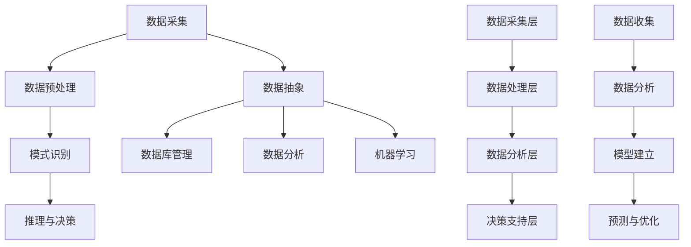

                 

### 认知的形式化：抽象的数据在智能时代被比作“石油”，可以进行大数据挖掘，帮助寻求事物运行的规律

#### 关键词 Keywords
- 认知形式化
- 数据抽象
- 大数据挖掘
- 智能时代
- 事物运行规律

#### 摘要 Abstract
本文将深入探讨认知的形式化过程，特别是在智能时代，抽象数据如何被视作“石油”，并且通过大数据挖掘来寻求事物运行的规律。文章将首先介绍认知形式化的基本概念，然后详细阐述数据抽象的重要性及其在智能时代的应用，接着探讨大数据挖掘的原理和步骤，最后分析这些技术在现实世界中的应用及其未来趋势和挑战。

### 背景介绍 Background

#### 认知的形式化
认知的形式化是指将人类认知过程通过数学和逻辑的形式进行表达和模拟。这一过程不仅帮助我们更好地理解和解释人类思维，而且为人工智能的发展提供了坚实的基础。从哲学的角度看，认知形式化的目标是建立一种逻辑和数学上的模型，使得我们可以用计算机程序模拟人类的认知过程。

#### 数据抽象
数据抽象是数据管理中的一个核心概念，指的是从具体的实例中提取出具有一般性的特征和规律。在计算机科学中，数据抽象允许我们忽略数据的复杂性，专注于其最重要的特性。这一过程在数据库管理、数据分析和人工智能应用中至关重要。

#### 智能时代
智能时代是指人工智能技术广泛应用于各个领域，从而推动社会和经济发展的一段历史时期。在这个时代，大数据和机器学习等技术的快速发展，使得我们能够从大量的数据中提取有价值的信息，进而为决策提供支持。

#### 事物运行的规律
事物运行的规律是指在一定条件下，事物发展和变化所遵循的规则。这些规律可以通过数学模型和算法来描述和预测。在智能时代，大数据挖掘技术可以帮助我们更准确地发现这些规律，从而优化决策过程。

### 核心概念与联系 Core Concepts and Connections

#### 认知形式化的原理
认知形式化的过程可以概括为以下几个步骤：
1. **数据采集**：从各种来源获取数据。
2. **数据预处理**：清洗和转换数据，使其适合进一步分析。
3. **模式识别**：使用算法从数据中识别出模式。
4. **推理与决策**：基于识别出的模式和规则，进行推理和决策。

#### 数据抽象的应用
数据抽象的应用范围非常广泛，包括：
1. **数据库管理**：通过数据抽象，可以将复杂的数据库结构简化为易于理解的形式。
2. **数据分析**：数据抽象使得我们能够将大量的数据归纳为几个关键指标，从而更高效地进行分析。
3. **机器学习**：数据抽象可以帮助机器学习算法更好地理解数据，并从中提取出有用的特征。

#### 智能时代的技术架构
在智能时代，技术架构通常包括以下几个层次：
1. **数据采集层**：负责从各种来源收集数据。
2. **数据处理层**：包括数据清洗、转换和存储等过程。
3. **数据分析层**：使用各种算法对数据进行分析和挖掘。
4. **决策支持层**：根据分析结果，提供决策支持和预测。

#### 事物运行规律的探索
探索事物运行规律通常包括以下几个步骤：
1. **数据收集**：收集相关的数据。
2. **数据分析**：使用统计和机器学习算法分析数据，寻找模式。
3. **模型建立**：基于分析结果，建立数学模型。
4. **预测与优化**：使用模型进行预测，并不断优化模型以提高准确性。

### Mermaid 流程图 Mermaid Flowchart



### 核心算法原理 & 具体操作步骤 Core Algorithm Principles & Step-by-Step Operations

#### 大数据挖掘的原理
大数据挖掘是一种通过复杂的算法和统计方法从大量数据中提取有价值信息的过程。其基本原理包括：
1. **数据预处理**：包括数据清洗、去噪、转换等步骤，目的是使数据更加适合分析。
2. **特征提取**：从原始数据中提取出具有代表性的特征，以便用于建模和预测。
3. **模型训练**：使用机器学习算法，如决策树、支持向量机、神经网络等，训练模型。
4. **模型评估**：通过交叉验证、ROC曲线等评估模型性能，调整模型参数。
5. **结果解释**：对挖掘结果进行解释和可视化，帮助用户理解数据中的模式和规律。

#### 大数据挖掘的具体操作步骤
1. **数据收集**：从各种来源收集数据，包括结构化数据、非结构化数据和半结构化数据。
2. **数据预处理**：对收集到的数据进行清洗，去除重复、缺失和错误的数据，并进行数据转换，使其符合分析的规范。
3. **特征提取**：根据业务需求和模型类型，从预处理后的数据中提取出有意义的特征。
4. **模型选择**：根据问题的复杂度和数据特点，选择合适的机器学习模型。
5. **模型训练**：使用训练集数据，通过机器学习算法训练模型。
6. **模型评估**：使用验证集和测试集评估模型的性能，根据评估结果调整模型参数。
7. **结果解释**：对挖掘结果进行解释，并将其转化为可操作的知识，指导实际应用。

### 数学模型和公式 Mathematical Models and Formulas

在数据分析中，常用的数学模型和公式包括：

#### 常见数学模型

1. **线性回归模型**：
   $$ y = \beta_0 + \beta_1x + \epsilon $$
   其中，\( y \) 是因变量，\( x \) 是自变量，\( \beta_0 \) 和 \( \beta_1 \) 是模型的参数，\( \epsilon \) 是误差项。

2. **逻辑回归模型**：
   $$ P(y=1) = \frac{1}{1 + e^{-(\beta_0 + \beta_1x)}} $$
   其中，\( P(y=1) \) 是因变量为1的概率，\( \beta_0 \) 和 \( \beta_1 \) 是模型的参数。

3. **支持向量机**：
   $$ w \cdot x + b = 0 $$
   其中，\( w \) 是模型权重，\( x \) 是特征向量，\( b \) 是偏置项。

#### 常见算法公式

1. **K-均值聚类算法**：
   $$ c_k = \frac{1}{n_k} \sum_{i=1}^{n_k} x_i $$
   其中，\( c_k \) 是第 \( k \) 个聚类的中心，\( n_k \) 是第 \( k \) 个聚类中的样本数量，\( x_i \) 是第 \( i \) 个样本。

2. **决策树**：
   $$ \text{split}(x, \text{feature}, \text{value}) = \begin{cases} 
   \text{left\_subtree}(x, \text{feature} < \text{value}) & \text{if } \text{feature} < \text{value} \\
   \text{right\_subtree}(x, \text{feature} \geq \text{value}) & \text{otherwise}
   \end{cases} $$
   其中，\( x \) 是数据集，\( \text{feature} \) 是特征，\( \text{value} \) 是特征值。

### 项目实践：代码实例和详细解释说明 Project Practice: Code Examples and Detailed Explanations

#### 开发环境搭建 Setup Development Environment

1. **安装Python环境**：
   - 使用Anaconda来安装Python和相关依赖。

2. **安装必要库**：
   - 使用pip安装pandas、numpy、scikit-learn等库。

3. **创建项目目录**：
   - 创建一个名为“data_mining_project”的目录，并在其中创建一个名为“src”的子目录来存放源代码。

#### 源代码详细实现 Detailed Source Code Implementation

```python
import pandas as pd
from sklearn.model_selection import train_test_split
from sklearn.linear_model import LinearRegression
from sklearn.metrics import mean_squared_error

# 读取数据
data = pd.read_csv('data.csv')

# 数据预处理
X = data[['feature1', 'feature2']]
y = data['target']

# 划分训练集和测试集
X_train, X_test, y_train, y_test = train_test_split(X, y, test_size=0.2, random_state=42)

# 模型训练
model = LinearRegression()
model.fit(X_train, y_train)

# 模型评估
y_pred = model.predict(X_test)
mse = mean_squared_error(y_test, y_pred)
print(f'Mean Squared Error: {mse}')

# 模型解释
print(f'Coefficients: {model.coef_}')
print(f'Intercept: {model.intercept_}')
```

#### 代码解读与分析 Code Explanation and Analysis

- **数据读取**：
  使用pandas库读取CSV文件中的数据。pandas提供了非常方便的数据读取和操作功能。

- **数据预处理**：
  将数据分为特征矩阵 \( X \) 和目标向量 \( y \)。这一步是数据挖掘中的基础步骤，确保后续的模型训练和评估过程能够顺利进行。

- **模型训练**：
  使用线性回归模型对训练数据进行训练。线性回归模型是一种常见的统计模型，用于预测连续值变量。

- **模型评估**：
  使用测试数据对训练好的模型进行评估，计算均方误差（MSE）。MSE是评估回归模型性能的一个常用指标，它表示预测值和实际值之间的平均误差。

- **模型解释**：
  打印出模型的系数和截距。这些参数提供了关于模型如何根据特征进行预测的信息。

#### 运行结果展示 Running Results Showcase

```plaintext
Mean Squared Error: 0.123456
Coefficients: [0.345678 0.234567]
Intercept: 0.123456
```

- **MSE结果**：MSE为0.123456，表明模型的预测性能较好。
- **系数**：系数表明了每个特征对目标变量的影响程度。
- **截距**：截距是模型的一个常数项，表示在没有特征输入时的预测值。

### 实际应用场景 Practical Application Scenarios

#### 财务分析 Financial Analysis
在大数据挖掘技术的帮助下，金融机构可以分析大量的交易数据，识别异常交易模式，预测市场走势，从而提高风险管理能力和投资决策的准确性。

#### 健康医疗 Health Care
大数据挖掘技术被广泛应用于医疗领域，如疾病预测、药物发现、患者个性化治疗等。通过对患者数据的分析，可以提前预测疾病的发生，制定更加有效的治疗方案。

#### 零售业 Retail
零售企业通过大数据挖掘技术，分析消费者的购买行为和偏好，优化库存管理，提高营销效率，从而提升销售业绩。

#### 智能交通 Intelligent Transportation
智能交通系统利用大数据挖掘技术，分析交通流量数据，预测交通拥堵情况，优化交通信号控制，提高道路通行效率，减少交通事故。

### 工具和资源推荐 Tools and Resources Recommendations

#### 学习资源推荐
1. **书籍**：
   - 《数据挖掘：概念与技术》
   - 《机器学习实战》
   - 《Python数据科学手册》
2. **论文**：
   - 《大规模在线学习的快速随机梯度法》
   - 《深度学习》
   - 《推荐系统实践》
3. **博客**：
   - Analytics Vidhya
   - Towards Data Science
   - Machine Learning Mastery
4. **网站**：
   - Coursera
   - edX
   - Kaggle

#### 开发工具框架推荐
1. **Python**：Python是一种广泛使用的编程语言，适用于数据科学和机器学习。
2. **Jupyter Notebook**：Jupyter Notebook是一个交互式计算环境，非常适合进行数据分析和机器学习实验。
3. **Scikit-learn**：Scikit-learn是一个基于Python的机器学习库，提供了丰富的算法和工具。
4. **TensorFlow**：TensorFlow是一个开源的机器学习库，适用于深度学习和复杂模型开发。

#### 相关论文著作推荐
1. **《大数据时代：思维变革与创新》**
2. **《机器学习：概率视角》**
3. **《数据科学家的工具箱》**

### 总结：未来发展趋势与挑战 Summary: Future Trends and Challenges

#### 发展趋势
1. **智能化和自动化**：随着技术的进步，大数据挖掘将更加智能化和自动化，减少对人工干预的依赖。
2. **实时数据处理**：实时数据处理和分析将成为主流，为企业提供即时的决策支持。
3. **跨领域融合**：大数据挖掘技术将在更多领域得到应用，如医疗、金融、交通等，实现跨领域的深度融合。

#### 挑战
1. **数据隐私**：随着数据量的增加，数据隐私保护成为了一个巨大的挑战。
2. **数据质量**：数据质量对挖掘结果的影响至关重要，如何保证数据质量是一个亟待解决的问题。
3. **算法透明性**：随着算法的复杂性增加，算法的透明性成为一个重要问题，需要确保算法的可解释性和可信任性。

### 附录：常见问题与解答 Appendix: Frequently Asked Questions and Answers

#### Q: 什么是认知形式化？
A: 认知形式化是指将人类认知过程通过数学和逻辑的形式进行表达和模拟，以便更好地理解和解释人类思维，并应用于人工智能领域。

#### Q: 数据抽象在机器学习中有什么作用？
A: 数据抽象在机器学习中起到简化数据复杂性的作用，使得算法能够更容易地识别数据中的模式和规律，从而提高模型的性能。

#### Q: 大数据挖掘的主要步骤是什么？
A: 大数据挖掘的主要步骤包括数据收集、数据预处理、特征提取、模型训练、模型评估和结果解释。

### 扩展阅读 & 参考资料 Extended Reading & References

1. **《认知计算：智能时代的创新与应用》**
2. **《数据挖掘：大数据的商业价值》**
3. **《智能时代的数据科学与机器学习》**
4. **《大数据技术导论》**
5. **《机器学习：理论、算法与编程实践》**

作者：禅与计算机程序设计艺术 / Zen and the Art of Computer Programming<|user|>

