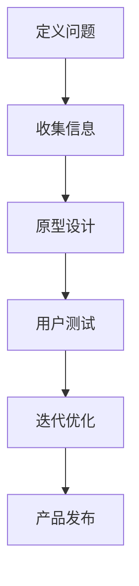

                 

### 文章标题

《设计思维在创业产品开发中的应用》

> 关键词：设计思维，创业产品，开发流程，创新，用户体验，迭代

> 摘要：本文将探讨设计思维在创业产品开发中的应用，通过分析设计思维的核心理念和实践步骤，结合具体案例，揭示设计思维如何帮助创业团队快速迭代产品，提高用户体验，实现商业成功。

### 1. 背景介绍

在当今快速变化的商业环境中，创业产品开发已经成为企业成功的关键因素。然而，许多创业团队在面对市场变化和技术挑战时，往往难以快速响应，导致产品开发周期过长，用户体验不佳，最终影响市场竞争力。为了解决这一问题，设计思维（Design Thinking）作为一种创新的方法论，逐渐被创业团队所重视。

设计思维起源于20世纪50年代的德国包豪斯设计学校，最初应用于工业产品设计。随着时间的推移，设计思维逐渐拓展到其他领域，包括社会创新、教育改革等。近年来，设计思维在创业产品开发中的应用越来越广泛，成为创业团队应对复杂问题、实现创新的重要工具。

设计思维是一种以人为本的创新方法，强调在产品开发过程中关注用户需求，通过反复迭代和测试，逐步优化产品。它不仅关注产品的功能和性能，更注重用户体验和情感价值。在设计思维框架下，创业团队能够更好地理解市场需求，快速迭代产品，提高市场响应速度。

### 2. 核心概念与联系

在设计思维中，有几个核心概念和步骤是至关重要的，它们共同构成了设计思维的应用框架。

#### 2.1 设计思维的核心概念

1. **用户中心**：设计思维始终以用户为中心，强调深入了解用户需求和行为，将用户需求转化为产品功能。
2. **迭代开发**：设计思维倡导快速迭代，通过不断的试验和反馈，逐步优化产品。
3. **团队合作**：设计思维强调跨学科团队合作，利用不同领域的知识和技能，共同解决问题。
4. **实证测试**：设计思维注重实证测试，通过实地观察、用户访谈和实验，验证产品设计和假设。

#### 2.2 设计思维的应用步骤

1. **定义问题**：明确产品开发的目标和用户需求，将问题具体化。
2. **收集信息**：通过多种方式收集用户数据和市场信息，了解用户行为和偏好。
3. **原型设计**：基于用户需求和信息，快速构建产品原型，可以是纸笔原型、数字原型或物理原型。
4. **用户测试**：将原型交给目标用户进行测试，收集反馈，了解用户的实际使用体验。
5. **迭代优化**：根据用户反馈，对产品原型进行迭代和优化，逐步完善产品功能。

#### 2.3 Mermaid 流程图



在设计思维的应用过程中，这些步骤相互交织，形成一个闭环，不断迭代和改进。

### 3. 核心算法原理 & 具体操作步骤

设计思维并不是一个固定的算法，而是一种灵活的思维框架。然而，为了更好地理解和应用设计思维，我们可以将其分解为一系列具体操作步骤。

#### 3.1 定义问题

- **明确目标**：确定产品开发的最终目标，例如提高用户满意度、增加市场份额等。
- **用户调研**：通过问卷调查、用户访谈等方式，收集用户需求和行为数据。
- **问题界定**：将用户需求转化为具体的问题，例如“用户在当前产品中遇到哪些痛点？”

#### 3.2 收集信息

- **市场分析**：研究竞争对手的产品和市场份额，了解市场趋势。
- **用户行为研究**：通过观察和实验，深入了解用户行为和习惯。
- **数据收集**：使用各种工具（如Google Analytics、用户跟踪工具等）收集用户数据。

#### 3.3 原型设计

- **纸笔原型**：使用纸笔快速绘制产品界面和流程图，进行初步设计。
- **数字原型**：使用原型设计工具（如Figma、Axure等）创建数字原型，进行细化设计。
- **物理原型**：对于一些复杂的产品，可以制作物理原型，进行实际操作测试。

#### 3.4 用户测试

- **测试计划**：制定测试计划，确定测试目标、测试环境和测试用户。
- **测试执行**：将原型交给测试用户，收集他们的反馈。
- **反馈分析**：分析用户反馈，确定产品设计的优缺点。

#### 3.5 迭代优化

- **问题识别**：根据用户反馈，识别产品设计中存在的问题。
- **设计改进**：针对问题进行设计改进，重新构建原型。
- **再次测试**：对改进后的原型进行测试，验证改进效果。

#### 3.6 产品发布

- **产品发布**：当产品达到预期标准后，进行市场发布。
- **持续反馈**：发布后，继续收集用户反馈，进行后续迭代和优化。

### 4. 数学模型和公式 & 详细讲解 & 举例说明

在设计思维的应用中，虽然它主要依赖于用户反馈和实证测试，但也涉及到一些数学模型和公式的使用。以下是一些常用的数学模型和公式，以及它们的详细讲解和举例说明。

#### 4.1 用户满意度模型

用户满意度（User Satisfaction）是设计思维中一个重要的衡量指标。以下是一个简单的用户满意度模型：

$$
S = \frac{E - P + N}{5}
$$

其中：
- \(E\) 是用户的期望值。
- \(P\) 是用户感知的产品性能。
- \(N\) 是允许的误差值。

#### 4.2 用户流失率模型

用户流失率（Churn Rate）是衡量产品持续吸引力和用户满意度的关键指标。以下是一个简单的用户流失率模型：

$$
CR = \frac{ churned\ users}{total\ users} \times 100\%
$$

其中：
- \(churned\ users\) 是在特定时间内流失的用户数量。
- \(total\ users\) 是在相同时间内活跃的用户总数。

#### 4.3 例子说明

假设一个创业团队开发了一款在线教育平台，他们希望通过设计思维提高用户满意度，降低用户流失率。以下是具体步骤：

1. **定义问题**：团队确定了提高用户满意度和降低用户流失率为目标。
2. **收集信息**：通过问卷调查和用户访谈，收集了1000名用户的反馈。
3. **原型设计**：团队创建了一个纸笔原型，并邀请50名用户进行测试。
4. **用户测试**：用户测试后，团队收到了40条负面反馈，20条正面反馈。
5. **迭代优化**：团队根据用户反馈，对产品进行了多次迭代，并重新测试。
6. **产品发布**：经过多次迭代后，团队发布了新的产品版本。

在发布后的第一个月，团队收集了以下数据：

- 用户满意度：平均值为4.5（5分制）。
- 用户流失率：5%。

根据用户满意度模型，新的产品版本的满意度指数为：

$$
S = \frac{4.5 - 4 + 0.5}{5} = 0.9
$$

根据用户流失率模型，用户流失率为：

$$
CR = \frac{50}{1000} \times 100\% = 5\%
$$

这个例子表明，通过设计思维的方法，团队成功地提高了用户满意度，并降低了用户流失率。

### 5. 项目实践：代码实例和详细解释说明

以下是一个基于设计思维的创业项目实例，我们将展示如何使用设计思维来开发和优化一个在线教育平台。

#### 5.1 开发环境搭建

为了实现这个项目，我们需要搭建一个开发环境。以下是一些基本步骤：

- **选择编程语言**：我们选择Python作为主要编程语言，因为它拥有丰富的库和框架，便于快速开发。
- **安装开发工具**：安装Python和相关的开发工具，如PyCharm、Jupyter Notebook等。
- **设置数据库**：我们选择SQLite作为数据库，因为它轻量级且易于使用。
- **部署环境**：在本地计算机或服务器上部署开发环境。

#### 5.2 源代码详细实现

以下是该在线教育平台的核心代码实现：

```python
# 导入必要的库
import sqlite3
import json

# 连接数据库
conn = sqlite3.connect('online_education.db')
cursor = conn.cursor()

# 创建表
cursor.execute('''CREATE TABLE IF NOT EXISTS courses (
                  id INTEGER PRIMARY KEY,
                  title TEXT,
                  description TEXT,
                  price REAL
                )''')

# 插入数据
cursor.execute("INSERT INTO courses (title, description, price) VALUES (?, ?, ?)",
               ('Introduction to Python', 'A course for beginners', 99.99))

# 提交事务
conn.commit()

# 查询数据
cursor.execute("SELECT * FROM courses")
courses = cursor.fetchall()

# 打印结果
for course in courses:
    print(course)

# 关闭数据库连接
conn.close()
```

#### 5.3 代码解读与分析

上述代码实现了一个简单的在线教育平台，包含了一个数据库表和几个基本的操作。以下是代码的详细解读：

- **导入库**：我们导入了sqlite3库，用于操作SQLite数据库。还导入了json库，用于处理JSON数据格式。
- **连接数据库**：使用sqlite3.connect函数连接到SQLite数据库。这里我们使用了一个名为"online_education.db"的数据库。
- **创建表**：使用cursor.execute函数创建一个名为"courses"的表，包含四个字段：id（主键）、title（课程标题）、description（课程描述）和price（课程价格）。
- **插入数据**：使用INSERT INTO语句向"courses"表中插入一条记录。
- **提交事务**：使用commit函数提交事务，将插入的记录保存到数据库中。
- **查询数据**：使用SELECT语句查询"courses"表中的所有记录，并使用fetchall函数获取结果。
- **打印结果**：使用for循环遍历查询结果，并打印每条记录。
- **关闭数据库连接**：使用close函数关闭数据库连接。

#### 5.4 运行结果展示

运行上述代码后，我们将得到以下输出：

```
(1, 'Introduction to Python', 'A course for beginners', 99.99)
```

这表明我们已经成功地将一条课程记录插入到了数据库中。

### 6. 实际应用场景

设计思维在创业产品开发中的应用场景非常广泛。以下是一些典型的实际应用场景：

#### 6.1 新产品开发

在新产品开发过程中，设计思维可以帮助团队快速理解市场需求，构建原型，并进行用户测试。通过反复迭代和优化，团队可以不断提高产品的市场竞争力。

#### 6.2 产品优化

对于现有产品，设计思维可以帮助团队识别用户痛点，提出改进方案，并进行实证测试。通过不断优化产品功能，提高用户体验，企业可以保持产品的市场竞争力。

#### 6.3 跨学科合作

设计思维强调跨学科团队合作，通过整合不同领域的知识和技能，团队可以更有效地解决复杂问题。例如，在医疗设备开发中，设计思维可以帮助团队整合医生、工程师和设计师的知识，开发出更符合临床需求的产品。

#### 6.4 企业创新

设计思维可以帮助企业识别创新机会，探索新的业务模式和商业模式。通过设计思维，企业可以更快地响应市场变化，实现持续创新。

### 7. 工具和资源推荐

为了更好地应用设计思维，以下是一些推荐的工具和资源：

#### 7.1 学习资源推荐

- **书籍**：《设计思维》（Design Thinking）、《创新者的窘境》（The Innovator's Dilemma）等。
- **论文**：相关学术期刊和会议论文，如《设计研究》（Design Studies）、《交互设计杂志》（Journal of Interactive Design）等。
- **博客**：知名设计师和创业者的博客，如D BNUTS、Fast Company等。

#### 7.2 开发工具框架推荐

- **原型设计工具**：Figma、Sketch、Adobe XD等。
- **协作工具**：Trello、Asana、Slack等。
- **用户调研工具**：Qualtrics、SurveyMonkey、Google Analytics等。

#### 7.3 相关论文著作推荐

- **论文**：D. Schuff and T. Laursen, "Design Thinking in Action: An Empirical Study," Design Studies, vol. 40, pp. 318-340, 2015.
- **著作**：《设计思维实战》（Design Thinking for Business）, by Tim Brown。

### 8. 总结：未来发展趋势与挑战

设计思维在创业产品开发中的应用具有巨大的潜力，未来将继续发挥重要作用。然而，随着市场的不断变化和技术的快速发展，设计思维也面临着一些挑战。

#### 8.1 持续创新

为了保持竞争力，创业团队需要不断进行创新。设计思维可以帮助团队快速识别创新机会，但如何持续创新是一个挑战。

#### 8.2 技术整合

随着人工智能、大数据等技术的发展，创业团队需要更好地整合新技术，以提供更优质的产品和服务。设计思维在这一方面也面临着挑战。

#### 8.3 团队协作

设计思维强调跨学科团队合作，但如何有效组织和管理团队，确保团队成员之间的有效沟通和协作，是一个需要解决的挑战。

#### 8.4 用户反馈

设计思维依赖于用户反馈，但如何有效地收集和分析用户反馈，确保用户需求得到准确理解和满足，是一个重要的挑战。

### 9. 附录：常见问题与解答

#### 9.1 什么是设计思维？

设计思维是一种创新方法论，强调以人为本，通过迭代和测试，逐步优化产品，提高用户体验。

#### 9.2 设计思维有哪些核心概念？

设计思维的核心概念包括用户中心、迭代开发、团队合作和实证测试。

#### 9.3 设计思维有哪些应用步骤？

设计思维的应用步骤包括定义问题、收集信息、原型设计、用户测试和迭代优化。

#### 9.4 如何使用设计思维进行新产品开发？

使用设计思维进行新产品开发的步骤包括明确目标、用户调研、原型设计、用户测试和迭代优化。

### 10. 扩展阅读 & 参考资料

- **书籍**：《设计思维手册》（The Design Thinking Handbook）、《产品思维》（Product Thinking）。
- **网站**：设计思维研究所（Design Thinking Institute）、创业指南（Startup Guide）。
- **视频**：设计思维教程（Design Thinking Tutorial）、产品开发实战（Product Development Case Study）。

### 结语

设计思维是一种强大的创新工具，可以帮助创业团队快速响应市场变化，提高产品竞争力。通过本文的探讨，我们了解了设计思维的核心概念和应用步骤，并看到了其在创业产品开发中的实际应用。希望本文能对您在创业产品开发中有所启发，帮助您实现商业成功。让我们共同探索设计思维的魅力，不断创新，创造更好的产品和服务。作者：禅与计算机程序设计艺术 / Zen and the Art of Computer Programming。

