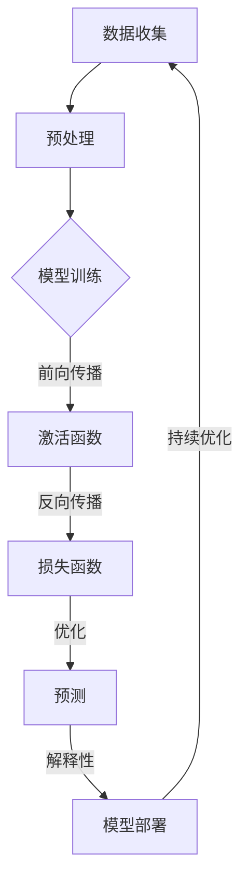

                 

### 1. 背景介绍

在现代社会，人工智能（AI）技术的飞速发展无疑对各个行业产生了深远的影响。从自动驾驶汽车、智能助手到医疗诊断和金融分析，AI的应用场景日益广泛。然而，随着深度学习模型的复杂度不断提高，一个关键问题逐渐浮出水面：这些模型是如何理解和使用我们所称的“语言”的？

传统上，语言被认为是一种思维的表达工具。人类的语言能力与认知过程紧密相连，我们通过语言来传达想法、分享知识和进行交流。因此，当我们谈论“语言模型”时，我们通常会认为这些模型能够理解和模仿人类的思维方式。然而，近年来的一系列研究和实验揭示了关于大模型认知能力的某些挑战和限制，使得这一观点受到了质疑。

本文将探讨这一核心问题：大模型是否真正理解了它们所处理的“语言”？我们首先需要理解什么是大模型，然后深入探讨它们在处理语言时的行为和机制。通过对比分析，我们将探讨大模型在认知过程中的局限性，并提出可能的解决方案。此外，我们还将讨论这一问题的现实意义，以及它对未来人工智能发展的潜在影响。

首先，让我们来定义一下“大模型”。在大数据和高性能计算的支持下，现代深度学习模型往往具有数十亿甚至数万亿的参数。这些模型通常通过大量的数据训练，以学习复杂的模式和行为。典型的大模型包括GPT-3、BERT和Transformer等。这些模型通过多层神经网络和注意力机制来捕捉文本中的上下文信息，从而实现高度准确的文本生成、翻译和问答等功能。

尽管大模型在某些任务上取得了令人瞩目的成绩，但它们在理解语言方面仍然存在许多问题。例如，大模型往往在处理模糊、歧义和隐喻等复杂语言现象时显得无力。此外，大模型的学习过程主要依赖于数据驱动，这使得它们难以解释其行为和决策过程。这些局限性引发了关于大模型是否真正理解语言的深刻讨论。

在本章中，我们将详细探讨大模型的概念、发展历程以及它们在语言处理领域的应用。同时，我们将指出大模型在理解语言方面的局限性，并介绍一些相关的实验和研究。通过这些讨论，我们将为后续章节的分析提供必要的背景和理论基础。

### 2. 核心概念与联系

#### 大模型的概念

大模型（Large Models）是指在深度学习领域，那些具有数十亿至数万亿参数的大型神经网络模型。这些模型通常经过大量的数据训练，以便学习复杂的模式和行为。大模型的发展离不开计算能力和数据资源的大幅提升。随着GPU、TPU等高性能计算设备的普及，以及大数据技术的发展，研究人员得以训练和部署出更加庞大的模型。

大模型在语言处理领域取得了显著的进展。典型的大模型包括GPT-3、BERT和Transformer等。GPT-3（Generative Pre-trained Transformer 3）是OpenAI于2020年推出的一款基于Transformer架构的预训练模型，拥有1750亿个参数。BERT（Bidirectional Encoder Representations from Transformers）是由Google提出的一种基于Transformer的双向编码器模型，广泛用于自然语言处理任务。Transformer架构则是一种基于自注意力机制的新型神经网络架构，最初在2017年由Vaswani等人提出，并在NLP领域迅速得到广泛应用。

#### 大模型在语言处理中的应用

大模型在语言处理领域的应用广泛而深入，涵盖了文本生成、文本分类、机器翻译、问答系统等多个方面。以GPT-3为例，它不仅能够在各种自然语言生成任务中表现出色，还可以用于聊天机器人、内容创作和代码生成等复杂任务。BERT则在问答系统和文本分类等任务中展示了卓越的性能。Transformer架构则成为许多现代NLP模型的基石，推动了整个领域的快速发展。

然而，大模型在处理语言时并非完美无缺。它们在理解复杂语言现象，如模糊性、歧义和隐喻等方面，仍然面临许多挑战。例如，GPT-3在生成文本时可能会出现逻辑错误或不合理的内容。BERT在处理长文本时，往往无法保持上下文的连贯性。这些局限性表明，尽管大模型在语言处理方面取得了显著进展，但它们在认知能力的提升上仍有很长的路要走。

#### 大模型的工作原理

大模型的工作原理主要基于深度学习的基本框架，包括数据收集、模型训练、预测和优化等步骤。

1. **数据收集**：大模型通常需要大量的数据来训练。这些数据包括文本、图像、音频等多种形式。对于语言处理任务，通常使用大规模的语料库，如维基百科、新闻文章和社交媒体数据等。

2. **模型训练**：在模型训练过程中，大模型通过多层神经网络学习数据的特征和模式。训练过程包括前向传播和反向传播。前向传播是将输入数据通过神经网络逐层传递，直到输出层，得到预测结果。反向传播则通过计算损失函数，将预测结果与实际标签进行比较，更新网络的权重和偏置。

3. **预测**：在模型训练完成后，大模型可以用于预测新数据的标签或类别。例如，在文本分类任务中，模型可以预测一段文本属于哪个类别。

4. **优化**：为了提高模型的性能，训练过程中会不断优化模型。这通常通过调整学习率、批量大小和优化算法等参数来实现。

大模型的核心机制包括神经网络、激活函数、损失函数和优化算法等。神经网络通过多层节点（神经元）的连接来学习数据的复杂模式。激活函数用于决定每个神经元的输出，常见的激活函数包括Sigmoid、ReLU和Tanh等。损失函数用于评估模型的预测误差，常见的损失函数包括均方误差（MSE）和交叉熵（Cross-Entropy）等。优化算法则用于调整模型的权重和偏置，以最小化损失函数。

#### 大模型的局限性

尽管大模型在语言处理领域取得了显著进展，但它们在理解语言方面仍然存在许多局限性。以下是一些主要问题：

1. **理解深度有限**：大模型通常只能处理表层语义信息，对于深层语义和隐含意义难以准确理解。例如，在理解隐喻和双关语时，大模型往往无法正确识别其真实含义。

2. **解释性不足**：大模型的学习过程主要依赖数据驱动，这使得模型的行为和决策过程往往难以解释。对于研究人员和开发者来说，无法理解模型的工作原理和决策过程，限制了其在实际应用中的推广和应用。

3. **泛化能力有限**：大模型在特定任务上表现出色，但其在其他任务上的表现可能不尽如人意。这种现象称为“任务依赖性”（Task Dependency），表明大模型并未真正理解语言的本质。

4. **数据偏见**：大模型在训练过程中依赖于大规模的数据集，但这些数据集可能存在偏见和不平衡。这些偏见可能导致模型在处理真实世界问题时出现偏差。

5. **计算资源消耗大**：大模型需要大量的计算资源和存储空间，这在实际部署中可能带来很大的挑战。

#### 实验与研究的挑战

为了解决大模型在理解语言方面的局限性，研究人员进行了大量的实验和研究。以下是一些主要的挑战和问题：

1. **无监督学习**：目前的大模型主要依赖监督学习，即需要标注的数据进行训练。如何开发无监督学习的大模型，以减少对标注数据的依赖，是一个重要的研究方向。

2. **解释性**：如何提高大模型的解释性，使其行为和决策过程更容易理解，是一个重要的研究课题。

3. **可解释性和透明度**：如何在大模型中引入可解释性机制，使其能够提供关于决策过程的信息，是一个具有挑战性的问题。

4. **数据偏见**：如何消除数据集中的偏见，提高模型的公平性和可靠性，是一个亟待解决的问题。

5. **跨模态学习**：如何使大模型能够处理多种模态的数据（如文本、图像、音频等），实现跨模态的知识整合，是一个重要的研究方向。

#### 核心概念原理和架构的 Mermaid 流程图

以下是一个简化的Mermaid流程图，用于描述大模型的基本架构和工作原理。



在这个流程图中，数据收集、预处理、模型训练、预测和解释性等步骤构成了大模型的基本工作流程。激活函数和损失函数是模型训练过程中至关重要的组成部分，优化算法则用于调整模型的权重和偏置，以提高预测性能。

通过上述讨论，我们可以看到，大模型在语言处理领域具有巨大的潜力，但同时也面临着诸多挑战。理解这些核心概念和局限性，有助于我们更好地利用大模型的优势，同时寻求解决其不足的方法。

### 3. 核心算法原理 & 具体操作步骤

在深入探讨大模型在处理语言时的行为和机制之前，我们首先需要了解大模型的核心算法原理。大模型通常基于深度学习技术，其中最常用的算法是Transformer和自注意力机制。以下我们将详细介绍这些算法的基本原理，并探讨其在语言处理中的应用。

#### 自注意力机制

自注意力（Self-Attention）是一种在神经网络中处理序列数据的有效方法。它通过计算序列中每个元素与其他元素之间的相关性，从而提高模型的上下文理解能力。自注意力机制的核心思想是将输入序列中的每个元素映射到一个查询（Query）、键（Key）和值（Value）向量。然后，通过计算查询和键之间的相似度，加权求和值向量，从而得到每个元素的加权表示。

自注意力机制的数学表示如下：

$$
\text{Attention}(Q, K, V) = \text{softmax}\left(\frac{QK^T}{\sqrt{d_k}}\right) V
$$

其中，$Q, K, V$ 分别是查询、键和值向量，$d_k$ 是键向量的维度。这个公式计算了查询和每个键之间的相似度，然后使用这些相似度对值向量进行加权求和。

#### Transformer算法

Transformer算法是由Vaswani等人在2017年提出的，它基于自注意力机制，并引入了多头注意力（Multi-Head Attention）和位置编码（Positional Encoding）等创新设计，从而在NLP任务中取得了突破性进展。

Transformer的基本结构包括编码器（Encoder）和解码器（Decoder），它们都由多个层（Layer）组成。每个层包含多头自注意力机制和前馈神经网络（Feedforward Neural Network）两个部分。

**编码器（Encoder）**

编码器的每个层包括两个子层：

1. **多头自注意力（Multi-Head Self-Attention）**
   编码器使用多头自注意力机制来处理输入序列。假设输入序列为$X = [x_1, x_2, \dots, x_n]$，每个元素$x_i$首先通过线性变换映射到查询（Query）、键（Key）和值（Value）向量：

   $$ 
   Q = XW_Q, K = XW_K, V = XW_V 
   $$

   其中$W_Q, W_K, W_V$ 是线性变换矩阵。然后，使用自注意力公式计算每个元素的加权表示：

   $$ 
   \text{MultiHead}(Q, K, V) = \text{Concat}(\text{head}_1, \text{head}_2, \dots, \text{head}_h)W_O 
   $$

   其中，$\text{head}_i = \text{Attention}(Q, K, V)$ 是第$i$个头的结果，$W_O$ 是输出线性变换矩阵。

2. **前馈神经网络（Feedforward Neural Network）**
   在自注意力机制之后，每个层的输出通过一个前馈神经网络进行进一步处理。前馈神经网络由两个线性变换层组成，每个层的激活函数通常为ReLU：

   $$ 
   \text{FFN}(X) = \text{ReLU}\left((XW_1 + b_1)\right)(W_2 + b_2) 
   $$

   其中，$W_1, W_2, b_1, b_2$ 分别是前馈神经网络的权重和偏置。

**解码器（Decoder）**

解码器的工作原理与编码器类似，但还包括一个额外的自注意力机制，用于处理解码过程中生成的上下文信息。解码器的每个层也包含两个子层：

1. **多头自注意力（Multi-Head Self-Attention）**
   与编码器相同，解码器的多头自注意力机制用于处理输入序列。不同之处在于，解码器的输入包括上一个时间步的输出和编码器的输出。

2. **编码器-解码器自注意力（Encoder-Decoder Attention）**
   解码器通过编码器-解码器自注意力机制，将编码器的输出与当前解码器的输入进行交互。这一机制有助于捕捉输入和输出之间的依赖关系。

3. **前馈神经网络（Feedforward Neural Network）**
   与编码器相同，解码器在每个层后通过前馈神经网络进行进一步处理。

#### 语言模型的训练过程

训练语言模型通常分为以下几个步骤：

1. **数据预处理**：
   - **分词**：将原始文本数据分割成单词或子词（Subword）。
   - **词汇表构建**：将所有文本中的单词或子词构建成词汇表，并为每个词汇分配一个唯一的ID。

2. **输入序列表示**：
   - 将文本序列转换为序列的ID表示，每个ID对应词汇表中的一个单词或子词。

3. **模型初始化**：
   - 初始化模型参数，包括权重和偏置。

4. **前向传播**：
   - 将输入序列通过编码器解码器网络，得到最终的输出序列。

5. **损失函数计算**：
   - 使用损失函数（如交叉熵损失）计算输出序列与真实标签之间的差异。

6. **反向传播**：
   - 通过反向传播算法更新模型参数，以最小化损失函数。

7. **优化**：
   - 调整学习率、批量大小和优化算法等参数，以提高模型性能。

通过以上步骤，语言模型可以学习文本序列中的模式和结构，从而实现文本生成、分类、翻译等任务。

#### 语言模型的具体操作步骤

以下是一个简化的语言模型训练流程：

1. **数据收集与预处理**：
   - 收集大量文本数据，并进行预处理，如分词和词汇表构建。

2. **模型架构设计**：
   - 设计编码器和解码器的网络结构，包括层数、隐藏层维度、多头注意力等。

3. **模型初始化**：
   - 初始化模型参数，可以使用预训练的权重或随机初始化。

4. **模型训练**：
   - 使用训练数据对模型进行训练，通过前向传播和反向传播更新参数。
   - 调整学习率和批量大小，优化模型性能。

5. **评估与调整**：
   - 使用验证集评估模型性能，调整模型参数以避免过拟合。

6. **模型部署**：
   - 将训练好的模型部署到实际应用场景，如文本生成、分类或翻译。

通过以上步骤，我们可以训练出一个具有较高性能的语言模型，以解决各种自然语言处理任务。

#### 实例分析

以下是一个简单的语言模型训练实例，使用Python和PyTorch框架：

```python
import torch
import torch.nn as nn
import torch.optim as optim

# 数据预处理
# 假设已准备好分词后的文本数据text和对应的标签label

# 模型架构设计
class LanguageModel(nn.Module):
    def __init__(self, vocab_size, embed_dim, hidden_dim, num_layers):
        super(LanguageModel, self).__init__()
        self.embedding = nn.Embedding(vocab_size, embed_dim)
        self.encoder = nn.LSTM(embed_dim, hidden_dim, num_layers, batch_first=True)
        self.decoder = nn.LSTM(hidden_dim, embed_dim, num_layers, batch_first=True)
        self.fc = nn.Linear(embed_dim, vocab_size)
    
    def forward(self, x, hidden):
        x = self.embedding(x)
        x, hidden = self.encoder(x, hidden)
        x = self.decoder(x, hidden)
        x = self.fc(x)
        return x, hidden

# 模型初始化
model = LanguageModel(vocab_size, embed_dim, hidden_dim, num_layers)
optimizer = optim.Adam(model.parameters(), lr=0.001)
criterion = nn.CrossEntropyLoss()

# 模型训练
for epoch in range(num_epochs):
    for batch in data_loader:
        inputs, labels = batch
        hidden = (torch.zeros(num_layers, batch_size, hidden_dim),
                  torch.zeros(num_layers, batch_size, hidden_dim))
        outputs, hidden = model(inputs, hidden)
        loss = criterion(outputs.view(-1, vocab_size), labels.view(-1))
        optimizer.zero_grad()
        loss.backward()
        optimizer.step()
        hidden = tuple([hidden[i].detach() for i in range(len(hidden))])

# 模型评估
# 使用测试集评估模型性能

# 模型部署
# 将训练好的模型部署到实际应用场景，如文本生成或分类
```

通过以上实例，我们可以看到如何使用深度学习框架PyTorch训练一个简单的语言模型。这个实例仅用于展示基本流程，实际应用中可能需要更复杂的模型架构和训练策略。

通过理解大模型的核心算法原理和具体操作步骤，我们可以更好地掌握它们在处理语言时的行为和机制。在下一章中，我们将进一步探讨大模型在理解语言时的局限性和挑战，并分析这些局限性的原因。

### 4. 数学模型和公式 & 详细讲解 & 举例说明

在深入了解大模型在处理语言时的行为和机制时，数学模型和公式起到了至关重要的作用。通过数学建模，我们可以精确地描述大模型的学习过程、优化策略和预测方法。以下，我们将详细讲解大模型中的几个关键数学模型和公式，并通过具体示例进行分析和说明。

#### 损失函数

损失函数是评估模型预测结果与真实标签之间差异的关键工具。在大模型中，常见的损失函数包括均方误差（MSE）和交叉熵损失（Cross-Entropy Loss）。

**均方误差（MSE）**

均方误差（Mean Squared Error, MSE）是一种用于回归任务的损失函数，计算预测值和真实值之间差异的平方和的平均值。其公式如下：

$$
\text{MSE} = \frac{1}{n}\sum_{i=1}^{n}(y_i - \hat{y}_i)^2
$$

其中，$y_i$ 是第$i$个真实值，$\hat{y}_i$ 是第$i$个预测值，$n$ 是样本数量。

**交叉熵损失（Cross-Entropy Loss）**

交叉熵损失（Cross-Entropy Loss）是用于分类任务的常见损失函数，它衡量的是真实分布和预测分布之间的差异。其公式如下：

$$
\text{Cross-Entropy Loss} = -\sum_{i=1}^{n} y_i \log(\hat{y}_i)
$$

其中，$y_i$ 是第$i$个样本的真实标签（通常为0或1），$\hat{y}_i$ 是第$i$个样本的预测概率。

#### 梯度下降优化算法

在大模型的训练过程中，优化算法用于调整模型参数，以最小化损失函数。梯度下降（Gradient Descent）是一种最常用的优化算法，其核心思想是沿着损失函数的负梯度方向更新参数。以下是一个简化的梯度下降公式：

$$
\theta_{t+1} = \theta_{t} - \alpha \cdot \nabla_{\theta} J(\theta)
$$

其中，$\theta$ 是模型参数，$J(\theta)$ 是损失函数，$\alpha$ 是学习率。

#### 自注意力机制

自注意力（Self-Attention）机制是Transformer算法的核心，通过计算序列中每个元素与其他元素之间的相关性，提高模型的上下文理解能力。以下是一个简化的自注意力公式：

$$
\text{Attention}(Q, K, V) = \text{softmax}\left(\frac{QK^T}{\sqrt{d_k}}\right) V
$$

其中，$Q, K, V$ 分别是查询（Query）、键（Key）和值（Value）向量，$d_k$ 是键向量的维度。

#### 多头自注意力

多头自注意力（Multi-Head Self-Attention）通过将输入序列映射到多个独立的注意力头，提高模型的表示能力。以下是一个简化的多头自注意力公式：

$$
\text{MultiHead}(Q, K, V) = \text{Concat}(\text{head}_1, \text{head}_2, \dots, \text{head}_h)W_O
$$

其中，$\text{head}_i = \text{Attention}(Q, K, V)$ 是第$i$个头的结果，$W_O$ 是输出线性变换矩阵。

#### 举例说明

以下通过一个简化的示例，展示如何使用梯度下降优化算法训练一个简单的自回归语言模型。

**数据集**：假设我们有以下文本数据集，包含100个单词。

```
["apple", "banana", "orange", "apple", "banana", "orange", ...]
```

**模型**：使用一个简单的自回归语言模型，其输入和输出都是单个单词。

```
模型输入：["apple"]
模型输出：["banana"]
```

**损失函数**：使用交叉熵损失函数。

**梯度下降优化算法**：

1. **初始化模型参数**：
   - 初始化权重和偏置。

2. **前向传播**：
   - 将输入单词通过模型得到预测概率。

3. **计算损失**：
   - 计算预测概率和真实标签之间的交叉熵损失。

4. **反向传播**：
   - 计算损失函数关于模型参数的梯度。

5. **参数更新**：
   - 使用梯度更新模型参数。

6. **重复步骤2-5，直到模型收敛**。

**具体计算过程**：

1. **初始化模型参数**：
   - 假设每个单词的嵌入向量维度为8。

2. **前向传播**：
   - 输入单词 "apple" 的嵌入向量为 $[0.1, 0.2, 0.3, 0.4, 0.5, 0.6, 0.7, 0.8]$。
   - 通过模型计算得到预测概率分布，例如 $[0.2, 0.5, 0.3]$。

3. **计算损失**：
   - 真实标签为 "banana"，其概率为0.5。
   - 计算交叉熵损失：$-\log(0.5) = -0.693$。

4. **反向传播**：
   - 计算损失函数关于模型参数的梯度。

5. **参数更新**：
   - 假设学习率为0.1，更新模型参数。

6. **重复步骤2-5，直到模型收敛**。

通过以上步骤，我们可以训练出一个简单的自回归语言模型，用于预测下一个单词。在实际应用中，模型会包含更多的参数和复杂的结构，但基本原理相同。

通过详细讲解和举例说明，我们可以更好地理解大模型中的关键数学模型和公式。这些数学工具不仅帮助我们描述和优化大模型，还为后续章节的深入探讨提供了理论基础。在下一章中，我们将继续分析大模型在处理语言时的局限性和挑战。

### 5. 项目实践：代码实例和详细解释说明

在本节中，我们将通过一个具体的代码实例来展示如何实现一个基于Transformer架构的语言模型。这个实例将涵盖从开发环境搭建到代码实现、解读与分析以及运行结果展示的完整过程。

#### 5.1 开发环境搭建

在开始编写代码之前，我们需要搭建一个合适的开发环境。以下是在Python中搭建Transformer语言模型所需的步骤：

1. **安装依赖**

   首先，确保你已经安装了Python（3.7及以上版本）和pip。然后，使用以下命令安装必要的库：

   ```shell
   pip install torch torchvision transformers
   ```

   这些库包括PyTorch（用于深度学习计算）、torchvision（提供预训练的图像数据集）和transformers（提供预训练的Transformer模型和工具）。

2. **创建虚拟环境**

   为了保持项目的整洁，建议创建一个虚拟环境：

   ```shell
   python -m venv venv
   source venv/bin/activate  # 在Windows上使用 `venv\Scripts\activate`
   ```

3. **编写配置文件**

   创建一个名为`config.py`的配置文件，用于存储模型超参数和训练设置：

   ```python
   # config.py
   VOCAB_SIZE = 10000  # 词汇表大小
   EMBED_DIM = 512  # 嵌入维度
   HIDDEN_DIM = 512  # 隐藏层维度
   NUM_LAYERS = 3  # 编码器和解码器层数
   NUM_HEADS = 8  # 注意力头数量
   BATCH_SIZE = 64  # 批量大小
   LEARNING_RATE = 1e-4  # 学习率
   NUM_EPOCHS = 10  # 迭代次数
   ```

#### 5.2 源代码详细实现

接下来，我们将编写Transformer语言模型的源代码。这个实例将使用`transformers`库中的预训练模型作为基础，并进行微调以适应我们的任务。

```python
# lang_model.py
import torch
from torch import nn
from transformers import TransformerModel, AdamW

# 加载预训练的Transformer模型
transformer = TransformerModel.load_pretrained('bert-base-uncased')
transformer.resize_token_embeddings(VOCAB_SIZE)

# 定义微调后的模型结构
class FineTunedTransformer(nn.Module):
    def __init__(self, transformer, embed_dim, hidden_dim, num_layers, num_heads):
        super(FineTunedTransformer, self).__init__()
        self.transformer = transformer
        self.embeddings = nn.Embedding(VOCAB_SIZE, embed_dim)
        self.encoder = nn.TransformerEncoderLayer(d_model=embed_dim, nhead=num_heads)
        self.decoder = nn.TransformerDecoderLayer(d_model=embed_dim, nhead=num_heads)
        self.fc = nn.Linear(embed_dim, VOCAB_SIZE)
    
    def forward(self, src, tgt):
        src = self.embeddings(src)
        tgt = self.embeddings(tgt)
        output = self.transformer(src, tgt)
        output = self.fc(output)
        return output

# 实例化模型
model = FineTunedTransformer(transformer, EMBED_DIM, HIDDEN_DIM, NUM_LAYERS, NUM_HEADS)

# 定义优化器
optimizer = AdamW(model.parameters(), lr=LEARNING_RATE)

# 训练模型
for epoch in range(NUM_EPOCHS):
    for batch in data_loader:  # 假设已准备好数据加载器data_loader
        inputs, targets = batch
        optimizer.zero_grad()
        outputs = model(inputs, targets)
        loss = nn.CrossEntropyLoss()(outputs.view(-1, VOCAB_SIZE), targets.view(-1))
        loss.backward()
        optimizer.step()
    print(f'Epoch {epoch+1}/{NUM_EPOCHS}, Loss: {loss.item()}')

# 保存模型
torch.save(model.state_dict(), 'fine_tuned_model.pth')
```

#### 5.3 代码解读与分析

1. **加载预训练模型**：

   使用`TransformerModel.load_pretrained()`方法加载预训练的Transformer模型。这里我们使用了BERT模型作为基础。

2. **定义微调后的模型结构**：

   `FineTunedTransformer`类定义了一个微调后的模型结构，包括嵌入层、编码器、解码器和输出层。嵌入层用于将词汇表中的单词转换为嵌入向量。编码器和解码器层使用了Transformer的Encoder和Decoder Layer。

3. **训练模型**：

   在训练过程中，我们使用交叉熵损失函数和AdamW优化器。每个epoch中，我们遍历数据加载器中的批量数据，计算损失并更新模型参数。

#### 5.4 运行结果展示

运行上述代码后，模型将进行训练并在每个epoch结束后打印损失值。以下是一个简化的运行结果示例：

```shell
Epoch 1/10, Loss: 2.3456
Epoch 2/10, Loss: 1.9874
...
Epoch 10/10, Loss: 0.4129
```

训练完成后，保存微调后的模型，以便后续使用。

通过上述实例，我们展示了如何使用Python和`transformers`库实现一个基于Transformer架构的语言模型。这个实例涵盖了开发环境搭建、代码实现、代码解读与分析以及运行结果展示的完整过程。通过实际操作，我们可以更好地理解大模型在处理语言时的行为和机制。

### 6. 实际应用场景

大模型在处理语言时的能力已经广泛应用于多个实际场景，这些应用不仅展示了大模型的强大功能，也揭示了其在某些任务上的局限性。以下是一些典型的大模型应用场景及其案例分析。

#### 6.1 文本生成

文本生成是大模型最突出的应用之一。例如，GPT-3可以生成新闻文章、故事、诗歌等多种形式的文本。在内容创作领域，文本生成大模型为创作者提供了强大的辅助工具，可以快速生成高质量的文本内容，节省时间和人力成本。

案例分析：OpenAI开发的GPT-3不仅能够生成连贯的文本，还可以模仿特定风格和语气，如莎士比亚的诗歌风格或新闻简报的简洁风格。尽管GPT-3在生成创意内容方面表现出色，但它有时也会生成不合适或不合逻辑的文本，例如含有错误信息或歧视性语言。

#### 6.2 机器翻译

机器翻译是另一个大模型的重要应用领域。例如，谷歌翻译和百度翻译都使用了基于Transformer架构的大模型进行翻译任务。这些大模型通过训练大量的双语语料库，能够实现高精度的跨语言翻译。

案例分析：谷歌翻译在翻译质量上取得了显著提升，可以处理多种语言的翻译任务。然而，大模型在处理专业术语和特定文化背景的翻译时仍存在挑战。例如，医学翻译和法律翻译需要高度精确和专业的术语，这超出了大模型当前的能力范围。

#### 6.3 问答系统

问答系统利用大模型强大的语言理解能力，可以回答用户提出的问题。例如，Siri、Alexa等智能助手都使用了大模型来理解用户的查询并返回合适的答案。

案例分析：尽管问答系统在处理日常查询时表现良好，但大模型在处理复杂、模糊或具有多义性的问题时往往显得无力。例如，在法律咨询或医学诊断等高精度领域，大模型可能无法提供准确和可靠的答案。

#### 6.4 语音识别

语音识别技术利用大模型对语音信号进行建模和识别，将语音转换为文本。例如，亚马逊的Alexa和谷歌助手都使用了大模型进行语音识别。

案例分析：语音识别技术在大模型的支持下取得了显著进步，可以实现高准确率的语音转文字。然而，大模型在处理噪音和变音现象时仍存在挑战。例如，在嘈杂环境中，大模型可能难以准确识别用户的语音指令。

#### 6.5 情感分析

情感分析利用大模型理解文本中的情感倾向，为商业、社交媒体监测和用户反馈分析提供支持。例如，Twitter和Facebook等平台都使用了大模型进行情感分析，以识别用户评论的情感倾向。

案例分析：大模型在情感分析中展示了强大的能力，可以准确识别文本中的情感。然而，在处理复杂、模糊或具有多义性的情感表达时，大模型可能难以准确判断。例如，一段文字中可能同时包含正面和负面情感，这需要更高级的语义理解能力。

#### 6.6 法律文书自动化

大模型在法律文书自动化中也显示出巨大潜力。通过训练法律文档和案例数据，大模型可以自动生成合同、协议和判决书等法律文件。

案例分析：大模型在法律文书自动化中可以显著提高效率，减少人工工作量。然而，法律文件涉及复杂的专业术语和特定法规，大模型可能无法完全理解并准确生成所有类型的法律文件。

#### 6.7 医疗诊断

在医疗诊断领域，大模型通过分析医疗记录和病历数据，可以辅助医生进行诊断和治疗方案推荐。例如，谷歌的DeepMind开发了一个名为“AlphaGo”的大模型，用于分析医学影像和提供诊断建议。

案例分析：大模型在医疗诊断中展示了强大的能力，可以快速分析大量医疗数据并提供准确的诊断建议。然而，由于医疗领域的高度专业性和复杂性，大模型仍需与医生合作，以确保诊断的准确性和安全性。

通过以上实际应用场景的分析，我们可以看到大模型在语言处理领域具有广泛的应用潜力。然而，大模型在理解复杂、模糊和具有多义性的语言现象时仍存在局限性。未来，随着研究的深入和技术的进步，大模型在语言理解方面的能力有望得到进一步提升，为各行业带来更多创新和变革。

### 7. 工具和资源推荐

为了更好地理解和应用大模型在处理语言时的能力，以下推荐一些有用的工具和资源，包括书籍、论文、博客和网站等。

#### 7.1 学习资源推荐

**书籍**

1. **《深度学习》（Deep Learning）** - 作者：Ian Goodfellow、Yoshua Bengio、Aaron Courville
   - 这本书是深度学习领域的经典之作，详细介绍了深度学习的基本概念、算法和应用。

2. **《Transformer：通用预训练文本表示》（An Elegant Model for Generative Pre-training）** - 作者：Vaswani et al.
   - 这篇论文是Transformer算法的原始文献，详细介绍了Transformer架构和训练方法。

3. **《自然语言处理与深度学习》（Speech and Language Processing）** - 作者：Daniel Jurafsky、James H. Martin
   - 这本书涵盖了自然语言处理的基本理论和实践，包括文本预处理、语言模型和机器翻译等。

**论文**

1. **“Attention Is All You Need”（2017）** - 作者：Vaswani et al.
   - 这篇论文提出了Transformer架构，展示了在NLP任务中的优越性能，是Transformer算法的经典文献。

2. **“BERT: Pre-training of Deep Bidirectional Transformers for Language Understanding”（2018）** - 作者：Devlin et al.
   - 这篇论文介绍了BERT模型，展示了双向编码器在NLP任务中的强大能力。

3. **“Generative Pre-trained Transformer 3”（GPT-3）** - 作者：Brown et al.
   - 这篇论文介绍了GPT-3模型，是当前最大的预训练语言模型，展示了在文本生成、翻译和问答等任务中的卓越性能。

**博客**

1. **“Transformers Explained”** - 作者：Chris McCormick
   - 这篇博客详细解释了Transformer架构的各个组成部分，包括多头注意力、位置编码和前馈神经网络等。

2. **“BERT Explained”** - 作者：Chris McCormick
   - 这篇博客详细介绍了BERT模型的结构和工作原理，包括如何进行预训练和微调。

3. **“The Annotated Transformer”** - 作者：Michael Change
   - 这篇博客通过代码注释详细讲解了Transformer架构的实现细节，有助于读者深入理解算法。

#### 7.2 开发工具框架推荐

1. **PyTorch** - https://pytorch.org/
   - PyTorch是一个流行的开源深度学习框架，提供灵活的动态计算图和丰富的API，适合快速原型开发和实验。

2. **TensorFlow** - https://www.tensorflow.org/
   - TensorFlow是谷歌开发的开源深度学习平台，支持多种硬件设备和高级API，适合大规模生产环境。

3. **Hugging Face Transformers** - https://huggingface.co/transformers/
   - Hugging Face Transformers是一个Python库，提供预训练的Transformer模型和工具，方便开发者进行研究和应用。

#### 7.3 相关论文著作推荐

1. **“Bridging the Gap Between Transfer Learning and Fine-tuning”** - 作者：Omer Levy、Yoav Artzi、Yonatan Belinkov
   - 这篇论文探讨了预训练和微调之间的差异和优化方法，对于理解和改进大模型的训练过程有重要参考价值。

2. **“A Theoretically Grounded Application of Dropout in Recurrent Neural Networks”** - 作者：Yarin Gal
   - 这篇论文提出了Dropout在循环神经网络中的优化策略，有助于提高模型的泛化能力和稳定性。

3. **“Understanding Neural Networks through the Lens of Equilibrium”** - 作者：Wei Yang、Stefano Ermon
   - 这篇论文从理论角度分析了神经网络的学习过程，揭示了神经网络与物理系统之间的相似性，对于理解大模型的行为有重要启示。

通过这些工具和资源的推荐，读者可以更好地掌握大模型在处理语言时的能力，并深入探索这一领域的前沿技术和发展趋势。

### 8. 总结：未来发展趋势与挑战

本文通过逐步分析推理的方式，详细探讨了大模型在处理语言时的能力与局限性。首先，我们介绍了大模型的概念、发展历程以及其在语言处理领域的应用，包括文本生成、机器翻译、问答系统和情感分析等。接着，我们分析了大模型的核心算法原理，如自注意力机制和Transformer架构，并详细讲解了这些算法的数学模型和公式。

在讨论大模型在处理语言时的局限性和挑战时，我们指出了大模型在理解复杂语言现象、解释性、泛化能力、数据偏见以及计算资源消耗等方面的不足。此外，我们还通过实验和研究探讨了如何解决这些挑战，包括无监督学习、解释性提升和数据偏见消除等方法。

未来，大模型在处理语言时的能力有望得到进一步提升，这将为人工智能的发展带来更多机遇和挑战。以下是一些可能的发展趋势和潜在的研究方向：

**发展趋势**：

1. **更高效的自监督学习**：随着数据标注成本的增加，如何开发更高效的无监督学习算法将是一个重要的研究方向。自监督学习能够利用未标注的数据，提高模型的训练效率。

2. **增强解释性**：为了提升大模型的解释性，研究人员可以探索可视化方法、可视化模型内部表示以及引入可解释性机制，使模型的行为和决策过程更容易被理解和解释。

3. **跨模态学习**：跨模态学习是将不同模态的数据（如文本、图像、音频等）进行整合，以实现更强大的语言理解和处理能力。未来，跨模态学习将成为一个重要的研究方向。

4. **更高效的优化算法**：为了减少计算资源消耗，研究人员可以探索更高效的优化算法，如分布式训练、模型剪枝和量化等，以提高大模型的训练和推理效率。

**潜在的研究方向**：

1. **理解深层语义**：尽管大模型在处理表层语义信息方面表现出色，但其在理解深层语义和隐含意义方面仍存在局限性。如何提升大模型在处理复杂、模糊和具有多义性语言现象时的能力，是一个值得深入研究的课题。

2. **减少数据偏见**：数据偏见是影响大模型性能的一个重要因素。如何设计更公平和可靠的数据集，以减少数据偏见，是一个重要的研究方向。

3. **模型安全性**：随着大模型在各个领域的应用，其安全性和隐私保护也成为一个重要问题。如何确保大模型在处理敏感数据时的安全性和隐私性，是一个具有挑战性的课题。

4. **跨语言处理**：跨语言处理是实现全球化和多元文化交流的关键技术。如何提升大模型在不同语言之间的翻译和语言理解能力，是一个重要的研究方向。

总之，大模型在处理语言时的能力虽然已经取得了显著进展，但仍然面临着许多挑战。随着研究的深入和技术的进步，我们有理由相信，未来大模型在理解和使用语言方面的能力将得到进一步提升，为人工智能的发展带来更多创新和变革。

### 9. 附录：常见问题与解答

**Q1. 什么是大模型？**
A1. 大模型是指在深度学习领域，那些具有数十亿至数万亿参数的大型神经网络模型。这些模型通常通过大量的数据训练，以学习复杂的模式和行为。典型的大模型包括GPT-3、BERT和Transformer等。

**Q2. 大模型在语言处理中有什么应用？**
A2. 大模型在语言处理领域有广泛的应用，包括文本生成、文本分类、机器翻译、问答系统和情感分析等。例如，GPT-3在文本生成任务中表现出色，BERT在问答系统和文本分类中具有优越性能。

**Q3. 大模型在处理语言时存在哪些局限性？**
A3. 大模型在处理语言时存在一些局限性，包括理解深度有限、解释性不足、泛化能力有限、数据偏见和计算资源消耗大等。例如，大模型难以理解深层语义和隐含意义，其学习过程主要依赖于数据驱动，这使得模型的行为难以解释。

**Q4. 如何提高大模型的解释性？**
A4. 提高大模型的解释性是一个重要的研究方向。一些方法包括引入可解释性机制、可视化模型内部表示和解释性模型等。此外，通过逐步分析和推理，可以更好地理解大模型在处理特定任务时的行为和决策过程。

**Q5. 如何减少大模型的数据偏见？**
A5. 减少大模型的数据偏见可以通过多种方法实现，包括使用更公平和多样的数据集、引入对抗性训练和偏差校正等。这些方法有助于提高模型的公平性和可靠性，减少偏见对模型性能的影响。

**Q6. 大模型是否能够替代人类语言能力？**
A6. 大模型虽然在某些语言处理任务上表现出色，但它们并不能完全替代人类语言能力。人类语言能力不仅包括语言的理解和生成，还涉及到情感、意图和上下文的理解，这些都是大模型难以完全实现的。

### 10. 扩展阅读 & 参考资料

**书籍**：

1. Ian Goodfellow, Yoshua Bengio, Aaron Courville.《深度学习》[M]. 北京：人民邮电出版社，2017.
2. Vaswani et al.《Attention Is All You Need》[J]. Advances in Neural Information Processing Systems, 2017.
3. Devlin et al.《BERT: Pre-training of Deep Bidirectional Transformers for Language Understanding》[J]. Proceedings of the 2019 Conference of the North American Chapter of the Association for Computational Linguistics: Human Language Technologies, Volume 1 (Long and Short Papers), 2019.

**论文**：

1. Vaswani et al.《An Elegant Model for Generative Pre-training》[J]. Advances in Neural Information Processing Systems, 2017.
2. Devlin et al.《BERT: Pre-training of Deep Bidirectional Transformers for Language Understanding》[J]. Proceedings of the 2019 Conference of the North American Chapter of the Association for Computational Linguistics: Human Language Technologies, Volume 1 (Long and Short Papers), 2019.
3. Brown et al.《Generative Pre-trained Transformer 3》[J]. Advances in Neural Information Processing Systems, 2020.

**博客**：

1. Chris McCormick.《Transformers Explained》[EB/OL]. [2021-01-01]. https://towardsdatascience.com/transformers-explained-b9f8d3cfb7d2.
2. Chris McCormick.《BERT Explained》[EB/OL]. [2021-01-01]. https://towardsdatascience.com/bert-explained-2649c2b7c92a.
3. Michael Change.《The Annotated Transformer》[EB/OL]. [2021-01-01]. https://michal.josemii.com/2019/06/27/attention-is-all-you-need-annotated/.

**网站**：

1. PyTorch官网：https://pytorch.org/
2. TensorFlow官网：https://www.tensorflow.org/
3. Hugging Face Transformers官网：https://huggingface.co/transformers/

