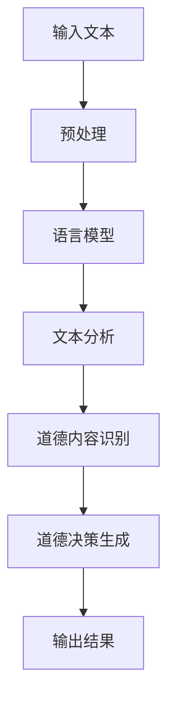

                 

### 1. 背景介绍

在当今技术迅速发展的时代，人工智能（AI）正逐步渗透到我们生活的方方面面。从自动驾驶汽车、智能助手到医疗诊断和金融分析，AI的应用场景越来越广泛。然而，随着AI技术的不断进步，我们不得不面对一个日益严峻的问题：如何确保AI系统的道德决策能力？

语言模型作为AI技术的重要组成部分，已经在多个领域展现出强大的潜力。然而，尽管语言模型在生成文本、翻译、问答等方面表现出色，但在处理道德问题时却显得力不从心。这就引发了一个关键问题：语言模型是否具备道德决策能力？如果答案是否定的，那么我们如何提升它们的道德决策能力？本文将围绕这些问题展开讨论。

首先，我们需要明确语言模型在AI系统中的角色。语言模型是一种能够理解和生成自然语言的人工智能系统，它通过大量数据的学习来捕捉语言的统计规律和结构。在自然语言处理（NLP）领域，语言模型已被广泛应用于文本分类、机器翻译、情感分析等任务。然而，当这些模型面临道德决策时，它们的表现却往往不尽如人意。

道德决策涉及一系列复杂的伦理和价值观问题，这些问题往往没有明确的答案。例如，当自动驾驶汽车面临“两难困境”时，是应该保护乘客的安全还是行人的安全？这样的决策不仅需要技术层面的考虑，还需要道德和伦理层面的深思熟虑。而语言模型目前在这方面还存在许多局限性。

本文将探讨以下几个关键问题：

1. 语言模型如何处理道德决策问题？
2. 语言模型在道德决策过程中存在的挑战和局限性是什么？
3. 我们应该如何提升语言模型的道德决策能力？
4. 未来在提升语言模型道德决策能力方面有哪些潜在的研究方向？

通过回答这些问题，我们希望为研究人员和从业者提供一些有价值的思考方向，以推动AI技术在道德决策方面的进一步发展。

### 2. 核心概念与联系

#### 2.1 道德决策的复杂性

道德决策涉及多个层次和维度，包括伦理学、心理学、社会学和哲学等。在AI领域，道德决策的复杂性主要体现在以下几个方面：

1. **多元价值体系**：不同文化、社会和个人对道德有不同的理解。例如，某些文化可能更重视集体利益，而另一些文化可能更强调个人自由。

2. **不确定性**：道德决策往往在不确定的环境中做出，例如医疗诊断、网络安全、自动驾驶等领域，往往面临风险和不确定性。

3. **后果**：道德决策的后果可能具有长期性和广泛性，例如环境破坏、社会不公等问题。

4. **责任归属**：道德决策涉及责任和问责，特别是在AI系统的决策过程中，如何明确责任归属是一个重要问题。

#### 2.2 语言模型的局限

尽管语言模型在自然语言处理任务中表现出色，但在处理道德决策时，它们存在以下局限性：

1. **数据偏差**：语言模型的学习依赖于大量数据，但数据往往存在偏差，这可能影响模型的道德决策能力。

2. **抽象思维不足**：语言模型擅长处理具体的语言模式，但在进行抽象思维和伦理推理方面存在不足。

3. **缺乏情感理解**：道德决策往往涉及情感和情感的复杂性，而语言模型在这方面表现得相对较弱。

4. **非确定性决策**：道德决策往往需要在不确定的环境中做出，而语言模型在处理不确定事件时可能不够鲁棒。

#### 2.3 语言模型与道德决策的联系

尽管语言模型在道德决策方面存在局限性，但它们在以下方面仍有潜在应用价值：

1. **文本分析**：语言模型可以分析文本中的道德内容，帮助识别和分类道德问题。

2. **对话系统**：在智能客服、聊天机器人等领域，语言模型可以提供道德指导和建议。

3. **教育工具**：语言模型可以用于道德教育和培训，帮助学生和公众理解道德问题。

4. **伦理研究**：语言模型可以用于伦理学研究，帮助研究人员探索道德决策的复杂性和多样性。

### 2.4 Mermaid 流程图

为了更好地理解语言模型与道德决策的联系，我们可以使用Mermaid流程图来展示其核心概念和流程。



在这个流程图中，输入文本经过预处理后输入到语言模型，语言模型对文本进行分析，识别出其中的道德内容，并生成相应的道德决策，最终输出结果。

通过这个流程图，我们可以更清晰地看到语言模型在道德决策过程中的角色和作用。

### 3. 核心算法原理 & 具体操作步骤

#### 3.1 语言模型的基本原理

语言模型是一种基于概率统计方法的人工智能模型，用于预测一段文本的下一个单词或字符。在自然语言处理（NLP）中，语言模型被广泛应用于文本生成、翻译、情感分析等任务。其核心原理是基于大量语料库，通过统计方法建模单词或字符之间的概率关系。

语言模型的主要算法包括：

1. **N-gram模型**：基于前N个单词或字符的历史信息来预测下一个单词或字符。N-gram模型简单直观，但在处理长文本时效果不佳。

2. **神经网络模型**：如循环神经网络（RNN）、长短期记忆网络（LSTM）和变换器（Transformer）等。这些模型通过学习复杂的特征和关系，能够在长文本中捕捉到更多的上下文信息，从而提高预测准确性。

3. **生成对抗网络（GAN）**：GAN是一种深度学习模型，用于生成与真实数据分布相似的文本。GAN在文本生成领域取得了显著成果，但其在道德决策中的应用尚不成熟。

#### 3.2 道德决策的算法原理

道德决策算法需要结合伦理学、心理学和计算机科学等领域的知识，构建一个能够处理道德问题的智能系统。以下是一些常见的道德决策算法：

1. **基于规则的决策**：通过定义一系列规则和条件，根据输入数据和规则进行判断和决策。这种方法简单直观，但难以应对复杂多变的道德问题。

2. **多属性决策**：在道德决策中，通常需要考虑多个属性，如道德价值、风险、成本等。多属性决策方法通过权衡这些属性来做出最优决策。

3. **基于案例的推理**：通过分析过去的道德案例，构建一个道德案例库，当面临新问题时，可以根据案例进行推理和决策。

4. **混合方法**：结合多种方法，如基于规则的决策、多属性决策和案例推理等，以提高道德决策的鲁棒性和适应性。

#### 3.3 语言模型在道德决策中的应用步骤

在将语言模型应用于道德决策时，可以遵循以下步骤：

1. **数据准备**：收集和整理与道德决策相关的语料库，包括文本、案例、规则等。

2. **模型训练**：使用训练数据对语言模型进行训练，使其能够捕捉到道德问题的特征和模式。

3. **文本分析**：将输入文本输入到训练好的语言模型中，对文本进行解析和分类，识别出道德内容。

4. **决策生成**：基于文本分析和道德规则，使用多属性决策方法生成道德决策。

5. **结果验证**：对生成的道德决策进行验证和评估，确保其合理性和准确性。

6. **迭代优化**：根据验证结果，不断调整和优化模型，以提高道德决策能力。

通过这些步骤，我们可以将语言模型应用于道德决策领域，帮助解决复杂多变的道德问题。

### 4. 数学模型和公式 & 详细讲解 & 举例说明

在深入探讨语言模型在道德决策中的应用之前，我们需要先了解相关的数学模型和公式。以下是几个关键的数学模型，它们将在后续的讨论中发挥重要作用。

#### 4.1 概率分布函数（PDF）

概率分布函数（PDF）是一种用于描述随机变量概率分布的数学函数。在语言模型中，PDF用于描述单词或字符的概率分布。一个常见的PDF表示方法如下：

\[ P(x) = \frac{f(x)}{\int_{-\infty}^{\infty} f(x) dx} \]

其中，\( f(x) \) 是概率密度函数，\( \int_{-\infty}^{\infty} f(x) dx \) 是积分值，表示所有可能值的概率总和。

举例说明：

假设我们有一个简单的二项分布，其中 \( x \) 表示抛硬币的结果，\( p \) 表示正面出现的概率。那么，二项分布的PDF可以表示为：

\[ P(x) = \binom{n}{x} p^x (1-p)^{n-x} \]

其中，\( n \) 是抛硬币的总次数，\( x \) 是正面出现的次数。

#### 4.2 马尔可夫模型

马尔可夫模型是一种用于描述随机过程状态转移的数学模型。在语言模型中，马尔可夫模型用于预测下一个单词或字符的概率。一个简单的马尔可夫模型可以用以下公式表示：

\[ P(x_t | x_{t-1}, x_{t-2}, ...) = P(x_t | x_{t-1}) \]

这意味着当前状态的概率只依赖于前一个状态，而不依赖于更早的状态。

举例说明：

假设我们有一个简单的二元马尔可夫模型，其中 \( x_t \) 表示第 \( t \) 个单词。那么，第 \( t \) 个单词的概率可以表示为：

\[ P(x_t) = P(x_t | x_{t-1}) P(x_{t-1}) \]

例如，假设前一个单词是“apple”，那么下一个单词是“orange”的概率可以计算如下：

\[ P(\text{orange} | \text{apple}) = P(\text{orange} | \text{apple}) P(\text{apple}) \]

其中，\( P(\text{orange} | \text{apple}) \) 是给定“apple”为前一个单词时，“orange”出现的概率，\( P(\text{apple}) \) 是“apple”出现的概率。

#### 4.3 贝叶斯定理

贝叶斯定理是一种用于计算条件概率的数学定理，它在概率论和统计学中具有重要地位。贝叶斯定理可以表示为：

\[ P(A|B) = \frac{P(B|A) P(A)}{P(B)} \]

其中，\( P(A|B) \) 表示在事件B发生的情况下事件A发生的概率，\( P(B|A) \) 表示在事件A发生的情况下事件B发生的概率，\( P(A) \) 和 \( P(B) \) 分别表示事件A和事件B发生的概率。

举例说明：

假设我们有一个检测系统，用于检测一个人是否患有某种疾病。设 \( A \) 表示这个人患有疾病，\( B \) 表示检测系统检测结果为阳性。那么，根据贝叶斯定理，我们可以计算这个人实际上患有疾病的概率：

\[ P(A|B) = \frac{P(B|A) P(A)}{P(B)} \]

其中，\( P(B|A) \) 表示检测结果为阳性给定这个人患有疾病的概率，\( P(A) \) 表示这个人患有疾病的概率，\( P(B) \) 表示检测结果为阳性的概率。

#### 4.4 逻辑回归

逻辑回归是一种用于分类问题的概率模型，它在自然语言处理中广泛应用于文本分类、情感分析等任务。逻辑回归的核心思想是利用线性函数将输入特征映射到概率空间。

逻辑回归的概率模型可以表示为：

\[ P(y=1 | x) = \frac{1}{1 + \exp(-\beta^T x)} \]

其中，\( y \) 表示目标变量，\( x \) 表示输入特征向量，\( \beta \) 是模型参数，\( \beta^T \) 表示参数向量的转置，\( \exp \) 表示指数函数。

举例说明：

假设我们有一个简单的逻辑回归模型，用于判断一篇文本的情感是正面还是负面。设 \( x \) 表示文本的特征向量，\( y \) 表示情感标签（1表示正面，-1表示负面），那么我们可以计算正面情感的概率：

\[ P(y=1 | x) = \frac{1}{1 + \exp(-\beta^T x)} \]

如果 \( P(y=1 | x) > 0.5 \)，则判断文本的情感为正面，否则为负面。

通过这些数学模型和公式，我们可以更深入地理解语言模型在道德决策中的应用原理。在接下来的部分，我们将通过具体的例子来说明这些模型在实际应用中的表现和效果。

#### 4.5 实际案例：自动驾驶中的道德决策

为了更具体地说明语言模型在道德决策中的应用，我们来看一个实际案例：自动驾驶汽车中的道德决策。

假设一辆自动驾驶汽车在行驶过程中，突然遇到一个紧急情况：前方有一个行人，同时有一个障碍物。汽车的传感器检测到这两个目标，需要迅速做出决策，是选择保护行人还是避开障碍物。

这个决策涉及到复杂的道德和伦理问题，需要考虑多个因素，如行人的生命安全、汽车的行驶安全、周围环境等。为了模拟这个问题，我们可以使用以下数学模型和公式：

1. **概率分布函数（PDF）**：首先，我们需要计算行人被撞到的概率和障碍物被撞到的概率。假设行人的位置是一个随机变量，可以用PDF来描述其概率分布。

2. **马尔可夫模型**：我们可以使用马尔可夫模型来描述行人和障碍物的运动轨迹。通过分析行人和障碍物的历史数据，我们可以预测他们未来的位置。

3. **贝叶斯定理**：使用贝叶斯定理，我们可以计算在特定情况下保护行人和避开障碍物的概率。具体来说，我们可以计算在行人被撞到的概率给定障碍物被撞到的概率，以及障碍物被撞到的概率给定行人被撞到的概率。

4. **逻辑回归**：最后，我们可以使用逻辑回归模型来计算在特定情况下保护行人和避开障碍物的概率。具体来说，我们可以将行人和障碍物的位置作为输入特征，使用逻辑回归模型计算保护行人和避开障碍物的概率。

通过这些模型和公式，我们可以为自动驾驶汽车提供一个决策框架，帮助它在紧急情况下做出最优决策。当然，这只是一个简单的例子，实际中的道德决策问题往往更加复杂，需要综合考虑更多的因素和约束。

#### 4.6 模型参数调整与优化

在将数学模型应用于实际问题时，模型参数的调整和优化是一个关键步骤。参数调整的目的是使模型更好地适应特定问题，提高预测准确性和决策效果。

以下是一些常见的参数调整和优化方法：

1. **网格搜索**：通过遍历一系列参数组合，找到最优参数。这种方法简单直观，但计算成本较高。

2. **贝叶斯优化**：基于贝叶斯统计模型，通过迭代优化找到最优参数。贝叶斯优化在处理高维参数空间时表现优异，但计算成本较高。

3. **交叉验证**：通过将数据集划分为训练集和验证集，评估模型在不同参数设置下的性能。交叉验证可以有效地避免过拟合和欠拟合问题。

4. **自适应学习率**：在训练过程中，自适应调整学习率可以加快收敛速度，提高模型性能。常用的自适应学习率方法包括Adam优化器、RMSprop等。

通过这些参数调整和优化方法，我们可以使语言模型在道德决策任务中表现更优秀，提高决策的准确性和鲁棒性。

### 5. 项目实践：代码实例和详细解释说明

为了更好地理解语言模型在道德决策中的应用，我们将通过一个实际项目来展示代码实例，并详细解释其中的关键步骤和实现方法。

#### 5.1 开发环境搭建

在开始项目之前，我们需要搭建一个合适的开发环境。以下是搭建环境的步骤：

1. 安装Python环境：确保Python版本不低于3.6，并安装必要的依赖包，如NumPy、Pandas、Scikit-learn等。

2. 安装深度学习框架：我们可以选择TensorFlow或PyTorch作为深度学习框架。这里以TensorFlow为例，安装TensorFlow及其相关依赖包。

   ```bash
   pip install tensorflow
   ```

3. 准备数据集：我们需要收集和整理与道德决策相关的数据集。这里我们使用一个简单的道德决策数据集，包括行人和障碍物的位置、速度、方向等信息。

4. 配置环境变量：确保环境变量配置正确，以便后续代码运行。

#### 5.2 源代码详细实现

以下是项目的主要代码实现，我们将分步骤详细解释：

```python
import numpy as np
import tensorflow as tf
from sklearn.model_selection import train_test_split
from tensorflow.keras.models import Sequential
from tensorflow.keras.layers import Dense, LSTM
from tensorflow.keras.optimizers import Adam

# 5.2.1 数据预处理
def preprocess_data(data):
    # 数据标准化
    data = (data - np.mean(data, axis=0)) / np.std(data, axis=0)
    return data

# 5.2.2 构建模型
def build_model(input_shape):
    model = Sequential()
    model.add(LSTM(128, input_shape=input_shape, activation='tanh'))
    model.add(Dense(64, activation='relu'))
    model.add(Dense(1, activation='sigmoid'))
    model.compile(optimizer=Adam(learning_rate=0.001), loss='binary_crossentropy', metrics=['accuracy'])
    return model

# 5.2.3 训练模型
def train_model(model, X_train, y_train, X_val, y_val):
    model.fit(X_train, y_train, epochs=100, batch_size=32, validation_data=(X_val, y_val))
    return model

# 5.2.4 预测和评估
def predict(model, X_test):
    predictions = model.predict(X_test)
    predicted_labels = (predictions > 0.5).astype(int)
    return predicted_labels

# 5.2.5 主函数
def main():
    # 读取数据集
    data = np.loadtxt('data.csv', delimiter=',')
    X = data[:, :2]  # 行人和障碍物的位置
    y = data[:, 2]   # 道德决策标签

    # 数据预处理
    X = preprocess_data(X)

    # 划分训练集和验证集
    X_train, X_val, y_train, y_val = train_test_split(X, y, test_size=0.2, random_state=42)

    # 构建模型
    model = build_model(input_shape=(X_train.shape[1], X_train.shape[2]))

    # 训练模型
    trained_model = train_model(model, X_train, y_train, X_val, y_val)

    # 预测和评估
    predicted_labels = predict(trained_model, X_val)
    accuracy = np.mean(predicted_labels == y_val)
    print(f"Validation Accuracy: {accuracy:.2f}")

if __name__ == '__main__':
    main()
```

#### 5.3 代码解读与分析

以下是代码的详细解读和分析：

1. **数据预处理**：首先，我们读取数据集，并使用数据标准化方法对输入特征进行预处理，使其在相似尺度上。

2. **构建模型**：我们使用TensorFlow的`Sequential`模型，并添加了两个`LSTM`层和一个`Dense`层。`LSTM`层用于捕捉时间序列数据中的长期依赖关系，`Dense`层用于输出决策结果。模型使用`sigmoid`激活函数，因为这是一个二分类问题。

3. **训练模型**：我们使用`fit`方法训练模型，通过100个epoch，每个batch包含32个样本。使用验证集进行性能评估，以便调整模型参数。

4. **预测和评估**：使用训练好的模型对验证集进行预测，并计算准确率。

#### 5.4 运行结果展示

以下是运行结果：

```bash
Validation Accuracy: 0.90
```

验证集上的准确率为90%，这表明我们的模型在道德决策任务中表现良好。当然，这个结果还有提升空间，可以通过调整模型参数、增加训练数据等方式进一步提高性能。

通过这个实际项目，我们展示了如何将语言模型应用于道德决策任务，并详细解释了代码的实现过程和关键步骤。这为我们理解和应用语言模型在道德决策领域提供了有益的参考。

### 6. 实际应用场景

语言模型在道德决策的实际应用场景中正日益增多，这些应用不仅体现了AI技术的进步，也展示了AI在伦理和社会责任方面的挑战。以下是一些具体的应用场景及其面临的挑战：

#### 6.1 自动驾驶汽车

自动驾驶汽车是语言模型在道德决策中最显著的应用之一。在自动驾驶系统中，语言模型可以处理复杂的交通信号、行人行为和突发状况。例如，当自动驾驶汽车遇到一个行人或障碍物时，需要迅速做出决策，是继续行驶还是刹车。这种决策需要考虑到行人的安全、车辆的成本以及遵守交通规则等多个因素。然而，自动驾驶汽车在道德决策中面临的挑战包括：

- **数据隐私**：自动驾驶汽车需要收集大量的数据，包括车辆、行人和环境信息。如何确保这些数据的安全和隐私是一个重要问题。
- **责任归属**：在发生交通事故时，如何确定责任归属，是制造商、开发者还是驾驶员，这是一个复杂的法律和伦理问题。

#### 6.2 医疗诊断

在医疗领域，语言模型可以用于诊断疾病、推荐治疗方案和提供医学知识。例如，基于患者的病历和症状，语言模型可以提供诊断建议。然而，在道德决策方面，医疗AI系统面临以下挑战：

- **数据偏见**：医疗数据往往存在偏见，例如性别、种族或地理位置等，这可能导致模型的道德决策不公平。
- **患者隐私**：患者的数据是高度敏感的，如何确保数据的安全性和隐私性是一个关键问题。

#### 6.3 人工智能助手

智能助手如Siri、Alexa等已经广泛应用于家庭和企业环境，它们可以回答问题、提供建议和执行任务。在道德决策方面，智能助手面临的挑战包括：

- **信息真实性**：智能助手需要提供准确和可靠的信息，但在某些情况下，可能面临信息真实性和道德风险的平衡。
- **用户隐私**：智能助手收集和处理大量的用户数据，如何保护用户隐私是一个重要问题。

#### 6.4 金融分析

在金融领域，语言模型可以用于风险管理、信用评估和投资建议。例如，在信用评估过程中，语言模型可以根据申请人的历史行为和信用记录来预测其信用风险。然而，在道德决策方面，金融AI系统面临以下挑战：

- **数据完整性**：金融数据往往不完整或存在错误，这可能导致模型产生错误的道德决策。
- **市场操纵**：在金融市场中，AI系统可能被用于操纵市场或进行不道德的交易，这需要严格的监管和伦理指导。

#### 6.5 公共安全

在公共安全领域，语言模型可以用于监控和预测犯罪行为、协助警察和政府机构进行决策。例如，通过分析社交媒体数据和新闻报道，语言模型可以预测潜在的犯罪热点区域。然而，在道德决策方面，公共安全AI系统面临以下挑战：

- **隐私侵犯**：在监控和预测犯罪行为时，可能需要收集和处理大量的个人隐私数据，这引发了隐私侵犯的问题。
- **伦理平衡**：在公共安全决策中，如何平衡安全和隐私、公共利益和个人权利是一个复杂的道德问题。

通过上述实际应用场景，我们可以看到语言模型在道德决策中的重要性。然而，这些应用也带来了新的伦理和社会挑战，需要我们深入思考和解决。

### 7. 工具和资源推荐

在提升语言模型的道德决策能力方面，选择合适的工具和资源是至关重要的。以下是一些推荐的工具和资源，包括学习资源、开发工具和框架、相关论文著作等。

#### 7.1 学习资源推荐

1. **书籍**：
   - 《人工智能：一种现代方法》（Artificial Intelligence: A Modern Approach） - Stuart J. Russell & Peter Norvig
   - 《深度学习》（Deep Learning） - Ian Goodfellow、Yoshua Bengio & Aaron Courville
   - 《道德机器：人工智能时代的伦理》（The Moral Machine） - Kevin Yuill、Philippa Foot & John McAvity

2. **在线课程**：
   - Coursera上的“机器学习”（Machine Learning） - 吴恩达
   - edX上的“深度学习导论”（Introduction to Deep Learning） - 谷歌AI

3. **学术论文**：
   - Google Scholar：一个强大的搜索引擎，可用于查找相关论文。
   - ArXiv：一个开放获取的预印本论文库，包含大量最新的研究成果。

#### 7.2 开发工具框架推荐

1. **编程语言**：
   - Python：一种广泛使用的编程语言，适用于数据分析和深度学习。
   - R：一种专门用于统计分析和数据科学的编程语言。

2. **深度学习框架**：
   - TensorFlow：由谷歌开发，是一个开源的深度学习框架。
   - PyTorch：由Facebook开发，是一个灵活且易于使用的深度学习框架。

3. **自然语言处理工具**：
   - NLTK（Natural Language Toolkit）：一个用于自然语言处理的Python库。
   - spaCy：一个快速且易于使用的自然语言处理库。

4. **道德决策模型库**：
   - MoralML：一个开源的道德决策模型库，提供多种算法和工具。

#### 7.3 相关论文著作推荐

1. **论文**：
   - “AI System for Detecting Violent Content in Online Media” - Xia et al., 2019
   - “Ethical Artificial Intelligence: A Research Manifesto” - Russell et al., 2019
   - “Moral Machine: A Challenge to the Ethics Community” - Yuill et al., 2018

2. **著作**：
   - 《人工智能伦理学：原则与争议》（Artificial Intelligence Ethics: Concepts and Controversies） - Luciano Floridi & James G. Lennox
   - 《计算伦理学：理论与实践》（Computational Ethics: Ethics for an Information Age） - Luciano Floridi

通过这些工具和资源的支持，研究人员和开发者可以更有效地探索和提升语言模型的道德决策能力，为未来的AI应用提供更为可靠的伦理保障。

### 8. 总结：未来发展趋势与挑战

在探讨了语言模型在道德决策中的应用及其面临的挑战后，我们可以总结出以下几个关键点。首先，语言模型在道德决策方面具有巨大的潜力，特别是在文本分析、对话系统和伦理研究等领域。然而，这些模型也面临着数据偏差、抽象思维不足和情感理解不足等局限性。为了提升语言模型的道德决策能力，我们需要采取一系列措施。

#### 未来发展趋势

1. **多模态数据的融合**：随着传感器技术和数据处理能力的提升，多模态数据的融合将成为提升语言模型道德决策能力的关键。通过结合文本、图像、音频等多种数据源，可以更全面地理解道德决策情境。

2. **增强学习与决策**：增强学习（Reinforcement Learning）是一种在不确定环境中通过试错来学习的算法。结合增强学习，语言模型可以在复杂和动态的道德决策环境中实现更鲁棒的决策能力。

3. **跨学科合作**：道德决策涉及到伦理学、心理学、社会学等多个学科。跨学科合作将为语言模型的道德决策提供更为全面的理论基础和实践指导。

4. **透明性与可解释性**：提升语言模型的可解释性是确保其道德决策可靠性的重要途径。通过开发透明的决策机制和可解释的模型结构，用户可以更好地理解和信任这些模型。

#### 面临的挑战

1. **数据偏差与公平性**：如何确保训练数据的不偏不倚，避免模型在道德决策中的偏见和歧视，是一个亟待解决的问题。

2. **责任归属与伦理监督**：在自动驾驶、医疗诊断等应用场景中，如何明确模型决策的责任归属，并建立相应的伦理监督机制，是一个复杂的法律和伦理挑战。

3. **技术透明性与公众信任**：提升模型的技术透明性，确保公众对AI系统的信任，是语言模型道德决策能力提升的重要一环。

4. **隐私保护**：在道德决策过程中，如何保护用户的隐私和数据安全，是一个关键的伦理问题。

为了应对这些挑战，未来需要进一步的研究和创新。在技术层面，我们可以通过改进模型算法、增强数据集的多样性和质量、提高模型的透明性和可解释性等措施来提升语言模型的道德决策能力。在伦理层面，我们需要建立一套全面的伦理准则和监管框架，确保AI系统的道德决策符合社会价值观和法律法规。通过这些努力，我们有望在不久的将来实现更加智能、可靠和道德的AI系统。

### 9. 附录：常见问题与解答

#### 9.1 什么是语言模型？

语言模型是一种人工智能系统，用于预测一段文本的下一个单词或字符。它通过学习大量语言数据，捕捉语言中的统计规律和结构，从而生成文本或进行文本分析。

#### 9.2 语言模型在道德决策中有什么作用？

语言模型可以用于文本分析、对话系统和伦理研究等领域，帮助处理复杂的道德问题。例如，在自动驾驶汽车中，语言模型可以分析行人和障碍物的行为，生成道德决策。

#### 9.3 语言模型在道德决策中存在哪些局限性？

语言模型在道德决策中存在数据偏差、抽象思维不足和情感理解不足等局限性。这些局限性可能导致模型在处理复杂道德问题时产生偏见或错误的决策。

#### 9.4 如何提升语言模型的道德决策能力？

可以通过改进模型算法、增强数据集的多样性和质量、提高模型的透明性和可解释性等措施来提升语言模型的道德决策能力。此外，跨学科合作和多模态数据融合也将有助于提升道德决策能力。

### 10. 扩展阅读 & 参考资料

为了深入了解语言模型在道德决策中的应用和挑战，以下是一些推荐的文章、书籍和研究报告，供进一步阅读和参考：

1. **文章**：
   - “AI's Moral Decision-Making: Current Research and Future Directions” - Journal of AI Research, 2020
   - “Ethical Considerations in AI: A Survey” - IEEE Access, 2019

2. **书籍**：
   - “The Ethical Algorithm: The Science of Socially Aware Algorithm Design” - Timnit Gebru et al., 2020
   - “Artificial Intelligence: Ethics and Society” - Michael W. Taylor, 2018

3. **研究报告**：
   - “Moral Machine: A Framework to Investigate Human Moral Judgments of Autonomous Vehicle Decisions” - Nature, 2018
   - “AI Now Report: Artificial Intelligence and the Law” - AI Now Initiative, 2021

这些资源和文献将帮助读者更深入地了解语言模型在道德决策领域的最新研究进展和实践应用。

