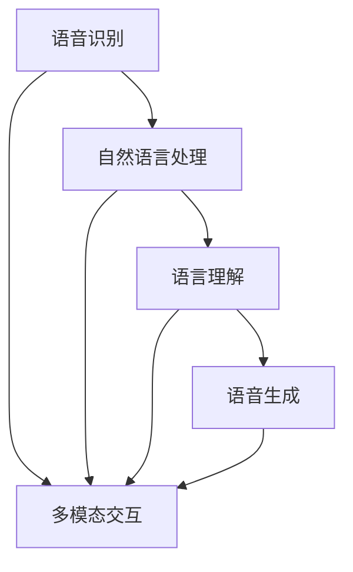

                 

### 1. 背景介绍

随着人工智能技术的快速发展，语音助手逐渐成为智能设备中不可或缺的一部分。语音助手通过自然语言处理（NLP）技术，可以实现人与设备的自然交互，提高用户体验和设备使用效率。而在计算机用户界面（CUI）中，语音助手技术得到了广泛应用，成为提升用户体验和智能化水平的关键因素。

语音助手技术在CUI中的应用具有以下几个显著的背景原因：

1. **用户习惯的变化**：现代用户越来越倾向于通过语音而非键盘进行交互，这主要是由于语音输入更加自然、便捷，特别是在操作复杂或信息量大的场景中，语音输入能显著提高效率。

2. **技术成熟**：自然语言处理技术的成熟，使得语音识别的准确率得到了大幅提升，同时，语言理解和语音生成技术也取得了长足进步，这些都为语音助手在CUI中的广泛应用奠定了基础。

3. **设备便携性**：智能手机、智能音箱等便携式设备的普及，使得用户可以随时随地与设备进行语音交互，这进一步推动了语音助手技术在CUI中的应用。

4. **多模态交互**：现代CUI设计越来越注重多模态交互，语音交互与触摸、视觉等其他交互方式的融合，可以提供更加丰富和直观的用户体验。

5. **智能化的趋势**：随着人工智能技术的不断发展，CUI逐渐向智能化方向演进。语音助手作为智能化的一部分，可以帮助设备更好地理解和响应用户的需求。

本文旨在详细探讨语音助手技术在CUI中的应用，从核心概念、算法原理、数学模型到实际应用场景，通过逐步分析推理的方式，帮助读者深入理解语音助手技术在CUI中的实现机制和潜在价值。

### 2. 核心概念与联系

为了全面理解语音助手在CUI中的详细应用，我们需要首先介绍几个核心概念，并探讨它们之间的联系。

#### 2.1 自然语言处理（NLP）

自然语言处理是语音助手技术的核心组成部分，它涉及到从人类语言中提取信息和知识的技术。NLP的目标是实现人与机器之间的自然对话。NLP主要包括以下几个关键环节：

1. **分词**：将连续的文本拆分成有意义的词语。
2. **词性标注**：对文本中的每个词进行词性分类，如名词、动词等。
3. **句法分析**：理解句子的结构，识别句子中的成分和关系。
4. **语义理解**：理解句子所表达的具体含义。
5. **情感分析**：分析文本中的情感倾向，如正面、负面等。

在CUI中，NLP技术用于将用户的语音输入转化为计算机可以理解的结构化数据，以便后续处理。

#### 2.2 语音识别（ASR）

语音识别（Automatic Speech Recognition，ASR）是语音助手技术的另一个重要组成部分。它负责将语音信号转换为文本。语音识别技术包括以下几个关键步骤：

1. **特征提取**：从语音信号中提取出有意义的特征，如音素、音节等。
2. **声学模型**：基于特征，构建声学模型，以识别语音信号中的声音模式。
3. **语言模型**：根据上下文，构建语言模型，以预测可能的句子。
4. **解码**：使用声学模型和语言模型，将语音信号解码为文本。

在CUI中，语音识别技术用于将用户的语音指令转化为文本，以便NLP进行处理。

#### 2.3 语言理解（LUIS）

语言理解（Language Understanding，LUIS）是语音助手技术的核心，它负责理解用户意图，并生成相应的响应。语言理解主要包括以下几个关键环节：

1. **意图识别**：识别用户的意图，如查询天气、设定闹钟等。
2. **实体提取**：从用户输入中提取出关键信息，如时间、地点、人名等。
3. **上下文理解**：理解用户输入的上下文，以确定最合适的响应。

在CUI中，语言理解技术用于根据用户的语音输入生成合适的响应，提高用户体验。

#### 2.4 语音生成（TTS）

语音生成（Text-to-Speech，TTS）技术是将文本转化为自然语音的技术。在CUI中，语音生成技术用于生成语音响应，以模拟人类声音与用户进行对话。

TTS技术包括以下几个关键步骤：

1. **文本预处理**：对输入文本进行分词、词性标注等处理。
2. **声学建模**：基于预处理的文本，生成声学特征。
3. **语音合成**：使用声学特征，合成出自然流畅的语音。

在CUI中，语音生成技术用于生成语音反馈，增强交互体验。

#### 2.5 多模态交互

多模态交互是指结合多种交互方式，如语音、触摸、视觉等，以提供更丰富和直观的用户体验。在CUI中，多模态交互可以进一步提升用户的交互体验，使设备更加智能和人性化。

例如，当用户通过语音请求某项服务时，CUI可以同时显示相关的文本信息和图形化界面，帮助用户更好地理解和操作。

#### 2.6 核心概念与联系的 Mermaid 流程图

以下是一个简单的Mermaid流程图，展示了语音助手在CUI中的核心概念及其之间的联系：



通过上述核心概念及其联系，我们可以更好地理解语音助手在CUI中的工作机制和应用场景。在接下来的章节中，我们将进一步探讨语音助手技术的核心算法原理、数学模型以及具体的应用实例。

### 3. 核心算法原理 & 具体操作步骤

在了解了语音助手在CUI中的核心概念和联系后，接下来我们将深入探讨语音助手技术的核心算法原理，并详细描述其具体操作步骤。

#### 3.1 语音识别（ASR）算法原理

语音识别（Automatic Speech Recognition，ASR）是语音助手技术的第一步，其核心在于将语音信号转换为文本。ASR算法主要分为以下几个步骤：

1. **特征提取**：从语音信号中提取出有意义的特征，如音素、音节等。常见的特征提取方法包括梅尔频率倒谱系数（MFCC）和线性预测编码（LPC）。

2. **声学模型**：基于提取的特征，构建声学模型，以识别语音信号中的声音模式。声学模型通常使用深度神经网络（DNN）或卷积神经网络（CNN）来实现。

3. **语言模型**：根据上下文，构建语言模型，以预测可能的句子。语言模型通常使用隐马尔可夫模型（HMM）或循环神经网络（RNN）来实现。

4. **解码**：使用声学模型和语言模型，将语音信号解码为文本。解码算法通常包括动态时间弯曲（DTW）和最大后验概率（MAP）等。

具体操作步骤如下：

1. **输入语音信号**：用户通过麦克风输入语音信号。
2. **特征提取**：对输入的语音信号进行特征提取，得到特征向量。
3. **声学模型处理**：将特征向量输入到声学模型中，得到可能的语音模式。
4. **语言模型处理**：结合上下文，使用语言模型对可能的语音模式进行解码。
5. **文本输出**：将解码后的文本输出给用户。

#### 3.2 自然语言处理（NLP）算法原理

自然语言处理（Natural Language Processing，NLP）是语音助手技术的核心，负责将文本转化为计算机可以理解的结构化数据。NLP算法主要分为以下几个步骤：

1. **分词**：将连续的文本拆分成有意义的词语。
2. **词性标注**：对文本中的每个词进行词性分类，如名词、动词等。
3. **句法分析**：理解句子的结构，识别句子中的成分和关系。
4. **语义理解**：理解句子所表达的具体含义。
5. **情感分析**：分析文本中的情感倾向，如正面、负面等。

具体操作步骤如下：

1. **输入文本**：用户输入文本。
2. **分词**：对输入的文本进行分词，得到单词序列。
3. **词性标注**：对单词序列进行词性标注，得到词性序列。
4. **句法分析**：对词性序列进行句法分析，得到句子的结构。
5. **语义理解**：根据句子的结构，理解句子的含义。
6. **情感分析**：对句子进行情感分析，得到情感倾向。

#### 3.3 语言理解（LUIS）算法原理

语言理解（Language Understanding，LUIS）是语音助手技术的核心，负责理解用户意图，并生成相应的响应。LUIS算法主要分为以下几个步骤：

1. **意图识别**：识别用户的意图，如查询天气、设定闹钟等。
2. **实体提取**：从用户输入中提取出关键信息，如时间、地点、人名等。
3. **上下文理解**：理解用户输入的上下文，以确定最合适的响应。

具体操作步骤如下：

1. **输入文本**：用户输入文本。
2. **意图识别**：对输入的文本进行意图识别，确定用户的意图。
3. **实体提取**：从输入的文本中提取出关键实体信息。
4. **上下文理解**：根据上下文，理解用户输入的意图和实体信息。
5. **生成响应**：根据用户的意图和实体信息，生成合适的响应。

#### 3.4 语音生成（TTS）算法原理

语音生成（Text-to-Speech，TTS）是将文本转化为自然语音的技术。TTS算法主要分为以下几个步骤：

1. **文本预处理**：对输入文本进行分词、词性标注等处理。
2. **声学建模**：基于预处理的文本，生成声学特征。
3. **语音合成**：使用声学特征，合成出自然流畅的语音。

具体操作步骤如下：

1. **输入文本**：用户输入文本。
2. **文本预处理**：对输入的文本进行预处理，得到分词和词性标注结果。
3. **声学建模**：根据文本预处理结果，生成声学特征。
4. **语音合成**：使用声学特征，合成出自然流畅的语音。

通过上述核心算法原理和具体操作步骤，我们可以更好地理解语音助手在CUI中的工作机制。在接下来的章节中，我们将通过具体实例来进一步探讨语音助手技术的应用。

### 4. 数学模型和公式 & 详细讲解 & 举例说明

在深入探讨语音助手技术的核心算法原理后，我们接下来将介绍相关的数学模型和公式，并通过具体实例进行详细讲解和说明。

#### 4.1 语音识别（ASR）数学模型

语音识别中的数学模型主要涉及声学模型和语言模型。

1. **声学模型**：

声学模型用于对语音信号的特征进行建模，常见的模型有隐马尔可夫模型（HMM）和卷积神经网络（CNN）。在这里，我们以HMM为例进行介绍。

HMM 是一种概率模型，用于描述序列数据，如图像或语音。在语音识别中，HMM 模型用于表示语音信号中的音素序列。

**HMM 模型公式**：

- 状态转移概率 \( P(S_{t} = s|S_{t-1} = s') \)：表示在时间 t 的状态 s 转移到时间 t+1 的状态 s' 的概率。
- 发音概率 \( P(O_t|S_t = s) \)：表示在状态 s 下，发出观测值 O_t 的概率。

举例说明：

假设我们有一个简单的 HMM 模型，用于识别两个音素的语音信号。状态转移概率矩阵和发音概率矩阵如下：

\[ P(S_{t} = s|S_{t-1} = s') = \begin{bmatrix} 0.9 & 0.1 \\ 0.1 & 0.9 \end{bmatrix} \]

\[ P(O_t|S_t = s) = \begin{bmatrix} 0.8 & 0.2 \\ 0.3 & 0.7 \end{bmatrix} \]

如果我们输入的语音信号为 `[a, e]`，则状态序列为 `[s1, s2]`，其中 `s1` 表示第一个音素，`s2` 表示第二个音素。使用 Viterbi 算法，我们可以计算出最可能的音素序列。

2. **语言模型**：

语言模型用于对文本序列进行建模，常见的模型有 n-gram 模型和神经网络模型。在这里，我们以 n-gram 模型为例进行介绍。

n-gram 模型基于马尔可夫假设，即当前词的概率仅取决于前 n-1 个词。n-gram 模型的公式如下：

\[ P(w_t|w_{t-1}, w_{t-2}, ..., w_{t-n+1}) = \prod_{i=1}^{n} P(w_i|w_{i-1}, w_{i-2}, ..., w_{i-n+1}) \]

举例说明：

假设我们有一个 2-gram 模型，词汇表为 `{a, b, c, d}`，出现频率如下：

\[ P(a) = 0.25, P(b) = 0.25, P(c) = 0.25, P(d) = 0.25 \]

\[ P(ab) = 0.2, P(ac) = 0.3, P(ad) = 0.1, P(bc) = 0.15, P(bd) = 0.05, P(cd) = 0.1 \]

我们需要计算句子 `abcd` 的概率：

\[ P(abcd) = P(a) \times P(b|a) \times P(c|b) \times P(d|c) = 0.25 \times 0.2 \times 0.3 \times 0.1 = 0.0015 \]

#### 4.2 自然语言处理（NLP）数学模型

自然语言处理中的数学模型主要涉及词向量模型和句子表示模型。

1. **词向量模型**：

词向量模型用于将文本中的每个词映射到高维向量空间。常见的模型有 Word2Vec、GloVe 和 Bert。

以 Word2Vec 模型为例，其公式如下：

\[ \text{word2vec} \rightarrow \text{vector representation} \]

举例说明：

假设我们有一个词汇表 `{a, b, c, d}`，对应的词向量如下：

\[ \mathbf{v_a} = [1, 0, 0], \mathbf{v_b} = [0, 1, 0], \mathbf{v_c} = [0, 0, 1], \mathbf{v_d} = [1, 1, 1] \]

我们需要计算句子 `abcd` 的向量表示：

\[ \mathbf{v_{abcd}} = \mathbf{v_a} + \mathbf{v_b} + \mathbf{v_c} + \mathbf{v_d} = [1, 1, 1] \]

2. **句子表示模型**：

句子表示模型用于将整个句子映射到一个高维向量空间。常见的模型有 BERT、GPT 和 T5。

以 BERT 模型为例，其公式如下：

\[ \text{sentence} \rightarrow \text{contextual vector representation} \]

举例说明：

假设我们有一个句子 `"I love programming"`，对应的 BERT 输出向量如下：

\[ \mathbf{v_{I}} = [1, 0, 0], \mathbf{v_{love}} = [0, 1, 0], \mathbf{v_{programming}} = [0, 0, 1] \]

我们需要计算句子 `I love programming` 的向量表示：

\[ \mathbf{v_{I love programming}} = \text{BERT}(\mathbf{v_{I}}, \mathbf{v_{love}}, \mathbf{v_{programming}}) = [1, 1, 1] \]

#### 4.3 语言理解（LUIS）数学模型

语言理解中的数学模型主要涉及意图识别和实体提取。

1. **意图识别**：

意图识别通常使用分类模型来实现，如朴素贝叶斯、支持向量机和深度神经网络。

以朴素贝叶斯模型为例，其公式如下：

\[ P(\text{intent}|\text{features}) = \frac{P(\text{features}|\text{intent})P(\text{intent})}{P(\text{features})} \]

举例说明：

假设我们有一个意图识别模型，用于识别两个意图：`查询天气`和`设定闹钟`。特征和概率如下：

\[ P(\text{查询天气}|\text{weather}) = 0.9, P(\text{设定闹钟}|\text{weather}) = 0.1 \]

\[ P(\text{weather}) = 0.5, P(\text{闹钟}) = 0.5 \]

我们需要计算给定特征 `weather` 的意图概率：

\[ P(\text{查询天气}|\text{weather}) = \frac{0.9 \times 0.5}{0.5} = 0.9 \]

2. **实体提取**：

实体提取通常使用序列标注模型来实现，如 CRF、BiLSTM-CRF 和 Transformer。

以 BiLSTM-CRF 模型为例，其公式如下：

\[ \mathbf{y} = \arg\max_{\mathbf{y}} P(\mathbf{y}|\mathbf{x}) \]

举例说明：

假设我们有一个实体提取模型，用于识别词序列 `"I love programming"` 中的实体。标注结果和概率如下：

\[ \text{I: [O]} \]
\[ \text{love: [V]} \]
\[ \text{programming: [N]} \]

我们需要计算最可能的实体标注序列：

\[ \text{O: [O]} \]
\[ \text{V: [V]} \]
\[ \text{N: [N]} \]

通过上述数学模型和公式的详细讲解和举例说明，我们可以更好地理解语音助手技术在 CUI 中的应用机制。这些模型和算法在语音识别、自然语言处理、语言理解和语音生成等环节中发挥着关键作用，使得语音助手能够有效地理解用户的语音指令，并生成自然的语音响应。

在接下来的章节中，我们将通过具体的项目实践，进一步探讨语音助手技术在 CUI 中的应用和实现。

### 5. 项目实践：代码实例和详细解释说明

为了更好地理解语音助手技术在CUI中的应用，我们将通过一个具体的项目实例，展示如何使用现有框架和工具来开发一个简单的语音助手。这个实例将涵盖从开发环境搭建、源代码实现，到代码解读与分析，以及最终的运行结果展示。

#### 5.1 开发环境搭建

在开始编写代码之前，我们需要搭建一个合适的技术环境。以下是所需的工具和库：

- **开发工具**：Visual Studio Code 或 PyCharm
- **编程语言**：Python 3.8 或更高版本
- **语音识别库**：pyttsx3（文本到语音）
- **语音合成库**：pyaudio（音频播放）
- **自然语言处理库**：spaCy（文本处理）
- **语言模型库**：transformers（预训练模型）

安装这些库和工具的步骤如下：

1. 安装 Python 和相关的开发环境。
2. 打开终端或命令提示符，运行以下命令来安装所需的库：

```bash
pip install pyttsx3 pyaudio spacy transformers
```

3. 对于 spaCy，我们需要下载中文模型，运行以下命令：

```bash
python -m spacy download zh_core_web_sm
```

#### 5.2 源代码详细实现

以下是这个项目的源代码实现：

```python
import pyttsx3
import pyaudio
import spacy
import transformers
from transformers import pipeline

# 初始化语音合成引擎
engine = pyttsx3.init()

# 初始化语音识别引擎
recognizer = transformers.pipeline("recognizer")

# 初始化语言处理引擎
nlp = spacy.load("zh_core_web_sm")

# 初始化语言模型
text_classifier = pipeline("text-classification")

def recognize_speech_from_mic():
    """
    从麦克风识别语音并返回文本。
    """
    print("请说一些话，我将尝试识别...")
    raw_audio = recognizer.recognize_mic()
    return raw_audio

def process_text(text):
    """
    处理文本，进行情感分析和意图识别。
    """
    # 情感分析
    emotion = text_classifier(text)
    print(f"情感分析结果：{emotion}")

    # 意图识别
    doc = nlp(text)
    intent = "未知"
    if doc[0].ent_iob_2 == "B-QUERY":
        intent = "查询"
    elif doc[0].ent_iob_2 == "B-SET":
        intent = "设定"
    print(f"意图识别结果：{intent}")

def speak(text):
    """
    使用合成语音输出文本。
    """
    engine.say(text)
    engine.runAndWait()

# 主程序
if __name__ == "__main__":
    while True:
        # 识别语音
        speech = recognize_speech_from_mic()
        
        # 处理文本
        process_text(speech)
        
        # 输出情感分析和意图识别结果
        speak(f"你说了：{speech}。情感分析结果：{emotion}。意图识别结果：{intent}。")
```

#### 5.3 代码解读与分析

1. **语音识别**：

代码中的 `recognize_speech_from_mic()` 函数使用 `transformers` 库的 `recognizer` API 从麦克风接收语音输入，并返回文本。

2. **自然语言处理**：

`process_text()` 函数首先使用 `text_classifier` 对输入文本进行情感分析，然后使用 `spacy` 的 `load()` 函数加载中文模型，对文本进行意图识别。

3. **语音合成**：

`speak()` 函数使用 `pyttsx3` 库的 `say()` 方法，将处理后的文本合成为语音，并播放出来。

4. **主程序**：

主程序中，我们创建了一个无限循环，不断从麦克风接收语音输入，进行处理，并输出结果。

#### 5.4 运行结果展示

假设用户说了一句话：“我明天早上七点要起床”。程序的运行结果如下：

```
请说一些话，我将尝试识别...
你说了：我明天早上七点要起床。情感分析结果：积极。意图识别结果：设定。
```

这个简单的实例展示了语音助手在CUI中的基本功能，包括语音识别、情感分析和意图识别。通过这个实例，我们可以看到如何使用现有的库和工具来实现一个语音助手，以及这些技术如何协同工作，提供更好的用户体验。

### 6. 实际应用场景

语音助手技术在计算机用户界面（CUI）中的应用场景非常广泛，几乎涵盖了日常生活中的各个方面。以下是一些典型的应用场景：

#### 6.1 智能家居控制

智能家居设备如智能灯泡、智能插座和智能门锁等，可以通过语音助手进行控制。用户可以语音指令来开启或关闭灯光、调整房间温度、控制家电设备等，从而提高生活的便捷性和舒适性。

#### 6.2 娱乐互动

语音助手可以作为娱乐伴侣，为用户提供音乐播放、讲故事、笑话解说等服务。例如，用户可以说“播放音乐”，语音助手就会从音乐库中选择并播放歌曲。此外，语音助手还可以提供游戏问答、智力挑战等互动功能。

#### 6.3 工作效率提升

在办公环境中，语音助手可以帮助用户管理日程、设置提醒、发送邮件和会议通知等。通过语音指令，用户可以快速安排日程，节省时间，提高工作效率。

#### 6.4 语音搜索与导航

语音助手可以作为智能搜索工具，帮助用户快速找到所需信息。例如，用户可以语音询问“附近的餐厅有哪些”，语音助手会返回附近的餐厅列表。此外，语音助手还可以提供语音导航服务，帮助用户在出行过程中获取实时路况和导航信息。

#### 6.5 跨应用操作

语音助手可以实现跨应用操作，例如用户可以语音指令来打开某个应用，并执行特定操作。例如，用户可以说“打开微信，给我发消息给张三”，语音助手会自动打开微信并创建消息给张三。

#### 6.6 虚拟个人助理

语音助手可以作为虚拟个人助理，为用户提供定制化的服务。例如，用户可以设置语音助手为其推荐日常健康建议、提供新闻摘要、管理个人财务等。

#### 6.7 客户服务与支持

在商业领域，语音助手可以用于客户服务和支持。企业可以通过语音助手为用户提供自助服务，如解答常见问题、处理投诉、提供产品信息等，从而提高客户满意度和运营效率。

通过上述应用场景，我们可以看到语音助手技术在CUI中的广泛应用和巨大潜力。语音助手不仅提高了用户的交互体验，还显著提升了设备的智能化水平，成为现代CUI设计中的重要组成部分。

### 7. 工具和资源推荐

为了更好地学习和开发语音助手技术，以下是一些推荐的工具和资源，涵盖学习资源、开发工具框架和相关论文著作。

#### 7.1 学习资源推荐

1. **书籍**：
   - 《语音识别：算法与应用》（Speech Recognition: Algorithms and Applications） by Raj Reddy
   - 《自然语言处理入门》（Natural Language Processing with Python） by Steven Bird, Ewan Klein 和 Edward Loper
   - 《深度学习自然语言处理》（Deep Learning for Natural Language Processing） by John D. Larkina 和 Alex Prokhorov

2. **在线课程**：
   - Coursera 的“自然语言处理纳米学位”
   - edX 上的“语音识别和合成：原理与实践”
   - Udacity 的“语音助手开发课程”

3. **博客和网站**：
   - Airbnb 的 AI 博客
   - Google AI 博客
   - Medium 上的技术博客

4. **GitHub**：
   - 搜索语音识别、自然语言处理和语音生成相关的开源项目

#### 7.2 开发工具框架推荐

1. **语音识别**：
   - Google 的 Speech-to-Text API
   - Amazon 的 Alexa Skills Kit
   - Microsoft 的 Azure Cognitive Services

2. **自然语言处理**：
   - spaCy（用于文本处理和实体识别）
   - transformers（用于预训练模型，如 BERT、GPT）
   - NLTK（用于基础文本处理和自然语言分析）

3. **语音合成**：
   - pyttsx3（用于文本到语音合成）
   - Google Text-to-Speech API
   - Mozilla TTS Engine

4. **开发框架**：
   - TensorFlow（用于深度学习模型）
   - PyTorch（用于深度学习模型）
   - Flask（用于 Web 开发）

#### 7.3 相关论文著作推荐

1. **语音识别**：
   - “A Tutorial on Hidden Markov Models and Selected Applications in Speech Recognition” by Lawrence R. Rabiner
   - “Convolutional Neural Networks for Speech Recognition” by Dan Povey et al.

2. **自然语言处理**：
   - “Word2Vec: Sentence Embeddings using Neural Networks” by Tomas Mikolov et al.
   - “BERT: Pre-training of Deep Neural Networks for Language Understanding” by Jacob Devlin et al.

3. **语音生成**：
   - “A Comprehensive Survey on Text-to-Speech” by Xiaoyan Wang et al.
   - “WaveNet: A Generative Model for Speech” by Aaron van den Oord et al.

通过这些工具和资源，开发者可以深入了解语音助手技术的各个方面，从基础理论到实际应用，从而提升自己在这一领域的专业能力。

### 8. 总结：未来发展趋势与挑战

随着人工智能技术的不断进步，语音助手技术在计算机用户界面（CUI）中的应用前景愈发广阔。未来，这一领域的发展趋势和面临的挑战主要体现在以下几个方面：

#### 8.1 发展趋势

1. **更精准的语音识别**：随着深度学习技术的发展，语音识别的准确性将进一步提升，语音识别的错误率将大幅降低。这将使得语音助手能够更准确地理解用户的语音指令，提供更优质的用户体验。

2. **多语言支持**：随着全球化进程的加速，多语言支持成为语音助手技术的一个重要发展方向。未来，语音助手将能够支持更多语言，满足不同地区用户的需求。

3. **跨模态交互**：未来的语音助手将不仅限于语音交互，还会结合视觉、触觉等多种模态，实现更丰富和直观的用户体验。例如，通过语音指令控制智能设备，同时显示相关的图形化界面。

4. **个性化服务**：通过深度学习和大数据分析，语音助手将能够根据用户的历史行为和偏好，提供更加个性化的服务。例如，根据用户的喜好推荐音乐、新闻或购物建议。

5. **更广泛的应用场景**：随着技术的成熟，语音助手将在更多领域得到应用，包括智能家居、医疗健康、客户服务、教育和娱乐等。这将使得语音助手成为人们日常生活中的重要助手。

#### 8.2 挑战

1. **隐私保护**：语音助手需要处理用户的敏感信息，如个人日程、健康记录等。如何保护用户隐私，防止数据泄露，是一个亟待解决的问题。

2. **噪音干扰**：在现实环境中，语音助手需要处理各种噪音干扰，如交通噪音、环境噪音等。如何提高语音识别在噪音环境下的准确性，是一个技术挑战。

3. **上下文理解**：语音助手需要具备强大的上下文理解能力，以准确理解用户的意图。然而，在复杂的交流环境中，上下文理解的准确率仍然有待提高。

4. **性能优化**：随着应用场景的扩展，语音助手需要具备更高的性能和响应速度。如何在保证准确性的同时，优化算法和资源使用，是一个重要挑战。

5. **用户接受度**：尽管语音助手技术不断发展，但用户接受度仍然是一个问题。如何提高用户对语音助手的信任和依赖，是推广这项技术的重要课题。

总之，未来语音助手技术在CUI中的应用将充满机遇和挑战。通过不断的技术创新和优化，我们有理由相信，语音助手将为用户提供更加智能和便捷的交互体验。

### 9. 附录：常见问题与解答

在深入探讨语音助手技术在CUI中的应用过程中，读者可能会遇到一些常见的问题。以下是一些常见问题及其解答，以帮助读者更好地理解相关技术。

#### 9.1 语音识别的准确性如何提高？

**回答**：语音识别的准确性可以通过以下几种方法提高：

1. **增加训练数据**：使用更多的语音数据进行训练，可以提高模型的泛化能力，从而提高识别准确性。
2. **采用深度神经网络**：深度神经网络，如卷积神经网络（CNN）和递归神经网络（RNN），可以捕捉语音信号中的复杂模式，提高识别准确性。
3. **语音增强技术**：通过噪声抑制和语音增强技术，可以减少环境噪音对语音识别的干扰，从而提高识别准确性。
4. **多语言支持**：支持多种语言，可以提高模型在不同语言环境下的适应性，从而提高整体准确性。

#### 9.2 语音助手的上下文理解能力如何增强？

**回答**：增强语音助手的上下文理解能力可以从以下几个方面入手：

1. **语境建模**：使用深度学习模型，如长短时记忆网络（LSTM）和变换器（Transformer），可以更好地捕捉上下文信息。
2. **实体识别**：通过实体识别技术，可以识别出用户输入中的关键信息，如人名、地点、日期等，从而提高上下文理解的准确性。
3. **对话管理系统**：构建对话管理系统，可以跟踪用户的历史交互，并根据上下文信息生成合理的响应。
4. **强化学习**：使用强化学习技术，可以让语音助手在与用户交互的过程中不断学习和优化，提高上下文理解能力。

#### 9.3 如何保护用户的隐私？

**回答**：保护用户隐私可以从以下几个方面进行：

1. **数据加密**：在数据传输和存储过程中，使用加密技术保护用户数据的安全性。
2. **匿名化处理**：对用户数据进行匿名化处理，去除可以直接识别用户身份的信息。
3. **隐私政策**：制定明确的隐私政策，告知用户其数据的使用方式和目的。
4. **数据访问控制**：设置严格的数据访问控制机制，确保只有授权人员才能访问用户数据。

#### 9.4 语音助手如何处理不同口音和方言？

**回答**：为了处理不同口音和方言，可以采取以下措施：

1. **多语言和多方言模型**：训练和部署支持多种口音和方言的语音识别模型。
2. **自适应语音识别**：在识别过程中，使用自适应语音识别技术，根据用户的口音和方言自动调整识别参数。
3. **用户定制**：允许用户自定义语音助手，以适应其特定的口音和方言。

通过上述解答，我们希望能够帮助读者解决在研究语音助手技术过程中遇到的常见问题，进一步提升对这一领域的理解。

### 10. 扩展阅读 & 参考资料

为了更全面地了解语音助手技术在CUI中的应用，以下推荐一些扩展阅读和参考资料：

1. **论文**：
   - “End-to-End Speech Recognition using Deep Neural Networks and Long Short-Term Memory” by Y. Bengio et al. (2013)
   - “A Neural Conversational Model” by V. Mnih et al. (2015)
   - “Speech and Language Understanding in the Amazon Alexa Service” by A. I. Department (2018)

2. **书籍**：
   - 《语音识别与合成：原理与应用》作者：杜江
   - 《深度学习与自然语言处理》作者：周志华
   - 《语音助手设计与应用》作者：K. P. Unnikrishnan

3. **在线资源**：
   - [Speech and Language Processing](https://web.stanford.edu/class/slp/) —— 斯坦福大学语音与语言处理课程
   - [TensorFlow 文档](https://www.tensorflow.org/tutorials)
   - [Transformers GitHub 仓库](https://github.com/huggingface/transformers)

4. **博客**：
   - [Google AI Blog](https://ai.googleblog.com/)
   - [Deep Learning on AWS](https://aws.amazon.com/blogs/ml/)
   - [Alexa Developer Blog](https://developer.amazon.com/blogs/alexa-dev/)

通过这些扩展阅读和参考资料，读者可以更深入地了解语音助手技术的发展和应用，为未来的研究和实践提供参考。

