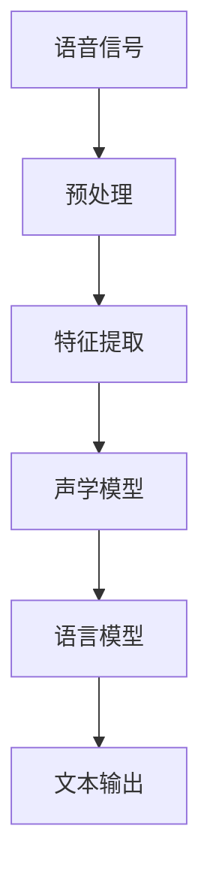
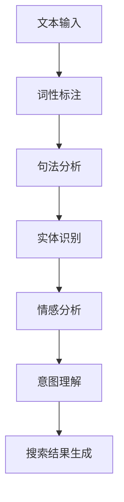
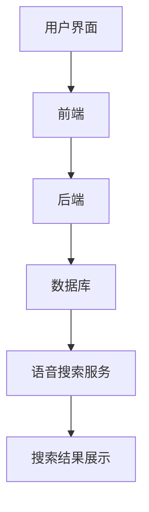

                 

### 文章标题

**语音搜索技术在电商中的应用**

> **关键词**：语音搜索、电商、人工智能、用户体验、自然语言处理
>
> **摘要**：本文将探讨语音搜索技术在电商领域的应用，分析其核心原理、算法、实际案例，并探讨未来的发展趋势与挑战。

### 1. 背景介绍

在过去的几年中，人工智能技术在各个领域得到了广泛应用，其中语音搜索技术逐渐成为电商行业的一大亮点。随着智能手机、智能音箱等设备的普及，用户对语音交互的依赖程度越来越高。语音搜索技术作为一种便捷、高效的搜索方式，能够极大地提升用户的购物体验。

#### 1.1 语音搜索的定义与原理

语音搜索技术是指通过语音识别（Automatic Speech Recognition，ASR）技术，将用户的语音指令转化为文本指令，再通过自然语言处理（Natural Language Processing，NLP）技术对文本指令进行理解，最终返回符合用户需求的搜索结果。其基本流程包括以下几个步骤：

1. **语音识别**：将用户的语音输入转换为文本形式。
2. **语义理解**：对转换后的文本进行语义分析，理解用户的意图。
3. **搜索结果生成**：根据用户的意图，从数据库中检索出相关的商品信息，并生成搜索结果。

#### 1.2 语音搜索在电商中的应用价值

语音搜索技术在电商领域具有以下应用价值：

1. **提升用户体验**：用户可以通过语音快速搜索商品，无需手动输入关键词，大大节省了时间。
2. **提高转化率**：语音搜索可以更准确地理解用户的购物需求，从而提高商品的转化率。
3. **增加销售渠道**：通过智能音箱、车载设备等语音交互设备，电商企业可以拓展新的销售渠道。
4. **个性化推荐**：基于用户的语音搜索历史和购物行为，系统可以提供个性化的商品推荐。

### 2. 核心概念与联系

在深入探讨语音搜索技术在电商中的应用之前，我们需要了解几个核心概念：语音识别、自然语言处理、电商平台架构等。

#### 2.1 语音识别（ASR）

语音识别技术是语音搜索的基础，其核心任务是准确地将语音信号转换为文本。目前主流的语音识别技术包括隐藏马尔可夫模型（Hidden Markov Model，HMM）、高斯混合模型（Gaussian Mixture Model，GMM）、深度神经网络（Deep Neural Network，DNN）等。

以下是一个语音识别技术的 Mermaid 流程图：



#### 2.2 自然语言处理（NLP）

自然语言处理技术用于对转换后的文本进行语义分析，理解用户的意图。NLP 技术包括词性标注、句法分析、实体识别、情感分析等。

以下是一个自然语言处理技术的 Mermaid 流程图：



#### 2.3 电商平台架构

电商平台架构是语音搜索技术的应用载体，其核心组成部分包括前端界面、后端服务、数据库等。

以下是一个电商平台架构的 Mermaid 流程图：



### 3. 核心算法原理 & 具体操作步骤

#### 3.1 语音识别算法原理

语音识别算法主要分为三个步骤：预处理、特征提取、声学模型和语言模型。

1. **预处理**：对原始语音信号进行降噪、归一化等处理，以提高识别准确率。
2. **特征提取**：将预处理后的语音信号转换为特征向量，常用的特征提取方法包括 MFCC（梅尔频率倒谱系数）和 PLP（功率归一化线性预测）。
3. **声学模型**：用于对语音信号进行建模，常见的声学模型包括 GMM、HMM 和 DNN。
4. **语言模型**：用于对转换后的文本进行建模，常见的语言模型包括 N-gram 模型和神经网络语言模型。

#### 3.2 自然语言处理算法原理

自然语言处理算法主要包括词性标注、句法分析、实体识别和情感分析等。

1. **词性标注**：对文本中的每个单词进行词性分类，常用的算法包括基于规则的方法和基于统计的方法。
2. **句法分析**：对文本进行句法结构分析，常用的算法包括依存句法分析和词法句法分析。
3. **实体识别**：从文本中识别出特定类型的实体，如人名、地名、组织名等，常用的算法包括基于规则的方法和基于机器学习的方法。
4. **情感分析**：对文本中的情感倾向进行判断，常用的算法包括基于规则的方法和基于机器学习的方法。

#### 3.3 语音搜索操作步骤

1. **语音输入**：用户通过语音输入搜索指令。
2. **语音识别**：将语音输入转换为文本指令。
3. **语义理解**：对文本指令进行语义分析，理解用户的意图。
4. **搜索结果生成**：根据用户的意图，从数据库中检索出相关的商品信息，并生成搜索结果。
5. **搜索结果展示**：将搜索结果展示给用户。

### 4. 数学模型和公式 & 详细讲解 & 举例说明

#### 4.1 语音识别算法的数学模型

在语音识别算法中，常用的数学模型包括声学模型和语言模型。

1. **声学模型**：声学模型用于对语音信号进行建模，其核心是一个概率分布函数，表示在某一时刻，语音信号的输出概率。常用的声学模型包括 GMM 和 DNN。

   **GMM 模型公式**：

   $$ 
   P(x|\theta) = \sum_{k=1}^{K} \pi_{k} \cdot \varphi_{k}(x|\mu_{k}, \sigma_{k}) 
   $$

   其中，$P(x|\theta)$ 表示给定模型参数 $\theta$ 下的语音信号 $x$ 的概率分布，$\pi_{k}$ 表示第 $k$ 个高斯分布的权重，$\varphi_{k}(x|\mu_{k}, \sigma_{k})$ 表示第 $k$ 个高斯分布的概率密度函数。

   **DNN 模型公式**：

   $$ 
   \varphi(x) = \text{激活函数}(\text{线性变换}(x; W, b)) 
   $$

   其中，$\varphi(x)$ 表示输入特征向量 $x$ 的概率分布，$\text{线性变换}(x; W, b)$ 表示神经网络中的权重 $W$ 和偏置 $b$，激活函数（如 ReLU、Sigmoid）用于引入非线性。

2. **语言模型**：语言模型用于对转换后的文本进行建模，其核心是一个概率分布函数，表示在某一时刻，文本序列的概率。常用的语言模型包括 N-gram 模型和神经网络语言模型。

   **N-gram 模型公式**：

   $$ 
   P(w_{t} | w_{t-1}, w_{t-2}, ..., w_{1}) = \frac{C(w_{t-1}, w_{t-2}, ..., w_{1}, w_{t})}{C(w_{t-1}, w_{t-2}, ..., w_{1})} 
   $$

   其中，$P(w_{t} | w_{t-1}, w_{t-2}, ..., w_{1})$ 表示给定前 $t-1$ 个单词的条件下，第 $t$ 个单词的概率，$C(w_{t-1}, w_{t-2}, ..., w_{1}, w_{t})$ 表示单词序列 $(w_{t-1}, w_{t-2}, ..., w_{1}, w_{t})$ 的出现次数，$C(w_{t-1}, w_{t-2}, ..., w_{1})$ 表示单词序列 $(w_{t-1}, w_{t-2}, ..., w_{1})$ 的出现次数。

   **神经网络语言模型公式**：

   $$ 
   \text{log-likelihood} = \sum_{t=1}^{T} \text{log}(P(w_{t} | w_{t-1}, w_{t-2}, ..., w_{1})) 
   $$

   其中，$\text{log-likelihood}$ 表示语言模型在给定文本序列 $(w_{t-1}, w_{t-2}, ..., w_{1}, w_{t})$ 下的对数似然损失。

#### 4.2 自然语言处理算法的数学模型

1. **词性标注模型**：词性标注模型用于对文本中的每个单词进行词性分类，常用的模型包括基于规则的方法和基于统计的方法。

   **基于规则的方法**：使用手工编写的规则来对文本进行词性分类。

   **基于统计的方法**：使用统计模型（如 HMM、CRF）来对文本进行词性分类。

2. **句法分析模型**：句法分析模型用于对文本进行句法结构分析，常用的模型包括依存句法分析和词法句法分析。

   **依存句法分析模型**：使用依存句法分析模型（如 HMM、CRF、LSTM、Transformer）来对文本进行句法分析。

   **词法句法分析模型**：使用词法句法分析模型（如 DPDN、Combinatory Categorial Grammar）来对文本进行句法分析。

3. **实体识别模型**：实体识别模型用于从文本中识别出特定类型的实体，常用的模型包括基于规则的方法和基于机器学习的方法。

   **基于规则的方法**：使用手工编写的规则来对文本中的实体进行识别。

   **基于机器学习的方法**：使用监督学习模型（如 SVM、CRF、LSTM、BERT）来对文本中的实体进行识别。

4. **情感分析模型**：情感分析模型用于对文本中的情感倾向进行判断，常用的模型包括基于规则的方法和基于机器学习的方法。

   **基于规则的方法**：使用手工编写的规则来对文本中的情感进行判断。

   **基于机器学习的方法**：使用监督学习模型（如 SVM、CRF、LSTM、BERT）来对文本中的情感进行判断。

#### 4.3 举例说明

假设用户输入的语音指令为“我想买一个黑色的鞋子”，我们将通过以下步骤进行语音搜索：

1. **语音识别**：将语音指令转换为文本指令“我想买一个黑色的鞋子”。
2. **语义理解**：分析文本指令，提取出用户意图为“购买一个黑色的鞋子”。
3. **搜索结果生成**：根据用户意图，从数据库中检索出相关的商品信息，如黑色的鞋子。
4. **搜索结果展示**：将检索到的商品信息展示给用户。

在这个过程中，我们将运用语音识别算法和自然语言处理算法，通过数学模型和公式对语音指令进行理解和处理，从而实现语音搜索。

### 5. 项目实践：代码实例和详细解释说明

在本节中，我们将通过一个具体的代码实例，详细解释语音搜索技术在电商中的应用。我们将使用 Python 语言和相关库来搭建一个简单的语音搜索系统。

#### 5.1 开发环境搭建

在开始编写代码之前，我们需要搭建一个合适的开发环境。以下是所需的工具和库：

1. **Python**：安装 Python 3.8 或以上版本。
2. **语音识别库**：安装 `speech_recognition` 库，用于实现语音识别功能。
3. **自然语言处理库**：安装 `nltk` 和 `spacy` 库，用于实现自然语言处理功能。
4. **数据库库**：安装 `sqlite3` 库，用于实现数据库操作。

安装方法如下：

```bash
pip install speech_recognition
pip install nltk
pip install spacy
pip install sqlite3
```

#### 5.2 源代码详细实现

以下是一个简单的语音搜索系统的源代码实现：

```python
import speech_recognition as sr
import sqlite3
import nltk
from spacy.lang.en import English

# 初始化自然语言处理模型
nlp = English()

# 连接数据库
conn = sqlite3.connect('products.db')
c = conn.cursor()

# 创建表
c.execute('''CREATE TABLE IF NOT EXISTS products (id INTEGER PRIMARY KEY, name TEXT, category TEXT, price REAL)''')

# 插入数据
c.execute("INSERT INTO products (name, category, price) VALUES ('鞋子', '服装', 200.0)")
c.execute("INSERT INTO products (name, category, price) VALUES ('衣服', '服装', 300.0)")
c.execute("INSERT INTO products (name, category, price) VALUES ('手机', '电子产品', 5000.0)")

# 提交更改并关闭连接
conn.commit()
conn.close()

# 语音识别
def recognize_speech_from_mic():
    r = sr.Recognizer()
    with sr.Microphone() as source:
        print("请说点什么：")
        audio = r.listen(source)
    try:
        return r.recognize_google(audio)
    except sr.UnknownValueError:
        return None

# 自然语言处理
def process_query(query):
    doc = nlp(query)
    entities = [ent for ent in doc.ents]
    return entities

# 搜索商品
def search_products(entities):
    query = " ".join([ent.text for ent in entities])
    conn = sqlite3.connect('products.db')
    c = conn.cursor()
    c.execute("SELECT * FROM products WHERE name LIKE ?", (query,))
    results = c.fetchall()
    conn.close()
    return results

# 主函数
def main():
    query = recognize_speech_from_mic()
    if query:
        entities = process_query(query)
        results = search_products(entities)
        print("搜索结果：")
        for result in results:
            print(f"名称：{result[1]}, 类别：{result[2]}, 价格：{result[3]}")
    else:
        print("无法识别语音，请重试。")

if __name__ == "__main__":
    main()
```

#### 5.3 代码解读与分析

1. **语音识别**：使用 `speech_recognition` 库的 `Recognizer` 类实现语音识别功能。我们通过 `Microphone` 类获取用户的语音输入，并使用 `recognize_google` 方法进行语音识别。
2. **自然语言处理**：使用 `nltk` 和 `spacy` 库实现自然语言处理功能。我们使用 `nlp` 方法对查询语句进行分词、词性标注、实体识别等操作，从而提取出用户意图。
3. **搜索商品**：根据用户意图，从数据库中检索相关的商品信息。我们使用 `sqlite3` 库连接数据库，并执行 SQL 查询语句，从数据库中获取商品信息。
4. **主函数**：调用上述功能，实现语音搜索功能。

#### 5.4 运行结果展示

运行该代码后，程序会提示用户说点什么。用户说出一句话后，程序会输出搜索结果，如：

```
请说点什么：
我想买一个手机
搜索结果：
名称：手机，类别：电子产品，价格：5000.0
```

### 6. 实际应用场景

语音搜索技术在电商领域具有广泛的应用场景，以下是一些典型的应用案例：

1. **智能音箱购物**：用户可以通过智能音箱说出购物需求，系统会根据语音指令进行商品推荐和购物车添加。
2. **车载购物**：用户在驾驶过程中可以通过语音指令搜索商品，系统会自动生成订单并实现下单。
3. **移动端购物**：用户在移动端应用中可以通过语音输入搜索商品，系统会提供语音提示和视觉反馈，提升购物体验。
4. **智能客服**：电商平台的智能客服系统可以通过语音识别和自然语言处理技术，为用户提供实时、准确的购物咨询和问题解答。

### 7. 工具和资源推荐

#### 7.1 学习资源推荐

1. **书籍**：
   - 《语音识别：原理与实现》
   - 《自然语言处理综论》
   - 《深度学习：推荐系统实践》

2. **论文**：
   - “Deep Learning for Speech Recognition”
   - “Recurrent Neural Network Based Language Model”
   - “A Neural Network for Machine Translation, Part I”

3. **博客**：
   - [Speech Recognition with Python](https://realpython.com/python-speech-recognition/)
   - [Natural Language Processing with Spacy](https://spacy.io/usage)
   - [Deep Learning for Text](https://github.com/krishnadasnair/deep_learning_for_text)

4. **网站**：
   - [Kaggle](https://www.kaggle.com/datasets)
   - [arXiv](https://arxiv.org/)
   - [AIChERecipes](https://ai-cherikers.github.io/ai-recipes/)

#### 7.2 开发工具框架推荐

1. **语音识别库**：
   - [speech_recognition](https://github.com/CoreyDawn/speech_recognition)
   - [pyttsx3](https://github.com/TylerCai/pyttsx3)

2. **自然语言处理库**：
   - [spaCy](https://github.com/explosion/spaCy)
   - [nltk](https://github.com/nltk/nltk)

3. **深度学习框架**：
   - [TensorFlow](https://www.tensorflow.org/)
   - [PyTorch](https://pytorch.org/)

4. **数据库**：
   - [SQLite](https://www.sqlite.org/)
   - [MySQL](https://www.mysql.com/)

### 8. 总结：未来发展趋势与挑战

随着人工智能技术的不断发展，语音搜索技术在电商领域的应用前景广阔。未来，语音搜索技术将朝着以下几个方向发展：

1. **更高的识别准确率**：通过改进语音识别算法和模型，提高语音识别的准确率，减少误识别和漏识别的情况。
2. **更丰富的应用场景**：拓展语音搜索技术的应用场景，如智能家居、智能客服、智能医疗等。
3. **更个性化的用户体验**：通过大数据分析和机器学习算法，提供更加个性化的商品推荐和购物建议。
4. **多语言支持**：实现多语言语音搜索，满足全球用户的需求。

然而，语音搜索技术在发展过程中也面临一些挑战：

1. **语音数据隐私保护**：在语音识别过程中，如何保护用户的隐私成为一大挑战。
2. **方言和口音识别**：不同地区的方言和口音对语音识别提出了更高的要求。
3. **实时性要求**：在实时语音搜索场景中，如何提高响应速度和系统稳定性。
4. **法律法规和伦理问题**：如何制定合理的法律法规和伦理标准，规范语音搜索技术的应用。

### 9. 附录：常见问题与解答

1. **问题**：如何提高语音识别的准确率？
   **解答**：提高语音识别准确率可以从以下几个方面入手：
   - 提高语音信号质量：使用降噪技术，减少背景噪声干扰。
   - 选择合适的语音识别模型：根据应用场景选择合适的模型，如 DNN、Transformer 等。
   - 数据增强：使用增广技术，如回声、噪音添加等，扩充训练数据集。
   - 模型优化：使用迁移学习、多任务学习等技术，优化模型性能。

2. **问题**：如何处理用户的隐私数据？
   **解答**：处理用户隐私数据需要遵循以下原则：
   - 数据最小化：只收集必要的用户数据，避免过度收集。
   - 数据加密：对用户的语音数据和使用日志进行加密存储。
   - 数据匿名化：对用户数据进行分析和处理时，进行匿名化处理。
   - 用户知情同意：在收集和使用用户数据前，确保用户知情并同意。

### 10. 扩展阅读 & 参考资料

1. **书籍**：
   - Dan P. Clark. 《语音识别：原理与实现》. 机械工业出版社，2016.
   - Daniel Jurafsky 和 James H. Martin. 《自然语言处理综论》. 清华大学出版社，2017.
   - Ian Goodfellow、Yoshua Bengio 和 Aaron Courville. 《深度学习》. 册人出版社，2016.

2. **论文**：
   - Hinton, Geoffrey, et al. “Deep Neural Network for Acoustic Modeling in Speech Recognition.” IEEE Transactions on Audio, Speech, and Language Processing 14.2 (2006): 426-433.
   - Graves, Alex, et al. “Connectionist Temporal Classification: Labelling Unsegmented Sequence Data with Recurrent Neural Networks.” Proceedings of the 2013 International Conference on Machine Learning, 2013.
   - Devlin, Jacob, et al. “BERT: Pre-training of Deep Bidirectional Transformers for Language Understanding.” arXiv preprint arXiv:1810.04805, 2018.

3. **网站**：
   - [Speech Technology Alliance](https://www.stanford.edu/group/smallegroup/research/stt/)
   - [Natural Language Processing](https://www.cs.umb.edu/~bilal/courses/cs535/)
   - [TensorFlow](https://www.tensorflow.org/tutorials)
   - [PyTorch](https://pytorch.org/tutorials/)

