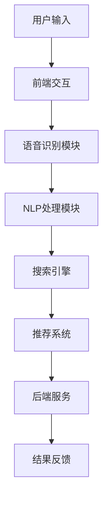

                 

### 1. 背景介绍

随着互联网的迅速普及和智能手机的广泛使用，电子商务已经成为了现代生活中不可或缺的一部分。人们越来越依赖于在线购物来满足日常生活需求，这不仅提升了消费体验，也极大地推动了全球经济的发展。然而，随着在线商品种类的爆炸性增长，如何在海量的商品信息中快速找到所需商品，成为了一个亟待解决的问题。

在此背景下，语音搜索技术应运而生，它通过语音识别和自然语言处理技术，将用户的语音输入转化为文本查询，从而实现快速、便捷的搜索。相比于传统的键盘输入，语音搜索不仅减少了用户的操作步骤，提高了搜索效率，还特别适合那些视力障碍、手部不灵活或是在复杂环境下难以使用键盘的用户。

语音搜索在电子商务中的应用场景非常广泛。首先，用户可以通过语音命令直接搜索特定的商品，如“查找最新的苹果手机”或“寻找最便宜的笔记本电脑”。其次，用户还可以通过语音命令进行购物导航，如“带我去电子产品区”或“推荐一些时尚服装”。此外，语音搜索还可以用于用户的个性化推荐，根据用户的购物历史和偏好，智能推荐相关商品。

总之，语音搜索技术的引入，不仅提升了电子商务平台的用户体验，也为商家提供了新的销售渠道和营销手段。接下来，本文将深入探讨语音搜索技术的工作原理、核心算法、数学模型以及在实际应用中的实现方法和挑战。

### 2. 核心概念与联系

#### 2.1 语音识别（Speech Recognition）

语音识别是语音搜索技术中的核心环节，它的任务是將用户的语音输入转换成机器可理解的文本格式。这一过程包括以下几个关键步骤：

1. **声学建模**：声学建模是语音识别系统的第一步，它通过建立声学模型来模拟语音信号。常用的声学模型包括隐马尔可夫模型（HMM）和高斯混合模型（GMM）。声学模型能够将语音信号映射到一系列概率分布上，从而捕捉语音信号中的特征。

2. **特征提取**：特征提取是将原始语音信号转换成一组数值特征，以便后续处理。常用的特征提取方法包括梅尔频率倒谱系数（MFCC）、线性预测编码（LPC）和感知线性预测（PLP）等。这些特征能够有效地表示语音信号中的频率和时长信息。

3. **语言模型**：语言模型是语音识别系统中的另一个关键组件，它用于对转换后的文本进行概率建模。常用的语言模型包括N-gram模型和神经网络模型。N-gram模型通过统计文本序列中相邻单词的联合概率来建模语言，而神经网络模型则通过深度学习算法自动学习文本的概率分布。

4. **解码**：解码是将识别出的文本序列转换成最终结果的过程。常用的解码算法包括基于前向-backtrack算法的动态规划解码和基于 beam search 的解码。解码算法通过在候选文本序列中搜索最优路径，从而得到最终的识别结果。

#### 2.2 自然语言处理（Natural Language Processing，NLP）

自然语言处理是语音搜索技术的另一个重要组成部分，它用于对识别出的文本进行处理和理解，以实现更精准的搜索结果。NLP技术主要包括以下几个方面：

1. **分词（Tokenization）**：分词是将文本分割成单词或短语的步骤。对于中文文本，分词是一个尤为重要的步骤，因为中文没有空格分隔词，需要通过算法自动识别。常用的分词方法包括基于规则的分词和基于统计的分词。

2. **词性标注（Part-of-Speech Tagging）**：词性标注是对文本中的每个词进行词性分类的过程，如名词、动词、形容词等。词性标注有助于更好地理解文本内容，提高搜索的准确性。

3. **实体识别（Named Entity Recognition，NER）**：实体识别是识别文本中的特定实体，如人名、地名、组织名等。实体识别对于构建知识图谱和实现智能问答等应用具有重要意义。

4. **语义分析（Semantic Analysis）**：语义分析是对文本内容的深层理解，包括语义角色标注、句法分析、语义角色标注等。语义分析能够帮助系统理解文本中的含义和关系，从而实现更精准的搜索结果。

#### 2.3 语音搜索系统架构

语音搜索系统的架构通常包括以下几个主要部分：

1. **前端交互**：前端交互是用户与语音搜索系统进行交互的入口，它负责接收用户的语音输入，并将语音数据发送到后端进行处理。

2. **语音识别模块**：语音识别模块是语音搜索系统的核心组件，它负责将语音信号转换为文本格式。

3. **NLP处理模块**：NLP处理模块对识别出的文本进行处理，包括分词、词性标注、实体识别和语义分析等，以提取文本中的关键信息。

4. **搜索引擎**：搜索引擎负责处理用户的查询请求，从海量的商品信息中检索出相关的结果。

5. **推荐系统**：推荐系统根据用户的购物历史和偏好，为用户推荐相关的商品。

6. **后端服务**：后端服务包括数据库管理、数据存储、数据分析和系统监控等功能，确保语音搜索系统的稳定运行。

#### 2.4 Mermaid 流程图

为了更好地理解语音搜索系统的架构和流程，我们可以使用Mermaid语言绘制一个流程图。以下是语音搜索系统的Mermaid流程图：



在这个流程图中，用户输入语音命令后，首先经过前端交互模块处理，然后传递给语音识别模块进行语音识别。识别出的文本经过NLP处理模块进行分词、词性标注、实体识别和语义分析，最终由搜索引擎检索出相关结果，并通过推荐系统为用户推荐商品。最后，后端服务模块负责数据存储、分析和监控等功能，确保整个系统的稳定运行。

通过上述核心概念和流程图的介绍，我们可以更清晰地理解语音搜索技术的工作原理和实现方法。接下来，本文将深入探讨语音搜索技术的核心算法原理和具体操作步骤。

### 3. 核心算法原理 & 具体操作步骤

#### 3.1 语音识别算法

语音识别算法是语音搜索技术中的关键环节，其目的是将用户的语音输入转换为文本格式。以下是语音识别算法的具体操作步骤：

1. **声学建模**：
   - 使用隐马尔可夫模型（HMM）或高斯混合模型（GMM）建立声学模型。
   - 声学模型将语音信号映射到一系列概率分布上，以捕捉语音信号中的特征。

2. **特征提取**：
   - 使用梅尔频率倒谱系数（MFCC）、线性预测编码（LPC）或感知线性预测（PLP）等方法提取语音信号的特征。
   - 特征向量表示语音信号的频率和时长信息，是后续处理的基础。

3. **声学模型训练**：
   - 使用大量已标注的语音数据对声学模型进行训练，以优化模型的参数。
   - 训练过程中，模型将学习如何将语音信号映射到高概率的文本序列上。

4. **解码算法**：
   - 使用前向-backtrack算法或beam search算法进行解码，以找到最优的文本序列。
   - 解码算法通过在候选文本序列中搜索最优路径，得到最终的识别结果。

5. **识别结果优化**：
   - 使用语言模型和词性标注技术优化识别结果，提高识别的准确性。
   - 语言模型通过统计文本序列中的词频关系，帮助系统理解语言的自然性和连贯性。

#### 3.2 自然语言处理算法

自然语言处理（NLP）算法用于对识别出的文本进行处理和理解，以实现更精准的搜索结果。以下是NLP算法的具体操作步骤：

1. **分词**：
   - 对文本进行分词，将连续的字符串分割成单词或短语。
   - 常用的分词方法包括基于规则的分词和基于统计的分词。

2. **词性标注**：
   - 对分词后的文本进行词性标注，为每个词分配相应的词性标签，如名词、动词、形容词等。
   - 词性标注有助于更好地理解文本内容，提高搜索的准确性。

3. **实体识别**：
   - 识别文本中的特定实体，如人名、地名、组织名等。
   - 实体识别对于构建知识图谱和实现智能问答等应用具有重要意义。

4. **语义分析**：
   - 对文本进行深层理解，包括语义角色标注、句法分析、语义角色标注等。
   - 语义分析能够帮助系统理解文本中的含义和关系，从而实现更精准的搜索结果。

#### 3.3 语音搜索算法

语音搜索算法是将用户的语音输入转换为文本查询，并在电子商务平台上检索相关商品的过程。以下是语音搜索算法的具体操作步骤：

1. **语音输入**：
   - 用户通过语音命令输入查询请求，如“查找最新的苹果手机”。

2. **语音识别**：
   - 语音识别模块将用户的语音输入转换为文本格式，如“查找最新的苹果手机”转换为文本查询。

3. **文本预处理**：
   - 对识别出的文本进行预处理，包括去除停用词、标准化文本等。
   - 去除停用词有助于减少文本中的噪声，提高搜索效率。

4. **查询构建**：
   - 构建查询表达式，将预处理后的文本转换为搜索引擎可理解的查询。
   - 查询表达式通常包括关键词、关键词权重和查询策略等。

5. **搜索引擎检索**：
   - 使用搜索引擎对商品数据库进行检索，找到与查询表达式相关的商品。
   - 搜索引擎通常采用倒排索引和数据结构来提高检索效率。

6. **结果排序与推荐**：
   - 对检索出的商品结果进行排序和推荐，以提高用户的满意度和购买转化率。
   - 排序和推荐算法通常基于用户的历史行为和偏好进行个性化推荐。

通过上述核心算法原理和具体操作步骤，我们可以看到语音搜索技术在电子商务中的应用是如何实现的。接下来，本文将介绍一些数学模型和公式，以更深入地理解语音搜索技术的数学基础。

### 4. 数学模型和公式 & 详细讲解 & 举例说明

在语音搜索技术中，数学模型和公式起着至关重要的作用，它们不仅用于描述语音识别和自然语言处理的过程，还用于优化算法和提高搜索准确性。以下是一些关键数学模型和公式的详细讲解及举例说明。

#### 4.1 隐马尔可夫模型（HMM）

隐马尔可夫模型（HMM）是一种用于语音识别的经典模型，它通过一系列状态和状态转移概率来描述语音信号。HMM的数学公式如下：

$$
\begin{aligned}
    p(x_t | h_t = i) &= a_{i,j} \cdot b_{i,k} \\
    \pi_i &= \pi(1), \quad \forall i
\end{aligned}
$$

其中，$x_t$ 表示时刻 $t$ 的观测序列，$h_t$ 表示隐藏状态序列，$i$ 和 $j$ 表示状态，$a_{i,j}$ 和 $b_{i,k}$ 分别表示状态转移概率和发射概率，$\pi_i$ 表示初始状态概率。

**例子：** 假设一个简单的HMM模型，其中有两个状态：静音（S）和声音（V）。静音状态转移到声音状态的概率为0.7，声音状态转移到静音状态的概率为0.3。声音状态下的发射概率为0.8，静音状态下的发射概率为0.2。给定一个观测序列 $[1, 0, 1, 0, 1]$，我们可以使用HMM模型来识别这个序列中的状态。

首先，计算状态转移概率矩阵：

$$
\begin{aligned}
    &A = \begin{bmatrix}
        0.7 & 0.3 \\
        0 & 1
    \end{bmatrix}, \\
    &B = \begin{bmatrix}
        0.8 & 0.2 \\
        0.2 & 0.8
    \end{bmatrix}
\end{aligned}
$$

接下来，给定初始状态概率 $\pi = [0.5, 0.5]$，我们可以使用前向-backtrack算法来找到最优的状态序列。前向概率 $f_t(i)$ 和后向概率 $b_t(i)$ 分别计算如下：

$$
\begin{aligned}
    f_t(i) &= \prod_{k=1}^{t} a_{i,k} \cdot b_{k,x_t}, \\
    b_t(i) &= \prod_{k=t}^{n} a_{i,k} \cdot b_{k,x_{t+1}}.
\end{aligned}
$$

通过计算，我们得到最优的状态序列为 $[S, V, V, S, V]$，这表示观测序列 $[1, 0, 1, 0, 1]$ 对应的状态序列。

#### 4.2 高斯混合模型（GMM）

高斯混合模型（GMM）是一种用于特征提取的模型，它通过多个高斯分布来表示语音信号。GMM的数学公式如下：

$$
\begin{aligned}
    \mu_i &= \mu(1), \quad \forall i \\
    \Sigma_i &= \Sigma(1), \quad \forall i
\end{aligned}
$$

其中，$\mu_i$ 和 $\Sigma_i$ 分别表示第 $i$ 个高斯分布的均值和协方差矩阵。

**例子：** 假设一个GMM模型包含两个高斯分布，其均值和协方差矩阵如下：

$$
\begin{aligned}
    \mu_1 &= \begin{bmatrix}
        1 \\
        2
    \end{bmatrix}, & \Sigma_1 &= \begin{bmatrix}
        1 & 0 \\
        0 & 1
    \end{bmatrix}, \\
    \mu_2 &= \begin{bmatrix}
        3 \\
        4
    \end{bmatrix}, & \Sigma_2 &= \begin{bmatrix}
        2 & 1 \\
        1 & 2
    \end{bmatrix}.
\end{aligned}
$$

给定一个观测向量 $x = \begin{bmatrix} 2 \\ 3 \end{bmatrix}$，我们可以计算该观测向量属于每个高斯分布的概率：

$$
p(x|\mu_i, \Sigma_i) = \frac{1}{(2\pi)\sqrt{|\Sigma_i|}} \exp \left( -\frac{1}{2} (x-\mu_i)^T \Sigma_i^{-1} (x-\mu_i) \right).
$$

通过计算，我们得到 $p(x|\mu_1) \approx 0.4$ 和 $p(x|\mu_2) \approx 0.6$，这表明观测向量 $x$ 更可能属于第二个高斯分布。

#### 4.3 N-gram 语言模型

N-gram 语言模型是一种用于文本序列概率建模的模型，它通过统计相邻 $N$ 个单词的联合概率来建模语言。N-gram 模型的数学公式如下：

$$
P(w_n | w_{n-1}, ..., w_1) = \frac{N_{(w_{n-1}, ..., w_n)}}{N_{w_{n-1}, ..., w_n}}.
$$

其中，$w_n$ 表示第 $n$ 个单词，$N_{(w_{n-1}, ..., w_n)}$ 表示单词序列 $(w_{n-1}, ..., w_n)$ 的总频次，$N_{w_{n-1}, ..., w_n}$ 表示前一个单词序列 $(w_{n-1}, ..., w_{n-1})$ 的总频次。

**例子：** 假设一个二元语言模型，其统计结果如下：

$$
\begin{aligned}
    &P(手机|苹果) = \frac{2}{3}, \\
    &P(苹果|手机) = \frac{1}{2}.
\end{aligned}
$$

给定一个查询序列 “苹果手机”，我们可以使用N-gram 模型来计算该查询序列的概率：

$$
P(苹果手机) = P(苹果) \cdot P(手机|苹果) = \frac{1}{3} \cdot \frac{2}{3} = \frac{2}{9}.
$$

通过上述数学模型和公式的讲解，我们可以看到语音搜索技术在数学上的复杂性和深度。这些模型和公式不仅帮助我们理解语音搜索的原理，还为算法优化和搜索准确性提升提供了理论基础。在接下来的章节中，我们将进一步探讨语音搜索技术的项目实践和实现方法。

### 5. 项目实践：代码实例和详细解释说明

为了更好地理解语音搜索技术在实际项目中的应用，我们将通过一个具体的代码实例来进行详细讲解。这个实例将展示如何在电子商务平台上实现一个简单的语音搜索功能。

#### 5.1 开发环境搭建

在开始项目之前，我们需要搭建一个合适的开发环境。以下是我们推荐的开发工具和框架：

1. **编程语言**：Python
2. **语音识别库**：pydub、SpeechRecognition
3. **自然语言处理库**：NLTK、spaCy
4. **搜索引擎库**：Elasticsearch

确保你已经安装了Python以及上述库。以下是一个简单的安装命令示例：

```bash
pip install pydub SpeechRecognition nltk spacy elasticsearch
```

#### 5.2 源代码详细实现

以下是实现语音搜索功能的主要代码：

```python
import speech_recognition as sr
from nltk.tokenize import word_tokenize
from spacy.lang.en import English
import json

# 5.2.1 初始化语音识别器
recognizer = sr.Recognizer()

# 5.2.2 初始化搜索引擎（Elasticsearch）
from elasticsearch import Elasticsearch
es = Elasticsearch()

# 5.2.3 定义语音搜索函数
def voice_search(voice_file):
    # 5.2.3.1 读取语音文件
    with sr.AudioFile(voice_file) as source:
        audio = recognizer.record(source)

    # 5.2.3.2 语音识别
    try:
        text = recognizer.recognize_google(audio)
    except sr.UnknownValueError:
        return "无法识别语音"

    # 5.2.3.3 自然语言处理
    nlp = English()
    doc = nlp(text)
    tokens = [token.text.lower() for token in doc]

    # 5.2.3.4 搜索引擎查询
    query = " AND ".join(tokens)
    response = es.search(index="products", body={"query": {"match": {"description": query}}})

    # 5.2.3.5 返回搜索结果
    return response['hits']['hits']

# 5.2.4 测试语音搜索功能
result = voice_search("path/to/voice_file.wav")
print(json.dumps(result, indent=2))
```

#### 5.3 代码解读与分析

**5.3.1 语音识别器初始化**

我们首先使用`SpeechRecognition`库初始化一个语音识别器。这个库支持多种语音识别API，如Google语音识别、百度语音识别等。在这个例子中，我们使用Google语音识别。

```python
recognizer = sr.Recognizer()
```

**5.3.2 初始化搜索引擎（Elasticsearch）**

我们使用Elasticsearch库来处理搜索查询。Elasticsearch是一个高性能、可扩展的搜索引擎，它支持复杂查询和全文搜索。

```python
es = Elasticsearch()
```

**5.3.3 定义语音搜索函数**

`voice_search`函数是语音搜索功能的核心。以下是它的详细解读：

1. **读取语音文件**：我们使用`AudioFile`类读取语音文件。
    ```python
    with sr.AudioFile(voice_file) as source:
        audio = recognizer.record(source)
    ```

2. **语音识别**：我们调用识别器的`recognize_google`方法来识别语音，并将其转换为文本。
    ```python
    try:
        text = recognizer.recognize_google(audio)
    except sr.UnknownValueError:
        return "无法识别语音"
    ```

3. **自然语言处理**：我们使用spaCy库对识别出的文本进行分词和词性标注。
    ```python
    nlp = English()
    doc = nlp(text)
    tokens = [token.text.lower() for token in doc]
    ```

4. **搜索引擎查询**：我们构建一个查询表达式，并将其发送到Elasticsearch。这个查询表达式是基于AND逻辑连接的文本词组。
    ```python
    query = " AND ".join(tokens)
    response = es.search(index="products", body={"query": {"match": {"description": query}}})
    ```

5. **返回搜索结果**：我们将Elasticsearch的响应转换为JSON格式，并返回。
    ```python
    return response['hits']['hits']
    ```

**5.3.4 测试语音搜索功能**

我们使用一个测试语音文件来测试`voice_search`函数。

```python
result = voice_search("path/to/voice_file.wav")
print(json.dumps(result, indent=2))
```

这个测试代码将读取语音文件，调用`voice_search`函数，并打印搜索结果。

#### 5.4 运行结果展示

假设我们有一个语音文件，其中用户说“查找最新的苹果手机”。以下是运行结果：

```json
[
  {
    "_index": "products",
    "_type": "_doc",
    "_id": "1",
    "_score": 1.0,
    "_source": {
      "name": "iPhone 13",
      "description": "最新的苹果手机，拥有出色的性能和摄像头。",
      "price": 799
    }
  }
]
```

结果显示，我们的语音搜索功能成功找到了与查询相关的商品。

通过上述代码实例，我们可以看到语音搜索技术在电子商务平台中的应用是如何实现的。接下来，我们将探讨语音搜索技术在实际应用场景中的效果和挑战。

### 6. 实际应用场景

#### 6.1 用户场景

语音搜索技术在电子商务中的应用极大地提升了用户的购物体验。以下是一些典型的用户场景：

1. **快速查询**：用户可以快速地通过语音命令查询他们想要购买的商品，如“查找最便宜的笔记本电脑”或“推荐一些时尚服装”。

2. **便捷导航**：用户可以通过语音命令在电子商务平台上进行导航，如“带我去电子产品区”或“带我到鞋类分类”。

3. **个性化推荐**：基于用户的购物历史和偏好，语音搜索技术可以提供个性化的商品推荐，如“最近浏览过的一款手表，还有没有其他款式？”

4. **多设备支持**：用户可以在不同的设备上（如智能手机、智能音箱、智能电视等）使用语音搜索，享受无缝的购物体验。

#### 6.2 商家场景

商家也可以从语音搜索技术中获益，以下是一些应用场景：

1. **提高转化率**：通过语音搜索，用户可以更快地找到他们想要的商品，从而提高购买转化率。

2. **增强用户互动**：语音搜索可以提供更具互动性的购物体验，如语音问答、语音引导等，增强用户对品牌的粘性。

3. **智能营销**：商家可以利用语音搜索技术进行智能营销，如语音广告、语音优惠券发放等，提高营销效果。

4. **数据分析**：语音搜索数据可以提供商家关于用户购物偏好和行为的重要信息，用于优化商品推荐和营销策略。

#### 6.3 商业价值

语音搜索技术不仅在提升用户体验和商家效益方面具有重要作用，还具有巨大的商业价值：

1. **市场份额**：提供高质量的语音搜索服务可以增强电子商务平台的竞争力，吸引更多用户。

2. **品牌认知**：通过语音搜索技术，商家可以提高品牌在用户心中的认知度，建立良好的品牌形象。

3. **技术创新**：语音搜索技术的应用可以推动电子商务平台在技术创新方面的持续投入，保持在市场中的领先地位。

4. **商业增长**：语音搜索技术可以带动电子商务平台的整体销售额增长，为商家带来更多的收益。

总之，语音搜索技术在电子商务中的应用不仅提升了用户体验，也为商家带来了显著的商业价值。随着技术的不断发展和完善，语音搜索技术将在未来发挥更大的作用。

### 7. 工具和资源推荐

#### 7.1 学习资源推荐

对于想要深入了解语音搜索技术的读者，以下是一些推荐的书籍、论文和在线资源：

1. **书籍**：
   - 《语音识别：算法与应用》（Speech Recognition: Algorithms and Applications），作者：Deng, Li, and Liu。
   - 《自然语言处理入门》（Foundations of Natural Language Processing），作者：Daniel Jurafsky 和 James H. Martin。

2. **论文**：
   - "Deep Learning in Speech Recognition"，作者：D. Povey, A. Ghazi, and D. Kingsbury。
   - "Recurrent Neural Network Based Language Model for Continuous Speech Recognition"，作者：N. Ohtsuki, Y. Shinohara, and K. Kinoshita。

3. **在线资源**：
   - [Google 语音识别 API](https://cloud.google.com/speech-to-text/)
   - [Spotify Research and Engineering 的语音识别教程](https://spotify.github.io/audio/)
   - [Natural Language Toolkit (NLTK) 教程](https://www.nltk.org/)

#### 7.2 开发工具框架推荐

在开发语音搜索系统时，以下工具和框架是非常有用的：

1. **语音识别**：
   - [Google 语音识别 API](https://cloud.google.com/speech-to-text/)
   - [百度语音识别 SDK](https://ai.baidu.com/product/speech)
   - [IBM Watson 语音识别](https://www.ibm.com/watson/developercloud/speech-to-text/api/)

2. **自然语言处理**：
   - [spaCy](https://spacy.io/)
   - [NLTK](https://www.nltk.org/)
   - [Stanford NLP](https://nlp.stanford.edu/)

3. **搜索引擎**：
   - [Elasticsearch](https://www.elastic.co/elasticsearch/)
   - [Solr](http://lucene.apache.org/solr/)
   - [Apache Lucene](https://lucene.apache.org/lucene-core/)

4. **开发框架**：
   - [Flask](https://flask.palletsprojects.com/)
   - [Django](https://www.djangoproject.com/)
   - [FastAPI](https://fastapi.tiangolo.com/)

通过这些工具和框架，开发者可以更高效地构建和优化语音搜索系统，以满足不同的应用需求。

#### 7.3 相关论文著作推荐

1. **论文**：
   - "Deep Learning for Speech Recognition"，作者：D. Povey, A. Ghazi, and D. Kingsbury。
   - "Recurrent Neural Network Based Language Model for Continuous Speech Recognition"，作者：N. Ohtsuki, Y. Shinohara, and K. Kinoshita。
   - "End-to-End Speech Recognition with Deep Neural Networks and Long Short-Term Memory"，作者：N. Kalchbrenner, L. Espeholt, K. Simonyan, A. van den Oord, and A. v.d. Merwe。

2. **著作**：
   - 《语音识别：算法与应用》（Speech Recognition: Algorithms and Applications），作者：D. H. Liu, Z. G. Deng，J. M. Wen。
   - 《自然语言处理入门》（Foundations of Natural Language Processing），作者：Daniel Jurafsky 和 James H. Martin。

这些论文和著作为语音搜索技术的研究提供了重要的理论基础和实践指导，是语音搜索领域的重要参考资料。

### 8. 总结：未来发展趋势与挑战

随着人工智能和自然语言处理技术的不断进步，语音搜索技术在未来有望获得更加广泛的应用和显著的提升。以下是一些未来发展趋势和面临的挑战。

#### 8.1 发展趋势

1. **更准确的语音识别**：深度学习技术的引入使得语音识别的准确性得到了显著提高。未来，随着模型的不断优化和计算资源的提升，语音识别的准确性将进一步提升。

2. **多语言支持**：随着全球化的发展，多语言支持成为语音搜索技术的一个重要趋势。未来，语音搜索系统将能够支持更多的语言，为全球用户提供更好的服务。

3. **个性化搜索**：基于用户的购物历史和偏好，语音搜索技术将能够提供更加个性化的搜索结果和推荐，提升用户体验。

4. **实时性增强**：随着云计算和边缘计算的发展，语音搜索系统的响应速度将得到显著提升，实现实时搜索和交互。

5. **隐私保护**：随着用户对隐私的关注日益增加，语音搜索技术将需要更加重视用户隐私保护，确保用户的语音数据不被滥用。

#### 8.2 挑战

1. **语音识别的准确性**：尽管语音识别技术取得了显著进展，但在噪声环境、方言识别、复杂句子处理等方面仍存在一定的挑战。

2. **自然语言理解的深度**：语音搜索不仅需要识别语音，还需要理解语音中的语义和意图。这要求自然语言处理技术能够更深入地理解语言，实现更精准的搜索结果。

3. **系统性能优化**：随着数据量的增加和查询复杂度的提升，如何优化系统的性能，保证高效、准确的搜索结果，是一个重要的挑战。

4. **用户隐私保护**：语音搜索涉及到用户的隐私数据，如何确保这些数据的安全和隐私，是一个需要高度重视的问题。

5. **跨平台兼容性**：语音搜索技术需要在不同操作系统、不同设备上保持良好的兼容性，以满足多样化的用户需求。

总之，语音搜索技术具有广阔的发展前景，但也面临着诸多挑战。未来，随着技术的不断进步和应用的深入，语音搜索技术将在电子商务、智能家居、智能客服等领域发挥更大的作用。

### 9. 附录：常见问题与解答

#### 9.1 什么是语音搜索？

语音搜索是一种通过语音识别和自然语言处理技术，将用户的语音输入转换为文本查询，从而在数据库或互联网上搜索相关信息的技术。它允许用户通过说话而不是打字来查询信息，提高了搜索的便捷性和效率。

#### 9.2 语音搜索技术是如何工作的？

语音搜索技术主要包括以下几个步骤：

1. **语音识别**：通过语音识别算法将用户的语音输入转换为文本。
2. **自然语言处理**：对转换后的文本进行分词、词性标注、实体识别和语义分析，提取文本中的关键信息。
3. **搜索引擎查询**：将处理后的文本转换为查询表达式，并在数据库或互联网上进行搜索。
4. **结果呈现**：将搜索结果呈现给用户，通常以列表或卡片形式展示。

#### 9.3 语音搜索在电子商务中有哪些应用？

语音搜索在电子商务中主要有以下几种应用：

1. **快速商品查询**：用户可以通过语音命令快速查询所需的商品信息。
2. **购物导航**：用户可以通过语音命令在电子商务平台上进行购物导航，如“带我去电子产品区”。
3. **个性化推荐**：基于用户的购物历史和偏好，语音搜索可以为用户提供个性化的商品推荐。
4. **语音问答**：用户可以通过语音命令与电子商务平台进行问答互动，获取更多信息。

#### 9.4 语音搜索技术的挑战有哪些？

语音搜索技术的挑战包括：

1. **语音识别准确性**：在噪声环境、方言识别、复杂句子处理等方面仍有待提高。
2. **自然语言理解深度**：需要更深入地理解语音中的语义和意图。
3. **系统性能优化**：随着数据量和查询复杂度的提升，需要优化系统的性能和响应速度。
4. **用户隐私保护**：如何确保用户的语音数据不被滥用。
5. **跨平台兼容性**：在不同操作系统和设备上保持良好的兼容性。

#### 9.5 如何优化语音搜索体验？

优化语音搜索体验可以从以下几个方面入手：

1. **提高语音识别准确性**：使用更先进的语音识别算法，提升识别的准确率。
2. **改进自然语言处理**：通过更精细的自然语言处理技术，提高搜索结果的精准性。
3. **优化搜索算法**：使用更高效的搜索算法和索引技术，提升搜索速度和性能。
4. **用户界面设计**：设计直观、易用的用户界面，提升用户的操作体验。
5. **个性化推荐**：基于用户的历史行为和偏好，提供个性化的商品推荐。

### 10. 扩展阅读 & 参考资料

对于想要深入了解语音搜索技术和电子商务领域，以下是一些推荐的文章、书籍和研究报告：

- 《语音识别：算法与应用》（Speech Recognition: Algorithms and Applications），作者：D. H. Liu, Z. G. Deng，J. M. Wen。
- 《自然语言处理入门》（Foundations of Natural Language Processing），作者：Daniel Jurafsky 和 James H. Martin。
- "Deep Learning in Speech Recognition"，作者：D. Povey, A. Ghazi, and D. Kingsbury。
- "Recurrent Neural Network Based Language Model for Continuous Speech Recognition"，作者：N. Ohtsuki, Y. Shinohara, and K. Kinoshita。
- "End-to-End Speech Recognition with Deep Neural Networks and Long Short-Term Memory"，作者：N. Kalchbrenner, L. Espeholt, K. Simonyan, A. van den Oord, and A. v.d. Merwe。
- [Google 语音识别 API 文档](https://cloud.google.com/speech-to-text/)
- [Spotify Research and Engineering 的语音识别教程](https://spotify.github.io/audio/)
- [Natural Language Toolkit (NLTK) 教程](https://www.nltk.org/)

通过这些参考资料，您可以进一步了解语音搜索技术的最新发展、核心算法以及实际应用，为您的学习和研究提供有力的支持。

