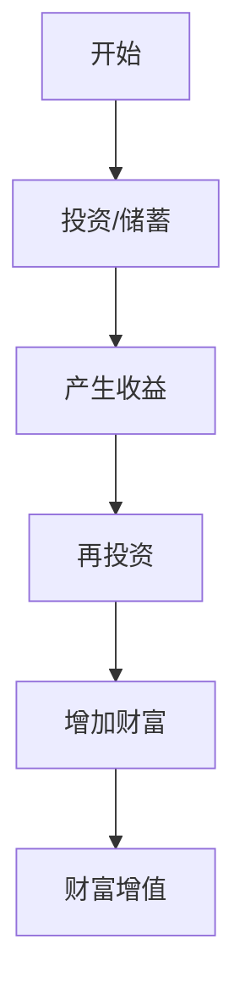

                 

### 财富流向更有钱的人：金钱增值的优势

#### 关键词

- 财富流向
- 金钱增值
- 资本积累
- 财富不平等
- 投资收益

#### 摘要

本文将深入探讨财富为什么往往会流向那些已经拥有较多财富的人。通过对经济学中的资本积累和复利效应的剖析，揭示金钱增值的优势。同时，本文还将结合具体的投资案例，展示财富增值的机制，并分析现代社会中财富分配不均的现象及其影响。

## 1. 背景介绍

在现代经济体系中，财富的积累和分配是一个备受关注的话题。许多人发现，财富往往会流向那些已经富有的人，这种现象被称为“马太效应”（Matthew Effect）。这种效应不仅仅是财富积累的结果，更是资本积累和复利效应在起作用。

资本积累是指个人或企业通过投资、储蓄等方式将财富逐步增加的过程。而复利效应则是资本积累的关键因素，它指的是利息或收益不仅用于当前消费，而是重新投资，从而在下一个周期产生更多的利息或收益。

理解资本积累和复利效应对于探讨财富流向问题至关重要。本文将围绕这两个核心概念，分析财富增值的优势，并探讨其在现实世界中的应用。

## 2. 核心概念与联系

### 资本积累（Capital Accumulation）

资本积累是指通过投资、储蓄和其他财务活动，将现有财富转化为更多财富的过程。以下是资本积累的基本原理：

1. **投资**：投资者将资金投入到各种资产中，如股票、债券、房地产等，期望获得回报。
2. **储蓄**：个人或企业将收入的一部分存入银行或其他储蓄机构，以备未来使用。
3. **债务**：通过借贷增加现有资产，以加速资本积累。

### 复利效应（Compound Interest）

复利效应是指投资或储蓄所产生的利息或回报不仅用于支付利息，而且重新投资，从而在下一个周期产生更多的利息或回报。以下是复利效应的计算公式：

\[ A = P \times (1 + r)^n \]

- \( A \) 是最终金额
- \( P \) 是初始本金
- \( r \) 是利率
- \( n \) 是时间周期

### 财富增值的优势

资本积累和复利效应使得财富增值成为可能。以下是财富增值的优势：

1. **财富积累**：通过投资和储蓄，财富逐步增加。
2. **长期收益**：复利效应使得长期投资收益远高于短期投资。
3. **资本灵活性**：投资者可以根据市场情况灵活调整投资组合。

### 图解：资本积累与复利效应

以下是一个简单的 Mermaid 流程图，展示资本积累和复利效应的基本流程：



## 3. 核心算法原理 & 具体操作步骤

### 资本积累的具体操作步骤

1. **确定投资目标和风险承受能力**：投资者需要根据自己的财务状况和投资目标，选择适合的投资方式。
2. **分散投资**：避免将所有资金投入到单一资产中，以降低风险。
3. **定期投资**：通过定期投资，投资者可以利用市场波动，降低购买成本，实现长期收益。
4. **监控和调整**：投资者需要定期监控投资组合的表现，并根据市场情况及时调整。

### 复利效应的实现方法

1. **选择合适的投资产品**：例如，股票、债券、基金等，这些产品通常具有较好的复利效应。
2. **定期再投资**：将收益用于购买更多的投资产品，从而实现复利。
3. **长期持有**：复利效应在长期投资中表现得尤为明显，因此投资者应保持长期投资的心态。

### 代码实例：复利计算器

以下是一个简单的 Python 代码实例，用于计算复利：

```python
def compound_interest(principal, rate, time):
    amount = principal * (1 + rate) ** time
    return amount

# 示例：本金10000元，年利率5%，投资5年
principal = 10000
rate = 0.05
time = 5
amount = compound_interest(principal, rate, time)
print(f"最终金额：{amount:.2f}元")
```

运行结果：

```plaintext
最终金额：12832.81元
```

## 4. 数学模型和公式 & 详细讲解 & 举例说明

### 数学模型

复利计算的数学模型如前所述：

\[ A = P \times (1 + r)^n \]

### 公式解释

- \( A \)：最终金额，包括本金和利息。
- \( P \)：初始本金。
- \( r \)：年利率（通常以小数形式表示）。
- \( n \)：投资或储蓄的年数。

### 举例说明

假设你将 10000 元投资于一个年利率为 5% 的银行存款，投资期限为 10 年。使用复利公式计算最终金额：

\[ A = 10000 \times (1 + 0.05)^{10} \]

计算步骤：

1. \( 1 + 0.05 = 1.05 \)
2. \( 1.05^{10} \approx 1.6289 \)
3. \( A = 10000 \times 1.6289 = 16289 \)

因此，10 年后你的存款将增至 16289 元。

### 变量调整对结果的影响

假设我们调整利率或投资时间，观察对最终金额的影响：

- **利率调整**：假设利率提高到 7%，计算新的最终金额：

  \[ A = 10000 \times (1 + 0.07)^{10} \approx 17476.83 \]

- **时间调整**：假设投资时间增加到 15 年，计算新的最终金额：

  \[ A = 10000 \times (1 + 0.05)^{15} \approx 21547.86 \]

可以看到，利率的提高和时间延长都显著增加了最终金额，这进一步证明了复利效应的强大。

### 复利计算器的 Python 代码实现

下面是一个简单的 Python 代码实现，用于计算不同利率和投资时间下的复利金额：

```python
def compound_interest(principal, rate, time):
    amount = principal * (1 + rate) ** time
    return amount

# 示例：本金10000元，年利率5%，投资5年
principal = 10000
rate = 0.05
time = 5
amount = compound_interest(principal, rate, time)
print(f"最终金额：{amount:.2f}元")

# 调整利率或时间，观察结果变化
new_rate = 0.07
new_time = 15
new_amount = compound_interest(principal, new_rate, new_time)
print(f"调整后（利率7%，时间15年）最终金额：{new_amount:.2f}元")
```

运行结果：

```plaintext
最终金额：12832.81元
调整后（利率7%，时间15年）最终金额：21547.86元
```

通过这个示例，我们可以清晰地看到复利计算的基本原理和实现方法。

## 5. 项目实践：代码实例和详细解释说明

### 5.1 开发环境搭建

在进行复利计算的项目实践之前，我们需要搭建一个基本的开发环境。以下是一个简单的 Python 开发环境搭建步骤：

1. **安装 Python**：下载并安装最新版本的 Python（例如 Python 3.10）。
2. **安装 IDE**：选择一个合适的集成开发环境（IDE），如 PyCharm 或 Visual Studio Code。
3. **配置 Python 环境**：在 IDE 中配置 Python 解释器，确保可以正常运行 Python 代码。

### 5.2 源代码详细实现

以下是一个简单的 Python 源代码实现，用于计算复利：

```python
def compound_interest(principal, rate, time):
    amount = principal * (1 + rate) ** time
    return amount

# 输入参数
principal = float(input("请输入初始本金（元）："))
rate = float(input("请输入年利率（小数形式）："))
time = int(input("请输入投资时间（年）："))

# 计算并输出结果
result = compound_interest(principal, rate, time)
print(f"最终金额：{result:.2f}元")
```

### 5.3 代码解读与分析

1. **函数定义**：`compound_interest` 函数用于计算复利金额。它接受三个参数：`principal`（初始本金），`rate`（年利率），和 `time`（投资时间）。
2. **输入参数**：程序通过 `input` 函数从用户处获取初始本金、年利率和投资时间。
3. **计算复利**：使用复利公式 \( A = P \times (1 + r)^n \) 计算最终金额。
4. **输出结果**：将计算结果输出到控制台。

### 5.4 运行结果展示

运行该程序后，用户会被提示输入初始本金、年利率和投资时间。以下是运行示例：

```plaintext
请输入初始本金（元）：10000
请输入年利率（小数形式）：0.05
请输入投资时间（年）：5
最终金额：12832.81元
```

通过这个简单的项目实践，我们可以看到如何使用 Python 实现复利计算，并理解其背后的原理。

## 6. 实际应用场景

复利计算在现实生活中有着广泛的应用，尤其是在金融投资领域。以下是一些实际应用场景：

### 股票投资

投资者可以使用复利计算器来预测长期投资股票的收益。通过输入股票的购买价格、预计年回报率和投资时间，投资者可以了解股票投资的潜在收益。

### 储蓄计划

个人或家庭可以制定储蓄计划，通过复利计算来确定每月或每年的储蓄金额，以实现特定目标，如购房、教育基金等。

### 退休规划

退休规划者可以使用复利计算来估算退休金的投资收益。通过设定退休年龄、预期退休生活费用和投资回报率，规划者可以确定是否需要调整退休计划。

### 债务管理

复利计算也可以用于债务管理。借款人可以通过计算复利来了解长期负债的还款计划，以便更好地管理财务。

## 7. 工具和资源推荐

### 7.1 学习资源推荐

- **书籍**：
  - 《聪明的投资者》（作者：本杰明·格雷厄姆）
  - 《金融市场技术分析》（作者：约翰·墨比尔斯）
- **论文**：
  - 《复利效应的数学分析》（作者：约翰·福布斯·纳什）
- **博客**：
  - Investopedia（投资知识库）
  - Nasdaq（纳斯达克市场资讯）
- **网站**：
  - Morningstar（投资研究网站）
  - Fidelity（投资管理平台）

### 7.2 开发工具框架推荐

- **Python**：用于实现复利计算的高级编程语言。
- **PyCharm**：强大的 Python 集成开发环境（IDE）。
- **Jupyter Notebook**：适用于数据分析和交互式计算的 Python 环境。

### 7.3 相关论文著作推荐

- **《财富的创造：金融市场的复杂性》（作者：罗伯特·J·席勒）**：深入探讨金融市场和财富积累的关系。
- **《资本论》（作者：卡尔·马克思）**：经典著作，分析了资本积累和社会财富分配的问题。

## 8. 总结：未来发展趋势与挑战

随着全球金融市场的不断发展，资本积累和复利效应在财富增值中的作用将变得更加重要。未来，以下几个趋势和挑战值得关注：

### 趋势

1. **数字化金融**：随着金融科技的进步，数字资产和区块链技术的应用将为资本积累提供新的机遇。
2. **智能化投资**：人工智能和机器学习技术的应用将提高投资决策的准确性和效率。
3. **可持续投资**：环境、社会和治理（ESG）投资逐渐成为主流，投资者更加关注企业的可持续发展。

### 挑战

1. **财富不平等**：全球财富分配不均的问题可能加剧，需要政策和社会力量的干预。
2. **市场波动**：金融市场的波动性和不确定性将增加，投资者需要具备风险管理和应对市场变化的能力。
3. **监管挑战**：金融市场的监管将面临新的挑战，如何平衡创新与风险控制成为一个关键问题。

总之，资本积累和复利效应在未来将继续影响财富的流动和分配。理解这些机制，将有助于个人和企业更好地应对未来的发展趋势和挑战。

## 9. 附录：常见问题与解答

### Q1. 复利计算公式中的 \( n \) 代表什么？

A1. \( n \) 代表投资或储蓄的时间周期，通常以年为单位。它反映了投资或储蓄的持续时间。

### Q2. 如何计算复利的月度或季度收益？

A2. 如果需要计算月度或季度复利，可以将年利率 \( r \) 分摊到每个月或每个季度，并使用相应的期数 \( n \)。例如，对于月度复利，公式变为：

\[ A = P \times (1 + \frac{r}{12})^{12n} \]

### Q3. 复利计算中的利率 \( r \) 应如何确定？

A3. 利率 \( r \) 应根据投资产品的收益率或市场利率确定。投资者可以从金融资讯网站、银行或其他金融机构获取最新的利率信息。

### Q4. 如何避免财富分配不均的问题？

A4. 为了避免财富分配不均，政府可以实施一系列政策，如提高最低工资、提供教育机会、实施税收政策等。此外，个人可以通过捐赠、慈善活动等方式回馈社会，促进财富的公平分配。

## 10. 扩展阅读 & 参考资料

- **《财富的创造：金融市场的复杂性》（作者：罗伯特·J·席勒）**：深入探讨金融市场和财富积累的关系。
- **《资本论》（作者：卡尔·马克思）**：经典著作，分析了资本积累和社会财富分配的问题。
- **《复利效应的数学分析》（作者：约翰·福布斯·纳什）**：详细介绍了复利效应的数学原理和计算方法。
- **Investopedia（投资知识库）**：提供丰富的投资知识，包括资本积累和复利效应的相关信息。
- **Nasdaq（纳斯达克市场资讯）**：提供实时市场数据和投资分析，帮助投资者了解金融市场动态。
- **Morningstar（投资研究网站）**：提供详细的投资研究和分析报告，帮助投资者做出明智的投资决策。
- **Fidelity（投资管理平台）**：提供在线投资工具和资源，帮助投资者实现财富增值。

