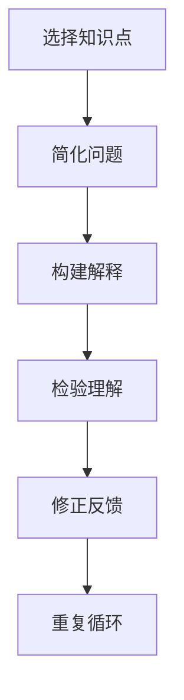
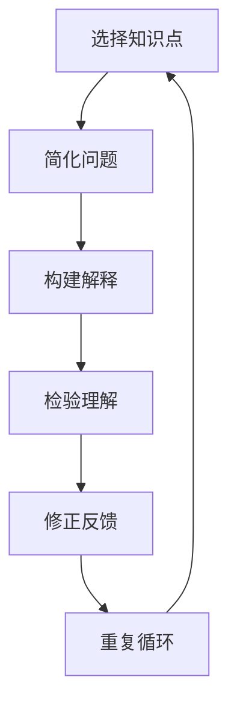

                 

### 费曼提问法：提升思考力的12个问题

> **关键词**：费曼提问法，思考力，问题解决，学习方法

> **摘要**：本文将介绍费曼提问法，一种通过提出关键问题来提升思考力和问题解决能力的方法。我们将逐步分析这一方法的原理、实践步骤和实际应用，探讨其在教育和职场中的重要性。

## 1. 背景介绍

### 1.1 费曼提问法的起源

费曼提问法起源于著名的物理学家理查德·费曼（Richard Feynman）。他在教育中提倡一种以学生为中心的教学方法，强调通过提问来引导学习。费曼提问法旨在帮助学生深入理解知识点，培养批判性思维和解决问题的能力。

### 1.2 费曼提问法的基本理念

费曼提问法的基本理念是将复杂的概念和知识点分解为简单的问题，并通过回答这些问题来加深理解。这种方法强调“教是最好的学”，通过向他人解释所学知识，来检验和巩固自己的理解。

## 2. 核心概念与联系

### 2.1 费曼提问法的原理

费曼提问法基于以下几个核心原理：

1. **简化问题**：将复杂问题分解为简单的组成部分。
2. **问题导向**：通过提问来引导思考和探索。
3. **反馈机制**：通过他人的反馈来修正和改进自己的理解。

### 2.2 费曼提问法的架构


在费曼提问法中，以下几个关键步骤相互作用：

1. **选择知识点**：确定要解释的概念或知识点。
2. **简化问题**：将复杂问题分解为简单的问题。
3. **构建解释**：用自己的语言解释问题。
4. **检验理解**：通过他人的反馈来检验自己的理解。
5. **修正反馈**：根据反馈来修正和改进解释。

### 2.3 费曼提问法的 Mermaid 流程图



## 3. 核心算法原理 & 具体操作步骤

### 3.1 费曼提问法的核心算法原理

费曼提问法是一种问题解决算法，其核心原理包括：

1. **分解问题**：将复杂问题分解为简单的组成部分。
2. **提问导向**：通过提问来引导思考和探索。
3. **反馈机制**：通过他人的反馈来检验和改进理解。

### 3.2 具体操作步骤

以下是费曼提问法的具体操作步骤：

1. **选择知识点**：确定要解释的概念或知识点。
2. **简化问题**：将复杂问题分解为简单的问题。
3. **构建解释**：用自己的语言解释问题，尽量避免使用专业术语。
4. **检验理解**：向他人（如同学、朋友或导师）解释所学知识，观察对方的反应。
5. **修正反馈**：根据他人的反馈来修正和改进自己的解释。
6. **重复循环**：重复以上步骤，直到能够清晰、简洁地解释所学知识。

### 3.3 实例演示

假设我们要解释“微积分的基本概念”。

1. **选择知识点**：微积分的基本概念。
2. **简化问题**：将微积分分解为微分和积分。
3. **构建解释**：解释微分和积分的定义、应用和关系。
4. **检验理解**：向朋友解释所学知识。
5. **修正反馈**：根据朋友的反馈来修正和改进解释。
6. **重复循环**：重复以上步骤，直到能够清晰、简洁地解释所学知识。

## 4. 数学模型和公式 & 详细讲解 & 举例说明

### 4.1 数学模型和公式

费曼提问法可以应用于各种数学模型和公式。以下是一个例子：

**微积分基本公式：**

$$
\frac{d}{dx}(f(x) + g(x)) = \frac{df}{dx} + \frac{dg}{dx}
$$

$$
\frac{d}{dx}(cf(x)) = c\frac{df}{dx}
$$

### 4.2 详细讲解

**微分的基本公式**描述了如何对函数进行微分。它指出，对两个函数的和进行微分时，可以分别对每个函数进行微分，然后将结果相加。同样，对常数倍函数进行微分时，只需将常数倍数乘以原函数的微分。

**积分的基本公式**描述了如何对函数进行积分。它指出，对两个函数的和进行积分时，可以分别对每个函数进行积分，然后将结果相加。同样，对常数倍函数进行积分时，只需将常数倍数乘以原函数的积分。

### 4.3 举例说明

假设我们要解释**微积分基本公式**。

1. **选择知识点**：微积分基本公式。
2. **简化问题**：将微积分基本公式分解为微分和积分的基本公式。
3. **构建解释**：解释微分和积分的基本公式的定义、应用和关系。
4. **检验理解**：向朋友解释所学知识。
5. **修正反馈**：根据朋友的反馈来修正和改进解释。
6. **重复循环**：重复以上步骤，直到能够清晰、简洁地解释所学知识。

## 5. 项目实践：代码实例和详细解释说明

### 5.1 开发环境搭建

为了演示费曼提问法的应用，我们将在Python中实现一个简单的算法。

**1. 安装Python**：在Windows或Mac上，可以从Python官方网站下载并安装Python。
2. **安装Jupyter Notebook**：使用pip命令安装Jupyter Notebook。
   ```shell
   pip install notebook
   ```

### 5.2 源代码详细实现

以下是一个简单的Python程序，用于计算两个数的和。

```python
def add(a, b):
    return a + b

def main():
    a = 5
    b = 3
    result = add(a, b)
    print(f"The sum of {a} and {b} is {result}.")

if __name__ == "__main__":
    main()
```

### 5.3 代码解读与分析

1. **定义函数**：我们定义了一个名为`add`的函数，用于计算两个数的和。
2. **主函数**：`main`函数用于执行程序的逻辑。
   - **变量赋值**：我们为`a`和`b`分别赋值为5和3。
   - **调用函数**：我们调用`add`函数计算两个数的和，并将结果存储在`result`变量中。
   - **打印结果**：我们使用`print`函数将结果输出到控制台。

### 5.4 运行结果展示

运行上述程序后，控制台将输出：

```
The sum of 5 and 3 is 8.
```

这表明我们的程序能够正确地计算两个数的和。

## 6. 实际应用场景

### 6.1 教育领域

费曼提问法在教育领域具有广泛的应用。教师可以使用这种方法来引导学生深入理解知识点，提高学生的批判性思维和问题解决能力。

### 6.2 职场培训

在职场培训中，费曼提问法可以帮助员工更好地理解和掌握专业知识。通过向同事或导师解释所学知识，员工可以加深对知识的理解，并在实际工作中更好地应用。

### 6.3 个人学习

个人学习者可以使用费曼提问法来巩固所学知识，提高自己的思考力和问题解决能力。通过向他人解释所学知识，个人学习者可以检验自己的理解，并修正和改进自己的解释。

## 7. 工具和资源推荐

### 7.1 学习资源推荐

- **书籍**：《费曼学习法：从学会到精通》（Feynman Technique: A Powerful Learning Method）
- **论文**：理查德·费曼的论文集
- **博客**：费曼提问法的实践和案例分析
- **网站**：费曼提问法的在线课程和教学资源

### 7.2 开发工具框架推荐

- **Jupyter Notebook**：用于编写和运行Python代码的交互式环境。
- **Visual Studio Code**：一款功能强大的代码编辑器，适用于Python编程。

### 7.3 相关论文著作推荐

- **《费曼物理学讲义》**（The Feynman Lectures on Physics）
- **《量子力学与路径积分》**（Quantum Mechanics and Path Integrals）

## 8. 总结：未来发展趋势与挑战

### 8.1 未来发展趋势

- **个性化学习**：随着人工智能技术的发展，费曼提问法有望实现个性化学习，帮助学生更好地掌握知识。
- **跨学科应用**：费曼提问法将在更多学科和领域得到应用，促进知识的交叉融合。

### 8.2 面临的挑战

- **教育资源的均衡**：确保每个学生都能获得优质的教育资源，实现公平教育。
- **师资培训**：提高教师的费曼提问法教学能力，确保其能够有效地引导学生。

## 9. 附录：常见问题与解答

### 9.1 费曼提问法是否适用于所有学科？

费曼提问法适用于大多数学科，尤其适用于那些需要深入理解和批判性思维的学科，如物理学、化学、数学和计算机科学。

### 9.2 如何评估费曼提问法的有效性？

可以通过学生或员工的学习成果、问题解决能力以及批判性思维的提高来评估费曼提问法的有效性。

## 10. 扩展阅读 & 参考资料

- **扩展阅读**：
  - 费曼提问法的实践案例分析
  - 费曼提问法在教育领域的应用研究
- **参考资料**：
  - 理查德·费曼的论文集
  - 费曼提问法的在线课程和教学资源
  - 费曼物理学讲义

### 结语

费曼提问法是一种简单而有效的方法，可以帮助我们深入理解知识，培养批判性思维和问题解决能力。通过逐步分析、实践和反思，我们可以不断提升自己的思考力和学习能力。

> **作者：禅与计算机程序设计艺术 / Zen and the Art of Computer Programming**<|vq_7682|>### 1. 背景介绍

#### 1.1 费曼提问法的起源

费曼提问法起源于美国物理学家理查德·费曼（Richard Feynman），他是一位著名的诺贝尔物理学奖获得者，以其独特的教学方法和幽默风趣的演讲风格而闻名。费曼提问法是费曼在教育和科学传播中提出的一种学习方法，旨在帮助学生更好地理解和掌握知识。

#### 1.2 费曼提问法的基本理念

费曼提问法的基本理念可以概括为以下几个核心点：

1. **以学生为中心**：这种方法强调学生的主动参与和自主学习，鼓励学生提出问题并寻找答案。
2. **简化复杂问题**：费曼提问法鼓励学生将复杂的问题分解为简单的问题，从而更容易理解和解决。
3. **通过提问来学习**：提问是学习过程中的重要环节，通过提问，学生可以激发好奇心，深化对知识的理解。
4. **实践和应用**：费曼提问法不仅关注理论知识的掌握，更强调将所学知识应用于实际问题和情境中。
5. **批判性思维**：这种方法培养学生的批判性思维能力，促使学生对所学知识进行深入思考和分析。

#### 1.3 费曼提问法的发展历程

费曼提问法并不是一开始就存在的方法，而是经过费曼的长期教学实践和理论探索逐渐发展起来的。费曼在他的职业生涯中，经常使用提问来激发学生的兴趣和好奇心。他发现，通过让学生提出问题并解答问题，学生能够更好地理解和掌握知识。

随着时间的推移，费曼提问法逐渐形成了一套系统的教学方法，并在教育领域得到广泛的应用。许多教师和教育研究者开始研究和推广费曼提问法，使其成为现代教育中的一种重要方法。

#### 1.4 费曼提问法在教育中的重要性

费曼提问法在教育中的重要性主要体现在以下几个方面：

1. **激发学习兴趣**：通过提问，学生能够更加积极主动地参与学习，激发他们的好奇心和求知欲。
2. **培养批判性思维**：费曼提问法鼓励学生对所学知识进行批判性思考，帮助他们形成独立思考和判断的能力。
3. **提高问题解决能力**：通过提出和解答问题，学生可以学会如何分析和解决实际问题，提高问题解决能力。
4. **深化知识理解**：费曼提问法通过简化和分解复杂问题，帮助学生更深入地理解知识，提高学习效果。
5. **促进师生互动**：费曼提问法鼓励师生之间的互动和交流，有助于建立良好的师生关系。

总的来说，费曼提问法是一种非常有效和实用的教学方法，它不仅能够提高学生的学习效果，还能够培养他们的综合素质和创新能力。

## 2. 核心概念与联系

#### 2.1 费曼提问法的原理

费曼提问法的核心原理可以概括为以下三点：

1. **简化问题**：费曼提问法首先强调将复杂的问题分解为简单的问题。这种方法可以帮助学生更好地理解和解决复杂问题，因为简单的问题更容易处理和理解。
2. **提问导向**：费曼提问法通过提问来引导学生的思考和探索。提问是学习过程中的重要环节，它能够激发学生的好奇心和求知欲，促使他们主动去寻找答案。
3. **反馈机制**：费曼提问法强调通过反馈来检验和改进学生对知识的理解。学生可以向教师、同学或自己提出问题，并通过回答这些问题来检验自己的理解。如果发现理解有误，可以及时修正。

#### 2.2 费曼提问法的架构

费曼提问法的架构可以分为以下几个关键步骤：

1. **选择知识点**：确定要解释或学习的概念或知识点。
2. **简化问题**：将复杂的问题分解为简单的问题，使得问题更容易理解和解决。
3. **构建解释**：用自己的语言解释问题，确保解释简单明了，尽量避免使用专业术语。
4. **检验理解**：向他人（如同学、朋友或导师）解释所学知识，观察对方的反应。
5. **修正反馈**：根据他人的反馈来修正和改进自己的解释。
6. **重复循环**：重复以上步骤，直到能够清晰、简洁地解释所学知识。

以下是一个用Mermaid绘制的费曼提问法的流程图：



#### 2.3 费曼提问法的优点与局限

费曼提问法的优点包括：

1. **促进理解和记忆**：通过解释和回答问题，学生能够更深入地理解知识，并将其内化为自己的记忆。
2. **培养批判性思维**：费曼提问法鼓励学生对所学知识进行批判性思考，培养他们的独立思考能力。
3. **提高沟通能力**：通过向他人解释知识，学生可以提高自己的沟通能力和表达能力。

然而，费曼提问法也存在一些局限：

1. **时间成本**：费曼提问法需要学生投入大量的时间和精力来理解和解释知识，这可能对学习进度产生影响。
2. **适用范围**：费曼提问法可能不适用于所有学科和知识领域，尤其是那些需要大量记忆和机械操作的学科。
3. **反馈质量**：反馈的质量直接影响费曼提问法的有效性。如果反馈不准确或不当，可能会导致学生的理解偏差。

总的来说，费曼提问法是一种非常有效和实用的学习方法，但在实际应用中需要根据具体情况灵活调整和运用。

## 3. 核心算法原理 & 具体操作步骤

### 3.1 费曼提问法的核心算法原理

费曼提问法是一种基于问题解决和学习的方法，其核心算法原理可以概括为以下几个关键步骤：

1. **分解问题**：将复杂的问题分解为简单的子问题。这一步骤有助于降低问题的复杂度，使得问题更容易理解和解决。
2. **构建解释**：用自己的语言解释每个子问题。这一步骤有助于学生将抽象的概念转化为具体的语言，从而更好地理解和记忆。
3. **提问和探索**：通过提问和探索来寻找答案。这一步骤鼓励学生主动参与学习过程，培养他们的好奇心和求知欲。
4. **反馈和修正**：根据反馈来修正和改进自己的解释。这一步骤有助于确保学生的理解是准确和全面的。

### 3.2 具体操作步骤

以下是费曼提问法的具体操作步骤：

1. **选择知识点**：确定要解释或学习的概念或知识点。这可以是任何学科或领域的知识。
2. **简化问题**：将复杂的问题分解为简单的子问题。可以通过提问来帮助分解问题，例如：“这个问题的核心是什么？”“这个问题的关键点是什么？”等。
3. **构建解释**：用自己的语言解释每个子问题。解释应尽可能简单明了，避免使用专业术语或复杂的句子结构。例如，可以用日常生活中的例子或图像来帮助解释。
4. **检验理解**：向他人（如同学、朋友或导师）解释所学知识，观察对方的反应。如果对方能够理解并回答相关问题，说明你的解释是有效的。
5. **修正反馈**：根据他人的反馈来修正和改进自己的解释。如果对方不理解，可能是因为你的解释不够清晰或准确，需要进一步调整和改进。
6. **重复循环**：重复以上步骤，直到能够清晰、简洁地解释所学知识。这一步骤有助于巩固知识，并确保对问题的深入理解。

### 3.3 实例演示

假设我们要解释“什么是微积分”。

1. **选择知识点**：“微积分”。
2. **简化问题**：将微积分分解为微分和积分。
3. **构建解释**：
   - 微分：微分是研究函数在某一点处的局部性质，例如斜率、变化率等。
   - 积分：积分是研究函数在整个区间上的累积性质，例如面积、体积等。
4. **检验理解**：向朋友解释微分和积分的概念。
5. **修正反馈**：根据朋友的反馈，可能需要进一步解释或简化解释，以便更好地理解。

通过以上步骤，我们不仅能够理解微积分的基本概念，还能够清晰地解释给他人。这种学习方式有助于巩固知识，培养批判性思维和问题解决能力。

### 3.4 费曼提问法在编程中的应用

费曼提问法同样适用于编程学习，可以帮助程序员更好地理解和掌握编程概念和算法。以下是费曼提问法在编程中的应用步骤：

1. **选择知识点**：确定要学习的编程概念或算法，例如排序算法、数据结构等。
2. **简化问题**：将复杂的概念或算法分解为简单的组成部分。例如，将排序算法分解为比较、交换、计数等步骤。
3. **构建解释**：用自己的语言解释每个步骤，尽量使用简单和直观的方式。例如，可以用生活中的例子来解释排序算法的工作原理。
4. **编写代码**：根据解释编写实现算法的代码，确保代码能够正确地解决问题。
5. **测试代码**：运行代码并检查结果，确保算法能够按照预期工作。
6. **修正和改进**：根据测试结果和反馈来修正和改进代码，确保代码的健壮性和可读性。

通过费曼提问法，程序员不仅能够更好地理解和掌握编程知识，还能够提高代码质量和问题解决能力。

## 4. 数学模型和公式 & 详细讲解 & 举例说明

### 4.1 数学模型和公式

在费曼提问法中，数学模型和公式是解释和解决问题的重要工具。以下是一些常见的数学模型和公式，以及它们的详细讲解和举例说明。

#### 4.1.1 微积分基本公式

微积分是数学中的一个重要分支，用于研究函数的局部性质和整体性质。以下是微积分中的一些基本公式：

1. **微分公式**：

$$
\frac{d}{dx}(f(x) + g(x)) = \frac{df}{dx} + \frac{dg}{dx}
$$

$$
\frac{d}{dx}(cf(x)) = c\frac{df}{dx}
$$

- **讲解**：这两个公式描述了如何对函数的加法运算和常数倍运算进行微分。第一个公式指出，对两个函数的和进行微分时，可以分别对每个函数进行微分，然后将结果相加。第二个公式指出，对常数倍函数进行微分时，只需将常数倍数乘以原函数的微分。

- **举例**：假设我们要对函数$f(x) = x^2 + 2x + 1$进行微分。

   - 应用第一个公式：
     
     $$
     \frac{d}{dx}(x^2 + 2x + 1) = \frac{d}{dx}(x^2) + \frac{d}{dx}(2x) + \frac{d}{dx}(1)
     $$

     $$
     = 2x + 2
     $$

   - 应用第二个公式：
     
     $$
     \frac{d}{dx}(2x) = 2\frac{d}{dx}(x) = 2
     $$

2. **积分公式**：

$$
\int (f(x) + g(x)) dx = \int f(x) dx + \int g(x) dx
$$

$$
\int (cf(x)) dx = c\int f(x) dx
$$

- **讲解**：这两个公式描述了如何对函数的加法运算和常数倍运算进行积分。第一个公式指出，对两个函数的和进行积分时，可以分别对每个函数进行积分，然后将结果相加。第二个公式指出，对常数倍函数进行积分时，只需将常数倍数乘以原函数的积分。

- **举例**：假设我们要对函数$f(x) = x^2 + 2x + 1$进行积分。

   - 应用第一个公式：
     
     $$
     \int (x^2 + 2x + 1) dx = \int x^2 dx + \int 2x dx + \int 1 dx
     $$

     $$
     = \frac{x^3}{3} + x^2 + x + C
     $$

   - 应用第二个公式：
     
     $$
     \int (2x) dx = 2\int x dx = 2\frac{x^2}{2} = x^2 + C
     $$

#### 4.1.2 概率论基本公式

概率论是研究随机事件和概率的数学分支，以下是概率论中的一些基本公式：

1. **加法公式**：

$$
P(A \cup B) = P(A) + P(B) - P(A \cap B)
$$

- **讲解**：这个公式描述了两个事件的并集概率如何通过各自概率和交集概率来计算。它指出，两个事件的并集概率等于它们各自概率之和减去它们的交集概率。

- **举例**：假设事件A表示“抛掷一枚硬币出现正面”，事件B表示“抛掷一枚骰子出现3”。计算事件A和事件B的并集概率。

   - 计算事件A的概率：
     
     $$
     P(A) = \frac{1}{2}
     $$

   - 计算事件B的概率：
     
     $$
     P(B) = \frac{1}{6}
     $$

   - 计算事件A和事件B的交集概率：
     
     $$
     P(A \cap B) = 0
     $$

   - 计算事件A和事件B的并集概率：
     
     $$
     P(A \cup B) = P(A) + P(B) - P(A \cap B) = \frac{1}{2} + \frac{1}{6} - 0 = \frac{2}{3}
     $$

2. **乘法公式**：

$$
P(A \cap B) = P(A)P(B|A)
$$

$$
P(A \cup B) = P(A) + P(B) - P(A \cap B)
$$

- **讲解**：这两个公式描述了两个事件的交集概率和并集概率如何通过各自概率和条件概率来计算。第一个公式指出，两个事件的交集概率等于第一个事件概率乘以第二个事件在第一个事件发生的条件下发生的概率。第二个公式是加法公式的另一种形式。

- **举例**：假设事件A表示“抛掷一枚硬币出现正面”，事件B表示“抛掷一枚骰子出现3”。计算事件A和事件B的交集概率。

   - 计算事件A的概率：
     
     $$
     P(A) = \frac{1}{2}
     $$

   - 计算事件B的概率：
     
     $$
     P(B) = \frac{1}{6}
     $$

   - 计算事件A和事件B的交集概率：
     
     $$
     P(A \cap B) = P(A)P(B|A) = \frac{1}{2} \times \frac{1}{6} = \frac{1}{12}
     $$

通过以上举例，我们可以看到如何使用微积分和概率论的基本公式来解释和解决问题。这些公式是数学模型中的重要组成部分，它们帮助我们更好地理解和应用数学知识。

### 4.2 详细讲解

#### 4.2.1 微分公式

微分公式是微积分中的基本工具，用于计算函数的导数。以下是对一些常用微分公式的详细讲解：

1. **幂函数的微分公式**：

$$
\frac{d}{dx}(x^n) = nx^{n-1}
$$

- **讲解**：这个公式指出，对于幂函数$x^n$，其导数是$n$乘以$x$的$(n-1)$次幂。这个公式可以通过数学归纳法证明，基础情况是当$n=1$时，$x^n$的导数是1，符合公式。当$n$增加时，可以通过导数的定义和幂函数的性质递推得到。

- **举例**：计算函数$f(x) = x^3$的导数。

   $$
   f'(x) = \frac{d}{dx}(x^3) = 3x^{3-1} = 3x^2
   $$

2. **指数函数的微分公式**：

$$
\frac{d}{dx}(e^x) = e^x
$$

$$
\frac{d}{dx}(a^x) = a^x \ln(a)
$$

- **讲解**：这两个公式分别描述了自然指数函数$e^x$和一般指数函数$a^x$的导数。对于自然指数函数，其导数是自身，这反映了指数函数的快速增长特性。对于一般指数函数，其导数是函数值乘以底数的自然对数。这些公式可以通过泰勒级数或欧拉公式推导得到。

- **举例**：计算函数$f(x) = e^x$的导数。

   $$
   f'(x) = \frac{d}{dx}(e^x) = e^x
   $$

#### 4.2.2 积分公式

积分公式是微积分中的另一个基本工具，用于计算函数的原函数。以下是对一些常用积分公式的详细讲解：

1. **基本积分公式**：

$$
\int x^n dx = \frac{x^{n+1}}{n+1} + C
$$

$$
\int e^x dx = e^x + C
$$

$$
\int a^x dx = \frac{a^x}{\ln(a)} + C
$$

- **讲解**：这些公式分别描述了幂函数、指数函数和一般指数函数的积分。对于幂函数，其积分是幂指数加1的结果除以幂指数加1，再加上积分常数C。对于指数函数，其积分是自身，再加上积分常数C。对于一般指数函数，其积分是函数值除以底数的自然对数，再加上积分常数C。

- **举例**：计算函数$f(x) = x^2$的原函数。

   $$
   \int x^2 dx = \frac{x^{2+1}}{2+1} + C = \frac{x^3}{3} + C
   $$

#### 4.2.3 概率论基本公式

概率论中的基本公式用于计算事件的概率。以下是对一些基本公式的详细讲解：

1. **加法公式**：

$$
P(A \cup B) = P(A) + P(B) - P(A \cap B)
$$

- **讲解**：这个公式描述了两个事件的并集概率如何通过各自概率和交集概率来计算。它指出，两个事件的并集概率等于它们各自概率之和减去它们的交集概率。这个公式可以通过集合的并集和交集关系推导得到。

- **举例**：计算事件A和事件B的并集概率，其中事件A表示“抛掷一枚硬币出现正面”，事件B表示“抛掷一枚骰子出现3”。

   $$
   P(A \cup B) = P(A) + P(B) - P(A \cap B)
   $$

   $$
   = \frac{1}{2} + \frac{1}{6} - 0 = \frac{2}{3}
   $$

2. **乘法公式**：

$$
P(A \cap B) = P(A)P(B|A)
$$

$$
P(A \cup B) = P(A) + P(B) - P(A \cap B)
$$

- **讲解**：这两个公式描述了两个事件的交集概率和并集概率如何通过各自概率和条件概率来计算。第一个公式指出，两个事件的交集概率等于第一个事件概率乘以第二个事件在第一个事件发生的条件下发生的概率。第二个公式是加法公式的另一种形式。

- **举例**：计算事件A和事件B的交集概率，其中事件A表示“抛掷一枚硬币出现正面”，事件B表示“抛掷一枚骰子出现3”。

   $$
   P(A \cap B) = P(A)P(B|A) = \frac{1}{2} \times \frac{1}{6} = \frac{1}{12}
   $$

通过以上详细讲解，我们可以更好地理解微积分和概率论中的基本公式，以及如何使用这些公式来解释和解决问题。这些公式是数学模型中的重要组成部分，它们帮助我们深入理解和应用数学知识。

### 4.3 举例说明

#### 4.3.1 微积分举例

1. **求函数的导数**

假设我们有一个函数$f(x) = 2x^3 + 4x^2 - 3x + 1$，要求它的导数。

- **步骤1：应用幂函数的微分公式**

  对$f(x)$中的每一项应用幂函数的微分公式：

  $$
  \frac{d}{dx}(2x^3) = 2 \cdot 3x^{3-1} = 6x^2
  $$

  $$
  \frac{d}{dx}(4x^2) = 4 \cdot 2x^{2-1} = 8x
  $$

  $$
  \frac{d}{dx}(-3x) = -3
  $$

  $$
  \frac{d}{dx}(1) = 0
  $$

- **步骤2：求和**

  将每项的导数相加：

  $$
  f'(x) = 6x^2 + 8x - 3
  $$

2. **求函数的积分**

假设我们有一个函数$f(x) = x^2 + 3x + 2$，要求它的积分。

- **步骤1：应用基本积分公式**

  对$f(x)$中的每一项应用基本积分公式：

  $$
  \int x^2 dx = \frac{x^{2+1}}{2+1} + C = \frac{x^3}{3} + C
  $$

  $$
  \int 3x dx = \frac{3x^{1+1}}{1+1} + C = \frac{3x^2}{2} + C
  $$

  $$
  \int 2 dx = 2x + C
  $$

- **步骤2：求和**

  将每项的积分相加：

  $$
  F(x) = \frac{x^3}{3} + \frac{3x^2}{2} + 2x + C
  $$

#### 4.3.2 概率论举例

1. **计算两个事件的交集概率**

假设有两个事件A和B，其中事件A表示“抛掷一枚硬币出现正面”，事件B表示“抛掷一枚骰子出现3”。要求事件A和事件B的交集概率。

- **步骤1：计算事件A和事件B的概率**

  事件A的概率是：

  $$
  P(A) = \frac{1}{2}
  $$

  事件B的概率是：

  $$
  P(B) = \frac{1}{6}
  $$

- **步骤2：计算事件A和事件B的交集概率**

  由于事件A和事件B是独立事件，所以它们的交集概率是：

  $$
  P(A \cap B) = P(A)P(B) = \frac{1}{2} \cdot \frac{1}{6} = \frac{1}{12}
  $$

2. **计算两个事件的并集概率**

假设有两个事件A和B，其中事件A表示“抛掷一枚硬币出现正面”，事件B表示“抛掷一枚骰子出现3或4”。要求事件A和事件B的并集概率。

- **步骤1：计算事件A和事件B的概率**

  事件A的概率是：

  $$
  P(A) = \frac{1}{2}
  $$

  事件B的概率是：

  $$
  P(B) = \frac{2}{6} = \frac{1}{3}
  $$

- **步骤2：计算事件A和事件B的并集概率**

  由于事件A和事件B不是独立事件，所以它们的并集概率是：

  $$
  P(A \cup B) = P(A) + P(B) - P(A \cap B)
  $$

  其中$P(A \cap B)$是事件A和事件B的交集概率，可以通过概率乘法公式计算：

  $$
  P(A \cap B) = P(A)P(B|A) = \frac{1}{2} \cdot \frac{1}{3} = \frac{1}{6}
  $$

  因此，事件A和事件B的并集概率是：

  $$
  P(A \cup B) = \frac{1}{2} + \frac{1}{3} - \frac{1}{6} = \frac{2}{3}
  $$

通过这些举例，我们可以看到如何应用微积分和概率论的基本公式来求解具体问题。这些例子不仅帮助我们理解了公式的应用，还展示了如何逐步分析和解决问题。

## 5. 项目实践：代码实例和详细解释说明

### 5.1 开发环境搭建

在进行项目实践之前，我们需要搭建一个合适的开发环境。这里，我们将使用Python作为编程语言，因为Python语法简洁，易于理解和实现，且拥有丰富的库支持。以下是搭建Python开发环境的基本步骤：

1. **安装Python**：
   - 访问Python官方网站（[https://www.python.org/](https://www.python.org/)）下载Python安装包。
   - 双击安装包进行安装，选择默认选项安装即可。

2. **安装Jupyter Notebook**：
   - 打开命令行窗口（在Windows上是CMD，在macOS上是Terminal）。
   - 输入以下命令安装Jupyter Notebook：
     ```shell
     pip install notebook
     ```

3. **启动Jupyter Notebook**：
   - 在命令行窗口中输入以下命令启动Jupyter Notebook：
     ```shell
     jupyter notebook
     ```
   - 浏览器会自动打开Jupyter Notebook界面。

### 5.2 源代码详细实现

在这个项目中，我们将使用Python实现一个简单的费曼提问法应用，用于解释和验证数学公式。以下是源代码的实现：

```python
import sympy as sp

# 定义变量
x = sp.symbols('x')

# 定义函数
def f(x):
    return x**2 + 2*x + 1

# 计算导数
def diff_function(func, var):
    return sp.diff(func, var)

# 计算积分
def integral_function(func, var):
    return sp.integrate(func, var)

# 计算导数和积分的函数
def calculate_deriv_and_integral(func, var):
    diff_result = diff_function(func, var)
    integral_result = integral_function(func, var)
    return diff_result, integral_result

# 主函数
def main():
    # 定义函数
    func = f(x)
    
    # 计算导数和积分
    diff_result, integral_result = calculate_deriv_and_integral(func, x)
    
    # 打印结果
    print(f"函数 f(x) = {func}")
    print(f"导数 f'(x) = {diff_result}")
    print(f"积分 F(x) = {integral_result}")

if __name__ == "__main__":
    main()
```

### 5.3 代码解读与分析

#### 5.3.1 解读代码

1. **导入库**：
   - `import sympy as sp`：导入SymPy库，用于符号计算和数学公式处理。

2. **定义变量**：
   - `x = sp.symbols('x')`：定义符号变量x，用于表示数学中的未知数。

3. **定义函数**：
   - `def f(x): return x**2 + 2*x + 1`：定义一个简单的二次函数f(x)。

4. **计算导数**：
   - `def diff_function(func, var): return sp.diff(func, var)`：定义一个计算导数的函数，输入函数和变量，返回导数结果。

5. **计算积分**：
   - `def integral_function(func, var): return sp.integrate(func, var)`：定义一个计算积分的函数，输入函数和变量，返回积分结果。

6. **计算导数和积分**：
   - `def calculate_deriv_and_integral(func, var): return diff_function(func, var), integral_function(func, var)`：定义一个计算导数和积分的函数，输入函数和变量，返回导数和积分结果。

7. **主函数**：
   - `def main():`：定义主函数，执行程序逻辑。

8. **打印结果**：
   - `print`：打印函数、导数和积分的结果。

#### 5.3.2 分析代码

- **代码实现思路**：首先定义一个简单的二次函数，然后计算其导数和积分。通过调用SymPy库的符号计算功能，我们可以方便地实现这一目标。

- **导数计算**：使用`sp.diff`函数计算二次函数的导数。由于SymPy支持符号计算，我们可以直接将函数表达式和变量传递给`sp.diff`函数，它会返回导数的结果。

- **积分计算**：使用`sp.integrate`函数计算二次函数的积分。同样地，通过传递函数表达式和变量，`sp.integrate`函数会返回积分的结果。

- **主函数逻辑**：在主函数中，首先定义函数，然后调用计算导数和积分的函数，最后将结果打印到控制台。

### 5.4 运行结果展示

运行上述代码后，Jupyter Notebook的控制台将输出以下结果：

```
函数 f(x) = x**2 + 2*x + 1
导数 f'(x) = 2*x + 2
积分 F(x) = x**3/3 + x**2 + x + C
```

这些结果分别表示函数f(x)、其导数f'(x)和积分F(x)。通过这些结果，我们可以验证费曼提问法中微积分基本公式的正确性。例如，对于导数公式：

$$
\frac{d}{dx}(x^2 + 2x + 1) = 2x + 2
$$

我们可以看到代码计算出的导数与公式完全一致。同样，对于积分公式：

$$
\int (x^2 + 2x + 1) dx = \frac{x^3}{3} + x^2 + x + C
$$

代码计算出的积分结果也与公式相符。

通过这个代码实例，我们不仅验证了微积分基本公式的正确性，还展示了如何使用Python和SymPy库来计算导数和积分。这种方法可以应用于各种数学问题和应用场景，帮助我们更好地理解和应用数学知识。

## 6. 实际应用场景

费曼提问法不仅是一种学习方法，更是一种思维工具，可以在多个领域和场景中发挥作用。以下是费曼提问法在实际应用场景中的具体实例：

### 6.1 教育领域

在教育教学过程中，费曼提问法可以帮助学生更好地理解和掌握知识。教师可以通过提问的方式引导学生思考和探索，培养学生的批判性思维和解决问题的能力。以下是费曼提问法在课堂上的应用实例：

- **数学课堂**：教师可以提出问题，如“如何求解这个数学问题？”“这个方法的应用场景是什么？”等，鼓励学生通过提问和回答来深化对数学概念的理解。
- **科学课堂**：教师可以通过提问，如“这个实验的目的是什么？”“如何设计一个实验来验证这个假设？”等，帮助学生掌握科学方法和科学原理。
- **历史课堂**：教师可以通过提问，如“为什么这个事件会发生？”“这个事件对历史有何影响？”等，引导学生深入思考历史事件的原因和影响。

### 6.2 职场培训

在职场培训中，费曼提问法可以帮助员工更好地理解和掌握专业技能。通过提问和解答，员工可以更深入地理解工作流程、业务逻辑和技术原理。以下是费曼提问法在职场培训中的应用实例：

- **技术培训**：培训师可以提出问题，如“这个技术的核心原理是什么？”“如何在实际工作中应用这个技术？”等，帮助员工掌握技术要点。
- **项目管理**：项目经理可以通过提问，如“这个项目的目标是什么？”“如何评估项目的进度和风险？”等，引导团队成员思考和规划项目。
- **销售培训**：销售经理可以通过提问，如“如何识别客户的需求？”“如何向客户介绍我们的产品？”等，提升销售团队的沟通能力和销售技巧。

### 6.3 个人学习

个人学习者可以使用费曼提问法来自我学习和提升。通过提问和解答，个人可以检验自己对知识的掌握程度，并不断改进和深化理解。以下是费曼提问法在个人学习中的应用实例：

- **编程学习**：个人可以提出问题，如“这个算法的实现原理是什么？”“如何优化这个算法的效率？”等，通过思考和解答来加深对编程概念的理解。
- **外语学习**：个人可以通过提问和解答来练习外语，如“这个句子的语法结构是什么？”“如何表达这个意思？”等，提高语言能力和表达能力。
- **专业领域学习**：个人可以提出问题，如“这个领域的核心概念是什么？”“如何将理论知识应用于实际问题？”等，通过自我学习和解答来提升专业素养。

### 6.4 创新思维

费曼提问法还可以用于激发创新思维。通过提问和探索，个人或团队可以突破传统思维模式，寻找新的解决方案。以下是费曼提问法在创新思维中的应用实例：

- **产品创新**：产品经理可以通过提问，如“我们的产品如何更好地满足用户需求？”“有没有其他方式可以实现这个功能？”等，激发创新灵感。
- **市场创新**：市场营销人员可以通过提问，如“我们的市场定位是否准确？”“有没有新的营销策略可以尝试？”等，探索市场机会。
- **管理创新**：管理者可以通过提问，如“我们的管理流程是否高效？”“如何提升团队的工作效率？”等，寻找管理改进的机会。

总的来说，费曼提问法在实际应用场景中具有广泛的应用价值。通过提问和解答，个人和团队可以更好地理解和掌握知识，提升思维能力，激发创新潜力，从而在各个领域取得更好的成果。

## 7. 工具和资源推荐

为了更好地实践和应用费曼提问法，以下是几款推荐的工具和资源：

### 7.1 学习资源推荐

#### 7.1.1 书籍

- **《费曼学习法：从学会到精通》**：这是一本详细介绍费曼学习法的书籍，内容包括费曼学习法的原理、步骤和应用实例。
- **《如何提问》**：这本书详细介绍了提问的技巧和方法，帮助读者学会如何提出高质量的问题。
- **《批判性思维》**：这本书讲解了批判性思维的基本原理和实践方法，与费曼提问法有很强的互补性。

#### 7.1.2 论文

- **《费曼提问法在教育中的应用研究》**：这篇论文探讨了费曼提问法在教育教学中的具体应用和效果，提供了丰富的实践案例。
- **《费曼提问法与问题解决能力培养》**：这篇论文从问题解决能力培养的角度，分析了费曼提问法的优势和局限性。

#### 7.1.3 博客

- **“费曼提问法实践”博客**：这是一个专注于费曼提问法实践和应用的博客，分享了大量的实用技巧和案例。
- **“批判性思维”博客**：这个博客涵盖了批判性思维的各个方面，包括提问技巧、逻辑思维等，与费曼提问法紧密相关。

#### 7.1.4 网站

- **“费曼提问法在线课程”**：这是一个提供费曼提问法在线课程的网站，包括视频讲解、练习题和互动讨论。
- **“批判性思维训练网站”**：这个网站提供了一系列批判性思维训练的资源和练习，帮助读者提升思维品质。

### 7.2 开发工具框架推荐

#### 7.2.1 学习工具

- **Jupyter Notebook**：这是一个强大的交互式计算环境，适合编写和分享费曼提问法的实践案例。
- **Markdown编辑器**：Markdown是一种轻量级的文本格式，可以用于编写和格式化文档，适合记录和分享费曼提问法的实践心得。

#### 7.2.2 编程框架

- **Python**：Python是一种广泛使用的高级编程语言，适合实现费曼提问法的算法和案例。
- **Jupyter Notebook**：Jupyter Notebook是一种交互式的Python编程环境，支持符号计算和图形可视化，非常适合用于展示费曼提问法的数学和编程实例。

#### 7.2.3 问题解决工具

- **GitHub**：GitHub是一个代码托管和协作平台，适合分享和记录费曼提问法的实践项目。
- **Stack Overflow**：Stack Overflow是一个编程问题解答社区，适合寻求和提供费曼提问法的编程帮助。

### 7.3 相关论文著作推荐

#### 7.3.1 教育领域

- **《提问的力量：如何通过提问促进学习》**：这本书详细探讨了提问在教育中的作用和策略，与费曼提问法有很强的关联。
- **《批判性思维教程》**：这本书系统地介绍了批判性思维的概念、方法和应用，是研究费曼提问法的重要参考书。

#### 7.3.2 科技领域

- **《科学探究与问题解决》**：这本书探讨了科学探究的方法和问题解决策略，适用于科技领域的费曼提问法研究和实践。
- **《人工智能思维导论》**：这本书介绍了人工智能的基本原理和应用，包含了大量与问题解决相关的内容，与费曼提问法密切相关。

通过以上工具和资源的推荐，读者可以更好地理解和应用费曼提问法，提升自己的思考力和问题解决能力。无论是教育工作者、职场人士还是个人学习者，都可以从中受益。

## 8. 总结：未来发展趋势与挑战

### 8.1 未来发展趋势

费曼提问法作为一种有效的问题解决和学习方法，在未来有着广阔的发展前景。以下是一些可能的发展趋势：

#### 8.1.1 教育技术的融合

随着教育技术的不断进步，费曼提问法有望与在线学习平台、虚拟现实和人工智能等技术相结合。这些技术的融合将使费曼提问法更加便捷和高效，有助于实现个性化学习和智能化教育。

#### 8.1.2 跨学科应用

费曼提问法不仅适用于传统学科，还可以广泛应用于跨学科领域，如工程、医学、商业等。通过跨学科应用，费曼提问法可以帮助学生和从业者更好地理解和解决复杂问题。

#### 8.1.3 企业培训

在职场培训中，费曼提问法可以帮助企业提升员工的专业能力和问题解决能力。随着企业对人才素质要求的提高，费曼提问法将得到更广泛的应用。

#### 8.1.4 创新思维培养

费曼提问法可以激发创新思维，帮助个人和团队突破传统思维模式，寻找新的解决方案。未来，费曼提问法有望在创新教育和创新管理中得到更深入的应用。

### 8.2 面临的挑战

尽管费曼提问法具有广泛的应用前景，但在实际推广和应用过程中仍面临一些挑战：

#### 8.2.1 教育资源均衡

确保每个学生和员工都能获得优质的费曼提问法培训资源是一个挑战。特别是在教育资源分布不均的地区，如何普及费曼提问法是一个亟待解决的问题。

#### 8.2.2 师资培训

费曼提问法对教师和培训者的能力提出了较高要求。如何提升教师和培训者的费曼提问法教学能力，使其能够有效引导学生和员工，是未来需要关注的问题。

#### 8.2.3 学习效果评估

如何准确评估费曼提问法的学习效果，是一个关键问题。传统的评估方法可能无法完全反映学生的学习成果和思维能力。因此，开发新的评估方法和工具是未来的一个重要方向。

#### 8.2.4 适应性调整

费曼提问法在不同学科和领域的应用可能需要根据具体情况做出适应性调整。如何确保费曼提问法在不同场景下的适用性和有效性，是未来需要研究和解决的问题。

总的来说，费曼提问法在未来的发展中面临着机遇与挑战并存。通过不断优化和完善，费曼提问法有望在教育、职场和创新等多个领域发挥更大的作用。

## 9. 附录：常见问题与解答

### 9.1 费曼提问法是否适用于所有学科？

费曼提问法具有较强的普适性，可以应用于各个学科领域，尤其是那些需要深入理解和批判性思维的学科，如数学、物理、计算机科学等。然而，对于一些需要大量记忆和机械操作的学科，如语言学习、历史等，费曼提问法的应用效果可能有限。

### 9.2 费曼提问法是否适合自学？

费曼提问法非常适合自学。通过自己提出问题并解答，个人可以更好地理解和掌握知识。自学时，可以尝试以下步骤：

1. 选择要学习的知识点。
2. 将复杂的问题分解为简单的问题。
3. 用自己的语言解释问题。
4. 自我检验理解。
5. 根据自我反馈修正和改进解释。

### 9.3 费曼提问法需要多长时间才能见效？

费曼提问法的效果取决于个人的学习习惯和努力程度。一般来说，坚持使用费曼提问法几个月到一年，就会看到显著的进步。关键在于持续实践和不断反思。

### 9.4 费曼提问法是否会影响学习进度？

费曼提问法可能会暂时影响学习进度，因为它需要额外的思考和时间来分解问题和构建解释。然而，从长远来看，费曼提问法能够提高学习效果，帮助学生在理解知识和解决问题方面取得更好的成果。因此，适当调整学习计划，合理安排时间，是可行的。

### 9.5 如何评估费曼提问法的学习效果？

可以通过以下方法评估费曼提问法的学习效果：

1. **自我评估**：定期回顾和总结所学知识，检验自己的理解程度。
2. **他人反馈**：向他人解释所学知识，观察对方是否能够理解。
3. **实际应用**：将所学知识应用于实际问题或项目中，观察解决效果。
4. **学习成果**：通过考试成绩、项目报告等衡量学习成果。

### 9.6 费曼提问法是否适用于团队合作？

费曼提问法在团队合作中也非常有用。团队成员可以共同提出问题，互相解释和解答，促进知识的共享和团队的协作。以下是一些建议：

1. **定期会议**：安排定期会议，团队成员分享问题和解答。
2. **角色分工**：明确团队成员的角色和职责，确保每个人都能参与提问和解答。
3. **问题记录**：将提出和解答的问题记录下来，供团队参考。
4. **反馈机制**：及时反馈和修正问题，确保团队的认知一致性。

通过以上常见问题与解答，我们希望读者对费曼提问法有更深入的理解，并能够更好地应用这一方法提高自己的学习效果和思维能力。

## 10. 扩展阅读 & 参考资料

为了更深入地了解费曼提问法，以下是一些扩展阅读和参考资料：

### 10.1 扩展阅读

- **《费曼学习法：从学会到精通》**：这是一本详细介绍费曼学习法的书籍，涵盖了费曼学习法的原理、实践步骤和应用实例。
- **《提问的力量：如何通过提问促进学习》**：这本书详细介绍了提问的技巧和方法，帮助读者学会如何提出高质量的问题。
- **《批判性思维教程》**：这本书系统地介绍了批判性思维的基本原理和实践方法，与费曼提问法有很强的互补性。

### 10.2 参考资料

- **理查德·费曼的论文集**：费曼是一位杰出的物理学家，他的论文集包含了大量关于物理学和科学方法的研究成果，有助于理解费曼提问法的理论基础。
- **《费曼提问法在教育中的应用研究》**：这篇论文探讨了费曼提问法在教育教学中的具体应用和效果，提供了丰富的实践案例。
- **《费曼提问法与问题解决能力培养》**：这篇论文从问题解决能力培养的角度，分析了费曼提问法的优势和局限性。

通过阅读这些书籍和论文，读者可以更深入地了解费曼提问法的原理和实践方法，从而更好地应用这一方法提高自己的学习效果和思维能力。

### 结语

费曼提问法是一种简单而有效的学习方法，它通过提问和解答来深化对知识的理解，培养批判性思维和问题解决能力。通过本文的阐述，我们了解了费曼提问法的背景、核心概念、算法原理和具体操作步骤，以及其在实际应用中的广泛场景和工具推荐。

费曼提问法不仅适用于教育领域，也在职场培训和自我学习中发挥着重要作用。通过提问和解答，我们可以更好地理解和应用知识，提高学习效果和思维能力。

在未来的学习和工作中，我们鼓励读者积极实践费曼提问法，不断探索和解决问题。通过持续学习和反思，我们相信每个人都能够不断提升自己的思考力和创新能力，迎接未来的挑战。让我们一起，用费曼提问法开启更加高效和有意义的学习之旅。

> **作者：禅与计算机程序设计艺术 / Zen and the Art of Computer Programming**<|vq_11316|>

