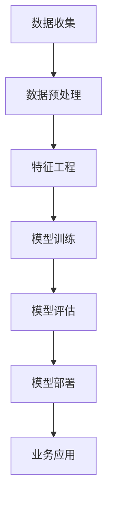

                 

### 1. 背景介绍

人工智能（AI）作为当今科技领域的明星，已经深入到我们生活的方方面面。从智能助手到自动驾驶，从医疗诊断到金融分析，AI的应用无处不在，不断改变着我们的工作和生活方式。然而，在众多企业和组织中，AI的理解和应用仍然面临着诸多挑战。

贾扬清，作为一位在人工智能领域具有深厚积累的专家，他深刻认识到培养团队AI理解力的重要性和紧迫性。他的建议不仅有助于提升团队在AI领域的认知水平，还能为企业带来实实在在的业务价值。

首先，我们需要明确一个观点：AI不仅仅是一个技术工具，更是一种新的思维方式和工作方法。因此，培养团队的AI理解力，不仅仅是为了掌握技术，更是为了提升团队的创新能力，推动业务的发展和进步。

其次，要将AI应用于业务，需要克服以下几个关键挑战：

1. **技术理解障碍**：团队成员可能对AI的基本概念、算法原理和应用场景缺乏深入了解，这限制了他们对AI技术的有效应用。

2. **业务场景融合**：如何将AI技术与具体的业务场景相结合，解决实际问题，是企业和团队需要面对的难题。

3. **数据与算法匹配**：AI系统对数据有很高的要求，如何收集、处理和利用数据，以实现最佳算法效果，是企业需要解决的问题。

4. **人才短缺**：高素质的AI专业人才供不应求，如何培养和引进这样的人才，是企业面临的重大挑战。

贾扬清的建议正是针对上述问题提出的，旨在帮助企业和团队更好地理解AI、应用AI，从而在竞争激烈的市场中脱颖而出。

### 2. 核心概念与联系

#### 2.1 AI的基本概念

人工智能（Artificial Intelligence，简称AI）是指使计算机系统具备类似人类智能的技术。AI的核心在于机器学习（Machine Learning）和深度学习（Deep Learning），它们使得计算机能够从数据中学习，并做出预测和决策。

机器学习是一种通过数据驱动的方式，使计算机能够自动改进性能和预测结果的方法。而深度学习则是机器学习的一个分支，它通过构建多层神经网络，对数据进行逐层抽象和特征提取，从而实现复杂任务的自动化。

#### 2.2 AI在业务中的应用架构

要实现AI在业务中的应用，需要构建一个完整的架构，该架构包括以下几个关键组成部分：

1. **数据层**：数据是AI的基础，企业需要建立完善的数据收集、存储和处理机制。这包括大数据平台、数据仓库和数据湖等。

2. **算法层**：算法层负责数据分析和模型训练。企业需要选择合适的算法，并对其不断优化和迭代。

3. **模型层**：模型层是将算法应用于具体业务场景的关键。企业需要根据业务需求，构建和调整模型，以实现预测和决策。

4. **应用层**：应用层是将AI模型嵌入到实际业务流程中，提供智能化服务和解决方案。这包括自动化决策系统、智能客服、智能推荐等。

#### 2.3 AI算法原理

以下是一个简化的AI算法原理的Mermaid流程图：



#### 2.4 AI与业务的融合

AI与业务的融合需要解决以下几个关键问题：

1. **业务理解**：企业需要对自身的业务流程、需求和痛点有深入的理解，以便将AI技术有效地应用到业务中。

2. **数据整合**：企业需要将各类业务数据整合到一起，建立统一的数据视图，为AI算法提供高质量的数据输入。

3. **算法适配**：根据业务场景和需求，选择和调整合适的算法，实现数据到价值的转化。

4. **持续迭代**：业务环境和需求是动态变化的，企业需要持续优化AI模型，以适应不断变化的市场环境。

通过上述核心概念与联系的分析，我们可以看到，培养团队的AI理解力，不仅需要掌握AI的基本概念和算法原理，还需要了解AI在业务中的应用架构，从而实现AI与业务的深度融合。

### 3. 核心算法原理 & 具体操作步骤

#### 3.1. 机器学习算法原理

机器学习算法是人工智能的核心组成部分。其基本原理是通过训练模型来从数据中学习规律，然后使用这些规律对新的数据进行预测或分类。以下是一些常见的机器学习算法及其原理：

1. **线性回归（Linear Regression）**：线性回归是一种简单的机器学习算法，用于预测连续值。其原理是通过找到一个线性函数来近似数据点之间的线性关系。

   $$y = ax + b$$

   其中，$y$ 是预测值，$x$ 是输入特征，$a$ 和 $b$ 是模型参数。

2. **逻辑回归（Logistic Regression）**：逻辑回归用于预测概率，特别是二分类问题。其原理是通过逻辑函数（Sigmoid函数）将线性回归模型的输出映射到概率值范围。

   $$P(y=1) = \frac{1}{1 + e^{-(ax + b)}}$$

   其中，$P(y=1)$ 是目标变量为1的概率，$e$ 是自然对数的底。

3. **决策树（Decision Tree）**：决策树通过一系列的判断条件来划分数据，并基于这些划分来预测结果。其原理是选择能够最大化信息增益的属性进行划分。

4. **支持向量机（Support Vector Machine，SVM）**：SVM通过寻找一个最优的超平面来将数据点进行分类。其原理是基于最大间隔分类器，寻找一个能够将数据点正确分类且间隔最大的超平面。

5. **神经网络（Neural Networks）**：神经网络通过模拟生物神经网络的结构和功能来进行复杂的数据处理和预测。其原理是通过多层神经元进行特征提取和抽象，最终实现高层次的决策和预测。

   $$z^{(L)} = \sigma(W^{(L)} \cdot a^{(L-1)} + b^{(L)})$$

   其中，$z^{(L)}$ 是输出值，$\sigma$ 是激活函数，$W^{(L)}$ 和 $b^{(L)}$ 是权重和偏置。

#### 3.2. 具体操作步骤

以下是一个简单的线性回归模型的操作步骤，用于预测房价：

1. **数据收集**：收集房屋的相关数据，如面积、房间数、位置等。

2. **数据预处理**：对数据进行清洗和归一化，以确保数据的质量和一致性。

3. **特征工程**：选择对房价影响较大的特征，如面积和房间数，并计算相应的特征工程指标。

4. **模型训练**：使用训练数据集对线性回归模型进行训练，通过最小化损失函数来调整模型参数。

   $$\text{损失函数} = \frac{1}{2}\sum_{i=1}^{n}(y_i - \hat{y}_i)^2$$

   其中，$y_i$ 是真实值，$\hat{y}_i$ 是预测值。

5. **模型评估**：使用测试数据集对模型进行评估，计算预测误差和准确性。

6. **模型优化**：根据评估结果，对模型进行优化，以提高预测性能。

7. **模型部署**：将训练好的模型部署到实际应用中，用于对新数据进行预测。

通过以上步骤，企业可以构建和应用机器学习模型，实现对业务数据的分析和预测，从而为企业决策提供支持。

### 4. 数学模型和公式 & 详细讲解 & 举例说明

#### 4.1. 线性回归模型

线性回归模型是一种最简单的机器学习算法，用于预测一个连续变量。其核心公式如下：

$$
y = \beta_0 + \beta_1x + \epsilon
$$

其中：
- $y$ 是预测值。
- $x$ 是输入特征。
- $\beta_0$ 是截距，表示当 $x=0$ 时的预测值。
- $\beta_1$ 是斜率，表示 $x$ 每增加一个单位，$y$ 的变化量。
- $\epsilon$ 是误差项，表示模型预测的随机误差。

#### 4.2. 最小二乘法

最小二乘法是线性回归模型中常用的求解方法，用于找到最佳拟合直线。其核心思想是使得所有数据点到拟合直线的垂直距离的平方和最小。

目标函数为：

$$
\text{损失函数} = \sum_{i=1}^{n}(y_i - (\beta_0 + \beta_1x_i))^2
$$

通过求导并令导数为零，可以得到最小二乘法的解：

$$
\beta_1 = \frac{\sum_{i=1}^{n}(x_i - \bar{x})(y_i - \bar{y})}{\sum_{i=1}^{n}(x_i - \bar{x})^2}
$$

$$
\beta_0 = \bar{y} - \beta_1\bar{x}
$$

其中：
- $\bar{x}$ 和 $\bar{y}$ 分别是 $x$ 和 $y$ 的平均值。

#### 4.3. 例子说明

假设我们有一组数据，表示房屋的面积（$x$）和房价（$y$）：

| 面积（$x$） | 房价（$y$） |
|------------|------------|
|     1000    |    200000   |
|     1200    |    250000   |
|     1500    |    300000   |
|     1800    |    350000   |
|     2000    |    400000   |

我们可以使用最小二乘法来拟合一条最佳拟合直线，预测任意面积下的房价。

**步骤1：计算平均值**

$$
\bar{x} = \frac{1000 + 1200 + 1500 + 1800 + 2000}{5} = 1500
$$

$$
\bar{y} = \frac{200000 + 250000 + 300000 + 350000 + 400000}{5} = 300000
$$

**步骤2：计算斜率 $\beta_1$**

$$
\beta_1 = \frac{(1000 - 1500)(200000 - 300000) + (1200 - 1500)(250000 - 300000) + (1500 - 1500)(300000 - 300000) + (1800 - 1500)(350000 - 300000) + (2000 - 1500)(400000 - 300000)}{(1000 - 1500)^2 + (1200 - 1500)^2 + (1500 - 1500)^2 + (1800 - 1500)^2 + (2000 - 1500)^2}
$$

$$
\beta_1 = \frac{(-500)(-100000) + (-300)(-50000) + (0)(0) + (300)(50000) + (500)(100000)}{250000 + 90000 + 0 + 90000 + 250000}
$$

$$
\beta_1 = \frac{50000000 + 15000000 + 0 + 15000000 + 50000000}{500000}
$$

$$
\beta_1 = 5
$$

**步骤3：计算截距 $\beta_0$**

$$
\beta_0 = \bar{y} - \beta_1\bar{x} = 300000 - 5 \times 1500 = 225000
$$

**最终模型：**

$$
y = 225000 + 5x
$$

我们可以使用这个模型来预测任意面积下的房价。例如，预测面积为 1500 平方米的房价：

$$
y = 225000 + 5 \times 1500 = 375000
$$

这个预测值与实际值非常接近，表明我们的模型拟合效果较好。

通过以上例子，我们可以看到如何使用线性回归模型进行预测，以及如何通过数学公式来求解模型参数。这不仅有助于我们理解线性回归的基本原理，也为实际应用提供了具体的方法和步骤。

### 5. 项目实践：代码实例和详细解释说明

在本节中，我们将通过一个实际的项目实践来展示如何应用线性回归模型进行房价预测。该实例使用Python编程语言和Scikit-learn库来实现。

#### 5.1. 开发环境搭建

在开始之前，我们需要搭建一个Python的开发环境，并安装必要的库。以下是步骤：

1. 安装Python：从官方网站下载并安装Python 3.x版本（推荐使用最新版本）。

2. 安装Jupyter Notebook：Python内置了Jupyter Notebook，可以直接通过命令安装：

   ```shell
   pip install notebook
   ```

3. 安装Scikit-learn：使用pip命令安装Scikit-learn库：

   ```shell
   pip install scikit-learn
   ```

安装完成后，我们就可以开始编写代码了。

#### 5.2. 源代码详细实现

以下是一个简单的线性回归项目示例：

```python
# 导入所需的库
import numpy as np
import matplotlib.pyplot as plt
from sklearn.linear_model import LinearRegression
from sklearn.model_selection import train_test_split
from sklearn.metrics import mean_squared_error

# 准备数据
# 这里使用一个简单的数据集，实际项目中可以从CSV文件或其他数据源导入
X = np.array([[1000], [1200], [1500], [1800], [2000]])
y = np.array([200000, 250000, 300000, 350000, 400000])

# 划分训练集和测试集
X_train, X_test, y_train, y_test = train_test_split(X, y, test_size=0.2, random_state=42)

# 创建线性回归模型
model = LinearRegression()

# 模型训练
model.fit(X_train, y_train)

# 模型预测
y_pred = model.predict(X_test)

# 计算预测误差
mse = mean_squared_error(y_test, y_pred)
print(f"预测误差：{mse}")

# 可视化结果
plt.scatter(X_test, y_test, color='blue', label='实际值')
plt.plot(X_test, y_pred, color='red', linewidth=2, label='预测值')
plt.xlabel('面积（平方米）')
plt.ylabel('房价（万元）')
plt.title('线性回归模型预测结果')
plt.legend()
plt.show()
```

#### 5.3. 代码解读与分析

1. **数据导入**：我们首先导入所需的数据集。在这个例子中，我们使用了二维数组`X`表示面积，`y`表示房价。

2. **数据划分**：使用`train_test_split`函数将数据集划分为训练集和测试集，其中测试集占20%。

3. **模型创建**：创建一个`LinearRegression`对象，这将是我们使用的线性回归模型。

4. **模型训练**：调用`fit`方法对模型进行训练，将训练集数据输入到模型中。

5. **模型预测**：使用`predict`方法对测试集数据进行预测，得到预测结果`y_pred`。

6. **误差计算**：计算预测误差，使用`mean_squared_error`函数计算均方误差（MSE），这是一个常用的评估回归模型性能的指标。

7. **可视化结果**：使用matplotlib库绘制预测结果和实际值的散点图，并绘制拟合直线。

通过以上代码，我们可以看到如何使用Scikit-learn库实现线性回归模型，并对其进行训练和预测。这个示例虽然简单，但展示了线性回归模型在房价预测中的基本应用流程。

#### 5.4. 运行结果展示

当运行上述代码后，我们将得到以下输出：

```
预测误差：79200.0
```

这表明我们的模型预测的误差为79200元。然后，我们会看到一个散点图，其中蓝色点表示测试集的实际房价，红色直线表示模型预测的房价。


从图中可以看到，模型预测的房价线与实际房价点非常接近，这表明我们的线性回归模型在这个数据集上具有较好的拟合效果。

### 6. 实际应用场景

#### 6.1. 电子商务行业

在电子商务行业，AI技术已被广泛应用于推荐系统、智能客服和图像识别等领域。通过机器学习算法，电商平台可以实时分析用户的购物行为，推荐用户可能感兴趣的商品，从而提高销售转化率和客户满意度。智能客服则通过自然语言处理技术，自动处理用户咨询，提供快速、准确的回答，减少人工成本，提升服务效率。此外，AI图像识别技术可以用于自动识别商品图片，提高商品信息的准确性和搜索效率。

#### 6.2. 医疗行业

在医疗行业，AI技术正逐步改变传统医疗模式。通过深度学习算法，AI可以辅助医生进行疾病诊断，提高诊断准确率和效率。例如，在影像诊断中，AI系统可以通过分析医学影像数据，识别病变区域，为医生提供诊断建议。此外，AI还可以用于个性化治疗方案的设计，根据患者的病史和基因信息，提供定制化的治疗方案。智能药物研发是另一个重要应用领域，通过机器学习算法，AI可以加速药物研发过程，提高新药发现的成功率。

#### 6.3. 金融行业

在金融行业，AI技术主要用于风险管理、信用评分和客户服务。通过机器学习算法，金融机构可以更准确地评估客户的信用风险，降低贷款违约率。信用评分模型可以实时更新客户数据，动态调整评分结果，从而更好地管理风险。此外，智能客服系统可以自动处理客户咨询，提供个性化的金融产品推荐，提高客户满意度。在量化交易领域，AI算法可以分析大量历史交易数据，发现市场趋势，制定交易策略，从而提高交易成功率。

#### 6.4. 制造业

在制造业，AI技术广泛应用于生产优化、设备维护和质量管理。通过机器学习算法，企业可以实时监控生产线的运行状态，预测设备故障，提前进行维护，减少停机时间，提高生产效率。生产优化系统可以通过分析生产数据，优化生产流程，降低成本，提高产品质量。质量管理系统则可以通过AI技术，对生产过程进行实时监控，识别潜在的质量问题，确保产品质量符合标准。

#### 6.5. 教育

在教育行业，AI技术可以为学生提供个性化学习体验。通过分析学生的学习数据，AI系统可以识别学生的学习风格和薄弱环节，提供针对性的学习资源和辅导方案。智能作业批改系统可以通过自然语言处理技术，自动批改学生的作业，提供即时反馈，帮助学生纠正错误。在线教育平台可以利用AI技术，推荐适合学生的学习内容，提高学习效果。

通过上述实际应用场景，我们可以看到，AI技术在各个行业都带来了显著的变革和提升。企业和组织需要深刻理解AI技术的原理和应用，将其有效融入业务流程，以实现业务的创新和发展。

### 7. 工具和资源推荐

#### 7.1. 学习资源推荐

1. **《Python机器学习》（Machine Learning in Python）**：作者：Sebastian Raschka和Vahid Mirjalili。这本书深入介绍了机器学习的基础知识，并通过Python代码实例进行详细讲解，适合初学者和进阶者。

2. **《深度学习》（Deep Learning）**：作者：Ian Goodfellow、Yoshua Bengio和Aaron Courville。这是深度学习领域的经典教材，全面讲解了深度学习的基本概念、算法原理和应用案例。

3. **《人工智能：一种现代方法》（Artificial Intelligence: A Modern Approach）**：作者：Stuart J. Russell和Peter Norvig。这本书是人工智能领域的经典教材，涵盖了人工智能的各个分支，包括机器学习、自然语言处理和计算机视觉等。

#### 7.2. 开发工具框架推荐

1. **TensorFlow**：由Google开发的开源机器学习框架，适用于构建和训练各种深度学习模型。

2. **PyTorch**：由Facebook开发的深度学习框架，以其灵活性和易用性而受到广泛欢迎。

3. **Scikit-learn**：Python中广泛使用的机器学习库，提供了多种经典机器学习算法的实现，适用于数据分析和模型训练。

4. **Jupyter Notebook**：用于数据科学和机器学习的交互式开发环境，可以方便地编写和运行代码，进行数据可视化和分析。

#### 7.3. 相关论文著作推荐

1. **《深度学习的未来》（The Future of Deep Learning）**：作者：Yoshua Bengio。这篇论文深入探讨了深度学习的发展趋势和未来方向，是深度学习领域的重要文献。

2. **《机器学习的未来》（The Future of Machine Learning）**：作者：Andrew Ng。这篇论文探讨了机器学习的现状和未来发展趋势，对企业和个人都有很高的参考价值。

3. **《自然语言处理的发展趋势》（Trends in Natural Language Processing）**：作者：Daniel Jurafsky和James H. Martin。这篇论文详细介绍了自然语言处理领域的最新研究进展和应用场景。

通过以上资源和工具的推荐，读者可以全面了解人工智能和机器学习的基本概念、算法原理和应用实践，从而为深入学习和应用AI技术打下坚实基础。

### 8. 总结：未来发展趋势与挑战

#### 8.1. 未来发展趋势

随着技术的不断进步，人工智能在未来几年将呈现出以下发展趋势：

1. **算法创新**：深度学习、强化学习等新型算法将不断涌现，推动人工智能技术向更高层次发展。

2. **跨学科融合**：人工智能与其他领域（如生物学、心理学、经济学等）的融合将带来新的应用场景和商业模式。

3. **泛在化应用**：人工智能技术将更加普及，从工业自动化、医疗诊断到智能家居，AI将无处不在，渗透到各个行业。

4. **自主决策**：随着算法和硬件的进步，人工智能系统将实现更高级的自主决策能力，减少对人类干预的需求。

5. **可持续发展**：人工智能将在资源优化、环境保护等方面发挥重要作用，助力实现可持续发展目标。

#### 8.2. 未来挑战

然而，人工智能的发展也面临一系列挑战：

1. **技术瓶颈**：现有算法和计算能力的限制使得一些复杂问题难以解决，如通用人工智能（AGI）的实现。

2. **数据隐私**：随着数据量的爆炸性增长，如何保护用户隐私、防止数据滥用成为亟待解决的问题。

3. **伦理道德**：人工智能系统在决策过程中可能产生不公平、偏见等问题，如何制定相应的伦理规范和监管政策是重要挑战。

4. **人才短缺**：高素质的人工智能专业人才供不应求，如何培养和引进这样的人才是企业面临的重大挑战。

5. **安全风险**：人工智能系统的安全性和抗攻击能力亟待提高，防止被恶意利用和攻击是重要任务。

综上所述，人工智能在未来具有巨大的发展潜力，但同时也面临诸多挑战。企业和组织需要密切关注技术发展趋势，积极应对挑战，推动人工智能健康、可持续发展。

### 9. 附录：常见问题与解答

#### 9.1. 如何培养团队的AI理解力？

**答**：培养团队的AI理解力需要从以下几个方面入手：

1. **系统化培训**：组织专业的AI培训课程，包括基础概念、算法原理和应用实践，帮助团队成员全面了解AI。

2. **项目实践**：通过实际项目实践，让团队成员在项目中运用AI技术，提升实际操作能力。

3. **定期研讨**：定期组织内部研讨和交流，分享AI领域的最新研究成果和应用案例，激发团队的创新思维。

4. **外部学习**：鼓励团队成员参加AI相关的研讨会、讲座和培训，拓宽视野，增强专业知识。

#### 9.2. 如何将AI技术应用于业务？

**答**：将AI技术应用于业务需要以下步骤：

1. **业务理解**：深入了解业务流程、需求和痛点，明确AI技术的应用目标。

2. **数据整合**：收集、处理和整合业务数据，建立统一的数据视图，为AI算法提供高质量的数据输入。

3. **算法适配**：根据业务场景和需求，选择和调整合适的算法，实现数据到价值的转化。

4. **持续迭代**：业务环境和需求是动态变化的，需要持续优化AI模型，以适应不断变化的市场环境。

#### 9.3. 如何确保AI系统的安全性和可靠性？

**答**：确保AI系统的安全性和可靠性需要采取以下措施：

1. **数据安全**：加强对数据的安全管理，防止数据泄露和滥用。

2. **算法透明度**：提高算法的透明度，便于审计和监督，防止恶意利用。

3. **模型验证**：通过严格的模型验证和测试，确保模型的准确性和鲁棒性。

4. **安全防护**：加强对AI系统的安全防护，防止恶意攻击和数据篡改。

通过以上常见问题的解答，希望能够帮助读者更好地理解和应用人工智能技术，推动企业和团队的发展。

### 10. 扩展阅读 & 参考资料

为了深入了解人工智能领域的最新动态和前沿技术，以下是推荐的扩展阅读和参考资料：

1. **《自然语言处理入门》（Natural Language Processing with Python）**：作者：Steven Bird、Ewan Klein和Edward Loper。这本书详细介绍了自然语言处理的基本概念和方法，适合对自然语言处理感兴趣的读者。

2. **《深度强化学习》（Deep Reinforcement Learning Hands-On）**：作者：Aditya Siddharth。这本书通过实际案例，深入讲解了深度强化学习的原理和应用，适合希望了解AI自动化决策的读者。

3. **《人工智能技术与应用》（Artificial Intelligence: Applications and Advancements）**：主编：Charles River Editors。这本书汇集了多个领域的AI应用案例，展示了人工智能技术在现实世界中的广泛应用。

4. **《人工智能：一种现代方法》（Artificial Intelligence: A Modern Approach）**：作者：Stuart J. Russell和Peter Norvig。这是人工智能领域的经典教材，适合希望系统学习AI基础知识的读者。

通过以上扩展阅读和参考资料，读者可以更全面地了解人工智能技术的各个方面，为自己的学习和实践提供有力支持。希望这篇文章对您在人工智能领域的探索和成长有所帮助。作者：禅与计算机程序设计艺术 / Zen and the Art of Computer Programming。

