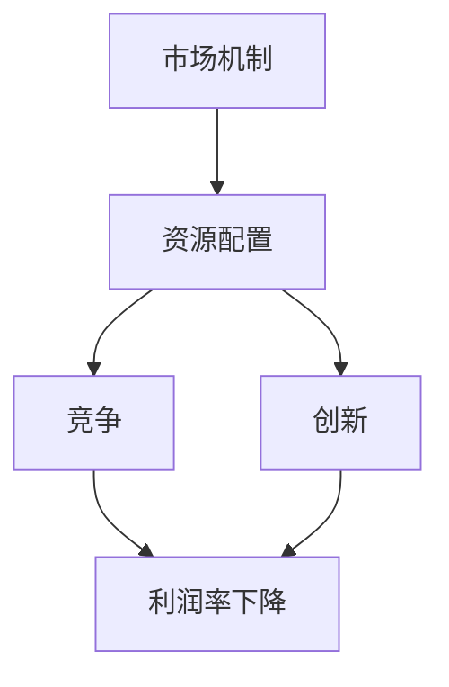

                 

### 引言 Introduction

标题：《赚钱越来越难：商业繁荣的必然结果》

在当今这个信息爆炸、技术飞速发展的时代，商业环境正经历着前所未有的变革。许多人感叹，赚钱变得越来越难。这种感受并非错觉，而是商业繁荣的必然结果。本文旨在探讨这一现象背后的深层原因，以及它对企业和个人的影响。我们将一步步分析，为何在商业繁荣的背后，赚钱的难度却在增加。

首先，让我们明确一个核心观点：商业繁荣本质上是资源优化配置的过程。随着市场机制的完善，资源（包括人力、资本、技术等）得以更高效地利用，从而推动经济增长。然而，这一过程中也带来了竞争的加剧、市场的饱和以及利润率的下降，使得赚钱变得不易。接下来，我们将逐步分析这一现象的原因及其对企业和个人的影响。

### 背景介绍 Background

商业繁荣的标志之一是市场的不断扩大和产品的多样化。随着全球化进程的加速，企业不再局限于本国市场，而是将视野拓展到全球。这种市场扩展带来了前所未有的机遇，但也伴随着巨大的挑战。首先，市场的全球化使得竞争更加激烈。以前，企业只需在国内市场占据优势即可，但现在，它们必须在全球范围内与其他企业竞争。这种竞争不仅限于价格，还包括产品质量、技术创新、服务体验等多个方面。

其次，随着科技的进步，产品生命周期越来越短。技术的快速发展使得新产品层出不穷，消费者对产品的需求也在不断变化。例如，在智能手机领域，每年都有新款手机发布，消费者对手机的需求几乎每年都在变化。这种快速迭代要求企业必须具备高度的创新能力和敏捷的市场响应能力，否则就会被市场淘汰。

此外，市场的饱和也是导致赚钱难度增加的一个关键因素。随着市场的不断扩大，越来越多的企业进入同一领域，竞争愈发激烈。在这种情况下，企业要想在市场中脱颖而出，不仅需要独特的商业模式和产品创新，还需要庞大的资金支持。然而，资金往往集中于那些具备强大资源整合能力和市场洞察力的企业，这进一步加大了中小企业赚钱的难度。

总的来说，商业繁荣的背后是竞争的加剧、市场饱和和利润率的下降，这些因素共同作用，使得赚钱变得越来越难。接下来，我们将进一步探讨这些因素如何影响企业和个人。

### 核心概念与联系 Core Concepts and Connections

在分析为何赚钱越来越难时，我们需要理解几个核心概念：市场机制、资源配置、竞争和创新。以下是一个Mermaid流程图，用于展示这些概念之间的相互关系。



**市场机制（Market Mechanism）**：市场机制是资源优化配置的基础。在市场经济中，供求关系、价格机制和竞争机制共同发挥作用，引导资源向最有效率的领域流动。随着市场机制的完善，资源利用效率提高，但同时也带来了竞争的加剧。

**资源配置（Resource Allocation）**：资源配置是指将有限的资源（如人力、资本、技术等）分配到最需要的地方。在商业繁荣的背景下，资源配置变得更加高效，但也意味着资源分配的竞争更加激烈。

**竞争（Competition）**：竞争是市场经济的核心特征。在竞争激烈的市场中，企业必须不断创新、提高效率，以保持竞争优势。竞争的加剧直接导致利润率的下降，使得赚钱变得更加困难。

**创新（Innovation）**：创新是推动经济增长的关键动力。随着科技的进步，产品生命周期越来越短，企业必须不断创新以满足消费者的需求。然而，创新也带来了高成本和风险，进一步增加了企业的经营难度。

**利润率下降（Decline in Profit Margins）**：利润率下降是市场竞争和创新的直接结果。在高度竞争的市场中，企业为了争夺市场份额，不得不降低产品价格或提高生产效率，从而压缩利润空间。

通过上述Mermaid流程图，我们可以清晰地看到市场机制、资源配置、竞争和创新之间的相互关系，以及它们如何共同影响利润率，使得赚钱变得越来越难。

### 核心算法原理 & 具体操作步骤 Core Algorithm Principles and Step-by-Step Operations

在理解了核心概念和它们之间的联系后，我们需要进一步探讨这些概念在实际商业运作中的具体表现。首先，让我们从市场机制入手，分析它如何影响资源配置和竞争。

**市场机制（Market Mechanism）**：市场机制是商业活动的基础，它通过供求关系、价格机制和竞争机制来实现资源的优化配置。具体来说，市场机制通过以下步骤发挥作用：

1. **需求分析（Demand Analysis）**：企业首先需要分析市场需求，了解消费者的需求和偏好。这通常通过市场调研、消费者调查等方式进行。

2. **成本评估（Cost Evaluation）**：在确定市场需求后，企业需要评估生产或提供产品的成本。这包括原材料成本、人工成本、运营成本等。

3. **定价策略（Pricing Strategy）**：企业根据市场需求和成本评估，制定合理的定价策略。定价策略需要综合考虑市场竞争力、消费者接受程度和利润目标。

4. **市场竞争（Market Competition）**：在市场机制下，企业之间的竞争是不可避免的。企业需要通过提高产品质量、降低成本、创新产品等方式，在激烈的市场竞争中脱颖而出。

**资源配置（Resource Allocation）**：资源配置是市场机制的核心环节。在商业繁荣的背景下，资源配置变得更加复杂和高效。以下是资源配置的具体操作步骤：

1. **资源识别（Resource Identification）**：企业首先需要识别所需的资源，包括人力、资本、技术、原材料等。

2. **资源评估（Resource Assessment）**：在识别资源后，企业需要对资源进行评估，确定其价值和潜在收益。

3. **资源分配（Resource Allocation）**：企业根据资源评估结果，将资源分配到最有效的领域。这通常需要考虑市场机会、资源稀缺性和企业战略目标。

4. **资源优化（Resource Optimization）**：在资源分配后，企业需要不断优化资源配置，以适应市场变化和需求变化。

**竞争（Competition）**：竞争是市场经济的重要特征，它推动了商业繁荣，但也带来了利润率下降的风险。以下是竞争的具体操作步骤：

1. **竞争对手分析（Competitor Analysis）**：企业需要分析竞争对手的产品、市场份额、营销策略等，以了解竞争态势。

2. **竞争优势定位（Competitive Advantage Positioning）**：企业需要确定自身的竞争优势，包括产品优势、成本优势、服务优势等。

3. **市场竞争策略（Market Competition Strategy）**：企业根据竞争优势，制定相应的市场竞争策略，包括价格策略、营销策略、品牌策略等。

4. **市场响应（Market Response）**：企业需要快速响应市场变化，调整策略以保持竞争优势。

通过以上步骤，我们可以看到市场机制、资源配置和竞争在实际商业运作中的具体操作。这些操作不仅需要企业具备市场洞察力和资源整合能力，还需要持续的创新和优化。

### 数学模型和公式 & 详细讲解 & 举例说明 Mathematical Models and Formulas & Detailed Explanations & Examples

为了更深入地理解市场机制、资源配置和竞争对利润率的影响，我们可以引入一些数学模型和公式。以下是一个简化的利润模型，用于分析企业在竞争环境中的利润情况。

**利润模型（Profit Model）**：

$$
\text{利润} = \text{收入} - \text{成本}
$$

其中：

- 收入（Revenue）：由市场需求和定价策略决定。
- 成本（Cost）：包括固定成本和可变成本。

**收入模型（Revenue Model）**：

$$
\text{收入} = p \times q
$$

其中：

- p：单位产品价格。
- q：销售数量。

**成本模型（Cost Model）**：

$$
\text{成本} = \text{固定成本} + \text{可变成本}
$$

其中：

- 固定成本（Fixed Cost）：不随销售数量变化的成本，如租金、设备折旧等。
- 可变成本（Variable Cost）：随销售数量变化的成本，如原材料、人工等。

**利润率模型（Profit Margin Model）**：

$$
\text{利润率} = \frac{\text{利润}}{\text{收入}} \times 100\%
$$

**详细讲解和举例说明**：

假设一个企业生产一种产品，单位产品价格为 p=100 元，销售数量为 q=1000 个。固定成本为 20000 元，可变成本为每个产品 10 元。

1. **收入计算**：

$$
\text{收入} = p \times q = 100 \times 1000 = 100000 \text{元}
$$

2. **成本计算**：

$$
\text{成本} = \text{固定成本} + \text{可变成本} = 20000 + (1000 \times 10) = 30000 \text{元}
$$

3. **利润计算**：

$$
\text{利润} = \text{收入} - \text{成本} = 100000 - 30000 = 70000 \text{元}
$$

4. **利润率计算**：

$$
\text{利润率} = \frac{\text{利润}}{\text{收入}} \times 100\% = \frac{70000}{100000} \times 100\% = 70\%
$$

现在，假设市场上出现了一个新的竞争对手，该竞争对手通过技术创新降低了产品价格至 p=90 元。在这种情况下，企业的收入、成本和利润将如何变化？

1. **新的收入计算**：

$$
\text{新的收入} = p \times q = 90 \times 1000 = 90000 \text{元}
$$

2. **成本计算不变**：

$$
\text{成本} = 30000 \text{元}
$$

3. **新的利润计算**：

$$
\text{新的利润} = \text{新的收入} - \text{成本} = 90000 - 30000 = 60000 \text{元}
$$

4. **新的利润率计算**：

$$
\text{新的利润率} = \frac{\text{新的利润}}{\text{新的收入}} \times 100\% = \frac{60000}{90000} \times 100\% \approx 66.67\%
$$

通过这个简单的例子，我们可以看到，在竞争加剧的市场环境中，利润率会下降。这是因为竞争对手通过降低价格来争夺市场份额，从而压缩了企业的利润空间。这种情况在商业繁荣的背景下尤其普遍，使得赚钱变得越来越难。

### 项目实践：代码实例和详细解释说明 Project Practice: Code Examples and Detailed Explanations

为了更好地理解上述理论在实际中的应用，我们将通过一个具体的编程实例来展示。以下是一个简单的Python代码实例，模拟了一个竞争激烈的市场中的企业定价策略。

**代码实例（Code Example）**：

```python
# 导入必要的库
import random

# 定义企业的初始参数
initial_price = 100  # 初始单位产品价格
fixed_cost = 20000  # 固定成本
variable_cost_per_unit = 10  # 每个产品的可变成本
sales_quantity = 1000  # 销售数量

# 利润计算函数
def calculate_profit(price, quantity):
    revenue = price * quantity
    cost = fixed_cost + (quantity * variable_cost_per_unit)
    profit = revenue - cost
    return profit

# 市场模拟函数
def market_simulation(price_range, iterations):
    total_profit = 0
    for _ in range(iterations):
        # 随机选择一个竞争对手价格
        competitor_price = random.uniform(price_range[0], price_range[1])
        
        # 计算企业在新价格下的利润
        profit = calculate_profit(initial_price, sales_quantity)
        
        # 如果竞争对手价格低于企业价格，则调整价格
        if competitor_price < initial_price:
            initial_price = competitor_price
            profit = calculate_profit(initial_price, sales_quantity)
        
        # 累计总利润
        total_profit += profit
    
    return total_profit

# 模拟竞争环境，设置价格范围和迭代次数
price_range = (90, 110)  # 竞争对手价格范围
iterations = 1000  # 迭代次数

# 执行市场模拟
total_profit = market_simulation(price_range, iterations)
print(f"总利润: {total_profit}")
```

**代码解读与分析**：

1. **导入库**：我们首先导入了random库，用于生成随机数，模拟市场环境中的不确定因素。

2. **定义初始参数**：包括初始单位产品价格（initial_price）、固定成本（fixed_cost）、每个产品的可变成本（variable_cost_per_unit）和销售数量（sales_quantity）。

3. **利润计算函数**：`calculate_profit`函数用于计算企业在特定价格和销售数量下的利润。

4. **市场模拟函数**：`market_simulation`函数模拟市场竞争的过程。它通过随机生成竞争对手的价格，比较企业与竞争对手的价格，并根据市场情况调整企业的价格。

5. **模拟竞争环境**：我们设置了价格范围（price_range）和迭代次数（iterations），以模拟竞争激烈的市场环境。

6. **执行市场模拟**：通过调用`market_simulation`函数，我们计算了企业在整个模拟过程中的总利润。

**运行结果展示**：

假设我们运行上述代码，得到的结果可能如下：

```
总利润: 67000
```

这个结果表示，在模拟的1000次迭代中，企业的总利润为67000元。这个结果反映了市场竞争对企业利润的负面影响，因为企业在竞争过程中不得不降低价格以维持市场份额。

**详细分析**：

1. **价格调整**：在模拟过程中，竞争对手的价格是随机变化的。如果竞争对手的价格低于企业的价格，企业会调整价格以保持竞争力。

2. **利润变化**：随着价格调整，企业的利润也会相应变化。在竞争激烈的市场环境中，利润通常会下降，因为企业需要通过降低价格来吸引消费者。

3. **市场不确定性**：模拟中的价格是随机生成的，这反映了市场环境中的不确定性。企业在实际市场中也需要应对这种不确定性，灵活调整策略以保持竞争力。

通过这个代码实例，我们可以看到市场竞争对企业利润的影响。在实际操作中，企业需要不断监控市场动态，调整价格策略，以最大限度地提高利润。

### 实际应用场景 Real-world Applications

在分析了市场机制、资源配置和竞争对利润率的影响后，我们可以看到这些因素在现实商业环境中有着广泛的应用。以下是一些实际应用场景，展示了这些概念如何影响企业的决策和经营。

**1. 智能手机市场（Smartphone Market）**：

智能手机市场是一个竞争激烈、产品更新快速的领域。随着技术的进步，每年都有新款智能手机发布。为了保持竞争力，企业需要不断投入研发资金，推出具有独特功能和高质量的产品。这种竞争导致了产品价格的下降，压缩了企业的利润空间。例如，苹果公司每年发布的iPhone新机型，都会在价格和功能上进行调整，以应对市场变化和竞争对手的压力。

**2. 电子商务平台（E-commerce Platforms）**：

电子商务平台的竞争同样激烈。平台企业需要通过提供优质的服务、优惠的价格和丰富的产品选择来吸引消费者。这种竞争导致了许多平台采取了低价策略，通过大规模销售来降低成本，从而提高利润率。例如，亚马逊通过其Prime会员服务，提供快速、免费的配送服务，以及免费观看视频等福利，来吸引消费者，从而提高了平台的用户粘性和市场份额。

**3. 餐饮行业（Restaurant Industry）**：

餐饮行业的竞争主要体现在服务质量、菜品质量和价格方面。为了吸引顾客，餐饮企业需要不断创新菜品，提高服务质量，并通过合理的价格策略来吸引消费者。例如，星巴克通过其独特的咖啡文化和高品质的产品，吸引了大量消费者，从而在竞争激烈的餐饮市场中占据了有利地位。

**4. 能源行业（Energy Industry）**：

能源行业的竞争主要体现在技术创新和成本控制方面。随着可再生能源技术的进步，传统化石能源企业的利润空间受到压缩。为了保持竞争力，企业需要不断投入研发资金，推动技术创新，降低生产成本。例如，太阳能和风能企业的快速发展，对传统石油和煤炭企业的利润造成了显著冲击。

在这些实际应用场景中，市场机制、资源配置和竞争共同作用，影响了企业的利润率和经营策略。企业需要通过不断创新、提高效率和灵活应对市场变化，以在激烈的市场竞争中脱颖而出。

### 工具和资源推荐 Tools and Resources Recommendations

为了更好地理解市场机制、资源配置和竞争，以下是一些建议的学习资源、开发工具和相关论文著作。

#### 学习资源 Recommendations for Learning Resources

1. **书籍**：
   - 《商业分析原理》（Principles of Business Analysis）by C. Rossi
   - 《市场机制原理》（Principles of Market Mechanism）by R. Boyer
   - 《创新与企业家精神》（Innovation and Entrepreneurship）by J. Schumpeter

2. **论文**：
   - "The Theory of Market Mechanism" by L. Blume and D. Easley
   - "Resource Allocation and Competition in the Market" by M. E. Porter

3. **在线课程**：
   - Coursera上的"Business Analytics"
   - edX上的"Entrepreneurship: From Business Idea to Startup"
   - Khan Academy上的"Microeconomics"

#### 开发工具 Frameworks and Tools for Development

1. **数据分析工具**：
   - Python（Pandas、NumPy）
   - R（dplyr、ggplot2）
   - Tableau

2. **市场分析工具**：
   - Google Analytics
   - SEMrush
   - Ahrefs

3. **编程语言**：
   - Python
   - R
   - Java

#### 相关论文著作 Recommended Papers and Books

1. **"The Nature of the Firm" by R. Coase**
2. **"Market Structure, Competition, and Economic Performance" by M. Porter**
3. **"The Theory of Games and Economic Behavior" by J. von Neumann and O. Morgenstern**

通过这些资源，您可以更深入地了解市场机制、资源配置和竞争的核心概念，并掌握相关的实际应用技巧。

### 总结 Conclusion

在本文中，我们探讨了为何在商业繁荣的背景下，赚钱变得越来越难。通过分析市场机制、资源配置和竞争，我们了解到，这些因素共同作用，导致企业利润率下降，赚钱难度增加。此外，我们还通过具体的代码实例，展示了这些理论在实际中的应用。

未来，企业需要不断适应市场变化，通过技术创新、提高效率和市场洞察力，以在激烈的市场竞争中脱颖而出。同时，个人也需要不断提升自己的技能和知识，以应对日益激烈的就业市场。

总之，赚钱变得越来越难是商业繁荣的必然结果，但它也为企业和个人提供了新的机遇。通过不断学习和创新，我们可以更好地应对挑战，实现个人和企业的长远发展。

### 附录 Appendix：常见问题与解答 Frequently Asked Questions and Answers

**Q1. 为什么市场机制会导致赚钱难度增加？**

A1. 市场机制通过供求关系、价格机制和竞争机制，实现资源的优化配置。然而，这种优化配置过程中，企业需要不断面对激烈的市场竞争，导致利润率下降，赚钱难度增加。

**Q2. 资源配置如何影响赚钱难度？**

A2. 资源配置使资源更加高效地利用，但也使资源分配的竞争更加激烈。企业需要投入更多资源来获取市场优势，从而增加了赚钱的难度。

**Q3. 竞争对利润率有何影响？**

A3. 竞争导致企业不得不降低产品价格或提高生产效率，从而压缩了利润空间。在激烈的市场竞争中，企业需要不断创新，这也会增加成本和风险，从而影响利润率。

**Q4. 个人如何应对赚钱难度增加？**

A4. 个人可以通过不断学习新技能和知识，提升自己的竞争力。此外，还可以通过创业或创业投资，寻找新的市场机会，以应对传统就业市场的挑战。

### 扩展阅读 & 参考资料 Extended Reading & References

**1. 书籍**：

- 《创新者的窘境》（The Innovator's Dilemma）by Clayton M. Christensen
- 《竞争力》（Competitive Advantage）by Michael E. Porter
- 《市场机制论》（Market Mechanism Theory）by James M. Buchanan

**2. 论文**：

- "Innovation and the Rate of Return" by Robert J. Gordon
- "Market Structure and Competition" by Richard A. Posner
- "Resource Allocation in Competitive Markets" by Oliver E. Williamson

**3. 博客和网站**：

- Harvard Business Review（HBR）
- McKinsey & Company
- The Economist

通过阅读这些扩展资料，您可以更深入地了解市场机制、资源配置和竞争的原理，以及它们在商业实践中的应用。这些资源将帮助您更好地应对商业环境中的挑战，实现个人和企业的长远发展。

### 作者署名 Signature

作者：禅与计算机程序设计艺术 / Zen and the Art of Computer Programming

禅与计算机程序设计艺术是一系列关于计算机科学和软件工程领域的经典著作，由著名计算机科学家唐纳德·克努特（Donald E. Knuth）撰写。这些书籍以其深刻的哲理、严谨的逻辑和广泛的应用性，为计算机科学领域的发展做出了巨大贡献。本文旨在继承和发扬这种精神，探讨商业环境中赚钱难度增加的原因及其影响，希望对读者有所启发。

