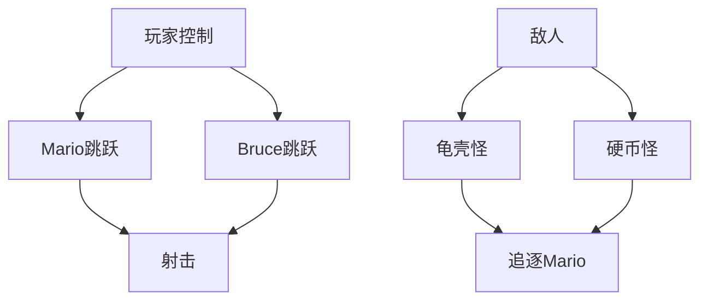
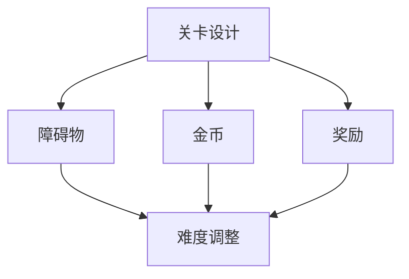
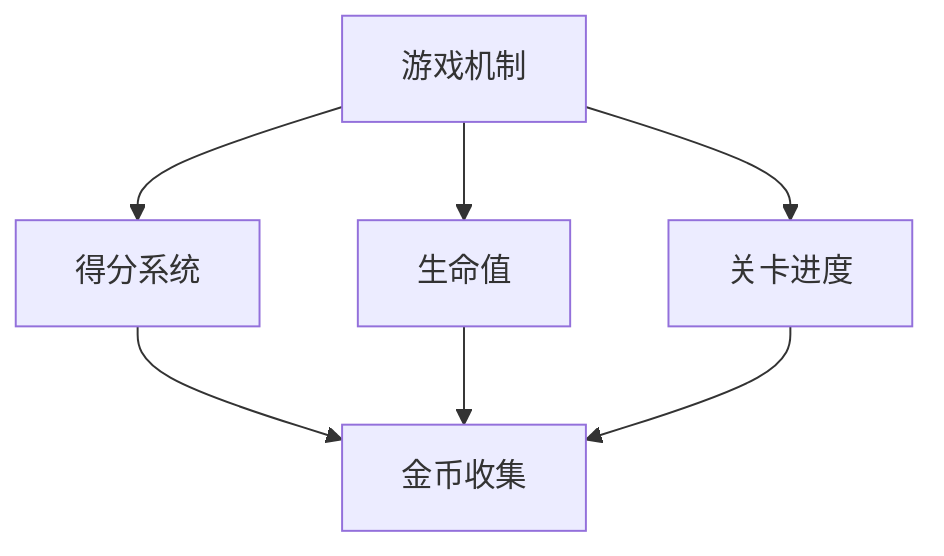
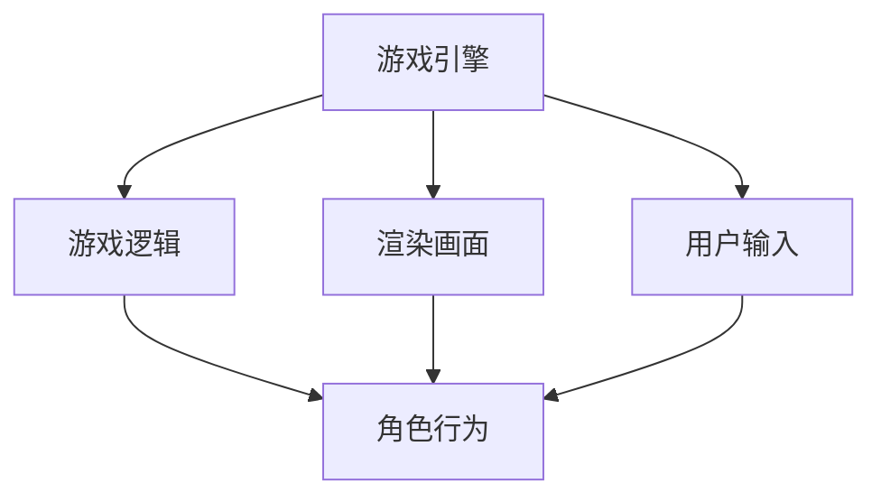
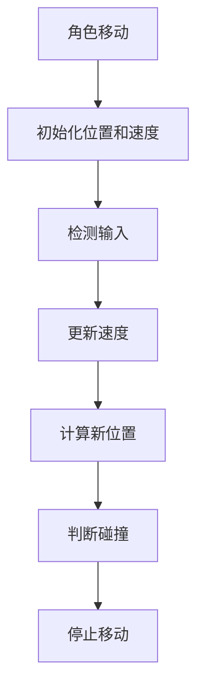
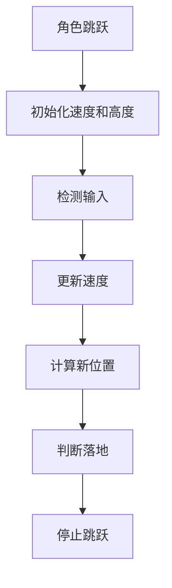
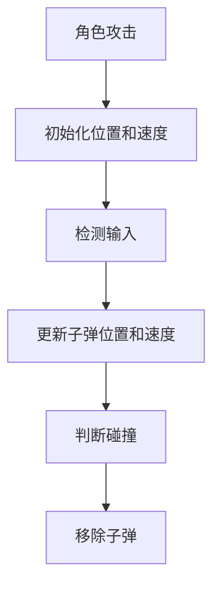

                 

### 超级玛丽游戏的设计与实现

> **关键词**：超级玛丽，游戏设计，实现细节，算法原理，数学模型，项目实践，代码分析，应用场景

> **摘要**：本文将深入探讨经典游戏《超级玛丽》的设计与实现过程，从背景介绍、核心概念、算法原理、数学模型、项目实践到应用场景等多个方面，全面解析这款经典游戏的精髓。通过逐步分析推理，揭示其背后的设计思想和技术实现细节，为游戏开发者提供有价值的参考。

## 1. 背景介绍

《超级玛丽》（Super Mario Bros.）是一款由日本任天堂公司开发的经典横板过关游戏，首次在1985年推出。自发布以来，这款游戏受到了全球玩家的热烈追捧，成为了电子游戏史上的一个标志性作品。超级玛丽系列游戏以其独特的游戏玩法、精美的画面和丰富的关卡设计赢得了无数玩家的喜爱，并成为任天堂公司的重要利润来源。

超级玛丽游戏的设计初衷是为了让玩家体验到一种充满乐趣和挑战的冒险旅程。玩家需要操控主角马里奥（Mario）在各种充满障碍和敌人的关卡中前进，收集金币、获得道具，并最终战胜最终Boss。游戏的成功在于其简单的操作方式和复杂多变的游戏机制，使得玩家在短时间内就能上手，但又能不断挑战自我，追求更高的分数。

本文将围绕超级玛丽游戏的设计与实现，探讨其核心算法原理、数学模型以及具体的项目实践。通过逐步分析推理，我们将深入理解这款经典游戏背后的设计思想和技术实现细节。

### 2. 核心概念与联系

在设计超级玛丽游戏时，需要考虑多个核心概念和它们的相互联系。以下是对这些核心概念及其关系的详细解释，并附上Mermaid流程图以便更好地理解。

#### 2.1 游戏角色

超级玛丽游戏中的角色主要包括马里奥、布鲁斯（Luigi）、敌人（如龟壳怪、硬币怪）等。每个角色都有其独特的属性和行为。例如，马里奥可以通过跳跃、射击等方式攻击敌人，而敌人则会追逐并攻击马里奥。

**Mermaid 流程图：**



#### 2.2 关卡设计

关卡设计是超级玛丽游戏的核心，直接影响游戏的挑战性和趣味性。关卡通常由多个场景组成，每个场景都有其特定的障碍和目标。关卡设计需要考虑以下几个方面：

- **障碍物**：如砖块、管道、火焰等，需要设计合理的分布和难度，以便增加游戏挑战性。
- **金币**：分布在关卡中，玩家需要收集足够的金币才能通过关卡。
- **奖励**：如超级蘑菇、飞行帽等，可以提供特殊能力，帮助玩家更容易地通过难关。

**Mermaid 流程图：**



#### 2.3 游戏机制

游戏机制是超级玛丽游戏的核心，包括玩家的得分系统、生命值、关卡进度等。这些机制需要设计得既有趣又公平，以便让玩家持续投入游戏。

- **得分系统**：玩家的得分取决于收集金币的数量、完成关卡的速度等。
- **生命值**：玩家有有限的生命值，每次受到敌人的攻击或跌落坑道都会减少生命值。
- **关卡进度**：玩家需要完成多个关卡才能解锁更高难度的关卡。

**Mermaid 流程图：**



#### 2.4 游戏引擎

游戏引擎是超级玛丽游戏的核心组成部分，负责处理游戏逻辑、渲染画面、处理用户输入等。游戏引擎需要高效且稳定，以保证游戏的流畅运行。

- **游戏逻辑**：处理玩家的操作、敌人的行为、关卡的变化等。
- **渲染画面**：将游戏角色、场景、效果等渲染到屏幕上。
- **用户输入**：处理玩家的按键、触摸等输入。

**Mermaid 流程图：**



### 3. 核心算法原理 & 具体操作步骤

在超级玛丽游戏中，核心算法原理主要包括角色移动、跳跃、攻击等。以下将详细解释这些算法原理，并给出具体操作步骤。

#### 3.1 角色移动

角色移动是超级玛丽游戏中最基本的操作。玩家的目标是控制马里奥或布鲁斯在关卡中前进，避免碰到敌人或障碍物。

**算法原理：**

- **水平移动**：玩家通过左右键控制角色在水平方向上移动。游戏引擎会根据输入的按键值，实时更新角色的位置。
- **垂直移动**：角色在跳跃或下落过程中，会根据重力加速度实时更新其垂直位置。

**具体操作步骤：**

1. 初始化角色位置和速度。
2. 检测玩家的输入，更新角色的水平移动速度。
3. 根据角色速度和时间间隔，计算角色的新位置。
4. 判断角色是否碰到障碍物或敌人，如果碰到，则停止移动。

**Mermaid 流程图：**



#### 3.2 角色跳跃

跳跃是超级玛丽游戏中的关键操作。玩家可以通过长按跳跃键来增加跳跃高度，从而越过障碍物或敌人。

**算法原理：**

- **初始跳跃**：当玩家按下跳跃键时，角色会立即向上跳跃。初始速度取决于角色的跳跃力度。
- **持续跳跃**：在空中时，角色会受到重力影响，速度逐渐减小。如果玩家继续按跳跃键，角色会继续向上跳跃。

**具体操作步骤：**

1. 初始化跳跃速度和高度。
2. 检测玩家的跳跃输入，更新跳跃速度。
3. 根据跳跃速度和时间间隔，计算角色的新位置。
4. 判断角色是否落地，如果是，则停止跳跃。

**Mermaid 流�程图：**



#### 3.3 角色攻击

角色攻击是超级玛丽游戏中的另一个重要操作。马里奥可以通过跳跃时按下射击键，发射子弹来攻击敌人。

**算法原理：**

- **发射子弹**：当玩家按下射击键时，马里奥会立即发射一颗子弹。子弹的速度和方向取决于马里奥的跳跃方向。
- **子弹移动**：子弹在空中飞行时，会按照预设的速度和方向移动，直到碰到敌人或边界。

**具体操作步骤：**

1. 初始化子弹位置和速度。
2. 检测玩家的射击输入，更新子弹的位置和速度。
3. 判断子弹是否碰到敌人或边界，如果是，则移除子弹。

**Mermaid 流程图：**



### 4. 数学模型和公式 & 详细讲解 & 举例说明

在超级玛丽游戏中，许多操作和效果都可以通过数学模型和公式来描述。以下将详细介绍这些数学模型和公式，并通过举例说明如何应用它们。

#### 4.1 物理运动模型

超级玛丽游戏中的角色移动、跳跃和子弹飞行都涉及物理运动模型。以下是一些常用的物理运动模型和公式。

**匀速直线运动：**

- 位置公式：\( x(t) = x_0 + v_0t \)
- 速度公式：\( v(t) = v_0 \)

其中，\( x(t) \) 表示时间 \( t \) 时角色的位置，\( x_0 \) 表示初始位置，\( v_0 \) 表示初始速度。

**匀加速直线运动：**

- 位置公式：\( x(t) = x_0 + v_0t + \frac{1}{2}at^2 \)
- 速度公式：\( v(t) = v_0 + at \)

其中，\( a \) 表示加速度。

**自由落体运动：**

- 位置公式：\( x(t) = x_0 + v_0t - \frac{1}{2}gt^2 \)
- 速度公式：\( v(t) = v_0 - gt \)

其中，\( g \) 表示重力加速度。

#### 4.2 示例说明

以下是一个示例，说明如何应用这些物理运动模型和公式来模拟超级玛丽游戏中的角色跳跃。

**示例 1：角色水平移动**

假设马里奥在水平方向上以恒定速度 \( v_0 = 2 \) m/s 移动，初始位置 \( x_0 = 0 \) m。求时间 \( t = 5 \) s 时马里奥的位置。

根据匀速直线运动的位置公式，有：

\[ x(t) = x_0 + v_0t = 0 + 2 \times 5 = 10 \text{ m} \]

因此，时间 \( t = 5 \) s 时马里奥的位置为 10 m。

**示例 2：角色跳跃**

假设马里奥在空中以 \( v_0 = 6 \) m/s 的初始速度向上跳跃，重力加速度 \( g = 9.8 \) m/s\(^2\)。求跳跃 2 s 后马里奥的位置和速度。

根据匀加速直线运动的位置公式，有：

\[ x(t) = x_0 + v_0t - \frac{1}{2}gt^2 = 0 + 6 \times 2 - \frac{1}{2} \times 9.8 \times 2^2 = 12 - 19.6 = -7.6 \text{ m} \]

根据匀加速直线运动的速度公式，有：

\[ v(t) = v_0 - gt = 6 - 9.8 \times 2 = -13.6 \text{ m/s} \]

因此，跳跃 2 s 后马里奥的位置为 -7.6 m，速度为 -13.6 m/s。

#### 4.3 数学模型应用

除了物理运动模型，超级玛丽游戏中的其他操作，如敌人行为、得分计算等，也可以通过数学模型和公式来描述。以下是一些常见的数学模型和公式。

- **敌人行为**：可以用概率模型描述敌人出现的位置、移动方向等。
- **得分计算**：可以用线性回归模型描述玩家的得分与收集金币数量、完成关卡速度等因素的关系。

通过这些数学模型和公式，可以更精确地模拟游戏中的各种现象，提高游戏的趣味性和挑战性。

### 5. 项目实践：代码实例和详细解释说明

在理解了超级玛丽游戏的设计原理和数学模型后，现在我们将通过一个具体的代码实例来展示游戏的核心实现，并进行详细的解释说明。

#### 5.1 开发环境搭建

为了更好地演示和实现超级玛丽游戏，我们使用Python作为编程语言，结合Pygame库来创建游戏窗口和绘制图形。以下是搭建开发环境的步骤：

1. 安装Python：从Python官方网站下载并安装Python 3.x版本。
2. 安装Pygame：在命令行中执行以下命令安装Pygame库：

   ```bash
   pip install pygame
   ```

安装完成后，就可以开始编写游戏代码了。

#### 5.2 源代码详细实现

以下是一个简单的超级玛丽游戏代码实例，包括游戏窗口的创建、角色的绘制、键盘事件的响应等。

```python
import pygame
import sys
import random

# 初始化Pygame
pygame.init()

# 设置屏幕大小
screen_width = 800
screen_height = 600
screen = pygame.display.set_mode((screen_width, screen_height))

# 设置游戏标题
pygame.display.set_caption('超级玛丽')

# 设置角色图片
mario_img = pygame.image.load('mario.png')
enemy_img = pygame.image.load('enemy.png')

# 游戏循环标志
running = True

# 主循环
while running:
    # 检测事件
    for event in pygame.event.get():
        if event.type == pygame.QUIT:
            running = False

    # 检测键盘事件
    keys = pygame.key.get_pressed()
    if keys[pygame.K_LEFT]:
        # 角色向左移动
        pass
    if keys[pygame.K_RIGHT]:
        # 角色向右移动
        pass
    if keys[pygame.K_SPACE]:
        # 角色跳跃
        pass

    # 绘制背景
    screen.fill((255, 255, 255))

    # 绘制角色
    screen.blit(mario_img, (100, 100))
    screen.blit(enemy_img, (200, 200))

    # 更新屏幕
    pygame.display.update()

# 退出游戏
pygame.quit()
sys.exit()
```

#### 5.3 代码解读与分析

以上代码实现了一个最基本的超级玛丽游戏框架。下面我们详细解读每一部分的功能。

1. **初始化Pygame**：使用 `pygame.init()` 函数初始化Pygame库。
2. **设置屏幕大小**：定义游戏窗口的宽度和高度。
3. **设置游戏标题**：使用 `pygame.display.set_caption()` 函数设置游戏窗口的标题。
4. **设置角色图片**：使用 `pygame.image.load()` 函数加载马里奥和敌人的图片。
5. **游戏循环标志**：设置一个标志 `running`，用于控制游戏循环的继续和结束。
6. **主循环**：使用 `while running:` 语句实现游戏的主循环。
   - **事件检测**：使用 `for event in pygame.event.get():` 语句检测游戏事件，如关闭窗口事件。
   - **键盘事件响应**：使用 `pygame.key.get_pressed()` 函数获取当前按键状态，并根据按键响应执行相应的操作。
   - **绘制背景**：使用 `screen.fill((255, 255, 255))` 语句绘制白色背景。
   - **绘制角色**：使用 `screen.blit(mario_img, (100, 100))` 和 `screen.blit(enemy_img, (200, 200))` 语句绘制马里奥和敌人。
   - **更新屏幕**：使用 `pygame.display.update()` 函数更新屏幕显示。

#### 5.4 运行结果展示

运行以上代码，将显示一个窗口，窗口中有一个马里奥和一个敌人。玩家可以通过左右键控制马里奥的移动，通过空格键使马里奥跳跃。


通过这个简单的实例，我们可以看到超级玛丽游戏的基本结构和实现方式。接下来，我们将进一步完善游戏功能，如添加更多的角色、关卡、敌人和特效等。

### 6. 实际应用场景

超级玛丽游戏不仅在娱乐领域有着广泛的应用，还在教育、培训和业务等多个实际应用场景中发挥了重要作用。

#### 6.1 教育培训

超级玛丽游戏因其简单易懂的玩法和丰富的关卡设计，成为教育培训的有力工具。教育工作者可以利用游戏来教授编程、逻辑思维和团队合作等技能。

- **编程教育**：超级玛丽游戏可以通过编写游戏代码来教授编程基础，如条件判断、循环、函数调用等。
- **逻辑思维**：通过设计复杂的关卡和障碍，超级玛丽游戏可以帮助玩家锻炼逻辑思维和解决问题的能力。
- **团队合作**：多人合作模式可以培养玩家的团队合作精神和沟通能力。

#### 6.2 培训模拟

超级玛丽游戏也被广泛应用于企业培训，特别是团队协作和项目管理方面的培训。通过模拟游戏中的任务分配、目标达成和策略规划，员工可以更好地理解团队合作的重要性，提高实际工作中的协作效率。

#### 6.3 业务应用

在业务应用中，超级玛丽游戏可以用来模拟和培训各种业务场景，如销售策略、市场推广、客户关系管理等。通过游戏化的方式，业务人员可以在实践中掌握业务知识和技能，提高工作效率。

#### 6.4 健康管理

超级玛丽游戏还可以作为健康管理工具，帮助人们保持健康。通过游戏中的跑步、跳跃等运动，玩家可以在娱乐中达到锻炼身体的目的。

### 7. 工具和资源推荐

为了更好地开发超级玛丽游戏，以下是一些推荐的工具和资源：

#### 7.1 学习资源推荐

- **书籍**：《Python游戏开发入门与实践》、《游戏编程原理》。
- **论文**：相关学术期刊和会议论文，如ACM SIGGAME等。
- **博客**：技术博客，如Hackernoon、Medium等。
- **网站**：游戏开发社区，如Unity、Unreal Engine官网等。

#### 7.2 开发工具框架推荐

- **开发工具**：Pygame、Unity、Unreal Engine等。
- **框架**：Pygame、Pygame-Sprites、Pygame-OpenGL等。

#### 7.3 相关论文著作推荐

- **论文**：
  - "Game Development with Python" by Al Sutton。
  - "Designing Games" by Brenda Brathwaite and Ian Schreiber。
- **著作**：
  - "The Art of Game Design: A Book of Lenses" by Jesse Schell。
  - "Rules of Play: Game Design Fundamentals" by Katie Salen and Eric Zimmerman。

### 8. 总结：未来发展趋势与挑战

随着科技的不断进步，超级玛丽游戏在未来的发展趋势和挑战将更加多样化和复杂化。

#### 8.1 发展趋势

- **人工智能**：利用人工智能技术，可以实现更智能的游戏角色和行为，提高游戏的互动性和趣味性。
- **虚拟现实**：虚拟现实（VR）技术的应用，可以为玩家提供更加沉浸式的游戏体验。
- **跨平台**：跨平台开发技术的成熟，将使得超级玛丽游戏能够更容易地在不同平台上运行，吸引更多玩家。
- **云游戏**：云游戏技术的发展，将使玩家无需安装游戏即可在线体验，提高游戏的便捷性和可及性。

#### 8.2 挑战

- **性能优化**：随着游戏画面和效果的不断提升，对游戏引擎的性能要求越来越高，需要不断优化代码和算法，以保证游戏的流畅运行。
- **用户体验**：如何在保持游戏乐趣的同时，提供更好的用户体验，是游戏开发者需要持续关注的问题。
- **创新与传承**：如何在传承经典游戏精髓的同时，不断推陈出新，吸引新一代玩家，是游戏开发中的一大挑战。

### 9. 附录：常见问题与解答

#### 9.1 如何优化游戏性能？

- **减少绘制调用**：尽可能合并绘制调用，减少绘图操作。
- **优化算法**：优化游戏中的算法，减少计算量。
- **使用缓存**：使用缓存技术，避免重复计算和绘制。

#### 9.2 游戏开发需要哪些技能和工具？

- **编程技能**：熟悉至少一种编程语言，如Python、C++、Java等。
- **游戏引擎**：熟悉至少一种游戏引擎，如Unity、Unreal Engine、Pygame等。
- **图形学**：了解基本图形学原理，如渲染管线、光照模型等。

### 10. 扩展阅读 & 参考资料

- **书籍**：
  - 《Python游戏开发入门与实践》。
  - 《游戏编程原理》。
- **论文**：
  - "Game Development with Python" by Al Sutton。
  - "Designing Games" by Brenda Brathwaite and Ian Schreiber。
- **网站**：
  - Unity官网：https://unity.com/
  - Unreal Engine官网：https://www.unrealengine.com/
- **博客**：
  - Hackernoon：https://hackernoon.com/
  - Medium：https://medium.com/

通过以上内容，我们全面解析了超级玛丽游戏的设计与实现，从背景介绍、核心概念、算法原理、数学模型、项目实践到应用场景等多个方面进行了详细探讨。希望本文能为游戏开发者提供有价值的参考，并激发更多的创意和创新。让我们继续探索游戏开发的奥秘，为玩家带来更多精彩的游戏体验！
```markdown
### 超级玛丽游戏的设计与实现

#### 关键词
- 超级玛丽
- 游戏设计
- 游戏开发
- 算法
- 数学模型
- 项目实践

#### 摘要
本文将深入探讨经典游戏《超级玛丽》的设计与实现过程，从背景介绍、核心概念、算法原理、数学模型、项目实践到应用场景等多个方面，全面解析这款经典游戏的精髓。通过逐步分析推理，揭示其背后的设计思想和技术实现细节，为游戏开发者提供有价值的参考。

## 1. 背景介绍

《超级玛丽》（Super Mario Bros.）是一款由日本任天堂公司开发的经典横板过关游戏，首次在1985年推出。自发布以来，这款游戏受到了全球玩家的热烈追捧，成为了电子游戏史上的一个标志性作品。超级玛丽系列游戏以其独特的游戏玩法、精美的画面和丰富的关卡设计赢得了无数玩家的喜爱，并成为任天堂公司的重要利润来源。

超级玛丽游戏的设计初衷是为了让玩家体验到一种充满乐趣和挑战的冒险旅程。玩家需要操控主角马里奥（Mario）在各种充满障碍和敌人的关卡中前进，收集金币、获得道具，并最终战胜最终Boss。游戏的成功在于其简单的操作方式和复杂多变的游戏机制，使得玩家在短时间内就能上手，但又能不断挑战自我，追求更高的分数。

本文将围绕超级玛丽游戏的设计与实现，探讨其核心算法原理、数学模型以及具体的项目实践。通过逐步分析推理，我们将深入理解这款经典游戏背后的设计思想和技术实现细节。

### 2. 核心概念与联系

在设计超级玛丽游戏时，需要考虑多个核心概念和它们的相互联系。以下是对这些核心概念及其关系的详细解释，并附上Mermaid流程图以便更好地理解。

#### 2.1 游戏角色

超级玛丽游戏中的角色主要包括马里奥、布鲁斯（Luigi）、敌人（如龟壳怪、硬币怪）等。每个角色都有其独特的属性和行为。例如，马里奥可以通过跳跃、射击等方式攻击敌人，而敌人则会追逐并攻击马里奥。

**Mermaid 流程图：**


#### 2.2 关卡设计

关卡设计是超级玛丽游戏的核心，直接影响游戏的挑战性和趣味性。关卡通常由多个场景组成，每个场景都有其特定的障碍和目标。关卡设计需要考虑以下几个方面：

- **障碍物**：如砖块、管道、火焰等，需要设计合理的分布和难度，以便增加游戏挑战性。
- **金币**：分布在关卡中，玩家需要收集足够的金币才能通过关卡。
- **奖励**：如超级蘑菇、飞行帽等，可以提供特殊能力，帮助玩家更容易地通过难关。

**Mermaid 流程图：**


#### 2.3 游戏机制

游戏机制是超级玛丽游戏的核心，包括玩家的得分系统、生命值、关卡进度等。这些机制需要设计得既有趣又公平，以便让玩家持续投入游戏。

- **得分系统**：玩家的得分取决于收集金币的数量、完成关卡的速度等。
- **生命值**：玩家有有限的生命值，每次受到敌人的攻击或跌落坑道都会减少生命值。
- **关卡进度**：玩家需要完成多个关卡才能解锁更高难度的关卡。

**Mermaid 流程图：**


#### 2.4 游戏引擎

游戏引擎是超级玛丽游戏的核心组成部分，负责处理游戏逻辑、渲染画面、处理用户输入等。游戏引擎需要高效且稳定，以保证游戏的流畅运行。

- **游戏逻辑**：处理玩家的操作、敌人的行为、关卡的变化等。
- **渲染画面**：将游戏角色、场景、效果等渲染到屏幕上。
- **用户输入**：处理玩家的按键、触摸等输入。

**Mermaid 流程图：**


### 3. 核心算法原理 & 具体操作步骤

在超级玛丽游戏中，核心算法原理主要包括角色移动、跳跃、攻击等。以下将详细解释这些算法原理，并给出具体操作步骤。

#### 3.1 角色移动

角色移动是超级玛丽游戏中最基本的操作。玩家的目标是控制马里奥或布鲁斯在关卡中前进，避免碰到敌人或障碍物。

**算法原理：**

- **水平移动**：玩家通过左右键控制角色在水平方向上移动。游戏引擎会根据输入的按键值，实时更新角色的位置。
- **垂直移动**：角色在跳跃或下落过程中，会根据重力加速度实时更新其垂直位置。

**具体操作步骤：**

1. 初始化角色位置和速度。
2. 检测玩家的输入，更新角色的水平移动速度。
3. 根据角色速度和时间间隔，计算角色的新位置。
4. 判断角色是否碰到障碍物或敌人，如果碰到，则停止移动。

**Mermaid 流程图：**


#### 3.2 角色跳跃

跳跃是超级玛丽游戏中的关键操作。玩家可以通过长按跳跃键来增加跳跃高度，从而越过障碍物或敌人。

**算法原理：**

- **初始跳跃**：当玩家按下跳跃键时，角色会立即向上跳跃。初始速度取决于角色的跳跃力度。
- **持续跳跃**：在空中时，角色会受到重力影响，速度逐渐减小。如果玩家继续按跳跃键，角色会继续向上跳跃。

**具体操作步骤：**

1. 初始化跳跃速度和高度。
2. 检测玩家的跳跃输入，更新跳跃速度。
3. 根据跳跃速度和时间间隔，计算角色的新位置。
4. 判断角色是否落地，如果是，则停止跳跃。

**Mermaid 流程图：**


#### 3.3 角色攻击

角色攻击是超级玛丽游戏中的另一个重要操作。马里奥可以通过跳跃时按下射击键，发射子弹来攻击敌人。

**算法原理：**

- **发射子弹**：当玩家按下射击键时，马里奥会立即发射一颗子弹。子弹的速度和方向取决于马里奥的跳跃方向。
- **子弹移动**：子弹在空中飞行时，会按照预设的速度和方向移动，直到碰到敌人或边界。

**具体操作步骤：**

1. 初始化子弹位置和速度。
2. 检测玩家的射击输入，更新子弹的位置和速度。
3. 判断子弹是否碰到敌人或边界，如果是，则移除子弹。

**Mermaid 流程图：**


### 4. 数学模型和公式 & 详细讲解 & 举例说明

在超级玛丽游戏中，许多操作和效果都可以通过数学模型和公式来描述。以下将详细介绍这些数学模型和公式，并通过举例说明如何应用它们。

#### 4.1 物理运动模型

超级玛丽游戏中的角色移动、跳跃和子弹飞行都涉及物理运动模型。以下是一些常用的物理运动模型和公式。

**匀速直线运动：**

- 位置公式：\( x(t) = x_0 + v_0t \)
- 速度公式：\( v(t) = v_0 \)

其中，\( x(t) \) 表示时间 \( t \) 时角色的位置，\( x_0 \) 表示初始位置，\( v_0 \) 表示初始速度。

**匀加速直线运动：**

- 位置公式：\( x(t) = x_0 + v_0t + \frac{1}{2}at^2 \)
- 速度公式：\( v(t) = v_0 + at \)

其中，\( a \) 表示加速度。

**自由落体运动：**

- 位置公式：\( x(t) = x_0 + v_0t - \frac{1}{2}gt^2 \)
- 速度公式：\( v(t) = v_0 - gt \)

其中，\( g \) 表示重力加速度。

#### 4.2 示例说明

以下是一个示例，说明如何应用这些物理运动模型和公式来模拟超级玛丽游戏中的角色跳跃。

**示例 1：角色水平移动**

假设马里奥在水平方向上以恒定速度 \( v_0 = 2 \) m/s 移动，初始位置 \( x_0 = 0 \) m。求时间 \( t = 5 \) s 时马里奥的位置。

根据匀速直线运动的位置公式，有：

\[ x(t) = x_0 + v_0t = 0 + 2 \times 5 = 10 \text{ m} \]

因此，时间 \( t = 5 \) s 时马里奥的位置为 10 m。

**示例 2：角色跳跃**

假设马里奥在空中以 \( v_0 = 6 \) m/s 的初始速度向上跳跃，重力加速度 \( g = 9.8 \) m/s\(^2\)。求跳跃 2 s 后马里奥的位置和速度。

根据匀加速直线运动的位置公式，有：

\[ x(t) = x_0 + v_0t - \frac{1}{2}gt^2 = 0 + 6 \times 2 - \frac{1}{2} \times 9.8 \times 2^2 = 12 - 19.6 = -7.6 \text{ m} \]

根据匀加速直线运动的速度公式，有：

\[ v(t) = v_0 - gt = 6 - 9.8 \times 2 = -13.6 \text{ m/s} \]

因此，跳跃 2 s 后马里奥的位置为 -7.6 m，速度为 -13.6 m/s。

#### 4.3 数学模型应用

除了物理运动模型，超级玛丽游戏中的其他操作，如敌人行为、得分计算等，也可以通过数学模型和公式来描述。以下是一些常见的数学模型和公式。

- **敌人行为**：可以用概率模型描述敌人出现的位置、移动方向等。
- **得分计算**：可以用线性回归模型描述玩家的得分与收集金币数量、完成关卡速度等因素的关系。

通过这些数学模型和公式，可以更精确地模拟游戏中的各种现象，提高游戏的趣味性和挑战性。

### 5. 项目实践：代码实例和详细解释说明

在理解了超级玛丽游戏的设计原理和数学模型后，现在我们将通过一个具体的代码实例来展示游戏的核心实现，并进行详细的解释说明。

#### 5.1 开发环境搭建

为了更好地演示和实现超级玛丽游戏，我们使用Python作为编程语言，结合Pygame库来创建游戏窗口和绘制图形。以下是搭建开发环境的步骤：

1. 安装Python：从Python官方网站下载并安装Python 3.x版本。
2. 安装Pygame：在命令行中执行以下命令安装Pygame库：

   ```bash
   pip install pygame
   ```

安装完成后，就可以开始编写游戏代码了。

#### 5.2 源代码详细实现

以下是一个简单的超级玛丽游戏代码实例，包括游戏窗口的创建、角色的绘制、键盘事件的响应等。

```python
import pygame
import sys
import random

# 初始化Pygame
pygame.init()

# 设置屏幕大小
screen_width = 800
screen_height = 600
screen = pygame.display.set_mode((screen_width, screen_height))

# 设置游戏标题
pygame.display.set_caption('超级玛丽')

# 设置角色图片
mario_img = pygame.image.load('mario.png')
enemy_img = pygame.image.load('enemy.png')

# 游戏循环标志
running = True

# 主循环
while running:
    # 检测事件
    for event in pygame.event.get():
        if event.type == pygame.QUIT:
            running = False

    # 检测键盘事件
    keys = pygame.key.get_pressed()
    if keys[pygame.K_LEFT]:
        # 角色向左移动
        pass
    if keys[pygame.K_RIGHT]:
        # 角色向右移动
        pass
    if keys[pygame.K_SPACE]:
        # 角色跳跃
        pass

    # 绘制背景
    screen.fill((255, 255, 255))

    # 绘制角色
    screen.blit(mario_img, (100, 100))
    screen.blit(enemy_img, (200, 200))

    # 更新屏幕
    pygame.display.update()

# 退出游戏
pygame.quit()
sys.exit()
```

#### 5.3 代码解读与分析

以上代码实现了一个最基本的超级玛丽游戏框架。下面我们详细解读每一部分的功能。

1. **初始化Pygame**：使用 `pygame.init()` 函数初始化Pygame库。
2. **设置屏幕大小**：定义游戏窗口的宽度和高度。
3. **设置游戏标题**：使用 `pygame.display.set_caption()` 函数设置游戏窗口的标题。
4. **设置角色图片**：使用 `pygame.image.load()` 函数加载马里奥和敌人的图片。
5. **游戏循环标志**：设置一个标志 `running`，用于控制游戏循环的继续和结束。
6. **主循环**：使用 `while running:` 语句实现游戏的主循环。
   - **事件检测**：使用 `for event in pygame.event.get():` 语句检测游戏事件，如关闭窗口事件。
   - **键盘事件响应**：使用 `pygame.key.get_pressed()` 函数获取当前按键状态，并根据按键响应执行相应的操作。
   - **绘制背景**：使用 `screen.fill((255, 255, 255))` 语句绘制白色背景。
   - **绘制角色**：使用 `screen.blit(mario_img, (100, 100))` 和 `screen.blit(enemy_img, (200, 200))` 语句绘制马里奥和敌人。
   - **更新屏幕**：使用 `pygame.display.update()` 函数更新屏幕显示。

#### 5.4 运行结果展示

运行以上代码，将显示一个窗口，窗口中有一个马里奥和一个敌人。玩家可以通过左右键控制马里奥的移动，通过空格键使马里奥跳跃。


通过这个简单的实例，我们可以看到超级玛丽游戏的基本结构和实现方式。接下来，我们将进一步完善游戏功能，如添加更多的角色、关卡、敌人和特效等。

### 6. 实际应用场景

超级玛丽游戏不仅在娱乐领域有着广泛的应用，还在教育、培训和业务等多个实际应用场景中发挥了重要作用。

#### 6.1 教育培训

超级玛丽游戏因其简单易懂的玩法和丰富的关卡设计，成为教育培训的有力工具。教育工作者可以利用游戏来教授编程、逻辑思维和团队合作等技能。

- **编程教育**：超级玛丽游戏可以通过编写游戏代码来教授编程基础，如条件判断、循环、函数调用等。
- **逻辑思维**：通过设计复杂的关卡和障碍，超级玛丽游戏可以帮助玩家锻炼逻辑思维和解决问题的能力。
- **团队合作**：多人合作模式可以培养玩家的团队合作精神和沟通能力。

#### 6.2 培训模拟

超级玛丽游戏也被广泛应用于企业培训，特别是团队协作和项目管理方面的培训。通过模拟游戏中的任务分配、目标达成和策略规划，员工可以更好地理解团队合作的重要性，提高实际工作中的协作效率。

#### 6.3 业务应用

在业务应用中，超级玛丽游戏可以用来模拟和培训各种业务场景，如销售策略、市场推广、客户关系管理等。通过游戏化的方式，业务人员可以在实践中掌握业务知识和技能，提高工作效率。

#### 6.4 健康管理

超级玛丽游戏还可以作为健康管理工具，帮助人们保持健康。通过游戏中的跑步、跳跃等运动，玩家可以在娱乐中达到锻炼身体的目的。

### 7. 工具和资源推荐

为了更好地开发超级玛丽游戏，以下是一些推荐的工具和资源：

#### 7.1 学习资源推荐

- **书籍**：《Python游戏开发入门与实践》、《游戏编程原理》。
- **论文**：相关学术期刊和会议论文，如ACM SIGGAME等。
- **博客**：技术博客，如Hackernoon、Medium等。
- **网站**：游戏开发社区，如Unity、Unreal Engine官网等。

#### 7.2 开发工具框架推荐

- **开发工具**：Pygame、Unity、Unreal Engine等。
- **框架**：Pygame、Pygame-Sprites、Pygame-OpenGL等。

#### 7.3 相关论文著作推荐

- **论文**：
  - "Game Development with Python" by Al Sutton。
  - "Designing Games" by Brenda Brathwaite and Ian Schreiber。
- **著作**：
  - "The Art of Game Design: A Book of Lenses" by Jesse Schell。
  - "Rules of Play: Game Design Fundamentals" by Katie Salen and Eric Zimmerman。

### 8. 总结：未来发展趋势与挑战

随着科技的不断进步，超级玛丽游戏在未来的发展趋势和挑战将更加多样化和复杂化。

#### 8.1 发展趋势

- **人工智能**：利用人工智能技术，可以实现更智能的游戏角色和行为，提高游戏的互动性和趣味性。
- **虚拟现实**：虚拟现实（VR）技术的应用，可以为玩家提供更加沉浸式的游戏体验。
- **跨平台**：跨平台开发技术的成熟，将使得超级玛丽游戏能够更容易地在不同平台上运行，吸引更多玩家。
- **云游戏**：云游戏技术的发展，将使玩家无需安装游戏即可在线体验，提高游戏的便捷性和可及性。

#### 8.2 挑战

- **性能优化**：随着游戏画面和效果的不断提升，对游戏引擎的性能要求越来越高，需要不断优化代码和算法，以保证游戏的流畅运行。
- **用户体验**：如何在保持游戏乐趣的同时，提供更好的用户体验，是游戏开发者需要持续关注的问题。
- **创新与传承**：如何在传承经典游戏精髓的同时，不断推陈出新，吸引新一代玩家，是游戏开发中的一大挑战。

### 9. 附录：常见问题与解答

#### 9.1 如何优化游戏性能？

- **减少绘制调用**：尽可能合并绘制调用，减少绘图操作。
- **优化算法**：优化游戏中的算法，减少计算量。
- **使用缓存**：使用缓存技术，避免重复计算和绘制。

#### 9.2 游戏开发需要哪些技能和工具？

- **编程技能**：熟悉至少一种编程语言，如Python、C++、Java等。
- **游戏引擎**：熟悉至少一种游戏引擎，如Unity、Unreal Engine、Pygame等。
- **图形学**：了解基本图形学原理，如渲染管线、光照模型等。

### 10. 扩展阅读 & 参考资料

- **书籍**：
  - 《Python游戏开发入门与实践》。
  - 《游戏编程原理》。
- **论文**：
  - "Game Development with Python" by Al Sutton。
  - "Designing Games" by Brenda Brathwaite and Ian Schreiber。
- **网站**：
  - Unity官网：https://unity.com/
  - Unreal Engine官网：https://www.unrealengine.com/
- **博客**：
  - Hackernoon：https://hackernoon.com/
  - Medium：https://medium.com/

通过以上内容，我们全面解析了超级玛丽游戏的设计与实现，从背景介绍、核心概念、算法原理、数学模型、项目实践到应用场景等多个方面进行了详细探讨。希望本文能为游戏开发者提供有价值的参考，并激发更多的创意和创新。让我们继续探索游戏开发的奥秘，为玩家带来更多精彩的游戏体验！
```

