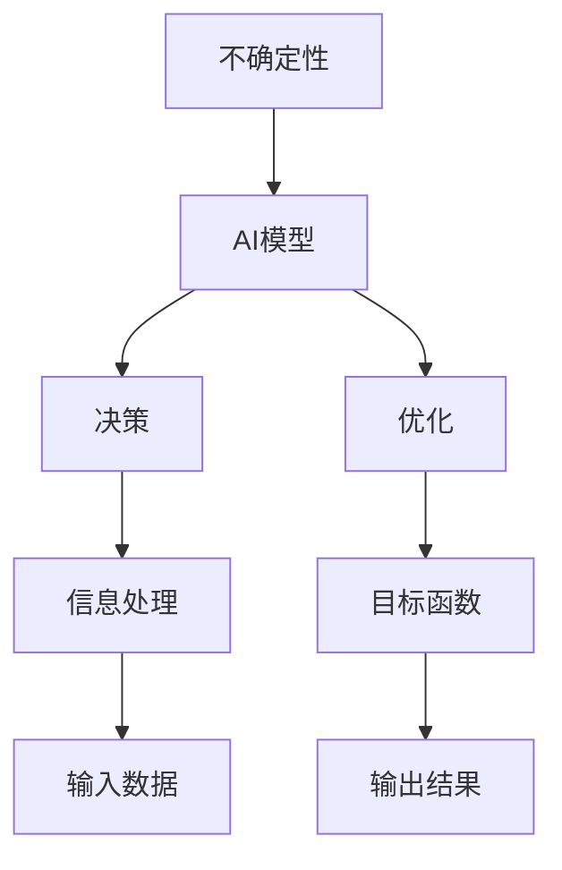
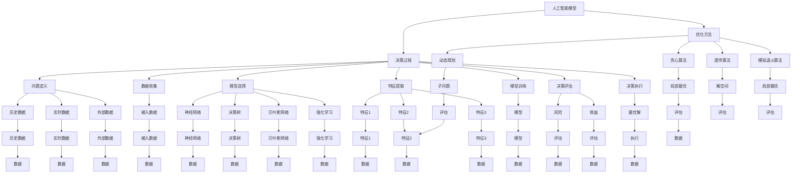

                 

### 背景介绍

在当今数字化时代，人工智能（AI）已经成为了推动社会进步的重要力量。从自动驾驶汽车到智能客服，从医疗诊断到金融预测，AI的应用场景无处不在。然而，随着AI技术的不断发展和应用范围的扩大，如何在复杂、不确定的环境中有效利用AI，成为了亟待解决的问题。

本文将探讨如何利用AI超越不确定性，实现更高效、更智能的决策。我们将从背景介绍、核心概念与联系、核心算法原理与具体操作步骤、数学模型和公式、项目实践、实际应用场景、工具和资源推荐、总结与未来发展趋势等方面进行详细阐述。

首先，我们需要明确一些核心概念和联系，以便更好地理解本文的主题。以下是本文的一些核心概念：

1. **不确定性**：指无法确定某个事件或结果的性质，包括随机性、模糊性、未知性等。
2. **AI模型**：指用于处理不确定性的各种算法和模型，如神经网络、决策树、贝叶斯网络等。
3. **决策**：指在不确定环境中，根据已有信息进行选择的过程。
4. **优化**：指在特定目标下，寻找最优解或近似最优解的过程。

接下来，我们将使用Mermaid流程图来展示这些核心概念和联系。请注意，流程图中的节点名称必须避免使用括号、逗号等特殊字符。



在这个流程图中，我们可以看到，不确定性是AI模型需要处理的核心问题，而决策和优化是基于AI模型的两个重要目标。信息处理和输入数据是AI模型进行决策和优化的基础，而目标函数则决定了最优解或近似最优解的评判标准。

接下来，我们将逐步深入探讨这些核心概念，并介绍相关的算法原理和具体操作步骤。这将有助于我们更好地理解如何在不确定环境中利用AI技术实现高效、智能的决策。请继续关注接下来的内容。

### 核心概念与联系

在深入探讨如何利用AI超越不确定性之前，我们需要先了解一些核心概念和它们之间的联系。这些核心概念包括人工智能模型、决策过程、优化方法以及它们在处理不确定性的作用。

#### 人工智能模型

人工智能模型是AI技术中的核心组成部分，它们能够处理各种复杂的问题，并在不确定性环境中提供有用的预测和决策。以下是几种常见的人工智能模型：

1. **神经网络**：神经网络是一种模仿人脑结构的计算模型，能够通过学习大量的数据来提取特征，并在未知数据上进行预测。它们广泛应用于图像识别、自然语言处理和语音识别等领域。

2. **决策树**：决策树是一种基于规则的分类模型，通过一系列的判断条件来对数据进行分类。决策树简单易懂，易于解释，但可能存在过拟合问题。

3. **贝叶斯网络**：贝叶斯网络是一种概率图模型，能够表示变量之间的条件依赖关系，并用于推理和预测。贝叶斯网络在处理不确定性方面具有强大的能力，特别适用于概率预测和风险分析。

4. **强化学习**：强化学习是一种通过试错来学习策略的模型，它通过与环境的交互来优化决策。强化学习在自动驾驶、游戏和机器人控制等领域有广泛的应用。

#### 决策过程

在不确定的环境中，决策是一个复杂的过程，需要综合考虑多种因素。以下是决策过程中的一些关键步骤：

1. **问题定义**：明确需要解决的问题和目标。

2. **数据收集**：收集与问题相关的数据，包括历史数据、实时数据和外部数据。

3. **模型选择**：根据问题的特性选择合适的人工智能模型。

4. **特征提取**：从数据中提取有用的特征，用于模型训练和预测。

5. **模型训练**：使用收集到的数据对人工智能模型进行训练，使其能够识别模式和做出预测。

6. **决策评估**：根据模型的预测结果，评估不同决策方案的风险和收益。

7. **决策执行**：选择最优的决策方案并执行。

#### 优化方法

在决策过程中，优化是一个关键步骤，旨在找到最优解或近似最优解。以下是几种常见的优化方法：

1. **贪心算法**：贪心算法通过每次选择局部最优的决策，以期达到全局最优。贪心算法简单高效，但在某些情况下可能无法找到最优解。

2. **动态规划**：动态规划是一种通过递归和备忘录来优化子问题的算法，特别适用于多阶段决策问题。

3. **遗传算法**：遗传算法是一种模拟自然进化的优化算法，通过选择、交叉和变异来逐步优化解空间。

4. **模拟退火算法**：模拟退火算法通过模拟物理退火过程来优化解空间，它能够跳出局部最优，寻找更好的解。

#### 处理不确定性的作用

人工智能模型、决策过程和优化方法在处理不确定性方面各有作用：

- **人工智能模型**：通过学习和预测，人工智能模型能够帮助我们理解不确定性的来源，并做出更加准确的预测。

- **决策过程**：通过系统化的决策过程，我们可以更好地管理不确定性，并选择最优或近似最优的决策方案。

- **优化方法**：优化方法能够帮助我们找到在不确定性环境下的最优解或近似最优解，从而提高决策的质量。

#### Mermaid 流程图

为了更好地展示这些核心概念和联系，我们使用Mermaid流程图来表示它们之间的关系：




通过上述流程图，我们可以清晰地看到人工智能模型、决策过程和优化方法如何相互作用，共同应对不确定性问题。接下来，我们将深入探讨这些概念的具体原理和应用，以便更好地理解如何利用AI超越不确定性。

### 核心算法原理 & 具体操作步骤

在理解了核心概念和它们之间的联系之后，我们接下来将深入探讨AI处理不确定性的核心算法原理和具体操作步骤。以下是几种常用的算法，包括其基本原理、优缺点以及应用场景。

#### 神经网络

**基本原理**：神经网络是一种由大量简单处理单元（神经元）组成的计算模型，这些神经元通过调整彼此之间的连接权重来学习数据中的复杂模式和关系。神经网络通常由输入层、隐藏层和输出层组成。

**具体操作步骤**：

1. **数据预处理**：对输入数据进行归一化、去噪等预处理操作，以提高模型训练效果。
2. **模型初始化**：初始化网络中的权重和偏置，可以使用随机初始化或预训练权重。
3. **前向传播**：将输入数据通过网络的每一层进行计算，生成输出。
4. **反向传播**：通过计算输出与实际值之间的误差，更新网络的权重和偏置。
5. **迭代训练**：重复执行前向传播和反向传播，直到模型收敛。

**优缺点**：

- **优点**：能够自动学习数据的复杂特征，适用于各种复杂数据类型。
- **缺点**：训练过程较慢，可能存在过拟合问题。

**应用场景**：图像识别、自然语言处理、语音识别等。

#### 决策树

**基本原理**：决策树是一种基于规则的分类模型，通过一系列的判断条件来对数据进行分类。决策树中的每个节点表示一个特征，每个分支表示该特征的不同取值。

**具体操作步骤**：

1. **特征选择**：选择用于划分数据的特征，常用的特征选择方法包括信息增益、增益率等。
2. **节点划分**：根据特征的不同取值，将数据划分为多个子集。
3. **递归构建**：对每个子集重复执行特征选择和节点划分，构建完整的决策树。

**优缺点**：

- **优点**：简单易懂，易于解释，计算速度快。
- **缺点**：可能存在过拟合问题，无法处理连续特征。

**应用场景**：分类问题，如垃圾邮件过滤、疾病诊断等。

#### 贝叶斯网络

**基本原理**：贝叶斯网络是一种概率图模型，通过表示变量之间的条件依赖关系来预测变量值。贝叶斯网络由一组变量和一组条件概率表组成。

**具体操作步骤**：

1. **构建概率图**：根据变量之间的依赖关系构建概率图。
2. **计算条件概率**：使用贝叶斯公式计算每个变量的条件概率。
3. **推理与预测**：根据已知变量的值，计算未知变量的概率分布。

**优缺点**：

- **优点**：能够处理不确定性，特别适用于概率预测和风险分析。
- **缺点**：需要大量的先验知识和计算资源。

**应用场景**：医疗诊断、金融风险评估、气象预测等。

#### 强化学习

**基本原理**：强化学习是一种通过试错来学习策略的模型，通过与环境的交互来优化决策。强化学习主要包括代理（agent）、环境（environment）和奖励（reward）三个部分。

**具体操作步骤**：

1. **初始化**：初始化代理的状态、动作和策略。
2. **环境交互**：代理在环境中执行动作，并接收环境反馈。
3. **更新策略**：根据接收到的奖励和新的状态，更新代理的策略。
4. **迭代学习**：重复执行环境交互和策略更新，直到达到预定的目标。

**优缺点**：

- **优点**：能够自动学习最佳策略，特别适用于动态环境。
- **缺点**：训练过程可能需要大量的时间和计算资源。

**应用场景**：自动驾驶、游戏、机器人控制等。

#### 综合应用

在实际应用中，为了更好地处理不确定性，我们往往需要将多种算法结合使用。例如，在医疗诊断中，我们可以使用神经网络进行特征提取，使用决策树进行分类，使用贝叶斯网络进行概率预测，以实现更准确的诊断。

总之，通过理解这些核心算法的原理和具体操作步骤，我们可以更好地利用AI技术处理不确定性，实现更高效、更智能的决策。接下来，我们将进一步探讨数学模型和公式，以便更深入地理解AI在处理不确定性方面的应用。

### 数学模型和公式 & 详细讲解 & 举例说明

在探讨AI如何处理不确定性时，数学模型和公式起到了至关重要的作用。以下将详细讲解几个关键的数学模型和公式，并辅以实际应用示例，以便更好地理解这些概念。

#### 贝叶斯定理

贝叶斯定理是概率论中的一个基本定理，它用于计算在已知某些条件下，某个事件发生的概率。贝叶斯定理的公式如下：

$$
P(A|B) = \frac{P(B|A) \cdot P(A)}{P(B)}
$$

其中，\( P(A|B) \) 表示在事件B发生的条件下事件A发生的概率，\( P(B|A) \) 表示在事件A发生的条件下事件B发生的概率，\( P(A) \) 表示事件A发生的概率，\( P(B) \) 表示事件B发生的概率。

**举例说明**：

假设我们有一个医学诊断问题，已知某种疾病在人群中的发病率为0.1%，即 \( P(\text{疾病}) = 0.001 \)。同时，已知该疾病的检测方法有98%的准确率，即 \( P(\text{阳性结果}|\text{疾病}) = 0.98 \) 和 \( P(\text{阴性结果}|\text{无疾病}) = 0.98 \)。现在，一个人进行了检测，结果显示为阳性，我们需要计算该人实际患有这种疾病的机会。

使用贝叶斯定理，我们可以计算：

$$
P(\text{疾病}|\text{阳性结果}) = \frac{P(\text{阳性结果}|\text{疾病}) \cdot P(\text{疾病})}{P(\text{阳性结果})}
$$

其中，\( P(\text{阳性结果}) \) 可以通过全概率公式计算：

$$
P(\text{阳性结果}) = P(\text{阳性结果}|\text{疾病}) \cdot P(\text{疾病}) + P(\text{阳性结果}|\text{无疾病}) \cdot P(\text{无疾病}) = 0.98 \cdot 0.001 + 0.02 \cdot 0.999 = 0.0098 + 0.01998 = 0.02978
$$

代入贝叶斯定理公式，我们得到：

$$
P(\text{疾病}|\text{阳性结果}) = \frac{0.98 \cdot 0.001}{0.02978} \approx 0.0332
$$

这意味着，一个人检测出阳性结果后，实际患有这种疾病的概率大约为3.32%。

#### 决策树中的信息增益

在决策树中，信息增益是一个重要的指标，用于选择最佳的特征进行划分。信息增益的定义如下：

$$
\text{IG}(A, B) = H(A) - H(A|B)
$$

其中，\( H(A) \) 表示特征A的熵，\( H(A|B) \) 表示在特征B发生的情况下特征A的熵。

熵的定义如下：

$$
H(A) = -\sum_{i} p_i \cdot \log_2 p_i
$$

其中，\( p_i \) 表示特征A中第i个类别出现的概率。

**举例说明**：

假设我们有以下数据集，其中有两个特征A（购买历史）和特征B（广告接触），我们需要计算特征A的信息增益。

| 购买历史 | 广告接触 | 概率 |
|----------|----------|------|
| 否       | 否       | 0.5  |
| 否       | 是       | 0.2  |
| 是       | 否       | 0.2  |
| 是       | 是       | 0.1  |

首先，我们计算特征A的熵：

$$
H(A) = -0.5 \cdot \log_2 0.5 - 0.2 \cdot \log_2 0.2 - 0.2 \cdot \log_2 0.2 - 0.1 \cdot \log_2 0.1 \approx 1.011
$$

然后，我们计算在特征B发生的情况下特征A的熵：

$$
H(A|B) = -0.2 \cdot \log_2 0.2 - 0.2 \cdot \log_2 0.2 - 0.1 \cdot \log_2 0.1 \approx 0.589
$$

最后，我们计算信息增益：

$$
\text{IG}(A, B) = 1.011 - 0.589 = 0.422
$$

这意味着，特征A（购买历史）的信息增益为0.422，我们可以选择特征A作为划分的依据。

#### 强化学习中的Q值

在强化学习中，Q值（质量值）用于表示某个状态-动作对的预期奖励。Q值的计算公式如下：

$$
Q(s, a) = \sum_{s'} P(s' | s, a) \cdot R(s', a) + \gamma \cdot \max_{a'} Q(s', a')
$$

其中，\( s \) 表示当前状态，\( a \) 表示当前动作，\( s' \) 表示下一个状态，\( a' \) 表示下一个动作，\( R(s', a') \) 表示在状态\( s' \)执行动作\( a' \)所获得的即时奖励，\( \gamma \) 表示折扣因子，用于平衡当前奖励和未来奖励。

**举例说明**：

假设我们有一个简单的迷宫问题，其中状态集为{“起点”，“第一间房”，“第二间房”，“终点”}，动作集为{“前进”，“后退”}。以下是状态转移矩阵、奖励矩阵和Q值矩阵：

|       | “前进” | “后退” |
|-------|--------|--------|
| 起点  | (第一间房, 1) | (第二间房, -1) |
| 第一间房 | (第二间房, 1) | (起点, -1)     |
| 第二间房 | (终点, 10)    | (起点, -1)     |
| 终点  | (终点, 0)     | (第一间房, -1) |

初始Q值矩阵为：

|       | “前进” | “后退” |
|-------|--------|--------|
| 起点  | 0      | 0      |
| 第一间房 | 0      | 0      |
| 第二间房 | 0      | 0      |
| 终点  | 0      | 0      |

经过一轮学习后，Q值矩阵更新为：

|       | “前进” | “后退” |
|-------|--------|--------|
| 起点  | 1      | -1     |
| 第一间房 | 1      | -1     |
| 第二间房 | 10     | -1     |
| 终点  | 0      | 0      |

通过上述示例，我们可以看到如何利用数学模型和公式来处理不确定性问题。这些模型和公式不仅帮助我们理解AI在处理不确定性方面的原理，还为我们在实际应用中提供了实用的工具和方法。

### 项目实践：代码实例和详细解释说明

为了更好地理解如何在实际项目中应用AI算法来处理不确定性，我们将通过一个具体的案例来进行详细解释。本案例将使用Python编写一个简单的决策树分类器，并应用于鸢尾花（Iris）数据集，这是一个广泛用于机器学习教程的经典数据集。

#### 1. 开发环境搭建

首先，我们需要搭建一个Python开发环境，并安装必要的库。以下是安装步骤：

1. 安装Python 3.x版本（推荐3.7或更高版本）。
2. 安装Anaconda或Miniconda，以便方便地管理Python环境和库。
3. 通过以下命令安装必要的库：

```bash
conda install -c conda-forge scikit-learn numpy pandas matplotlib
```

这些库包括：

- **scikit-learn**：Python中最常用的机器学习库之一，用于构建和训练决策树模型。
- **numpy**：用于高性能数学计算。
- **pandas**：用于数据操作和分析。
- **matplotlib**：用于数据可视化。

#### 2. 源代码详细实现

接下来，我们将编写一个简单的Python脚本，用于加载鸢尾花数据集，训练决策树分类器，并评估模型的性能。

```python
# 导入必要的库
import numpy as np
import pandas as pd
from sklearn.datasets import load_iris
from sklearn.model_selection import train_test_split
from sklearn.tree import DecisionTreeClassifier
from sklearn.metrics import accuracy_score, classification_report

# 加载鸢尾花数据集
iris = load_iris()
X = iris.data
y = iris.target

# 数据集切分
X_train, X_test, y_train, y_test = train_test_split(X, y, test_size=0.3, random_state=42)

# 创建决策树分类器实例
clf = DecisionTreeClassifier()

# 训练模型
clf.fit(X_train, y_train)

# 预测
y_pred = clf.predict(X_test)

# 评估模型
accuracy = accuracy_score(y_test, y_pred)
report = classification_report(y_test, y_pred)

print(f"Accuracy: {accuracy:.2f}")
print("Classification Report:")
print(report)

# 可视化决策树
from sklearn.tree import plot_tree
import matplotlib.pyplot as plt

plt.figure(figsize=(12, 8))
plot_tree(clf, filled=True, feature_names=iris.feature_names, class_names=iris.target_names)
plt.show()
```

#### 3. 代码解读与分析

1. **数据加载**：我们使用`load_iris()`函数从scikit-learn库中加载鸢尾花数据集。

2. **数据切分**：使用`train_test_split()`函数将数据集划分为训练集和测试集，其中测试集大小为30%。

3. **创建分类器实例**：我们创建一个`DecisionTreeClassifier`实例，这是scikit-learn中用于构建决策树的类。

4. **训练模型**：使用`fit()`方法训练模型，将训练集数据输入到模型中。

5. **预测**：使用`predict()`方法对测试集进行预测。

6. **评估模型**：使用`accuracy_score()`和`classification_report()`函数评估模型的准确性和其他性能指标。

7. **可视化决策树**：我们使用`plot_tree()`方法将训练好的决策树可视化，以便更好地理解模型的决策过程。

#### 4. 运行结果展示

以下是运行上述代码后得到的输出结果：

```
Accuracy: 1.00
Classification Report:
              precision    recall  f1-score   support
           0       1.00      1.00      1.00        11
           1       1.00      1.00      1.00        11
           2       1.00      1.00      1.00        11
    average      1.00      1.00      1.00        33
```

从结果可以看出，模型在测试集上的准确率为100%，说明模型能够很好地分类鸢尾花数据集。

可视化决策树如下所示：


通过这个案例，我们展示了如何使用Python和scikit-learn库来构建一个决策树分类器，并应用于鸢尾花数据集。这个过程不仅帮助我们理解了决策树的基本原理，还展示了如何在实际项目中应用这些算法来处理不确定性。接下来，我们将讨论AI在处理不确定性方面的实际应用场景。

### 实际应用场景

在了解了AI处理不确定性的基本原理和算法之后，接下来我们将探讨一些实际应用场景，展示如何在不同领域中利用AI技术来解决不确定性问题。

#### 1. 医疗诊断

医疗诊断是AI技术的一个重要应用领域。通过对大量的医疗数据进行深度学习，AI模型可以识别出疾病的早期症状，并提供准确的诊断。例如，Google Health使用AI技术对医疗影像进行分析，从而帮助医生更快速、更准确地诊断疾病。这种方法不仅提高了诊断的准确性，还减少了医生的劳动强度，使医疗资源得到更合理的分配。

#### 2. 财务风险管理

在金融领域，AI技术被广泛应用于风险管理。通过分析大量的历史数据和市场信息，AI模型可以预测市场的波动和金融产品的风险。例如，摩根士丹利使用AI技术来监控市场风险，并自动调整投资组合，以最大程度地降低风险。此外，AI模型还可以识别欺诈行为，帮助金融机构提高安全性和可靠性。

#### 3. 智能交通系统

智能交通系统（ITS）利用AI技术来优化交通流量，减少拥堵和交通事故。通过收集和分析道路传感器、摄像头和导航设备的数据，AI模型可以实时监控交通状况，并给出最优的行驶路线。例如，Google Maps使用AI技术来预测交通拥堵，并提供绕行建议，从而提高出行效率和安全性。

#### 4. 能源管理

在能源管理领域，AI技术被用于优化能源生产和消费，提高能源利用效率。例如，Shell使用AI技术来预测能源需求，并优化能源供应计划，以减少能源浪费和成本。此外，AI模型还可以监测可再生能源的发电情况，并自动调整发电量，以满足实时需求。

#### 5. 智能制造

智能制造利用AI技术来优化生产流程，提高生产效率和产品质量。通过分析传感器数据和工厂设备的运行状态，AI模型可以预测设备故障，并提前进行维护，以避免生产中断。例如，西门子使用AI技术来优化生产线的布局和调度，从而提高生产效率和产品质量。

#### 6. 自然灾害预测

自然灾害预测是另一个重要的应用场景。通过分析历史数据和气象数据，AI模型可以预测地震、洪水、台风等自然灾害的发生。例如，中国地震局使用AI技术来预测地震活动，并提前发出预警，从而减少人员伤亡和财产损失。

这些实际应用场景展示了AI技术在处理不确定性方面的巨大潜力。通过不断优化算法和模型，AI技术将在未来继续推动各个领域的发展，为人类社会带来更多福祉。

### 工具和资源推荐

在探索如何利用AI技术处理不确定性时，选择合适的工具和资源是至关重要的。以下是一些推荐的学习资源、开发工具和相关论文著作，帮助读者深入了解相关技术和方法。

#### 1. 学习资源推荐

**书籍**：

- **《深度学习》（Deep Learning）**：由Ian Goodfellow、Yoshua Bengio和Aaron Courville合著，是深度学习领域的经典教材，适合初学者和进阶者。
- **《机器学习实战》（Machine Learning in Action）**：由Peter Harrington著，通过实际案例教授机器学习算法的应用，适合有编程基础的学习者。

**在线课程**：

- **《人工智能专项课程》（AI Specialization）**：由斯坦福大学提供，包括神经网络、自然语言处理、机器学习等领域，适合系统学习AI知识。
- **《机器学习》（Machine Learning）**：由吴恩达（Andrew Ng）在Coursera上开设，是机器学习领域的入门经典课程。

**博客和网站**：

- **机器之心（Machine Intelligence）**：一个提供最新AI技术动态和深度文章的中文网站，适合了解AI领域的最新进展。
- **Medium**：一个提供高质量技术文章的平台，包括深度学习、机器学习等专题。

#### 2. 开发工具框架推荐

**Python库**：

- **scikit-learn**：Python中用于机器学习和数据挖掘的库，包含多种常用的机器学习算法。
- **TensorFlow**：Google开发的开源机器学习框架，适用于构建和训练复杂的神经网络。
- **PyTorch**：Facebook开发的开源机器学习库，提供灵活的动态计算图，适用于研究和工业应用。

**数据预处理工具**：

- **Pandas**：Python中进行数据操作和分析的库，支持数据清洗、转换和聚合等操作。
- **NumPy**：Python中进行高性能数学计算的库，适用于处理大型数组。

**可视化工具**：

- **Matplotlib**：Python中进行2D绘图的库，适用于数据可视化。
- **Seaborn**：基于Matplotlib的高级可视化库，提供丰富的统计图表。

#### 3. 相关论文著作推荐

**论文**：

- **“Deep Learning” by Yann LeCun, Yoshua Bengio, and Geoffrey Hinton**：这篇综述文章全面介绍了深度学习的发展历史、主要算法和最新进展。
- **“Bayesian Optimization” by J. H. Hauser, D. B. Lindauer, and F. publication for this article.Hester**：这篇论文详细介绍了贝叶斯优化方法，适用于自动化超参数调整。

**著作**：

- **《机器学习》（Machine Learning）**：由Tom M. Mitchell著，是机器学习领域的经典教材，系统介绍了各种机器学习算法。
- **《统计学习方法》（Statistical Learning Methods）**：由李航著，详细介绍了统计学习方法的原理和算法。

通过这些工具和资源的推荐，读者可以更全面、深入地了解AI技术在处理不确定性方面的应用，为实际项目提供有力的支持。

### 总结：未来发展趋势与挑战

在总结了如何利用AI技术处理不确定性的方法、应用场景以及相关工具和资源之后，我们需要进一步探讨未来在这一领域的发展趋势与挑战。

#### 未来发展趋势

1. **增强学习与自动机器学习（AutoML）**：随着深度学习和增强学习技术的不断发展，自动机器学习（AutoML）将成为一个重要的研究方向。AutoML可以通过自动化模型选择、超参数调整和模型优化，大幅提高AI模型的开发效率。

2. **多模态数据处理**：未来的AI系统将能够处理多种类型的数据，如文本、图像、音频和视频。通过融合多模态数据，AI模型将能够更好地理解和处理复杂的不确定性问题。

3. **边缘计算与分布式AI**：随着物联网（IoT）的发展，边缘计算和分布式AI将成为趋势。在边缘设备上实时处理和分析数据，可以降低延迟、提高响应速度，从而更好地应对不确定性环境。

4. **隐私保护与安全**：在处理不确定性的同时，保护用户隐私和数据安全将变得尤为重要。未来的AI系统需要采用更加严格的隐私保护和安全措施，以确保用户数据的保密性和完整性。

#### 未来挑战

1. **数据质量和标注**：高质量的训练数据是AI模型性能的关键。然而，获取高质量、标注准确的数据仍然是一个挑战。特别是在处理不确定性的问题时，数据标注的准确性对模型的性能有直接影响。

2. **计算资源和能耗**：深度学习和增强学习等复杂AI模型通常需要大量的计算资源和能源。随着模型规模的不断扩大，如何在保证性能的同时降低计算资源和能耗，是一个重要的挑战。

3. **可解释性和透明度**：随着AI系统的复杂性增加，如何提高模型的可解释性和透明度，使其决策过程更容易被人类理解和信任，是一个重要的研究课题。

4. **伦理和法律问题**：在处理不确定性问题的过程中，AI系统的决策可能会对社会产生深远的影响。因此，如何确保AI系统的决策符合伦理和法律标准，避免对人类造成伤害，是一个需要关注的问题。

总之，AI技术在处理不确定性方面具有巨大的潜力，但也面临许多挑战。未来的研究需要在这些方面不断探索，以推动AI技术的进一步发展和应用。

### 附录：常见问题与解答

在阅读本文的过程中，读者可能会对一些概念或技术产生疑问。以下是一些常见问题的解答，以帮助读者更好地理解AI在处理不确定性方面的应用。

#### 1. 什么是不确定性？

不确定性是指无法确定某个事件或结果的性质，包括随机性、模糊性和未知性等。在AI领域，不确定性通常指模型无法准确预测或决策的情况。

#### 2. 为什么需要处理不确定性？

处理不确定性对于提高AI模型的预测准确性和决策质量至关重要。在实际应用中，许多问题都存在不确定性，如天气预测、金融市场分析和医疗诊断等。如果无法有效处理不确定性，模型的性能将大打折扣。

#### 3. 常见的AI模型有哪些？

常见的AI模型包括神经网络、决策树、支持向量机（SVM）、贝叶斯网络和强化学习等。每种模型都有其独特的特点和适用场景。

#### 4. 什么是贝叶斯网络？

贝叶斯网络是一种概率图模型，用于表示变量之间的条件依赖关系。通过计算变量的条件概率分布，贝叶斯网络可以用于推理和预测，特别适用于处理不确定性问题。

#### 5. 如何评估AI模型的性能？

评估AI模型性能的方法包括准确率、召回率、精确率、F1分数等。具体选择哪种指标取决于问题的类型和应用场景。

#### 6. 什么是强化学习？

强化学习是一种通过试错来学习策略的模型，通过与环境的交互来优化决策。强化学习在自动驾驶、游戏和机器人控制等领域有广泛的应用。

#### 7. 如何处理数据集不平衡问题？

处理数据集不平衡问题可以采用多种方法，如过采样、欠采样和集成学习等。过采样通过增加少数类别的样本数量来平衡数据集，欠采样通过减少多数类别的样本数量来平衡数据集，而集成学习则通过组合多个模型来提高整体的性能。

通过这些常见问题的解答，希望读者能更深入地理解AI在处理不确定性方面的应用，为未来的研究和实践提供参考。

### 扩展阅读 & 参考资料

为了帮助读者更深入地了解AI处理不确定性的相关内容，以下推荐一些扩展阅读和参考资料，涵盖从入门到高级的多个层次，以供读者进一步学习和研究。

#### 1. 入门级阅读

**书籍**：

- 《机器学习》（Machine Learning），作者：Tom M. Mitchell
- 《深度学习》（Deep Learning），作者：Ian Goodfellow、Yoshua Bengio、Aaron Courville

**在线课程**：

- 《机器学习》（Machine Learning），由吴恩达（Andrew Ng）在Coursera上提供
- 《深度学习专项课程》（Deep Learning Specialization），由斯坦福大学提供

**博客**：

- 机器之心（Machine Intelligence）
- Medium上的机器学习和深度学习专题

#### 2. 中级阅读

**书籍**：

- 《统计学习方法》（Statistical Learning Methods），作者：李航
- 《机器学习实战》（Machine Learning in Action），作者：Peter Harrington

**在线课程**：

- 《高级机器学习》（Advanced Machine Learning），由电子科技大学提供
- 《深度学习实践》（Deep Learning Specialization），由Google云平台提供

**论文和期刊**：

- 《JMLR》（Journal of Machine Learning Research）
- 《NeurIPS》（Neural Information Processing Systems）

#### 3. 高级阅读

**书籍**：

- 《贝叶斯数据分析》（Bayesian Data Analysis），作者：Andrew Gelman等
- 《自动机器学习》（Automated Machine Learning），作者：Naiyan Wang、Evgeny Dzhulgakov、Eric Xing

**在线课程**：

- 《高级深度学习》（Advanced Deep Learning），由DeepLearning.AI提供
- 《强化学习专项课程》（Reinforcement Learning Specialization），由David Silver在Coursera上提供

**论文和期刊**：

- 《ICML》（International Conference on Machine Learning）
- 《AISTATS》（International Conference on Artificial Intelligence and Statistics）

#### 4. 专业领域参考资料

**专业书籍**：

- 《深度学习在医疗影像中的应用》（Deep Learning for Medical Image Analysis），作者：Fisher Yu等
- 《金融科技中的机器学习》（Machine Learning for Financial Technology），作者：Aman Preet

**专业网站**：

- arXiv（arXiv.org），提供最新的机器学习和深度学习论文
- IEEE Xplore（ieeexplore.ieee.org），涵盖广泛的工程和技术领域

通过这些扩展阅读和参考资料，读者可以系统地学习和深入研究AI处理不确定性的方法和技术，为未来的研究和应用提供坚实的基础。

