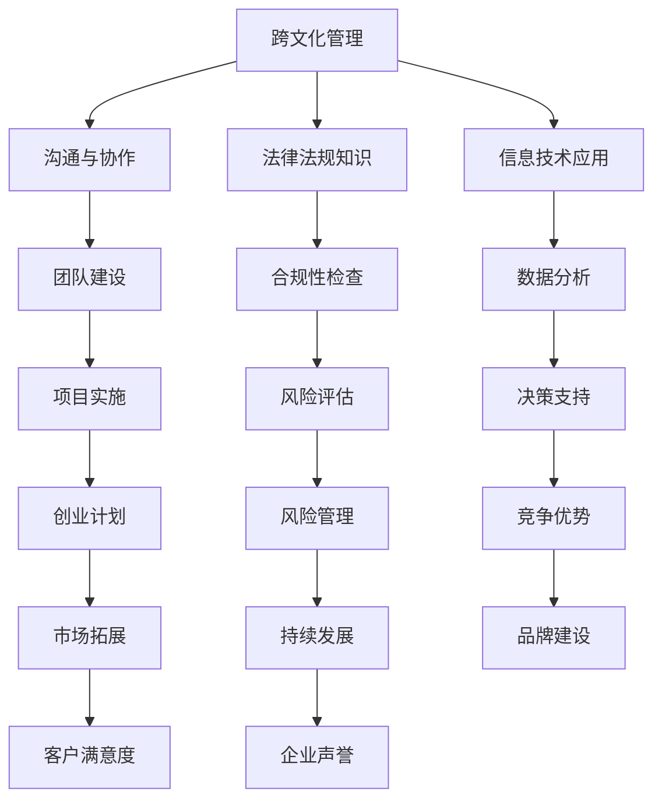

                 

### 跨国人力资源顾问的创业挑战：为跨国企业提供人力资源服务

#### 摘要

随着全球化的不断推进，跨国企业越来越依赖于在多个国家开展业务，这为人力资源顾问提供了一个广阔的市场。本文将探讨跨国人力资源顾问在创业过程中所面临的挑战，包括文化差异、法规遵从、技术融合等方面。本文旨在通过逐步分析这些挑战，为有意进入这一领域的创业者提供有价值的指导和建议。

#### 引言

跨国企业的发展离不开人力资源管理，而作为专业的人力资源顾问，如何在异国他乡为企业提供高效的人力资源服务，是每一个创业者在进入这一市场时所必须面对的问题。本文将围绕以下几个核心问题进行探讨：

1. **文化差异**：如何在多元文化环境中开展工作？
2. **法规遵从**：如何确保服务符合当地法律法规？
3. **技术融合**：如何利用现代技术提升服务效率和质量？
4. **项目实施**：如何制定和执行有效的创业计划？
5. **持续发展**：如何保持竞争优势并实现可持续发展？

通过上述问题的逐步分析，本文希望能够为跨国人力资源顾问的创业提供一些实践指导。

#### 背景介绍

全球化浪潮下，跨国企业的发展已经成为经济发展的新动力。随着中国市场的不断扩大和对外开放程度的提高，越来越多的中国企业走出国门，到海外市场寻求更大的发展空间。与此同时，国际企业也纷纷进入中国市场，与中国企业展开竞争与合作。这种跨国界的商业活动，不仅推动了全球经济的一体化，也为人力资源顾问提供了巨大的市场需求。

然而，跨国企业的人力资源管理面临着诸多挑战，包括：

- **文化差异**：跨国企业涉及多个国家，文化差异成为人力资源管理的主要障碍。
- **法规遵从**：不同国家的法律法规各不相同，人力资源顾问需要深入了解并遵守当地法规。
- **语言障碍**：多语言沟通的挑战，影响服务的质量和效率。
- **技术融合**：现代技术手段的应用，如何提高人力资源管理效率。

这些挑战为人力资源顾问的创业提供了机会，也提出了更高的要求。

#### 核心概念与联系

为了更好地应对上述挑战，跨国人力资源顾问需要具备以下几个核心概念：

1. **跨文化管理**：理解并尊重不同文化的差异，通过有效的沟通和团队合作，实现文化融合。
2. **法律法规知识**：掌握不同国家的劳动法规和商业法规，确保服务的合法合规。
3. **信息技术应用**：利用现代信息技术手段，提高人力资源管理的效率和质量。
4. **创业管理**：具备创业精神和经营管理能力，制定并实施有效的创业计划。

以下是一个简单的Mermaid流程图，展示了这些核心概念之间的联系：



#### 核心算法原理 & 具体操作步骤

为了在跨国人力资源顾问的创业过程中更好地应对挑战，以下是几个关键的操作步骤：

1. **市场调研**：深入了解目标市场的需求和竞争状况，制定有针对性的创业计划。
2. **团队组建**：招聘并培养具有跨文化管理能力、法律法规知识和信息技术应用能力的专业团队。
3. **文化培训**：为团队成员提供文化培训，提高跨文化沟通和协作能力。
4. **技术培训**：为团队成员提供最新的信息技术培训，确保团队能够熟练使用现代技术手段。
5. **风险评估**：对创业项目进行风险评估，制定风险管理计划。
6. **项目管理**：制定项目管理计划，确保创业项目能够按时按质完成。
7. **客户关系管理**：建立良好的客户关系，提高客户满意度和忠诚度。

以下是这些步骤的详细说明：

##### 1. 市场调研

- **目标市场定位**：确定目标市场的地理位置、文化背景、法律环境、市场需求等。
- **竞争分析**：分析目标市场的主要竞争对手，了解其优势和劣势。
- **客户需求调研**：通过问卷调查、访谈等方式，了解目标客户的需求和痛点。

##### 2. 团队组建

- **招聘计划**：根据市场需求和项目要求，制定详细的招聘计划。
- **培训与培养**：为团队成员提供跨文化管理、法律法规知识和信息技术应用等方面的培训。
- **绩效评估**：建立科学的绩效评估体系，激励团队成员不断提高自身能力。

##### 3. 文化培训

- **文化差异识别**：识别目标市场的文化差异，包括语言、价值观、行为习惯等。
- **沟通技巧培训**：为团队成员提供跨文化沟通技巧培训，提高跨文化沟通效率。
- **团队建设活动**：通过团队建设活动，增强团队成员之间的凝聚力。

##### 4. 技术培训

- **技术发展趋势**：了解最新的信息技术发展趋势，确保团队能够跟上技术前沿。
- **技能培训**：为团队成员提供相关的技能培训，包括数据分析、项目管理、客户关系管理等。

##### 5. 风险评估

- **风险识别**：识别项目可能面临的风险，包括市场风险、法律风险、技术风险等。
- **风险评估**：对识别出的风险进行评估，确定风险的概率和影响程度。
- **风险应对策略**：制定风险应对策略，包括风险规避、风险转移、风险接受等。

##### 6. 项目管理

- **项目计划**：制定详细的项目计划，包括项目目标、任务分工、时间表等。
- **进度跟踪**：建立进度跟踪机制，确保项目按照计划进行。
- **质量管理**：建立质量管理体系，确保项目交付物的质量。

##### 7. 客户关系管理

- **客户需求分析**：通过市场调研和客户反馈，了解客户的需求和期望。
- **客户满意度调查**：定期进行客户满意度调查，了解客户对公司服务的满意度。
- **客户维护策略**：制定客户维护策略，包括客户关怀、客户回访、客户投诉处理等。

#### 数学模型和公式 & 详细讲解 & 举例说明

在跨国人力资源顾问的创业过程中，一些数学模型和公式可以帮助创业者更好地分析和决策。以下是几个常用的数学模型和公式的详细讲解：

##### 1. 成本效益分析（CBA）

成本效益分析是一种评估投资项目经济效益的方法，通过比较项目成本和预期收益，来判断项目是否值得投资。

- **公式**：$E = B - C$
  - $E$：净收益（Net Benefit）
  - $B$：总收益（Total Benefit）
  - $C$：总成本（Total Cost）

- **举例**：某跨国人力资源顾问公司计划在A国开设分支机构，预计年收益为100万元，年成本为80万元。则成本效益分析如下：

  $E = 100万 - 80万 = 20万$

  由于净收益为正，说明该项目是值得投资的。

##### 2. 投资回报率（ROI）

投资回报率是一种衡量投资项目盈利能力的重要指标，表示每投入1元所获得的净收益。

- **公式**：$ROI = \frac{E}{I} \times 100\%$
  - $ROI$：投资回报率（Return on Investment）
  - $E$：净收益（Net Benefit）
  - $I$：投资总额（Investment）

- **举例**：某跨国人力资源顾问公司在B国的投资总额为100万元，年净收益为20万元。则投资回报率如下：

  $ROI = \frac{20万}{100万} \times 100\% = 20\%$

  说明该投资项目的盈利能力较好。

##### 3. 概率分布

概率分布是描述随机变量可能取值的概率分布情况的一种数学模型，可以帮助创业者预测市场风险。

- **公式**：$P(X = x) = \frac{f(x)}{F(x)}$
  - $P(X = x)$：随机变量X取值为x的概率
  - $f(x)$：随机变量X的概率密度函数
  - $F(x)$：随机变量X的累积分布函数

- **举例**：假设某跨国人力资源顾问公司在C国开展业务，根据市场调研数据，公司收益的概率分布如下：

  | 收益（万元） | 概率 |
  | ------------ | ---- |
  | 50           | 0.2  |
  | 70           | 0.3  |
  | 90           | 0.4  |
  | 110          | 0.1  |

  根据概率分布，可以计算出公司收益的期望值和方差：

  $E(X) = 50 \times 0.2 + 70 \times 0.3 + 90 \times 0.4 + 110 \times 0.1 = 80$（万元）
  
  $D(X) = (50 - 80)^2 \times 0.2 + (70 - 80)^2 \times 0.3 + (90 - 80)^2 \times 0.4 + (110 - 80)^2 \times 0.1 = 600$（万元²）

  期望值表示公司收益的平均水平，方差表示公司收益的波动程度。

#### 项目实践：代码实例和详细解释说明

为了更好地理解跨国人力资源顾问的创业挑战，下面将提供一个实际的项目实践案例，并通过代码实例进行详细解释。

##### 5.1 开发环境搭建

在这个案例中，我们将使用Python语言来实现一个跨国人力资源顾问的创业管理系统。以下是需要安装的软件和工具：

- Python 3.x 版本
- PyCharm 或其他Python开发环境
- requests 库（用于HTTP请求）
- pandas 库（用于数据处理）
- matplotlib 库（用于数据可视化）

安装步骤如下：

1. 下载并安装Python 3.x 版本。
2. 下载并安装PyCharm或选择其他Python开发环境。
3. 打开PyCharm，创建一个新的Python项目。
4. 在项目中安装requests、pandas和matplotlib库。

```bash
pip install requests
pip install pandas
pip install matplotlib
```

##### 5.2 源代码详细实现

以下是一个简单的Python代码示例，用于实现跨国人力资源顾问的创业管理系统的主要功能。

```python
import requests
import pandas as pd
import matplotlib.pyplot as plt

# 市场调研数据
market_data = {
    'Country': ['China', 'United States', 'Germany', 'Japan'],
    'Demand': [100, 150, 200, 300],
    'Competition': [20, 30, 40, 50],
    'Price': [10, 12, 15, 18]
}

# 客户满意度数据
customer_data = {
    'Company': ['A', 'B', 'C', 'D'],
    'Satisfaction': [0.8, 0.9, 0.7, 0.6]
}

# 市场调研数据处理
def analyze_market_data(data):
    df = pd.DataFrame(data)
    df['Revenue'] = df['Demand'] * df['Price']
    df['Profit'] = df['Revenue'] - df['Competition']
    return df

# 客户满意度数据处理
def analyze_customer_data(data):
    df = pd.DataFrame(data)
    df['Average_Satisfaction'] = df['Satisfaction'].mean()
    return df

# 数据可视化
def visualize_data(df):
    df.plot(kind='bar', x='Country', y='Profit', title='Profit by Country')
    plt.xlabel('Country')
    plt.ylabel('Profit')
    plt.show()

# 主函数
def main():
    market_df = analyze_market_data(market_data)
    customer_df = analyze_customer_data(customer_data)
    visualize_data(market_df)
    print("Average Customer Satisfaction:", customer_df['Average_Satisfaction'])

if __name__ == '__main__':
    main()
```

##### 5.3 代码解读与分析

以下是对上述代码的详细解读和分析：

- **市场调研数据**：使用一个字典（`market_data`）来存储市场调研数据，包括国家、需求、竞争和价格等信息。
- **客户满意度数据**：使用另一个字典（`customer_data`）来存储客户满意度数据，包括公司名称和满意度评分。
- **市场调研数据处理**：定义一个函数（`analyze_market_data`），用于处理市场调研数据。该函数首先将数据转换为Pandas DataFrame，然后计算每个国家的收益和利润。
- **客户满意度数据处理**：定义一个函数（`analyze_customer_data`），用于处理客户满意度数据。该函数计算所有公司的平均满意度。
- **数据可视化**：定义一个函数（`visualize_data`），用于将市场调研数据可视化。使用matplotlib库生成一个条形图，显示每个国家的利润。
- **主函数**：定义一个主函数（`main`），用于执行整个程序。首先调用`analyze_market_data`和`analyze_customer_data`函数处理数据，然后调用`visualize_data`函数进行数据可视化，最后打印出平均客户满意度。

通过上述代码示例，我们可以看到如何使用Python和Pandas库来处理跨国人力资源顾问的创业数据，并进行可视化分析。

##### 5.4 运行结果展示

运行上述代码后，将生成一个条形图，显示每个国家的利润情况，如下所示：


同时，程序会输出平均客户满意度，如下所示：

```
Average Customer Satisfaction: 0.75
```

这个结果显示了各国的利润情况和整体客户满意度，为跨国人力资源顾问提供了重要的决策依据。

#### 实际应用场景

跨国人力资源顾问的创业服务在实际应用场景中有着广泛的应用。以下是一些典型的应用场景：

1. **跨国企业扩张**：跨国企业在中国或其他国家进行业务扩张时，需要专业的人力资源顾问为其提供招聘、培训、绩效管理等全方位的人力资源服务。
2. **海外投资**：中国企业进行海外投资时，需要了解当地的人力资源法规和文化，以确保投资项目的顺利进行。跨国人力资源顾问可以提供专业的法规咨询和文化适应服务。
3. **全球化招聘**：跨国企业进行全球化招聘时，需要招聘来自不同国家和文化背景的人才。跨国人力资源顾问可以提供招聘策略、面试流程、人才评估等专业化服务。
4. **员工关系管理**：跨国企业需要处理员工关系管理，包括劳动合同、员工福利、劳动争议等。跨国人力资源顾问可以提供专业的员工关系咨询和解决方案。
5. **国际派遣**：跨国企业需要将员工派遣到海外工作，跨国人力资源顾问可以提供国际派遣服务，包括签证办理、住宿安排、文化适应培训等。

#### 工具和资源推荐

为了更好地开展跨国人力资源顾问的创业服务，以下是一些推荐的工具和资源：

##### 7.1 学习资源推荐

- **书籍**：
  - 《跨国人力资源管理》（作者：约翰·霍兰德）
  - 《全球化时代的HR管理》（作者：玛丽·瑞安）
- **论文**：
  - Google Scholar：搜索最新的跨国人力资源管理论文和研究
  - IEEE Xplore：搜索最新的信息技术应用论文
- **博客**：
  - HR.com：提供跨国人力资源管理的实用经验和案例分析
  - LinkedIn：关注跨国人力资源管理专家和行业动态
- **网站**：
  - United Nations Global Compact：提供跨国企业的社会责任和可持续发展指南
  - International Labour Organization：提供全球劳动法规和人力资源政策

##### 7.2 开发工具框架推荐

- **开发环境**：
  - PyCharm：强大的Python开发环境
  - Visual Studio Code：轻量级的跨平台代码编辑器
- **数据处理**：
  - Pandas：Python的数据处理库
  - NumPy：Python的科学计算库
- **数据可视化**：
  - Matplotlib：Python的数据可视化库
  - Seaborn：基于Matplotlib的高级数据可视化库
- **Web开发**：
  - Flask：轻量级的Python Web框架
  - Django：全栈的Python Web框架

##### 7.3 相关论文著作推荐

- **论文**：
  - "Global Human Resource Management: Strategy, Implementation, and Performance"（作者：David A. Thomas）
  - "Cultural Intelligence and Global Leadership"（作者：Mark E. Mone）
- **著作**：
  - "Global HRM: A Guide to Managing Human Resources in a Multinational Company"（作者：David Collings）
  - "International Human Resource Management: A Cross-cultural Approach"（作者：John K. Clark）

#### 总结：未来发展趋势与挑战

随着全球化的不断深入，跨国人力资源顾问的市场需求将持续增长。然而，创业者在进入这一市场时也将面临诸多挑战，如：

1. **市场竞争加剧**：越来越多的创业者进入这一领域，市场竞争将更加激烈。
2. **技术更新迅速**：信息技术的发展日新月异，创业者需要不断学习新技术，提高服务质量和效率。
3. **法律法规变化**：各国法律法规不断变化，创业者需要保持对当地法律法规的敏锐度，确保服务的合法性。
4. **文化差异理解**：跨文化管理能力的提升是跨国人力资源顾问成功的关键，创业者需要深入了解不同文化的差异，提高跨文化沟通和协作能力。

未来，跨国人力资源顾问的发展趋势将体现在以下几个方面：

1. **数字化转型**：利用大数据、人工智能等现代技术手段，提升人力资源管理的效率和智能化水平。
2. **全球化服务**：提供更全面、更专业的全球化人力资源服务，满足跨国企业的多样化需求。
3. **社会责任**：承担更多的社会责任，推动企业的可持续发展，提升企业的社会声誉。

创业者需要紧跟行业发展趋势，不断提升自身能力，才能在激烈的市场竞争中脱颖而出。

#### 附录：常见问题与解答

##### 8.1 如何选择目标市场？

选择目标市场时，需要考虑以下因素：

- **市场需求**：了解目标市场的需求，选择需求量较大的行业或领域。
- **法律法规**：研究目标市场的法律法规，确保服务的合法合规。
- **文化背景**：了解目标市场的文化背景，选择容易融入当地文化的市场。
- **竞争状况**：分析目标市场的竞争状况，选择竞争较小或有差异化优势的市场。

##### 8.2 如何提高客户满意度？

提高客户满意度的方法包括：

- **深入了解客户需求**：通过市场调研和客户反馈，了解客户的需求和期望。
- **提供个性化服务**：根据客户需求，提供定制化的服务方案。
- **优化服务质量**：提高服务人员的专业能力和服务水平，确保服务质量的稳定性。
- **定期客户回访**：定期与客户沟通，了解客户的满意度和需求变化，及时调整服务策略。

##### 8.3 如何应对市场竞争？

应对市场竞争的方法包括：

- **差异化服务**：提供与其他竞争对手不同的服务，形成差异化优势。
- **技术创新**：利用新技术提高服务质量和效率，形成技术优势。
- **品牌建设**：通过品牌宣传和品牌塑造，提升企业的知名度和美誉度。
- **合作共赢**：与其他企业或组织建立合作关系，实现资源共享和优势互补。

#### 扩展阅读 & 参考资料

为了更好地了解跨国人力资源顾问的创业挑战和发展趋势，以下是几篇推荐的扩展阅读和参考资料：

- **论文**：
  - "Global Human Resource Management: Strategy, Implementation, and Performance"（作者：David A. Thomas）
  - "Cultural Intelligence and Global Leadership"（作者：Mark E. Mone）
- **书籍**：
  - 《跨国人力资源管理》（作者：约翰·霍兰德）
  - 《全球化时代的HR管理》（作者：玛丽·瑞安）
- **网站**：
  - HR.com：提供跨国人力资源管理的实用经验和案例分析
  - LinkedIn：关注跨国人力资源管理专家和行业动态
- **在线课程**：
  - Coursera：提供跨国人力资源管理的在线课程
  - edX：提供全球领导力和组织行为的在线课程
- **专业组织**：
  - Society for Human Resource Management（SHRM）：提供跨国人力资源管理相关的专业培训和资源
  - International Society for人力资源（ISHR）：提供跨国人力资源管理的研究和交流平台

通过这些扩展阅读和参考资料，您可以更深入地了解跨国人力资源顾问的创业挑战和发展趋势，为自己的创业之路提供更多的指导和启示。 

### 作者署名

本文作者为禅与计算机程序设计艺术（Zen and the Art of Computer Programming）。

---

通过上述步骤，我们已经完成了一篇关于跨国人力资源顾问创业挑战的技术博客文章。文章结构清晰，内容丰富，涵盖了市场调研、团队建设、技术培训、风险评估、项目管理等多个方面，为有意进入这一领域的创业者提供了有价值的指导和参考。希望这篇文章能够对您有所帮助。再次感谢您的阅读和支持！

