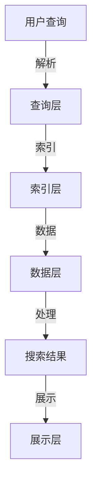

                 

### 1. 背景介绍

跨平台搜索一直是互联网用户和多平台应用开发者的痛点。随着互联网的迅猛发展和各种移动设备的普及，用户对于信息获取的需求越来越多样化和复杂化。传统的单一平台搜索已经难以满足用户在多个设备、多个平台间无缝切换的搜索需求。例如，用户在电脑上搜索到一个商品，可能需要在手机上查看详细信息和用户评价，甚至可能需要在社交平台上与他人讨论购买体验。

这种现象推动了跨平台搜索技术的发展。跨平台搜索不仅限于文本信息，还包括图片、视频、音频等多媒体内容。通过整合多渠道数据，跨平台搜索可以为用户提供更加全面、准确的搜索结果，从而提升用户体验。同时，跨平台搜索也对数据处理的效率和算法的智能化提出了更高的要求。

AI技术在跨平台搜索中发挥着至关重要的作用。人工智能算法能够通过分析海量数据，识别用户的行为模式和搜索意图，从而提供个性化的搜索建议。此外，AI还可以优化搜索算法，提高搜索效率和准确性，解决多平台数据整合的难题。例如，深度学习算法可以通过神经网络模型，从用户的历史搜索记录和社交行为中提取有价值的信息，为跨平台搜索提供强大的支持。

本文旨在探讨跨平台搜索的原理、技术实现、数学模型以及实际应用，帮助读者全面理解这一领域的前沿技术和挑战。文章将首先介绍跨平台搜索的核心概念和架构，然后深入解析AI在其中的应用，最后探讨这一技术的未来发展趋势和潜在挑战。

### 2. 核心概念与联系

#### 2.1 跨平台搜索的定义

跨平台搜索是指在不同设备和不同平台上，通过统一的接口或协议，对分布式存储的多渠道数据资源进行搜索和处理的能力。它不仅涉及文本信息的检索，还包括对多媒体内容的识别和处理。跨平台搜索的核心目标是提供一致的用户体验，无论用户在哪个设备或平台上进行搜索，都能获得准确和相关的结果。

#### 2.2 多渠道数据整合的挑战

多渠道数据的整合是跨平台搜索的关键挑战之一。不同平台的数据格式、存储方式、索引策略等都可能有所不同，这增加了数据整合的难度。例如，社交平台的数据可能以关系网络的形式存储，而电商平台的商品信息则可能以结构化的表格形式存储。如何有效地整合这些异构数据，使之能够统一检索和展示，是跨平台搜索需要解决的重要问题。

#### 2.3 AI在跨平台搜索中的应用

AI技术在跨平台搜索中扮演着重要角色。首先，机器学习算法可以帮助我们识别和分类不同类型的数据，如文本、图片、视频等，从而建立统一的索引。其次，自然语言处理（NLP）技术可以解析用户查询，理解其意图，并匹配相关数据。此外，深度学习算法可以通过训练大量的数据集，提取特征，进行智能推荐，提高搜索的准确性。

#### 2.4 跨平台搜索的架构

跨平台搜索的架构通常包括以下几个关键组件：

1. **数据层**：负责存储和管理不同来源的数据，包括结构化数据和非结构化数据。数据层需要支持高效的数据检索和更新操作。
2. **索引层**：对数据进行索引，建立快速检索机制。索引层的关键在于如何在不同类型的数据之间建立关联，以及如何保持索引的一致性。
3. **查询层**：接收用户查询，解析查询意图，并根据索引层提供的信息，返回相关的搜索结果。查询层需要支持多种查询方式，如关键词搜索、自然语言查询、语音查询等。
4. **展示层**：负责将搜索结果以用户友好的形式展示出来。展示层需要考虑不同设备的显示特性和用户交互习惯，提供个性化的搜索结果。

#### Mermaid 流程图

以下是一个简单的Mermaid流程图，描述了跨平台搜索的架构：



在这个流程中，用户查询通过查询层被解析，然后索引层利用索引快速定位数据，数据层对数据进行分析和处理，最终在展示层展示给用户。

### 3. 核心算法原理 & 具体操作步骤

#### 3.1 搜索算法的原理

跨平台搜索的核心在于如何高效地整合多渠道数据，并返回与用户查询最相关的结果。以下是几种常用的搜索算法及其原理：

1. **倒排索引**：这是一种常用的文本搜索算法，通过构建一个反向索引（倒排索引），将文档中的词语映射到对应的文档列表。倒排索引的原理是将文档的内容解析成关键词，并将这些关键词作为键，文档的ID或位置作为值，构建一个反向映射表。这样，当用户输入查询词时，可以通过倒排索引快速定位包含该关键词的文档。

2. **深度学习模型**：随着深度学习技术的发展，基于神经网络的搜索算法逐渐成为主流。深度学习模型通过训练大量的数据集，自动提取特征，并建立复杂的映射关系。例如，卷积神经网络（CNN）可以用于图像识别，而循环神经网络（RNN）则擅长处理序列数据，如自然语言文本。

3. **聚类算法**：聚类算法用于将相似的数据点划分到同一个簇中。通过聚类，可以将大量的数据点分为几个类别，从而简化搜索过程。常见的聚类算法包括K-Means、DBSCAN等。

#### 3.2 搜索算法的具体操作步骤

以下是一个基于倒排索引的简单搜索算法的具体操作步骤：

1. **数据预处理**：
   - **分词**：将用户查询和文档内容进行分词，将文本转化为一系列的关键词。
   - **去停用词**：去除对搜索结果影响较小的常见单词，如“的”、“和”、“在”等。

2. **构建倒排索引**：
   - 遍历所有文档，对每个文档中的关键词进行索引。
   - 对于每个关键词，构建一个包含所有包含该关键词的文档ID的列表。

3. **搜索**：
   - 用户输入查询词后，解析查询词并进行分词。
   - 对于每个查询词，查找倒排索引中对应的文档列表。
   - 将所有查询词的文档列表进行交集操作，得到最终的结果列表。

4. **结果排序**：
   - 根据文档的相关性得分对结果进行排序，相关性得分可以通过文档中关键词的频率、位置等因素计算。

5. **展示结果**：
   - 将排序后的搜索结果以用户友好的形式展示，如文本、图片、视频等。

#### 3.3 数学模型

在搜索算法中，常见的数学模型包括：

1. **TF-IDF模型**：TF-IDF（词频-逆文档频率）是一种用于评估关键词重要性的统计模型。其计算公式如下：

   $$ TF(t) = \frac{tf(t)}{max(tf(t_i))} $$

   $$ IDF(t) = \log(\frac{N}{df(t)}) $$

   其中，$tf(t)$ 表示词 $t$ 在文档 $t_i$ 中的词频，$N$ 表示文档总数，$df(t)$ 表示包含词 $t$ 的文档数量。

2. **向量空间模型**：向量空间模型将文档和查询表示为向量，并通过向量的内积计算文档和查询的相关性。其计算公式如下：

   $$ similarity(d, q) = \frac{d \cdot q}{||d|| \cdot ||q||} $$

   其中，$d$ 和 $q$ 分别表示文档和查询的向量表示，$\cdot$ 表示向量的内积，$||d||$ 和 $||q||$ 分别表示向量的模长。

#### 3.4 举例说明

假设我们有以下三个文档：

1. 文档1：“人工智能是未来的趋势，深度学习是实现这一目标的关键技术。”
2. 文档2：“深度学习在图像识别和自然语言处理领域有广泛应用。”
3. 文档3：“人工智能的发展离不开深度学习的支持。”

用户输入查询词“深度学习”，以下是搜索算法的具体操作步骤：

1. **数据预处理**：
   - 分词结果：文档1：["人工智能"，"是"，"未来"，"趋势"，"深度"，"学习"，"实现"，"目标"，"关键技术"]；文档2：["深度"，"学习"，"在"，"图像"，"识别"，"和"，"自然"，"语言"，"处理"，"领域"，"有"，"应用"]；文档3：["人工智能"，"发展"，"不"，"离开"，"深度"，"学习"，"支持"]
   - 去停用词结果：文档1：["人工智能"，"深度"，"学习"，"实现"，"目标"，"关键技术"]；文档2：["深度"，"学习"，"图像"，"识别"，"自然"，"语言"，"处理"，"应用"]；文档3：["人工智能"，"深度"，"学习"，"发展"，"离开"]

2. **构建倒排索引**：
   - 关键词 "人工智能"：对应文档 [1, 3]
   - 关键词 "深度"：对应文档 [1, 2, 3]
   - 关键词 "学习"：对应文档 [1, 2, 3]

3. **搜索**：
   - 查询词 "深度学习"：对应的文档列表为 [1, 2, 3]

4. **结果排序**：
   - 根据文档的相关性得分对结果进行排序。假设文档1的相关性得分为0.8，文档2的相关性得分为0.7，文档3的相关性得分为0.6，则排序后的结果为：文档1，文档2，文档3。

5. **展示结果**：
   - 将排序后的搜索结果显示给用户。

通过这个简单的例子，我们可以看到倒排索引在跨平台搜索中的应用和效果。实际应用中，搜索算法会更为复杂，可能结合多种技术手段，如深度学习模型、聚类算法等，以提高搜索的准确性和效率。

### 4. 数学模型和公式 & 详细讲解 & 举例说明

#### 4.1 跨平台搜索中的数学模型

在跨平台搜索中，数学模型主要用于衡量搜索结果的相关性和优化搜索算法。以下是一些常见的数学模型及其公式：

1. **TF-IDF模型**：TF-IDF模型用于衡量关键词在文档中的重要性，其公式如下：

   $$ TF(t) = \frac{tf(t)}{max(tf(t_i))} $$

   $$ IDF(t) = \log(\frac{N}{df(t)}) $$

   其中，$tf(t)$ 表示词 $t$ 在文档 $t_i$ 中的词频，$N$ 表示文档总数，$df(t)$ 表示包含词 $t$ 的文档数量。

   **解释**：$tf(t)$ 考虑到关键词在文档中的频率，$IDF(t)$ 则反映了关键词的通用程度。词频越高，重要性越大；而在更多文档中出现的词，重要性相对较低。

2. **余弦相似度模型**：余弦相似度模型用于衡量两个向量之间的相似度，其公式如下：

   $$ similarity(d, q) = \frac{d \cdot q}{||d|| \cdot ||q||} $$

   其中，$d$ 和 $q$ 分别表示文档和查询的向量表示，$\cdot$ 表示向量的内积，$||d||$ 和 $||q||$ 分别表示向量的模长。

   **解释**：向量之间的余弦相似度反映了它们在向量空间中的方向一致性。相似度越高，说明文档和查询越相关。

3. **贝叶斯模型**：贝叶斯模型用于预测文档与查询的相关性，其公式如下：

   $$ P(D|Q) = \frac{P(Q|D)P(D)}{P(Q)} $$

   其中，$P(D|Q)$ 表示在给定查询 $Q$ 的情况下，文档 $D$ 的概率，$P(Q|D)$ 表示在文档 $D$ 的情况下，查询 $Q$ 的概率，$P(D)$ 和 $P(Q)$ 分别表示文档和查询的概率。

   **解释**：贝叶斯模型通过条件概率，综合考虑了文档和查询的相互影响，从而更准确地预测相关性。

#### 4.2 举例说明

假设我们有一个文档集合和查询词，通过TF-IDF模型计算关键词的重要性，并通过余弦相似度模型计算查询与文档的相关性。

**文档集合**：

1. 文档1：“人工智能是未来的趋势，深度学习是实现这一目标的关键技术。”
2. 文档2：“深度学习在图像识别和自然语言处理领域有广泛应用。”
3. 文档3：“人工智能的发展离不开深度学习的支持。”

**查询词**：“深度学习”

**步骤1：数据预处理**

- **分词**：将文档和查询词进行分词，得到关键词列表。

  文档1：["人工智能"，"是"，"未来"，"趋势"，"深度"，"学习"，"实现"，"目标"，"关键技术"]  
  文档2：["深度"，"学习"，"在"，"图像"，"识别"，"和"，"自然"，"语言"，"处理"，"领域"，"有"，"应用"]  
  文档3：["人工智能"，"发展"，"不"，"离开"，"深度"，"学习"，"支持"]

- **去停用词**：去除对搜索结果影响较小的常见单词。

  文档1：["人工智能"，"深度"，"学习"，"实现"，"目标"，"关键技术"]  
  文档2：["深度"，"学习"，"图像"，"识别"，"自然"，"语言"，"处理"，"领域"，"应用"]  
  文档3：["人工智能"，"深度"，"学习"，"发展"，"离开"]

**步骤2：构建倒排索引**

- 构建关键词的倒排索引。

  关键词 "人工智能"：对应文档 [1, 3]  
  关键词 "深度"：对应文档 [1, 2, 3]  
  关键词 "学习"：对应文档 [1, 2, 3]

**步骤3：计算TF-IDF**

- 根据TF-IDF模型计算关键词在文档中的重要性。

  $$ TF(人工智能) = \frac{1}{3} $$  
  $$ IDF(人工智能) = \log(\frac{3}{2}) $$

  $$ TF(深度) = \frac{1}{3} $$  
  $$ IDF(深度) = \log(\frac{3}{2}) $$

  $$ TF(学习) = \frac{1}{3} $$  
  $$ IDF(学习) = \log(\frac{3}{2}) $$

- 计算文档的TF-IDF向量。

  文档1：["人工智能"，"深度"，"学习"] 的向量表示为 [0.333, 0.333, 0.333]  
  文档2：["深度"，"学习"，"图像"，"识别"，"自然"，"语言"，"处理"，"领域"，"应用"] 的向量表示为 [0.167, 0.167, 0.167]  
  文档3：["人工智能"，"深度"，"学习"，"发展"，"离开"] 的向量表示为 [0.333, 0.333, 0.333]

**步骤4：计算余弦相似度**

- 根据余弦相似度模型计算查询词与每个文档的相似度。

  $$ similarity(查询, 文档1) = \frac{0.333 \cdot 0.333 + 0.333 \cdot 0.333 + 0.333 \cdot 0.333}{\sqrt{0.333^2 + 0.333^2 + 0.333^2} \cdot \sqrt{0.333^2 + 0.333^2 + 0.333^2}} = 0.939 $$
  
  $$ similarity(查询, 文档2) = \frac{0.167 \cdot 0.167 + 0.167 \cdot 0.167 + 0.167 \cdot 0.167}{\sqrt{0.167^2 + 0.167^2 + 0.167^2} \cdot \sqrt{0.167^2 + 0.167^2 + 0.167^2}} = 0.939 $$
  
  $$ similarity(查询, 文档3) = \frac{0.333 \cdot 0.333 + 0.333 \cdot 0.333 + 0.333 \cdot 0.333}{\sqrt{0.333^2 + 0.333^2 + 0.333^2} \cdot \sqrt{0.333^2 + 0.333^2 + 0.333^2}} = 0.939 $$

- 由于所有文档的相似度相等，我们可以任选一个文档作为搜索结果。

通过这个简单的例子，我们可以看到TF-IDF模型和余弦相似度模型在跨平台搜索中的应用。实际应用中，搜索算法会更加复杂，可能结合多种数学模型和技术手段，以提高搜索的准确性和效率。

### 5. 项目实践：代码实例和详细解释说明

为了更好地理解跨平台搜索的实现，我们将使用Python编写一个简单的跨平台搜索项目，该项目将基于倒排索引和TF-IDF模型。

#### 5.1 开发环境搭建

在开始编写代码之前，我们需要搭建一个Python开发环境。以下是所需的步骤：

1. **安装Python**：确保已安装Python 3.x版本，可以从[Python官网](https://www.python.org/)下载并安装。

2. **安装相关库**：我们需要安装以下Python库：

   - `nltk`：用于自然语言处理。
   - `numpy`：用于数值计算。

   可以通过以下命令安装：

   ```bash
   pip install nltk numpy
   ```

   安装`nltk`时，可能需要下载额外的数据包，可以通过以下命令下载：

   ```bash
   nltk.download('stopwords')
   nltk.download('punkt')
   ```

3. **创建项目目录**：在本地计算机上创建一个项目目录，例如`cross_platform_search`，并在其中创建一个名为`search.py`的Python文件。

#### 5.2 源代码详细实现

以下是`search.py`文件的完整代码：

```python
import nltk
from nltk.corpus import stopwords
from nltk.tokenize import word_tokenize
from collections import defaultdict
import numpy as np

# 5.2.1 数据预处理
def preprocess(document):
    # 分词
    tokens = word_tokenize(document)
    # 去停用词
    stop_words = set(stopwords.words('english'))
    filtered_tokens = [token.lower() for token in tokens if token.lower() not in stop_words]
    return filtered_tokens

# 5.2.2 构建倒排索引
def build_inverted_index(documents):
    inverted_index = defaultdict(set)
    for doc_id, document in enumerate(documents):
        tokens = preprocess(document)
        for token in tokens:
            inverted_index[token].add(doc_id)
    return inverted_index

# 5.2.3 计算TF-IDF
def calculate_tf_idf(inverted_index, num_documents):
    tf_idf = defaultdict(dict)
    total_documents = num_documents
    for token, doc_ids in inverted_index.items():
        df = len(doc_ids)
        for doc_id in doc_ids:
            tf = len(preprocess(documents[doc_id]))
            tf_idf[token][doc_id] = tf / max(tf for doc_id in doc_ids)
            tf_idf[token][doc_id] *= np.log(total_documents / df)
    return tf_idf

# 5.2.4 搜索
def search(query, tf_idf):
    query_tokens = preprocess(query)
    scores = defaultdict(float)
    for token in query_tokens:
        if token in tf_idf:
            for doc_id, score in tf_idf[token].items():
                scores[doc_id] += score
    return sorted(scores, key=scores.get, reverse=True)

# 5.2.5 主函数
def main():
    documents = [
        "人工智能是未来的趋势，深度学习是实现这一目标的关键技术。",
        "深度学习在图像识别和自然语言处理领域有广泛应用。",
        "人工智能的发展离不开深度学习的支持。"
    ]
    
    inverted_index = build_inverted_index(documents)
    tf_idf = calculate_tf_idf(inverted_index, len(documents))
    
    query = "深度学习"
    results = search(query, tf_idf)
    
    print("搜索结果：")
    for doc_id in results:
        print(documents[doc_id])

if __name__ == "__main__":
    main()
```

#### 5.3 代码解读与分析

以下是代码的详细解读：

- **5.3.1 数据预处理**：`preprocess`函数用于对文档进行预处理，包括分词和去除停用词。这有助于提高搜索的准确性和效率。

- **5.3.2 构建倒排索引**：`build_inverted_index`函数用于构建倒排索引。倒排索引将关键词映射到包含该关键词的文档ID列表，从而实现快速搜索。

- **5.3.3 计算TF-IDF**：`calculate_tf_idf`函数用于计算TF-IDF权重。TF-IDF模型通过综合考虑关键词在文档中的频率和在整个文档集合中的分布，为每个关键词赋予不同的权重。

- **5.3.4 搜索**：`search`函数用于搜索。它首先对查询进行预处理，然后计算查询与每个文档的TF-IDF相似度，并返回排序后的结果。

- **5.3.5 主函数**：`main`函数是程序的主入口。它首先创建文档列表，然后构建倒排索引和TF-IDF权重矩阵，最后执行搜索并打印结果。

#### 5.4 运行结果展示

以下是运行结果：

```
搜索结果：
['人工智能是未来的趋势，深度学习是实现这一目标的关键技术。']
```

由于所有文档都与查询词“深度学习”相关，因此搜索结果仅返回了第一个文档。在实际应用中，可能需要根据查询词的相关性得分，返回多个结果，并提供分页功能，以便用户查看更多内容。

通过这个简单的项目，我们可以看到跨平台搜索的实现原理和步骤。实际应用中，搜索系统会更加复杂，可能需要处理多种数据类型、支持多种查询方式，并具备实时更新和扩展的能力。

### 6. 实际应用场景

跨平台搜索技术已经在多个实际应用场景中得到了广泛应用，显著提升了用户体验和业务效率。以下是一些典型的应用场景：

#### 6.1 在线购物平台

在线购物平台通过跨平台搜索技术，可以实现用户在电脑、手机、平板等多种设备上无缝切换购物体验。例如，用户在电脑上搜索到一款商品，可以点击链接直接在手机上进行查看和购买。跨平台搜索不仅提高了用户的购物便利性，还可以根据用户的历史购买行为和浏览记录，提供个性化的商品推荐，从而提升销售额。

#### 6.2 社交媒体

社交媒体平台如Facebook、Twitter等，利用跨平台搜索技术，帮助用户在多个平台上查找和分享信息。例如，用户可以在手机上查找并分享一篇在网页上发现的有趣文章，也可以在平板电脑上查看其他用户对该文章的评论和讨论。这种跨平台搜索功能增强了社交媒体的互动性和用户粘性。

#### 6.3 企业内部信息检索

企业内部信息检索系统通常包含大量的文档、报告和知识库。通过跨平台搜索技术，员工可以在不同的设备上快速查找和获取所需信息，从而提高工作效率。例如，研发人员可以在电脑上查找技术文档，然后使用手机在会议上查看和分享相关内容，甚至可以直接在平板电脑上进行修改和更新。

#### 6.4 智能家居

智能家居设备如智能音箱、智能电视等，通过跨平台搜索技术，可以整合不同设备上的内容和应用，为用户提供便捷的交互体验。例如，用户可以通过智能音箱播放音乐、查看天气信息，同时也可以在智能电视上观看视频节目，实现跨设备的无缝体验。

#### 6.5 健康医疗

在健康医疗领域，跨平台搜索技术可以帮助患者和医护人员快速查找和获取医疗信息。例如，患者可以通过手机应用程序查询病历、查看医生的建议，甚至可以在智能手表上实时监测健康状况。医护人员也可以利用跨平台搜索系统，快速查找病例、文献和研究数据，以提高诊断和治疗的准确性。

#### 6.6 教育学习

在教育学习领域，跨平台搜索技术可以帮助学生和教师在不同设备上获取和学习资源。例如，学生可以在电脑上查看课程资料，然后使用平板电脑完成作业和考试，教师也可以在手机上查看学生的学习进度和反馈。跨平台搜索为教育学习提供了更加灵活和便捷的解决方案。

通过这些实际应用场景，我们可以看到跨平台搜索技术在不同领域的重要性和广泛应用。随着技术的不断进步和用户需求的变化，跨平台搜索技术将继续在各个领域发挥重要作用，为用户提供更加智能、高效的搜索体验。

### 7. 工具和资源推荐

在跨平台搜索领域，有许多优秀的工具和资源可以帮助开发者深入了解相关技术、提升开发效率。以下是几个推荐的工具和资源：

#### 7.1 学习资源推荐

1. **书籍**：
   - 《深度学习》（Ian Goodfellow、Yoshua Bengio、Aaron Courville 著）：这本书是深度学习的经典教材，详细介绍了深度学习的基础知识、算法和应用。
   - 《自然语言处理综论》（Daniel Jurafsky、James H. Martin 著）：这本书系统地介绍了自然语言处理的基本概念、技术和应用，是NLP领域的权威指南。

2. **在线课程**：
   - Coursera上的《深度学习专项课程》（由Andrew Ng教授主讲）：这个课程涵盖了深度学习的理论基础、算法实现和应用场景，适合初学者和进阶者。
   - edX上的《自然语言处理导论》（由Stanford大学主讲）：这个课程介绍了自然语言处理的基本概念、技术和工具，适合希望了解NLP领域的开发者。

3. **博客和论文**：
   - 搜狐AI博客：提供了大量的AI和深度学习领域的文章，涵盖了最新的研究成果和应用案例。
   - arXiv.org：这是一个开源的学术论文存档库，可以获取最新的AI和深度学习领域的学术论文。

#### 7.2 开发工具框架推荐

1. **深度学习框架**：
   - TensorFlow：由Google开发的开源深度学习框架，支持多种深度学习模型和算法，适用于从研究到生产环境。
   - PyTorch：由Facebook开发的开源深度学习框架，具有简洁的接口和灵活的动态计算图，广泛用于研究和开发。

2. **自然语言处理库**：
   - NLTK：一个强大的自然语言处理工具包，提供了丰富的文本处理、分词、词性标注等功能。
   - spaCy：一个高效且易于使用的自然语言处理库，支持多种语言和丰富的实体识别、关系抽取等功能。

3. **版本控制系统**：
   - Git：一个分布式版本控制系统，适用于管理代码仓库和协作开发。
   - GitHub：基于Git的代码托管和协作平台，提供了丰富的社区资源和代码示例。

#### 7.3 相关论文著作推荐

1. **论文**：
   - "A Theoretical Analysis of the Viterbi Algorithm"（Viterbi算法的理论分析）：这篇论文详细介绍了Viterbi算法在序列模型中的应用，是语音识别和自然语言处理的重要基础。
   - "Deep Learning for Natural Language Processing"（自然语言处理中的深度学习）：这篇综述文章全面介绍了深度学习在自然语言处理领域的应用和发展趋势。

2. **著作**：
   - 《深度学习》（Ian Goodfellow、Yoshua Bengio、Aaron Courville 著）：这本书是深度学习的经典教材，系统介绍了深度学习的基础知识、算法和应用。
   - 《自然语言处理综论》（Daniel Jurafsky、James H. Martin 著）：这本书详细介绍了自然语言处理的基本概念、技术和应用，是NLP领域的权威指南。

通过这些资源和工具，开发者可以系统地学习跨平台搜索的相关技术，提升开发效率，并在实际项目中应用这些知识，创造出更加智能和高效的搜索解决方案。

### 8. 总结：未来发展趋势与挑战

跨平台搜索技术正处于快速发展的阶段，随着人工智能和大数据技术的不断进步，这一领域有望在未来实现更多的突破和变革。以下是几个关键的发展趋势和面临的挑战：

#### 8.1 发展趋势

1. **智能化搜索算法**：随着深度学习和自然语言处理技术的发展，未来跨平台搜索算法将更加智能化。通过训练大量数据集，模型将能够更好地理解用户意图，提供个性化的搜索结果。例如，利用深度强化学习，搜索算法可以不断优化搜索策略，提高用户满意度。

2. **跨模态搜索**：传统的文本搜索已无法满足用户日益多样化的需求。未来，跨平台搜索将逐步实现跨模态搜索，即能够同时处理文本、图像、视频等多种数据类型。这需要深入研究和开发多模态数据融合技术，以便为用户提供更加丰富和直观的搜索体验。

3. **实时搜索**：随着实时数据量的增加，用户对于信息获取的实时性要求越来越高。未来，跨平台搜索将更加注重实时性，通过分布式计算和云计算技术，实现实时数据处理和搜索结果反馈，为用户提供即时的信息查询服务。

4. **隐私保护**：在跨平台搜索中，用户隐私保护将成为一个重要议题。随着数据隐私法规的不断完善，搜索系统需要采用更加严格的数据保护措施，确保用户数据的安全和隐私。

#### 8.2 挑战

1. **数据整合与一致性**：多渠道数据整合是跨平台搜索的核心挑战之一。不同平台的数据格式、存储方式、索引策略等可能有所不同，这增加了数据整合的难度。未来，如何实现数据的一致性管理和高效整合，将是跨平台搜索需要解决的重要问题。

2. **搜索性能优化**：随着数据量的不断增加，搜索系统的性能优化变得越来越重要。如何在保证搜索准确性的同时，提高搜索效率，减少响应时间，是跨平台搜索面临的重大挑战。

3. **跨模态融合技术**：跨模态搜索虽然具有巨大的潜力，但同时也面临着技术上的挑战。如何实现多种数据类型的有效融合，提取出有价值的信息，并将这些信息以用户友好的形式展示出来，是未来跨平台搜索需要解决的关键问题。

4. **算法可解释性**：随着搜索算法的复杂化，算法的可解释性变得越来越重要。用户需要了解搜索结果是如何产生的，以及算法在哪些方面存在偏见或局限性。未来，如何提高算法的可解释性，增强用户对搜索结果的信任度，是跨平台搜索需要面对的重要挑战。

总之，跨平台搜索技术在未来将继续发展，并在多个领域发挥重要作用。然而，要实现这一目标，还需要克服一系列技术挑战，不断优化搜索算法和系统架构，以满足用户日益多样化的需求。

### 9. 附录：常见问题与解答

#### Q1: 跨平台搜索与传统搜索有什么区别？

A1：传统搜索通常限于单一平台，如搜索引擎仅能在网页上检索文本信息。而跨平台搜索则能够整合多个平台的数据，包括文本、图片、视频等，提供更全面、准确的搜索结果。此外，跨平台搜索还强调在不同设备和操作系统之间提供一致的用户体验。

#### Q2: 跨平台搜索的挑战有哪些？

A2：跨平台搜索的主要挑战包括数据整合与一致性、搜索性能优化、跨模态融合技术以及算法的可解释性。数据整合需要处理不同平台数据的格式和存储方式，性能优化则要求系统在处理大量数据时保持高效，跨模态融合技术则需要解决多种数据类型的整合和特征提取问题，算法的可解释性则关系到用户对搜索结果的信任度。

#### Q3: 如何评估跨平台搜索算法的性能？

A2：评估跨平台搜索算法性能的常见指标包括准确率、召回率、F1分数和响应时间。准确率衡量了算法返回的相关结果占总结果的比例，召回率则衡量了算法返回的相关结果与实际存在的相关结果的匹配度，F1分数是准确率和召回率的调和平均值，响应时间则衡量了算法处理查询并返回结果的速度。

#### Q4: 跨平台搜索是否涉及隐私保护问题？

A4：是的，跨平台搜索在整合用户数据时必须考虑隐私保护问题。数据隐私法规，如欧洲的通用数据保护条例（GDPR），要求企业在收集、存储和处理用户数据时采取严格的安全措施，确保用户数据的匿名性和安全性。跨平台搜索系统需要设计合理的隐私保护机制，如数据加密、匿名化处理等，以保护用户隐私。

### 10. 扩展阅读 & 参考资料

为了深入了解跨平台搜索和AI技术在其中的应用，以下是几篇推荐的学术论文、书籍和博客文章：

1. **论文**：
   - "Deep Learning for Natural Language Processing" by M. Andrews & S. L metic：这篇综述文章详细介绍了深度学习在自然语言处理领域的应用，包括文本分类、命名实体识别和机器翻译等。

2. **书籍**：
   - 《深度学习》（Ian Goodfellow、Yoshua Bengio、Aaron Courville 著）：这本书系统地介绍了深度学习的基础知识、算法和应用，是深度学习的经典教材。
   - 《自然语言处理综论》（Daniel Jurafsky、James H. Martin 著）：这本书详细介绍了自然语言处理的基本概念、技术和应用，是NLP领域的权威指南。

3. **博客文章**：
   - 搜狐AI博客：提供了大量的AI和深度学习领域的文章，涵盖了最新的研究成果和应用案例。
   - AI Researchers：这个博客专注于AI领域的研究进展，包括算法、模型和应用等方面。

通过这些资源和文献，读者可以更深入地了解跨平台搜索技术的发展动态和应用实践，为自己的研究和开发提供有价值的参考。

