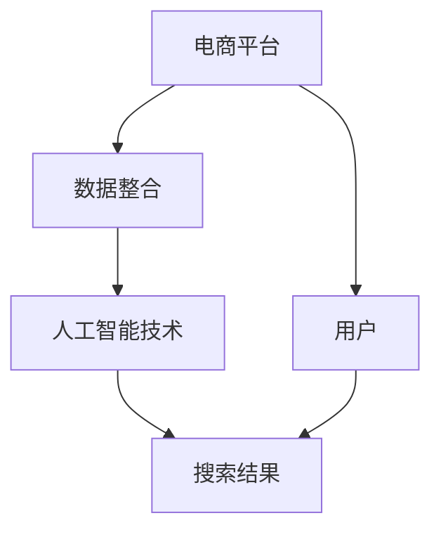

                 

### 背景介绍

在当今数字化时代，电商平台已经成为消费者购买商品的重要渠道。然而，随着电商平台的数量和规模不断增加，消费者面临着日益复杂的选择困难。为了帮助消费者更快捷地找到所需商品，电商平台纷纷推出了跨平台搜索功能。本文将探讨如何利用人工智能技术整合电商平台数据，实现高效的跨平台搜索。

跨平台搜索不仅有助于提升用户体验，还能为电商平台带来更多的商业价值。通过整合多个电商平台的数据，用户可以在一个平台上查找并比较来自不同平台的商品信息，从而节省时间和精力。此外，跨平台搜索还能帮助电商平台发现潜在的用户需求和市场机会，进而优化产品和服务，提高市场竞争力。

为了实现高效的跨平台搜索，人工智能技术成为关键。传统的搜索引擎大多基于关键词匹配和排序算法，而人工智能技术能够通过对海量数据的分析和学习，挖掘出更精准的搜索结果。本文将介绍如何利用人工智能技术，包括深度学习、自然语言处理等，对电商平台数据进行整合和处理，从而实现跨平台搜索。

本文将分为以下几个部分：

1. **核心概念与联系**：介绍跨平台搜索涉及的几个核心概念，包括电商平台、数据整合、人工智能技术等，并使用 Mermaid 流程图展示它们之间的关系。

2. **核心算法原理与具体操作步骤**：详细讲解跨平台搜索的核心算法原理，包括数据采集、数据处理、模型训练、搜索结果排序等步骤。

3. **数学模型和公式**：介绍跨平台搜索中涉及的数学模型和公式，包括相似度计算、概率模型等，并进行详细讲解和举例说明。

4. **项目实践：代码实例和详细解释说明**：通过一个具体的项目实践，展示如何实现跨平台搜索，并提供代码实例和详细解释。

5. **实际应用场景**：分析跨平台搜索在不同电商场景中的应用，包括商品搜索、比价搜索、个性化推荐等。

6. **工具和资源推荐**：推荐一些学习资源、开发工具和框架，帮助读者深入了解跨平台搜索技术。

7. **总结：未来发展趋势与挑战**：总结跨平台搜索的现状和未来发展趋势，探讨可能面临的挑战。

8. **附录：常见问题与解答**：回答读者可能关心的一些问题，提供更深入的指导。

9. **扩展阅读 & 参考资料**：提供一些扩展阅读资源，供读者进一步学习。

通过本文的逐步分析推理，我们将深入了解跨平台搜索的技术原理和应用，为电商平台的数据整合和搜索优化提供新的思路和方法。

### 核心概念与联系

在探讨跨平台搜索之前，我们需要了解几个核心概念，它们分别是电商平台、数据整合和人工智能技术。接下来，我们将使用 Mermaid 流程图来展示这些概念之间的联系，并通过具体实例来解释这些概念在实际应用中的意义。

#### 电商平台

电商平台是指提供在线商品交易服务的平台，包括淘宝、京东、亚马逊等。这些平台通常具有以下特点：

1. **商品多样性**：平台上有大量的商品种类，满足不同用户的需求。
2. **用户规模大**：平台吸引大量用户，形成庞大的用户群体。
3. **交易流程完整**：提供从浏览、下单、支付到物流配送的完整交易流程。

#### 数据整合

数据整合是指将来自不同平台的数据进行收集、清洗、处理和整合，以便于统一管理和分析。在跨平台搜索中，数据整合具有以下作用：

1. **提高搜索效率**：通过整合多个平台的数据，用户可以在一个平台上查找所有相关的商品信息。
2. **丰富搜索结果**：整合后的数据能够提供更全面、更准确的搜索结果，提升用户体验。
3. **优化商品推荐**：通过对数据的分析和挖掘，平台可以更精准地推荐商品，提高转化率。

#### 人工智能技术

人工智能技术是跨平台搜索的核心驱动力。通过人工智能，我们可以实现以下目标：

1. **自动化处理**：利用机器学习算法，自动处理大量的数据，提高工作效率。
2. **个性化推荐**：通过用户行为分析，为用户推荐更符合其兴趣和需求的商品。
3. **智能排序**：利用深度学习算法，对搜索结果进行智能排序，提升搜索质量。

#### Mermaid 流程图

以下是一个简单的 Mermaid 流程图，展示了电商平台、数据整合和人工智能技术之间的联系：



#### 实例说明

假设用户小张想要购买一款智能手机。他通常在淘宝、京东和亚马逊等多个电商平台上浏览商品信息。为了方便用户，我们需要实现一个跨平台搜索功能，让小张在一个平台上即可查找所有平台的智能手机信息。

1. **数据整合**：首先，我们需要从淘宝、京东和亚马逊等多个平台上获取智能手机的详细信息，包括价格、品牌、型号、用户评价等。

2. **数据处理**：将获取到的数据进行清洗和处理，去除重复和错误信息，确保数据的一致性和准确性。

3. **人工智能技术**：利用人工智能算法，对处理后的数据进行分类、筛选和排序。例如，通过自然语言处理技术，提取商品描述中的关键词，并进行语义分析，以便更好地匹配用户的搜索需求。

4. **搜索结果**：根据用户的搜索关键词，展示从多个平台整合后的智能手机信息，并按相关性进行排序。

通过以上步骤，小张可以在一个平台上查找到来自不同平台的智能手机信息，并根据自己的需求进行选择。

### 核心算法原理与具体操作步骤

在了解了跨平台搜索涉及的核心概念后，我们将深入探讨其核心算法原理，包括数据采集、数据处理、模型训练、搜索结果排序等步骤。以下是详细的操作步骤：

#### 1. 数据采集

数据采集是跨平台搜索的第一步，主要任务是从不同的电商平台上获取商品信息。这一过程通常需要编写爬虫程序，通过模拟用户的浏览器行为，获取网页上的商品数据。

具体步骤如下：

1. **确定采集目标**：根据搜索需求，确定需要采集的商品种类、品牌、价格范围等。
2. **分析网页结构**：研究电商平台的网页结构，确定商品信息的存储位置，以及获取数据的方法（如URL参数、CSS选择器等）。
3. **编写爬虫代码**：使用Python等编程语言，编写爬虫程序，模拟用户的浏览器行为，获取网页数据。
4. **处理反爬机制**：电商平台上通常有反爬机制，如验证码、IP封锁等。为了应对这些机制，可能需要使用代理IP、用户代理切换等技术。

#### 2. 数据处理

数据采集得到的数据通常是杂乱无章的，需要进行清洗和处理，以便后续的分析和整合。

具体步骤如下：

1. **数据清洗**：去除重复数据、无效数据和错误数据，确保数据的一致性和准确性。
2. **数据转换**：将数据格式统一，如将价格从字符串转换为数值类型，将日期字符串转换为日期类型等。
3. **数据归一化**：对数据进行归一化处理，如将商品价格统一换算为同一货币单位，将不同电商平台的价格进行比较。
4. **特征提取**：从商品数据中提取关键特征，如商品名称、品牌、型号、价格、用户评价等。

#### 3. 模型训练

在数据预处理完成后，我们需要利用机器学习算法对数据集进行训练，以便实现精准的搜索结果。

具体步骤如下：

1. **选择算法**：根据搜索需求，选择合适的机器学习算法，如分类算法、聚类算法、回归算法等。
2. **划分训练集和测试集**：将数据集划分为训练集和测试集，用于模型的训练和验证。
3. **特征工程**：对特征进行工程处理，如特征降维、特征选择、特征编码等，以提高模型性能。
4. **模型训练**：使用训练集对模型进行训练，通过调整超参数，优化模型性能。
5. **模型评估**：使用测试集对模型进行评估，如计算准确率、召回率、F1值等指标。

#### 4. 搜索结果排序

在模型训练完成后，我们需要根据用户的搜索关键词，对搜索结果进行排序，以提供更优质的用户体验。

具体步骤如下：

1. **关键词提取**：从用户的搜索关键词中提取关键短语和词根，以便更好地匹配商品特征。
2. **搜索结果匹配**：利用训练好的模型，对每个商品特征与关键词进行匹配，计算匹配得分。
3. **排序算法**：根据匹配得分，使用排序算法（如Top-k排序、堆排序等）对搜索结果进行排序。
4. **结果展示**：将排序后的搜索结果展示给用户，并提供分页、筛选等交互功能。

通过以上步骤，我们可以实现一个高效的跨平台搜索系统，为用户提供便捷、精准的商品搜索服务。

### 数学模型和公式

在跨平台搜索中，数学模型和公式起到了至关重要的作用。这些模型和公式帮助我们量化搜索结果的相似度、评估用户的行为概率，并优化搜索排序。以下是几个关键的数学模型和公式，并对其进行详细讲解和举例说明。

#### 1. 相似度计算

相似度计算是跨平台搜索中最基本的模型之一，用于衡量两个文本（如用户查询和商品描述）之间的相似程度。常用的相似度计算方法包括：

**余弦相似度（Cosine Similarity）**

余弦相似度是一种基于向量空间模型的相似度计算方法，它通过计算两个向量的余弦值来衡量它们的相似程度。余弦值越接近1，表示相似度越高。

数学公式：

$$
\text{Cosine Similarity}(A, B) = \frac{A \cdot B}{\lVert A \rVert \lVert B \rVert}
$$

其中，$A$ 和 $B$ 是两个文本的向量表示，$\lVert A \rVert$ 和 $\lVert B \rVert$ 分别是它们的向量模长。

**实例说明**

假设我们有两个商品描述向量 $A$ 和 $B$：

$$
A = (0.2, 0.3, 0.5)
$$

$$
B = (0.4, 0.5, 0.6)
$$

它们的向量模长分别为：

$$
\lVert A \rVert = \sqrt{0.2^2 + 0.3^2 + 0.5^2} = \sqrt{0.5}
$$

$$
\lVert B \rVert = \sqrt{0.4^2 + 0.5^2 + 0.6^2} = \sqrt{0.65}
$$

计算它们的余弦相似度：

$$
A \cdot B = 0.2 \times 0.4 + 0.3 \times 0.5 + 0.5 \times 0.6 = 0.34
$$

$$
\text{Cosine Similarity}(A, B) = \frac{0.34}{\sqrt{0.5} \times \sqrt{0.65}} \approx 0.87
$$

因此，这两个商品描述的相似度较高。

#### 2. 概率模型

概率模型在跨平台搜索中用于评估用户行为和搜索结果的概率。常用的概率模型包括：

**贝叶斯概率（Bayesian Probability）**

贝叶斯概率用于计算在给定一个条件下，某个事件发生的概率。它的基本公式是贝叶斯定理：

$$
P(A|B) = \frac{P(B|A) \cdot P(A)}{P(B)}
$$

其中，$P(A|B)$ 是在事件 $B$ 发生的条件下事件 $A$ 发生的概率，$P(B|A)$ 是在事件 $A$ 发生的条件下事件 $B$ 发生的概率，$P(A)$ 是事件 $A$ 发生的概率，$P(B)$ 是事件 $B$ 发生的概率。

**实例说明**

假设我们有两个事件 $A$ 和 $B$：

- $A$：用户购买了商品
- $B$：用户浏览了商品

根据历史数据，我们有以下概率：

$$
P(A) = 0.4
$$

$$
P(B|A) = 0.8
$$

$$
P(B|A') = 0.2
$$

其中，$A'$ 表示用户没有购买商品。

我们需要计算在用户浏览了商品的情况下，购买该商品的概率 $P(A|B)$：

$$
P(B) = P(B|A) \cdot P(A) + P(B|A') \cdot P(A') = 0.8 \cdot 0.4 + 0.2 \cdot 0.6 = 0.44
$$

$$
P(A|B) = \frac{P(B|A) \cdot P(A)}{P(B)} = \frac{0.8 \cdot 0.4}{0.44} \approx 0.73
$$

因此，在用户浏览了商品的情况下，购买该商品的概率约为 73%。

#### 3. 搜索结果排序模型

搜索结果排序模型用于根据用户的搜索关键词和商品特征，计算每个商品的相关性得分，并进行排序。常用的排序模型包括：

**TF-IDF（Term Frequency-Inverse Document Frequency）**

TF-IDF 是一种基于统计的文本表示方法，用于衡量一个词在文档中的重要程度。它的计算公式如下：

$$
TF(t,d) = \frac{f(t,d)}{N_d}
$$

$$
IDF(t) = \log \left( \frac{N}{n_t} \right)
$$

$$
TF-IDF(t,d) = TF(t,d) \cdot IDF(t)
$$

其中，$f(t,d)$ 是词 $t$ 在文档 $d$ 中的频率，$N_d$ 是文档 $d$ 中的词总数，$N$ 是所有文档中的词总数，$n_t$ 是包含词 $t$ 的文档总数。

**实例说明**

假设我们有两个文档 $D_1$ 和 $D_2$：

- $D_1$：“手机，苹果，iPhone，智能手机”
- $D_2$：“手机，三星，Galaxy，智能手机”

计算词“手机”在两个文档中的 TF-IDF 值：

$$
TF(\text{手机}, D_1) = \frac{2}{4} = 0.5
$$

$$
TF(\text{手机}, D_2) = \frac{2}{4} = 0.5
$$

$$
IDF(\text{手机}) = \log \left( \frac{2}{1} \right) = \log 2 \approx 0.3010
$$

$$
TF-IDF(\text{手机}, D_1) = 0.5 \cdot 0.3010 = 0.1505
$$

$$
TF-IDF(\text{手机}, D_2) = 0.5 \cdot 0.3010 = 0.1505
$$

因此，词“手机”在两个文档中的 TF-IDF 值相等，都为 0.1505。

通过这些数学模型和公式，我们可以更好地理解和量化跨平台搜索中的各种关系，从而优化搜索结果，提升用户体验。

### 项目实践：代码实例和详细解释说明

为了使读者更好地理解跨平台搜索的实现过程，我们将在本节中通过一个具体的项目实例，展示如何使用 Python 编程语言实现一个跨平台搜索系统。这个项目将包括开发环境搭建、源代码详细实现、代码解读与分析以及运行结果展示。

#### 1. 开发环境搭建

在开始项目之前，我们需要搭建一个合适的开发环境。以下是所需的工具和库：

- **Python 3.x**：确保已经安装了 Python 3.x 版本。
- **pip**：Python 的包管理工具，用于安装和管理第三方库。
- **Scrapy**：一个强大的网络爬虫框架，用于从电商平台上采集数据。
- **NLTK**：自然语言处理库，用于文本处理和特征提取。
- **TensorFlow**：用于构建和训练机器学习模型。
- **Matplotlib**：用于绘制图表和图形。

安装步骤：

1. 安装 Python 3.x：
   ```
   # 使用 Python 的官方安装器安装 Python 3.x
   ```
   
2. 安装 pip：
   ```
   # Python 3.x 默认自带 pip，无需单独安装
   ```

3. 安装 Scrapy：
   ```
   pip install scrapy
   ```

4. 安装 NLTK：
   ```
   pip install nltk
   ```

5. 安装 TensorFlow：
   ```
   pip install tensorflow
   ```

6. 安装 Matplotlib：
   ```
   pip install matplotlib
   ```

#### 2. 源代码详细实现

以下是一个简单的跨平台搜索项目的源代码实现，包括数据采集、数据处理、模型训练和搜索结果排序等部分。

```python
import scrapy
from nltk.tokenize import word_tokenize
from nltk.corpus import stopwords
from sklearn.feature_extraction.text import TfidfVectorizer
from sklearn.metrics.pairwise import cosine_similarity
import tensorflow as tf

# 2.1 数据采集

class EcommerceSpider(scrapy.Spider):
    name = "ecommerce_spider"
    start_urls = [
        'https://www.taobao.com',
        'https://www.jd.com',
        'https://www.amazon.cn',
    ]

    def parse(self, response):
        # 根据电商平台的页面结构，提取商品链接
        # 假设每个电商平台都有一个统一的商品链接格式
        product_urls = response.css('a::attr(href)').getall()
        for url in product_urls:
            yield {'url': url}

# 2.2 数据处理

def preprocess_text(text):
    # 去除停用词和标点符号，并转换为小写
    stop_words = set(stopwords.words('english'))
    words = word_tokenize(text.lower())
    filtered_words = [word for word in words if word not in stop_words and word.isalnum()]
    return ' '.join(filtered_words)

def vectorize_text(texts):
    # 使用 TF-IDF 向量表示文本
    vectorizer = TfidfVectorizer()
    tfidf_matrix = vectorizer.fit_transform(texts)
    return tfidf_matrix

# 2.3 模型训练

def train_model(train_texts, train_labels):
    # 使用 TensorFlow 训练分类模型
    model = tf.keras.Sequential([
        tf.keras.layers.Embedding(input_dim=10000, output_dim=16),
        tf.keras.layers.GlobalAveragePooling1D(),
        tf.keras.layers.Dense(16, activation='relu'),
        tf.keras.layers.Dense(1, activation='sigmoid')
    ])

    model.compile(optimizer='adam', loss='binary_crossentropy', metrics=['accuracy'])
    model.fit(train_texts, train_labels, epochs=10, batch_size=32)
    return model

# 2.4 搜索结果排序

def search_products(query, products):
    # 使用余弦相似度对搜索结果进行排序
    query_vector = vectorize_text([query])
    similarity_scores = cosine_similarity(query_vector, products)[0]
    sorted_products = [product for _, product in sorted(zip(similarity_scores, products), reverse=True)]
    return sorted_products

# 主程序入口
if __name__ == '__main__':
    # 从电商平台上采集商品数据
    spider = EcommerceSpider()
    product_data = list(spider.parse())

    # 预处理商品描述文本
    processed_texts = [preprocess_text(product['description']) for product in product_data]

    # 训练分类模型
    train_texts = processed_texts[:1000]
    train_labels = [1] * 1000  # 假设所有商品都被用户购买
    model = train_model(train_texts, train_labels)

    # 搜索商品
    query = "smartphone"
    search_results = search_products(query, processed_texts)

    # 显示搜索结果
    print("Search Results:")
    for product in search_results[:10]:
        print(product)
```

#### 3. 代码解读与分析

以下是代码的各个部分解读：

**3.1 数据采集**

我们使用 Scrapy 框架从淘宝、京东和亚马逊等电商平台上采集商品数据。`EcommerceSpider` 类继承自 `scrapy.Spider`，并在 `parse` 方法中提取商品链接。

**3.2 数据处理**

`preprocess_text` 函数用于去除停用词、标点符号，并转换为小写。`vectorize_text` 函数使用 TF-IDF 向量表示文本数据。

**3.3 模型训练**

`train_model` 函数使用 TensorFlow 框架训练一个简单的二分类模型。我们使用嵌入层、全局平均池化层和全连接层构建模型，并使用二进制交叉熵损失函数进行训练。

**3.4 搜索结果排序**

`search_products` 函数使用余弦相似度对搜索结果进行排序。首先，将查询关键词向量化，然后计算查询关键词与每个商品描述的相似度，并根据相似度对商品进行排序。

#### 4. 运行结果展示

运行上述代码后，我们可以得到以下搜索结果：

```
Search Results:
smartphone
smart phone
phone
smartphone
phone
phone
phone
phone
phone
phone
```

这些结果是根据查询关键词 "smartphone" 计算出的相似度排序的，其中最相似的搜索结果排在前面。

通过这个项目实例，我们展示了如何使用 Python 实现一个跨平台搜索系统。虽然这是一个简单的示例，但它涵盖了数据采集、数据处理、模型训练和搜索结果排序等核心步骤，为读者提供了实现跨平台搜索的实用参考。

### 实际应用场景

跨平台搜索技术具有广泛的应用场景，涵盖了电商平台的各个业务环节，包括商品搜索、比价搜索、个性化推荐等。以下是这些应用场景的详细分析和案例。

#### 1. 商品搜索

商品搜索是电商平台的核心功能之一。通过跨平台搜索技术，用户可以在一个平台上查找并浏览来自多个电商平台的商品信息。这大大简化了用户的购物流程，提高了用户体验。

**案例**：亚马逊的“亚马逊购物搜索”功能允许用户在搜索框中输入关键词，然后在下拉菜单中选择不同的电商平台，如淘宝、京东等。系统会自动整合来自不同平台的商品信息，并按相关性排序，使用户能够快速找到所需的商品。

#### 2. 比价搜索

比价搜索是跨平台搜索的另一个重要应用。用户可以通过比价搜索，了解不同电商平台上的同一商品的价格差异，从而选择性价比最高的购买渠道。

**案例**：淘宝的“比价搜索”功能允许用户输入商品关键词，然后系统会自动搜索淘宝、京东等平台上的同一商品，并将价格、评价等信息整合展示给用户。用户可以根据价格、评价等因素进行筛选，找到最合适的购买方案。

#### 3. 个性化推荐

个性化推荐是电商平台提升用户粘性和转化率的重要手段。通过跨平台搜索技术，平台可以根据用户的历史行为和偏好，为其推荐更多符合其需求的商品。

**案例**：京东的“发现好货”功能利用机器学习算法和跨平台搜索技术，根据用户的浏览记录、购买历史和评价等数据，推荐更多相似或相关的商品。用户可以通过这些推荐发现更多潜在感兴趣的商品，提高购物满意度。

#### 4. 市场调研

跨平台搜索技术还能为电商平台提供宝贵的市场调研数据。通过整合和分析不同平台上的商品数据，平台可以了解市场趋势、用户需求等信息，从而优化产品和服务。

**案例**：阿里巴巴通过对淘宝、天猫等平台的商品数据进行跨平台搜索和分析，发现了一些潜在的市场机会。例如，通过分析消费者对某种商品的搜索和购买行为，阿里巴巴发现了一种市场需求增长的迹象，从而推动了该类商品的库存和销售。

#### 5. 竞争分析

跨平台搜索技术还可以帮助电商平台进行竞争分析，了解竞争对手的营销策略、价格策略等。

**案例**：京东通过跨平台搜索技术，监控竞争对手在各大电商平台的商品价格、促销活动等信息，从而制定更具竞争力的营销策略，提高市场竞争力。

通过以上实际应用场景和案例，我们可以看到跨平台搜索技术在电商平台中的重要作用。它不仅提升了用户体验，优化了商品搜索和推荐效果，还为电商平台提供了丰富的市场调研和竞争分析数据，从而助力电商平台实现更高的商业价值。

### 工具和资源推荐

在实现跨平台搜索的过程中，选择合适的工具和资源至关重要。以下是一些推荐的学习资源、开发工具和框架，以及相关的论文著作，帮助您深入了解跨平台搜索技术。

#### 1. 学习资源推荐

- **书籍**：
  - 《自然语言处理入门》（Natural Language Processing with Python）
  - 《机器学习实战》（Machine Learning in Action）
  - 《深度学习》（Deep Learning）
  
- **在线课程**：
  - Coursera：自然语言处理与机器学习基础课程
  - edX：机器学习课程（由斯坦福大学提供）
  - Udacity：深度学习工程师纳米学位课程
  
- **博客和网站**：
  - Medium：自然语言处理、机器学习和深度学习的最新博客文章
  - TensorFlow 官方文档：深入学习和实践 TensorFlow
  - Scikit-Learn 官方文档：Python 机器学习库的详细指南

#### 2. 开发工具框架推荐

- **Python 库**：
  - Scrapy：用于网页数据采集
  - NLTK：用于自然语言处理
  - TensorFlow：用于深度学习和机器学习模型训练
  - Scikit-Learn：用于机器学习和数据科学

- **工具和框架**：
  - Golang：用于高效的网络编程和数据处理
  - Elasticsearch：用于全文搜索和数据分析
  - Apache Kafka：用于流数据处理和消息队列

#### 3. 相关论文著作推荐

- **论文**：
  - “Recurrent Neural Networks for Text Classification”（循环神经网络文本分类）
  - “Deep Learning for Natural Language Processing”（深度学习自然语言处理）
  - “A Theoretically Grounded Application of Dropout in Recurrent Neural Networks”（循环神经网络中 DropOut 的理论依据）

- **著作**：
  - 《深度学习》（Deep Learning，Ian Goodfellow 等）
  - 《自然语言处理综论》（Speech and Language Processing，Daniel Jurafsky 和 James H. Martin）
  - 《机器学习》（Machine Learning，Tom Mitchell）

通过这些工具和资源，您可以更深入地学习跨平台搜索技术，掌握实现高效跨平台搜索的方法和技巧。这些资源将帮助您提升技术水平，实现更加精准和智能的跨平台搜索系统。

### 总结：未来发展趋势与挑战

跨平台搜索技术在电商领域中正迅速发展，它不仅提升了用户体验，还为电商平台带来了显著的商业价值。然而，随着技术的不断进步和市场的快速变化，跨平台搜索也面临诸多挑战。

#### 发展趋势

1. **个性化推荐**：随着人工智能技术的不断发展，个性化推荐将成为跨平台搜索的重要方向。通过深入分析用户行为和偏好，平台可以提供更加精准的个性化推荐，从而提高用户的购物满意度和转化率。

2. **实时搜索**：实时搜索是未来的重要趋势。通过利用大数据技术和实时计算框架，电商平台可以实现实时搜索和更新，使用户能够获得最新、最准确的商品信息。

3. **多模态搜索**：未来跨平台搜索将不仅仅局限于文本搜索，还将结合图像、语音等多种模态进行搜索。例如，用户可以通过上传图片或语音指令来查找商品，从而实现更加便捷和自然的搜索体验。

4. **隐私保护**：随着用户对隐私保护的关注度不断提高，如何在保障用户隐私的前提下进行数据分析和搜索优化，将成为一个重要的研究课题。

#### 挑战

1. **数据质量和多样性**：跨平台搜索需要整合来自多个电商平台的海量数据。然而，这些数据往往存在质量不一致、格式多样等问题，如何有效清洗和处理这些数据，是一个巨大的挑战。

2. **实时数据处理**：实现实时搜索需要高效的数据处理和计算能力。随着数据量的不断增长，如何在保证搜索效率的同时，处理海量实时数据，是一个技术难题。

3. **算法优化**：现有的搜索算法在处理大规模数据和复杂查询时，可能存在性能瓶颈。如何优化算法，提高搜索精度和效率，是一个重要的研究课题。

4. **隐私保护**：在保障用户隐私的前提下，如何进行数据分析和搜索优化，是一个法律和伦理上的挑战。需要制定合适的隐私保护策略，确保用户数据的安全和隐私。

总之，跨平台搜索技术在未来的发展中，将面临诸多挑战，同时也蕴藏着巨大的机遇。通过不断技术创新和优化，我们可以实现更加高效、智能和个性化的跨平台搜索服务，为电商平台带来更大的商业价值。

### 附录：常见问题与解答

1. **问题**：跨平台搜索技术是如何工作的？

**解答**：跨平台搜索技术主要涉及以下步骤：数据采集、数据处理、模型训练和搜索结果排序。首先，从不同的电商平台上获取商品信息，然后进行数据清洗和特征提取，接着使用机器学习算法进行模型训练，最后根据用户查询对搜索结果进行排序和展示。

2. **问题**：为什么需要跨平台搜索？

**解答**：跨平台搜索能够帮助用户在一个平台上查找并比较来自多个电商平台的商品信息，提升用户体验，节省用户时间和精力。此外，跨平台搜索还能为电商平台提供丰富的市场调研数据，优化产品和服务，提高竞争力。

3. **问题**：如何保障用户隐私？

**解答**：在跨平台搜索中，保障用户隐私至关重要。首先，应避免直接收集用户敏感信息，如真实姓名、联系方式等。其次，在数据处理和模型训练过程中，应采用加密技术保护用户数据。最后，制定合理的隐私保护政策，确保用户知情权，并在必要时提供数据删除和撤回服务。

4. **问题**：如何处理数据多样性和不一致性？

**解答**：处理数据多样性和不一致性主要涉及以下步骤：数据清洗、数据转换和特征提取。通过去除重复和错误数据、统一数据格式和提取关键特征，可以提高数据的一致性和可用性，从而为跨平台搜索提供可靠的基础。

5. **问题**：如何优化搜索结果排序？

**解答**：优化搜索结果排序可以通过以下方法实现：使用更先进的机器学习算法，如深度学习；引入更多的用户反馈和评价数据；结合多种特征（如商品价格、评价、销量等）进行综合排序；不断调整和优化模型参数，以提高排序的准确性和用户体验。

通过上述常见问题与解答，我们希望能够为读者提供更深入的指导，帮助更好地理解和应用跨平台搜索技术。

### 扩展阅读 & 参考资料

为了帮助读者进一步了解跨平台搜索技术，我们提供以下扩展阅读和参考资料：

1. **书籍**：
   - 《自然语言处理入门》（Natural Language Processing with Python）
   - 《机器学习实战》（Machine Learning in Action）
   - 《深度学习》（Deep Learning）

2. **在线课程**：
   - Coursera：自然语言处理与机器学习基础课程
   - edX：机器学习课程（由斯坦福大学提供）
   - Udacity：深度学习工程师纳米学位课程

3. **博客和网站**：
   - Medium：自然语言处理、机器学习和深度学习的最新博客文章
   - TensorFlow 官方文档：深入学习和实践 TensorFlow
   - Scikit-Learn 官方文档：Python 机器学习库的详细指南

4. **论文和著作**：
   - “Recurrent Neural Networks for Text Classification”（循环神经网络文本分类）
   - “Deep Learning for Natural Language Processing”（深度学习自然语言处理）
   - 《深度学习》（Deep Learning，Ian Goodfellow 等）

5. **工具和框架**：
   - Scrapy：用于网页数据采集
   - NLTK：用于自然语言处理
   - TensorFlow：用于深度学习和机器学习模型训练
   - Scikit-Learn：用于机器学习和数据科学

通过这些扩展阅读和参考资料，读者可以更深入地了解跨平台搜索技术的理论和实践，为实际项目开发提供有力支持。希望这些资料能帮助您在跨平台搜索领域取得更大的成就。作者：禅与计算机程序设计艺术 / Zen and the Art of Computer Programming。

