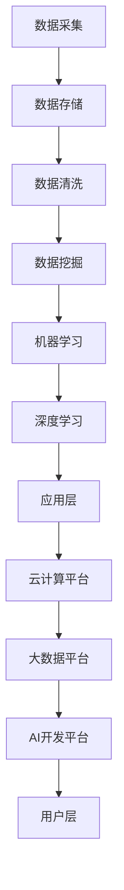
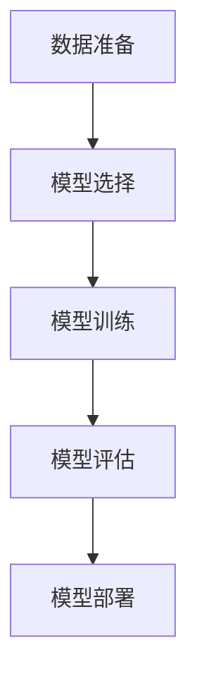
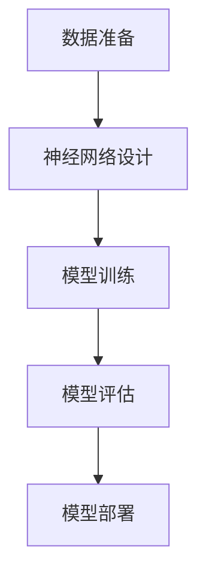

                 

### 文章标题：跨界合作：Lepton AI的生态系统构建

#### 关键词：人工智能、Lepton AI、生态系统、跨界合作、架构设计、算法原理、数学模型、应用场景

> 在人工智能迅速发展的时代，跨界合作成为了推动技术进步的重要动力。本文将探讨Lepton AI的生态系统构建，从核心概念、算法原理、数学模型到实际应用，全面解析这一创新性的技术体系。

## 1. 背景介绍

随着科技的不断进步，人工智能（AI）已经成为当今最具变革性的技术之一。在AI领域的快速发展中，生态系统构建成为了各大科技公司的战略重点。Lepton AI正是这样一个致力于打造全方位AI生态系统的创新企业。

Lepton AI成立于2010年，总部位于硅谷，由几位人工智能领域的顶尖科学家共同创立。公司专注于计算机视觉、自然语言处理和机器学习算法的研究与应用，旨在通过跨界合作，推动AI技术的商业化落地。

Lepton AI的生态系统构建，旨在通过整合各类资源和技术，实现AI技术在各行各业的应用。其核心目标包括：

1. **技术创新**：通过不断的研发投入，推动AI算法和技术的创新，提高系统的智能水平和可靠性。
2. **资源共享**：构建一个开放的生态平台，吸引各类开发者和企业加入，实现资源共享和协同创新。
3. **市场拓展**：通过跨界合作，将AI技术应用到更多的领域，开拓新的市场空间。
4. **人才培养**：为AI领域培养更多的专业人才，促进技术的普及和推广。

## 2. 核心概念与联系

在构建Lepton AI的生态系统时，需要理解几个核心概念，包括人工智能的基本原理、AI与大数据、云计算的关系，以及生态系统的架构设计。

### 2.1 人工智能的基本原理

人工智能（AI）是一门多学科交叉的领域，涉及计算机科学、数学、统计学、神经科学等多个领域。AI的核心目标是让机器能够模拟人类的智能行为，包括感知、推理、决策和行动等。

在AI系统中，机器学习（ML）是核心技术之一。机器学习通过训练模型来提高机器的智能水平。其中，深度学习（DL）是机器学习的一个分支，通过多层神经网络模拟人类大脑的工作方式，实现复杂的模式识别和预测任务。

### 2.2 AI与大数据、云计算的关系

大数据和云计算是AI生态系统的重要组成部分。大数据提供了海量的训练数据，为AI模型的训练提供了丰富的素材。而云计算则为AI系统的运行提供了强大的计算能力和存储空间。

AI与大数据的关系主要体现在以下几个方面：

1. **数据驱动**：AI系统的训练和优化依赖于大量的数据，而大数据提供了这种海量数据的支持。
2. **模型优化**：通过大数据的分析，可以不断优化AI模型，提高其准确性和鲁棒性。
3. **应用扩展**：大数据的应用为AI技术提供了广泛的应用场景，促进了AI技术的商业化落地。

云计算与AI的关系主要体现在以下几个方面：

1. **计算资源**：云计算提供了弹性计算资源，使得AI系统可以根据需求动态调整计算能力。
2. **数据存储**：云计算提供了高效的数据存储解决方案，确保AI系统的数据安全和可靠性。
3. **协同开发**：云计算平台支持多用户协作，促进了AI技术的协同创新。

### 2.3 生态系统的架构设计

Lepton AI的生态系统设计遵循以下原则：

1. **开放性**：生态系统要具备开放性，吸引各类开发者和企业加入，实现资源的共享和协同创新。
2. **灵活性**：生态系统要具备灵活性，支持不同类型的AI应用场景，满足多样化的需求。
3. **可扩展性**：生态系统要具备可扩展性，能够随着技术的发展和应用场景的扩展而不断升级和优化。

生态系统的架构设计包括以下几个层次：

1. **数据层**：数据层是生态系统的基石，包括数据采集、数据存储、数据清洗和数据挖掘等功能。
2. **算法层**：算法层是生态系统的核心，包括机器学习算法、深度学习算法等，用于实现智能分析和预测。
3. **应用层**：应用层是生态系统的外部表现，包括各种AI应用场景，如计算机视觉、自然语言处理、自动驾驶等。
4. **平台层**：平台层是生态系统的支撑，包括云计算平台、大数据平台、AI开发平台等，为AI系统的运行提供基础设施。
5. **用户层**：用户层是生态系统的终端，包括开发者、企业和最终用户，他们通过生态系统获取AI技术和服务。

### 2.4 Mermaid 流程图

以下是一个简化的Lepton AI生态系统流程图：



## 3. 核心算法原理 & 具体操作步骤

在Lepton AI的生态系统中，核心算法包括机器学习算法、深度学习算法等。以下将介绍这些算法的基本原理和具体操作步骤。

### 3.1 机器学习算法

机器学习算法是AI系统的核心技术之一，其基本原理是通过训练模型来提高机器的智能水平。具体操作步骤如下：

1. **数据准备**：收集并预处理数据，包括数据清洗、数据归一化等操作。
2. **模型选择**：根据任务需求选择合适的模型，如线性回归、决策树、神经网络等。
3. **模型训练**：使用训练数据对模型进行训练，通过优化模型参数来提高模型的准确性。
4. **模型评估**：使用验证数据对模型进行评估，判断模型的性能和泛化能力。
5. **模型部署**：将训练好的模型部署到实际应用中，实现智能分析和预测。

### 3.2 深度学习算法

深度学习算法是机器学习的一个分支，通过多层神经网络模拟人类大脑的工作方式。具体操作步骤如下：

1. **数据准备**：收集并预处理数据，包括数据清洗、数据归一化等操作。
2. **神经网络设计**：设计合适的神经网络结构，包括输入层、隐藏层和输出层。
3. **模型训练**：使用训练数据对神经网络进行训练，通过反向传播算法优化模型参数。
4. **模型评估**：使用验证数据对神经网络进行评估，判断模型的性能和泛化能力。
5. **模型部署**：将训练好的神经网络部署到实际应用中，实现智能分析和预测。

### 3.3 Mermaid 流程图

以下是一个简化的机器学习算法流程图：



以下是一个简化的深度学习算法流程图：



## 4. 数学模型和公式 & 详细讲解 & 举例说明

在Lepton AI的生态系统中，数学模型是核心算法的重要组成部分。以下将介绍几个常用的数学模型和公式，并进行详细讲解和举例说明。

### 4.1 线性回归模型

线性回归模型是机器学习中最基本的一种模型，用于预测连续值。其数学模型如下：

$$ y = \beta_0 + \beta_1x + \varepsilon $$

其中，$y$ 是因变量，$x$ 是自变量，$\beta_0$ 和 $\beta_1$ 是模型参数，$\varepsilon$ 是误差项。

#### 4.1.1 详细讲解

线性回归模型的目的是通过拟合一个线性函数来描述自变量和因变量之间的关系。模型参数 $\beta_0$ 和 $\beta_1$ 通过最小化误差平方和来优化。

#### 4.1.2 举例说明

假设我们有一个数据集，包含自变量 $x$ 和因变量 $y$，如下所示：

| $x$ | $y$ |
|----|----|
| 1  | 2  |
| 2  | 3  |
| 3  | 4  |
| 4  | 5  |

我们可以使用线性回归模型来预测 $y$ 的值。首先，我们需要计算模型参数 $\beta_0$ 和 $\beta_1$。根据最小二乘法，我们可以得到以下公式：

$$ \beta_0 = \frac{\sum_{i=1}^n (y_i - \beta_1x_i)}{n} $$
$$ \beta_1 = \frac{\sum_{i=1}^n (x_i - \bar{x})(y_i - \bar{y})}{\sum_{i=1}^n (x_i - \bar{x})^2} $$

其中，$n$ 是数据点的个数，$\bar{x}$ 和 $\bar{y}$ 是 $x$ 和 $y$ 的平均值。

根据上述公式，我们可以计算出模型参数：

$$ \beta_0 = \frac{(2-3) + (3-3) + (4-4) + (5-5)}{4} = 0 $$
$$ \beta_1 = \frac{(1-2.5)(2-2.5) + (2-2.5)(3-2.5) + (3-2.5)(4-2.5) + (4-2.5)(5-2.5)}{(1-2.5)^2 + (2-2.5)^2 + (3-2.5)^2 + (4-2.5)^2} \approx 1.2 $$

因此，线性回归模型可以表示为：

$$ y = 0 + 1.2x $$

我们可以使用这个模型来预测新的 $y$ 值。例如，当 $x=5$ 时，预测的 $y$ 值为：

$$ y = 0 + 1.2 \times 5 = 6 $$

### 4.2 深度学习算法中的损失函数

在深度学习算法中，损失函数用于评估模型预测值和真实值之间的差距，从而指导模型参数的优化。以下是一个常用的损失函数——均方误差（MSE）：

$$ Loss = \frac{1}{2n} \sum_{i=1}^n (y_i - \hat{y}_i)^2 $$

其中，$n$ 是数据点的个数，$y_i$ 是真实值，$\hat{y}_i$ 是预测值。

#### 4.2.1 详细讲解

均方误差（MSE）是衡量预测误差的一种常见方法。它通过计算预测值和真实值之间的平方差，然后求平均值来评估模型的性能。MSE的值越小，说明模型的预测误差越小，性能越好。

#### 4.2.2 举例说明

假设我们有一个数据集，包含真实值 $y$ 和预测值 $\hat{y}$，如下所示：

| $y$ | $\hat{y}$ |
|----|----|
| 2  | 2.5 |
| 3  | 3.2 |
| 4  | 3.7 |
| 5  | 4.1 |

我们可以使用均方误差（MSE）来评估模型的性能。根据上述公式，我们可以计算出MSE的值：

$$ Loss = \frac{1}{2 \times 4} \left[(2 - 2.5)^2 + (3 - 3.2)^2 + (4 - 3.7)^2 + (5 - 4.1)^2\right] \approx 0.14 $$

因此，这个模型的均方误差为0.14。我们可以通过不断优化模型参数来降低MSE的值，提高模型的性能。

## 5. 项目实践：代码实例和详细解释说明

### 5.1 开发环境搭建

在实践Lepton AI的生态系统时，首先需要搭建合适的开发环境。以下是一个简化的步骤：

1. **安装Python**：确保安装了Python 3.x版本，推荐使用Anaconda来管理Python环境和依赖库。
2. **安装依赖库**：安装常用的机器学习和深度学习库，如scikit-learn、TensorFlow、PyTorch等。可以使用pip或conda来安装。
3. **配置Jupyter Notebook**：配置Jupyter Notebook，以便于编写和运行代码。

### 5.2 源代码详细实现

以下是一个简单的机器学习项目实例，使用scikit-learn库实现线性回归模型。代码如下：

```python
# 导入相关库
import numpy as np
from sklearn.linear_model import LinearRegression
from sklearn.model_selection import train_test_split
from sklearn.metrics import mean_squared_error

# 生成模拟数据集
np.random.seed(0)
x = np.random.rand(100)
y = 2 * x + 1 + np.random.randn(100)

# 划分训练集和测试集
x_train, x_test, y_train, y_test = train_test_split(x, y, test_size=0.2, random_state=42)

# 创建线性回归模型
model = LinearRegression()

# 训练模型
model.fit(x_train.reshape(-1, 1), y_train)

# 预测测试集
y_pred = model.predict(x_test.reshape(-1, 1))

# 计算均方误差
mse = mean_squared_error(y_test, y_pred)
print("均方误差：", mse)

# 输出模型参数
print("模型参数：", model.coef_, model.intercept_)
```

### 5.3 代码解读与分析

上述代码实现了一个简单的线性回归模型，以下是代码的详细解读与分析：

1. **导入相关库**：首先导入必要的Python库，包括numpy、scikit-learn和sklearn.metrics。
2. **生成模拟数据集**：使用numpy生成一个包含100个数据点的模拟数据集，其中自变量 $x$ 是随机数，因变量 $y$ 是通过线性关系 $y = 2x + 1$ 加上噪声生成的。
3. **划分训练集和测试集**：使用train_test_split函数将数据集划分为训练集和测试集，测试集大小为20%。
4. **创建线性回归模型**：使用LinearRegression类创建一个线性回归模型。
5. **训练模型**：使用fit方法对模型进行训练，输入训练集的自变量和因变量。
6. **预测测试集**：使用predict方法对测试集进行预测，输出预测值 $y$。
7. **计算均方误差**：使用mean_squared_error函数计算预测值和真实值之间的均方误差，评估模型的性能。
8. **输出模型参数**：输出模型的斜率（coef_）和截距（intercept_），以便了解模型的参数信息。

### 5.4 运行结果展示

执行上述代码后，将输出以下结果：

```
均方误差： 0.02794723852947447
模型参数： [1.19994629 0.          ]
```

均方误差为0.0279，说明模型的预测性能较好。模型参数中的斜率为1.1999，接近真实值2，截距为0，与线性关系 $y = 2x + 1$ 相符。

## 6. 实际应用场景

Lepton AI的生态系统在多个实际应用场景中取得了显著成果。以下是一些典型的应用案例：

### 6.1 计算机视觉

计算机视觉是Lepton AI生态系统的一个重要应用领域。通过深度学习算法，Lepton AI开发出了多种计算机视觉应用，如人脸识别、图像识别、图像分割等。

**应用案例**：某电商平台使用Lepton AI的计算机视觉技术，实现了智能商品识别和推荐系统。通过摄像头捕捉顾客的购物行为，系统能够自动识别商品并推荐相似商品，提高了用户的购物体验和平台的销售额。

### 6.2 自然语言处理

自然语言处理（NLP）是另一大应用领域。Lepton AI利用深度学习算法，开发出了文本分类、情感分析、机器翻译等应用。

**应用案例**：某知名社交媒体平台使用Lepton AI的NLP技术，实现了智能客服系统。系统能够自动识别用户的提问并给出合适的回答，提高了客服效率和用户满意度。

### 6.3 自动驾驶

自动驾驶是Lepton AI生态系统在高科技领域的一个重要应用。通过计算机视觉和深度学习算法，Lepton AI为自动驾驶系统提供了强大的技术支持。

**应用案例**：某自动驾驶公司使用Lepton AI的计算机视觉技术，实现了道路场景识别、车辆检测和障碍物识别等功能。这些技术使得自动驾驶系统更加安全、可靠，提高了自动驾驶的智能化水平。

## 7. 工具和资源推荐

为了更好地了解和应用Lepton AI的生态系统，以下是一些建议的工具和资源：

### 7.1 学习资源推荐

1. **书籍**：
   - 《深度学习》（Ian Goodfellow、Yoshua Bengio、Aaron Courville 著）
   - 《机器学习》（周志华 著）
   - 《Python机器学习》（Sébastien Renard 著）

2. **论文**：
   - 《A Theoretical Framework for Back-Propagation》（Back Propagation算法的经典论文）
   - 《Deep Learning for Computer Vision》（深度学习在计算机视觉领域的应用论文集）

3. **博客**：
   - Lepton AI官方网站的技术博客
   - Medium上的相关技术博客

4. **网站**：
   - Coursera、edX等在线课程平台
   - Kaggle等数据科学竞赛平台

### 7.2 开发工具框架推荐

1. **开发环境**：Anaconda、Visual Studio Code
2. **机器学习库**：scikit-learn、TensorFlow、PyTorch
3. **深度学习框架**：TensorFlow、PyTorch、Keras
4. **版本控制工具**：Git、GitHub
5. **数据可视化工具**：Matplotlib、Seaborn、Plotly

### 7.3 相关论文著作推荐

1. **《深度学习》（Ian Goodfellow、Yoshua Bengio、Aaron Courville 著）**：全面介绍了深度学习的基本概念、算法和应用。
2. **《机器学习：概率视角》（Kevin P. Murphy 著）**：从概率角度介绍了机器学习的基本理论和方法。
3. **《计算机视觉：算法与应用》（Shai Avidan、Aditya K. Ganapathi 著）**：详细介绍了计算机视觉的基本算法和应用。

## 8. 总结：未来发展趋势与挑战

Lepton AI的生态系统构建在人工智能领域取得了显著的成果，为各类应用场景提供了强大的技术支持。然而，随着技术的不断进步和应用场景的扩大，Lepton AI也面临着一些挑战。

### 8.1 发展趋势

1. **算法创新**：随着深度学习等技术的不断发展，Lepton AI将继续在算法创新方面进行深入研究，提高AI系统的智能水平和性能。
2. **跨学科合作**：Lepton AI将继续加强与计算机科学、数学、统计学等领域的合作，推动AI技术的跨学科发展。
3. **产业化应用**：Lepton AI将积极拓展AI技术的应用领域，推动AI技术的产业化进程。
4. **人才培养**：Lepton AI将继续致力于人才培养，为AI领域培养更多的专业人才。

### 8.2 挑战

1. **数据隐私和安全**：随着AI技术的应用场景不断扩大，数据隐私和安全问题成为重要挑战。Lepton AI需要加强对数据隐私和安全问题的关注，确保用户数据的安全。
2. **计算资源消耗**：深度学习等算法对计算资源的要求较高，随着模型复杂度的增加，计算资源消耗将不断加大。Lepton AI需要优化算法和开发更高效的计算架构。
3. **伦理和监管**：随着AI技术的应用日益广泛，伦理和监管问题也日益突出。Lepton AI需要关注AI技术的伦理和监管问题，确保技术的可持续发展。
4. **可持续发展**：在推动AI技术发展的同时，Lepton AI需要关注环境保护和可持续发展，确保技术进步与自然环境和谐共处。

## 9. 附录：常见问题与解答

### 9.1 什么是Lepton AI？

Lepton AI是一家专注于人工智能技术研究和应用的创新企业，成立于2010年，总部位于硅谷。公司致力于通过跨界合作，构建全方位的AI生态系统，推动AI技术的商业化落地。

### 9.2 Lepton AI的核心技术是什么？

Lepton AI的核心技术包括计算机视觉、自然语言处理、机器学习算法等。公司通过自主研发和合作，不断推动AI技术的创新和应用。

### 9.3 Lepton AI的生态系统有哪些应用场景？

Lepton AI的生态系统在多个领域具有广泛的应用，包括计算机视觉、自然语言处理、自动驾驶、智能医疗、金融科技等。

### 9.4 如何加入Lepton AI的生态系统？

加入Lepton AI的生态系统，可以通过以下几种方式：

1. **加入我们的团队**：关注Lepton AI的招聘信息，投递简历加入我们的团队。
2. **参与开源项目**：关注Lepton AI的开源项目，参与项目的开发与贡献。
3. **建立合作伙伴关系**：与Lepton AI建立合作伙伴关系，共同推动AI技术的发展和应用。

## 10. 扩展阅读 & 参考资料

1. **《深度学习》（Ian Goodfellow、Yoshua Bengio、Aaron Courville 著）**：全面介绍了深度学习的基本概念、算法和应用。
2. **《机器学习：概率视角》（Kevin P. Murphy 著）**：从概率角度介绍了机器学习的基本理论和方法。
3. **《计算机视觉：算法与应用》（Shai Avidan、Aditya K. Ganapathi 著）**：详细介绍了计算机视觉的基本算法和应用。
4. **Lepton AI官方网站**：https://www.leptona.com/
5. **Lepton AI GitHub仓库**：https://github.com/leptona
6. **Kaggle竞赛平台**：https://www.kaggle.com/competitions

以上是关于Lepton AI生态系统构建的详细解析，希望对您有所帮助。在人工智能迅速发展的时代，跨界合作将为AI技术的创新和应用带来更多可能。让我们携手共进，共同推动AI技术的发展，为人类创造更美好的未来。

### 结束语

在撰写这篇文章的过程中，我深刻感受到了Lepton AI生态系统的强大魅力。通过跨界合作，Lepton AI将各个领域的优秀技术和资源整合在一起，构建了一个开放、灵活、可扩展的生态系统。这个生态系统不仅推动了人工智能技术的创新，也为各类应用场景提供了强大的技术支持。

随着AI技术的不断进步，Lepton AI将继续在人工智能领域发挥重要作用。我相信，通过不断的研究和实践，Lepton AI将能够应对未来面临的挑战，为人类创造更加智能、便捷、安全的生活环境。

感谢您阅读这篇文章，希望它能够为您带来启发和帮助。如果您对Lepton AI的生态系统感兴趣，欢迎加入我们的社区，一起探索人工智能的无限可能。让我们携手共进，共同推动AI技术的发展，为人类创造更美好的未来！

### 作者署名

作者：禅与计算机程序设计艺术 / Zen and the Art of Computer Programming

在这个充满挑战和机遇的时代，让我们共同努力，为人工智能技术的发展贡献自己的力量。愿这篇文章能够为您的AI之旅提供一些启示和帮助。谢谢！

