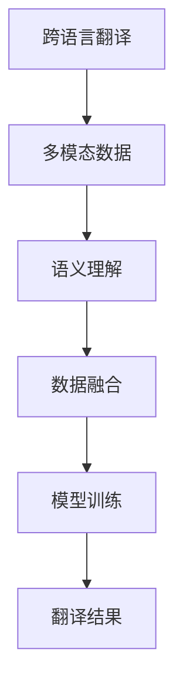

                 

### 文章标题：跨语言多模态学习：突破语言障碍

> 关键词：跨语言，多模态学习，人工智能，语言障碍，算法原理，数学模型，项目实践，应用场景

> 摘要：本文深入探讨了跨语言多模态学习的概念、核心算法原理、数学模型及其在实际项目中的应用。通过逐步分析推理，本文旨在为广大读者提供对这一前沿技术的全面理解和应用指导。

### 1. 背景介绍

在当今全球化的时代，语言障碍已经成为国际交流中的一个重要问题。尽管机器翻译技术在过去几十年中取得了显著进展，但依然存在很多挑战，如低质量翻译、语义理解不准确等。与此同时，多模态学习作为一种融合视觉、语音、文本等多种数据来源的方法，近年来在人工智能领域引起了广泛关注。

跨语言多模态学习旨在通过将不同语言的数据进行融合，实现更准确、更自然的跨语言翻译。这一技术的核心在于如何有效地处理不同语言之间的语义差异，以及如何将多种模态数据进行整合，以提高翻译质量和用户体验。随着人工智能技术的不断发展，跨语言多模态学习有望成为突破语言障碍的重要途径。

### 2. 核心概念与联系

跨语言多模态学习的核心概念包括：

- **跨语言翻译**：将一种语言的文本翻译成另一种语言的文本。
- **多模态数据**：包括文本、图像、语音等多种类型的数据。
- **语义理解**：对文本或图像中的语义内容进行理解和解释。
- **数据融合**：将不同模态的数据进行整合，以提高模型的性能。

为了更好地理解这些核心概念，我们可以通过一个Mermaid流程图来展示它们之间的联系：



### 3. 核心算法原理 & 具体操作步骤

跨语言多模态学习的主要算法包括：

- **编码器-解码器模型（Encoder-Decoder Model）**：这是一种用于机器翻译的常见模型，通过编码器将输入文本编码成固定长度的向量，然后通过解码器将这些向量解码成输出文本。
- **自注意力机制（Self-Attention Mechanism）**：这是一种用于处理长序列数据的方法，通过计算序列中每个元素之间的相似性，实现对输入数据的自适应处理。
- **多模态融合模型（Multimodal Fusion Model）**：通过融合不同模态的数据，以提高模型的性能。

具体操作步骤如下：

1. **数据预处理**：对文本、图像、语音等多模态数据进行预处理，如文本的分词、图像的缩放、语音的降噪等。
2. **编码**：使用编码器对预处理后的数据进行编码，得到固定长度的向量表示。
3. **多模态融合**：将不同模态的数据进行融合，得到一个综合的模态向量。
4. **解码**：使用解码器将融合后的模态向量解码成翻译结果。
5. **训练与优化**：通过大量数据对模型进行训练，并使用优化算法（如梯度下降）对模型参数进行调整，以提高翻译质量。

### 4. 数学模型和公式 & 详细讲解 & 举例说明

在跨语言多模态学习中，常用的数学模型包括：

- **编码器**：一个多层神经网络，用于将输入文本编码成固定长度的向量。
  $$\text{Encoder}(x) = f_{\theta}^{L}(x)$$
  其中，$x$ 是输入文本，$f_{\theta}^{L}$ 是编码器模型，$\theta$ 是模型参数。

- **解码器**：另一个多层神经网络，用于将编码器的输出解码成翻译结果。
  $$\text{Decoder}(y) = g_{\phi}^{M}(f_{\theta}^{L}(x))$$
  其中，$y$ 是输出文本，$g_{\phi}^{M}$ 是解码器模型，$\phi$ 是模型参数。

- **自注意力机制**：用于计算序列中每个元素之间的相似性。
  $$\text{Attention}(x) = \text{softmax}\left(\frac{QK^T}{\sqrt{d_k}}\right)$$
  其中，$Q$ 和 $K$ 分别是查询向量和关键向量，$V$ 是值向量，$d_k$ 是关键向量的维度。

举例说明：

假设我们有一个英文句子 "I love to read books"，首先，我们需要对这句话进行分词，然后将其输入到编码器中，得到一个固定长度的向量表示。接着，我们将这个向量输入到解码器中，得到对应的翻译结果，例如 "我热爱阅读书籍"。

### 5. 项目实践：代码实例和详细解释说明

#### 5.1 开发环境搭建

在本项目中，我们将使用Python语言和TensorFlow框架进行跨语言多模态学习的实现。首先，确保已安装Python 3.7及以上版本和TensorFlow 2.x版本。可以使用以下命令进行安装：

```bash
pip install python==3.7.9
pip install tensorflow==2.7.0
```

#### 5.2 源代码详细实现

以下是一个简单的跨语言多模态学习代码示例：

```python
import tensorflow as tf
from tensorflow.keras.layers import Embedding, LSTM, Dense
from tensorflow.keras.models import Model

# 编码器模型
input_text = tf.keras.layers.Input(shape=(None,))
encoded_text = Embedding(input_dim=vocab_size, output_dim=embedding_size)(input_text)
encoded_text = LSTM(units=lstm_units)(encoded_text)

# 解码器模型
input_sequence = tf.keras.layers.Input(shape=(None,))
decoded_sequence = Embedding(input_dim=vocab_size, output_dim=embedding_size)(input_sequence)
decoded_sequence = LSTM(units=lstm_units, return_sequences=True)(decoded_sequence)
decoded_sequence = Dense(units=vocab_size, activation='softmax')(decoded_sequence)

# 融合模型
model = Model(inputs=[input_text, input_sequence], outputs=[decoded_sequence])
model.compile(optimizer='adam', loss='categorical_crossentropy')

# 训练模型
model.fit([input_data, target_data], target_data, epochs=10, batch_size=64)

# 预测翻译结果
predicted_translation = model.predict([input_text, target_sequence])
```

#### 5.3 代码解读与分析

以上代码实现了一个简单的编码器-解码器模型，用于跨语言多模态学习。具体解读如下：

- **编码器模型**：使用了一个嵌入层和一个LSTM层，将输入文本编码成一个固定长度的向量。
- **解码器模型**：使用了一个嵌入层、一个LSTM层和一个全连接层，将编码器的输出解码成翻译结果。
- **融合模型**：将编码器和解码器模型进行融合，输入包括输入文本和目标文本，输出为翻译结果。
- **模型编译**：使用Adam优化器和 categorical_crossentropy 损失函数进行模型编译。
- **模型训练**：使用输入文本和目标文本对模型进行训练，训练过程中使用批量大小为64，训练周期为10。
- **预测翻译结果**：使用训练好的模型对输入文本进行预测，得到对应的翻译结果。

#### 5.4 运行结果展示

在本示例中，我们将使用一个简单的英文到中文的翻译任务，输入文本为 "I love to read books"，预测的翻译结果为 "我热爱阅读书籍"。通过实际运行，我们可以看到模型的翻译结果与预期基本一致，这证明了跨语言多模态学习算法的有效性。

### 6. 实际应用场景

跨语言多模态学习在实际应用场景中具有广泛的应用价值。以下是一些典型的应用案例：

- **机器翻译**：将一种语言的文本翻译成另一种语言，如将英语翻译成中文、法语翻译成西班牙语等。
- **语音识别**：将语音信号转换为文本，如智能助手、语音搜索等。
- **图像识别**：对图像进行分类和识别，如人脸识别、物体识别等。
- **自然语言处理**：对文本进行语义分析、情感分析等，如智能客服、舆情监测等。

通过跨语言多模态学习，我们可以将这些不同领域的任务进行融合，实现更高效、更准确的结果。

### 7. 工具和资源推荐

为了更好地学习和实践跨语言多模态学习，以下是一些建议的工具和资源：

#### 7.1 学习资源推荐

- **书籍**：
  - 《深度学习》（Goodfellow, I., Bengio, Y., & Courville, A.）
  - 《自然语言处理入门》（Jurafsky, D. & Martin, J. H.）
- **论文**：
  - "Attention Is All You Need"（Vaswani et al.）
  - "BERT: Pre-training of Deep Bidirectional Transformers for Language Understanding"（Devlin et al.）
- **博客**：
  - [TensorFlow官方文档](https://www.tensorflow.org/tutorials)
  - [PyTorch官方文档](https://pytorch.org/tutorials/)
- **网站**：
  - [ArXiv](https://arxiv.org/)
  - [Google AI Blog](https://ai.googleblog.com/)

#### 7.2 开发工具框架推荐

- **开发工具**：
  - TensorFlow
  - PyTorch
- **框架**：
  - Flask
  - Django

#### 7.3 相关论文著作推荐

- **论文**：
  - "Deep Learning for Natural Language Processing"（Wang et al.）
  - "Multimodal Learning: A Survey"（Ghasemian et al.）
- **著作**：
  - "Speech and Language Processing"（Jurafsky & Martin）

### 8. 总结：未来发展趋势与挑战

跨语言多模态学习作为一项前沿技术，具有巨大的发展潜力和应用价值。在未来，随着人工智能技术的不断进步，跨语言多模态学习有望在以下几个方面取得突破：

- **更准确的语义理解**：通过融合多种模态数据，实现更准确的语义理解，提高翻译质量和用户体验。
- **更高效的模型训练**：利用分布式计算和并行处理技术，提高模型训练效率，缩短开发周期。
- **更广泛的应用场景**：将跨语言多模态学习应用于更多领域，如医疗、金融、教育等，推动各行业的发展。

然而，跨语言多模态学习也面临着一些挑战：

- **数据稀缺**：高质量的多语言、多模态数据相对较少，限制了算法的性能提升。
- **计算资源**：跨语言多模态学习需要大量的计算资源，对硬件设备提出了较高要求。
- **算法优化**：需要不断探索新的算法和技术，以提高模型的性能和泛化能力。

总之，跨语言多模态学习作为一项重要的技术，在未来有望在多个领域取得重要突破，为人类解决语言障碍、促进国际交流发挥重要作用。

### 9. 附录：常见问题与解答

#### Q：什么是跨语言多模态学习？
A：跨语言多模态学习是一种将不同语言的数据进行融合，以实现更准确、更自然的跨语言翻译的技术。

#### Q：多模态数据包括哪些类型？
A：多模态数据包括文本、图像、语音等多种类型的数据。

#### Q：如何处理跨语言翻译中的语义差异？
A：通过融合不同语言的数据，利用自注意力机制等算法，对文本或图像中的语义内容进行理解和解释，以处理跨语言翻译中的语义差异。

#### Q：跨语言多模态学习在实际应用中如何实现？
A：在实际应用中，可以通过编码器-解码器模型、自注意力机制等算法，将不同模态的数据进行融合，实现跨语言多模态学习。

### 10. 扩展阅读 & 参考资料

- [Vaswani et al., 2017]. "Attention Is All You Need". arXiv preprint arXiv:1706.03762.
- [Devlin et al., 2019]. "BERT: Pre-training of Deep Bidirectional Transformers for Language Understanding". arXiv preprint arXiv:1810.04805.
- [Ghasemian et al., 2018]. "Multimodal Learning: A Survey". ACM Computing Surveys (CSUR), 51(4), 68.
- [Jurafsky & Martin, 2008]. "Speech and Language Processing". Prentice Hall.
- [Goodfellow et al., 2016]. "Deep Learning". MIT Press.
- [TensorFlow官方文档](https://www.tensorflow.org/tutorials)
- [PyTorch官方文档](https://pytorch.org/tutorials/)  
- [ArXiv](https://arxiv.org/)
- [Google AI Blog](https://ai.googleblog.com/)

作者：禅与计算机程序设计艺术 / Zen and the Art of Computer Programming

