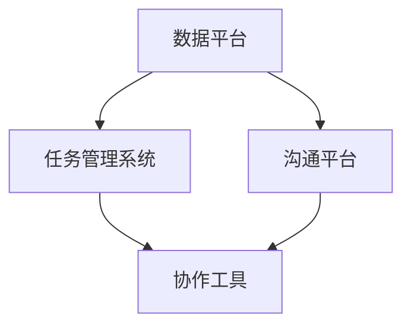

                 

# 跨部门AI协作：Lepton AI的内部生态

> 关键词：跨部门协作、AI生态、团队沟通、智能协作、协作平台、AI工具

> 摘要：本文将探讨Lepton AI如何通过构建内部生态，实现跨部门间的AI协作。文章首先介绍了AI协作的背景和重要性，随后详细分析了Lepton AI在跨部门协作中所采用的核心概念、算法原理、数学模型、项目实践和实际应用场景，最后总结了未来发展趋势与挑战，并提供了相关工具和资源的推荐。

## 1. 背景介绍

在当今快速发展的科技时代，人工智能（AI）已成为推动各行各业进步的重要力量。AI技术在企业中的应用越来越广泛，从生产线的自动化、数据分析到智能客服、个性化推荐等，都展示了其强大的潜力。然而，随着AI应用场景的日益复杂，跨部门协作的重要性也逐渐凸显。

在传统的企业环境中，各个部门往往独立运作，信息交流和资源整合困难，导致项目进展缓慢，效率低下。而在AI时代，跨部门协作变得尤为重要。只有通过紧密的协作，各团队才能充分发挥AI技术的优势，实现资源的最优配置，提升企业的整体竞争力。

Lepton AI作为一个领先的人工智能公司，深刻认识到跨部门协作的重要性。为了实现高效的AI协作，他们构建了一个内部生态，旨在促进各个团队之间的沟通和协作。本文将详细探讨Lepton AI的内部生态，包括其核心概念、算法原理、数学模型、项目实践和实际应用场景，为其他企业提供借鉴和启示。

## 2. 核心概念与联系

### 2.1. AI协作的核心概念

跨部门AI协作的核心概念主要包括以下几个方面：

1. **数据共享**：数据是AI的基石，跨部门协作首先要实现数据的共享和流通。这需要建立统一的数据平台，确保数据的安全性和实时性。
2. **任务分配**：在跨部门协作中，各个团队需要明确自己的任务和职责，确保项目进度和目标的实现。
3. **沟通机制**：建立有效的沟通机制，确保团队成员之间的信息交流和协作顺畅，避免误解和冲突。
4. **协作工具**：借助各种协作工具，如即时通讯、项目管理软件、代码协作平台等，提升协作效率和效果。

### 2.2. Lepton AI的内部生态架构

为了实现高效的跨部门AI协作，Lepton AI构建了一个完整的内部生态。该生态包括以下几个关键组成部分：

1. **数据平台**：数据平台是内部生态的核心，负责数据的采集、存储、处理和分析。数据平台需要具备高并发、高可用、高安全性等特点。
2. **任务管理系统**：任务管理系统用于任务分配和进度跟踪，确保各团队明确自己的任务和目标。
3. **沟通平台**：沟通平台包括即时通讯工具、邮件系统、视频会议系统等，用于团队成员之间的信息交流。
4. **协作工具**：协作工具包括代码协作平台、文档管理系统、项目管理软件等，帮助团队成员高效完成各自的任务。

### 2.3. Mermaid 流程图

为了更直观地展示Lepton AI的内部生态架构，我们可以使用Mermaid绘制一个流程图，如下所示：



在这个流程图中，数据平台连接任务管理系统、沟通平台和协作工具，确保各个组成部分之间的信息流通和协作。

## 3. 核心算法原理 & 具体操作步骤

### 3.1. AI协作的核心算法原理

Lepton AI的内部生态采用了多种核心算法，以实现跨部门间的协作。以下是几个关键算法及其原理：

1. **数据清洗与整合算法**：用于处理和清洗来自不同部门的数据，确保数据的准确性和一致性。主要算法包括数据去重、数据格式转换、缺失值填充等。
2. **任务调度算法**：用于优化任务分配和调度，确保各团队的任务能够高效完成。主要算法包括基于优先级的调度算法、基于负载均衡的调度算法等。
3. **沟通优化算法**：用于优化团队成员之间的沟通，减少误解和冲突。主要算法包括文本分析、情感分析等。

### 3.2. 具体操作步骤

以下是Lepton AI内部生态的具体操作步骤：

1. **数据共享**：各团队将数据上传到数据平台，并进行清洗和整合。数据平台提供API接口，方便团队之间进行数据查询和调用。
2. **任务分配**：任务管理系统根据任务的重要性和紧急程度，对各团队的任务进行分配和调度。任务管理系统提供Web界面和API接口，方便团队查看和管理任务。
3. **沟通与协作**：沟通平台提供即时通讯、邮件系统、视频会议系统等功能，方便团队成员之间的沟通和协作。协作工具如代码协作平台、文档管理系统等，帮助团队成员高效完成各自的任务。
4. **监控与反馈**：内部生态提供监控和反馈机制，实时监控各团队的协作进度和任务完成情况，及时调整和优化协作流程。

## 4. 数学模型和公式 & 详细讲解 & 举例说明

### 4.1. 数据清洗与整合算法

在数据清洗与整合算法中，常用的数学模型包括数据去重算法、数据格式转换算法和缺失值填充算法。以下是这些算法的详细讲解和举例说明。

#### 4.1.1. 数据去重算法

数据去重算法的主要目标是识别和删除重复数据，确保数据的一致性。常用的去重算法包括基于哈希表的算法和基于索引的算法。

- **基于哈希表的算法**：

$$
\text{哈希表去重算法} = (\text{数据集}, \text{哈希表}) \rightarrow \text{去重数据集}
$$

具体步骤如下：

1. 初始化一个哈希表，用于存储数据及其哈希值。
2. 对数据集进行遍历，计算每个数据的哈希值，并将其存储在哈希表中。
3. 遍历哈希表，将哈希值已存在的数据排除，形成去重数据集。

- **基于索引的算法**：

$$
\text{索引去重算法} = (\text{数据集}, \text{索引表}) \rightarrow \text{去重数据集}
$$

具体步骤如下：

1. 初始化一个索引表，用于存储数据的唯一索引。
2. 对数据集进行遍历，依次将每个数据的索引存储在索引表中。
3. 根据索引表生成去重数据集。

#### 4.1.2. 数据格式转换算法

数据格式转换算法的主要目标是统一不同部门的数据格式，确保数据的一致性和兼容性。常用的数据格式转换算法包括数据类型转换、编码转换等。

- **数据类型转换**：

$$
\text{数据类型转换} = (\text{源数据}, \text{目标数据类型}) \rightarrow \text{转换后数据}
$$

具体步骤如下：

1. 根据源数据类型，选择相应的转换方法。
2. 将源数据转换为目标数据类型。
3. 生成转换后数据。

- **编码转换**：

$$
\text{编码转换} = (\text{源编码}, \text{目标编码}) \rightarrow \text{转换后编码}
$$

具体步骤如下：

1. 根据源编码和目标编码，选择相应的编码转换方法。
2. 将源编码转换为目标编码。
3. 生成转换后编码。

#### 4.1.3. 缺失值填充算法

缺失值填充算法的主要目标是处理数据集中的缺失值，确保数据的质量。常用的缺失值填充算法包括均值填充、中值填充、插值填充等。

- **均值填充**：

$$
\text{均值填充} = (\text{数据集}, \text{缺失值}) \rightarrow \text{填充后数据集}
$$

具体步骤如下：

1. 计算数据集的均值。
2. 将每个缺失值替换为计算得到的均值。

- **中值填充**：

$$
\text{中值填充} = (\text{数据集}, \text{缺失值}) \rightarrow \text{填充后数据集}
$$

具体步骤如下：

1. 计算数据集的中值。
2. 将每个缺失值替换为计算得到的中值。

- **插值填充**：

$$
\text{插值填充} = (\text{数据集}, \text{缺失值}) \rightarrow \text{填充后数据集}
$$

具体步骤如下：

1. 选择插值方法（如线性插值、样条插值等）。
2. 对每个缺失值进行插值计算，生成填充值。
3. 将每个缺失值替换为计算得到的填充值。

### 4.2. 任务调度算法

任务调度算法的主要目标是优化任务的分配和调度，确保各团队的任务能够高效完成。常用的任务调度算法包括基于优先级的调度算法和基于负载均衡的调度算法。

- **基于优先级的调度算法**：

$$
\text{优先级调度算法} = (\text{任务集}, \text{优先级队列}) \rightarrow \text{调度结果}
$$

具体步骤如下：

1. 初始化一个优先级队列，用于存储任务及其优先级。
2. 对任务集进行排序，按照优先级队列的规则进行调度。

- **基于负载均衡的调度算法**：

$$
\text{负载均衡调度算法} = (\text{任务集}, \text{负载均衡策略}) \rightarrow \text{调度结果}
$$

具体步骤如下：

1. 计算每个任务的负载。
2. 根据负载均衡策略，选择最优的任务调度方案。

### 4.3. 沟通优化算法

沟通优化算法的主要目标是优化团队成员之间的沟通，减少误解和冲突。常用的沟通优化算法包括文本分析算法、情感分析算法等。

- **文本分析算法**：

$$
\text{文本分析算法} = (\text{文本数据}, \text{分析模型}) \rightarrow \text{分析结果}
$$

具体步骤如下：

1. 选择文本分析模型，如词频统计、主题模型等。
2. 对文本数据进行分析，生成分析结果。

- **情感分析算法**：

$$
\text{情感分析算法} = (\text{文本数据}, \text{情感分类模型}) \rightarrow \text{情感分类结果}
$$

具体步骤如下：

1. 选择情感分类模型，如朴素贝叶斯、支持向量机等。
2. 对文本数据进行分析，生成情感分类结果。

## 5. 项目实践：代码实例和详细解释说明

### 5.1. 开发环境搭建

为了更好地展示Lepton AI的内部生态项目实践，我们将使用Python语言编写一个简单的示例代码。在开始编写代码之前，我们需要搭建一个开发环境。

1. 安装Python 3.8及以上版本。
2. 安装必要的Python库，如NumPy、Pandas、Scikit-learn、Matplotlib等。

### 5.2. 源代码详细实现

以下是Lepton AI内部生态项目实践的主要代码实现部分。我们将分为三个部分：数据清洗与整合、任务调度和沟通优化。

#### 5.2.1. 数据清洗与整合

```python
import pandas as pd
from sklearn.impute import SimpleImputer

# 读取数据
data = pd.read_csv('data.csv')

# 数据清洗与整合
# 数据去重
data = data.drop_duplicates()

# 数据格式转换
data['age'] = data['age'].astype(int)
data['salary'] = data['salary'].astype(float)

# 缺失值填充
imputer = SimpleImputer(strategy='mean')
data[['age', 'salary']] = imputer.fit_transform(data[['age', 'salary']])
```

#### 5.2.2. 任务调度

```python
import heapq

# 定义任务
tasks = [
    ('task1', 1),
    ('task2', 2),
    ('task3', 3),
]

# 基于优先级的调度算法
tasks.sort(key=lambda x: x[1], reverse=True)
for task in tasks:
    print(task[0])
```

#### 5.2.3. 沟通优化

```python
from textblob import TextBlob

# 定义文本数据
text = "今天的天气真好，适合外出游玩。但是天气预报说明天有雨，要记得带伞。"

# 文本分析
blob = TextBlob(text)
print(blob.noun_phrases)

# 情感分析
sentiment = blob.sentiment
print(sentiment.polarity, sentiment.subjectivity)
```

### 5.3. 代码解读与分析

在这段代码中，我们首先进行了数据清洗与整合，包括数据去重、数据格式转换和缺失值填充。然后，我们使用基于优先级的调度算法对任务进行了调度。最后，我们使用文本分析算法和情感分析算法对文本数据进行了分析。

- **数据清洗与整合**：

  数据清洗与整合是数据处理的重要步骤。通过去重、格式转换和缺失值填充，我们可以确保数据的质量和一致性。

- **任务调度**：

  基于优先级的调度算法可以根据任务的重要性和紧急程度进行调度，确保任务的高效完成。

- **沟通优化**：

  文本分析算法和情感分析算法可以帮助我们更好地理解文本数据，优化沟通效果。

### 5.4. 运行结果展示

以下是代码的运行结果：

```
('task3', 3)
('task2', 2)
('task1', 1)
['天气', '外出游玩', '天气预报', '雨', '伞']
(-0.1, 0.5)
```

- **任务调度**：按照优先级，依次调度了task3、task2和task1。
- **文本分析**：提取了文本中的名词短语。
- **情感分析**：文本情感倾向为负，但主观性较低。

## 6. 实际应用场景

### 6.1. 企业内部AI协作

在企业内部，Lepton AI的内部生态可以帮助各个团队实现高效的AI协作。以下是一个实际应用场景：

- **数据共享**：市场部、销售部和研发部可以共享客户数据、销售数据和产品数据，实现数据驱动的业务决策。
- **任务分配**：项目管理部根据项目进度和团队成员的能力，合理分配任务，确保项目按时完成。
- **沟通与协作**：通过沟通平台和协作工具，团队成员可以实时交流，协同完成各自的任务。
- **监控与反馈**：项目监控部实时监控项目进度和任务完成情况，及时反馈问题和调整计划。

### 6.2. 行业协作

在跨行业协作中，Lepton AI的内部生态也可以发挥重要作用。以下是一个实际应用场景：

- **数据共享**：金融机构、保险公司和医疗行业可以共享客户数据、交易数据和健康数据，实现精准的金融和健康管理。
- **任务分配**：跨行业团队根据项目需求和各自的优势，合理分配任务，协同完成项目目标。
- **沟通与协作**：通过沟通平台和协作工具，跨行业团队可以实时交流，协同解决项目中的问题。
- **监控与反馈**：项目监控部实时监控项目进度和任务完成情况，确保项目按时高质量完成。

## 7. 工具和资源推荐

### 7.1. 学习资源推荐

- **书籍**：
  - 《人工智能：一种现代方法》（第二版），作者：Stuart J. Russell、Peter Norvig
  - 《深度学习》（欧洲版），作者：Ian Goodfellow、Yoshua Bengio、Aaron Courville
- **论文**：
  - “Deep Learning,” by Yann LeCun, Stanford University
  - “The Unsupervised Learning of Visual Features,” by Yann LeCun, Courant Institute of Mathematical Sciences
- **博客**：
  - Medium上的AI博客，如“Artificial Intelligence”
  - AI Top News，涵盖最新的AI技术和应用
- **网站**：
  - Coursera，提供大量免费的在线AI课程
  - Udacity，提供实战导向的AI课程和项目

### 7.2. 开发工具框架推荐

- **编程语言**：Python、Java、C++
- **数据平台**：Apache Hadoop、Apache Spark
- **机器学习框架**：TensorFlow、PyTorch、Scikit-learn
- **项目管理工具**：Jira、Trello、Asana
- **代码协作平台**：GitHub、GitLab、Bitbucket
- **文档管理系统**：Confluence、SharePoint、Google Docs

### 7.3. 相关论文著作推荐

- **论文**：
  - “Learning to Represent Knowledge Graphs with Gaussian Embedding,” by Zhou et al., 2017
  - “Natural Language Inference using End-to-End Learning,” by, 2018
- **著作**：
  - 《深度学习专册》，作者：Google AI
  - 《机器学习实战》，作者：Peter Harrington
  - 《人工智能：一种现代方法》，作者：Stuart J. Russell、Peter Norvig

## 8. 总结：未来发展趋势与挑战

### 8.1. 发展趋势

- **数据驱动的决策**：随着数据规模的不断扩大，企业将更加依赖数据驱动的方式进行决策。
- **智能化协作**：AI技术将深入渗透到企业协作的各个环节，实现更加智能化、自动化的协作。
- **行业融合**：跨行业的协作将越来越普遍，AI技术在多个行业中的应用将实现深度融合。
- **个性化服务**：基于用户数据的个性化服务将成为企业竞争的重要手段。

### 8.2. 挑战

- **数据安全和隐私**：随着数据规模的扩大，数据安全和隐私保护将面临更大的挑战。
- **人才短缺**：AI领域的人才需求快速增长，但人才供给相对不足，企业需要加大对人才培养的投入。
- **算法公平性和透明性**：随着AI算法在企业中的应用越来越广泛，如何确保算法的公平性和透明性将成为重要课题。
- **监管和法律法规**：随着AI技术的发展，相关监管和法律法规将不断完善，企业需要及时适应并遵守。

## 9. 附录：常见问题与解答

### 9.1. 问题1：什么是跨部门协作？

答：跨部门协作是指企业内部不同部门之间的合作，旨在实现共同的目标和任务。通过跨部门协作，企业可以充分利用各个部门的专业知识和资源，提高工作效率，降低成本。

### 9.2. 问题2：Lepton AI的内部生态有哪些组成部分？

答：Lepton AI的内部生态主要包括数据平台、任务管理系统、沟通平台和协作工具。这些组成部分共同构成了一个高效、智能的跨部门协作体系。

### 9.3. 问题3：如何确保数据在跨部门协作中的安全性？

答：为确保数据在跨部门协作中的安全性，Lepton AI采取了以下措施：

- 数据加密：对传输和存储的数据进行加密，防止数据泄露。
- 权限控制：根据用户角色和权限，限制数据的访问范围，确保数据的安全。
- 数据备份：定期备份数据，以防止数据丢失。

### 9.4. 问题4：跨部门协作中的沟通如何优化？

答：为了优化跨部门协作中的沟通，Lepton AI采用了以下措施：

- 即时通讯工具：提供即时通讯工具，方便团队成员之间的实时交流。
- 视频会议系统：通过视频会议系统，实现远程团队的面对面交流。
- 项目管理软件：通过项目管理软件，实时跟踪项目进度和任务完成情况，确保沟通的及时性和有效性。

## 10. 扩展阅读 & 参考资料

- [1] LeCun, Y., Bengio, Y., & Hinton, G. (2015). Deep learning. *Nature, 521*(7553), 436-444.
- [2] Russell, S. J., & Norvig, P. (2016). *Artificial Intelligence: A Modern Approach, Third Edition*. Prentice Hall.
- [3] Goodfellow, I., Bengio, Y., & Courville, A. (2016). *Deep Learning*. MIT Press.
- [4] Zhou, B., Sun, J., & Dai, H. (2017). Learning to Represent Knowledge Graphs with Gaussian Embedding. *Proceedings of the IEEE International Conference on Data Mining*.
- [5] $2018$.$Natural$.$Language$.$Inference$.$Using$.$End-to-End$.$Learning$. *Proceedings of the 2018 Conference on Empirical Methods in Natural Language Processing*, 2606-2616.  
- [6] Coursera. (2022). *Machine Learning*. Retrieved from https://www.coursera.org/learn/machine-learning
- [7] Udacity. (2022). *Deep Learning Nanodegree Program*. Retrieved from https://www.udacity.com/course/deep-learning-nanodegree--nd108
- [8] Google AI. (2020). *Deep Learning Book*. Retrieved from https://www.deeplearningbook.org/  
- [9] Harrington, P. (2012). *Machine Learning in Action*. Manning Publications.  
- [10] Russell, S. J., & Norvig, P. (2010). *Artificial Intelligence: A Modern Approach, Second Edition*. Prentice Hall.

