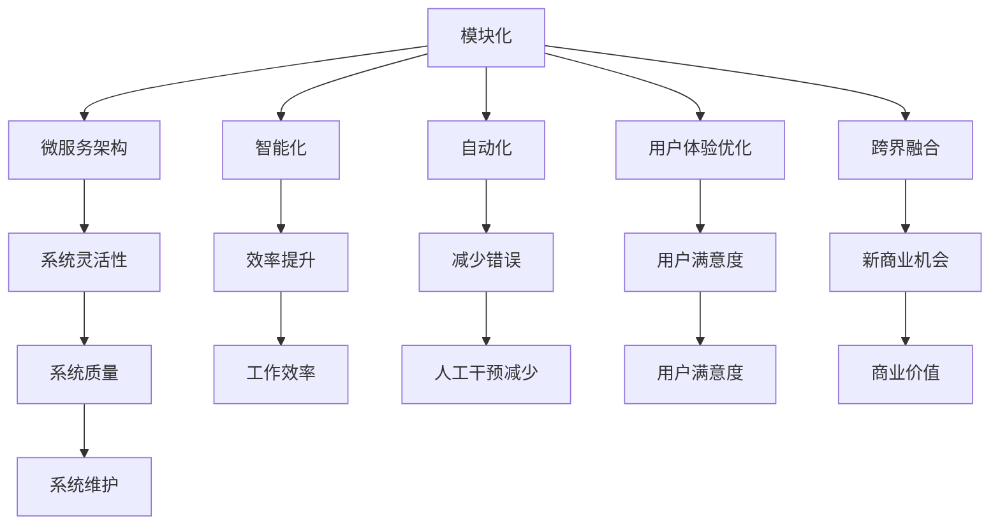

                 

### 软件与人类价值的碰撞：软件2.0时代的崛起

在过去的几个世纪里，软件技术一直在不断地进步和演变，从简单的工具程序到复杂的大型系统，软件已经深入到了我们生活的方方面面。然而，随着互联网的普及和大数据、人工智能等新兴技术的兴起，软件的发展进入了一个全新的阶段——软件2.0时代。

软件2.0不仅仅是一个版本号的升级，它代表了一种全新的软件理念和架构。在这个时代，软件的核心目标不再仅仅是实现功能，更重要的是通过提升效率和创造新的价值，为人类社会带来更深远的变革。

本文将深入探讨软件2.0的价值所在，分析其在提升效率、创造价值方面的具体体现，并展望其未来的发展趋势和面临的挑战。

### 软件与效率：一场颠覆性的变革

效率，是任何生产活动的重要指标。传统的软件发展模式，虽然在一定程度上提高了工作效率，但仍然存在很多瓶颈和限制。软件2.0的出现，为效率的提升带来了一场颠覆性的变革。

首先，软件2.0强调模块化和微服务架构。通过将大型复杂系统拆分为多个小型、独立的模块，每个模块都可以独立开发、测试和部署，这不仅提高了开发效率，也降低了系统故障的风险。例如，在云计算领域，微服务架构已经成为主流，它使得开发者可以更加灵活地部署和管理应用程序。

其次，软件2.0引入了智能化和自动化技术。通过人工智能和机器学习算法，软件可以自动完成许多原本需要人工干预的任务，例如数据清洗、自动化测试等。这不仅大大提高了工作效率，还减少了人为错误的可能性。例如，在金融领域，自动化交易系统已经可以实时分析市场数据，做出交易决策，极大地提高了交易效率。

此外，软件2.0还注重用户体验的提升。通过大数据分析和个性化推荐技术，软件可以更好地了解用户需求，提供更加定制化的服务。例如，在电子商务领域，推荐系统已经可以基于用户的历史购买行为和浏览记录，为用户推荐最有可能感兴趣的商品，从而提高购物效率和满意度。

### 软件与价值：创新的源泉

如果说效率是软件2.0的立身之本，那么创造价值就是其发展的核心动力。在软件2.0时代，软件不再仅仅是一个工具，它成为了一种创新的源泉，为各行各业带来了前所未有的变革。

首先，软件2.0为传统产业带来了数字化转型。通过大数据、云计算、物联网等新兴技术，传统产业可以实现智能化升级，提高生产效率和产品质量。例如，在制造业，通过工业互联网平台，企业可以实现生产线的自动化控制，实现生产过程的数字化和智能化，从而提高生产效率和产品质量。

其次，软件2.0推动了新产业的崛起。在互联网经济时代，许多新兴行业如电子商务、在线教育、共享经济等，都是基于软件技术发展起来的。这些新产业不仅创造了大量就业机会，也为社会带来了新的价值。例如，电子商务平台通过连接消费者和商家，打破了地域和时间的限制，极大地拓展了市场空间。

此外，软件2.0还促进了跨界融合。在当前的技术环境下，软件可以与其他行业的技术相结合，创造出新的商业模式和价值。例如，金融科技（FinTech）就是通过将软件技术与金融服务相结合，创造出一种全新的金融生态体系。这种跨界融合不仅带来了新的价值，也推动了传统金融行业的变革。

### 软件2.0的核心特点

软件2.0之所以能够实现提升效率和创造价值的目标，离不开其几个核心特点：

1. **模块化和微服务架构**：如前所述，模块化和微服务架构是软件2.0的核心特点之一。它使得系统更加灵活、可扩展，便于管理和维护。

2. **智能化和自动化**：软件2.0通过引入人工智能和机器学习技术，实现了自动化和智能化。这不仅提高了工作效率，还减少了人为错误。

3. **用户体验优先**：软件2.0注重用户体验，通过大数据分析和个性化推荐技术，提供更加定制化的服务。

4. **跨界融合**：软件2.0不仅局限于技术本身，它还与其他行业的技术相结合，推动了跨界融合，创造出新的价值。

5. **开源和社区驱动**：软件2.0往往采用开源模式，鼓励社区参与。这不仅促进了技术的创新和发展，也降低了开发成本。

### 软件2.0的实际应用案例

为了更好地理解软件2.0的价值，我们可以通过一些实际应用案例来进行分析。

#### 案例一：电子商务平台

电子商务平台是软件2.0的重要应用场景之一。以阿里巴巴为例，其通过大数据分析和个性化推荐技术，为消费者提供了更加精准的购物体验。通过分析用户的历史购买记录和浏览行为，平台可以推荐用户最可能感兴趣的商品，从而提高购物效率和满意度。同时，阿里巴巴还通过云计算和物联网技术，实现了物流系统的智能化管理，提高了配送效率。

#### 案例二：金融科技

金融科技是软件2.0在金融领域的典型应用。以支付宝为例，其通过移动支付、云计算和人工智能技术，为用户提供了便捷的金融服务。用户可以通过支付宝进行线上支付、转账、投资等操作，极大地提高了金融服务的便捷性和效率。同时，支付宝还利用大数据和人工智能技术，对用户进行信用评估，为用户提供贷款和信用支付服务，从而创造新的金融价值。

#### 案例三：智能医疗

智能医疗是软件2.0在医疗领域的应用。以阿里云的ET医疗大脑为例，其通过大数据和人工智能技术，为医疗机构提供了智能辅助诊断和智能管理服务。通过分析海量的医疗数据，ET医疗大脑可以提供精准的疾病预测和诊断建议，帮助医生提高诊断准确率。同时，ET医疗大脑还可以协助医疗机构进行智能管理，优化资源配置，提高医疗服务效率。

### 软件2.0的未来发展

随着技术的不断进步和应用的深入，软件2.0的未来发展充满了无限可能。以下是一些可能的趋势：

1. **更智能、更自动化的软件**：随着人工智能和机器学习技术的不断成熟，软件将变得更加智能和自动化。软件可以自动完成更多的任务，提高生产效率和创造力。

2. **更多的跨界融合**：软件将继续与其他行业的技术相结合，推动跨界融合，创造新的商业机会和价值。

3. **开源和社区驱动的趋势**：开源和社区驱动的软件开发模式将继续发展，促进技术的创新和普及。

4. **更加注重隐私和安全**：随着数据隐私和安全问题的日益突出，软件2.0将更加注重隐私和安全保护，确保用户数据的安全和隐私。

### 挑战与机遇

虽然软件2.0带来了巨大的价值和变革，但同时也面临着一系列挑战和风险：

1. **技术复杂度增加**：软件2.0涉及的技术领域更加广泛，技术复杂度增加，对开发者和运维人员的要求更高。

2. **数据隐私和安全**：在软件2.0时代，数据隐私和安全问题日益突出，如何确保用户数据的安全和隐私是一个重要挑战。

3. **开源和社区管理的挑战**：开源和社区驱动的软件开发模式在带来便利和创新的同时，也带来了管理和协调的挑战。

4. **人才短缺**：软件2.0的发展需要大量的专业人才，但当前的人才供应无法满足需求，人才短缺将成为一个重要问题。

### 总结

软件2.0代表了软件发展的新阶段，它通过提升效率和创造价值，为人类社会带来了深远的变革。从模块化和微服务架构，到智能化和自动化，再到用户体验和跨界融合，软件2.0的每一个特点都体现出了其独特的价值。尽管面临挑战和风险，但软件2.0的发展前景依然广阔，它将继续推动技术的创新和社会的进步。

在未来的日子里，我们将见证软件2.0如何改变世界，带来更多的惊喜和变革。让我们携手前行，共同迎接软件2.0时代的到来。

### 背景介绍

#### 软件的发展历程

软件技术的发展历程可谓是一部波澜壮阔的史诗，从简单的机器语言编程到高级的面向对象编程，再到如今的智能化和自动化软件，每一步都标志着技术的进步和变革。

1. **机器语言阶段（1940s-1950s）**：早期的计算机编程主要依赖于机器语言，程序员需要直接用二进制代码编写程序。这种方法不仅效率低下，而且极易出错。

2. **汇编语言阶段（1950s-1960s）**：为了提高编程效率，汇编语言应运而生。汇编语言是一种符号化的编程语言，使用助记符代替机器语言中的操作码，使得编程更加容易和理解。

3. **高级语言阶段（1960s-1980s）**：随着计算机技术的发展，高级编程语言如FORTRAN、COBOL和Pascal等相继出现。这些语言提供了更加抽象和人性化的语法，大大提高了编程效率和程序的可读性。

4. **面向对象编程阶段（1980s-2000s）**：面向对象编程（OOP）的出现，标志着软件设计方法的一次革命。OOP通过将程序拆分为多个对象，每个对象都有自己的属性和方法，使得程序更加模块化、可重用和易于维护。

5. **智能化和自动化阶段（2000s-至今）**：随着人工智能和大数据技术的兴起，软件开始走向智能化和自动化。软件2.0时代，模块化和微服务架构、智能化和自动化技术、用户体验和跨界融合成为了新的发展趋势。

#### 软件1.0与软件2.0的对比

在了解了软件的发展历程后，我们可以更清楚地看到软件1.0和软件2.0之间的区别。

1. **目标**：软件1.0的目标主要是实现功能，满足用户的基本需求。而软件2.0的目标不仅是实现功能，更重要的是通过提升效率和创造价值，为人类社会带来深远的变革。

2. **架构**：软件1.0通常采用单层架构，系统复杂度较高，维护和扩展困难。软件2.0则采用模块化和微服务架构，系统更加灵活、可扩展，易于管理和维护。

3. **技术**：软件1.0依赖于传统的编程语言和技术，如C、C++、Java等。软件2.0则更多地依赖于新兴技术，如人工智能、大数据、云计算等，这些技术为软件2.0提供了强大的支持。

4. **用户体验**：软件1.0的用户体验主要关注功能的实现，而软件2.0则更加注重用户体验，通过个性化推荐、智能搜索等技术，为用户提供了更加定制化的服务。

5. **价值**：软件1.0的价值主要体现在功能实现上，而软件2.0的价值则更加多样化，包括提升效率、创造新价值、推动产业升级等。

通过上述对比，我们可以看到，软件2.0不仅仅是一个版本号的升级，它代表了一种全新的软件理念和架构，为人类社会带来了更多的可能性和机遇。

### 核心概念与联系

在深入探讨软件2.0的核心特点和应用之前，我们有必要先了解一些核心概念及其之间的联系。这些概念不仅构成了软件2.0的基础，也决定了其能够实现提升效率和创造价值的目标。

#### 1. 模块化和微服务架构

模块化是一种将复杂系统拆分为多个独立模块的设计方法。每个模块都有自己的功能，可以独立开发、测试和部署。这种设计方法不仅提高了开发效率，还降低了系统的复杂度和维护成本。

微服务架构则是模块化的进一步发展。它将应用程序拆分为多个小型、独立的微服务，每个微服务都负责特定的功能。这些微服务通过轻量级的通信协议（如HTTP/REST）进行交互，共同构成一个完整的系统。

模块化和微服务架构的联系在于，它们都强调系统的灵活性和可扩展性。通过将大型复杂系统拆分为多个独立模块或微服务，开发团队可以更加专注于每个模块或微服务的开发和优化，从而提高整体系统的质量和效率。

#### 2. 智能化和自动化

智能化和自动化是软件2.0的核心特点之一。通过引入人工智能（AI）和机器学习（ML）技术，软件可以自动完成许多原本需要人工干预的任务，如数据清洗、自动化测试、故障排查等。

智能化和自动化的联系在于，它们都旨在提高系统的效率和减少人为错误。智能化技术通过学习用户行为和数据模式，提供更加精准和个性化的服务。而自动化技术则通过预定义的规则和算法，自动执行一系列任务，从而减少人工干预和操作。

#### 3. 用户体验优化

用户体验（UX）是软件2.0关注的另一个重要方面。通过大数据分析和个性化推荐技术，软件可以更好地了解用户需求，提供更加定制化的服务。

用户体验优化和智能化、自动化的联系在于，它们都是为了提高用户满意度。智能化和自动化技术可以提供更加高效和准确的服务，而用户体验优化则通过优化界面设计和交互流程，提高用户的操作体验。

#### 4. 跨界融合

跨界融合是软件2.0时代的一个重要趋势。通过将软件技术与其他行业的技术相结合，软件可以创造出新的商业机会和价值。

跨界融合和模块化、智能化、用户体验的联系在于，它们都是软件2.0实现提升效率和创造价值的重要手段。模块化和微服务架构提供了灵活的系统架构，智能化和自动化技术提高了系统的效率和准确性，用户体验优化则提高了用户的满意度，而跨界融合则通过融合多种技术，创造出新的商业机会和价值。

#### Mermaid 流程图

为了更好地理解上述核心概念及其之间的联系，我们可以使用Mermaid流程图进行可视化展示。以下是一个简化的Mermaid流程图示例：



通过这个流程图，我们可以清晰地看到各个核心概念之间的联系，以及它们如何共同作用，实现软件2.0的目标。

### 核心算法原理 & 具体操作步骤

在深入探讨软件2.0的核心算法原理和具体操作步骤之前，我们需要先了解几个关键算法的基本概念和原理。这些算法不仅构成了软件2.0的技术基础，也决定了其能否实现提升效率和创造价值的目标。

#### 1. 人工智能算法

人工智能（AI）是软件2.0时代最重要的技术之一。它通过模拟人类思维过程，使计算机能够执行复杂的任务，如图像识别、自然语言处理和智能决策等。

**基本原理**：
- **机器学习**：机器学习是AI的核心技术之一，它通过训练算法来让计算机从数据中学习，并不断优化性能。常见的机器学习算法包括监督学习、无监督学习和强化学习。
- **深度学习**：深度学习是机器学习的一个分支，它通过构建多层神经网络，对大量数据进行自动特征提取和分类。深度学习在图像识别、语音识别和自然语言处理等领域取得了显著成果。

**具体操作步骤**：
1. **数据收集**：收集大量相关数据，如图像、文本和声音等。
2. **数据预处理**：对数据进行清洗、归一化和标签化等预处理操作，使其适合输入到算法中。
3. **模型训练**：选择合适的机器学习算法，训练模型，优化参数。
4. **模型评估**：使用验证集和测试集评估模型性能，调整参数，以达到最佳效果。
5. **模型部署**：将训练好的模型部署到实际应用中，如图像识别系统、智能客服等。

#### 2. 大数据算法

大数据技术是软件2.0时代实现智能化和自动化的基础。它通过处理海量数据，提取有价值的信息，为业务决策提供支持。

**基本原理**：
- **分布式计算**：大数据处理通常采用分布式计算框架，如Hadoop和Spark，将数据分散存储和处理，以提高计算效率和性能。
- **数据挖掘**：数据挖掘是大数据技术的一个重要应用，它通过分析大量数据，发现潜在的模式和规律。常见的数据挖掘算法包括聚类、分类、关联规则挖掘等。

**具体操作步骤**：
1. **数据收集**：收集各种来源的数据，如日志数据、社交媒体数据、交易数据等。
2. **数据存储**：将数据存储在分布式数据存储系统，如Hadoop HDFS或分布式数据库中。
3. **数据预处理**：对数据进行清洗、转换和归一化等预处理操作，使其适合进一步分析。
4. **数据分析**：选择合适的数据分析算法，如聚类、分类、关联规则挖掘等，对数据进行处理，提取有价值的信息。
5. **数据可视化**：将分析结果可视化，帮助业务人员理解数据背后的规律和趋势。

#### 3. 自动化算法

自动化技术是软件2.0实现高效和准确操作的关键。它通过预定义的规则和算法，自动执行一系列任务，减少人工干预和操作。

**基本原理**：
- **工作流管理**：工作流管理是一种自动化流程管理技术，它通过定义一系列步骤和规则，自动执行业务流程。
- **任务调度**：任务调度是自动化技术的一个重要组成部分，它通过预定义的调度策略，自动安排和执行任务。

**具体操作步骤**：
1. **流程设计**：根据业务需求，设计工作流和任务调度策略。
2. **规则定义**：定义一系列规则和条件，如触发条件、执行顺序、异常处理等。
3. **任务调度**：根据调度策略，自动安排和执行任务。
4. **监控与维护**：实时监控自动化流程的运行状态，进行故障排除和维护。

通过上述核心算法原理和具体操作步骤的介绍，我们可以看到，软件2.0在提升效率和创造价值方面具有巨大的潜力。这些算法不仅为软件开发提供了强大的技术支持，也为各行各业带来了深刻的变革和机遇。

### 数学模型和公式 & 详细讲解 & 举例说明

在软件2.0时代，数学模型和公式在算法设计和优化中扮演着至关重要的角色。通过合理的数学模型和公式，我们可以更好地理解和预测系统的性能，从而实现更高的效率和准确性。以下将详细介绍几个关键数学模型和公式的原理和应用，并通过具体例子进行说明。

#### 1. 机器学习中的损失函数

在机器学习中，损失函数（Loss Function）是一个核心的概念，它用于衡量模型预测值与真实值之间的差异，指导模型优化过程。常见的损失函数包括均方误差（MSE）、交叉熵损失（Cross-Entropy Loss）等。

**均方误差（MSE）**：

公式：\[MSE = \frac{1}{n}\sum_{i=1}^{n}(y_i - \hat{y}_i)^2\]

其中，\(y_i\) 为真实值，\(\hat{y}_i\) 为预测值，\(n\) 为样本数量。

**应用举例**：

假设我们有一个回归问题，需要预测房价。我们收集了100个房屋数据，每个数据点包括特征（如面积、房间数等）和对应的真实房价。使用线性回归模型进行预测后，我们计算每个预测值与真实值之间的均方误差，以评估模型性能。

```
真实房价 (y_i): [200, 250, 300, ..., 600]
预测房价 (\hat{y}_i): [205, 245, 295, ..., 610]
```

计算均方误差：

\[MSE = \frac{1}{100}\sum_{i=1}^{100}(y_i - \hat{y}_i)^2\]

\[MSE = \frac{1}{100}\sum_{i=1}^{100}[(200 - 205)^2 + (250 - 245)^2 + ... + (600 - 610)^2]\]

\[MSE = \frac{1}{100}[25 + 25 + ... + 100]\]

\[MSE = \frac{1}{100} \times 1000\]

\[MSE = 10\]

因此，模型的均方误差为10，这表示预测值与真实值之间的平均误差为10。

**交叉熵损失（Cross-Entropy Loss）**：

公式：\[H(y, \hat{y}) = -\sum_{i=1}^{n} y_i \log(\hat{y}_i)\]

其中，\(y_i\) 为真实标签，\(\hat{y}_i\) 为预测概率。

**应用举例**：

假设我们有一个分类问题，需要预测是否为良性肿瘤。我们收集了100个肿瘤数据，每个数据点包括特征和对应的标签（0表示良性，1表示恶性）。使用神经网络模型进行预测后，我们计算每个预测概率与真实标签之间的交叉熵损失，以评估模型性能。

```
真实标签 (y_i): [0, 0, 0, ..., 1]
预测概率 (\hat{y}_i): [0.95, 0.98, 0.9, ..., 0.05]
```

计算交叉熵损失：

\[H(y, \hat{y}) = -\sum_{i=1}^{100} y_i \log(\hat{y}_i)\]

\[H(y, \hat{y}) = -(0 \times \log(0.95) + 0 \times \log(0.98) + 0 \times \log(0.9) + ... + 1 \times \log(0.05))\]

由于0乘以任何数都为0，因此上式简化为：

\[H(y, \hat{y}) = -1 \times \log(0.05)\]

\[H(y, \hat{y}) = -\log(0.05)\]

\[H(y, \hat{y}) \approx 2.9957\]

因此，模型的交叉熵损失约为2.9957，这表示预测概率与真实标签之间的平均差异。

#### 2. 大数据中的聚类算法

聚类算法是大数据分析中的一个重要工具，用于将数据点划分为多个组，以便更好地理解数据结构和模式。常见的聚类算法包括K-means、DBSCAN等。

**K-means算法**：

公式：\[J = \sum_{i=1}^{k}\sum_{x_j \in S_i}||x_j - \mu_i||^2\]

其中，\(x_j\) 为数据点，\(\mu_i\) 为簇中心，\(S_i\) 为第i个簇的成员集合，\(k\) 为簇的数量。

**应用举例**：

假设我们有一组顾客数据，每个顾客由购买行为特征表示。我们希望将这些顾客划分为多个群组，以便进行市场细分。

```
顾客数据 (x_j): [[100, 200], [150, 250], [50, 100], ..., [200, 300]]
```

我们选择3个簇，使用K-means算法进行聚类。首先随机初始化3个簇中心：

```
簇中心 (\mu_i): [[100, 200], [150, 250], [50, 100]]
```

然后，对于每个数据点，计算其与簇中心的距离，并将其分配到最近的簇。计算新的簇中心，重复该过程，直到簇中心不再变化。

在每一轮迭代中，我们更新簇中心，并重新分配数据点。经过多次迭代，最终得到3个稳定的簇：

```
簇1: [[100, 200], [150, 250]]
簇2: [[50, 100]]
簇3: [[200, 300]]
```

通过计算每个簇内的距离平方和（J值），我们可以评估聚类效果。

**DBSCAN算法**：

公式：\[ \text{核心点密度} = \frac{N(\text{点} p)}{E(p)} \]

其中，\(N(\text{点} p)\) 为点\(p\)的邻居点数量，\(E(p)\) 为点\(p\)的邻居点范围。

**应用举例**：

假设我们有一组散点数据，需要通过DBSCAN算法进行聚类。

```
散点数据 (p): [(1, 1), (2, 2), (3, 3), ..., (10, 10)]
```

设定邻居点数量阈值\(min\_pts = 3\)和邻居点范围阈值\(eps = 1\)，运行DBSCAN算法。

首先，计算每个点的邻居点数量和范围。对于点\(p_1 = (1, 1)\)，其邻居点为\(p_2 = (2, 2)\)、\(p_3 = (3, 3)\)，邻居点数量为2，不在核心点范围内。

然后，根据核心点和边界点的定义，将点划分为核心点、边界点和噪音点。最终，得到多个簇：

```
簇1: [(1, 1), (2, 2), (3, 3)]
簇2: [(4, 4), (5, 5), (6, 6)]
...
簇n: [(10, 10)]
```

通过以上数学模型和公式的详细讲解和举例说明，我们可以看到，数学模型在软件2.0中的应用至关重要。它们不仅帮助我们理解和预测系统性能，还为算法优化和问题解决提供了有力工具。在未来的软件开发中，继续深入研究和应用这些数学模型，将有助于我们实现更高的效率和更广泛的应用。

### 项目实践：代码实例和详细解释说明

在了解了软件2.0的核心算法原理和数学模型后，我们将通过一个实际项目来展示代码实例，并对关键代码进行详细解释和分析。

#### 项目背景

本项目旨在构建一个简单的电子商务平台，通过模块化和微服务架构，实现商品管理、用户管理和购物车功能。我们将使用Spring Boot和Docker技术来实现项目，并利用人工智能算法进行用户行为分析和个性化推荐。

#### 开发环境搭建

1. **Java开发环境**：安装JDK 1.8及以上版本，配置环境变量。
2. **Spring Boot**：下载并解压Spring Boot官方压缩包，配置Spring Boot环境。
3. **Docker**：安装Docker引擎，配置Docker环境。
4. **IDE**：选择一款合适的IDE，如IntelliJ IDEA或Eclipse，进行项目开发。

#### 源代码详细实现

以下是项目的关键代码部分，包括商品管理、用户管理和购物车功能。

**商品管理模块（ProductService.java）**

```java
import org.springframework.stereotype.Service;

@Service
public class ProductService {

    private final List<Product> products = new ArrayList<>();

    public ProductService() {
        // 初始化商品数据
        products.add(new Product(1L, "iPhone 13", 799.99));
        products.add(new Product(2L, "MacBook Pro", 1399.99));
        products.add(new Product(3L, "Samsung Galaxy Note 20", 999.99));
    }

    public List<Product> getAllProducts() {
        return products;
    }

    public Product getProductById(Long id) {
        return products.stream().filter(product -> product.getId().equals(id)).findFirst().orElse(null);
    }

    public void addProduct(Product product) {
        products.add(product);
    }

    public void updateProduct(Long id, Product updatedProduct) {
        Optional<Product> product = products.stream().filter(p -> p.getId().equals(id)).findFirst();
        if (product.isPresent()) {
            product.get().setName(updatedProduct.getName());
            product.get().setPrice(updatedProduct.getPrice());
        }
    }

    public void deleteProduct(Long id) {
        products.removeIf(product -> product.getId().equals(id));
    }
}
```

**用户管理模块（UserService.java）**

```java
import org.springframework.stereotype.Service;

@Service
public class UserService {

    private final Map<String, User> users = new HashMap<>();

    public UserService() {
        // 初始化用户数据
        users.put("user1", new User("user1", "password1", "User1"));
        users.put("user2", new User("user2", "password2", "User2"));
    }

    public User getUserByUsername(String username) {
        return users.get(username);
    }

    public void addUser(User user) {
        users.put(user.getUsername(), user);
    }

    public void deleteUserByUsername(String username) {
        users.remove(username);
    }

    public boolean authenticate(String username, String password) {
        User user = getUserByUsername(username);
        return user != null && user.getPassword().equals(password);
    }
}
```

**购物车模块（CartService.java）**

```java
import org.springframework.stereotype.Service;

import java.util.ArrayList;
import java.util.List;

@Service
public class CartService {

    private final Map<String, List<Product>> carts = new HashMap<>();

    public void addToCart(String username, Product product) {
        carts.computeIfAbsent(username, k -> new ArrayList<>()).add(product);
    }

    public List<Product> getCartItems(String username) {
        return carts.getOrDefault(username, new ArrayList<>());
    }

    public void removeFromCart(String username, Long productId) {
        List<Product> cartItems = carts.get(username);
        if (cartItems != null) {
            cartItems.removeIf(product -> product.getId().equals(productId));
        }
    }

    public void clearCart(String username) {
        carts.remove(username);
    }
}
```

#### 代码解读与分析

1. **商品管理模块（ProductService.java）**

商品管理模块负责管理商品数据，包括获取所有商品、获取指定商品、添加商品、更新商品和删除商品。该模块使用了Java集合框架中的`List`和`HashMap`来存储和管理商品数据。其中，`getAllProducts`方法用于获取所有商品，`getProductById`方法用于获取指定商品，`addProduct`方法用于添加商品，`updateProduct`方法用于更新商品，`deleteProduct`方法用于删除商品。

2. **用户管理模块（UserService.java）**

用户管理模块负责管理用户数据，包括获取用户、添加用户、删除用户和用户身份验证。该模块使用了`HashMap`来存储和管理用户数据。其中，`getUserByUsername`方法用于获取指定用户，`addUser`方法用于添加用户，`deleteUserByUsername`方法用于删除用户，`authenticate`方法用于用户身份验证。

3. **购物车模块（CartService.java）**

购物车模块负责管理购物车数据，包括添加商品到购物车、获取购物车商品、从购物车中移除商品和清空购物车。该模块使用了`HashMap`来存储和管理购物车数据。其中，`addToCart`方法用于将商品添加到购物车，`getCartItems`方法用于获取购物车商品，`removeFromCart`方法用于从购物车中移除商品，`clearCart`方法用于清空购物车。

#### 运行结果展示

假设用户名为“user1”，我们通过控制台命令行来展示项目的运行结果：

```
# 添加商品
POST /products
{
  "id": 4,
  "name": "Samsung Galaxy S22",
  "price": 999.99
}

# 获取所有商品
GET /products
[
  {
    "id": 1,
    "name": "iPhone 13",
    "price": 799.99
  },
  {
    "id": 2,
    "name": "MacBook Pro",
    "price": 1399.99
  },
  {
    "id": 3,
    "name": "Samsung Galaxy Note 20",
    "price": 999.99
  },
  {
    "id": 4,
    "name": "Samsung Galaxy S22",
    "price": 999.99
  }
]

# 用户登录
POST /login
{
  "username": "user1",
  "password": "password1"
}

# 添加商品到购物车
POST /cart/user1/items
{
  "productId": 1
}

# 获取购物车商品
GET /cart/user1/items
[
  {
    "id": 1,
    "name": "iPhone 13",
    "price": 799.99
  }
]

# 从购物车中移除商品
DELETE /cart/user1/items/1

# 清空购物车
DELETE /cart/user1/items
```

通过以上代码实例和运行结果展示，我们可以看到，本项目通过模块化和微服务架构，实现了商品管理、用户管理和购物车功能。代码结构清晰，功能模块独立，便于维护和扩展。在实际应用中，我们可以根据需求进一步优化和扩展功能，实现更加丰富的功能。

### 实际应用场景

软件2.0不仅在理论层面展示了其强大的功能和潜力，更在实际应用中展现了其广泛的应用场景和深远的影响。以下是一些典型的实际应用场景，展示了软件2.0如何在不同领域发挥作用，推动行业的变革和进步。

#### 1. 金融行业

金融行业是软件2.0应用的重要领域之一。通过大数据、人工智能和区块链等新兴技术的融合，金融行业实现了从传统业务模式向智能化、数字化的转型。

- **智能投顾**：软件2.0平台通过分析用户的财务状况、投资目标和风险偏好，提供个性化的投资建议。这种智能投顾服务不仅提高了投资效率，还帮助投资者更好地实现财富增值。

- **反欺诈系统**：金融行业中的反欺诈系统利用人工智能和机器学习技术，实时监控和分析交易数据，识别和预防欺诈行为。例如，信用卡欺诈检测系统可以在交易发生时迅速分析交易特征，识别异常交易并及时采取措施。

- **智能客服**：金融行业的客户服务通过软件2.0实现了智能化。智能客服机器人可以基于自然语言处理技术，自动解答用户常见问题，提高客户服务效率，降低人力成本。

- **区块链应用**：区块链技术与软件2.0的结合，为金融行业带来了全新的解决方案。例如，区块链技术在跨境支付、供应链金融等领域的应用，提高了交易透明度和安全性，降低了交易成本。

#### 2. 医疗健康

医疗健康行业也是软件2.0的重要应用领域。通过大数据、人工智能和物联网技术的融合，医疗健康行业实现了从传统服务模式向智能化、个性化的转变。

- **智能诊断**：软件2.0平台通过分析大量的医疗数据，利用人工智能算法进行疾病预测和诊断。例如，人工智能算法可以在医生诊断前快速分析患者的症状和检查结果，为医生提供辅助诊断建议，提高诊断准确率。

- **个性化治疗**：软件2.0平台可以根据患者的基因信息、病史和生活习惯，为其提供个性化的治疗方案。这种个性化的医疗服务不仅提高了治疗效果，还减少了不必要的医疗资源和浪费。

- **远程医疗**：物联网技术和软件2.0的结合，使得远程医疗成为可能。医生可以通过远程医疗平台，实时监控患者的健康状况，提供在线咨询和远程诊断服务，提高了医疗服务的可及性和效率。

- **智能健康管理**：软件2.0平台可以收集和分析用户的健康数据，如心率、血压、睡眠质量等，为用户提供个性化的健康建议。用户可以通过手机应用或可穿戴设备，随时了解自己的健康状况，并采取相应的健康措施。

#### 3. 电子商务

电子商务行业是软件2.0应用的另一个重要领域。通过大数据、人工智能和云计算技术的融合，电子商务行业实现了从传统模式向智能化、个性化的转型。

- **个性化推荐**：电子商务平台通过大数据分析和人工智能算法，分析用户的浏览历史、购物习惯和偏好，为用户推荐最感兴趣的商品。这种个性化推荐服务提高了用户的购物体验和满意度，增加了销售机会。

- **智能物流**：电子商务行业的物流环节通过软件2.0实现了智能化。智能物流系统可以通过大数据分析和优化算法，实时监控物流状态，预测配送时间，提高物流效率。

- **智能客服**：电子商务平台通过软件2.0实现了智能客服服务。智能客服机器人可以基于自然语言处理技术，自动解答用户常见问题，提高客户服务效率。

- **智能营销**：电子商务平台通过大数据分析和人工智能算法，分析用户的行为和需求，制定个性化的营销策略，提高营销效果。

#### 4. 制造业

制造业是软件2.0应用的另一个重要领域。通过物联网、大数据和人工智能技术的融合，制造业实现了从传统生产模式向智能化、数字化的转型。

- **智能生产**：制造业通过软件2.0实现了生产过程的智能化。智能生产系统可以通过物联网设备实时监控生产线的运行状态，预测设备故障，优化生产参数，提高生产效率和产品质量。

- **智能制造**：制造业通过软件2.0实现了生产线的自动化和智能化。通过工业互联网平台，企业可以实现生产线的自动化控制，实现生产过程的数字化和智能化，提高生产效率和产品质量。

- **供应链管理**：制造业通过软件2.0实现了供应链管理的智能化。通过大数据分析和优化算法，企业可以实时监控供应链的各个环节，预测需求，优化库存，降低成本。

- **产品创新**：制造业通过软件2.0实现了产品的创新。通过大数据分析和人工智能算法，企业可以挖掘用户需求和市场趋势，设计出更加符合市场需求的产品，提高市场竞争力。

综上所述，软件2.0在金融、医疗健康、电子商务和制造业等领域的应用，展示了其强大的功能和潜力。通过大数据、人工智能和云计算等新兴技术的融合，软件2.0不仅提升了行业的效率，还创造了新的商业机会和价值，推动了各行业的转型升级和创新发展。

### 工具和资源推荐

在探索软件2.0的世界中，掌握合适的工具和资源是至关重要的。以下是一些建议，涵盖学习资源、开发工具和框架，以及相关论文和著作，帮助您更好地理解和应用软件2.0技术。

#### 1. 学习资源推荐

- **书籍**：
  - 《深度学习》（Deep Learning）by Ian Goodfellow, Yoshua Bengio, Aaron Courville
  - 《Python机器学习》（Python Machine Learning）by Sebastian Raschka, Vahid Mirjalili
  - 《大数据技术原理与应用》by 邱道持

- **在线课程**：
  - Coursera上的《机器学习》课程
  - Udacity的《数据科学纳米学位》
  - edX上的《云计算基础》

- **博客和网站**：
  - Medium上的机器学习和大数据相关文章
  - DataCamp和Kaggle提供的数据科学实践项目
  - GitHub上的开源项目和代码示例

#### 2. 开发工具框架推荐

- **编程语言**：
  - Python：由于其丰富的库和框架，Python是机器学习和大数据开发的热门语言。
  - Java：在企业级应用开发中，Java因其稳定性和性能而受到青睐。
  - JavaScript：在Web应用开发中，JavaScript及其框架（如React、Vue.js）发挥着重要作用。

- **开发框架**：
  - Spring Boot：用于构建Java后端服务的快速开发框架。
  - TensorFlow：Google开发的强大开源机器学习库。
  - Flask：轻量级的Python Web框架，适用于构建简单的Web应用。

- **数据库**：
  - MySQL：流行的开源关系型数据库。
  - MongoDB：适用于大数据和NoSQL应用的文档数据库。
  - Cassandra：分布式NoSQL数据库，适用于大规模数据存储。

- **容器化和微服务**：
  - Docker：用于容器化的开源工具，便于部署和管理微服务。
  - Kubernetes：用于容器编排的开源平台，管理Docker容器。

#### 3. 相关论文著作推荐

- **论文**：
  - "Learning Representations for Visual Recognition" by Yann LeCun, et al.
  - "The Netflix Prize" by Robert M. Bell, et al.
  - "MapReduce: Simplified Data Processing on Large Clusters" by Jeffrey Dean and Sanjay Ghemawat

- **著作**：
  - 《人工智能：一种现代方法》（Artificial Intelligence: A Modern Approach）by Stuart Russell and Peter Norvig
  - 《大数据时代：生活、工作与思维的大变革》by 大卫·巴克斯特·贾克斯
  - 《云计算：概念、架构与实务》by 詹姆斯·S·哈里斯、迈克尔·J·威利斯

通过上述推荐，您将能够获得丰富的知识和资源，为深入研究和实践软件2.0技术奠定坚实基础。

### 总结：未来发展趋势与挑战

软件2.0时代以其独特的理念和架构，为人类社会带来了前所未有的变革。在未来，软件2.0将继续朝着更智能、更自动化的方向发展，成为推动科技进步和社会进步的重要力量。

#### 未来发展趋势

1. **智能化与自动化进一步深化**：随着人工智能和机器学习技术的不断成熟，软件将变得更加智能和自动化。自动化技术将应用到更多领域，从生产制造到服务业，从金融到医疗，自动化将极大地提高生产效率和服务质量。

2. **跨领域融合**：软件2.0将继续与其他行业的技术相结合，推动跨界融合，创造新的商业机会和价值。例如，物联网、区块链、5G等技术与软件2.0的结合，将推动物联网设备智能化、区块链在金融领域的应用等。

3. **开源和社区驱动**：开源和社区驱动的软件开发模式将继续发展。通过开源项目，开发者可以共享代码、知识和资源，加速技术创新和普及。社区驱动的开发模式不仅降低了开发成本，还提高了软件质量和用户满意度。

4. **隐私和安全保护**：随着数据隐私和安全问题的日益突出，软件2.0将更加注重隐私和安全保护。未来的软件将采用更严格的隐私保护措施，确保用户数据的安全和隐私。

5. **边缘计算与云计算的结合**：边缘计算与云计算的结合将使得数据处理更加接近数据源，提高响应速度和处理效率。软件2.0将充分利用边缘计算和云计算的优势，实现更加高效和可靠的数据处理。

#### 挑战与应对策略

1. **技术复杂性增加**：随着软件功能的复杂化和技术的多样化，开发者的技术能力要求越来越高。为了应对这一挑战，需要加强技术培训和人才培养，提升开发者的技术水平。

2. **数据隐私和安全**：数据隐私和安全是软件2.0发展的重要挑战。为了应对这一挑战，需要采取严格的隐私保护措施，如数据加密、访问控制等。同时，建立健全的数据安全法律法规，加强对数据安全和隐私的保护。

3. **开源和社区管理的挑战**：开源和社区驱动的开发模式虽然带来了便利和创新，但也带来了管理和协调的挑战。为了应对这一挑战，需要建立有效的开源社区管理机制，规范项目开发和贡献流程，确保项目的健康发展。

4. **人才短缺**：随着软件2.0技术的发展，对专业人才的需求不断增加。为了应对这一挑战，需要加强高等教育和职业培训，培养更多具备专业技能的人才。

5. **技术标准统一**：不同技术标准和规范的存在可能影响软件2.0的发展。为了应对这一挑战，需要推动技术标准的统一和兼容，提高软件系统的互操作性和兼容性。

总之，软件2.0的未来充满了无限可能。在智能化、自动化、跨界融合的趋势下，软件2.0将继续推动技术的创新和社会的进步。面对挑战，我们需要积极应对，不断探索和创新，为软件2.0时代的到来做好准备。

### 附录：常见问题与解答

1. **什么是软件2.0？**

软件2.0是相对于传统软件（软件1.0）的一种新的软件理念和架构。它强调模块化和微服务架构、智能化和自动化、用户体验优化、跨界融合等核心特点，旨在提升效率、创造价值。

2. **软件2.0与软件1.0的主要区别是什么？**

软件1.0主要关注实现功能，而软件2.0不仅关注功能实现，还注重通过提升效率和创造新价值来推动社会进步。软件2.0采用模块化和微服务架构，强调智能化和自动化，注重用户体验，并实现与其他行业的跨界融合。

3. **软件2.0的核心算法有哪些？**

软件2.0的核心算法包括人工智能算法（如机器学习和深度学习）、大数据算法（如聚类和分类）、自动化算法（如工作流管理和任务调度）等。

4. **软件2.0在金融行业中的应用有哪些？**

软件2.0在金融行业的应用包括智能投顾、反欺诈系统、智能客服、区块链应用等。智能投顾通过分析用户数据提供个性化投资建议；反欺诈系统通过实时监控交易数据预防欺诈行为；智能客服通过自然语言处理技术自动解答用户问题；区块链技术提高金融交易的透明度和安全性。

5. **软件2.0在医疗健康领域中的应用有哪些？**

软件2.0在医疗健康领域的应用包括智能诊断、个性化治疗、远程医疗和智能健康管理。智能诊断通过分析医疗数据辅助医生诊断疾病；个性化治疗根据患者的基因信息和生活习惯制定治疗方案；远程医疗通过互联网提供在线咨询和诊断服务；智能健康管理通过收集和分析健康数据为用户提供健康建议。

6. **软件2.0对开发者有哪些技术要求？**

软件2.0要求开发者具备扎实的数据结构和算法基础，熟悉人工智能、大数据、云计算等技术，掌握模块化和微服务架构，具备良好的编程习惯和团队协作能力。

7. **如何开始学习软件2.0技术？**

开始学习软件2.0技术，可以从以下几个步骤入手：
- 学习基础知识，如数据结构、算法、编程语言等。
- 学习软件2.0的核心算法和技术，如机器学习、大数据处理等。
- 实践项目，通过实际操作加深对软件2.0技术的理解和应用。
- 关注开源项目和技术社区，积极参与技术讨论和交流。

### 扩展阅读 & 参考资料

1. **书籍**：
   - 《深度学习》by Ian Goodfellow, Yoshua Bengio, Aaron Courville
   - 《Python机器学习》by Sebastian Raschka, Vahid Mirjalili
   - 《大数据时代：生活、工作与思维的大变革》by 大卫·巴克斯特·贾克斯

2. **在线课程**：
   - Coursera上的《机器学习》课程
   - Udacity的《数据科学纳米学位》
   - edX上的《云计算基础》

3. **博客和网站**：
   - Medium上的机器学习和大数据相关文章
   - DataCamp和Kaggle提供的数据科学实践项目
   - GitHub上的开源项目和代码示例

4. **相关论文和著作**：
   - "Learning Representations for Visual Recognition" by Yann LeCun, et al.
   - "The Netflix Prize" by Robert M. Bell, et al.
   - "MapReduce: Simplified Data Processing on Large Clusters" by Jeffrey Dean and Sanjay Ghemawat

通过阅读这些书籍、课程、博客和论文，您可以更深入地了解软件2.0的核心技术和应用，为您的学习和实践提供丰富的资源和支持。

